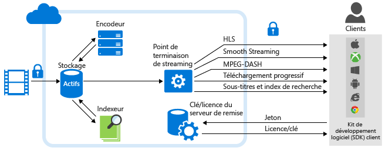

<properties
	pageTitle="Vue d’ensemble d’Azure Media Services Analytics | Microsoft Azure"
	description="Azure Media Services propose Azure Media Analytics en version préliminaire publique. Cet ensemble de services de reconnaissance vocale et de vision par ordinateur destinés aux entreprises répondent aux exigences de conformité, de sécurité et de portée globale. Les services Azure Media Analytics reposent sur les principaux composants de la plateforme Azure Media Services et sont donc immédiatement à même de traiter les données multimédias à l’échelle souhaitée. "
	services="media-services"
	documentationCenter=""
	authors="juliako"
	manager="erikre"
	editor=""/>

<tags
	ms.service="media-services"
	ms.workload="media"
	ms.tgt_pltfrm="na"
	ms.devlang="dotnet"
	ms.topic="article"
	ms.date="06/27/2016"   
	ms.author="milanga;juliako;johndeu"/>

# Vue d’ensemble d’Azure Media Services Analytics

##Vue d’ensemble

Les organisations et les entreprises sont de plus en plus nombreuses à privilégier les supports vidéo pour former leurs employés, susciter l’intérêt de leurs clients et présenter leurs activités commerciales. Le cloud computing facilite le stockage, la diffusion et l’utilisation de ces fichiers multimédias volumineux. Toutefois, face à la croissance continue de leur bibliothèque de contenus vidéo, les entreprises ont besoin d’outils tout aussi efficaces pour créer des vidéos personnalisées et plus adaptées à leurs audiences et pour développer leur activité.

Pour répondre à ce besoin croissant sur le marché, Azure Media Services propose Media Analytics. Il s’agit d’un ensemble de composants de reconnaissance vocale et de vision qui répondent aux besoins des entreprises en termes de conformité, de sécurité et de portée mondiale, et qui aident les organisations et les entreprises à extraire des informations exploitables de leurs fichiers vidéo. Les services Azure Media Analytics reposent sur les principaux composants de la plateforme Azure Media Services et sont donc immédiatement à même de traiter les données multimédias à l’échelle souhaitée.

Avec les services Azure Media Analytics, les développeurs peuvent rapidement commencer à utiliser les fonctionnalités de vision pour la vidéo à une échelle limitée, puis intégrer ces fonctionnalités avancées aux applications et robots. Conçu pour une utilisation en milieu professionnel, Azure Media Analytics répond aux attentes des grandes entreprises en matière d’échelle, de conformité, de sécurité et de portée globale.

Le diagramme suivant montre **Media Analytics** et d’autres parties principales de la plateforme Media Services. Notez que les processeurs multimédias Media Analytics créent des fichiers MP4 ou JSON. Si un processeur multimédia a produit un fichier MP4, vous pouvez télécharger ce dernier progressivement. Si un processeur multimédia a produit un fichier JSON, vous pouvez télécharger ce dernier à partir d’Azure Blob Storage.

## Services Azure Media Analytics

- **Indexeur** : Azure Media Indexer vous permet d’effectuer des recherches dans le contenu et de générer des pistes de sous-titrage. **Azure Media Indexer 2 Preview** est disponible en préversion dans Azure Media Services avec un système d’indexation plus rapide et une prise en charge linguistique plus large. Les langues prises en charge sont l’anglais, l’espagnol, le français, l’allemand, l’italien, le chinois, le portugais et l’arabe. Pour obtenir des informations détaillées et des exemples, consultez [Traiter les vidéos avec l’Indexeur multimédia Azure 2](media-services-process-content-with-indexer2.md).
 
- **Hyperlapse** : Microsoft Hyperlapse est le résultat de plus de 20 ans de recherches réalisées par Microsoft Research (MSR) dans le domaine de la vision par ordinateur. Avec ses fonctionnalités de stabilisation vidéo et de création de séquences en accéléré (time-lapse), Hyperlapse vous permet de créer de superbes vidéos en accéléré, immédiatement diffusables, à partir de vos vidéos plus longues. En plus de la création de vidéos en accéléré, Hyperlapse vous permet de stabiliser des vidéos tremblantes qui ont été prises avec un téléphone portable ou un caméscope. Pour obtenir des informations détaillées et des exemples, consultez [Fichiers multimédia hyperlapse avec Azure Media Hyperlapse](media-services-hyperlapse-content.md)
 
- **Détection de mouvement** : utilisez ce service pour détecter les mouvements dans les vidéos à arrière-plan fixe. Ce service est particulièrement utile pour les clients qui souhaitent identifier les faux positifs sur les événements de mouvement détectés par les caméras de surveillance dans les flux vidéo de surveillance. Pour obtenir des informations détaillées et des exemples, consultez [Détection de mouvement pour Azure Media Analytics](media-services-motion-detection.md).
 
- **Détection des visages et des émotions** : avec ce service, vous pouvez détecter les visages et les émotions qui y sont exprimées, comme la joie, la tristesse, la surprise, la colère, le mépris, la peur, le dégoût et l’indifférence ou la neutralité. Ce service est très utile dans plusieurs secteurs d’activité, comme expliqué plus bas, notamment pour l’agrégation et l’analyse des réactions des personnes participant à un événement. Pour obtenir des informations détaillées et des exemples, consultez [Détection des visages et des émotions pour Azure Media Analytics](media-services-face-and-emotion-detection.md).
 
- **Synthèse de vidéo** : ce service peut vous aider à créer des synthèses de longues vidéos en sélectionnant automatiquement les extraits les plus intéressants de la vidéo source. Elle est utile quand vous voulez offrir une présentation rapide de ce qui se trouve dans une vidéo longue. Pour obtenir des informations détaillées et des exemples, consultez [Utiliser Azure Media Video Thumbnails pour créer une synthèse d’une vidéo](media-services-video-summarization.md).

- **Reconnaissance optique de caractères** - Azure Media Analytics OCR (reconnaissance optique de caractères) vous permet de convertir le contenu texte de fichiers vidéo en un texte numérique modifiable et pouvant faire l’objet d’une recherche. Vous pouvez ainsi automatiser l’extraction de métadonnées explicites à partir du signal vidéo de votre contenu multimédia.
 
 
## Scénarios courants

Voici quelques scénarios où Azure Media Analytics peut aider les organisations et entreprises de différents secteurs à mieux exploiter et cibler leurs contenus vidéo pour susciter l’intérêt de leurs employés et clients, ainsi qu’à améliorer la gestion des gros volumes de contenus vidéo :

- **Centres d’appels** : même avec le développement des médias sociaux, les centres d’appels client sont encore largement utilisés pour faciliter les opérations des services client. Les données audio collectées constituent une mine d’informations sur les clients. Elles peuvent être analysées pour améliorer l’offre de produits, mais aussi pour former les employés des centres d’appels à mieux répondre aux attentes des clients. Avec Azure Media Indexer, les clients peuvent extraire du texte et créer un index de recherche et des tableaux de bord pour connaître les plaintes les plus courantes et leur origine, et obtenir d’autres données utiles.

- **Modération du contenu généré par l’utilisateur** : des médias d’information aux services de police, de nombreuses organisations ont des portails publics sur lesquels est publié du contenu multimédia généré par l’utilisateur, comme des vidéos et des images. Le volume de contenu peut fortement augmenter en raison d’événements inattendus. Dans ce type de scénario, il est presque impossible de vérifier manuellement et correctement la pertinence de tout le contenu. Les clients peuvent déléguer cette tâche au service de modération du contenu pour se concentrer sur le contenu approprié.

- **Surveillance** : le développement des caméras IP a fait exploser le nombre de vidéos de surveillance. L’examen manuel des vidéos de surveillance est long et sujet aux erreurs humaines. Azure Media Analytics fournit plusieurs services, tels que la détection de mouvement, la détection des visages et Hyperlapse, pour faciliter l’examen, la gestion et la création d’éléments dérivés.

## Processeurs multimédia Media Services Analytics 

Cette section répertorie tous les processeurs multimédia Media Services Analytics (MP) et montre comment utiliser .NET ou REST pour obtenir un objet MP.

### Noms MP

- Vue d’ensemble d’Azure Media Indexer 2
- Azure Media Indexer
- Azure Media Hyperlapse
- Détecteur de visage Azure Media
- Détecteur de mouvement Azure Media
- Miniatures vidéo Azure Media
- Azure Media OCR

### .NET

La fonction suivante sélectionne un des noms MP spécifiés et retourne un objet NP.

    static IMediaProcessor GetLatestMediaProcessorByName(string mediaProcessorName)
    {
        var processor = _context.MediaProcessors
            .Where(p => p.Name == mediaProcessorName)
            .ToList()
            .OrderBy(p => new Version(p.Version))
            .LastOrDefault();

        if (processor == null)
            throw new ArgumentException(string.Format("Unknown media processor",
                                                       mediaProcessorName));

        return processor;
    }

## REST

Demande :

	GET https://media.windows.net/api/MediaProcessors()?$filter=Name%20eq%20'Azure%20Media%20OCR' HTTP/1.1
	DataServiceVersion: 1.0;NetFx
	MaxDataServiceVersion: 3.0;NetFx
	Accept: application/json
	Accept-Charset: UTF-8
	User-Agent: Microsoft ADO.NET Data Services
	Authorization: Bearer <token>
	x-ms-version: 2.12
	Host: media.windows.net
	
Réponse :
		
	. . .
	
	{  
	   "odata.metadata":"https://media.windows.net/api/$metadata#MediaProcessors",
	   "value":[  
	      {  
	         "Id":"nb:mpid:UUID:074c3899-d9fb-448f-9ae1-4ebcbe633056",
	         "Description":"Azure Media OCR",
	         "Name":"Azure Media OCR",
	         "Sku":"",
	         "Vendor":"Microsoft",
	         "Version":"1.1"
	      }
	   ]
	}

##Démonstrations

[Démonstrations Azure Media Analytics](http://azuremedialabs.azurewebsites.net/demos/Analytics.html)

##Parcours d’apprentissage de Media Services

[AZURE.INCLUDE [media-services-learning-paths-include](../../includes/media-services-learning-paths-include.md)]

##Fournir des commentaires

[AZURE.INCLUDE [media-services-user-voice-include](../../includes/media-services-user-voice-include.md)]

##Articles connexes

[Annonce concernant Media Services Analytics](https://azure.microsoft.com/blog/introducing-azure-media-analytics/)
  

<!-- Images -->

[overview]: ./media/media-services-video-on-demand-workflow/media-services-video-on-demand.png

<!---HONumber=AcomDC_0629_2016-->