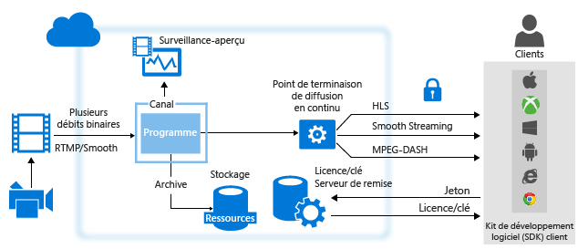
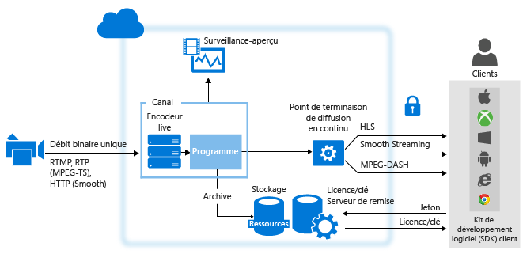

# Vue d’ensemble du streaming en direct à l’aide d’Azure Media Services
## Vue d'ensemble
La diffusion d’événements en flux continu avec Azure Media Services implique généralement les composants suivants :

* Une caméra utilisée pour diffuser un événement.
* Un encodeur vidéo dynamique qui convertit les signaux de la caméra en flux de données qui sont envoyés vers un service de vidéo en flux continu.

    Éventuellement, plusieurs encodeurs live synchronisés. Pour certains événements en direct critiques qui exigent une disponibilité et une qualité d’expérience très élevées, nous vous recommandons d’utiliser des encodeurs redondants en mode actif-actif avec synchronisation date/heure pour obtenir un basculement transparent sans perte de données.
* Service de vidéo en flux continu qui vous permet d’effectuer les opérations suivantes :

  * Recevoir du contenu en direct à l’aide de différents protocoles de diffusion de vidéo en flux continu (par exemple RTMP ou Smooth Streaming),
  * Encoder votre flux en flux à débit adaptatif (facultatif)
  * Afficher un aperçu de votre flux en direct
  * Enregistrer et stocker le contenu ingéré pour le diffuser ultérieurement (vidéo à la demande)
  * Fournir le contenu par le biais des protocoles de diffusion en continu courants (par exemple, MPEG DASH, Smooth, HLS) directement à vos clients ou à un réseau de distribution de contenu (CDN) pour une distribution supplémentaire

**Microsoft Azure Media Services** (AMS) offre la possibilité de recevoir, d’encoder, d’afficher, de stocker et de distribuer votre contenu vidéo en flux continu.

Quand vous distribuez votre contenu aux clients, votre objectif est de distribuer une vidéo de haute qualité à divers appareils dans des conditions de réseau différentes. Pour ce faire, utilisez les encodeurs live pour encoder votre flux dans un flux vidéo à débit binaire multiple (débit binaire adaptatif).  Pour prendre en charge la diffusion en continu sur différents appareils, utilisez l’ [empaquetage dynamique](media-services-dynamic-packaging-overview.md) Media Services pour empaqueter de manière dynamique votre flux dans différents protocoles. Media Services prend en charge la distribution des technologies de streaming à débit adaptatif suivantes : HTTP Live Streaming (HLS), Smooth Streaming, MPEG DASH.

Dans Azure Media Sercices, les **canaux**, les **programmes** et le **point de terminaison de diffusion en continu** gèrent toutes les fonctionnalités vidéo en flux continu, notamment la réception, le formatage, le DVR, la sécurité, l’extensibilité et la redondance.

Un **canal** représente un pipeline de traitement du contenu vidéo en flux continu. Un canal peut recevoir des flux d’entrée live de l’une des manières suivantes :

* Un encodeur en direct local envoie au canal un paquet **RTMP** ou **Smooth Streaming** (MP4 fragmenté) à débit binaire multiple, configuré pour un envoi **direct**. L’envoi **direct** correspond aux flux reçus qui transitent par les **canaux** sans traitement supplémentaire. Vous pouvez utiliser les encodeurs en direct suivants qui produisent un flux Smooth Streaming multidébit : MediaExcel, Ateme, Imagine Communications, Envivio, Cisco et Elemental. Les encodeurs en direct suivants produisent un flux au format RTMP : Adobe Flash Media Live Encoder (FMLE), Telestream Wirecast, Haivision, Teradek et les transcodeurs Tricaster.  Un encodeur live peut également envoyer un flux à débit binaire unique vers un canal qui n’est pas activé pour le Live Encoding, mais ce n’est pas recommandé. Lorsqu’il y est invité, Media Services fournit le flux aux clients.

  > [!NOTE]
  > La méthode pass-through est le moyen le plus économique de diffuser des vidéos en continu si plusieurs événements vous concernent sur une longue période, et si vous avez déjà investi dans des encodeurs locaux. Consultez les détails de la [tarification](https://azure.microsoft.com/pricing/details/media-services/) .
  > 
  > 
* Un encodeur live envoie un flux à vitesse de transmission unique vers le canal activé pour effectuer un encodage live avec Media Services dans l’un des formats suivants : RTMP ou Smooth Streaming (MP4 fragmenté). Le format RTP (MPEG-TS) est également pris en charge, à condition de disposer d’une connexion dédiée au centre de données Azure. Les encodeurs live suivants avec sortie RTMP fonctionnent avec des canaux de ce type : Telestream Wirecast, FMLE. Le canal procède ensuite à l’encodage en temps réel du flux à débit binaire unique entrant en flux vidéo à débit binaire multiple (adaptatif). Lorsqu’il y est invité, Media Services fournit le flux aux clients.

À compter de la version de Media Services 2.10, lorsque vous créez un canal, vous pouvez spécifier la façon dont vous souhaitez qu’il reçoive le flux d’entrée. Vous pouvez également indiquer si vous souhaitez ou non que le canal effectue un encodage en temps réel de votre flux. Deux options s'offrent à vous :

* **Aucun** (pass-through) : indiquez cette valeur si vous envisagez d’utiliser un encodeur live local qui produira des flux à débit binaire multiple (un flux pass-through). Le cas échéant, le flux entrant est transmis à la sortie sans encodage. Il s’agit du comportement d’un canal avant la version 2.10.  
* **Standard** : choisissez cette valeur si vous envisagez d’utiliser Media Services pour encoder votre flux live à débit binaire unique en flux à débit binaire multiple. Cette méthode est plus économique pour une mise à l’échelle rapide pour les événements peu fréquents. N'oubliez pas qu'il existe un impact sur la facturation pour le codage en direct et que laisser un canal d'encodage en temps réel dans l'état « Actif » occasionne des frais de facturation.  Il est recommandé d'arrêter immédiatement vos canaux en cours d'exécution une fois votre événement de diffusion en continu en temps réel terminé pour éviter des frais horaires supplémentaires.

## Comparaison des types de canaux
Le tableau suivant fournit un guide de comparaison des deux types de canaux pris en charge dans Media Services

| Fonctionnalité | Canal pass-through | Canal standard |
| --- | --- | --- |
| L’entrée à débit binaire unique est encodée en plusieurs débits binaires dans le cloud |Non |OUI |
| Résolution maximale, nombre de couches |1080p, 8 couches, plus de 60 i/s |720p, 6 couches, 30 i/s |
| Protocoles d’entrée |RTMP, Smooth Streaming |RTMP, Smooth Streaming et RTP |
| Prix |Consultez la [page de tarification](https://azure.microsoft.com/pricing/details/media-services/) et cliquez sur l’onglet « Vidéo en direct » |Consultez la [page de tarification](https://azure.microsoft.com/pricing/details/media-services/) |
| Durée maximale |24 x&7; |8 heures |
| Prise en charge de l’insertion d’ardoises |Non |OUI |
| Prise en charge de la signalisation des annonces |Non |OUI |
| Légendes CEA 608/708 pass-through |OUI |OUI |
| Capacité de récupération suite à de brèves interruptions du flux de contribution |OUI |Non (défaillance du canal après plus de six secondes sans données d’entrée) |
| Prise en charge des groupes d’images d’entrée non uniformes |OUI |Non. L’entrée doit être constituée de groupes d’images fixes de deux secondes |
| Prise en charge de l’entrée à fréquence d’images variable |OUI |Non. L’entrée doit avoir une fréquence d’images fixe. Les variations mineures sont tolérées, par exemple pendant les scènes à mouvement élevé. Cependant, l’encodeur ne doit pas descendre à 10 images par seconde. |
| Auto-fermeture des canaux en cas de perte du flux d’entrée |Non |Après 12 heures si aucun programme n’est en cours d’exécution |

## Utilisation de canaux recevant un flux continu à débit binaire multiple provenant d’encodeurs locaux (pass-through)
Le diagramme suivant présente les principaux composants de la plateforme AMS impliqués dans ce flux de travail de **méthode directe** .

Pour plus d’informations, consultez [Utilisation des canaux recevant un flux dynamique à débit binaire multiple provenant d’encodeurs locaux](media-services-live-streaming-with-onprem-encoders.md).

## Utilisation de canaux activés pour effectuer un encodage en temps réel avec Azure Media Services
Le schéma suivant illustre les principales parties de la plateforme AMS impliquées dans le flux de travail de vidéo en flux continu où un canal est activé pour effectuer un encodage live avec Media Services.

Pour plus d’informations, consultez [Utilisation de canaux activés pour effectuer un encodage en direct avec Azure Media Services](media-services-manage-live-encoder-enabled-channels.md).

## Description d’un canal et de ses composants associés
### canal
Dans Media Services, les [canaux](https://docs.microsoft.com/rest/api/media/operations/channel)sont responsables du traitement du contenu de vidéo en flux continu. Un canal fournit un point de terminaison d’entrée (URL de réception) que vous fournissez ensuite à un transcodeur live. Le canal reçoit des flux d’entrée live en provenance du transcodeur et les met à disposition pour la diffusion en continu via un ou plusieurs StreamingEndpoints. Les canaux fournissent également un point de terminaison d’aperçu (URL d’aperçu) que vous utilisez pour obtenir un aperçu et valider votre flux avant tout traitement et remise supplémentaires.

Vous pouvez obtenir l’URL de réception et l’URL d’aperçu lors de la création du canal. Pour obtenir ces URL, il n’est pas obligatoire que le canal soit à l’état démarré. Lorsque vous êtes prêt à commencer l’envoi de données à partir d’un transcodeur live dans le canal, celui-ci doit être démarré. Une fois que le transcodeur live a commencé l’ingestion des données, vous pouvez prévisualiser votre flux.

Chaque compte Media Services peut contenir plusieurs canaux, plusieurs programmes et plusieurs StreamingEndpoints. Selon les besoins en matière de bande passante et de sécurité, les services StreamingEndpoint peuvent être affectés à un ou plusieurs canaux. N’importe quel StreamingEndpoint peut assurer l’extraction à partir de n’importe quel canal.

### Programme
Un [programme](https://docs.microsoft.com/rest/api/media/operations/program) vous permet de contrôler la publication et le stockage des segments dans un flux live. Les canaux gèrent des programmes. La relation entre canal et programme est très similaire au contenu multimédia traditionnel où un canal a un flux de contenu constant et un programme est limité à un événement minuté sur ce canal.
Vous pouvez spécifier le nombre d’heures pendant lesquelles vous souhaitez conserver le contenu enregistré pour le programme en définissant la propriété **ArchiveWindowLength** . Cette valeur peut être comprise entre 5 minutes et 25 heures.

ArchiveWindowLength détermine également la durée maximale que les clients peuvent rechercher en arrière à partir de la position dynamique actuelle. Les programmes peuvent durer davantage que le laps de temps spécifié, mais le contenu qui se situe en dehors de la longueur de fenêtre est ignoré en permanence. La valeur de cette propriété détermine également la longueur maximale que les manifestes de client peuvent atteindre.

Chaque programme est associé à un élément multimédia. Pour publier le programme, vous devez créer un localisateur pour l’élément multimédia associé. Le fait de posséder ce localisateur vous permettra de générer une URL de diffusion en continu que vous pourrez fournir à vos clients.

Un canal prend en charge jusqu’à trois programmes exécutés simultanément, ce qui rend possible la création de plusieurs archives du même flux entrant. Cela vous permet de publier et d’archiver différentes parties d’un événement en fonction des besoins. Par exemple, imaginez que vous devez archiver 6 heures d’un programme, mais diffuser uniquement les 10 dernières minutes. Pour ce faire, vous devez créer deux programmes exécutés simultanément. Un programme est configuré pour archiver 6 heures de l’événement, mais il n’est pas publié. L’autre programme est configuré pour archiver pendant 10 minutes et il est publié.

## Implications de facturation
La facturation d’un canal commence dès que son état passe à « En cours d’exécution » via l’API.  

Le tableau suivant montre comment les états du canal sont mappés aux états de facturation dans l’API et le portail Azure. Notez que les états sont légèrement différents entre l'API et le portail. Dès qu’un canal est dans l’état « En cours d’exécution » via l’API, ou dans l’état « Prêt » ou « Diffusion en continu » dans le portail Azure, la facturation est active.

Pour arrêter la facturation, vous devez arrêter le canal via l’API ou dans le portail Azure.
Vous êtes responsable de l’arrêt de vos canaux lorsque vous avez terminé d’utiliser le canal. Ne pas arrêter un canal provoque la facturation continue.

> [!NOTE]
> Lorsque vous travaillez avec des canaux Standard, AMS ferme automatiquement les canaux « en cours d’exécution » 12 heures après la perte du flux d’entrée et l’absence de programmes en cours d’exécution. Toutefois, vous serez toujours facturé pour la durée pendant laquelle le canal était en cours d’exécution.
>
>

### États du canal et mappage au mode de facturation
État actuel d’un canal. Les valeurs possibles incluent :

* **Arrêté**. Ceci est l'état initial du canal après sa création (sauf si le démarrage automatique a été sélectionné dans le portail). Aucune facturation ne survient dans cet état. Dans cet état, les propriétés du canal peuvent être mises à jour, mais la diffusion en continu n’est pas autorisée.
* **Démarrage en cours**. Le canal est en cours de démarrage. Aucune facturation ne survient dans cet état. Aucune mise à jour ou diffusion en continu n’est autorisée durant cet état. Si une erreur se produit, le canal retourne à l’état Arrêté.
* **Exécution en cours**. Le canal est capable de traiter des flux dynamiques. Il facture désormais l'utilisation. Vous devez arrêter le canal pour empêcher toute facturation supplémentaire.
* **En cours d’arrêt**. Le canal est en cours d’arrêt. Aucune facturation ne survient dans cet état de transition. Aucune mise à jour ou diffusion en continu n’est autorisée durant cet état.
* **Suppression en cours**. Le canal est en cours de suppression. Aucune facturation ne survient dans cet état de transition. Aucune mise à jour ou diffusion en continu n’est autorisée durant cet état.

Le tableau suivant montre comment les états du canal sont mappés au mode de facturation.

| État du canal | Indicateurs de l’interface utilisateur du portail | Existe-t-il une facturation ? |
| --- | --- | --- |
| Démarrage en cours |Démarrage en cours |Aucun (état transitoire) |
| Exécution en cours |Prêt (pas de programmes en cours d’exécution) ou Diffusion en continu (au moins un programme en cours d'exécution) |OUI |
| En cours d’arrêt |En cours d’arrêt |Aucun (état transitoire) |
| Arrêté |Arrêté |Non |

## Parcours d’apprentissage de Media Services
[!INCLUDE [media-services-learning-paths-include](../../includes/media-services-learning-paths-include.md)]

## Fournir des commentaires
[!INCLUDE [media-services-user-voice-include](../../includes/media-services-user-voice-include.md)]

## Rubriques connexes
[Spécification d’ingestion en direct au format MP4 fragmenté Azure Media Services](media-services-fmp4-live-ingest-overview.md)

[Utilisation de canaux activés pour effectuer un encodage en temps réel avec Azure Media Services](media-services-manage-live-encoder-enabled-channels.md)

[Utilisation des canaux recevant un flux dynamique à débit binaire multiple provenant d’encodeurs locaux](media-services-live-streaming-with-onprem-encoders.md)

[Quotas et limitations](media-services-quotas-and-limitations.md)  

[Concepts Azure Media Services](media-services-concepts.md)

