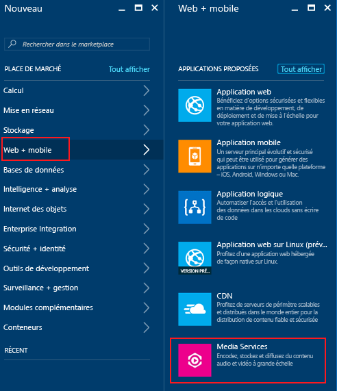
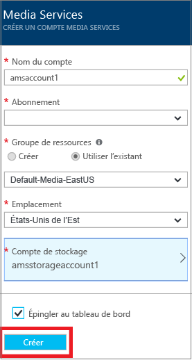

# Création d’un compte Azure Media Services à l’aide du portail Azure
> [!div class="op_single_selector"]
> * [Portail](media-services-portal-create-account.md)
> * [PowerShell](media-services-manage-with-powershell.md)
> * [REST](https://docs.microsoft.com/rest/api/media/mediaservice)
> 
> [!NOTE]
> Pour suivre ce didacticiel, vous avez besoin d'un compte Azure. Pour plus d'informations, consultez la page [Version d'évaluation gratuite d'Azure](https://azure.microsoft.com/pricing/free-trial/). 
> 
> 

Le portail Azure permet de créer rapidement un compte Azure Media Services (AMS). Vous pouvez utiliser ce dernier pour accéder à Media Services afin de stocker, de chiffrer, d'encoder, de gérer et de diffuser du contenu multimédia dans Azure. Lorsque vous créez un compte Media Services, vous créez également un compte de stockage associé ou en utilisez un existant, situé dans la même zone géographique que le compte Media Services.

Cet article explique certains concepts courants et indique comment créer un compte Media Services avec le portail Azure.

## Concepts
L'accès à Media Services requiert deux comptes associés :

* Un compte Media Services. Votre compte vous donne accès à un ensemble de services Media Services sur le cloud, disponibles dans Azure. Un compte Media Services ne stocke pas de contenu multimédia à proprement parler. Il stocke des métadonnées relatives au contenu multimédia et aux travaux de traitement multimédia dans votre compte. Lorsque vous créez le compte, vous sélectionnez une région Media Services disponible. Cette dernière est un centre de données qui stocke les enregistrements de métadonnées pour votre compte.
  
* Un compte de stockage Azure. Les comptes de stockage doivent se trouver dans la même zone géographique que le compte Media Services. Lorsque vous créez un compte Media Services, vous pouvez choisir un compte de stockage existant dans la même région ou en créer un. Si vous supprimez un compte Media Services, les objets blob de votre compte de stockage associé ne seront pas supprimés.

> [!NOTE]
> Pour plus d’informations sur la disponibilité des fonctionnalités Azure Media Services dans des régions différentes, consultez la [disponibilité des fonctionnalités AMS entre les centres de données](scenarios-and-availability.md#availability).

## Création d’un compte AMS
Cette section montre comment créer un compte AMS.

1. Connectez-vous au [portail Azure](https://portal.azure.com/).
2. Cliquez sur **+Nouveau** > **Web + Mobile** > **Media Services**.
   
    
3. Dans **CREATE MEDIA SERVICES ACCOUNT** (CRÉER UN COMPTE MEDIA SERVICES), entrez les valeurs requises.
   
    
   
   1. Dans **Nom du compte**, entrez le nom du nouveau compte AMS. Un nom de compte Media Services se compose de lettres en minuscules ou de chiffres, sans espaces. Sa longueur est comprise entre 3 et 24 caractères.
   2. Dans Abonnement, sélectionnez l’un des abonnements Azure auxquels vous avez accès.
   3. Dans **Groupe de ressources**, sélectionnez la ressource (nouvelle ou existante).  Un groupe de ressources désigne une collection de ressources qui partagent un cycle de vie, des autorisations et des stratégies. En savoir plus [ici](../azure-resource-manager/resource-group-overview.md#resource-groups).
   4. Dans **Emplacement**, sélectionnez la région géographique qui sera utilisée pour stocker les enregistrements multimédias et les métadonnées de votre compte Media Services. Cette région servira à traiter et diffuser vos médias. Seules les régions Media Services disponibles s’affichent dans la liste déroulante. 
   5. Dans **Compte de stockage**, sélectionnez le compte de stockage qui fournira le stockage d’objets blob du contenu multimédia provenant de votre compte Media Services. Vous pouvez sélectionner un compte de stockage dans la même région géographique que votre compte Media Services ou en créer un. Ce dernier sera créé dans la même région. Les règles des noms de compte de stockage sont identiques à celles des comptes Media Services.
      
       Pour en savoir plus sur le stockage, cliquez [ici](../storage/common/storage-introduction.md).
   6. Sélectionnez **Épingler au tableau de bord** pour voir la progression du déploiement du compte.
4. Cliquez sur **Créer** en bas du formulaire.
   
    Une fois le compte créé, passez en revue les chargements de page. Dans la table de point de terminaison de diffusion en continu, le compte aura un point de terminaison de diffusion en continu par défaut dans l’état **Arrêté**. 

    >[!NOTE]
    >Une fois votre compte AMS créé, un point de terminaison de diffusion continue **par défaut** est ajouté à l’état **Arrêté**. Pour démarrer la diffusion en continu de votre contenu et tirer parti de l’empaquetage et du chiffrement dynamiques, le point de terminaison de streaming à partir duquel vous souhaitez diffuser du contenu doit se trouver à l’état **En cours d’exécution**. 
   
## Pour gérer votre compte AMS

Pour gérer votre compte AMS (par exemple, vous connecter à l’API AMS par programme, charger des vidéos, encoder des ressources, configurer la protection du contenu, surveiller la progression du travail) sélectionnez **Paramètres** sur le côté gauche du portail. À partir de **Paramètres**, accédez à l’un des panneaux disponibles (par exemple : **Accès API**, **Ressources**, **Travaux**, **Protection du contenu**).

## Étapes suivantes

Vous pouvez maintenant télécharger des fichiers dans votre compte AMS. Pour plus d’informations, consultez la section [Téléchargement de fichiers dans un compte Media Services à l’aide du portail Azure](media-services-portal-upload-files.md).

Si vous envisagez d’accéder à l’API AMS par programme, consultez [Accéder à l’API Azure Media Services avec l’authentification Azure AD](media-services-use-aad-auth-to-access-ams-api.md).

## Parcours d’apprentissage de Media Services
[!INCLUDE [media-services-learning-paths-include](../../includes/media-services-learning-paths-include.md)]

## Fournir des commentaires
[!INCLUDE [media-services-user-voice-include](../../includes/media-services-user-voice-include.md)]

