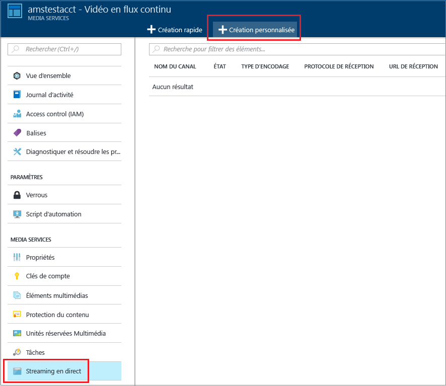
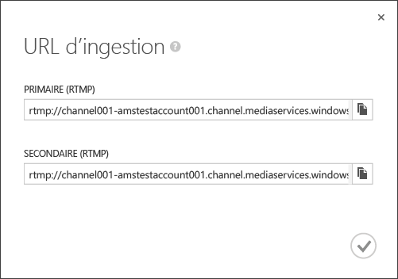
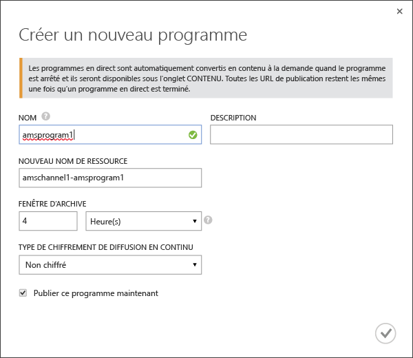
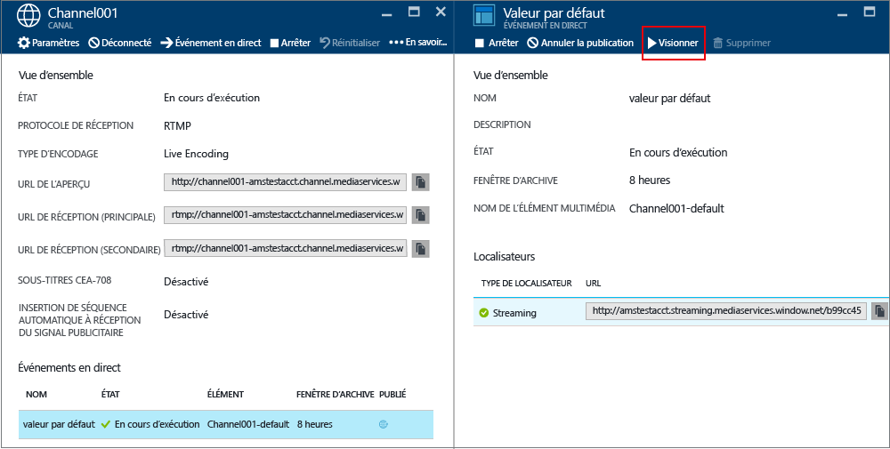
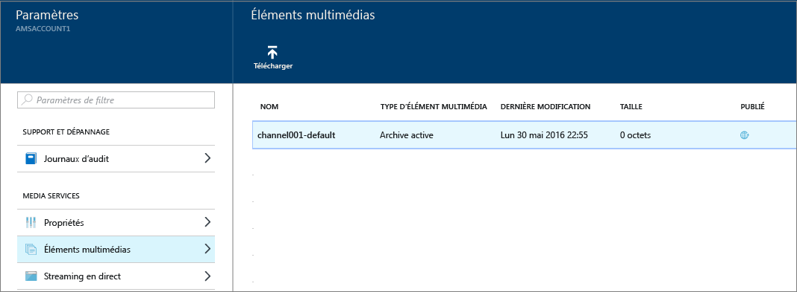

# Comment effectuer une diffusion de vidéo en flux continu à l’aide d’Azure Media Services pour créer des flux multidébit avec le portail Azure
> [!div class="op_single_selector"]
> * [Portail](media-services-portal-creating-live-encoder-enabled-channel.md)
> * [.NET](media-services-dotnet-creating-live-encoder-enabled-channel.md)
> * [API REST](https://docs.microsoft.com/rest/api/media/operations/channel)
> 
> 

Ce didacticiel vous guide tout au long des étapes de création d’un **canal** qui reçoit un flux continu à débit binaire unique et qui l’encode en flux à débit binaire multiple.

> [!NOTE]
> Pour obtenir des informations conceptuelles sur les canaux prenant en charge l’encodage dynamique, consultez [Utilisation de canaux activés pour effectuer un encodage en temps réel avec Azure Media Services](media-services-manage-live-encoder-enabled-channels.md).
> 
> 

## Scénario courant de diffusion dynamique en continu
Ci-après figurent les étapes générales impliquées dans la création d’applications courantes de diffusion en continu dynamique.

> [!NOTE]
> Actuellement, la durée maximale recommandée d’un événement en direct est de 8 heures. Veuillez contacter amslived à l’adresse Microsoft.com si vous avez besoin d’exécuter un canal sur de plus longues périodes.
> 
> 

1. Connectez une caméra vidéo à un ordinateur. Lancez et configurez un encodeur dynamique local capable de générer un flux à débit binaire unique dans l’un des protocoles suivants : RTMP, Smooth Streaming ou RTP (MPEG-TS). Pour plus d’informations, voir [Prise en charge RTMP et encodeurs dynamiques dans Azure Media Services](http://go.microsoft.com/fwlink/?LinkId=532824).
   
    Cette étape peut également être effectuée après la création du canal.
2. Créez et démarrez un canal. 
3. Récupérez l’URL de réception du canal. 
   
    L’URL de réception est utilisée par l’encodeur dynamique pour envoyer le flux au canal.
4. Récupérez l’URL d’aperçu du canal. 
   
    Utilisez cette URL pour vérifier que votre canal reçoit correctement le flux dynamique.
5. Créez un événement/programme (ce qui crée également un élément multimédia). 
6. Publiez l’événement (ce qui crée un localisateur OnDemand pour l’élément multimédia associé).    
7. Démarrez l’événement dès que vous êtes prêt à lancer la diffusion en continu et l’archivage.
8. Un signal peut éventuellement être envoyé à l’encodeur dynamique pour qu’il démarre une publicité. La publicité est insérée dans le flux de sortie.
9. Arrêtez l’événement chaque fois que vous voulez arrêter la diffusion et archiver l’événement.
10. Supprimez l’événement (et éventuellement l’élément multimédia).   

## Dans ce didacticiel
Dans ce didacticiel, le portail Azure est utilisé pour effectuer les tâches suivantes : 

1. Créez un canal qui est activé pour effectuer un encodage en temps réel.
2. Obtenez l’URL de réception afin de la fournir à l’encodeur dynamique. L’encodeur dynamique utilise cette URL pour recevoir le flux dans le canal.
3. Créer un événement/programme (et un élément multimédia).
4. Publier l’élément multimédia et obtenir les URL de diffusion en continu.  
5. Lire votre contenu.
6. Nettoyage.

## Composants requis
Les éléments suivants sont requis pour suivre le didacticiel.

* Pour suivre ce didacticiel, vous avez besoin d'un compte Azure. Si vous ne possédez pas de compte, vous pouvez créer un compte d'évaluation gratuit en quelques minutes. 
  Pour plus d'informations, consultez la page [Version d'évaluation gratuite d'Azure](https://azure.microsoft.com/pricing/free-trial/).
* Un compte Media Services. Pour créer un compte Media Services, consultez [Créer un compte](media-services-portal-create-account.md).
* Une webcam et un encodeur capable d’envoyer un flux dynamique à débit binaire unique.

## Créer un CANAL
1. Dans le [portail Azure](https://portal.azure.com/), sélectionnez Media Services, puis cliquez sur le nom de votre compte Media Services.
2. Sélectionnez **Vidéo en flux continu**.
3. Sélectionnez **Création personnalisée**. Cette option vous permet de créer un canal activé pour l’encodage live.
   
    
4. Cliquez sur **Paramètres**.
   
   1. Choisissez le type de canal **Live Encoding** . Ce type spécifie que vous souhaitez créer un canal qui est activé pour l’encodage en temps réel. Cela signifie que le flux entrant à débit binaire unique est envoyé au canal et encodé en un flux à débit binaire multiple à l’aide des paramètres d’encodeur dynamique spécifiés. Pour plus d’informations, consultez l’article [Comment effectuer une diffusion de vidéo en flux continu à l’aide d’Azure Media Services pour créer des flux multidébit](media-services-manage-live-encoder-enabled-channels.md). Cliquez sur OK.
   2. Indiquez le nom d’un canal.
   3. Cliquez sur OK au bas de la page.
5. Sélectionnez l’onglet **Ingérer** .
   
   1. Sur cette page, vous pouvez sélectionner un protocole de diffusion en continu. Pour le type de canal **Live Encoding** , les options de protocole valides sont :
      
      * MP4 fragmenté (Smooth Streaming) à débit binaire unique
      * RTMP à débit binaire unique
      * RTP (MPEG-TS) : flux de transport MPEG-2 via RTP.
        
        Pour une explication détaillée de chaque protocole, consultez l’article [Comment effectuer une diffusion de vidéo en flux continu à l’aide d’Azure Media Services pour créer des flux à vitesses de transmission multiples](media-services-manage-live-encoder-enabled-channels.md).
        
        Vous ne pouvez pas modifier l’option de protocole pendant l’exécution du canal ou de ses événements/programmes associés. Si vous avez besoin d’autres protocoles, vous devez créer des canaux distincts pour chaque protocole de diffusion.  
   2. Vous pouvez appliquer des restrictions d’adresse IP à la réception. 
      
       Vous pouvez définir les adresses IP autorisées à ingérer du contenu vidéo sur ce canal. Les adresses IP autorisées peuvent être spécifiées en tant qu’adresses IP uniques (par exemple, '10.0.0.1'), une plage d’adresses IP utilisant une adresse IP et un masque de sous-réseau CIDR (par exemple, '10.0.0.1/22'), ou une plage d’adresses IP utilisant une adresse IP et un masque de sous-réseau décimal séparé par des points (par exemple, '10.0.0.1(255.255.252.0)').
      
       Si aucune adresse IP n’est spécifiée et qu’il n’existe pas de définition de règle, alors aucune adresse IP n’est autorisée. Pour autoriser toutes les adresses IP, créez une règle et définissez la valeur 0.0.0.0/0.
6. Dans l’onglet **Aperçu** , appliquez des restrictions d’adresse IP à la version préliminaire.
7. Dans l’onglet **Encodage** , spécifiez la valeur prédéfinie d’encodage. 
   
    Actuellement, le seul préréglage système que vous pouvez sélectionner est **Default720p**. Pour spécifier un paramètre prédéfini personnalisé, ouvrez un ticket de support Microsoft. Entrez ensuite le nom du paramètre prédéfini créé pour vous. 

> [!NOTE]
> Actuellement, le démarrage du canal peut prendre jusqu’à 30 minutes. La réinitialisation du canal peut prendre jusqu’à 5 minutes.
> 
> 

Une fois que vous avez créé le canal, vous pouvez cliquer dessus et sélectionner **Paramètres** pour afficher les configurations de vos canaux. 

Pour plus d’informations, consultez l’article [Comment effectuer une diffusion de vidéo en flux continu à l’aide d’Azure Media Services pour créer des flux multidébit](media-services-manage-live-encoder-enabled-channels.md).

## Obtenir les URL de réception
Lorsque le canal est créé, vous pouvez obtenir des URL de réception que vous devez fournir à l’encodeur dynamique. L’encodeur utilise ces URL pour entrer un flux dynamique.

## Créer et gérer des événements
### Vue d'ensemble
Un canal est associé à des événements/programmes vous permettant de contrôler la publication et le stockage des segments dans un flux dynamique. Les canaux gèrent des événements/programmes. La relation entre canal et programme est très similaire au contenu multimédia traditionnel où un canal a un flux de contenu constant et un programme est limité à un événement minuté sur ce canal.

Vous pouvez spécifier le nombre d’heures pendant lesquelles vous souhaitez conserver le contenu enregistré pour l’événement en définissant la durée de la **fenêtre d’archivage** . Cette valeur peut être comprise entre 5 minutes et 25 heures. La durée de la fenêtre d’archivage détermine également la plage maximale de temps dans laquelle les clients peuvent effectuer des recherches en arrière à partir de la position dynamique actuelle. Les événements peuvent durer davantage que le laps de temps spécifié, mais le contenu qui se situe en dehors de la longueur de fenêtre est ignoré en permanence. La valeur de cette propriété détermine également la longueur maximale que les manifestes de client peuvent atteindre.

Chaque événement est associé à un élément multimédia. Pour publier l’événement, vous devez créer un localisateur OnDemand pour l’élément multimédia associé. Le fait de posséder ce localisateur vous permettra de générer une URL de diffusion en continu que vous pourrez fournir à vos clients.

Un canal prend en charge jusqu’à trois événements exécutés simultanément, ce qui rend possible la création de plusieurs archives du même flux entrant. Cela vous permet de publier et d’archiver différentes parties d’un événement en fonction des besoins. Par exemple, imaginez que vous devez archiver 6 heures d’un événement, mais diffuser uniquement les 10 dernières minutes. Pour ce faire, vous devez créer deux événements exécutés simultanément. Un événement est configuré pour archiver 6 heures de l’événement, mais il n’est pas publié. L’autre événement est configuré pour archiver pendant 10 minutes et il est publié.

Vous ne devez pas réutiliser de programmes existants pour de nouveaux événements. Créez et lancez plutôt un nouveau programme pour chaque événement.

Démarrez un événement ou un programme dès que vous êtes prêt à lancer la diffusion en continu et l’archivage. Arrêtez l’événement chaque fois que vous voulez arrêter la diffusion et archiver l’événement. 

Pour supprimer du contenu archivé, arrêtez et supprimez l’événement, puis supprimez l’élément multimédia associé. Un élément multimédia ne peut pas être supprimé s’il est utilisé par l’événement ; vous devez d’abord supprimer l’événement. 

Même après l’arrêt et la suppression de l’événement, les utilisateurs pourront lire votre contenu archivé en tant que vidéo à la demande tant que vous n’aurez pas supprimé l’élément multimédia.

Si vous souhaitez conserver le contenu archivé sans qu’il soit disponible pour la diffusion, supprimez le localisateur de diffusion en continu.

### Créer/Démarrer/Arrêter des événements
Une fois que le flux transite dans le canal, vous pouvez commencer l’événement de diffusion en continu en créant une ressource, un programme et un localisateur de diffusion en continu. Le flux est alors archivé et mis à la disposition des observateurs via le point de terminaison de diffusion en continu. 

>[!NOTE]
>Une fois votre compte AMS créé, un point de terminaison de streaming **par défaut** est ajouté à votre compte à l’état **Arrêté**. Pour démarrer la diffusion en continu de votre contenu et tirer parti de l’empaquetage et du chiffrement dynamiques, le point de terminaison de streaming à partir duquel vous souhaitez diffuser du contenu doit se trouver à l’état **En cours d’exécution**. 

Il existe deux façons de démarrer un événement : 

1. Dans la page **Canal**, appuyez sur **Événement réel** pour ajouter un événement.
   
    Spécifiez le nom de l’événement, le nom de l’élément multimédia, la fenêtre d’archivage et l’option de chiffrement.
   
    
   
    Si vous avez laissé la case **Publier cet événement en direct maintenant** cochée, l’événement de publication des URL est créé.
   
    Vous pouvez appuyer sur **Démarrer**chaque fois que vous êtes prêt à diffuser l’événement.
   
    Une fois que vous avez démarré l’événement, vous pouvez appuyer sur **Regarder** pour commencer à lire le contenu.
2. Vous pouvez également utiliser un raccourci et appuyer sur le bouton **Direct** dans la page **Canal**. Un élément multimédia, un programme et un localisateur de diffusion en continu par défaut sont alors créés.
   
    L’événement est nommé **default** , et la fenêtre d’archivage est définie sur 8 heures.

Vous pouvez regarder l’événement publié à partir de la page **Événement réel** . 

Si vous cliquez sur **Off Air**(Hors antenne), tous les événements en direct sont arrêtés. 

## Regarder l’événement
Pour visionner l’événement, cliquez sur **Watch** (Visionner) dans le portail Azure ou copiez l’URL de diffusion en continu et utilisez le lecteur de votre choix. 

Une fois arrêté, l’événement en direct est automatiquement converti en contenu à la demande.

## Nettoyer
Si vous avez terminé de diffuser en continu les événements et que vous voulez nettoyer les ressources configurées précédemment, suivez la procédure ci-dessous.

* Arrêtez d’envoyer le flux à partir de l’encodeur.
* Arrêtez le canal. Une fois le canal arrêté, aucun frais n’est encouru. Lorsque vous devez le redémarrer, il possède la même URL de réception. Vous n’avez donc pas besoin de reconfigurer votre encodeur.
* Vous pouvez arrêter votre point de terminaison de diffusion en continu, sauf si vous souhaitez continuer à fournir l’archive de votre événement en direct en tant que flux à la demande. Si le canal est arrêté, aucun frais n’est encouru.

## Afficher le contenu archivé
Même après l’arrêt et la suppression de l’événement, les utilisateurs pourront lire votre contenu archivé en tant que vidéo à la demande tant que vous n’aurez pas supprimé l’élément multimédia. Un élément multimédia ne peut pas être supprimé s’il est utilisé par un événement ; vous devez d’abord supprimer l’événement. 

Pour gérer vos éléments multimédias, cliquez sur **Paramètre** puis sur **Éléments multimédias**.

## Considérations
* Actuellement, la durée maximale recommandée d’un événement en direct est de 8 heures. Veuillez contacter amslived à l'adresse Microsoft.com si vous avez besoin d'exécuter un canal sur de plus longues périodes.
* Assurez-vous que le point de terminaison de streaming à partir duquel vous souhaitez diffuser votre contenu se trouve à l’état **En cours d’exécution**.

## Étape suivante
Consultez les parcours d’apprentissage de Media Services.

[!INCLUDE [media-services-learning-paths-include](../../includes/media-services-learning-paths-include.md)]

## Fournir des commentaires
[!INCLUDE [media-services-user-voice-include](../../includes/media-services-user-voice-include.md)]

