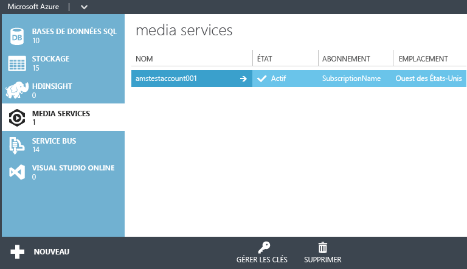

<properties
	pageTitle="Prise en main de la diffusion de contenus vidéo à la demande (VoD) à l’aide du portail de gestion Azure"
	description="Ce didacticiel vous guide à travers les étapes d’implémentation d’une application de diffusion de contenu vidéo à la demande (VoD) avec Azure Media Services à l’aide du portail de gestion Azure."
	services="media-services"
	documentationCenter=""
	authors="Juliako"
	manager="dwrede"
	editor=""/>

<tags
	ms.service="media-services"
	ms.workload="media"
	ms.tgt_pltfrm="na"
	ms.devlang="ne"
	ms.topic="get-started-article" 
	ms.date="08/11/2015" 
	ms.author="juliako"/>

#Prise en main de la diffusion de contenus vidéo à la demande (VoD) à l’aide du portail de gestion Azure

[AZURE.INCLUDE [media-services-selector-get-started](../../includes/media-services-selector-get-started.md)]

>[AZURE.NOTE]Pour effectuer ce didacticiel, vous avez besoin d’un compte Azure. Si vous ne possédez pas de compte, vous pouvez créer un compte d'évaluation gratuit en quelques minutes. Pour plus d’informations, consultez la page <a href="http://www.windowsazure.com/pricing/free-trial/?WT.mc_id=A8A8397B5" target="_blank">Version d’essai gratuite d’Azure</a>.

Ce didacticiel vous guide à travers les étapes d’implémentation d’une application de diffusion de contenu vidéo à la demande (VoD) de base à l’aide du portail de gestion Azure.

Ce document de démarrage rapide présente les tâches suivantes.

1.  Créer un compte Media Services
2.  Configurer le point de terminaison de diffusion en continu
1.  Télécharger un fichier vidéo
1.  Encoder le fichier source en un ensemble de fichiers MP4 à débit adaptatif
1.  Publier les éléments et obtenir les URL de diffusion et de téléchargement progressif  
1.  Lecture de votre contenu

##Créer un compte Media Services

1. Dans le [portail de gestion][], cliquez sur **New**, sur **Service de média**, puis sur **Création rapide**.

	

2. Dans **NAME**, entrez le nom du nouveau compte. Un nom de compte Media Services se compose de chiffres ou de lettres en minuscules, sans espaces. Sa longueur est comprise entre 3 et 24 caractères.

3. Dans **RÉGION**, sélectionnez la région géographique qui sera utilisée pour stocker les enregistrements de métadonnées pour votre compte Media Services. Seules les régions Media Services disponibles s'affichent dans la liste déroulante.

4. Dans **COMPTE DE STOCKAGE**, sélectionnez un compte de stockage pour fournir un stockage d'objets blob du contenu multimédia à partir de votre compte Media Services. Vous pouvez sélectionner un compte de stockage existant dans la même région géographique que votre compte Media Services ou en créer un. Ce dernier sera créé dans la même région.

5. Si vous avez créé un compte de stockage, entrez un nom dans **NOUVEAU NOM DU COMPTE DE STOCKAGE**. Les règles des noms de compte de stockage sont identiques à celles des comptes Media Services.

6. Cliquez sur **Création rapide** en bas du formulaire.

	Vous pouvez surveiller l’état du processus dans la zone de message en bas de la fenêtre.

	Une fois que le compte est créé, l’état devient actif.

	Au bas de la page, le bouton **GÉRER LES CLÉS** s’affiche. Lorsque vous cliquez sur ce bouton, une boîte de dialogue avec le nom du compte Media Services et les clés primaires et secondaires s’affiche. Vous devez disposer du nom de compte et des informations de clé primaire pour accéder par programme au compte Media Services.

	

	Lorsque vous double-cliquez sur le nom de compte, la page Démarrage rapide s’affiche par défaut. Elle vous permet d'effectuer des tâches de gestion également disponibles sur d'autres pages du portail. Par exemple, vous pouvez télécharger un fichier vidéo depuis cette page ou depuis la page CONTENU.

##Configurer un point de terminaison de diffusion en continu à l’aide du portail

Lorsque vous travaillez avec Azure Media Services, un des scénarios les plus courants est la diffusion de contenu à débit adaptatif à vos clients. Avec la diffusion à débit binaire adaptatif, le client peut basculer vers un flux à débit binaire supérieur ou inférieur, car la vidéo est affichée en fonction de la bande passante réseau actuelle, de l’utilisation de l’UC et d’autres facteurs. Media Services prend en charge les technologies de diffusion en continu à débit binaire adaptatif suivantes : HTTP Live Streaming (HLS), Smooth Streaming, MPEG DASH et HDS (pour licences Adobe PrimeTime/Access uniquement).

Media Services fournit l’empaquetage dynamique qui permet de distribuer un contenu en diffusion continue en MP4 ou Smooth Streaming dans un format pris en charge par Media Services (MPEG DASH, HLS, Smooth Streaming, HDS) sans avoir à recréer de nouveaux packages dans ces formats.

Pour tirer parti de l’empaquetage dynamique, vous devez effectuer les opérations suivantes :

- Encoder votre fichier mezzanine (source) en un ensemble de fichiers mp4 à débit adaptatif ou de fichiers Smooth Streaming à débit adaptatif (les étapes de codage sont décrites plus loin dans ce didacticiel).  
- Obtenir au moins une unité de diffusion pour le **point de terminaison de diffusion** à partir duquel vous envisagez de distribuer votre contenu.

Avec l’empaquetage dynamique, vous devez stocker et payer les fichiers dans un seul format de stockage. Ensuite, Media Services crée et fournit la réponse appropriée en fonction des demandes des clients.

Pour changer le nombre d’unités réservées de diffusion en continu, procédez comme suit :

1. Dans le [portail de gestion](https://manage.windowsazure.com/), cliquez sur **Media Services**. Cliquez ensuite sur le nom du service multimédia.

2. Sélectionnez la page POINTS DE TERMINAISON DE DIFFUSION EN CONTINU. Cliquez ensuite sur le point de terminaison de diffusion en continu que vous souhaitez modifier.

3. Pour spécifier le nombre d'unités de diffusion en continu, sélectionnez l'onglet METTRE À L'ÉCHELLE et déplacez le curseur de **capacité réservée**.

	

4. Appuyez sur le bouton ENREGISTRER pour enregistrer vos modifications.

	L’allocation de nouvelles unités prend environ 20 minutes.

	>[AZURE.NOTE]Actuellement, le fait de passer d’une valeur positive à zéro pour le nombre d’unités de diffusion en continu peut désactiver la diffusion en continu pendant une heure.
	>
	> C’est le plus grand nombre d’unités spécifiées sur 24 heures qui est utilisé pour calculer le coût. Pour des informations détaillées sur la tarification, consultez la page [Détails de la tarification des services de média](http://go.microsoft.com/fwlink/?LinkId=275107).

##Téléchargement de contenu

1. Sur le [portail de gestion](http://go.microsoft.com/fwlink/?LinkID=256666&clcid=0x409), cliquez sur **Media Services**, puis sur le nom du compte Media Services.
2. Sélectionnez la page CONTENU.
3. Cliquez sur le bouton **Télécharger** disponible sur cette page ou en bas du portail.
4. Dans la boîte de dialogue **Télécharger le contenu**, accédez au fichier correspondant à l’élément multimédia de votre choix. Cliquez sur le fichier, puis sur **Ouvrir**, ou appuyez sur **Entrée**.

	![UploadContentDialog][uploadcontent]

5. Dans la boîte de dialogue Télécharger le contenu, cliquez sur le bouton de vérification pour accepter le nom du fichier et du contenu.
6. Le téléchargement démarre et vous pouvez suivre la progression en bas du portail.  

	![JobStatus][status]

Une fois le téléchargement terminé, le nouvel élément multimédia est répertorié dans la liste Contenu. Par convention, la mention « **-Source** » est ajoutée à la fin du nom afin de faciliter le suivi des nouveaux contenus sources pour les tâches d'encodage.

![ContentPage][contentpage]

Si la valeur relative à la taille du fichier n’est pas mise à jour après l’arrêt du processus de téléchargement, cliquez sur le bouton **Synchroniser les métadonnées**. La taille du fichier multimédia est alors synchronisée avec la taille réelle du fichier stocké et la valeur est actualisée sur la page Contenu.

##Encodage de contenu

###Vue d’ensemble
Pour fournir une vidéo numérique sur Internet, vous devez compresser le contenu multimédia. Media Services propose un encodeur multimédia qui vous permet de spécifier comment vous souhaitez que votre contenu soit encodé (par exemple, le codec à utiliser, le format du fichier, la résolution et le débit).

Lorsque vous travaillez avec Azure Media Services, un des scénarios les plus courants est la diffusion de contenu à débit adaptatif à vos clients. Avec la diffusion à débit binaire adaptatif, le client peut basculer vers un flux à débit binaire supérieur ou inférieur, car la vidéo est affichée en fonction de la bande passante réseau actuelle, de l’utilisation de l’UC et d’autres facteurs. Media Services prend en charge les technologies de diffusion en continu à débit binaire adaptatif suivantes : HTTP Live Streaming (HLS), Smooth Streaming, MPEG DASH et HDS (pour licences Adobe PrimeTime/Access uniquement).

Media Services fournit l’empaquetage dynamique qui permet de distribuer un contenu en diffusion continue en MP4 ou Smooth Streaming dans un format pris en charge par Media Services (MPEG DASH, HLS, Smooth Streaming, HDS) sans avoir à recréer de nouveaux packages dans ces formats.

Pour tirer parti de l’empaquetage dynamique, vous devez effectuer les opérations suivantes :

- encoder votre fichier mezzanine (source) dans un ensemble de fichiers mp4 à débit adaptatif ou de fichiers Smooth Streaming à débit adaptatif (les étapes de codage sont décrites plus loin dans ce didacticiel).
- obtenir au moins une unité de diffusion à la demande pour le point de terminaison de diffusion à partir duquel vous envisagez de distribuer votre contenu. Pour plus d’informations, consultez la page [Extension des unités réservées de diffusion en continu à la demande](media-services-manage-origins.md#scale_streaming_endpoints/).

Avec l’empaquetage dynamique, vous devez stocker et payer les fichiers dans un seul format de stockage. Ensuite, Media Services crée et fournit la réponse appropriée en fonction des demandes des clients.

Notez qu’en plus d’utiliser les fonctionnalités d’empaquetage dynamique, les unités réservées de diffusion en continu à la demande vous offrent une capacité de sortie dédiée qui peut être achetée par incréments de 200 Mbit/s. Par défaut, la diffusion en continu à la demande est configurée dans un modèle d’instance partagée, pour lequel les ressources du serveur (calcul, sortie, capacité, etc.) sont partagées avec tous les autres utilisateurs. Afin d’améliorer la vitesse de diffusion en continu à la demande, il est recommandé d’acheter des unités réservées de diffusion en continu à la demande.

###Encoder

Cette section décrit les étapes à suivre pour encoder votre contenu avec l’Encodeur multimédia Azure à l’aide du portail de gestion.

1.  Sélectionnez le fichier que vous souhaitez encoder. Si l’encodage est pris en charge pour ce type de fichier, le bouton de traitement sera activé en bas de la page de contenu.
4. Dans la boîte de dialogue de **traitement**, choisissez le processeur **Encodeur multimédia Azure**.
5. Choisissez une des **configurations d’encodage**.

	![Process2][process2]

	La rubrique [Chaînes de présélection des tâches pour Encodeur multimédia Azure](https://msdn.microsoft.com/library/azure/dn619392.aspx) explique ce que signifie chaque présélection des catégories **Présélections de diffusion adaptative (empaquetage dynamique)**, **Présélections pour le téléchargement progressif** et **Présélections héritées pour la diffusion adaptative**.

	Les **Autres** configurations sont décrites ci-après :

	+ **Encodage avec la protection de contenu PlayReady**. Cette présélection produit un élément encodé avec la protection de contenu PlayReady.  

		Le service de licences PlayReady de Media Services est utilisé par défaut. Si vous souhaitez spécifier un autre service à partir duquel les clients puissent obtenir une licence pour lire le contenu chiffré avec PlayReady, utilisez les API REST ou les API du Kit de développement logiciel (SDK) Media Services pour .NET. Pour plus d’informations, consultez la page [Utilisation du chiffrement statique pour protéger votre contenu]() et définissez la propriété **licenseAcquisitionUrl** dans la présélection de Media Encryptor. Vous pouvez également utiliser le chiffrement dynamique et définir la propriété **PlayReadyLicenseAcquisitionUrl** comme décrit sur la page [Utilisation du chiffrement dynamique PlayReady et du service de distribution de licences](http://go.microsoft.com/fwlink/?LinkId=507720).
	+ **Lecture sur PC/Mac (via Flash/Silverlight)**. Cette présélection produit un élément multimédia de diffusion en continu lisse doté des caractéristiques suivantes : CBR audio stéréo 44,1 kHz 16 bits/échantillon encodé à 96 Kbit/s via AAC, et CBR vidéo 720p encodé selon 6 débits binaires allant de 3 400 Kbit/s à 400 Kbit/s via le profil principal H.264, et GOP de deux secondes.
	+ **Lecture via HTML5 (IE/Chrome/Safari)**. Cette présélection produit un fichier MP4 doté des caractéristiques suivantes : CBR audio stéréo 44,1 kHz 16 bits/échantillon encodé à 128 Kbit/s via AAC, et CBR vidéo 720p encodé à 4500 Kbit/s via le profil principal H.264.
	+ **Lecture sur appareils iOS et PC/Mac**. Cette présélection produit un élément multimédia doté des mêmes caractéristiques que l’élément multimédia de diffusion en continu lisse (décrit ci-dessus), mais sous un format qui peut être utilisé pour une diffusion en continu HTTP Apple (HLS) aux appareils iOS.

5. Ensuite, entrez un nom convivial pour le contenu de sortie ou acceptez le nom par défaut. Cliquez ensuite sur le bouton de vérification pour lancer l’opération d’encodage et suivez la progression en bas du portail.
6. Appuyez sur OK.

	Une fois l’encodage effectué, la page de contenu contient le fichier encodé.

	Pour afficher la progression de la tâche d’encodage, basculez vers la page **TRAVAUX**.

	Si la valeur relative à la taille du fichier n’est pas mise à jour à l’issue de l’encodage, appuyez sur le bouton **Synchroniser les métadonnées**. La taille du fichier multimédia de sortie est alors synchronisée avec la taille réelle du fichier stocké et la valeur est actualisée sur la page Contenu.

##Publication de contenu

###Vue d’ensemble

Pour fournir aux utilisateurs une URL pouvant être utilisée pour diffuser en continu ou télécharger votre contenu, vous devez d’abord « publier » votre élément multimédia en créant un localisateur. Les localisateurs assurent l’accès aux fichiers contenus dans l’élément multimédia. Media Services prend en charge deux types de localisateurs : les localisateurs OnDemandOrigin, utilisés pour diffuser du contenu multimédia (par exemple, MPEG DASH, HLS ou Smooth Streaming) et les localisateurs d’URL SAS (signature d’accès partagé), utilisés pour télécharger des fichiers multimédias.

Lorsque vous utilisez le portail de gestion Azure pour publier vos éléments multimédias, les localisateurs sont créés pour vous et une URL basée sur le localisateur OnDemand (si votre élément multimédia contient un fichier .ism) ou une URL SAP vous est fournie.

Une URL SAS a le format suivant :

	{blob container name}/{asset name}/{file name}/{SAS signature}

Les URL de diffusion en continu, que vous pouvez utiliser pour lire des éléments multimédias Smooth Streaming, ont le format suivant :

	{streaming endpoint name-media services account name}.streaming.mediaservices.windows.net/{locator ID}/{filename}.ism/Manifest

Pour créer une URL de diffusion en continu HLS, ajoutez (format=m3u8-aapl) à l’URL.

	{streaming endpoint name-media services account name}.streaming.mediaservices.windows.net/{locator ID}/{filename}.ism/Manifest(format=m3u8-aapl)

Pour créer une URL de diffusion en continu MPEG DASH, ajoutez (format=mpd-time-csf) à l’URL.

	{streaming endpoint name-media services account name}.streaming.mediaservices.windows.net/{locator ID}/{filename}.ism/Manifest(format=mpd-time-csf)

Les localisateurs ont une date d’expiration. Lorsque vous utilisez le portail pour publier vos ressources, des localisateurs présentant une date d’expiration de 100 ans sont créés.

>[AZURE.NOTE]Si vous avez utilisé le portail pour créer des localisateurs avant mars 2015, des localisateurs présentant une date d’expiration de deux ans ont été créés.

Pour mettre à jour la date d’expiration d’un localisateur, utilisez l’[API REST](http://msdn.microsoft.com/library/azure/hh974308.aspx#update_a_locator) ou [.NET](http://go.microsoft.com/fwlink/?LinkID=533259). Notez que lorsque vous mettez à jour la date d’expiration d’un localisateur SAS, l’URL est modifiée.

###Publier

Pour utiliser le portail pour publier un élément multimédia, procédez comme suit :

1. Sélectionnez l’élément multimédia.
2. Puis, cliquez sur le bouton Publier.

 ![PublishedContent][publishedcontent]

##Lecture de contenu sur le portail

Le **portail de gestion Azure** propose un lecteur de contenu que vous pouvez utiliser pour tester vos vidéos.

Cliquez sur la vidéo de votre choix, puis sur le bouton **Lire** situé en bas du portail.

Certaines considérations s’appliquent :

- Assurez-vous que la vidéo a été publiée.
- Le **lecteur de contenu de Media Services** assure la lecture depuis le point de terminaison de diffusion en continu par défaut. Si vous souhaitez lire à partir d’un autre point de terminaison de diffusion en continu que celui par défaut, utilisez un autre lecteur, par exemple, le [lecteur Azure Media Services](http://amsplayer.azurewebsites.net/azuremediaplayer.html).

![AMSPlayer][AMSPlayer]

###Ressources supplémentaires
- <a href="http://channel9.msdn.com/Shows/Azure-Friday/Azure-Media-Services-101-Get-your-video-online-now-">Azure Media Services 101 - Mettez votre vidéo en ligne dès maintenant.</a>
- <a href="http://channel9.msdn.com/Shows/Azure-Friday/Azure-Media-Services-102-Dynamic-Packaging-and-Mobile-Devices">Azure Media Services 102 - Empaquetage dynamique et appareils mobiles</a>

<!-- Anchors. -->

<!-- URLs. -->
[portail de gestion]: http://manage.windowsazure.com/

<!-- Images -->
[portaloverview]: ./media/media-services-portal-get-started/media-services-content-page.png
[publishedcontent]: ./media/media-services-portal-get-started/media-services-upload-content-published.png
[uploadcontent]: ./media/media-services-portal-get-started/UploadContent.png
[status]: ./media/media-services-portal-get-started/Status.png
[encoder]: ./media/media-services-manage-content/EncoderDialog2.png
[branding]: ./media/branding-reporting.png
[contentpage]: ./media/media-services-portal-get-started/media-services-content-page.png
[process]: ./media/media-services-manage-content/media-services-process-video.png
[process2]: ./media/media-services-portal-get-started/media-services-process-video2.png
[encrypt]: ./media/media-services-manage-content/media-services-encrypt-content.png
[AMSPlayer]: ./media/media-services-portal-get-started/media-services-portal-player.png
 

<!---HONumber=August15_HO7-->