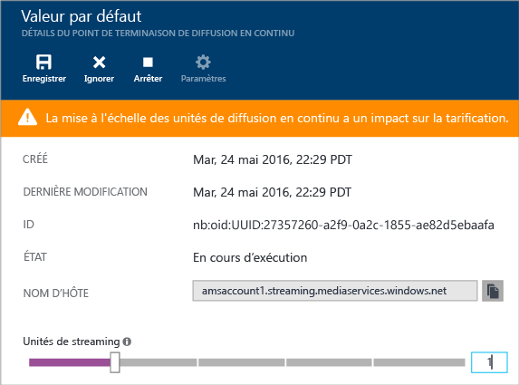

<properties 
	pageTitle="Procédure de diffusion en continu avec des encodeurs en local à l’aide du portail Azure | Microsoft Azure" 
	description="Ce didacticiel vous guide tout au long des étapes de création d’un canal configuré pour une livraison directe." 
	services="media-services" 
	documentationCenter="" 
	authors="juliako" 
	manager="erikre" 
	editor=""/>

<tags 
	ms.service="media-services" 
	ms.workload="media" 
	ms.tgt_pltfrm="na" 
	ms.devlang="na" 
	ms.topic="get-started-article"
	ms.date="09/05/2016" 
	ms.author="juliako"/>

#Procédure de diffusion en continu avec des encodeurs en local à l’aide du portail Azure

> [AZURE.SELECTOR]
- [Portail](media-services-portal-live-passthrough-get-started.md)
- [.NET](media-services-dotnet-live-encode-with-onpremises-encoders.md)
- [REST](https://msdn.microsoft.com/library/azure/dn783458.aspx)

Ce didacticiel vous guide tout au long des étapes d’utilisation du portail Azure afin de créer un **canal** configuré pour une livraison directe.

##Composants requis

Les éléments suivants sont requis pour suivre le didacticiel :

- Un compte Azure. Pour plus d'informations, consultez la page [Version d'évaluation gratuite d'Azure](https://azure.microsoft.com/pricing/free-trial/).
- Un compte Media Services. Pour créer un compte Media Services, voir [Création d’un compte Media Services](media-services-create-account.md).
- Une webcam. Par exemple, un [encodeur Telestream Wirecast](http://www.telestream.net/wirecast/overview.htm).

Il est vivement recommandé de consulter les articles suivants :

- [Prise en charge RTMP et encodeurs dynamiques dans Azure Media Services.](https://azure.microsoft.com/blog/2014/09/18/azure-media-services-rtmp-support-and-live-encoders/)
- [Vue d’ensemble de la vidéo en flux continu à l’aide d’Azure Media Services](media-services-manage-channels-overview.md)
- [Vidéo en flux continu avec des encodeurs locaux qui créent des flux à vitesses de transmission multiples](media-services-live-streaming-with-onprem-encoders.md)

##Scénario courant de diffusion dynamique en continu

Les étapes suivantes décrivent les tâches impliquées dans la création d’applications courantes de diffusion en continu qui utilisent des canaux configurés pour une livraison directe. Ce didacticiel explique comment créer et gérer un canal direct et des événements en direct.

1. Connectez une caméra vidéo à un ordinateur. Lancez et configurez un encodeur dynamique local qui produit un flux à débit binaire multiple au format MP4 fragmenté ou RTMP. Pour plus d’informations, voir [Prise en charge RTMP et encodeurs dynamiques dans Azure Media Services](http://go.microsoft.com/fwlink/?LinkId=532824).
	
	Cette étape peut également être effectuée après la création du canal.

1. Créez et démarrez un canal direct.
1. Récupérez l’URL de réception du canal.

	L’URL de réception est utilisée par l’encodeur dynamique pour envoyer le flux au canal.
1. Récupérez l’URL d’aperçu du canal.

	Utilisez cette URL pour vérifier que votre canal reçoit correctement le flux dynamique.

3. Créez un événement/programme en direct.

	Lors de l’utilisation du portail Azure, la création d’un événement en direct a également pour effet de créer un élément multimédia.
	  
	>[AZURE.NOTE]Assurez-vous d'avoir au moins une unité réservée de diffusion en continu pour le point de terminaison de diffusion en continu à partir duquel vous prévoyez de diffuser votre contenu.
1. Démarrez l’événement ou le programme dès que vous êtes prêt à lancer la diffusion en continu et l’archivage.
2. Un signal peut éventuellement être envoyé à l’encodeur dynamique pour qu’il démarre une publicité. La publicité est insérée dans le flux de sortie.
1. Arrêtez l’événement ou le programme chaque fois que vous voulez arrêter la diffusion et archiver l’événement.
1. Supprimez l’événement ou le programme (et éventuellement la ressource).

>[AZURE.IMPORTANT] Pour en savoir plus sur les considérations et concepts liés à la diffusion en continu avec des encodeurs locaux et des canaux directs, consultez la page [Vidéo en flux continu avec des encodeurs locaux qui créent des flux à vitesses de transmission multiples](media-services-live-streaming-with-onprem-encoders.md).

##Pour afficher les erreurs et notifications

Si vous souhaitez afficher les notifications et les erreurs produites par le portail Azure, cliquez sur l’icône Notification.

##Configurer les points de terminaison de diffusion en continu 

Media Services fournit l’empaquetage dynamique qui vous permet de distribuer des fichiers MP4 multidébit dans les formats MPEG DASH, HLS, Smooth Streaming ou HDS, sans avoir à recréer de nouveaux packages dans ces formats. L’empaquetage dynamique vous permet de ne stocker et payer les fichiers que dans un seul format de stockage. Ensuite, Media Services crée et fournit la réponse appropriée en fonction des demandes des clients.

Pour tirer parti de l’empaquetage dynamique, vous devez obtenir au moins une unité de diffusion en continu pour le point de terminaison de diffusion en continu à partir duquel vous envisagez de distribuer votre contenu.

Pour créer et modifier le nombre d’unités réservées de diffusion en continu, procédez comme suit :

1. Connectez-vous au [portail Azure](https://portal.azure.com/).
1. Dans la fenêtre **Paramètres**, cliquez sur **Points de terminaison de diffusion en continu**.

2. Cliquez sur le point de terminaison de diffusion en continu par défaut.

	La fenêtre **DEFAULT STREAMING ENDPOINT DETAILS** (DÉTAILS DU POINT DE TERMINAISON DE DIFFUSION EN CONTINU PAR DÉFAUT) s’affiche.

3. Pour spécifier le nombre d’unités de diffusion en continu, faites glisser le curseur **Unités de diffusion en continu**.

	

4. Cliquez sur le bouton **Enregistrer** pour enregistrer vos modifications.

	>[AZURE.NOTE]L’allocation de nouvelles unités peut prendre environ 20 minutes.
	
##Créer et démarrer des canaux directs et des événements

Un canal est associé à des événements/programmes vous permettant de contrôler la publication et le stockage des segments dans un flux dynamique. Les canaux gèrent des événements.
	
Vous pouvez spécifier le nombre d’heures pendant lesquelles vous souhaitez conserver le contenu enregistré pour le programme en définissant la durée de la **fenêtre d’archivage**. Cette valeur peut être comprise entre 5 minutes et 25 heures. La durée de la fenêtre d’archivage détermine également la plage maximale de temps dans laquelle les clients peuvent effectuer des recherches en arrière à partir de la position dynamique actuelle. Les événements peuvent durer davantage que le laps de temps spécifié, mais le contenu qui se situe en dehors de la longueur de fenêtre est ignoré en permanence. La valeur de cette propriété détermine également la longueur maximale que les manifestes de client peuvent atteindre.

Chaque événement est associé à un élément multimédia. Pour publier l’événement, vous devez créer un localisateur OnDemand pour l’élément multimédia associé. Le fait de posséder ce localisateur vous permet de générer une URL de diffusion en continu que vous pourrez fournir à vos clients.

Un canal prend en charge jusqu’à trois événements exécutés simultanément, ce qui rend possible la création de plusieurs archives du même flux entrant. Cela vous permet de publier et d’archiver différentes parties d’un événement en fonction des besoins. Par exemple, imaginez que vous devez archiver 6 heures d’un programme, mais diffuser uniquement les 10 dernières minutes. Pour ce faire, vous devez créer deux programmes exécutés simultanément. Un programme est configuré pour archiver 6 heures de l’événement, mais il n’est pas publié. L’autre programme est configuré pour archiver pendant 10 minutes et il est publié.

Vous ne devez pas réutiliser d’événements en direct existants. Créez et lancez plutôt un nouvel événement pour chaque événement.

Démarrez l’événement dès que vous êtes prêt à lancer la diffusion en continu et l’archivage. Arrêtez le programme chaque fois que vous voulez arrêter la diffusion et archiver l’événement.

Pour supprimer du contenu archivé, arrêtez et supprimez l’événement, puis supprimez l’élément multimédia associé. Un élément multimédia ne peut pas être supprimé s’il est utilisé par un événement ; vous devez d’abord supprimer l’événement.

Même après l’arrêt et la suppression de l’événement, les utilisateurs pourront lire votre contenu archivé en tant que vidéo à la demande tant que vous n’aurez pas supprimé l’élément multimédia.

Si vous souhaitez conserver le contenu archivé sans qu’il soit disponible pour la diffusion, supprimez le localisateur de diffusion en continu.

###Pour créer un canal à l’aide du portail 

Cette section explique comment utiliser l’option **Création rapide** pour créer un canal direct.

Pour plus d’informations sur les canaux directs, consultez [Vidéo en flux continu avec des encodeurs locaux qui créent des flux à vitesses de transmission multiples](media-services-live-streaming-with-onprem-encoders.md).

1. Dans la fenêtre **Paramètres**, cliquez sur **Diffusion en continu**.

	
	
	La fenêtre **Diffusion en continu** s’affiche.

3. Cliquez sur **Création rapide** pour créer un canal direct avec le protocole de réception RTMP.

	La fenêtre **Créer un nouveau canal** s’affiche.
4. Nommez le nouveau canal et cliquez sur **Créer**.

	Vous obtenez un canal direct avec le protocole de réception RTMP.

##Créer des événements

1. Sélectionnez un canal auquel vous souhaitez ajouter un événement.
2. Appuyez sur le bouton **Événement réel**.

##Obtenir les URL de réception

Lorsque le canal est créé, vous pouvez obtenir des URL de réception que vous devez fournir à l’encodeur dynamique. L’encodeur utilise ces URL pour entrer un flux dynamique.

##Regarder l’événement

Pour visionner l’événement, cliquez sur **Watch** (Visionner) dans le portail Azure ou copiez l’URL de diffusion en continu et utilisez le lecteur de votre choix.
 

Une fois arrêté, l’événement en direct est automatiquement converti en contenu à la demande.

##Nettoyer

Pour plus d’informations sur les canaux directs, consultez [Vidéo en flux continu avec des encodeurs locaux qui créent des flux à vitesses de transmission multiples](media-services-live-streaming-with-onprem-encoders.md).

- Un canal peut être arrêté uniquement lorsque tous les événements/programmes du canal ont été arrêtés. Une fois le canal arrêté, aucun frais n’est encouru. Lorsque vous devez le redémarrer, il possède la même URL de réception. Vous n’avez donc pas besoin de reconfigurer votre encodeur.
- Un canal peut être supprimé uniquement lorsque tous les événements/programmes du canal ont été supprimés.

##Afficher le contenu archivé

Même après l’arrêt et la suppression de l’événement, les utilisateurs pourront lire votre contenu archivé en tant que vidéo à la demande tant que vous n’aurez pas supprimé l’élément multimédia. Un élément multimédia ne peut pas être supprimé s’il est utilisé par un événement ; vous devez d’abord supprimer l’événement.

Pour gérer vos éléments multimédias, cliquez sur **Paramètre** puis sur **Éléments multimédias**.

##Étape suivante

Consultez les parcours d’apprentissage de Media Services.

[AZURE.INCLUDE [media-services-learning-paths-include](../../includes/media-services-learning-paths-include.md)]

##Fournir des commentaires

[AZURE.INCLUDE [media-services-user-voice-include](../../includes/media-services-user-voice-include.md)]

<!---HONumber=AcomDC_0907_2016-->