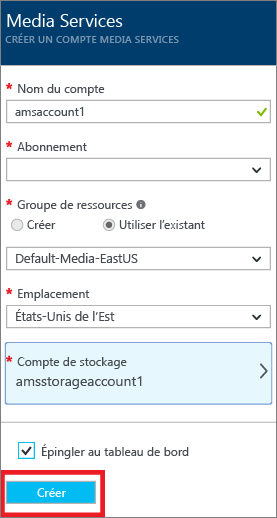
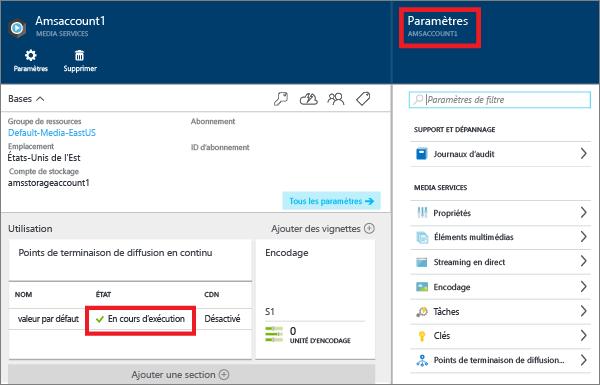
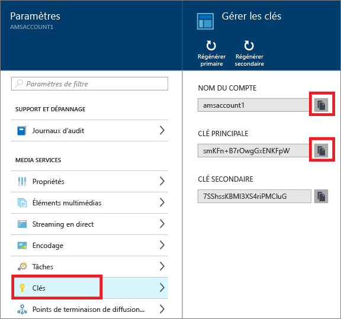
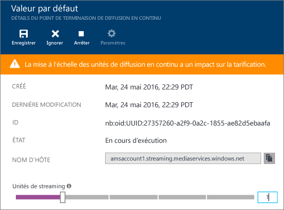
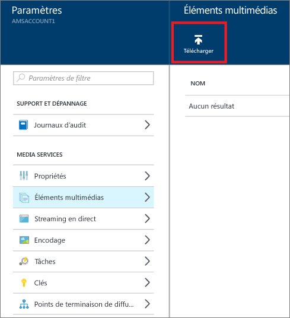
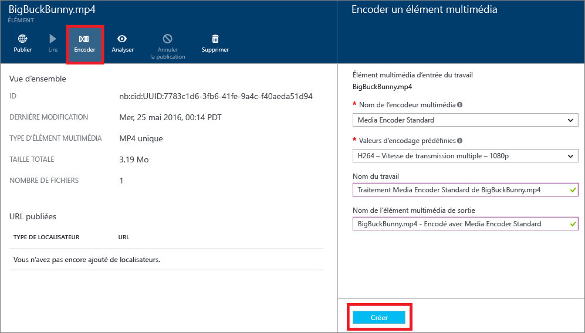
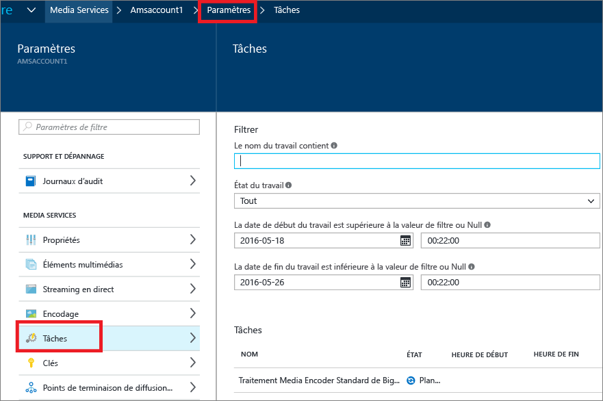
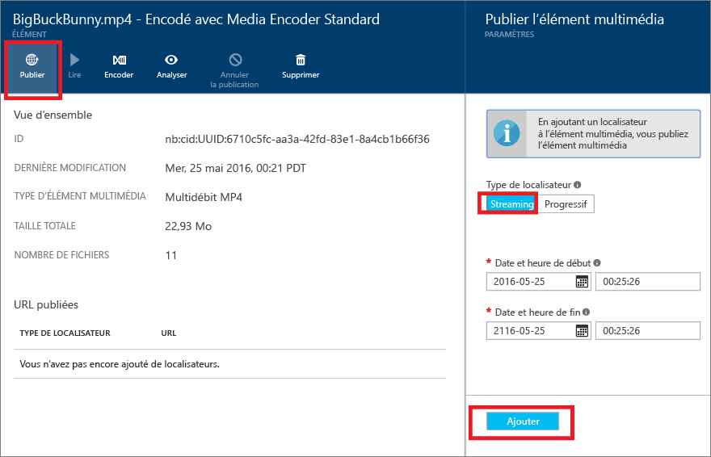
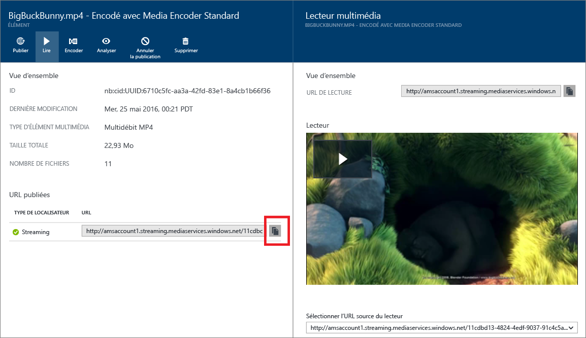

<properties
	pageTitle="Prise en main de la diffusion de contenus à la demande à l’aide du portail Azure | Microsoft Azure"
	description="Ce didacticiel explique comment implémenter un service de diffusion de contenu vidéo à la demande (VoD) de base avec l’application Azure Media Services (AMS) à l’aide du portail Azure."
	services="media-services"
	documentationCenter=""
	authors="Juliako"
	manager="erikre"
	editor=""/>

<tags
	ms.service="media-services"
	ms.workload="media"
	ms.tgt_pltfrm="na"
	ms.devlang="na"
	ms.topic="get-started-article"
	ms.date="06/05/2016"
	ms.author="juliako"/>

# Prise en main de la diffusion de contenus à la demande à l’aide du portail Azure (version préliminaire)

Ce didacticiel explique comment implémenter un service de diffusion de contenu vidéo à la demande (VoD) de base avec l’application Azure Media Services (AMS) à l’aide du portail Azure.

Azure Media Services est actuellement en version préliminaire dans le portail Azure.

> [AZURE.NOTE] Pour suivre ce didacticiel, vous avez besoin d'un compte Azure. Pour plus d'informations, consultez la page [Version d'évaluation gratuite d'Azure](https://azure.microsoft.com/pricing/free-trial/).

Ce didacticiel comprend les tâches suivantes :

1.  Créer un compte Azure Media Services.
2.  Configurer le point de terminaison de diffusion en continu.
1.  Télécharger un fichier vidéo.
1.  Encoder le fichier source en un ensemble de fichiers MP4 à débit adaptatif.
1.  Publier l'élément multimédia et obtenir les URL de diffusion et de téléchargement progressif.  
1.  Lire votre contenu.

## Créer un compte Azure Media Services

Les étapes de cette section expliquent comment créer un compte AMS.

1. Connectez-vous au [Portail Azure](https://portal.azure.com/).
2. Cliquez sur **+Nouveau** > **Media Service + CDN** > **Media Services**.

	

3. Dans **CREATE MEDIA SERVICES ACCOUNT** (CRÉER UN COMPTE MEDIA SERVICES), entrez les valeurs requises.

	
	
	1. Dans **Nom du compte**, entrez le nom du nouveau compte AMS. Un nom de compte Media Services se compose de chiffres ou de lettres en minuscules, sans espaces. Sa longueur est comprise entre 3 et 24 caractères.
	2. Dans Abonnement, sélectionnez l’un des différents abonnements Azure auxquels vous avez accès.
	
	2. Dans **Groupe de ressources**, sélectionnez la nouvelle ressource ou une ressource existante. Un groupe de ressources désigne une collection de ressources qui partagent un cycle de vie, des autorisations et des stratégies identiques. En savoir plus [ici](resource-group-overview.md#resource-groups).
	3. Dans **Emplacement**, sélectionnez la région géographique qui sera utilisée pour stocker les enregistrements multimédias et de métadonnées pour votre compte Media Services. Cette région servira à traiter et diffuser vos médias. Seules les régions Media Services disponibles s’affichent dans la liste déroulante. 
	
	3. Dans **Compte de stockage**, sélectionnez un compte de stockage pour fournir un stockage d’objets blob du contenu multimédia à partir de votre compte Media Services. Vous pouvez sélectionner un compte de stockage existant dans la même région géographique que votre compte Media Services ou en créer un. Ce dernier sera créé dans la même région. Les règles des noms de compte de stockage sont identiques à celles des comptes Media Services.

		Pour en savoir plus sur le stockage, cliquez [ici](storage-introduction.md).

	4. Sélectionnez **Épingler au tableau de bord** pour voir la progression du déploiement du compte.
	
7. Cliquez sur l’option **Créer** figurant en bas du formulaire.

	Une fois le compte est créé, il passe à l’état **En cours d’exécution**.

	

	Pour gérer votre compte AMS (par exemple, charger des vidéos, encoder des éléments multimédias ou surveiller la progression des tâches), utilisez la fenêtre **Paramètres**.

## Gérer les clés

Vous avez besoin du nom de compte et des informations de clé primaire pour accéder par programme au compte Media Services.

1. Dans le portail Azure, sélectionnez votre compte. 

	La fenêtre **Paramètres** s’affiche sur la droite.

2. Dans la fenêtre **Paramètres**, sélectionnez **Clés**.

	La fenêtre **Gérer les clés** affiche le nom du compte ainsi que les clés primaires et secondaires. 
3. Cliquez sur le bouton de copie pour copier les valeurs.
	
	

## Configurer les points de terminaison de diffusion en continu

Lorsque vous utilisez Azure Media Services, la diffusion à vos clients de vidéos en continu à débit binaire adaptatif constitue l’un des scénarios les plus courants. Avec la diffusion à débit binaire adaptatif, le client peut basculer vers un flux à débit binaire supérieur ou inférieur, car la vidéo est affichée en fonction de la bande passante réseau actuelle, de l’utilisation de l’UC et d’autres facteurs. Media Services prend en charge les technologies de diffusion en continu à débit binaire adaptatif suivantes : HTTP Live Streaming (HLS), Smooth Streaming, MPEG DASH et HDS (pour licences Adobe PrimeTime/Access uniquement).

Media Services fournit l’empaquetage dynamique qui permet de distribuer un contenu encodé en MP4 à débit binaire adaptatif dans un format pris en charge par Media Services (MPEG DASH, HLS, Smooth Streaming, HDS) sans avoir à stocker de versions pré-empaquetées de chacun de ces formats de diffusion en continu.

Pour tirer parti de l’empaquetage dynamique, vous devez effectuer les opérations suivantes :

- Encoder votre fichier mezzanine (source) dans un ensemble de fichiers MP4 à débit adaptatif (les étapes de codage sont décrites plus loin dans ce didacticiel).  
- Créer au moins une unité de diffusion pour le *point de terminaison de diffusion en continu* à partir duquel vous envisagez de distribuer votre contenu. La procédure ci-dessous explique comment modifier le nombre d’unités de diffusion en continu.

Avec l’empaquetage dynamique, vous devez stocker et payer les fichiers dans un seul format de stockage. Ensuite, Media Services crée et fournit la réponse appropriée en fonction des demandes des clients.

Pour créer et modifier le nombre d’unités réservées de diffusion en continu, procédez comme suit :

1. Dans la fenêtre **Paramètres**, cliquez sur **Points de terminaison de diffusion en continu**. 

2. Cliquez sur le point de terminaison de diffusion en continu par défaut.

	La fenêtre **DEFAULT STREAMING ENDPOINT DETAILS** (DÉTAILS DU POINT DE TERMINAISON DE DIFFUSION EN CONTINU PAR DÉFAUT) s’affiche.

3. Pour spécifier le nombre d’unités de diffusion en continu, faites glisser le curseur **Unités de diffusion en continu**.

	

4. Cliquez sur le bouton **Enregistrer** pour enregistrer vos modifications.

	>[AZURE.NOTE]L’allocation de nouvelles unités peut prendre environ 20 minutes.

## Charger des fichiers

Pour diffuser des vidéos en continu à l’aide d’Azure Media Services, vous devez télécharger les vidéos source, les encoder en plusieurs débits binaires et publier le résultat. Cette section décrit la première étape du processus.

1. Dans la fenêtre **Paramètres**, cliquez sur **Éléments multimédias**.

	

3. Cliquez sur le bouton **Télécharger**.

	La fenêtre **Upload a video asset** (Charger une vidéo) s’affiche.

	>[AZURE.NOTE] Il n’existe aucune limite de taille de fichier.
	
4. Accédez à la vidéo de votre choix sur votre ordinateur, sélectionnez-la, puis cliquez sur OK.

	Le chargement démarre ; vous pouvez en voir la progression sous le nom du fichier.

Une fois le chargement terminé, le nouvel élément multimédia s’affiche dans la fenêtre **Éléments multimédias**.

## Encoder des éléments multimédias

Lorsque vous travaillez avec Azure Media Services, un des scénarios les plus courants est la diffusion de contenu à débit adaptatif à vos clients. Media Services prend en charge les technologies de diffusion en continu à débit binaire adaptatif suivantes : HTTP Live Streaming (HLS), Smooth Streaming, MPEG DASH et HDS (pour licences Adobe PrimeTime/Access uniquement). Pour préparer vos vidéos au streaming à débit adaptatif, vous devez encoder votre vidéo source en fichiers à débit binaire multiple. Vous devez utiliser l’encodeur **Media Encoder Standard** pour encoder votre vidéo.

Media Services fournit également l’empaquetage dynamique qui vous permet de distribuer des fichiers MP4 à débit binaire multiple dans les formats MPEG DASH, HLS, Smooth Streaming ou HDS, sans avoir à recréer de nouveaux packages dans ces formats. Avec l’empaquetage dynamique, vous devez stocker et payer les fichiers dans un seul format de stockage. Ensuite, Media Services crée et fournit la réponse appropriée en fonction des demandes des clients.

Pour tirer parti de l’empaquetage dynamique, vous devez effectuer les opérations suivantes :

- Encoder votre fichier source dans un ensemble de fichiers MP4 à débit binaire multiple (les étapes de codage sont décrites plus loin dans cette section).
- Obtenir au moins une unité de diffusion pour le point de terminaison de diffusion à partir duquel vous envisagez de distribuer votre contenu. Pour plus d’informations, consultez la section relative à la [configuration des points de terminaison de diffusion en continu](media-services-portal-vod-get-started.md#configure-streaming-endpoints). 

### Pour effectuer l’encodage à l’aide du portail

Cette section décrit les étapes à suivre pour encoder votre contenu avec Media Encoder Standard.

1.  Dans la fenêtre **Paramètres**, sélectionnez **Éléments multimédias**.  
2.  Dans la fenêtre **Éléments multimédias**, sélectionnez l’élément que vous souhaitez encoder.
3.  Appuyez sur le bouton **Encoder**.
4.  Dans la fenêtre **Encode an asset** (Encoder un élément multimédia), sélectionnez le processeur « Media Encoder Standard » et choisissez une présélection. Par exemple, si vous savez que votre vidéo d’entrée possède une résolution de 1920 x 1080 pixels, vous pouvez utiliser la présélection « H264 Multiple Bitrate 1080p ». Pour plus d’informations sur les présélections, consultez [cet article](https://msdn.microsoft.com/library/azure/mt269960.aspx) ; il est important de choisir la présélection qui convient le mieux pour votre vidéo d’entrée. Si vous avez une vidéo de basse résolution (640 x 360), il est préférable de ne pas utiliser la présélection par défaut « H264 Multiple Bitrate1080p ».
	
	Pour des questions pratiques, vous avez la possibilité de modifier le nom de l’élément multimédia de sortie ainsi que le nom de la tâche.
		
	
5. Appuyez sur **Créer**.

### Suivi de la progression de la tâche d’encodage

Pour surveiller la progression de la tâche d’encodage, cliquez sur **Paramètres** (en haut de la page), puis sélectionnez **Travaux**.

## Publication de contenu

Pour fournir aux utilisateurs une URL pouvant être utilisée pour diffuser en continu ou télécharger votre contenu, vous devez d’abord « publier » votre élément multimédia en créant un localisateur. Les localisateurs assurent l’accès aux fichiers contenus dans l’élément multimédia. Media Services prend en charge deux types de localisateurs :

- les localisateurs de diffusion en continu (OnDemandOrigin), utilisés pour la diffusion adaptative (par exemple, MPEG DASH, HLS ou Smooth Streaming) ; Pour créer un localisateur de diffusion en continu, votre élément multimédia doit contenir un fichier .ism ; 
- les localisateurs progressifs (SAS), utilisés pour la diffusion de vidéo par téléchargement progressif.

Les URL de diffusion en continu, que vous pouvez utiliser pour lire des éléments multimédias Smooth Streaming, ont le format suivant.

	{streaming endpoint name-media services account name}.streaming.mediaservices.windows.net/{locator ID}/{filename}.ism/Manifest

Pour créer une URL de diffusion en continu HLS, ajoutez (format=m3u8-aapl) à l’URL.

	{streaming endpoint name-media services account name}.streaming.mediaservices.windows.net/{locator ID}/{filename}.ism/Manifest(format=m3u8-aapl)

Pour créer une URL de diffusion en continu MPEG DASH, ajoutez (format=mpd-time-csf) à l’URL.

	{streaming endpoint name-media services account name}.streaming.mediaservices.windows.net/{locator ID}/{filename}.ism/Manifest(format=mpd-time-csf)

Une URL SAS a le format suivant :

	{blob container name}/{asset name}/{file name}/{SAS signature}

>[AZURE.NOTE] Si vous avez utilisé le portail pour créer des localisateurs avant mars 2015, des localisateurs présentant une date d’expiration de deux ans ont été créés.

Pour mettre à jour la date d’expiration d’un localisateur, utilisez les API [REST](http://msdn.microsoft.com/library/azure/hh974308.aspx#update_a_locator) ou [.NET](http://go.microsoft.com/fwlink/?LinkID=533259). Notez que lorsque vous mettez à jour la date d’expiration d’un localisateur SAS, l’URL est modifiée.

### Pour publier un élément multimédia à l’aide du portail

Pour utiliser le portail pour publier un élément multimédia, procédez comme suit :

1. Sélectionnez **Paramètres** > **Éléments multimédias**.
1. Sélectionnez l’élément que vous souhaitez publier.
1. Cliquez sur le bouton **Publier**.
1. Sélectionnez le type de localisateur.
2. Cliquez sur **Ajouter**.

	

L’URL sera ajoutée à la liste des **URL publiées**.

## Lecture de contenu sur le portail

Le portail Azure propose un lecteur de contenu que vous pouvez utiliser pour tester votre vidéo.

Cliquez sur la vidéo de votre choix, puis sur le bouton **Lire**.

Certaines considérations s’appliquent :

- Assurez-vous que la vidéo a été publiée.
- Le *lecteur multimédia* assure la lecture depuis le point de terminaison de diffusion en continu par défaut. Si vous souhaitez lire à partir d’un autre point de terminaison de diffusion en continu que celui par défaut, cliquez sur l’URL pour la copier et utilisez un autre lecteur, par exemple, le [lecteur Azure Media Services](http://amsplayer.azurewebsites.net/azuremediaplayer.html).

##Étapes suivantes : parcours d’apprentissage Media Services

[AZURE.INCLUDE [media-services-learning-paths-include](../../includes/media-services-learning-paths-include.md)]

##Fournir des commentaires

[AZURE.INCLUDE [media-services-user-voice-include](../../includes/media-services-user-voice-include.md)]

<!---HONumber=AcomDC_0608_2016-->