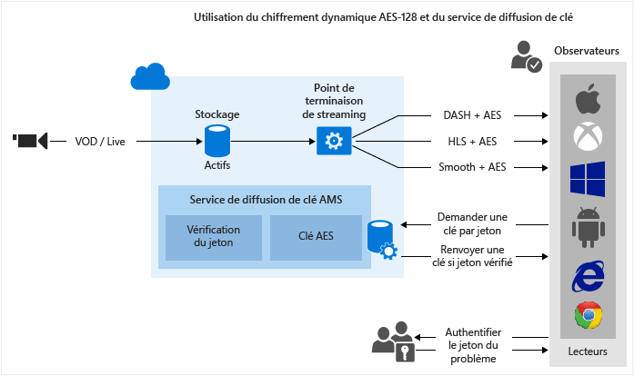

# Utilisation du chiffrement dynamique AES-128 et du service de distribution des clés
> [!div class="op_single_selector"]
> * [.NET](media-services-protect-with-aes128.md)
> * [Java](https://github.com/southworkscom/azure-sdk-for-media-services-java-samples)
> * [PHP](https://github.com/Azure/azure-sdk-for-php/tree/master/examples/MediaServices)
> 
> 

## Vue d'ensemble
> [!NOTE]
> Consultez [cette](https://channel9.msdn.com/Shows/Azure-Friday/Azure-Media-Services-Protecting-your-Media-Content-with-AES-Encryption) vidéo pour une vue d’ensemble sur la façon de protéger votre contenu multimédia avec le chiffrement AES.
> 
> 

Microsoft Azure Media Services permet de transmettre du contenu HLS (Http-Live-Streaming) et des flux lisses (Smooth Streams) chiffrés avec la norme AES (Advanced Encryption Standard) (à l’aide de clés de chiffrement 128 bits). Media Services assure également le service de distribution des clés qui fournit des clés de chiffrement aux utilisateurs autorisés. Si vous souhaitez que Media Services chiffre un élément multimédia, vous devez associer une clé de chiffrement à l'élément multimédia et configurer des stratégies d'autorisation pour la clé. Lorsqu’un lecteur demande un flux de données, Media Services utilise la clé spécifiée pour chiffrer dynamiquement votre contenu à l’aide du chiffrement AES. Pour déchiffrer le flux de données, le lecteur demande la clé au service de remise de clé. Pour déterminer si l’utilisateur est autorisé à obtenir la clé, le service évalue les stratégies d’autorisation que vous avez spécifiées pour la clé.

Media Services prend en charge plusieurs méthodes d’authentification des utilisateurs effectuant des demandes de clé. La stratégie d’autorisation des clés de contenu peut comporter une ou plusieurs restrictions d’autorisation : ouverte ou restriction à jeton. La stratégie de restriction à jeton doit être accompagnée d’un jeton émis par un service de jeton sécurisé (STS). Media Services prend en charge les jetons aux formats [SWT](https://msdn.microsoft.com/library/gg185950.aspx#BKMK_2) (Simple Web Tokens) et [JWT](https://msdn.microsoft.com/library/gg185950.aspx#BKMK_3) (JSON Web Token). Pour plus d’informations, consultez [Configurer la stratégie d’autorisation de clé de contenu](media-services-protect-with-aes128.md#configure_key_auth_policy).

Pour tirer parti du chiffrement dynamique, vous devez avoir un élément multimédia qui contient un ensemble de fichiers MP4 à débit binaire multiple ou de fichiers sources de diffusion en continu lisse (Smooth Streaming) à débit binaire multiple. Vous devez également configurer la stratégie de remise pour l'élément multimédia (décrite plus loin dans cette rubrique). Ensuite, en fonction du format spécifié dans l'URL de diffusion, le serveur de streaming à la demande s'assure que le flux est livré conformément au protocole choisi. Par conséquent, il vous suffit de stocker et de payer les fichiers dans un seul format de stockage. Le service Media Services se charge de créer et de fournir la réponse appropriée en fonction des demandes des clients.

Cette rubrique peut être utile pour les développeurs travaillant sur des applications qui fournissent du contenu multimédia protégé. La rubrique vous montre comment configurer le service de distribution des clés avec des stratégies d'autorisation, afin que seuls les clients autorisés puissent recevoir les clés de chiffrement. Elle vous montre également comment utiliser le chiffrement dynamique.

## Flux de travail du chiffrement dynamique AES-128 et du service de distribution des clés

Voici les étapes générales que vous aurez à exécuter lors du chiffrement de vos éléments multimédias avec AES, en utilisant le service de distribution des clés Media Services, ainsi que le chiffrement dynamique.

1. [Créer un élément multimédia et télécharger des fichiers dans l’élément multimédia](media-services-protect-with-aes128.md#create_asset).
2. [Encoder l'élément multimédia contenant le fichier selon le débit binaire MP4 défini](media-services-protect-with-aes128.md#encode_asset).
3. [Créer une clé de contenu et l’associer à l’élément multimédia encodé](media-services-protect-with-aes128.md#create_contentkey). Dans Media Services, la clé de contenu contient la clé de chiffrement de l'élément multimédia.
4. [Configurer la stratégie d’autorisation de la clé de contenu](media-services-protect-with-aes128.md#configure_key_auth_policy). La stratégie d'autorisation de la clé de contenu doit être configurée par vous et respectée par le client afin que la clé de contenu soit remise au client.
5. [Configurer la stratégie de remise pour un élément multimédia](media-services-protect-with-aes128.md#configure_asset_delivery_policy). La configuration de la stratégie de remise inclut : l’URL d’acquisition de clé et le vecteur d’initialisation (IV) (AES 128 nécessite que le vecteur d’initialisation fourni pour le chiffrement et le déchiffrement soit similaire), le protocole de remise (par exemple, MPEG DASH, HLS, Smooth Streaming ou tous), le type de chiffrement dynamique (par exemple, enveloppe ou aucun chiffrement dynamique).

    Vous pouvez appliquer des stratégies différentes à chaque protocole dans le même élément multimédia. Par exemple, vous pouvez appliquer le chiffrement PlayReady à Smooth/DASH et AES Envelope à HLS. Tous les protocoles qui ne sont pas définis dans une stratégie de remise (par exemple, en cas d’ajout d’une stratégie unique qui spécifie uniquement TLS comme protocole) seront bloqués de la diffusion en continu. Cela ne s’applique toutefois pas si vous n’avez défini aucune stratégie de remise de ressources. Tous les protocoles seront alors autorisés.

6. [Créer un localisateur à la demande](media-services-protect-with-aes128.md#create_locator) afin d’obtenir une URL de diffusion en continu.

La rubrique présente également [comment une application cliente peut demander une clé au service de distribution des clés](media-services-protect-with-aes128.md#client_request).

Vous trouverez un [exemple](media-services-protect-with-aes128.md#example) .NET complet à la fin de la rubrique.

L'illustration suivante montre le flux de travail décrit ci-dessus. Ici, le jeton est utilisé pour l'authentification.

Le reste de cette rubrique fournit des explications détaillées, des exemples de code et des liens vers des rubriques qui vous expliquent comment réaliser les tâches décrites ci-dessus.

## Limitations actuelles
Si vous ajoutez ou mettez à jour la stratégie de remise de votre ressource, vous devez supprimer le localisateur existant (le cas échéant) et en créer un nouveau.

## Créer un élément multimédia et télécharger des fichiers dans l’élément multimédia
Pour gérer, encoder et diffuser vos vidéos, vous devez d'abord télécharger votre contenu dans Microsoft Azure Media Services. Une fois téléchargé, votre contenu est stocké en toute sécurité dans le cloud et peut faire l’objet d’un traitement et d’une diffusion en continu. 

Pour plus d’informations, consultez [Charger des fichiers vers un compte Media Services](media-services-dotnet-upload-files.md).

## Encoder l’élément multimédia contenant le fichier selon le débit binaire MP4 défini
Avec le chiffrement dynamique, il vous suffit de créer un élément multimédia qui contient un ensemble de fichiers MP4 à débit binaire multiple ou de fichiers sources de diffusion en continu lisse à débit binaire multiple. Ensuite, en fonction du format spécifié dans le manifeste ou la demande de fragment, le serveur de diffusion en continu à la demande s'assure que vous recevez le flux conforme au protocole choisi. Par conséquent, il vous suffit de stocker et de payer les fichiers dans un seul format de stockage. Le service Media Services se charge de créer et de fournir la réponse appropriée en fonction des demandes des clients. Pour plus d’informations, consultez la rubrique [Vue d’ensemble de l’empaquetage dynamique](media-services-dynamic-packaging-overview.md).

>[!NOTE]
>Une fois votre compte AMS créé, un point de terminaison de streaming **par défaut** est ajouté à votre compte à l’état **Arrêté**. Pour démarrer la diffusion en continu de votre contenu et tirer parti de l’empaquetage et du chiffrement dynamiques, le point de terminaison de streaming à partir duquel vous souhaitez diffuser du contenu doit se trouver à l’état **En cours d’exécution**. 
>
>De plus, pour pouvoir utiliser l’empaquetage et le chiffrement dynamiques, votre ressource doit contenir un ensemble de MP4 à débit adaptatif ou des fichiers de diffusion en continu lisse à débit adaptatif.

Pour savoir comment encoder, consultez [Encodage d’un élément multimédia à l’aide de Media Encoder Standard](media-services-dotnet-encode-with-media-encoder-standard.md).

## Créer une clé de contenu et l’associer à l’élément multimédia encodé
Dans Media Services, la clé de contenu contient la clé que vous souhaitez utiliser pour chiffrer un élément multimédia.

Pour plus d’informations, consultez [Créer une clé de contenu](media-services-dotnet-create-contentkey.md).

## Configurez la stratégie d’autorisation de la clé de contenu.
Media Services prend en charge plusieurs méthodes d’authentification des utilisateurs effectuant des demandes de clé. La stratégie d'autorisation de la clé de contenu doit être configurée par vous et respectée par le client (lecteur) afin que la clé soit remise au client. La stratégie d’autorisation des clés de contenu peut avoir une ou plusieurs restrictions d’autorisations : ouvert, restriction par jeton ou restriction IP.

Pour plus d’informations, consultez [Configurer la stratégie d’autorisation de clé de contenu](media-services-dotnet-configure-content-key-auth-policy.md).

## Configurer la stratégie de distribution d’éléments multimédia
Configurez la stratégie de remise pour votre élément multimédia. Certains éléments que la configuration de la stratégie de remise de l'élément multimédia inclut :

* L'URL d'acquisition de la clé. 
* Le vecteur d'initialisation (IV) à utiliser pour le chiffrement d'enveloppe. AES 128 nécessite que le vecteur d'initialisation fourni pour le chiffrement et le déchiffrement soit similaire. 
* Le protocole de remise de l’élément multimédia (par exemple, MPEG DASH, HLS, Smooth Streaming ou tous).
* Le type de chiffrement dynamique (par exemple, AES Envelope) ou aucun chiffrement dynamique. 

Pour plus d’informations, consultez [Configurer la stratégie de distribution d’éléments multimédia ](media-services-rest-configure-asset-delivery-policy.md).

## Créer un localisateur de diffusion en continu à la demande afin d’obtenir une URL de diffusion en continu
Vous devrez fournir aux utilisateurs l'URL de diffusion en continu pour Smooth, DASH ou HLS.

> [!NOTE]
> Si vous ajoutez ou mettez à jour la stratégie de remise de votre ressource, vous devez supprimer le localisateur existant (le cas échéant) et en créer un nouveau.
> 
> 

Pour savoir comment publier une ressource et générer une URL de diffusion en continu, consultez [Générer une URL de diffusion en continu](media-services-deliver-streaming-content.md).

## Obtenir un test de jeton
Obtenez un jeton de test basé sur la restriction par jeton utilisée pour la stratégie d’autorisation de clé.

    // Deserializes a string containing an Xml representation of a TokenRestrictionTemplate
    // back into a TokenRestrictionTemplate class instance.
    TokenRestrictionTemplate tokenTemplate = 
        TokenRestrictionTemplateSerializer.Deserialize(tokenTemplateString);

    // Generate a test token based on the data in the given TokenRestrictionTemplate.
    //The GenerateTestToken method returns the token without the word “Bearer” in front
    //so you have to add it in front of the token string. 
    string testToken = TokenRestrictionTemplateSerializer.GenerateTestToken(tokenTemplate);
    Console.WriteLine("The authorization token is:\nBearer {0}", testToken);

Vous pouvez utiliser le [lecteur AMS](http://amsplayer.azurewebsites.net/azuremediaplayer.html) pour tester votre flux.

## Comment votre client peut-il demander une clé à partir du service de distribution des clés ?
Dans l'étape précédente, vous avez construit l'URL qui pointe vers un fichier manifeste. Votre client doit extraire les informations nécessaires à partir des fichiers manifeste de diffusion en continu afin d'effectuer une demande au service de distribution des clés.

### Fichiers manifeste
Le client doit extraire la valeur de l'URL (qui contient également l'ID de la clé de contenu (kid)) à partir du fichier manifeste. Ensuite, le client doit essayer d'obtenir la clé de chiffrement à partir du service de distribution des clés. Le client doit également extraire la valeur IV et l’utiliser pour déchiffrer le flux. L’extrait de code suivant montre l’élément <Protection> du manifeste Smooth Streaming.

    <Protection>
      <ProtectionHeader SystemID="B47B251A-2409-4B42-958E-08DBAE7B4EE9">
        <ContentProtection xmlns:sea="urn:mpeg:dash:schema:sea:2012" schemeIdUri="urn:mpeg:dash:sea:2012">
          <sea:SegmentEncryption schemeIdUri="urn:mpeg:dash:sea:aes128-cbc:2013"/>
          <sea:KeySystem keySystemUri="urn:mpeg:dash:sea:keysys:http:2013"/>
          <sea:CryptoPeriod IV="0xD7D7D7D7D7D7D7D7D7D7D7D7D7D7D7D7" 
                            keyUriTemplate="https://wamsbayclus001kd-hs.cloudapp.net/HlsHandler.ashx?
                                            kid=da3813af-55e6-48e7-aa9f-a4d6031f7b4d"/>
        </ContentProtection>
      </ProtectionHeader>
    </Protection>

Dans le cas de HLS, le manifeste racine est divisé en fichiers de segment. 

Par exemple, le manifeste racine est : http://test001.origin.mediaservices.windows.net/8bfe7d6f-34e3-4d1a-b289-3e48a8762490/BigBuckBunny.ism/manifest(format=m3u8-aapl) et il contient une liste de noms de fichiers de segment.

    . . . 
    #EXT-X-STREAM-INF:PROGRAM-ID=1,BANDWIDTH=630133,RESOLUTION=424x240,CODECS="avc1.4d4015,mp4a.40.2",AUDIO="audio"
    QualityLevels(514369)/Manifest(video,format=m3u8-aapl)
    #EXT-X-STREAM-INF:PROGRAM-ID=1,BANDWIDTH=965441,RESOLUTION=636x356,CODECS="avc1.4d401e,mp4a.40.2",AUDIO="audio"
    QualityLevels(842459)/Manifest(video,format=m3u8-aapl)
    …

Si vous ouvrez l’un des fichiers de segment dans l’éditeur de texte (par exemple, http://test001.origin.mediaservices.windows.net/8bfe7d6f-34e3-4d1a-b289-3e48a8762490/BigBuckBunny.ism/QualityLevels(514369)/Manifest(video,format=m3u8-aapl), il doit contenir #EXT-X-KEY qui indique que le fichier est chiffré.

    #EXTM3U
    #EXT-X-VERSION:4
    #EXT-X-ALLOW-CACHE:NO
    #EXT-X-MEDIA-SEQUENCE:0
    #EXT-X-TARGETDURATION:9
    #EXT-X-KEY:METHOD=AES-128,
    URI="https://wamsbayclus001kd-hs.cloudapp.net/HlsHandler.ashx?
         kid=da3813af-55e6-48e7-aa9f-a4d6031f7b4d",
            IV=0XD7D7D7D7D7D7D7D7D7D7D7D7D7D7D7D7
    #EXT-X-PROGRAM-DATE-TIME:1970-01-01T00:00:00.000+00:00
    #EXTINF:8.425708,no-desc
    Fragments(video=0,format=m3u8-aapl)
    #EXT-X-ENDLIST

>[!NOTE] 
>Si vous envisagez de lire un flux HLS chiffré par AES dans Safari, consultez [ce billet de blog](https://azure.microsoft.com/blog/how-to-make-token-authorized-aes-encrypted-hls-stream-working-in-safari/).

### Demander la clé au service de distribution des clés

Le code suivant montre comment envoyer une requête au service de distribution des clés Media Services à l'aide d'un Uri (extrait du manifeste) de remise de clé et d'un jeton (cette rubrique ne traite pas de l'obtention de jetons Simple Web à partir d'un service de jeton sécurisé).

    private byte[] GetDeliveryKey(Uri keyDeliveryUri, string token)
    {
        HttpWebRequest request = (HttpWebRequest)WebRequest.Create(keyDeliveryUri);

        request.Method = "POST";
        request.ContentType = "text/xml";
        if (!string.IsNullOrEmpty(token))
        {
            request.Headers[AuthorizationHeader] = token;
        }
        request.ContentLength = 0;

        var response = request.GetResponse();

        var stream = response.GetResponseStream();
        if (stream == null)
        {
            throw new NullReferenceException("Response stream is null");
        }

        var buffer = new byte[256];
        var length = 0;
        while (stream.CanRead && length <= buffer.Length)
        {
            var nexByte = stream.ReadByte();
            if (nexByte == -1)
            {
                break;
            }
            buffer[length] = (byte)nexByte;
            length++;
        }
        response.Close();

        // AES keys must be exactly 16 bytes (128 bits).
        var key = new byte[length];
        Array.Copy(buffer, key, length);
        return key;
    }

## Protéger votre contenu avec AES-128 en utilisant .NET

### Créer et configurer un projet Visual Studio

1. Configurez votre environnement de développement et ajoutez des informations de connexion au fichier app.config selon la procédure décrite dans l’article [Développement Media Services avec .NET](media-services-dotnet-how-to-use.md). 
2. Ajoutez les éléments suivants aux **appSettings** définis dans votre fichier app.config :

        <add key="Issuer" value="http://testacs.com"/>
        <add key="Audience" value="urn:test"/>

### Exemple

Remplacez le code dans votre fichier Program.cs par le code présenté dans cette section.
 
>[!NOTE]
>Un nombre limite de 1 000 000 a été défini pour les différentes stratégies AMS (par exemple, pour la stratégie de localisateur ou pour ContentKeyAuthorizationPolicy). Vous devez utiliser le même ID de stratégie si vous utilisez toujours les mêmes jours / autorisations d’accès, par exemple, les stratégies pour les localisateurs destinées à demeurer en place pendant une longue période (stratégies sans chargement). Pour plus d’informations, consultez [cette rubrique](media-services-dotnet-manage-entities.md#limit-access-policies) .

Veillez à mettre à jour les variables pour pointer vers les dossiers où se trouvent vos fichiers d'entrée.

[!code-csharp[Main](../../samples-mediaservices-encryptionaes/DynamicEncryptionWithAES/DynamicEncryptionWithAES/Program.cs)]

## Parcours d’apprentissage de Media Services
[!INCLUDE [media-services-learning-paths-include](../../includes/media-services-learning-paths-include.md)]

## Fournir des commentaires
[!INCLUDE [media-services-user-voice-include](../../includes/media-services-user-voice-include.md)]

