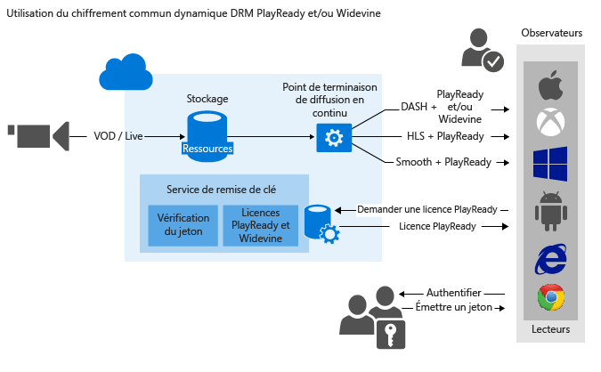

<properties
	pageTitle="Utilisation du chiffrement commun dynamique PlayReady et/ou Widevine"
	description="Microsoft Azure Media Services vous permet de fournir des flux MPEG-DASH, Smooth Streaming et HLS (Http-Live-Streaming) protégés par Microsoft PlayReady DRM. Vous pouvez également l’utiliser pour diffuser du contenu DASH chiffré avec Widevine DRM. Cette rubrique montre comment chiffrer dynamiquement avec PlayReady et Widevine DRM."
	services="media-services"
	documentationCenter=""
	authors="Juliako,Mingfeiy"
	manager="dwrede"
	editor=""/>

<tags
	ms.service="media-services"
	ms.workload="media"
	ms.tgt_pltfrm="na"
	ms.devlang="na"
	ms.topic="get-started-article" 
	ms.date="01/20/2016" 
	ms.author="juliako"/>

#Utilisation du chiffrement commun dynamique PlayReady et/ou Widevine

> [AZURE.SELECTOR]
- [.NET](media-services-protect-with-drm.md)
- [Java](https://github.com/southworkscom/azure-sdk-for-media-services-java-samples)
- [PHP](https://github.com/Azure/azure-sdk-for-php/tree/master/examples/MediaServices)

Microsoft Azure Media Services vous permet de fournir des flux MPEG-DASH chiffrés, Smooth Streaming et HLS (HTTP-Live-Streaming) protégés par des licences [Microsoft PlayReady DRM](https://www.microsoft.com/playready/overview/). Vous pouvez également l’utiliser pour diffuser du contenu DASH chiffré avec des licences Widevine DRM. PlayReady et Widewine sont chiffrés conformément à la spécification de chiffrement commun (ISO/IEC 23001-7 CENC). Vous pouvez utiliser [AMS .NET SDK](https://www.nuget.org/packages/windowsazure.mediaservices/) (en commençant par la version 3.5.1) ou une API REST pour configurer votre AssetDeliveryConfiguration afin d’utiliser Widevine.

Media Services fournit un service pour la distribution de licences Microsoft PlayReady. Media Services fournit également des API qui vous permettent de configurer les droits et les restrictions que vous souhaitez pour le runtime DRM PlayReady, qui s’appliquent lorsqu’un utilisateur lit un contenu protégé. Lorsqu’un utilisateur demande un contenu protégé par PlayReady, l’application de lecteur demande une licence du service de licence AMS. Le service de licence AMS émet une licence pour le lecteur s’il est autorisé. Une licence PlayReady contient la clé de déchiffrement qui peut être utilisée par le lecteur client pour déchiffrer et diffuser le contenu.

En commençant par le kit de développement logiciel Media Services .NET version 3.5.2, Media Services vous pouvez également configurer le modèle de licence Widevine et d’obtenir des licences Widevine.

>[AZURE.NOTE]Les services de livraison Widevine fournis par Azure Media Services sont en mode Aperçu. Pour plus d’informations, consultez [ce blog](https://azure.microsoft.com/blog/announcing-google-widevine-license-delivery-services-public-preview-in-azure-media-services/).

Vous pouvez également utiliser les partenaires AMS suivants pour vous aider à distribuer des licences Widevine : [Axinom](http://www.axinom.com/press/ibc-axinom-drm-6/), [EZDRM](http://ezdrm.com/), [castLabs](http://castlabs.com/company/partners/azure/). Pour plus d’informations, consultez : Intégration à [Axinom](media-services-axinom-integration.md) et [castLabs](media-services-castlabs-integration.md).

Media Services prend en charge plusieurs méthodes d’autorisation des utilisateurs effectuant des demandes de clé. La stratégie d’autorisation des clés de contenu peut comporter une ou plusieurs restrictions d’autorisation : ouverte ou restriction à jeton. La stratégie de restriction à jeton doit être accompagnée d’un jeton émis par un service de jeton sécurisé (STS). Media Services prend en charge les jetons aux formats [Simple Web Tokens](https://msdn.microsoft.com/library/gg185950.aspx#BKMK_2) (SWT) et [JSON Web Token](https://msdn.microsoft.com/library/gg185950.aspx#BKMK_3) (JWT). Pour plus d'informations, consultez Configurer la stratégie d'autorisation de la clé de contenu.

Pour tirer parti du chiffrement dynamique, vous devez avoir un élément multimédia qui contient un ensemble de fichiers MP4 à débit binaire multiple ou de fichiers sources de diffusion en continu lisse (Smooth Streaming) à débit binaire multiple. Vous devez également configurer les stratégies de remise pour l’élément multimédia (décrite plus loin dans cette rubrique). Ensuite, en fonction du format spécifié dans l'URL de diffusion, le serveur de streaming à la demande s'assure que le flux est livré conformément au protocole choisi. Par conséquent, il vous suffit de stocker et de payer les fichiers dans un seul format de stockage. Media Services se charge de créer et de fournir la réponse HTTP appropriée à chaque demande des clients.

Cette rubrique peut être utile aux développeurs travaillant sur des applications qui fournissent un support protégé avec plusieurs DRM comme PlayReady et Widevine. La rubrique vous montre comment configurer le service de distribution des licences PlayReady avec des stratégies d’autorisation, afin que seuls les clients autorisés puissent recevoir les licences PlayReady ou Widevine. Il indique également comment utiliser le chiffrement de cryptage dynamique avec PlayReady ou Widevine DRM sur DASH.

>[AZURE.NOTE]Pour utiliser le chiffrement dynamique, vous devez d'abord obtenir au moins une unité d'échelle (également appelée unité de diffusion en continu). Pour plus d'informations, consultez [Mise à l'échelle d'un service de média](media-services-manage-origins.md#scale_streaming_endpoints).

##Charger l’exemple

Vous pouvez télécharger l’exemple décrit dans cet article à partir d’[ici](https://github.com/Azure-Samples/media-services-dotnet-dynamic-encryption-with-drm).

##Configuration de Dynamic Common Encryption et services de distribution de licences DRM

Voici les étapes générales que vous aurez à exécuter lors de la protection de vos éléments multimédias avec PlayReady, en utilisant le service de distribution des licences Media Services, ainsi que le chiffrement dynamique.

1. Créer un élément multimédia et télécharger des fichiers dans l'élément multimédia. 
1. Encoder l'élément multimédia contenant le fichier selon le débit binaire MP4 défini.
1. Créer une clé de contenu et l'associer à l'élément multimédia encodé. Dans Media Services, la clé de contenu contient la clé de chiffrement de l'élément multimédia. 
1. Configurer la stratégie d'autorisation de la clé de contenu. La stratégie d'autorisation de la clé de contenu doit être configurée par vous et respectée par le client afin que la clé de contenu soit remise au client.

	Lorsque vous créez la stratégie d’autorisation de clé de contenu, vous devez spécifier les éléments suivants : méthode de livraison (PlayReady ou Widevine), restrictions de remise (ouvertes ou jeton) et informations spécifiques au type de remise de clé qui définit comment la clé est fournie au client (modèle de licence [PlayReady](media-services-playready-license-template-overview.md) ou [Widevine](media-services-widevine-license-template-overview.md)). 
1. Configurer la stratégie de remise pour un élément multimédia. La configuration de la stratégie de remise inclut : le protocole de remise (par exemple, MPEG DASH, HLS, HDS, Smooth Streaming ou tous), le type de chiffrement dynamique (par exemple, Common Encryption), l’URL d’acquisition de licence PlayReady ou Widevine. 
 
	Vous pouvez appliquer des stratégies différentes à chaque protocole dans le même élément multimédia. Par exemple, vous pouvez appliquer le chiffrement PlayReady à Smooth/DASH et AES Envelope à HLS. Tous les protocoles qui ne sont pas définis dans une stratégie de remise (par exemple, en cas d’ajout d’une stratégie unique qui spécifie uniquement TLS comme protocole) seront bloqués de la diffusion en continu. Cela ne s’applique toutefois pas si vous n’avez défini aucune stratégie de remise de ressources. Tous les protocoles seront alors autorisés.
1. Créer un localisateur à la demande afin d'obtenir une URL de diffusion en continu.

Vous trouverez un exemple .NET complet à la fin de la rubrique.

L'illustration suivante montre le flux de travail décrit ci-dessus. Ici, le jeton est utilisé pour l'authentification.

Le reste de cette rubrique fournit des explications détaillées, des exemples de code et des liens vers des rubriques qui vous expliquent comment réaliser les tâches décrites ci-dessus.

##Limitations actuelles

Si vous ajoutez ou mettez à jour une stratégie de remise de ressource, vous devez supprimer le localisateur associé (le cas échéant) et en créer un nouveau.

Limites lors du chiffrement Widevine avec Azure Media Services : actuellement, plusieurs clés de contenu ne sont pas prises en charge.

##Créer un élément multimédia et télécharger des fichiers dans l'élément multimédia

Pour gérer, encoder et diffuser vos vidéos, vous devez d'abord télécharger votre contenu dans Microsoft Azure Media Services. Une fois téléchargé, votre contenu est stocké en toute sécurité dans le cloud et peut faire l’objet d’un traitement et d’une diffusion en continu.

Pour plus d’informations, consultez [Charger des fichiers vers un compte Media Services](media-services-dotnet-upload-files.md).

##Encoder l'élément multimédia contenant le fichier selon le débit binaire MP4 défini

Avec le chiffrement dynamique, il vous suffit de créer un élément multimédia qui contient un ensemble de fichiers MP4 à débit binaire multiple ou de fichiers sources de diffusion en continu lisse à débit binaire multiple. Ensuite, en fonction du format spécifié dans le manifeste et la demande de fragment, le serveur de diffusion en continu à la demande s’assure que vous recevez le flux conforme au protocole choisi. Par conséquent, il vous suffit de stocker et de payer les fichiers dans un seul format de stockage. Le service Media Services se charge de créer et de fournir la réponse appropriée en fonction des demandes des clients. Pour plus d’informations, consultez la rubrique [Vue d’ensemble de l’empaquetage dynamique](media-services-dynamic-packaging-overview.md).

Pour savoir comment encoder, consultez [Encodage d’un élément multimédia à l’aide de Media Encoder Standard](media-services-dotnet-encode-with-media-encoder-standard.md).
	

##Créer une clé de contenu et l’associer à l’élément multimédia encodé

Dans Media Services, la clé de contenu contient la clé que vous souhaitez utiliser pour chiffrer un élément multimédia.

Pour plus d’informations, consultez [Créer une clé de contenu](media-services-dotnet-create-contentkey.md).

##Configurez la stratégie d’autorisation de la clé de contenu.

Media Services prend en charge plusieurs méthodes d’authentification des utilisateurs effectuant des demandes de clé. La stratégie d'autorisation de la clé de contenu doit être configurée par vous et respectée par le client (lecteur) afin que la clé soit remise au client. La stratégie d’autorisation des clés de contenu peut comporter une ou plusieurs restrictions d’autorisation : ouverte ou restriction à jeton.

Pour plus d’informations, consultez [Configurer la stratégie d’autorisation de clé de contenu](media-services-dotnet-configure-content-key-auth-policy.md#playready-dynamic-encryption).

##Configurer la stratégie de distribution d’éléments multimédia 

Configurez la stratégie de remise pour votre élément multimédia. Certains éléments que la configuration de la stratégie de remise de l'élément multimédia inclut :

- L’URL d’acquisition de licence PlayReady. 
- Le protocole de remise de l'élément multimédia (par exemple, MPEG DASH, HLS, HDS, Smooth Streaming ou tous). 
- Le type de chiffrement dynamique (dans ce cas, Common Encryption). 

Pour plus d’informations, consultez [Configurer la stratégie de distribution d’éléments multimédia](media-services-rest-configure-asset-delivery-policy.md).

##Créer un localisateur de diffusion en continu à la demande afin d’obtenir une URL de diffusion en continu

Vous devrez fournir aux utilisateurs l'URL de diffusion en continu pour Smooth, DASH ou HLS.

>[AZURE.NOTE]Si vous ajoutez ou mettez à jour la stratégie de remise de votre ressource, vous devez supprimer le localisateur existant (le cas échéant) et en créer un nouveau.

Pour savoir comment publier une ressource et générer une URL de diffusion en continu, consultez [Générer une URL de diffusion en continu](media-services-deliver-streaming-content.md).

##Obtenir un test de jeton

Obtenez un jeton de test basé sur la restriction par jeton utilisée pour la stratégie d’autorisation de clé.

	// Deserializes a string containing an Xml representation of a TokenRestrictionTemplate
	// back into a TokenRestrictionTemplate class instance.
	TokenRestrictionTemplate tokenTemplate = 
	    TokenRestrictionTemplateSerializer.Deserialize(tokenTemplateString);
	
	// Generate a test token based on the data in the given TokenRestrictionTemplate.
	//The GenerateTestToken method returns the token without the word “Bearer” in front
	//so you have to add it in front of the token string. 
	string testToken = TokenRestrictionTemplateSerializer.GenerateTestToken(tokenTemplate);
	Console.WriteLine("The authorization token is:\nBearer {0}", testToken);

	
Vous pouvez utiliser le [Lecteur AMS](http://amsplayer.azurewebsites.net/azuremediaplayer.html) pour tester votre flux.

##Exemple

L’exemple suivant illustre la fonctionnalité présentée dans le kit de développement logiciel Azure Media Services pour .Net-Version 3.5.2 (en particulier, la possibilité de définir un modèle de licence Widevine et de demander une licence Widevine Azure Media Services). La commande de package Nuget suivante a été utilisée pour installer le package :

	PM> Install-Package windowsazure.mediaservices -Version 3.5.2

1. Créez un projet Console.
1. Utilisez NuGet pour installer et ajouter les extensions du kit de développement logiciel .NET Azure Media Services.
2. Ajouter des références : System.Configuration.
2. Ajoutez le fichier de configuration qui contient le nom du compte et les informations sur la clé :
	
		<?xml version="1.0" encoding="utf-8"?>
		<configuration>
		    <startup> 
		        <supportedRuntime version="v4.0" sku=".NETFramework,Version=v4.5" />
		    </startup>
			  <appSettings>
			
			    <add key="MediaServicesAccountName" value="AccountName"/>
			    <add key="MediaServicesAccountKey" value="AccountKey"/>
			
			    <add key="Issuer" value="http://testacs.com"/>
			    <add key="Audience" value="urn:test"/>
			  </appSettings>
		</configuration>

1. Obtenir au moins une unité de diffusion pour le point de terminaison de diffusion à partir duquel vous envisagez de distribuer votre contenu. Pour plus d’informations, consultez [configurer les points de terminaison de diffusion en continu](media-services-dotnet-get-started.md#configure-streaming-endpoint-using-the-portal).

1. Remplacez le code dans votre fichier Program.cs par le code présenté dans cette section.
	
	Veillez à mettre à jour les variables pour pointer vers les dossiers où se trouvent vos fichiers d'entrée.
		
		using System;
		using System.Collections.Generic;
		using System.Configuration;
		using System.IO;
		using System.Linq;
		using System.Threading;
		using Microsoft.WindowsAzure.MediaServices.Client;
		using Microsoft.WindowsAzure.MediaServices.Client.ContentKeyAuthorization;
		using Microsoft.WindowsAzure.MediaServices.Client.DynamicEncryption;
		using Microsoft.WindowsAzure.MediaServices.Client.Widevine;
		using Newtonsoft.Json;
		
		namespace DynamicEncryptionWithDRM
		{
		    class Program
		    {
		        // Read values from the App.config file.
		        private static readonly string _mediaServicesAccountName =
		            ConfigurationManager.AppSettings["MediaServicesAccountName"];
		        private static readonly string _mediaServicesAccountKey =
		            ConfigurationManager.AppSettings["MediaServicesAccountKey"];
		
		        private static readonly Uri _sampleIssuer =
		            new Uri(ConfigurationManager.AppSettings["Issuer"]);
		        private static readonly Uri _sampleAudience =
		            new Uri(ConfigurationManager.AppSettings["Audience"]);
		
		        // Field for service context.
		        private static CloudMediaContext _context = null;
		        private static MediaServicesCredentials _cachedCredentials = null;
		
		        private static readonly string _mediaFiles =
		            Path.GetFullPath(@"../..\Media");
		
		        private static readonly string _singleMP4File =
		            Path.Combine(_mediaFiles, @"BigBuckBunny.mp4");
		
		        static void Main(string[] args)
		        {
		            // Create and cache the Media Services credentials in a static class variable.
		            _cachedCredentials = new MediaServicesCredentials(
		                            _mediaServicesAccountName,
		                            _mediaServicesAccountKey);
		            // Used the cached credentials to create CloudMediaContext.
		            _context = new CloudMediaContext(_cachedCredentials);
		
		            bool tokenRestriction = false;
		            string tokenTemplateString = null;
		
		            IAsset asset = UploadFileAndCreateAsset(_singleMP4File);
		            Console.WriteLine("Uploaded asset: {0}", asset.Id);
		
		            IAsset encodedAsset = EncodeToAdaptiveBitrateMP4Set(asset);
		            Console.WriteLine("Encoded asset: {0}", encodedAsset.Id);
		
		            IContentKey key = CreateCommonTypeContentKey(encodedAsset);
		            Console.WriteLine("Created key {0} for the asset {1} ", key.Id, encodedAsset.Id);
		            Console.WriteLine("PlayReady License Key delivery URL: {0}", key.GetKeyDeliveryUrl(ContentKeyDeliveryType.PlayReadyLicense));
		            Console.WriteLine();
		
		            if (tokenRestriction)
		                tokenTemplateString = AddTokenRestrictedAuthorizationPolicy(key);
		            else
		                AddOpenAuthorizationPolicy(key);
		
		            Console.WriteLine("Added authorization policy: {0}", key.AuthorizationPolicyId);
		            Console.WriteLine();
		
		            CreateAssetDeliveryPolicy(encodedAsset, key);
		            Console.WriteLine("Created asset delivery policy. \n");
		            Console.WriteLine();
		
		            if (tokenRestriction && !String.IsNullOrEmpty(tokenTemplateString))
		            {
		                // Deserializes a string containing an Xml representation of a TokenRestrictionTemplate
		                // back into a TokenRestrictionTemplate class instance.
		                TokenRestrictionTemplate tokenTemplate =
		                    TokenRestrictionTemplateSerializer.Deserialize(tokenTemplateString);
		
		                // Generate a test token based on the the data in the given TokenRestrictionTemplate.
		                // Note, you need to pass the key id Guid because we specified 
		                // TokenClaim.ContentKeyIdentifierClaim in during the creation of TokenRestrictionTemplate.
		                Guid rawkey = EncryptionUtils.GetKeyIdAsGuid(key.Id);
		                string testToken = TokenRestrictionTemplateSerializer.GenerateTestToken(tokenTemplate, null, rawkey, DateTime.UtcNow.AddDays(365));
		                Console.WriteLine("The authorization token is:\nBearer {0}", testToken);
		                Console.WriteLine();
		            }
		
		            // You can use the http://amsplayer.azurewebsites.net/azuremediaplayer.html player to test streams.
		            // Note that DASH works on IE 11 (via PlayReady), Edge (via PlayReady), Chrome (via Widevine).
		
		            string url = GetStreamingOriginLocator(encodedAsset);
		            Console.WriteLine("Encrypted DASH URL: {0}/manifest(format=mpd-time-csf)", url);
		
		            Console.ReadLine();
		        }
		
		
		        static public IAsset UploadFileAndCreateAsset(string singleFilePath)
		        {
		            if (!File.Exists(singleFilePath))
		            {
		                Console.WriteLine("File does not exist.");
		                return null;
		            }
		
		            var assetName = Path.GetFileNameWithoutExtension(singleFilePath);
		            IAsset inputAsset = _context.Assets.Create(assetName, AssetCreationOptions.None);
		
		            var assetFile = inputAsset.AssetFiles.Create(Path.GetFileName(singleFilePath));
		
		            Console.WriteLine("Created assetFile {0}", assetFile.Name);
		
		            var policy = _context.AccessPolicies.Create(
		                                    assetName,
		                                    TimeSpan.FromDays(30),
		                                    AccessPermissions.Write | AccessPermissions.List);
		
		            var locator = _context.Locators.CreateLocator(LocatorType.Sas, inputAsset, policy);
		
		            Console.WriteLine("Upload {0}", assetFile.Name);
		
		            assetFile.Upload(singleFilePath);
		            Console.WriteLine("Done uploading {0}", assetFile.Name);
		
		            locator.Delete();
		            policy.Delete();
		
		            return inputAsset;
		        }
		
		
		        static public IAsset EncodeToAdaptiveBitrateMP4Set(IAsset asset)
		        {
		            // Declare a new job.
		            IJob job = _context.Jobs.Create("Media Encoder Standard Job");
		            // Get a media processor reference, and pass to it the name of the 
		            // processor to use for the specific task.
		            IMediaProcessor processor = GetLatestMediaProcessorByName("Media Encoder Standard");
		
		            // Create a task with the encoding details, using a string preset.
		            // In this case "H264 Multiple Bitrate 720p" preset is used.
		            ITask task = job.Tasks.AddNew("My encoding task",
		                processor,
		                "H264 Multiple Bitrate 720p",
		                TaskOptions.None);
		
		            // Specify the input asset to be encoded.
		            task.InputAssets.Add(asset);
		            // Add an output asset to contain the results of the job. 
		            // This output is specified as AssetCreationOptions.None, which 
		            // means the output asset is not encrypted. 
		            task.OutputAssets.AddNew("Output asset",
		                AssetCreationOptions.None);
		
		            job.StateChanged += new EventHandler<JobStateChangedEventArgs>(JobStateChanged);
		            job.Submit();
		            job.GetExecutionProgressTask(CancellationToken.None).Wait();
		
		            return job.OutputMediaAssets[0];
		        }
		
		        private static IMediaProcessor GetLatestMediaProcessorByName(string mediaProcessorName)
		        {
		            var processor = _context.MediaProcessors.Where(p => p.Name == mediaProcessorName).
		            ToList().OrderBy(p => new Version(p.Version)).LastOrDefault();
		
		            if (processor == null)
		                throw new ArgumentException(string.Format("Unknown media processor", mediaProcessorName));
		
		            return processor;
		        }
		
		
		        static public IContentKey CreateCommonTypeContentKey(IAsset asset)
		        {
		            // Create envelope encryption content key
		            Guid keyId = Guid.NewGuid();
		            byte[] contentKey = GetRandomBuffer(16);
		
		            IContentKey key = _context.ContentKeys.Create(
		                                    keyId,
		                                    contentKey,
		                                    "ContentKey",
		                                    ContentKeyType.CommonEncryption);
		
		            // Associate the key with the asset.
		            asset.ContentKeys.Add(key);
		
		            return key;
		        }
		
		        static public void AddOpenAuthorizationPolicy(IContentKey contentKey)
		        {
		
		            // Create ContentKeyAuthorizationPolicy with Open restrictions 
		            // and create authorization policy          
		
		            List<ContentKeyAuthorizationPolicyRestriction> restrictions = new List<ContentKeyAuthorizationPolicyRestriction>
		                    {
		                        new ContentKeyAuthorizationPolicyRestriction
		                        {
		                            Name = "Open",
		                            KeyRestrictionType = (int)ContentKeyRestrictionType.Open,
		                            Requirements = null
		                        }
		                    };
		
		            // Configure PlayReady and Widevine license templates.
		            string PlayReadyLicenseTemplate = ConfigurePlayReadyLicenseTemplate();
		
		            string WidevineLicenseTemplate = ConfigureWidevineLicenseTemplate();
		
		            IContentKeyAuthorizationPolicyOption PlayReadyPolicy =
		                _context.ContentKeyAuthorizationPolicyOptions.Create("",
		                    ContentKeyDeliveryType.PlayReadyLicense,
		                        restrictions, PlayReadyLicenseTemplate);
		
		            IContentKeyAuthorizationPolicyOption WidevinePolicy =
		                _context.ContentKeyAuthorizationPolicyOptions.Create("",
		                    ContentKeyDeliveryType.Widevine,
		                    restrictions, WidevineLicenseTemplate);
		
		            IContentKeyAuthorizationPolicy contentKeyAuthorizationPolicy = _context.
		                        ContentKeyAuthorizationPolicies.
		                        CreateAsync("Deliver Common Content Key with no restrictions").
		                        Result;
		
		
		            contentKeyAuthorizationPolicy.Options.Add(PlayReadyPolicy);
		            contentKeyAuthorizationPolicy.Options.Add(WidevinePolicy);
		            // Associate the content key authorization policy with the content key.
		            contentKey.AuthorizationPolicyId = contentKeyAuthorizationPolicy.Id;
		            contentKey = contentKey.UpdateAsync().Result;
		        }
		
		        public static string AddTokenRestrictedAuthorizationPolicy(IContentKey contentKey)
		        {
		            string tokenTemplateString = GenerateTokenRequirements();
		
		            List<ContentKeyAuthorizationPolicyRestriction> restrictions = new List<ContentKeyAuthorizationPolicyRestriction>
		                    {
		                        new ContentKeyAuthorizationPolicyRestriction
		                        {
		                            Name = "Token Authorization Policy",
		                            KeyRestrictionType = (int)ContentKeyRestrictionType.TokenRestricted,
		                            Requirements = tokenTemplateString,
		                        }
		                    };
		
		            // Configure PlayReady and Widevine license templates.
		            string PlayReadyLicenseTemplate = ConfigurePlayReadyLicenseTemplate();
		
		            string WidevineLicenseTemplate = ConfigureWidevineLicenseTemplate();
		
		            IContentKeyAuthorizationPolicyOption PlayReadyPolicy =
		                _context.ContentKeyAuthorizationPolicyOptions.Create("Token option",
		                    ContentKeyDeliveryType.PlayReadyLicense,
		                        restrictions, PlayReadyLicenseTemplate);
		
		            IContentKeyAuthorizationPolicyOption WidevinePolicy =
		                _context.ContentKeyAuthorizationPolicyOptions.Create("Token option",
		                    ContentKeyDeliveryType.Widevine,
		                        restrictions, WidevineLicenseTemplate);
		
		            IContentKeyAuthorizationPolicy contentKeyAuthorizationPolicy = _context.
		                        ContentKeyAuthorizationPolicies.
		                        CreateAsync("Deliver Common Content Key with token restrictions").
		                        Result;
		
		            contentKeyAuthorizationPolicy.Options.Add(PlayReadyPolicy);
		            contentKeyAuthorizationPolicy.Options.Add(WidevinePolicy);
		
		            // Associate the content key authorization policy with the content key
		            contentKey.AuthorizationPolicyId = contentKeyAuthorizationPolicy.Id;
		            contentKey = contentKey.UpdateAsync().Result;
		
		            return tokenTemplateString;
		        }
		
		        static private string GenerateTokenRequirements()
		        {
		            TokenRestrictionTemplate template = new TokenRestrictionTemplate(TokenType.SWT);
		
		            template.PrimaryVerificationKey = new SymmetricVerificationKey();
		            template.AlternateVerificationKeys.Add(new SymmetricVerificationKey());
		            template.Audience = _sampleAudience.ToString();
		            template.Issuer = _sampleIssuer.ToString();
		            template.RequiredClaims.Add(TokenClaim.ContentKeyIdentifierClaim);
		
		            return TokenRestrictionTemplateSerializer.Serialize(template);
		        }
		
		        static private string ConfigurePlayReadyLicenseTemplate()
		        {
		            // The following code configures PlayReady License Template using .NET classes
		            // and returns the XML string.
		
		            //The PlayReadyLicenseResponseTemplate class represents the template for the response sent back to the end user. 
		            //It contains a field for a custom data string between the license server and the application 
		            //(may be useful for custom app logic) as well as a list of one or more license templates.
		            PlayReadyLicenseResponseTemplate responseTemplate = new PlayReadyLicenseResponseTemplate();
		
		            // The PlayReadyLicenseTemplate class represents a license template for creating PlayReady licenses
		            // to be returned to the end users. 
		            //It contains the data on the content key in the license and any rights or restrictions to be 
		            //enforced by the PlayReady DRM runtime when using the content key.
		            PlayReadyLicenseTemplate licenseTemplate = new PlayReadyLicenseTemplate();
		            //Configure whether the license is persistent (saved in persistent storage on the client) 
		            //or non-persistent (only held in memory while the player is using the license).  
		            licenseTemplate.LicenseType = PlayReadyLicenseType.Nonpersistent;
		
		            // AllowTestDevices controls whether test devices can use the license or not.  
		            // If true, the MinimumSecurityLevel property of the license
		            // is set to 150.  If false (the default), the MinimumSecurityLevel property of the license is set to 2000.
		            licenseTemplate.AllowTestDevices = true;
		
		            // You can also configure the Play Right in the PlayReady license by using the PlayReadyPlayRight class. 
		            // It grants the user the ability to playback the content subject to the zero or more restrictions 
		            // configured in the license and on the PlayRight itself (for playback specific policy). 
		            // Much of the policy on the PlayRight has to do with output restrictions 
		            // which control the types of outputs that the content can be played over and 
		            // any restrictions that must be put in place when using a given output.
		            // For example, if the DigitalVideoOnlyContentRestriction is enabled, 
		            //then the DRM runtime will only allow the video to be displayed over digital outputs 
		            //(analog video outputs won’t be allowed to pass the content).
		
		            //IMPORTANT: These types of restrictions can be very powerful but can also affect the consumer experience. 
		            // If the output protections are configured too restrictive, 
		            // the content might be unplayable on some clients. For more information, see the PlayReady Compliance Rules document.
		
		            // For example:
		            //licenseTemplate.PlayRight.AgcAndColorStripeRestriction = new AgcAndColorStripeRestriction(1);
		
		            responseTemplate.LicenseTemplates.Add(licenseTemplate);
		
		            return MediaServicesLicenseTemplateSerializer.Serialize(responseTemplate);
		        }
		
		
		        private static string ConfigureWidevineLicenseTemplate()
		        {
		            var template = new WidevineMessage
		            {
		                allowed_track_types = AllowedTrackTypes.SD_HD,
		                content_key_specs = new[]
		                {
		                            new ContentKeySpecs
		                            {
		                                required_output_protection = new RequiredOutputProtection { hdcp = Hdcp.HDCP_NONE},
		                                security_level = 1,
		                                track_type = "SD"
		                            }
		                        },
		                policy_overrides = new
		                {
		                    can_play = true,
		                    can_persist = true,
		                    can_renew = false
		                }
		            };
		
		            string configuration = JsonConvert.SerializeObject(template);
		            return configuration;
		        }
		
		        static public void CreateAssetDeliveryPolicy(IAsset asset, IContentKey key)
		        {
		            Uri acquisitionUrl = key.GetKeyDeliveryUrl(ContentKeyDeliveryType.PlayReadyLicense);
		            Uri widevineURl = key.GetKeyDeliveryUrl(ContentKeyDeliveryType.Widevine);
		            Dictionary<AssetDeliveryPolicyConfigurationKey, string> assetDeliveryPolicyConfiguration =
		                new Dictionary<AssetDeliveryPolicyConfigurationKey, string>
		                {
		                            {AssetDeliveryPolicyConfigurationKey.PlayReadyLicenseAcquisitionUrl, acquisitionUrl.ToString()},
		                            {AssetDeliveryPolicyConfigurationKey.WidevineLicenseAcquisitionUrl, widevineURl.ToString()},
		
		                };
		
		            var assetDeliveryPolicy = _context.AssetDeliveryPolicies.Create(
		                    "AssetDeliveryPolicy",
		                AssetDeliveryPolicyType.DynamicCommonEncryption,
		                AssetDeliveryProtocol.Dash,
		                assetDeliveryPolicyConfiguration);
		
		
		            // Add AssetDelivery Policy to the asset
		            asset.DeliveryPolicies.Add(assetDeliveryPolicy);
		
		        }
		
		
		        /// 

		        /// Gets the streaming origin locator.
		        /// 

		        /// <param name="assets"></param>
		        /// <returns></returns>
		        static public string GetStreamingOriginLocator(IAsset asset)
		        {
		
		            // Get a reference to the streaming manifest file from the  
		            // collection of files in the asset. 
		
		            var assetFile = asset.AssetFiles.Where(f => f.Name.ToLower().
		                                         EndsWith(".ism")).
		                                         FirstOrDefault();
		
		            // Create a 30-day readonly access policy. 
                	// You cannot create a streaming locator using an AccessPolicy that includes write or delete permissions.            
		            IAccessPolicy policy = _context.AccessPolicies.Create("Streaming policy",
		                TimeSpan.FromDays(30),
		                AccessPermissions.Read);
		
		            // Create a locator to the streaming content on an origin. 
		            ILocator originLocator = _context.Locators.CreateLocator(LocatorType.OnDemandOrigin, asset,
		                policy,
		                DateTime.UtcNow.AddMinutes(-5));
		
		            // Create a URL to the manifest file. 
		            return originLocator.Path + assetFile.Name;
		        }
		
		        static private void JobStateChanged(object sender, JobStateChangedEventArgs e)
		        {
		            Console.WriteLine(string.Format("{0}\n  State: {1}\n  Time: {2}\n\n",
		                ((IJob)sender).Name,
		                e.CurrentState,
		                DateTime.UtcNow.ToString(@"yyyy_M_d__hh_mm_ss")));
		        }
		
		        static private byte[] GetRandomBuffer(int length)
		        {
		            var returnValue = new byte[length];
		
		            using (var rng =
		                new System.Security.Cryptography.RNGCryptoServiceProvider())
		            {
		                rng.GetBytes(returnValue);
		            }
		
		            return returnValue;
		        }
		    }
		}

##Parcours d’apprentissage de Media Services

[AZURE.INCLUDE [media-services-learning-paths-include](../../includes/media-services-learning-paths-include.md)]

##Fournir des commentaires

[AZURE.INCLUDE [media-services-user-voice-include](../../includes/media-services-user-voice-include.md)]

##Voir aussi

[CENC avec Multi-DRM et Access Control](media-services-cenc-with-multidrm-access-control.md)

[Configurer l’empaquetage Widevine avec AMS](http://mingfeiy.com/how-to-configure-widevine-packaging-with-azure-media-services)

[Annonce d’une version préliminaire publique des services de livraison de licence Google Widevine dans Azure Media Services](https://azure.microsoft.com/blog/announcing-google-widevine-license-delivery-services-public-preview-in-azure-media-services/)

<!---HONumber=AcomDC_0128_2016-->