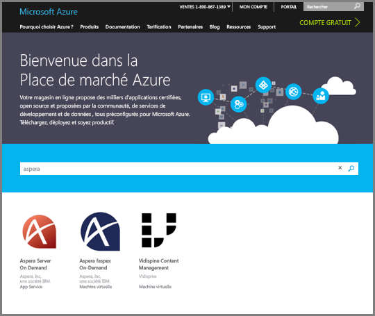
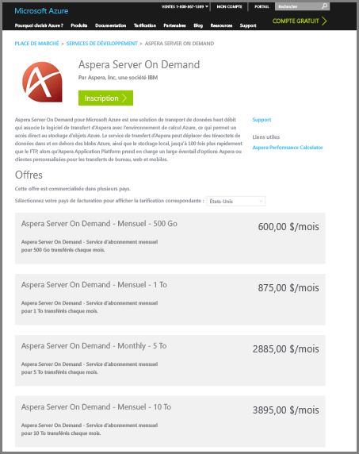
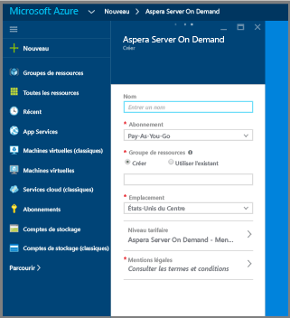
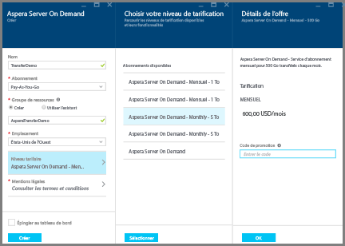
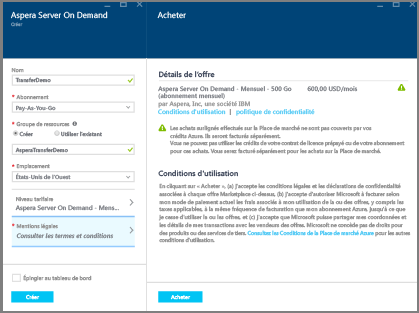
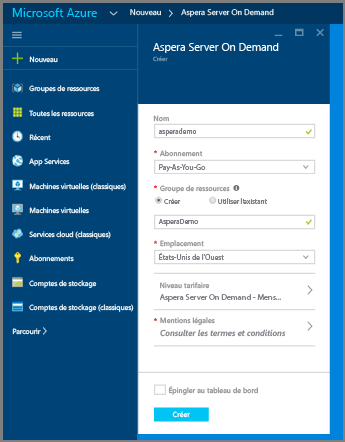
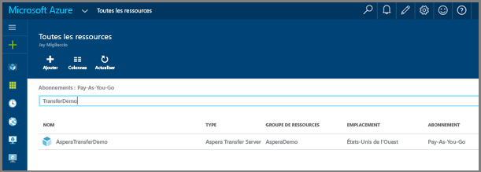
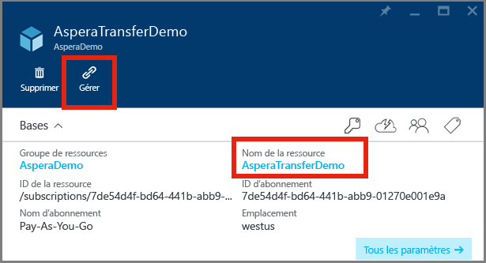

# Chargement de fichiers dans un compte Media Services à l’aide du service Aspera Server On Demand dans Azure

## Vue d’ensemble

**Aspera** est un logiciel de transfert de fichiers à haut débit. Le service **Aspera Server On Demand** pour Azure permet de charger et télécharger rapidement des fichiers volumineux directement dans un espace de stockage d’objets blob Azure. Pour plus d’informations sur **Aspera On Demand**, consultez le site [Aspera Cloud](http://cloud.asperasoft.com/). 
  
**Aspera Server On Demand** pour Azure est disponible à l’achat sur la [Place de marché Azure](https://azure.microsoft.com/en-us/marketplace/). Pour acheter **Aspera Server On Demand** pour Azure, veuillez vous connecter à la Place de marché Azure à l’aide de votre identifiant Windows Live.

Ce didacticiel vous guide tout au long du processus de chargement de fichiers dans un compte de stockage associé à un compte Media Services à l’aide du service **Aspera Server On Demand** dans Azure. 

Vous trouverez un exemple qui montre comment utiliser les fonctions Azure avec Aspera et Media Services [ici](https://github.com/Azure-Samples/media-services-dotnet-functions-integration/tree/master/103-aspera-ingest).

>[!NOTE]
>Une limite est appliquée à la taille maximale des fichiers pris en charge pour le traitement dans les processeurs multimédias Azure Media Services. Consultez [cette rubrique](media-services-quotas-and-limitations.md) pour en savoir plus sur les limites de taille des fichiers.
>

## Composants requis 

Pour suivre ce didacticiel, vous avez besoin des éléments suivants :

* Un identifiant Windows Live.
* Un [compte Azure](https://azure.microsoft.com). Pour plus d'informations, consultez la page [Version d'évaluation gratuite d'Azure](https://azure.microsoft.com/pricing/free-trial/). 
* Un [compte Azure Media Services](media-services-portal-create-account.md).

## Acheter Aspera On Demand pour Azure

Une fois connecté à la Place de marché Azure, suivez ces étapes pour finaliser votre achat d’Aspera On Demand pour Azure.

1. Recherchez Aspera et sélectionnez « Server On Demand ».

   

2. Passez en revue les plans d’abonnement et cliquez sur « S’inscrire ».

   

3. Renseignez les détails de votre abonnement Server On Demand.

   

4. Cliquez sur le **Niveau tarifaire** et sélectionnez le volume mensuel souhaité dans le sous-panneau. Dans le panneau **Détails du plan**, sélectionnez **OK**. Puis, dans le panneau **Choisir votre niveau tarifaire**, cliquez sur **Sélectionner**.

   

5. Cliquez sur **Conditions juridiques** dans le sous-panneau pour prendre connaissance des conditions légales et les accepter. Une fois que vous avez pris connaissance de ces conditions, cliquez sur **Acheter**.

   

6. Finalisez votre achat en cliquant sur **Créer**.

   

7. Le tableau de bord Azure annonce que l’approvisionnement du service est en cours.  Une fois l’approvisionnement terminé, vous pourrez accéder au nouvel abonnement en recherchant le nom du service dans vos ressources. Lorsque vous l’avez trouvé, double-cliquez dessus pour ouvrir le portail de gestion des services.

   

8. Lancez le portail de gestion Aspera. Une fois que vous avez trouvé votre nouveau service Aspera, vous pouvez accéder au portail de gestion en cliquant simplement sur le service.  Un nouveau panneau s’ouvre. De là, cliquez sur le **Nom de ressource** de votre nouveau service.  Dans la capture d’écran suivante, le nom de ressource est « AsperaTransferDemo ». Un autre panneau s’ouvre lorsque vous cliquez sur le nom de ressource. Ce panneau contient un lien « Gérer ». Cliquez sur ce lien pour lancer le portail de gestion Aspera.

   

9. En cliquant sur le lien « Gérer », vous êtes redirigé vers la page d’inscription qui vous permet d’accéder au service.

   

10. À ce stade, vous devriez avoir accès au portail de gestion du service Aspera, qui vous permet de créer des touches d’accès rapide, de télécharger des clients et licences Aspera, d’afficher l’utilisation et d’en savoir plus sur les API.

    La capture d’écran qui suit décrit le processus de création d’accès. 

   

    La capture d’écran suivante montre les interfaces de rapports d’utilisation dans le portail. 

   

## Chargement de fichiers avec Aspera

1. Téléchargez et installez le logiciel client Aspera :
    
    * [Plug-in de navigateur](http://downloads.asperasoft.com/connect2/)
    * [Client enrichi](http://downloads.asperasoft.com/en/downloads/2)

2. Effectuez votre premier transfert. Afin de pouvoir utiliser le client Aspera pour effectuer des transferts avec le service de transfert Aspera, vous devez effectuer les opérations suivantes : 

    1. Créer une clé d’accès à l’aide du portail Aspera.  
    2. Télécharger et installer le client Aspera, puis activer la licence (le logiciel est accessible depuis le portail Aspera).  

    >[!NOTE]
    >Pour obtenir des informations de configuration, veuillez consulter le guide du client Aspera.
    
    3. Récupérer des informations de votre compte de stockage associées à votre compte Azure Media à l’aide du [portail Azure](https://portal.azure.com/). Il s’agit plus précisément du nom et de la clé, ainsi que du nom de conteneur de stockage d’objets blob dans lequel vous souhaitez placer votre contenu. 

        * Pour obtenir les informations de stockage à partir du portail : recherchez votre compte de stockage, cliquez sur les touches d’accès et copiez le nom et la clé de votre compte.
        * Pour obtenir le nom du conteneur : recherchez votre compte de stockage, sélectionnez **Blobs**, puis sélectionnez le nom du conteneur dans lequel vous souhaitez charger du contenu. 

    Vous trouverez ci-dessous la capture d’écran du client Aspera **Connection Manager**, où vous devez spécifier le type de stockage « Azure », les informations d’identification ainsi que le conteneur d’objets blob.

    

## Ressources

Les ressources suivantes ont été évoquées dans cet article. 

* [Plug-in de connexion de navigateur](http://downloads.asperasoft.com/connect2/)
* [Guide de connexion](http://downloads.asperasoft.com/en/documentation/8)
* [Client Aspera](http://downloads.asperasoft.com/en/downloads/2)
* [Guide client](http://downloads.asperasoft.com/en/documentation/2)

## Étapes suivantes

Vous pouvez désormais [copier des objets blob d’un compte de stockage dans un compte AMS](media-services-copying-existing-blob.md#copy-blobs-from-a-storage-account-into-an-ams-account).

## Parcours d’apprentissage de Media Services
[!INCLUDE [media-services-learning-paths-include](../../includes/media-services-learning-paths-include.md)]

## Fournir des commentaires
[!INCLUDE [media-services-user-voice-include](../../includes/media-services-user-voice-include.md)]

