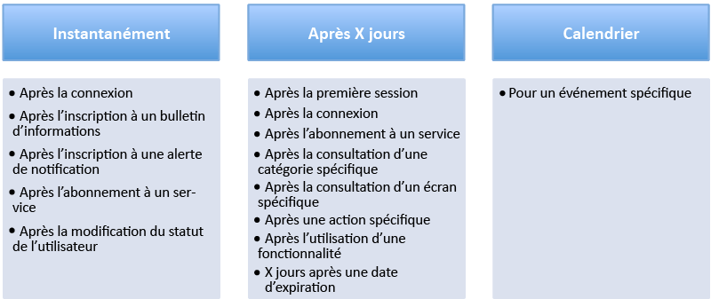

# Azure Mobile Engagement - Guide de prise en main et meilleures pratiques
## Vue d'ensemble
**L’écran mobile est un espace très encombré :** en 2013, une étude révélait que l’appareil mobile moyen avait 27 applications installées. Les utilisateurs passaient généralement 30 heures par mois sur leurs applications. La majeure partie de ce temps était consacrée aux réseaux sociaux et aux jeux (environ 20 heures). En 2014, les utilisateurs Android avaient le choix parmi environ 1,5 million d’applications. L’App Store d’Apple contenait environ 1,2 million d’applications. L’utilisation des applications mobiles continue à augmenter alors que les développeurs se font concurrence sur ce marché en pleine expansion.

L’utilisateur mobile moyen installe et désinstalle des applications très fréquemment en fonction de l’évolution de ses intérêts et de l’expérience au sein des applications. Pour déterminer le succès d’une application, la simple connaissance du nombre d’utilisateurs qui installent votre application ne suffit plus. Il est essentiel de savoir dans quelle mesure votre application est utile et si cette tendance d’utilisation évolue. Les questions suivantes deviennent importantes :

* Vos utilisateurs commencent-ils à trouver votre application inintéressante ou obsolète ?
* Combien d’utilisateurs ont complètement arrêté d’utiliser votre application ?
* La tendance est-elle à la hausse ou à la baisse pour les achats in-app ?
* Des problèmes avec l’application ou un manque d’intérêt empêchent-ils les utilisateurs de mener à terme des workflows ?
* Pourriez-vous maintenir l’utilité et la pertinence de votre application en envoyant du nouveau contenu à votre base d’utilisateurs ?
* Ce nouveau contenu serait-il identique pour tous les utilisateurs ou ciblé sur des segments d’utilisateurs en fonction du comportement dans l’application ?

Les réponses à des questions de ce type peuvent contribuer à prolonger la durée de vie et la génération de revenus de votre application. Elles peuvent également vous aider à définir et à fidéliser votre base d’utilisateurs.

Les applications d’information présentent généralement un taux de rétention parmi les plus élevés. Cela s’explique notamment par le fait qu’elles fournissent constamment du contenu nouveau aux utilisateurs. L’adoption précoce de notifications Push utiles ciblant un segment d’utilisateurs a tendance à avoir un impact élevé sur la rétention d’une application.

Le programme Azure Mobile Engagement est conçu pour vous aider à améliorer la durée de vie et la rétention de votre application en fournissant une méthode pour collecter et analyser des informations détaillées sur son utilisation. Il vous permet de catégoriser votre base d’utilisateurs en fonction du comportement et de créer des campagnes ciblées pour la remise de notifications Push et de messages dans l’application à des segments d’utilisateurs bien définis. Les indicateurs de performance clés (KPI) mesurent le degré d’activité de vos utilisateurs pour différents aspects de votre application. Azure Engagement Mobile vous offre les méthodes dont vous avez besoin pour déterminer ces KPI. Ce programme vous aide à augmenter le retour sur investissement en fournissant l’infrastructure requise pour accroître l’engagement avec votre application mobile.

Pour tirer le meilleur parti de Mobile Azure Engagement, vous devez commencer par élaborer un plan d’engagement bien conçu. Votre plan vous aidera à identifier les données granulaires dont vous avez besoin pour être en mesure de segmenter votre base d’utilisateurs. Il peut être basé sur le comportement et les expériences au sein de l’application. Pour que votre plan réussisse, il est recommandé de définir clairement le KPI qui sera utilisé pour mesurer les objectifs de votre application. En définissant des indicateurs de performance clairs, vous pouvez facilement incorporer la logique nécessaire dans votre application pour collecter des données précises qui vous serviront à analyser et à évaluer vos KPI. Cette rubrique propose un guide des meilleures pratiques pour la définition des KPI que vous utiliserez avec votre plan d’engagement.

## Étape 1 : définir les KPI en les adaptant au modèle CET
Définir correctement les KPI n’est pas toujours chose aisée. Les applications conçues pour différents secteurs présentent des caractéristiques et des objectifs spécifiques, ce qui peut rendre votre approche confuse. Pour éviter cela, les objectifs et les KPI doivent être classés en trois catégories principales : **commerciaux**, **d’engagement**, et **techniques**. C’est ce que nous appelons le **modèle CET**.

Un plan efficace présente généralement des objectifs avec les KPI qui mesurent la réussite dans chacune des catégories suivantes du modèle CET.

#### KPI commerciaux
Les KPI commerciaux devraient être la partie la plus simple à mettre en œuvre. Vous les avez probablement déjà définis sous une certaine forme lors de la planification de votre application mobile. Ces KPI permettent généralement de mesurer les revenus et le retour sur investissement de votre application. La liste suivante fournit quelques exemples de KPI commerciaux qui peuvent vous guider lors de la définition de vos indicateurs de performance :

* KPI commerciaux - Médias
  * Nombre de publicités cliquées
  * Nombre de pages consultées par utilisateur
  * Nombre d’abonnements en cours
* KPI commerciaux - Jeux
  * Nombre d’achats in-app
  * Revenu moyen par utilisateur
  * Temps passé par session
  * Nombre de jours joués et actuels dans le niveau du jeu
* KPI commerciaux - E-commerce
  * Nombre de jours d’utilisation de l’application
  * Revenu moyen par utilisateur
  * Montant moyen dans le panier lors du paiement
  * Catégorie de produit présentant le plus d’affichages et d’achats
* KPI commerciaux - Banques et assurances
  * Nombre de comptes
  * Fonctionnalités activées
  * Pages d’offre consultées
  * Alertes cliquées ou activées

#### KPI d’engagement
Un KPI d’engagement est un indicateur de performance permettant de mesurer l’engagement de vos utilisateurs. Les tendances dans cette catégorie aident à déterminer la rétention de votre application. Voici quelques exemples d’indicateurs de performance pour ce type de KPI :

* Utilisateurs actifs au cours des 7 derniers jours
* Nombre d’utilisateurs inactifs au cours des 7 derniers jours
* Nombre d’utilisateurs qui n’ont pas utilisé l’application depuis 30 jours

Certains facteurs externes évidents peuvent influencer les indicateurs de cette catégorie. Par exemple, vous pouvez considérer qu’un utilisateur a un appareil mobile avec lui en permanence. Cela n’est pas nécessairement vrai. Une application de jeu peut présenter une utilisation plus élevée pendant les jours fériés, les utilisateurs ayant tendance à jouer plus lorsqu’ils ne travaillent pas ou n’ont pas école.

Des KPI bien définis dans cette catégorie devraient vous aider à mesurer la relation entre votre application et vos clients.

#### KPI techniques
Les indicateurs de performance de cette catégorie vous aident à déterminer si votre application se comporte correctement, ne répond plus ou se bloque. Ces indicateurs permettent de mesurer l’intégrité de votre application et de déterminer les problèmes d’ergonomie qui peuvent empêcher les utilisateurs de s’en servir. Les informations collectées pour cette catégorie peuvent également contenir des informations sur les performances utiles pour les équipes marketing. Les données peuvent également faciliter la résolution des problèmes en aidant le service informatique et les équipes de support à identifier des bogues non signalés.

Voici quelques exemples de KPI techniques :

* Nombre d’exceptions non gérées ou gérées et informations les concernant
* Date et heure du dernier incident
* Dernier bouton cliqué ou dernière page consultée
* Utilisation de la mémoire de l’application
* Fréquence d’images de l’application
* Version de système d’exploitation sur laquelle l’application est exécutée
* Version de l’application

La définition de ces KPI vous aide à mesurer les performances de l’application et à identifier des bogues potentiels. Ces indicateurs devraient contribuer à réduire le délai nécessaire pour fournir un correctif à vos clients. Ils pourraient également vous aider à définir un segment d’utilisateurs ayant rencontré un problème particulier. Vous pouvez utiliser cette segmentation des utilisateurs pour créer des campagnes visant à envoyer des notifications concernant les correctifs disponibles et des promotions éventuelles pour rétablir la satisfaction des clients.

#### Exercice pratique nº 1 : créer votre tableau de bord de KPI
Lorsque vous définissez votre stratégie marketing, vos KPI doivent représenter chacun de vos principaux objectifs. Il doit s’agir de points de données bien définis qui vous permettront de collecter des informations essentielles pour surveiller votre application et le comportement de l’utilisateur final.

Créez un tableau de bord de KPI qui contient les informations suivantes :

1. Quels sont les KPI pour l’application ?
2. Quels points de données vais-je utiliser pour représenter chaque KPI ?
3. Où ces données se trouvent-elles pour mon application (écran, paramètres, système, etc.) ?
4. Puis-je exécuter une séquence d’engagement pour ce KPI ?

Pour obtenir des exemples et des conseils, vous pouvez utiliser la feuille de calcul **KPI Builder** de notre modèle [Media Playbook Template][Media Playbook link].

## Étape 2 : votre programme d’engagement
Un programme d’engagement mobile de qualité doit être considéré comme un composant clé de votre application. Il doit absolument inclure un excellent programme de bienvenue qui s’exécute au cours des premiers jours d’utilisation de l’application. Ce type de programme a généralement un effet très positif sur l’engagement et la rétention de votre application. Des études ont montré que la majorité des utilisateurs arrêtent d’utiliser une application au cours des premiers jours suivant l’installation. Vous devez vous efforcer de satisfaire ou de dépasser les attentes des clients en prenant soin de susciter très tôt leur intérêt, pendant que leur attention est toujours tournée vers votre application. Veillez à présenter la valeur et les avantages clés de votre application à vos clients.

Les notifications Push constituent la meilleure approche en matière d’engagement précoce avec les utilisateurs d’appareils mobiles. Cependant, vous devez faire très attention lorsque vous segmentez les utilisateurs pour les notifications Push. En effet, dès qu’un utilisateur a le sentiment de recevoir du courrier indésirable ou des notifications inintéressantes, cela peut avoir des conséquences graves. En quelques clics, un utilisateur peut supprimer votre application, sans jamais la réinstaller par la suite. L’utilisateur doit recevoir une valeur hautement personnalisée dans l’application plutôt que du courrier indésirable générique.

Une fois que les utilisateurs sont activement engagés, votre programme d’engagement peut contribuer à développer d’autres aspects de l’application.

Par exemple, vous pouvez organiser une campagne invitant les utilisateurs actifs à évaluer votre application. Comme les utilisateurs de ce segment sont les plus actifs et possèdent le plus d’expérience avec votre application, vous pouvez vous attendre à ce qu’ils vous donnent l’évaluation la plus juste. Une évaluation élevée de votre application peut contribuer à augmenter les téléchargements organiques de votre application tout en réduisant vos coûts d’acquisition de nouveaux clients.

#### Séquence d’engagement
Un programme d’engagement global inclut différentes séquences d’engagement. Chaque séquence vise à atteindre plusieurs objectifs.

###### Séquence de transmission Push liée au cycle de vie
Les objectifs d’une séquence de transmission Push liée au cycle de vie sont différents selon le cycle de vie de l’engagement de l’utilisateur avec l’application. Un utilisateur donné peut être nouveau, inactif ou très actif. À différents stades d’un cycle de vie d’engagement, les utilisateurs peuvent bénéficier de votre contenu nouveau sous la forme de conseils ou de liens vers la documentation.

Par exemple, un nouvel utilisateur peut avoir besoin d’aide pour naviguer dans l’application ou bénéficier d’une offre incitative semblable à celle ci-dessous la première fois qu’il lance l’application...

*« Bienvenue à bord ! N’oubliez pas de vous connecter pour bénéficier de votre premier mois gratuit ! »*

###### Séquence de transmission Push comportementale
La séquence de transmission Push comportementale vise à accroître l’utilisation en fonction du comportement utilisateur collecté pour l’application.

Par exemple, un utilisateur très actif d’une application de simulation de football américain pourrait tirer parti d’un engagement avec la notification Push suivante...

*« John, vous êtes un vrai fan de football américain ! Connectez-vous à notre section NFL pour tenter de remporter des places pour le Super Bowl ! »*

###### Séquence de transmission Push d’alerte
Les utilisateurs apprécient de recevoir des actualités intéressantes axées sur leurs intérêts. Une séquence de transmission Push d’alerte améliore l’engagement en envoyant des alertes en fonction des intérêts qu’un utilisateur a clairement montrés. Ces intérêts peuvent être explicites dans le cas où l’utilisateur est amené à les sélectionner dans l’application. Ils peuvent également être déterminés implicitement en fonction de données collectées au cours de l’interaction de l’utilisateur avec l’application.

Par exemple, l’utilisateur d’une application d’e-commerce peut acheter régulièrement une marque spécifique de café que vous avez capturée à l’aide d’un KPI commercial. L’alerte suivante peut améliorer l’engagement de cet utilisateur avec l’application.

*« Bonjour Wes, une de vos marques préférées de café fera l’objet d’une réduction de 25 % la première semaine de septembre 2015. Nous sommes heureux de vous compter parmi nos clients et souhaitions nous assurer que vous ne passiez pas à côté de cette offre. »*

###### Séquence de transmission Push de rétention
Cette séquence vise à fidéliser les utilisateurs à l’aide de campagnes de notification Push répétitives permettant de favoriser un engagement régulier avec l’application. Cela peut contribuer à accroître la rétention de l’application si l’utilisateur apprécie les interactions.

Par exemple, l’utilisateur d’une application sportive peut recevoir le type de notification Push suivant chaque semaine en fonction de ses équipes favorites :

*« Pour tenter de remporter 200 points, dites-nous si vous pensez que les New York Yankees gagneront leur match contre les Toronto Blue Jays cette semaine ! »*

#### L’approche des 3 Q
La maîtrise des différentes séquences de transmission Push vous aide à communiquer avec les utilisateurs finaux. Cependant, il vous faut utiliser l’approche des 3 Q pour personnaliser vos notifications. L’approche des 3 Q consiste à répondre aux questions Qui, Quoi et Quand pour chaque notification. Si vous répondez clairement à ces trois questions, vos notifications devraient être correctement ciblées pour l’engagement.

###### Qui : le segment d’utilisateurs auquel les messages seront adressés
L’envoi de notifications Push à vos utilisateurs doit être considéré comme un canal de communication très sensible. Assurez-vous que les notifications que vous prévoyez d’envoyer à un segment d’utilisateurs sont bien cadrées sur les intérêts de ce segment d’utilisateurs. Une notification mal acheminée a de grandes chances d’avoir un effet négatif sur un utilisateur. Il risque de la considérer comme du courrier indésirable, ce qui peut le conduire à désinstaller votre application.

Lorsque vous définissez les segments d’utilisateurs qui recevront des notifications, faites appel à un mélange de critères techniques et comportementaux spécifiques. La définition d’un segment d’utilisateurs peut simplement prendre une forme similaire à celle de l’énoncé suivant :

« Tous les utilisateurs qui ont lancé l’application mobile pour la première fois il y a 3 jours et qui ont visité la page de connexion à deux reprises sans se connecter finalement. »

Cet énoncé permet d’identifier les données que vous devez collecter pour prendre en charge un scénario spécifique.

###### Quoi : le message à envoyer
**Ton**

Dans le cadre de vos engagements, utilisez un ton adapté aux utilisateurs du segment. Il s’agit sans aucun doute d’un bon moyen d’entrer en contact avec vos utilisateurs finaux et de susciter leur intérêt pour votre application.

**Redirection**

Une notification Push a d’autres usages que l’ouverture de l’application. Si le message de notification fournit un contexte tel que des actualités ou la promotion d’un produit, cette notification peut proposer un lien ciblé direct vers le contenu approprié au sein de l’application. Pour ce faire, vous devez créer un schéma d’URL pour permettre à l’application de gérer la redirection. Lorsque vous travaillez sur vos séquences d’engagement, il s’agit d’une étape importante à laquelle il faut impérativement penser.

La redirection peut également être gérée pour d’autres systèmes. Par exemple, avec une URL d’action, il est possible de rediriger les utilisateurs finaux vers de nombreux autres systèmes, notamment les suivants :

* Un site web
* Une boîte aux lettres avec la messagerie déjà configurée
* Une boîte de réception de SMS
* Un service d’accès à distance
* Directement à la boutique d’applications pour évaluer l’application.

Vous bénéficiez ainsi de nombreuses opportunités d’engagement avec les utilisateurs finaux et de création de règles automatiques pour améliorer les performances.

**Format/contenu**

Différents types et formats de notification Push :

1. **Annonces** : ces notifications vous permettent d’envoyer des messages publicitaires aux utilisateurs à des moments différents (en dehors de l’application, dans l’application ou à tout moment).
2. **Sondages** : ces notifications vous permettent de rassembler des informations sur les utilisateurs finaux en leur posant des questions. Vous disposez ensuite de ces réponses lors de la création de critères pour cibler les utilisateurs finaux.
3. **Push de données** : ces notifications vous permettent d’envoyer un fichier de données binaire ou base 64 pour mettre à jour l’application. Les informations contenues dans un Push de données sont envoyées à votre application pour personnaliser l’expérience des utilisateurs au sein de votre application. Votre application doit être conçue pour prendre en charge les données contenues dans un Push de données.
4. **Vignettes (Windows Phone uniquement)** : ces notifications vous permettent d’utiliser les services de notifications Push Microsoft (MPNS) pour envoyer des notifications Push natives contenant des données XML. (Prises en charge depuis la version 0.9.0 du Kit de développement logiciel (SDK). La charge utile finale des vignettes ne peut excéder 32 kilo-octets.) Le message apparaît directement sur la vignette de votre panneau.
5. **Vue web** : fenêtre contextuelle comprenant du contenu web. Cette fenêtre contextuelle apparaît une fois que l'utilisateur final a cliqué sur la notification push. Une vue web favorise l'interaction avec l'utilisateur final.

> [!NOTE]
> Assurez-vous que le contenu que vous envoyez sous forme de notifications Push respecte les instructions de la plateforme correspondante (iOS, Android, Windows) pour le développement d’applications et l’envoi de notifications Push.
> 
> 

###### Quand : la planification de votre campagne
Quel est le moment le plus opportun pour activer une campagne en déclenchant des notifications Push ? Doit-elle être manuelle ou automatique ? Doit-elle être récurrente ? Déterminer le moment ou la fréquence appropriée est essentiel pour optimiser les résultats de l’engagement avec les utilisateurs. Pour chaque séquence et scénario d’engagement, vous devez spécifier le moment le plus opportun pour l’envoi des notifications Push. Voici quelques exemples possibles :

Si vous envoyez de nombreuses notifications tous les jours, vous devez prendre sérieusement en considération le fait que vos utilisateurs peuvent percevoir vos communications comme du courrier indésirable.

Azure Engagement Mobile offre deux moyens d’éviter que vos communications soient perçues comme du courrier indésirable. Tout d’abord, utilisez une segmentation affinée pour vous assurer que vous ne ciblez pas les mêmes utilisateurs. En outre, Azure Mobile Engagement propose une fonctionnalité de « quotas ». Cette fonctionnalité permet de limiter les notifications envoyées pour une campagne. Par exemple, la définition d’un quota par défaut sur 5 par semaine garantit qu’un utilisateur inclus dans le segment d’utilisateurs de la campagne ne recevra pas plus de 5 notifications cette semaine-là.

#### Exercice pratique nº 2 : créer votre programme d’engagement
Prenez le temps de résumer vos objectifs et de définir les campagnes que vous prévoyez de diffuser à l’aide de séquences spécifiques. Veillez à appliquer l’approche des 3 Q aux notifications de vos campagnes.

Pour obtenir des exemples et des conseils, utilisez la feuille de calcul **Engagement Program** de notre modèle [Media Playbook Template][Media Playbook link].

## Étape 3 : intégration à l’application
#### Création d’un plan de balises
Pour intégrer Azure Mobile Engagement à votre application, vous devez créer un plan de balises. Le plan de balises est la pierre angulaire du projet. Il définit la relation entre les spécifications marketing, le workflow de l’application et les données de balise réelles collectées dans l’application pour mesurer les KPI. Il indique quelles analyses vous pourrez voir dans le portail. Il vous permet également de définir les segments d’utilisateurs et d’envoyer des notifications Push ciblées à des fins d’engagement avec vos utilisateurs finaux. Une fois le plan de balises défini, l’ajout du code pour l’intégrer à votre application se fait en toute simplicité à l’aide du Kit de développement logiciel (SDK) Azure Mobile Engagement.

Un plan de balises ne doit pas baliser tous les éléments d’une application. Il doit uniquement inclure les données de balise faisant partie de votre stratégie d’engagement mobile. Celles-ci seront probablement différentes d’une application à une autre. Le modèle [Media Playbook Template][Media Playbook link] fourni par Azure Mobile Engagement vous aide à élaborer un plan de balises à l’aide d’une méthode donnée. Utilisez la feuille de calcul **Tag Plan** pour vous guider dans la création de votre plan de balises.

Soyez très spécifique lorsque vous définissez une section de balises dans la feuille de calcul. C’est très important pour éviter toute confusion. Détaillez chaque scénario attendu pour lequel chaque balise sera envoyée. Incluez le nom de l’activité où chaque balise est incorporée. Toutes ces informations doivent être ajoutées dans la partie **Informative** de la feuille de calcul. La feuille de calcul du plan de balises doit servir de référence principale pour la vérification de test.

Dans la partie **Data to collect**, votre équipe de développement doit trouver les types, les noms, les valeurs et les paires clé/valeur d’informations supplémentaires requises pour chaque balise qui sera incorporée dans l’application.

Nous vous recommandons de passer en revue le plan de balises avec toutes les équipes associées au projet. Apportez les corrections nécessaires et vérifiez que tout est clair pour les équipes de développement et marketing.

La feuille de calcul **Statement of work** peut être utilisée pour guider toutes les personnes impliquées dans le projet.

#### Types de données
Il s’agit des types de données courants pris en charge par Azure Mobile Engagement.

###### Appareils et utilisateurs
Azure Mobile Engagement identifie les utilisateurs en générant un identificateur unique pour chaque appareil. Cet identificateur est appelé identificateur de l’appareil (ou deviceid). Il est généré de sorte que toutes les applications en cours d’exécution sur l’appareil concerné partagent le même identificateur d’appareil.

###### Sessions et activités
Une session est une instance de l’application en cours d’exécution par un utilisateur. La session commence au moment où l’utilisateur démarre l’application et se termine au moment où l’application s’arrête.

Une activité est un regroupement logique d’un ensemble d’éléments que l’application effectue pendant une session. Il s’agit généralement d’un écran particulier de l’application, mais il peut s’agir de n’importe quel élément défini par la logique de l’application. Balisez au minimum chaque écran ou activité pour votre application. Cela vous permettra de comprendre le parcours de l’utilisateur.

###### Événements
Les événements sont utilisés pour signaler les interactions utilisateur avec l’application. Il peut s’agir d’actions instantanées, telles que le partage de contenu ou le lancement d’une vidéo. En balisant les événements, vous disposez de collections de données qui montrent comment les utilisateurs interagissent avec l’application.

###### Travaux
Les travaux sont utilisés pour signaler les actions qui présentent une durée. Voici quelques exemples :

* Exécution d’appels d’API
* Durée d’affichage des publicités
* Durée des tâches d’arrière-plan
* Durée du processus d’achat
* Affichage d’une vidéo

###### Erreurs
Les erreurs sont utilisées pour signaler les problèmes détectés par l’application, par exemple les actions utilisateur incorrectes ou les échecs d’appel d’API.

###### Informations de l'application
Les informations de l’application (App-Info) sont utilisées pour baliser les données liées à l’expérience d’un utilisateur avec une application. Elles sont générées par l’interaction d’un utilisateur avec l’application.

Pour une clé app-info donnée, Azure Mobile Engagement effectue uniquement le suivi de la dernière valeur (aucun historique). Les informations de l’application révèlent l’état de votre application ou de vos utilisateurs finaux, par exemple l’état de connexion ou le groupe de produits préféré d’un utilisateur.

###### Données d’incident
Les données d’incident collectées automatiquement par le SDK Mobile Engagement signalent les défaillances d’application non gérées par l’application, par exemple une exception non gérée qui survient.

###### Données supplémentaires
Les événements, les erreurs, les activités et les tâches peuvent être optimisés à l’aide de paramètres. Il s’agit d’informations supplémentaires qu’un développeur peut fournir en tant que données spécifiques de l’application. C’est important pour définir une segmentation affinée.

Par exemple, la valeur d’une balise « article » vous permet de segmenter les utilisateurs finaux en fonction de ceux qui ont affiché cet article spécifique. Cependant, cela peut ne pas suffire. Il peut être plus intéressant d’inclure également dans cette même balise « article » des informations supplémentaires telles que « catégorie\_information » au sein d’une activité. Cela permettrait de déterminer dynamiquement les catégories favorites de l’utilisateur.

Les informations supplémentaires sont signalées sous forme de paire clé/valeur. Dans l’exemple de cette application multimédia, les informations supplémentaires pour « catégorie\_information » seraient la valeur pour cette catégorie, par exemple « sport », « économie » ou « politique ».

#### Intégration des balises et du Kit de développement logiciel (SDK)
Pour connaître la procédure détaillée d’intégration du SDK Azure Mobile Engagement à votre application, reportez-vous à la documentation [Intégration du Kit de développement logiciel du module Engagement](mobile-engagement-windows-store-integrate-engagement.md) sur le site web Azure. Choisissez votre plateforme cible parmi les liens en haut de la page.

Nous vous recommandons de créer des projets pour deux applications s’appuyant sur Azure Mobile Engagement : l’une pour le développement et le test et l’autre pour la production. Votre équipe informatique pourra passer de l’environnement de test à la production une fois le test d’acceptation des utilisateurs (UAT) réussi.

#### Test d’acceptation des utilisateurs (UAT)
Le test d’acceptation des utilisateurs (UAT) consiste à s’assurer que tout fonctionne comme prévu. Les workflows peuvent être menés à bien et rassembler toutes les données requises en fonction de votre plan de balises :

* Le balisage des informations doit être en place conformément aux concepts AZME documentés
* Toutes les informations dont vous avez besoin sont collectées (y compris les valeurs d’informations supplémentaires et d’informations de l’application)
* La nomenclature doit correspondre à votre plan de balises
* Aucun doublon de balise n’est envoyé

Testez de manière approfondie tous les types de comportement de notification que vous avez incorporés dans votre application :

* Annonces, sondages, Push de données dans l’application et en dehors
* Vues de texte/web
* Mise à jour de badge, catégories

#### Paramétrage
La configuration d’Azure Mobile Engagement est très simple. Toute la documentation relative à l’interface utilisateur est disponible sur le site web Azure Mobile Engagement, sur la page [Comment naviguer dans l’interface utilisateur](mobile-engagement-user-interface-home.md).

Il est recommandé de commencer par configurer les rôles et les appartenances aux rôles appropriés pour votre projet. Cela vous permet de gérer l’accès à la plateforme pour tous les utilisateurs. Vos rôles peuvent inclure :

* Administrateurs
* Développeurs
* Utilisateurs

Par la suite :

* Enregistrez votre ID d’appareil pour le tester sur votre propre appareil.
* Accédez aux paramètres de votre compte et configurez le fuseau horaire pour adapter l’heure de remise des graphiques et notifications à votre fuseau horaire.
* Accédez aux paramètres de votre application et enregistrez les informations de l’application (« App-info ») dont vous avez besoin pour cibler l’utilisateur final à portée de main.

Pour plus d’informations sur l’organisation de votre première campagne de notification Push, consultez la rubrique [Procédure de mise en route pour l’utilisation et la gestion des notifications Push en vue d’atteindre vos utilisateurs finaux](mobile-engagement-how-tos.md).

## Conclusion
Les programmes d’engagement sont itératifs et vous devez en permanence améliorer le vôtre en déterminant ce qui fonctionne le mieux pour votre application à l’aide de tests.

Au départ, lorsque vous vous familiarisez avec les stratégies d’engagement, n’essayez pas d’élaborer toute une stratégie d’engagement globale. Adoptez une approche étape par étape en identifiant vos KPI et la manière de les exploiter. La stratégie d’engagement sera différente pour chaque application.

Après avoir acquis un peu d’expérience, vous pouvez envisager d’ajouter les éléments suivants à vos programmes d’engagement :

* Suivi : vous attirez des utilisateurs et définissez probablement des sources de collecte de données. Azure mobile Engagement peut être lié à des sources de collecte de données. Cela vous permet de surveiller les performances de chaque source. Ces informations seront utiles pour optimiser vos investissements en matière d’acquisition.
* Test A/B : il s’agit d’une composante essentielle du programme d’engagement. Chaque application présente des caractéristiques spécifiques. Avec le test A/B, vous pouvez améliorer votre programme d’engagement.
* Emplacement géographique : il s’agit d’un atout considérable pour les marques. Grâce à cette fonctionnalité, vous pouvez atteindre les utilisateurs au bon endroit et au bon moment. Nous vous recommandons de vérifier que vous avez collecté suffisamment de données de comportement des utilisateurs finaux avant d’utiliser l’emplacement géographique.
* Push de données : le Push de données est une transmission Push invisible. Il vous permet de personnaliser votre application en fonction du comportement des utilisateurs finaux. Par exemple, si un segment d’utilisateurs consulte souvent des produits high-tech, le propriétaire de l’application peut envoyer un Push de données qui personnalisera la page d’accueil avec du contenu de ce type.

## Étapes suivantes
* [Créer un compte Azure Mobile Engagement](mobile-engagement-create.md).
* Pour plus d’informations sur l’élaboration de votre stratégie Mobile Engagement, consultez la page [Définir votre stratégie Mobile Engagement](mobile-engagement-define-your-mobile-engagement-strategy.md).

<!--Image references-->

<!--Link references-->
[Media Playbook link]: https://github.com/Azure/azure-mobile-engagement-samples/tree/master/Playbooks

<!---HONumber=AcomDC_1005_2016-->