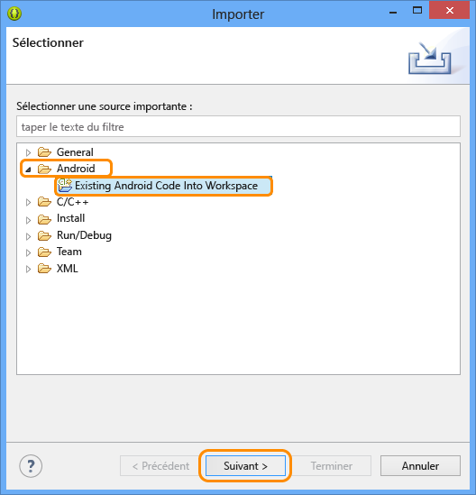
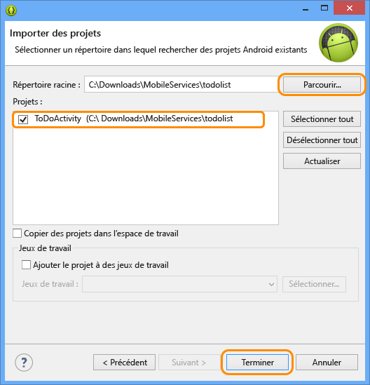

<properties linkid="develop-mobile-tutorials-get-started-with-data-android" urlDisplayName="Get Started with Data - Android" pageTitle="Get started with data (Android) | Mobile Dev Center" metaKeywords="Azure android data, Azure mobile services data, windows droid, windows android, microsoft droid, microsoft android" description="Learn how to get started using Mobile Services to leverage data in your Android app." metaCanonical="" services="" documentationCenter="Mobile" title="Get started with data in Mobile Services" authors="ricksal,glenga" solutions="" manager="" editor="" />

Prise en main des données dans Mobile Services
==============================================

[Windows Store C\#](/en-us/develop/mobile/tutorials/get-started-with-data-dotnet "Windows Store C#")[Windows Store JavaScript](/en-us/develop/mobile/tutorials/get-started-with-data-js "Windows Store JavaScript")[Windows Phone](/en-us/develop/mobile/tutorials/get-started-with-data-wp8 "Windows Phone")[iOS](/en-us/develop/mobile/tutorials/get-started-with-data-ios "iOS")[Android](/en-us/develop/mobile/tutorials/get-started-with-data-android "Android")[HTML](/en-us/develop/mobile/tutorials/get-started-with-data-html "HTML")[Xamarin.iOS](/en-us/develop/mobile/tutorials/get-started-with-data-xamarin-ios "Xamarin.iOS")[Xamarin.Android](/en-us/develop/mobile/tutorials/get-started-with-data-xamarin-android "Xamarin.Android")

Cette rubrique montre comment utiliser Azure Mobile Services pour tirer parti des données dans une application Android. Dans ce didacticiel, vous allez télécharger une application qui stocke les données en mémoire, créer un service mobile, intégrer le service mobile à l'application, puis vous connecter au portail de gestion Azure pour afficher les modifications apportées aux données lors de l'exécution de l'application.

[regarder le didacticiel](http://channel9.msdn.com/Series/Windows-Azure-Mobile-Services/Android-Getting-Started-With-Data-Connecting-your-app-to-Windows-Azure-Mobile-Services) [Lire la vidéo](http://channel9.msdn.com/Series/Windows-Azure-Mobile-Services/Android-Getting-Started-With-Data-Connecting-your-app-to-Windows-Azure-Mobile-Services)15:32

**Remarque**

Ce didacticiel est conçu pour vous aider à mieux comprendre comment Mobile Services vous permet d'utiliser Azure pour stocker et récupérer des données à partir d'une application Android. À cet effet, elle vous guide tout au long des nombreuses étapes exécutées automatiquement dans le démarrage rapide Mobile Services. S'il s'agit de votre première expérience avec Mobile Services, vous pouvez d'abord suivre le didacticiel [Prise en main de Mobile Services](/en-us/develop/mobile/tutorials/get-started-android).

Ce didacticiel vous familiarise avec ces étapes de base :

1.  [Téléchargement d'un projet d'application Android](#download-app)
2.  [Création du service mobile](#create-service)
3.  [Ajout d'une table de données pour le stockage](#add-table)
4.  [Mise à jour de l'application pour utiliser Mobile Services](#update-app)
5.  [Test de l'application avec Mobile Services](#test-app)

**Remarque**

Pour effectuer ce didacticiel, vous avez besoin d'un compte Azure. Si vous ne possédez pas de compte, vous pouvez créer un compte d'évaluation gratuit en quelques minutes. Pour plus d'informations, consultez la page [Version d'évaluation gratuite d'Azure](http://www.windowsazure.com/en-us/pricing/free-trial/?WT.mc_id=AED8DE357).

Ce didacticiel requiert le [Kit de développement logiciel (SDK) Mobile Services pour Android](http://go.microsoft.com/fwlink/p/?LinkID=280126) ; le [Kit de développement logiciel (SDK) Android](https://go.microsoft.com/fwLink/p/?LinkID=280125), qui inclut l'IDE (environnement de développement intégré) Eclipse, le plug-in ADT (outils de développement Android) et Android 4.2 ou une version ultérieure.

**Remarque**

Ce didacticiel fournit des instructions sur l'installation des Kits de développement logiciel (SDK) Android et Mobile Services pour Android. Le projet GetStartedWithData téléchargé requiert Android 4.2 ou une version ultérieure. Toutefois, le Kit de développement logiciel (SDK) Mobile Services requiert uniquement Android 2.2 ou une version ultérieure.

Téléchargement du projetTéléchargement du projet GetStartedWithData
-------------------------------------------------------------------

### Obtention de l'exemple de code

Ce didacticiel est basé sur l'[application GetStartedWithData](http://go.microsoft.com/fwlink/p/?LinkID=282122), qui est une application Android. L'interface utilisateur de cette application est identique à l'application générée par le démarrage rapide Android de Mobile Services, sauf que les éléments ajoutés sont stockés en local dans la mémoire. Vous allez ajouter le code nécessaire à la conservation des données à stocker.

1.  Téléchargez l'exemple d'application `GetStartedWithData`, puis développez les fichiers sur votre ordinateur.

2.  Dans Eclipse, cliquez sur **Fichier**, puis sur **Importer**, développez **Android**, cliquez sur **Code Android existant dans l'espace de travail**, puis sur **Suivant.**

	

1.  Cliquez sur **Parcourir**, accédez à l'emplacement des fichiers projet développés, cliquez sur **OK**, puis veillez à ce que le projet TodoActivity soit sélectionné. Si vous souhaitez que le projet soit copié dans votre espace de travail, activez la case **Copier les projets dans l'espace de travail**. Enfin, cliquez sur **Terminer**.

	

    Cette opération importe les fichiers projet dans l'espace de travail actuel.

### Vérification de la version du Kit de développement logiciel (SDK) Android

[WACOM.INCLUDE [Verify SDK](../includes/mobile-services-verify-android-sdk-version.md)]

### Inspection et exécution de l'exemple de code

1.  Dans l'Explorateur de package, développez **GetStartedWithData**, **src** et **.com.example.GetStartedWithData**, puis examinez le fichier ToDoActivity.java.

     

     Notez que les commentaires `//TODO` spécifient les étapes que vous devez suivre pour que cette application fonctionne avec votre service mobile.

2.  À partir du menu **Exécuter**, cliquez sur **Exécuter**, puis sur **Application Android** pour démarrer le projet.

    **Remarque**

    Vous pouvez exécuter ce projet à l'aide d'un téléphone Android ou de l'émulateur Android. L'exécution avec un téléphone Android requiert le téléchargement d'un pilote USB propre au téléphone.

    Pour exécuter le projet dans l'émulateur Android, vous devez définir au moins un AVD (appareil virtuel Android). Utilisez le gestionnaire AVD pour créer et gérer ces appareils.

3.  Dans l'application, tapez un texte explicite, comme *Suivre le didacticiel*, puis cliquez sur **Ajouter**.

     

     Remarquez que le texte enregistré est stocké dans une collection en mémoire et affiché dans la liste ci-dessous.

Création d'un service mobileCréation d'un service mobile dans le portail de gestion
-----------------------------------------------------------------------------------

[WACOM.INCLUDE [mobile-services-create-new-service-data](../includes/mobile-services-create-new-service-data.md)]

Ajout d'une nouvelle tableAjout d'une nouvelle table au service mobile
----------------------------------------------------------------------

[WACOM.INCLUDE [mobile-services-create-new-service-data-2](../includes/mobile-services-create-new-service-data-2.md)]

Mise à jour de l'applicationMise à jour de l'application afin d'utiliser le service mobile pour l'accès aux données
-------------------------------------------------------------------------------------------------------------------

Votre service mobile étant prêt, vous pouvez mettre à jour l'application pour stocker les éléments dans Mobile Services et non dans la collection locale.

1.  Si vous n'avez pas déjà le [Kit de développement logiciel (SDK) Mobile Services pour Android](http://go.microsoft.com/fwlink/p/?LinkID=280126), téléchargez-le maintenant et développez les fichiers compressés.

2.  Copiez les fichiers `.jar` du dossier `mobileservices` du Kit de développement logiciel (SDK) vers le dossier `libs` du projet GetStartedWithData.

3.  Dans l'Explorateur de package d'Eclipse, cliquez avec le bouton droit sur le dossier `libs`, puis cliquez sur **Actualiser** pour que les fichiers .jar copiés s'affichent.

	La référence au Kit de développement logiciel (SDK) Mobile Services est ajoutée à l'espace de travail.

1.  Ouvrez le fichier AndroidManifest.xml et ajoutez la ligne suivante, qui permet à l'application d'accéder à Mobile Services dans Azure.

        <uses-permission android:name="android.permission.INTERNET" />

2.  Dans l'Explorateur de package, ouvrez le fichier TodoActivity.java situé dans le package com.example.getstartedwithdata, puis supprimez les marques de commentaire sur les lignes de code suivantes :

        import com.microsoft.windowsazure.mobileservices.MobileServiceClient;
        import com.microsoft.windowsazure.mobileservices.MobileServiceTable;
        import com.microsoft.windowsazure.mobileservices.NextServiceFilterCallback;
        import com.microsoft.windowsazure.mobileservices.ServiceFilter;
        import com.microsoft.windowsazure.mobileservices.ServiceFilterRequest;
        import com.microsoft.windowsazure.mobileservices.ServiceFilterResponse;
        import com.microsoft.windowsazure.mobileservices.ServiceFilterResponseCallback;
        import com.microsoft.windowsazure.mobileservices.TableOperationCallback;
        import com.microsoft.windowsazure.mobileservices.TableQueryCallback;

        import java.net.MalformedURLException;

3.  Nous allons supprimer la liste en mémoire actuellement utilisée par l'application pour la remplacer par un service mobile. Dans la classe **ToDoActivity**, placez la ligne de code suivante en commentaire, qui définit la liste **toDoItemList** existante.

        public List<ToDoItem> toDoItemList = new ArrayList<ToDoItem>();

4.  Une fois l'étape précédente effectuée, le projet indique des erreurs de build. Recherchez les trois emplacements restants où la variable `toDoItemList` est utilisée et placez les sections indiquées en commentaire. Supprimez également `import java.util.ArrayList`. Cela supprime complètement la liste en mémoire.

5.  Nous ajoutons maintenant notre service mobile. Annulez les marques de commentaire sur les lignes de code suivantes :

        private MobileServiceClient mClient;
        private private MobileServiceTable<ToDoItem> mToDoTable;

6.  Recherchez la classe ProgressFilter en bas du fichier et annulez les marques de commentaire sur cette dernière. Cette classe affiche un indicateur « chargement » lorsque MobileServiceClient exécute des opérations réseau.

7.  Dans le portail de gestion, cliquez sur **Mobile Services**, puis sur le service mobile que vous venez de créer.

8.  Cliquez sur l'onglet **Tableau de bord** et notez la valeur **URL du site**, puis cliquez sur **Manage keys** et notez la valeur de **Clé de l'application**.

	
	
	Ces valeurs sont nécessaires pour accéder au service mobile à partir de votre code d'application.

1.  Dans la méthode **onCreate**, annulez les marques de commentaire sur les lignes de code suivantes qui définissent la variable **MobileServiceClient** :

        try {
        // Créez l'instance de client Mobile Service à l'aide de l'URL et de
        // la clé Mobile Service fournies
            mClient = new MobileServiceClient(
                    "MobileServiceUrl",
                    "AppKey", 
                    this).withFilter(new ProgressFilter());

            // Obtenez l'instance de table Mobile Service à utiliser
            mToDoTable = mClient.getTable(ToDoItem.class);
        } catch (MalformedURLException e) {
            createAndShowDialog(new Exception("There was an error creating the Mobile Service. Verify the URL"), "Error");
        }

	Cela crée une instance de MobileServiceClient utilisée pour accéder au service mobile. Cela crée également l'instance de MobileServiceTable utilisée pour traiter par proxy le stockage des données dans le service mobile.

1.  Dans le code ci-dessus, remplacez `MobileServiceUrl` et `AppKey` par l'URL et la clé d'application de votre service mobile, dans cet ordre.

2.  Annulez les marques de commentaire sur ces lignes de la méthode **checkItem** :

        mToDoTable.update(item, new TableOperationCallback<ToDoItem>() { 
            public void onCompleted(ToDoItem entity, Exception exception,
                    ServiceFilterResponse response) {
                if(exception == null){
                    if (entity.isComplete()) {
                        mAdapter.remove(entity);
                    }
                } else {
                    createAndShowDialog(exception, "Error");  
                }
            }
        });

	Cela permet d'envoyer une mise à jour de l'élément au service mobile et de supprimer les éléments cochés de l'adaptateur.

1.  Annulez les marques de commentaire sur ces lignes de la méthode **addItem** :

        mToDoTable.insert(item, new TableOperationCallback<ToDoItem>() {
                
            public void onCompleted(ToDoItem entity, Exception exception,
                    ServiceFilterResponse response) {
                if(exception == null){
                    if (!entity.isComplete()) {
                        mAdapter.add(entity);
                    }
                } else {
                    createAndShowDialog(exception, "Error");
                }               
            }
        });

	Ce code permet de créer un élément et de l'insérer dans la table du service mobile distant.

1.  Annulez les marques de commentaire sur ces lignes de la méthode **refreshItemsFromTable** :

        mToDoTable.where().field("complete").eq(false)
        .execute(new TableQueryCallback<ToDoItem>() {
             public void onCompleted(List<ToDoItem> result, 
                     int count, Exception exception, 
                     ServiceFilterResponse response) {
                            
                        if(exception == null){
                            mAdapter.clear();

                            for (ToDoItem item : result) {
                                mAdapter.add(item);
                            }
                        } else {
                            createAndShowDialog(exception, "Error");
                        }
                    }
                }); 

    Cela permet d'interroger le service mobile et de renvoyer tous les éléments qui ne sont pas marqués comme Complete. Les éléments sont ajoutés à l'adaptateur pour la liaison.

Test de l'applicationTest de l'application avec votre nouveau service mobile
----------------------------------------------------------------------------

Maintenant que l'application a été mise à jour pour utiliser Mobile Services pour le stockage principal, vous pouvez la tester avec Mobile Services à l'aide de l'émulateur Android ou d'un téléphone Android.

1.  Dans le menu **Exécuter**, cliquez sur **Exécuter** pour démarrer le projet.

    Cela permet d'exécuter votre application, créée avec le Kit de développement logiciel (SDK) Android, qui utilise la bibliothèque cliente pour envoyer une requête renvoyant des éléments à partir de votre service mobile.

2.  Comme auparavant, tapez un texte explicite, puis cliquez sur **Ajouter**.

    Cela permet d'envoyer un nouvel élément en tant qu'insertion au service mobile.

3.  Dans le [portail de gestion](https://manage.windowsazure.com/), cliquez sur **Mobile Services**, puis sur le service mobile.

4.  Cliquez sur l'onglet **Données**, puis sur **Parcourir**.

    
          
    Notez que la table **TodoItem** contient désormais des données, avec des valeurs générées par Mobile Services et que des colonnes ont été automatiquement ajoutées à la table pour correspondre à la classe TodoItem de l'application.

Cela conclut le didacticiel **Prise en main des données** pour Android.

Étapes suivantes
----------------

Ce didacticiel a présenté les bases de l'activation d'une application Android pour utiliser les données dans Mobile Services.

Ensuite, pensez à suivre l'un des didacticiels suivants basés sur l'application GetStartedWithData que vous avez créée dans ce didacticiel :

-   [Validation et modification des données avec des scripts](/en-us/develop/mobile/tutorials/validate-modify-and-augment-data-dotnet)
    En savoir plus sur l'utilisation des scripts serveur dans Mobile Services pour valider et modifier les données envoyées à partir de votre application.

-   [Affinage des requêtes à la pagination](/en-us/develop/mobile/tutorials/add-paging-to-data-android)
    En savoir plus sur l'utilisation de la pagination dans les requêtes pour contrôler la quantité de données traitées dans une seule requête.

Une fois que vous avez terminé les séries de données, essayez ces autres didacticiels Android :

-   [Prise en main de l'authentification](/en-us/develop/mobile/tutorials/get-started-with-users-android)
    En savoir plus sur l'authentification des utilisateurs de votre application.

-   [Prise en main des notifications Push](/en-us/develop/mobile/tutorials/get-started-with-push-android)
    En savoir plus sur l'envoi d'une notification Push très basique sur votre application avec Mobile Services.

