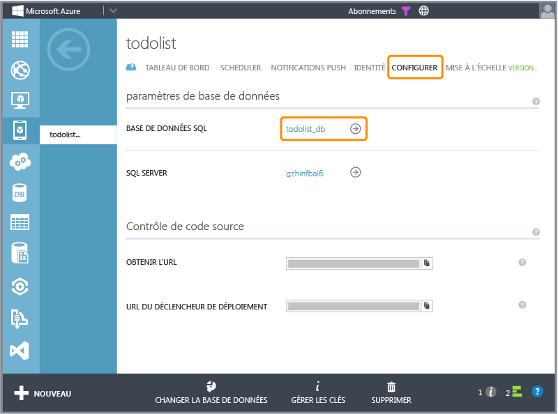

<properties pageTitle="How to use Code First Migrations .NET backend (Mobile Services)" metaKeywords="" description="" metaCanonical="" services="" documentationCenter="" title="Considerations for supporting multiple clients from a single mobile service" authors="glenga" solutions="" writer="glenga" manager="dwrede" editor="" />

Modifications des modèles de données pour un service mobile principal .NET
==========================================================================

Dans un projet de service mobile principal .NET, l'initialiseur de base de données Entity Framework Code First par défaut dérive de la classe [DropCreateDatabaseIfModelChanges]. Cet initialiseur indique à Entity Framework de supprimer et de créer à nouveau la base de données chaque fois qu'il détecte une modification de modèle de données indiquée par votre [DbContext]. Vous devez continuer à utiliser cet initialiseur pendant le développement local de votre projet de service mobile. Les didacticiels consacrés à .NET principal supposent que vous l'utilisez. Néanmoins, dans le cas où vous souhaitez apporter des modifications à des modèles de données et conserver les données existantes dans la base de données, vous devez utiliser Code First Migrations. L'utilisation de Code First Migrations représente également une solution viable pour la publication des modifications de modèles de données sur Azure car une base de données SQL ne peut pas être supprimée.

Cette rubrique montre comment utiliser Code First Migrations pour apporter des modifications de modèles de données à une base de données SQL existante, sans perdre les données existantes. Cette procédure suppose que vous avez déjà publié votre projet de service mobile sur Azure, que votre base de données comporte des données existantes et que les modèles de données distants et locaux sont toujours synchronisés.

> [WACOM.NOTE]Nous vous recommandons de réaliser le développement des modèles de données autant que possible sur votre ordinateur local avant de publier sur Azure. Si vous avez déjà publié votre projet de service mobile principal .NET sur Azure et que votre schéma de tables de base de données SQL ne correspond pas au modèle de données actif de votre projet, vous devez supprimer les tables ou, sinon, les synchroniser manuellement avant de tenter de publier à l'aide de Code First Migrations.

Lorsque vous développez un projet de service mobile principal .NET sur un ordinateur local, la manière la plus facile de traiter les modifications de modèles de données est de continuer à utiliser l'initialiseur par défaut, qui supprime et recrée la base de données chaque fois qu'une modification de modèle de données est détectée. La même approche ne fonctionne pas lors de la republication du projet sur Azure. L'initialiseur échoue car le runtime n'est pas doté des autorisations permettant de supprimer une base de données SQL dans Azure, ce qui est une bonne chose.

> [WACOM.NOTE]Lors du développement et du test de votre projet de service mobile par rapport aux services Azure actifs, vous devez toujours utiliser une instance de service mobile dédiée au test. Vous ne devez jamais développer ou tester par rapport à un service mobile qui est actuellement en production ou en cours d'utilisation par les applications clientes.

Suppression de tables dans votre base de données SQL
----------------------------------------------------

Pour que Migrations fonctionne dans Azure par rapport à une base de données SQL, vous devez manuellement supprimer toutes les tables existantes dans le schéma de la base de données utilisé par votre service mobile. Procédez comme suit pour supprimer des tables existantes de votre base de données SQL. Si votre schéma de base de données est déjà synchronisé avec le modèle de données actif, vous pouvez ignorer cette étape et commencer à utiliser [Migrations](#migrations).

1.  Connectez-vous au [portail de gestion Azure], sélectionnez votre service mobile, cliquez sur l'onglet **Configurer**, puis sur le lien **Base de données SQL**.

    

    Vous accédez ainsi à la page de portail de la base de données utilisée par votre service mobile.

2.  Cliquez sur le bouton **Gérer** et connectez-vous à votre serveur de base de données SQL.

    

3.  Dans le gestionnaire de base de données SQL, cliquez sur **Conception**, puis sur **Tables**, et sélectionnez une table dans le schéma de votre service mobile, cliquez sur **Supprimer la table**, puis sur **OK** pour confirmer.

    

4.  Répétez l'étape précédente pour chaque table du schéma du service mobile.

    Une fois les tables existantes supprimées, Code First Migrations peut être initialisé sur la base de données SQL. Les tables qui n'appartiennent pas au schéma du service mobile n'affectent pas votre service mobile et ne devraient pas être supprimées.

Activation de Code First Migrations
-----------------------------------

Code First Migrations utilise une méthode de capture instantanée qui génère un code qui, lorsqu'il est exécuté, réalise des modifications du schéma dans la base de données. Avec Migrations, vous pouvez apporter des modifications incrémentielles à votre modèle de données et conserver les données existantes dans la base de données. Les étapes suivantes activent Migrations et appliquent les modifications de modèles de données dans le projet, la base de données locale et Azure.

1.  Dans Visual Studio, dans l'Explorateur de solutions, cliquez avec le bouton droit sur le projet de service mobile et cliquez sur **Définir comme projet de démarrage**.

2.  Dans le menu **Outils**, développez **NuGet Package Manager**, puis cliquez sur **Console du gestionnaire de package**.

    Ainsi, la Console du Gestionnaire de package s'affiche, que vous utiliserez pour gérer Code First Migrations.

3.  Dans la Console du Gestionnaire de package, entrez la commande suivante :

         PM> Enable-Migrations

    Cette commande active Code First Migrations pour votre projet.

4.  Dans la console, entrez la commande suivante :

         PM> Add-Migration Initial

    Cette commande crée une nouvelle migration nommée *Initial*. Le code de migration est stocké dans le dossier du projet Migrations.

5.  Développez le dossier App\_Start, ouvrez le fichier de projet WebApiConfig.cs et ajoutez les instructions **using** suivantes :

         using System.Data.Entity.Migrations;
         using todolistService.Migrations;

    Dans le code ci-dessus, vous devez remplacer la chaîne *todolistService* par l'espace de noms de votre projet, qui, pour le projet de démarrage rapide téléchargé, est le service *mobile\_service\_name*.

6.  Dans le même fichier de code, mettez en commentaire l'appel à la méthode **Database.SetInitializer** et ajoutez le code suivant juste après :

         var migrator = new DbMigrator(new Configuration());
         migrator.Update();

    Ce code désactive l'initialiseur de base de données Code First par défaut qui supprime et recrée la base de données et la remplace par une requête explicite afin d'appliquer la migration la plus récente. À ce stade, toute modification de modèle de données résulte en une exception InvalidOperationException lors de l'accès aux données, sauf si une migration a été créée pour la modification. Ultérieurement, votre service doit utiliser Code First Migrations afin de faire migrer les modifications de modèles de données dans la base de données.

7.  Appuyez sur F5 pour démarrer le projet de service mobile sur l'ordinateur local.

    À ce stade, la base de données est synchronisée avec le modèle de données. Si vous avez fourni des données d'amorçage, vous pouvez les vérifier en cliquant sur **Try it out**, **GET tables/todoitem**, puis sur **Try this out** et enfin **Envoyer**. Pour plus d'informations, consultez la section [Données d'amorçage dans les migrations](#seeding).

8.  À présent, apportez une modification à votre modèle de donnés, par exemple, en ajoutant une nouvelle propriété UserId au type TodoItem, régénérez le projet, puis, dans le Gestionnaire de package, exécutez la commande suivante :

    PM\> Add-Migration NewUserId

    Cette commande crée une nouvelle migration nommée *NewUserId*. Un nouveau fichier de code, qui implémente cette modification, est ajouté dans le dossier Migrations.  

1.  Appuyez à nouveau sur F5 pour redémarrer le projet de service mobile sur l'ordinateur local.

    La migration est appliquée à la base de données et cette dernière est à nouveau synchronisée avec le modèle de données. Si vous avez fourni des données d'amorçage, vous pouvez les vérifier en cliquant sur **Try it out**, **GET tables/todoitem**, puis sur **Try this out** et enfin **Envoyer**. Pour plus d'informations, consultez la section [Données d'amorçage dans les migrations](#seeding).

2.  Publiez à nouveau le service mobile sur Azure, puis exécutez l'application cliente afin d'accéder aux données et de vérifier que les données se chargent sans erreur.

3.  (Facultatif) Dans le [portail de gestion Azure], sélectionnez votre service mobile, cliquez sur l'onglet **Configurer**, puis sur le lien **Base de données SQL**.

    

    Vous accédez ainsi à la page de la base de données SQL de la base de données de votre service mobile.

4.  (Facultatif) Cliquez sur **Gérer**, connectez-vous au serveur de base de données SQL, puis cliquez sur **Conception** et vérifiez que les modifications de schéma ont été effectuées dans Azure.

    

Données d'amorçage dans Migrations
----------------------------------

Migrations peut ajouter des données d'amorçage à la base de données lorsqu'une migration est exécutée. La classe Configuration comporte une méthode Seed que vous pouvez remplacer afin d'insérer ou de mettre à jour des données. Le fichier de code Configuration.cs est ajouté au dossier Migrations lorsque Migrations est activé. Ces exemples montrent comment remplacer la méthode [Seed] pour amorcer des données à la table **TodoItems**. La méthode [Seed] est appelée après la migration vers la version la plus récente.

### Amorçage d'une nouvelle table

Le code suivant amorce la table **TodoItems** avec de nouvelles lignes de données :

        List<TodoItem> todoItems = new List<TodoItem>
        {
            new TodoItem { Id = "1", Text = "First item", Complete = false },
            new TodoItem { Id = "2", Text = "Second item", Complete = false },
        };

        foreach (TodoItem todoItem in todoItems)
        {
            context.Set<TodoItem>().Add(todoItem);
        }
        base.Seed(context);

### Amorçage d'une nouvelle colonne dans une table

Le code suivant amorce seulement la colonne UserId :

        context.TodoItems.AddOrUpdate(
            t => t.UserId,
                new TodoItem { UserId = 1 },
                new TodoItem { UserId = 1 },
                new TodoItem { UserId = 2 }
            );
        base.Seed(context);

Ce code appelle la méthode d'extension de l'assistance [AddOrUpdate] pour ajouter des données d'amorçage à la nouvelle colonne UserId. Si [AddOrUpdate] est utilisé, aucune ligne en double n'est créée.

[DropCreateDatabaseIfModelChanges]: http://msdn.microsoft.com/query/dev12.query?appId=Dev12IDEF1&l=EN-US&k=k("System.Data.Entity.DropCreateDatabaseIfModelChanges\`1");k(TargetFrameworkMoniker-.NETFramework,Version%3Dv4.5);k(DevLang-csharp)&rd=true 
[Seed]: http://msdn.microsoft.com/en-us/library/hh829453(v=vs.113).aspx 
[Azure Management Portal]: https://manage.windowsazure.com/ 
[DbContext]: http://msdn.microsoft.com/en-us/library/system.data.entity.dbcontext(v=vs.113).aspx 
[AddOrUpdate]: http://msdn.microsoft.com/en-us/library/system.data.entity.migrations.idbsetextensions.addorupdate(v=vs.103).aspx

