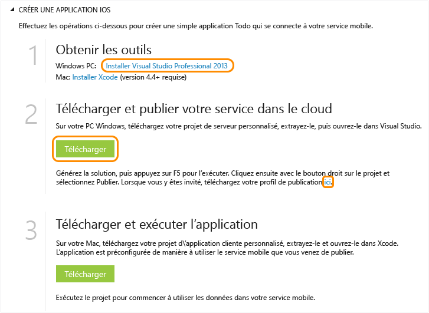

<properties pageTitle="Get Started with Azure Mobile Services for iOS apps" metaKeywords="Azure iOS application, mobile service iOS, getting started Azure iOS" description="Follow this tutorial to get started using Azure Mobile Services for iOS development. " metaCanonical="" services="" documentationCenter="Mobile" title="Get started with Mobile Services" authors="glenga" solutions="" manager="" editor="" />

Prise en main de Mobile Services
================================

[Windows Store C\#](/en-us/documentation/articles/mobile-services-dotnet-backend-windows-store-dotnet-get-started "Windows Store C#") [Windows Store JavaScript](/en-us/documentation/articles/mobile-services-dotnet-backend-windows-store-javascript-get-started "Windows Store JavaScript") [Windows Phone](/en-us/documentation/articles/mobile-services-dotnet-backend-windows-phone-get-started "Windows Phone") [iOS](/en-us/documentation/articles/mobile-services-dotnet-backend-ios-get-started "iOS") [Android](/en-us/documentation/articles/mobile-services-dotnet-backend-android-get-started "Android")
[.NET backend](/en-us/documentation/articles/mobile-services-dotnet-backend-ios-get-started/ ".NET backend") | [JavaScript backend](/en-us/documentation/articles/mobile-services-ios-get-started/ "JavaScript backend")

Ce didacticiel présente l'ajout d'un service principal cloud à une application iOS à l'aide d'Azure Mobile Services. Dans ce didacticiel, vous allez créer un service mobile et une simple application *To do list* qui stocke les données d'application dans le nouveau service mobile. Le service mobile que vous allez créer utilise les langages .NET pris en charge à l'aide de Visual Studio pour la logique métier côté serveur et pour la gestion du service mobile. Pour créer un service mobile vous permettant d'écrire votre logique métier côté serveur en JavaScript, consultez la [version principale JavaScript](/en-us/documentation/articles/mobile-services-ios-get-started) de cette rubrique.

Voici une capture d'écran de l'application terminée :

XCode 4.5 et iOS 5.0 ou versions ultérieures sont requis pour suivre ce didacticiel.

**Remarque**

Pour suivre ce didacticiel, vous avez besoin d'un compte Azure. Si vous ne possédez pas de compte, vous pouvez créer un compte d'évaluation gratuit en quelques minutes. Pour plus d'informations, consultez la page [Version d'évaluation gratuite d'Azure](http://www.windowsazure.com/en-us/pricing/free-trial/?WT.mc_id=AE564AB28&returnurl=http%3A%2F%2Fwww.windowsazure.com%2Fen-us%2Fdevelop%2Fmobile%2Ftutorials%2Fget-started-ios%2F).

Création d'un service mobile
----------------------------

[WACOM.INCLUDE [mobile-services-create-new-service](../includes/mobile-services-create-new-service.md)]

Téléchargement du service mobile sur votre ordinateur local
-----------------------------------------------------------

Maintenant que vous avez créé le service mobile, téléchargez votre projet de service mobile personnalisé afin de l'exécuter sur votre ordinateur local ou sur votre machine virtuelle.

1.  Cliquez sur le service mobile que vous venez de créer, puis dans l'onglet de démarrage rapide, cliquez sur **iOS** sous **Choisissez une plateforme** et développez **Créer une application iOS**.

    

2.  Si ce n'est pas déjà fait, téléchargez et installez Visual Studio Professional 2013 ou une version ultérieure.

3.  Cliquez sur **Télécharger** sous **Télécharger et publier votre service dans le cloud**.

    Cela permet de télécharger le projet Visual Studio qui implémente votre service mobile. Enregistrez le fichier projet compressé sur votre ordinateur local et notez l'emplacement où vous l'avez enregistré.

4.  Téléchargez également votre profil de publication, enregistrez le fichier téléchargé sur votre ordinateur local et notez où vous l'enregistrez.

Test du service mobile
----------------------

[WACOM.INCLUDE [mobile-services-dotnet-backend-test-local-service](../includes/mobile-services-dotnet-backend-test-local-service.md)]

Publication de votre service mobile
-----------------------------------

[WACOM.INCLUDE [mobile-services-dotnet-backend-publish-service](../includes/mobile-services-dotnet-backend-publish-service.md)]

Création d'une application iOS
------------------------------

Dans cette section, vous allez créer une application iOS connectée à votre service mobile.

1.  Dans le portail de gestion, cliquez sur **Mobile Services**, puis sur le service mobile que vous venez de créer.

2.  Dans l'onglet de démarrage rapide, cliquez sur **iOS** sous **Choisissez une plateforme** et développez **Créer une application iOS**.

3.  Si ce n'est pas déjà fait, téléchargez et installez [Xcode](https://go.microsoft.com/fwLink/p/?LinkID=266532) v4.4 ou une version ultérieure.

4.  Cliquez sur **Create TodoItems table** pour créer une table permettant de stocker les données d'application.

5.  Sous **Télécharger et exécuter l'application**, cliquez sur **Télécharger**.

	Cette opération télécharge le projet de votre exemple d'application *To do list* qui est connectée à votre service mobile, ainsi que le Kit de développement logiciel (SDK) Mobile Services iOS. Enregistrez le fichier projet compressé sur votre ordinateur local et notez l'emplacement où vous l'avez enregistré.

Exécution de votre nouvelle application iOS
-------------------------------------------

[WACOM.INCLUDE [mobile-services-ios-run-app](../includes/mobile-services-ios-run-app.md)]

Cette section montre comment exécuter votre nouvelle application cliente sur le service mobile exécuté sous Azure. Avant de pouvoir tester l'application iOS avec le service mobile exécuté sur un ordinateur local, vous devez configurer le serveur Web et le pare-feu de manière à autoriser l'accès depuis votre ordinateur de développement iOS. Pour plus d'informations, consultez la rubrique [Configuration du serveur Web local pour autoriser les connexions à un service mobile local](/en-us/documentation/articles/mobile-services-dotnet-backend-how-to-configure-iis-express).

