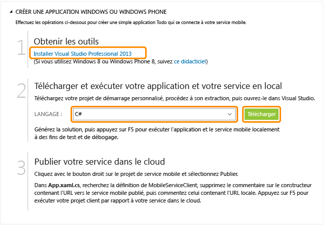
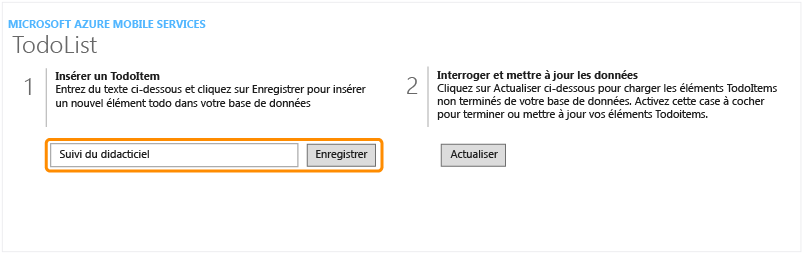

<properties linkid="develop-mobile-tutorials-get-started" pageTitle="Get Started with Mobile Services for Windows Store apps | Mobile Dev Center" metaKeywords="" description="Follow this tutorial to get started using Azure Mobile Services for Windows Store development in C#, VB, or JavaScript. " metaCanonical="" services="" documentationCenter="Mobile" title="Get started with Mobile Services" authors="glenga" solutions="" manager="" editor="" />

Prise en main de Mobile Services
================================

[Windows Store C\#](/fr-fr/documentation/articles/mobile-services-dotnet-backend-windows-store-dotnet-get-started "Windows Store C#") [Windows Store JavaScript](/fr-fr/documentation/articles/mobile-services-dotnet-backend-windows-store-javascript-get-started "Windows Store JavaScript") [Windows Phone](/fr-fr/documentation/articles/mobile-services-dotnet-backend-windows-phone-get-started "Windows Phone") [iOS](/fr-fr/documentation/articles/mobile-services-dotnet-backend-ios-get-started "iOS") [Android](/fr-fr/documentation/articles/mobile-services-dotnet-backend-android-get-started "Android")
[.NET backend](/fr-fr/documentation/articles/mobile-services-dotnet-backend-windows-store-dotnet-get-started/ ".NET backend") | [JavaScript backend](/fr-fr/documentation/articles/mobile-services-windows-store-get-started/ "JavaScript backend")

Ce didacticiel présente l'ajout d'un service principal cloud à une application Windows Store à l'aide d'Azure Mobile Services. Dans ce didacticiel, vous allez créer un service mobile et une simple application *To do list* qui stocke les données d'application dans le nouveau service mobile. Le service mobile que vous allez créer utilise les langages .NET pris en charge à l'aide de Visual Studio pour la logique métier côté serveur et pour la gestion du service mobile. Pour créer un service mobile vous permettant d'écrire votre logique métier côté serveur en JavaScript, consultez la [version principale JavaScript](/fr-fr/documentation/articles/mobile-services-windows-store-get-started) de cette rubrique.

> [WACOM.NOTE] Cette rubrique montre comment créer un projet de service mobile et une application Windows Store à l'aide du portail de gestion Azure. Visual Studio 2013 Update 2 vous permet également d'ajouter un nouveau projet de service mobile dans une solution Visual Studio existante. Pour plus d'informations, consultez la page [Démarrage rapide : ajout d'un service mobile (service principal .NET)](http://msdn.microsoft.com/fr-fr/library/windows/apps/dn629482.aspx)

Voici une capture d'écran de l'application terminée :


Vous devez suivre ce didacticiel avant de pouvoir suivre tous les autres didacticiels Mobile Services pour les applications Windows Store.

> [WACOM.NOTE] Pour suivre ce didacticiel, vous devez également disposer d'un compte Azure. Si vous ne possédez pas de compte, vous pouvez créer un compte d'évaluation gratuit en quelques minutes. Pour plus d'informations, consultez la page [Version d'évaluation gratuite d'Azure](http://www.windowsazure.com/fr-fr/pricing/free-trial/?WT.mc_id=A0E0E5C02&returnurl=http%3A%2F%2Fwww.windowsazure.com%2Fen-us%2Fdocumentation%2Farticles%2Fmobile-services-dotnet-backend-windows-store-get-started%2F).
> Ce didacticiel requiert [Visual Studio Professional 2013](https://go.microsoft.com/fwLink/p/?LinkID=257546). Une version d'évaluation gratuite est disponible.

Création d'un service mobile
----------------------------

[WACOM.INCLUDE [mobile-services-dotnet-backend-create-new-service](../includes/mobile-services-dotnet-backend-create-new-service.md)]

Création d'une application Windows Store
----------------------------------------

Après avoir créé votre service mobile, vous pouvez suivre un démarrage rapide facile dans le portail de gestion pour créer une application ou modifier une application existante afin de vous connecter au service mobile.

Dans cette section, vous allez créer une application Windows Store connectée à votre service mobile.

1.  Dans le portail de gestion, cliquez sur **Mobile Services**, puis sur le service mobile que vous venez de créer.

2.  Dans l'onglet de démarrage rapide, cliquez sur **Windows** sous **Choisissez une plateforme** et développez **Créer une application Windows Store**.

	![][6]

	Cette opération affiche les trois étapes faciles permettant de créer une application Windows Store connectée à votre service mobile.

	

3.  Si ce n'est déjà fait, téléchargez et installez [Visual Studio Professional 2013](https://go.microsoft.com/fwLink/p/?LinkID=257546) sur votre ordinateur local ou sur votre machine virtuelle.

4.  Sous **Télécharger et exécuter votre application et votre service en local**, sélectionnez la langue de votre application Windows Store, puis cliquez sur **Télécharger**.

	Ceci entraîne le téléchargement d'une solution contenant les projets du service mobile et de l'exemple d'application *To do list* connectée à votre service mobile. Enregistrez le fichier projet compressé sur votre ordinateur local et notez l'emplacement où vous l'avez enregistré.

5.  Sous **Publier votre service dans le cloud**, téléchargez votre profil de publication, enregistrez le fichier téléchargé sur votre ordinateur local et notez l'emplacement où vous l'avez enregistré.

Test de l'application avec le service mobile local
--------------------------------------------------

[WACOM.INCLUDE [mobile-services-dotnet-backend-test-local-service-dotnet](../includes/mobile-services-dotnet-backend-test-local-service-dotnet.md)]

> [WACOM.NOTE]Vous pouvez vérifier le code (se trouvant dans le fichier MainPage.xaml.cs) qui accède au service mobile pour exécuter une requête et insérer des données.

Publication de votre service mobile
-----------------------------------

[WACOM.INCLUDE [mobile-services-dotnet-backend-publish-service](../includes/mobile-services-dotnet-backend-publish-service.md)]

1.  Dans le projet d'application Windows Store, ouvrez le fichier App.xaml.cs, recherchez le code de création d'une instance [MobileServiceClient](http://msdn.microsoft.com/fr-fr/library/Windowsazure/microsoft.windowsazure.mobileservices.mobileserviceclient.aspx), placez en commentaire le code de création de ce client à l'aide de *localhost* et annulez le commentaire du code de création du client à l'aide de l'URL du service mobile distant, lequel est semblable à ce qui suit :

    ``` {}
    public static MobileServiceClient MobileService = new MobileServiceClient(
                "https://todolist.azure-mobile.net/",
                "XXXX-APPLICATION-KEY-XXXXX");
    ```

    Le client a désormais accès au service mobile publié sur Azure.

2.  Appuyez sur la touche **F5** pour régénérer le projet et démarrer l'application.

3.  Dans l'application, tapez un texte explicite, comme *Suivre le didacticiel*, dans **Insert a TodoItem**, puis cliquez sur **Enregistrer**.

    Ceci envoie une demande POST vers le nouveau service mobile hébergé dans Azure.



Étapes suivantes
----------------

Maintenant que vous avez effectué le démarrage rapide, découvrez comment exécuter d'autres tâches importantes dans Mobile Services :

-   [Prise en main des données](/fr-fr/documentation/articles/mobile-services-dotnet-backend-windows-store-dotnet-get-started-data)
    <br/>En savoir plus sur le stockage et l'interrogation des données à l'aide de Mobile Services.

-   [Prise en main de l'authentification](/fr-fr/documentation/articles/mobile-services-dotnet-backend-windows-store-dotnet-get-started-users)
    <br/>En savoir plus sur l'authentification des utilisateurs de votre application avec un fournisseur d'identité.

-   [Prise en main des notifications Push](/fr-fr/documentation/articles/mobile-services-dotnet-backend-windows-store-dotnet-get-started-push)
    <br/>En savoir plus sur l'envoi d'une notification Push très basique sur votre application.

<!-- Anchors. -->
[Getting started with Mobile Services]:#getting-started
[Create a new mobile service]:#create-new-service
[Define the mobile service instance]:#define-mobile-service-instance
[Next Steps]:#next-steps

<!-- Images. -->
[0]: ./media/mobile-services-dotnet-backend-windows-store-dotnet-get-started/mobile-quickstart-completed.png

[6]: ./media/mobile-services-dotnet-backend-windows-store-dotnet-get-started/mobile-portal-quickstart.png
[7]: ./media/mobile-services-dotnet-backend-windows-store-dotnet-get-started/mobile-quickstart-steps.png
[8]: ./media/mobile-services-dotnet-backend-windows-store-dotnet-get-started/mobile-service-startup.png

[10]: ./media/mobile-services-dotnet-backend-windows-store-dotnet-get-started/mobile-quickstart-startup.png


<!-- URLs. -->
[Get started with data]: /fr-fr/documentation/articles/mobile-services-dotnet-backend-windows-store-dotnet-get-started-data
[Get started with authentication]: /fr-fr/documentation/articles/mobile-services-dotnet-backend-windows-store-dotnet-get-started-users
[Get started with push notifications]: /fr-fr/documentation/articles/mobile-services-dotnet-backend-windows-store-dotnet-get-started-push
[Visual Studio Professional 2013]: https://go.microsoft.com/fwLink/p/?LinkID=257546
[Mobile Services SDK]: http://go.microsoft.com/fwlink/?LinkId=257545
[JavaScript and HTML]: mobile-services-win8-javascript/
[Management Portal]: https://manage.windowsazure.com/
[JavaScript backend version]: /fr-fr/documentation/articles/mobile-services-windows-store-get-started
[Get started with data in Mobile Services using Visual Studio 2012]: /fr-fr/documentation/articles/mobile-services-windows-store-dotnet-get-started-data-vs2012
