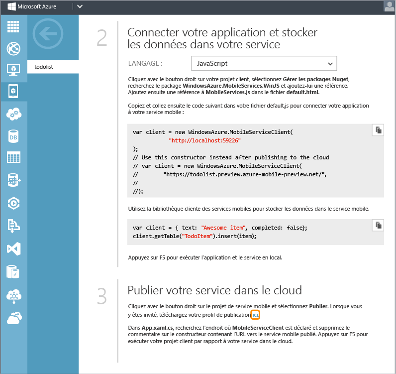
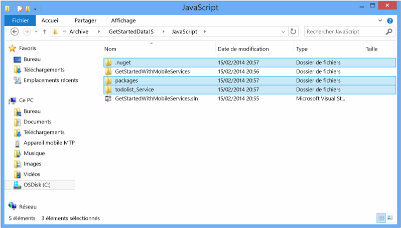
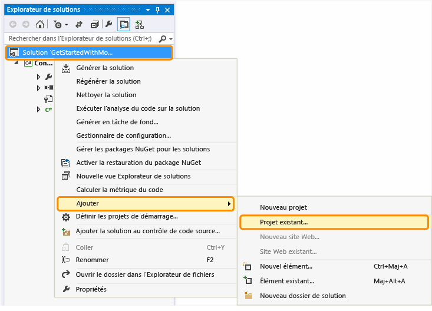
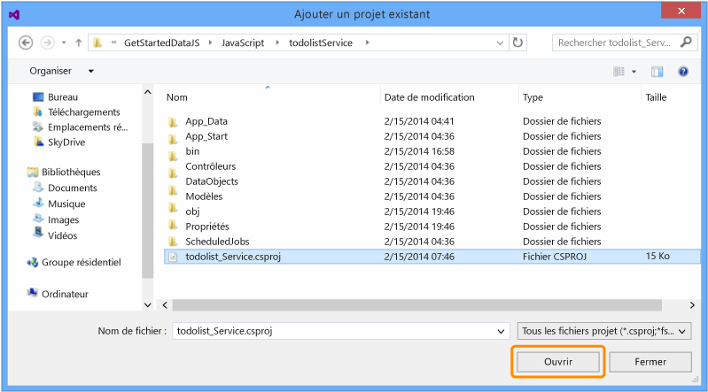
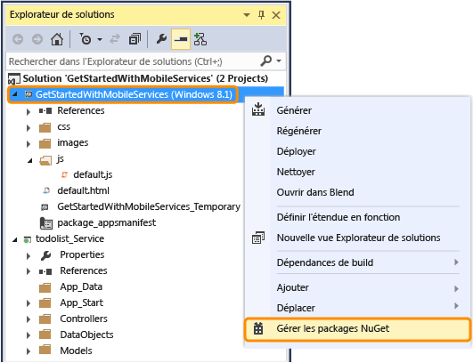
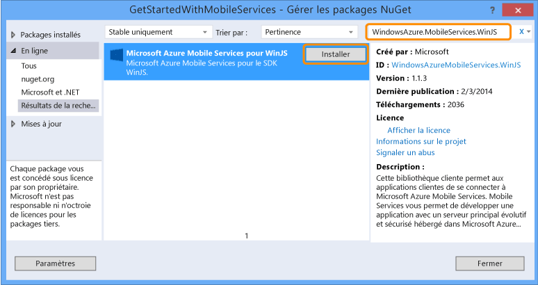
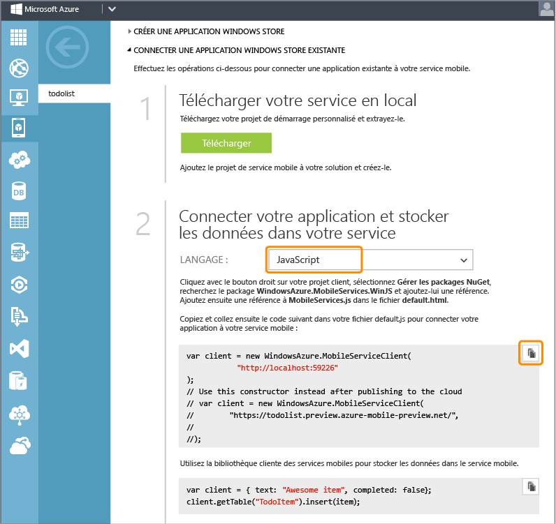
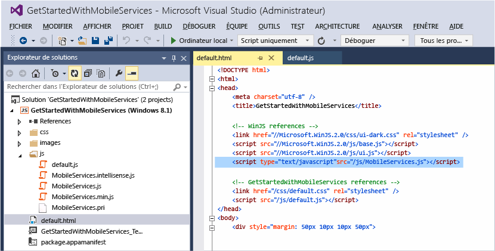
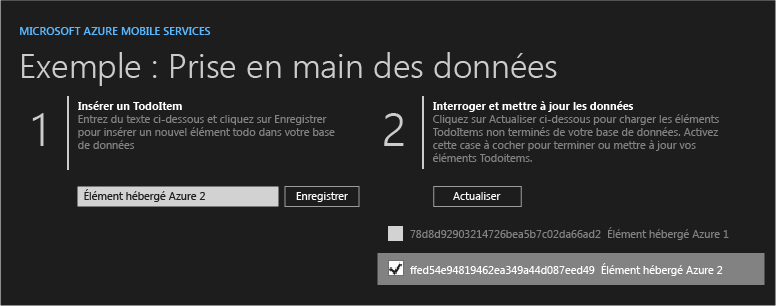

<properties linkid="develop-mobile-tutorials-dotnet-backend-get-started-with-data-javascript-vs2013" urlDisplayName="Get Started with Data" pageTitle="Get started with data (Windows Store) | Mobile Dev Center" metaKeywords="" description="Learn how to get started using Mobile Services to leverage data in your Windows Store app." metaCanonical="" services="" documentationCenter="Mobile" title="Get started with data in Mobile Services" authors="wesmc" solutions="" manager="" editor="" />

Prise en main des données dans Mobile Services
==============================================

[Windows Store C\#](/fr-fr/documentation/articles/mobile-services-dotnet-backend-windows-store-dotnet-get-started-data/ "Windows Store C#") [Windows Store JavaScript](/fr-fr/documentation/articles/mobile-services-dotnet-backend-windows-store-javascript-get-started-data/ "Windows Store JavaScript") [Windows Phone](/fr-fr/documentation/articles/mobile-services-dotnet-backend-windows-phone-get-started-data/ "Windows Phone")
[.NET backend](/fr-fr/documentation/articles/mobile-services-dotnet-backend-windows-store-javascript-get-started-data/ ".NET backend") | [JavaScript backend](/fr-fr/documentation/articles/mobile-services-windows-store-javascript-get-started-data/ "JavaScript backend")

Cette rubrique montre comment utiliser Azure Mobile Services en tant que source de données principale pour une application Windows Store. Dans ce didacticiel, vous allez télécharger un projet Visual Studio 2013 pour une application qui stocke les données en mémoire, créer un service mobile, intégrer le service mobile à l'application, puis afficher les modifications apportées aux données lors de l'exécution de l'application.

Le service mobile que vous allez créer dans ce didacticiel prendra en charge le runtime .NET dans le service mobile. Vous pourrez ainsi utiliser les langages .NET et Visual Studio pour la logique métier côté serveur dans le service mobile. Pour créer un service mobile vous permettant d'écrire votre logique métier côté serveur en JavaScript, consultez la [version principale JavaScript](/en-us/develop/mobile/tutorials/get-started-with-data-js) de cette rubrique.

**Remarque**

Ce didacticiel requiert Visual Studio 2013.

Ce didacticiel vous familiarise avec ces étapes de base :

1.  [Téléchargement d'un projet d'application Windows Store](#download-app)
2.  [Création d'un service mobile](#create-service)
3.  [Téléchargement du service mobile en local](#download-the-service-locally)
4.  [Mise à jour de l'application Windows Store pour utiliser le service mobile](#update-app)
5.  [Test de l'application Windows Store sur le service hébergé localement](#test-locally-hosted)
6.  [Publication du service mobile sur Azure](#publish-mobile-service)
7.  [Test de l'application Windows Store sur le service hébergé sous Azure](#test-azure-hosted)

**Remarque**

Pour suivre ce didacticiel, vous avez besoin d'un compte Azure. Si vous ne possédez pas de compte, vous pouvez créer un compte d'évaluation gratuit en quelques minutes. Pour plus d'informations, consultez la page [Version d'évaluation gratuite d'Azure](http://www.windowsazure.com/fr-fr/pricing/free-trial/?WT.mc_id=AE564AB28&returnurl=http%3A%2F%2Fwww.windowsazure.com%2Fen-us%2Fdocumentation%2Farticles%2Fmobile-services-dotnet-backend-windows-store-javascript-get-started-data%2F).

Téléchargement du projetTéléchargement du projet GetStartedWithData
-------------------------------------------------------------------

Ce didacticiel est basé sur l'[application GetStartedWithMobileServices](http://go.microsoft.com/fwlink/p/?LinkId=328660) qui correspond à un projet d'application Windows Store de Visual Studio 2013. L'interface utilisateur de cette application est semblable à l'application générée par le démarrage rapide de Mobile Services, mais les éléments ajoutés sont ici stockés en local dans la mémoire.

1.  Téléchargez la version JavaScript de l'exemple d'application GetStartedWithMobileServices sur le [site d'exemples de code développeur](http://go.microsoft.com/fwlink/p/?LinkId=328660).

	![][1]

2.  Exécutez Visual Studio 2013 avec des privilèges d'administration : cliquez avec le bouton droit sur Visual Studio, puis cliquez sur **Exécuter en tant qu'administrateur**.

3.  Dans Visual Studio 2013, ouvrez le projet téléchargé. Développez le dossier js dans l'Explorateur de solutions et examinez le fichier default.js.

	Notez que les objets **TodoItem** ajoutés sont stockés en mémoire dans `WinJS.Binding.List`.

4.  Appuyez sur la touche **F5** pour régénérer le projet et démarrer l'application.

5.  Dans l'application, tapez un texte dans la zone située sous **Insert a TodoItem**, puis cliquez sur **Enregistrer**.

	![][0]  

	Notez que le texte enregistré est affiché dans la deuxième colonne sous **Query and update data**.

Création d'un service mobile Création d'un service mobile
---------------------------------------------------------

[WACOM.INCLUDE [mobile-services-dotnet-backend-create-new-service](../includes/mobile-services-dotnet-backend-create-new-service.md)]

Téléchargement du service localementTéléchargement du projet de service mobile et ajout de celui-ci à la solution
-----------------------------------------------------------------------------------------------------------------

1.  Dans le [portail de gestion Azure](https://manage.windowsazure.com/), cliquez sur votre nouveau service mobile ou sur son onglet d'icône cloud pour accéder à la page de présentation.

    

2.  Cliquez sur la plateforme **Windows Store**. Sous la section **Prise en main**, développez **Connecter une application Windows Store existante**, puis cliquez sur le bouton **Télécharger** afin de télécharger un projet de démarrage personnalisé pour le service mobile.

    

3.  En bas de cette section **Prise en main**, accédez à l'étape intitulée **Publier votre service dans le cloud**. Cliquez sur le lien présenté dans la capture d'écran ci-dessous afin de télécharger un fichier de profil de publication pour le service mobile que vous venez de télécharger.

    > [WACOM.NOTE] Enregistrez le fichier en lieu sûr, car il contient des informations sensibles sur votre compte Azure. Vous supprimerez ce fichier après la publication du service mobile, comme expliqué plus loin dans ce didacticiel.

    

4.  Décompressez le projet de démarrage de service personnalisé que vous avez téléchargé. Copiez les dossiers que contenait le fichier .zip dans le même répertoire **JavaScript** que le fichier solution Prise en main des données (.sln). Cela permet au gestionnaire de package NuGet d'assurer plus facilement la synchronisation de tous les packages.

    

5.  Dans l'Explorateur de solutions de Visual Studio, cliquez avec le bouton droit sur la solution de votre application Windows Store Prise en main des données. Cliquez sur **Ajouter**, puis sur **Projet existant**.

    

6.  Dans la boîte de dialogue Ajouter un projet existant, accédez au dossier du projet de service mobile que vous avez déplacé vers le répertoire **JavaScript**. Sélectionnez le fichier du projet C\# (.csproj) dans le sous-répertoire du service. Cliquez sur **Ouvrir** pour ajouter le projet à votre solution.

    

7.  Dans l'Explorateur de solutions de Visual Studio, cliquez avec le bouton droit sur le projet de service que vous venez d'ajouter, puis cliquez sur **Générer** pour vérifier qu'il est généré sans erreur. Pendant la génération, il se peut que le gestionnaire de package NuGet ait besoin de restaurer des packages NuGet référencés dans le projet.

    

8.  Cliquez de nouveau sur le projet de service avec le bouton droit. Cette fois, cliquez sur **Démarrer une nouvelle instance** sous le menu contextuel **Déboguer**.

    

    Visual Studio ouvre la page Web par défaut de votre service. Vous pouvez cliquer sur **try it now** pour tester les méthodes dans votre service mobile à partir de la page Web par défaut.

    

    Par défaut, Visual Studio a hébergé votre service mobile localement dans IIS Express. Pour vous en assurer, cliquez avec le bouton droit sur l'icône de barre d'état système d'IIS Express sur votre barre des tâches.

    

Mise à jour de l'application Windows StoreMise à jour de l'application Windows Store pour utiliser le service mobile
--------------------------------------------------------------------------------------------------------------------

Dans cette section, vous allez mettre à jour l'application Windows Store pour utiliser le service mobile en tant que service principal de l'application.

1.  Dans l'Explorateur de solutions de Visual Studio, cliquez avec le bouton droit sur le projet d'application Windows Store, puis cliquez sur **Gérer les packages NuGet**.

    

2.  À partir de la boîte de dialogue Gérer les packages NuGet, recherchez **WindowsAzure.MobileServices.WinJS** dans la collection de packages en ligne et cliquez pour installer le package NuGet Azure Mobile Services. Fermez ensuite la boîte de dialogue.

    

3.  À partir du portail de gestion Azure, accédez à la page d'aperçu de votre service mobile, puis recherchez l'étape intitulée **Connecter votre application et stocker les données dans votre service**. Cliquez sur **JavaScript** pour sélectionner ce langage et copiez l'extrait de code pour créer le client `MobileServiceClient`.

    

4.  Dans l'Explorateur de solutions de Visual Studio, développez le dossier **js** et ouvrez le fichier default.js. Collez l'extrait de code que vous avez copié dans le gestionnaire d'événements `app.onactivated` juste avant la définition de la variable `todoItems`. Notez que l'extrait comprend un constructeur placé en commentaire pour la connexion au service mobile sous Azure via la clé de l'application. Vous annulerez ce commentaire lors d'une étape ultérieure.

    

5.  Dans le fichier default.js, remplacez le reste du code du gestionnaire d'événements `app.onactivated` par le code suivant qui définit les éléments `todoItem` et les opérations que nous allons tester avec le service mobile. Enregistrez ensuite le fichier.

    Ce code utilise le Kit de développement logiciel (SDK) Mobile Services pour que JavaScript permette à l'application de stocker ses données dans une table fournie par le service au lieu de les stocker localement en mémoire. Les trois principales méthodes sont les suivantes : `insertTodoItem`, `refreshTodoItems` et `updateCheckedTodoItem`. Elles vous permettent d'insérer, d'interroger et de mettre à jour de manière asynchrone votre collection de données avec une table dans Azure.

             var todoTable = client.getTable('TodoItem');
             var todoItems = new WinJS.Binding.List();
             var insertTodoItem = function (todoItem) {
                 // Ce code insère un nouvel élément TodoItem dans la base de données. 
                 // Mobile Services attribue un ID à chaque élément et
                 // l'élément est ajouté à la liste des liaisons
                 todoTable.insert(todoItem).done(function (item) {
                     todoItems.push(item);
                 });
             };
             var refreshTodoItems = function () {
                 // Ce code actualise les entrées de la vue liste
                 // en interrogeant la table TodoItems.
                 todoTable.where()
                     .read()
                     .done(function (results) {
                         todoItems = new WinJS.Binding.List(results);
                         listItems.winControl.itemDataSource = todoItems.dataSource;
                     });
             };
             var updateCheckedTodoItem = function (todoItem) {
                 // Ce code met à jour la base de données. 
                 // Lorsque MobileService répond, 
                 // l'élément est supprimé de la liste 
                 todoTable.update(todoItem).done(function (item) {
                     todoItems.splice(todoItems.indexOf(item), 1);
                 });
             };
             buttonSave.addEventListener("click", function () {
                 insertTodoItem({
                     text: textInput.value,
                     complete: false
                 });
             });
             buttonRefresh.addEventListener("click", function () {
                 refreshTodoItems();
             });
             listItems.addEventListener("change", function (eventArgs) {
                 var todoItem = eventArgs.target.dataContext.backingData;
                 todoItem.complete = eventArgs.target.checked;
                 updateCheckedTodoItem(todoItem);
             });
             refreshTodoItems();

6.  Dans l'Explorateur de solutions de Visual Studio, ouvrez le fichier default.html. En haut du fichier, ajoutez une nouvelle référence au script WinJS pour MobileServices.js. Enregistrez ensuite le fichier.

         

    

Test de l'application Windows Store localementTest de l'application Windows Store avec le service hébergé localement
--------------------------------------------------------------------------------------------------------------------

Dans cette section, vous allez utiliser Visual Studio pour héberger le service mobile en local sur votre station de travail de développement dans IIS Express. Vous testerez ensuite l'application et le service principal.

1.  Dans Visual Studio, appuyez sur la touche F7 ou cliquez sur **Générer la solution** dans le menu Générer pour générer à la fois l'application Windows Store et le service mobile. Vérifiez que les deux projets ont été générés sans erreurs dans la fenêtre Sortie de Visual Studio

    

2.  Dans Visual Studio, appuyez sur la touche F5 ou cliquez sur **Démarrer le débogage** dans le menu Déboguer pour exécuter l'application et héberger le service mobile localement dans IIS Express.

    

3.  Entrez un texte pour le nouvel élément todoitem. Cliquez ensuite sur **Enregistrer**. Un nouvel élément TodoItem est inséré dans la base de données créée par le service mobile hébergé localement dans IIS Express.

    

4.  Activez la case à cocher d'un des éléments pour le marquer comme terminé.

    

5.  Dans Visual Studio, vous pouvez examiner les modifications dans la base de données créée pour le service principal en ouvrant l'Explorateur de serveurs et en développant les Connexions de données. Cliquez avec le bouton droit sur la table TodoItems située sous **MS\_TableConnectionString** et cliquez sur **Afficher les données de la table.**

    

Publication du service mobile sur AzurePublication du service mobile sur Azure
------------------------------------------------------------------------------

[WACOM.INCLUDE [mobile-services-dotnet-backend-publish-service](../includes/mobile-services-dotnet-backend-publish-service.md)]

Test du service mobile sur AzureTest du service mobile publié sur Azure
-----------------------------------------------------------------------

1.  Dans l'Explorateur de solutions de Visual Studio, développez le dossier **js** et ouvrez le fichier default.js. Placez en commentaire le code permettant de créer le client `MobileServiceClient` qui se connecte au service mobile hébergé localement. Annulez le commentaire du code permettant de créer le client `MobileServiceClient` qui se connecte à votre service sous Azure. Enregistrez vos modifications dans le fichier.

         //var client = new WindowsAzure.MobileServiceClient(
         //          "http://localhost:59226"
         //);
         // Utilisez plutôt ce constructeur après la publication dans le cloud
         var client = new WindowsAzure.MobileServiceClient(
             "https://todolist.preview.azure-mobile-preview.net/",
             "XXXXXXXXXXXXXXXXXXXXXXXXXXXXXXXX");

2.  Dans Visual Studio, appuyez sur la touche F5 ou cliquez sur **Démarrer le débogage** dans le menu Déboguer. L'application Windows Store est alors régénérée conformément à la précédente modification avant d'être exécutée pour se connecter au service mobile hébergé à distance sous Azure.

    

3.  Entrez quelques nouveaux éléments todoitem et cliquez sur **Enregistrer** pour chacun d'eux. Activez la case à cocher pour valider certains de ces nouveaux éléments. Chaque nouvel élément todoItem est stocké et mis à jour dans la base de données SQL que vous avez configurée précédemment pour votre service mobile dans le portail de gestion Azure.

    

    Vous pouvez redémarrer l'application pour vous assurer que les modifications ont été conservées dans la base de données sous Azure. Vous pouvez également examiner la base de données à l'aide du portail de gestion Azure ou de l'Explorateur d'objets SQL Server de Visual Studio. Au cours des deux prochaines étapes, vous allez utiliser le portail de gestion Azure pour consulter les modifications dans votre base de données.

4.  Dans le portail de gestion Azure, cliquez sur Gérer pour la base de données associée à votre service mobile.

    

5.  Dans le portail de gestion, exécutez une requête pour afficher les modifications effectuées par l'application Windows Store. Votre requête sera semblable à la requête suivante mais le nom de votre base de données sera utilisé à la place de `todolist`.

         SELECT * FROM [todolist].[todoitems]

    

Vous voici parvenu à la fin du didacticiel **Prise en main des données**.

Étapes suivantes
----------------

Ce didacticiel a présenté les bases de l'activation d'une application Windows Store pour utiliser les données dans Mobile Services. Ensuite, pensez à suivre l'un des didacticiels suivants basés sur l'application GetStartedWithData que vous avez créée dans ce didacticiel :

-   [Validation et modification des données avec des scripts](/en-us/develop/mobile/tutorials/validate-modify-and-augment-data-js)
     En savoir plus sur l'utilisation des scripts serveur dans Mobile Services pour valider et modifier les données envoyées à partir de votre application.

-   [Affinage des requêtes à la pagination](/en-us/develop/mobile/tutorials/add-paging-to-data-js)
     En savoir plus sur l'utilisation de la pagination dans les requêtes pour contrôler la quantité de données traitées dans une seule requête.

Une fois que vous avez terminé les séries de données, essayez l'un de ces autres didacticiels :

-   [Prise en main de l'authentification](/fr-fr/documentation/articles/mobile-services-dotnet-backend-windows-store-javascript-get-started-users/)
     En savoir plus sur l'authentification des utilisateurs de votre application.

-   [Prise en main des notifications Push](/fr-fr/documentation/articles/mobile-services-dotnet-backend-windows-store-javascript-get-started-push/)
     En savoir plus sur l'envoi d'une notification Push très basique sur votre application.

-   [Guide de fonctionnement Mobile Services .NET](/en-us/develop/mobile/how-to-guides/work-with-html-js-client/)
     En savoir plus sur l'utilisation de Mobile Services avec HTML et JavaScript.

<!-- Anchors. -->

[Download the Windows Store app project]: #download-app
[Create a new mobile service]: #create-service
[Download the mobile service locally]: #download-the-service-locally
[Update the Windows Store app to use the Mobile Service]: #update-app
[Test the Windows Store App against the service hosted locally]: #test-locally-hosted
[Publish the mobile service to Azure]: #publish-mobile-service
[Test the Windows Store App against the service hosted in Azure]: #test-azure-hosted
[Next Steps]:#next-steps

<!-- Images. -->
[0]: ./media/mobile-services-dotnet-backend-windows-store-javascript-get-started-data/app-view.png
[1]: ./media/mobile-services-dotnet-backend-windows-store-javascript-get-started-data/mobile-data-sample-download-javascript-vs13.png
[2]: ./media/mobile-services-dotnet-backend-windows-store-javascript-get-started-data/mobile-service-overview-page.png
[3]: ./media/mobile-services-dotnet-backend-windows-store-javascript-get-started-data/download-service-project.png
[4]: ./media/mobile-services-dotnet-backend-windows-store-javascript-get-started-data/add-service-project-to-solution.png
[5]: ./media/mobile-services-dotnet-backend-windows-store-javascript-get-started-data/download-publishing-profile.png
[6]: ./media/mobile-services-dotnet-backend-windows-store-javascript-get-started-data/add-existing-project-dialog.png
[7]: ./media/mobile-services-dotnet-backend-windows-store-javascript-get-started-data/vs-manage-nuget-packages.png
[8]: ./media/mobile-services-dotnet-backend-windows-store-javascript-get-started-data/manage-nuget-packages.png
[9]: ./media/mobile-services-dotnet-backend-windows-store-javascript-get-started-data/copy-mobileserviceclient-snippet.png
[10]: ./media/mobile-services-dotnet-backend-windows-store-javascript-get-started-data/vs-pasted-mobileserviceclient.png
[11]: ./media/mobile-services-dotnet-backend-windows-store-javascript-get-started-data/vs-build-solution.png
[12]: ./media/mobile-services-dotnet-backend-windows-store-javascript-get-started-data/vs-run-solution.png
[13]: ./media/mobile-services-dotnet-backend-windows-store-javascript-get-started-data/new-local-todoitem.png
[14]: ./media/mobile-services-dotnet-backend-windows-store-javascript-get-started-data/vs-show-local-table-data.png
[15]: ./media/mobile-services-dotnet-backend-windows-store-javascript-get-started-data/local-item-checked.png
[16]: ./media/mobile-services-dotnet-backend-windows-store-javascript-get-started-data/azure-items.png
[17]: ./media/mobile-services-dotnet-backend-windows-store-javascript-get-started-data/manage-sql-azure-database.png
[18]: ./media/mobile-services-dotnet-backend-windows-store-javascript-get-started-data/sql-azure-query.png
[19]: ./media/mobile-services-dotnet-backend-windows-store-javascript-get-started-data/vs-mobileservices-script-reference.png
[20]: ./media/mobile-services-dotnet-backend-windows-store-javascript-get-started-data/vs-build-service-project.png
[21]: ./media/mobile-services-dotnet-backend-windows-store-javascript-get-started-data/vs-start-debug-service-project.png
[22]: ./media/mobile-services-dotnet-backend-windows-store-javascript-get-started-data/service-welcome-page.png
[23]: ./media/mobile-services-dotnet-backend-windows-store-javascript-get-started-data/iis-express-tray.png

[26]: ./media/mobile-services-dotnet-backend-windows-store-javascript-get-started-data/copy-service-and-packages-folder.png

<!-- URLs. -->
[Validate and modify data with scripts]: /en-us/develop/mobile/tutorials/validate-modify-and-augment-data-js
[Refine queries with paging]: /en-us/develop/mobile/tutorials/add-paging-to-data-js
[Get started with Mobile Services]: /fr-fr/documentation/articles/mobile-services-dotnet-backend-windows-store-javascript-get-started/
[Get started with data]: /fr-fr/documentation/articles/mobile-services-dotnet-backend-windows-store-javascript-get-started-data/
[Get started with authentication]: /fr-fr/documentation/articles/mobile-services-dotnet-backend-windows-store-javascript-get-started-users/
[Get started with push notifications]: /fr-fr/documentation/articles/mobile-services-dotnet-backend-windows-store-javascript-get-started-push/
[JavaScript and HTML]: /en-us/develop/mobile/tutorials/get-started-with-data-js
[JavaScript backend version]: /en-us/develop/mobile/tutorials/get-started-with-data-js

[Azure Management Portal]: https://manage.windowsazure.com/
[Management Portal]: https://manage.windowsazure.com/
[Mobile Services SDK]: http://go.microsoft.com/fwlink/p/?LinkId=257545
[Developer Code Samples site]:  http://go.microsoft.com/fwlink/p/?LinkId=328660
[Mobile Services .NET How-to Conceptual Reference]: /en-us/develop/mobile/how-to-guides/work-with-html-js-client/
[MobileServiceClient class]: http://go.microsoft.com/fwlink/p/?LinkId=302030