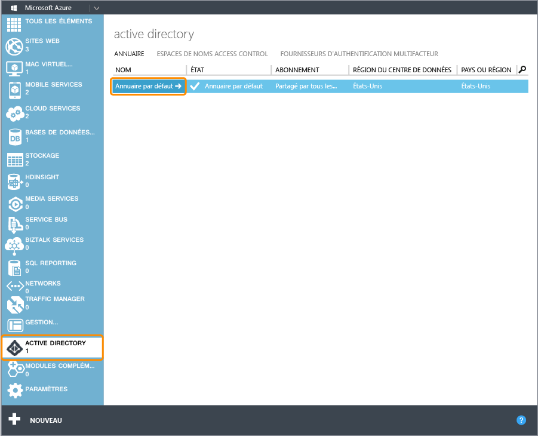
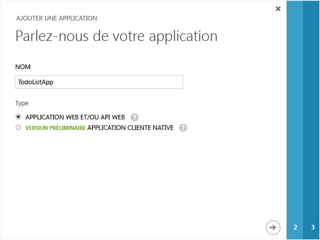
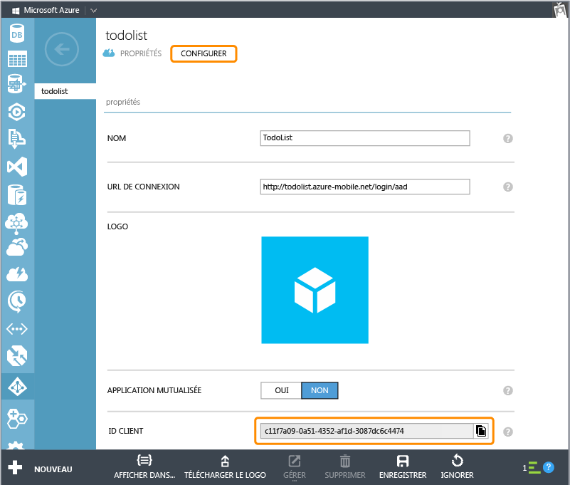

<properties linkid="develop-mobile-how-to-guides-register-for-active-directory-authentication" urlDisplayName="Register for Azure Active Directory Authentication" pageTitle="Register for Azure Active Directory authentication - Mobile Services" metaKeywords="Azure registering application, Azure Active Directory authentication, application authenticate, authenticate mobile services" description="Learn how to register for Azure Active Directory authentication in your Mobile Services application." title="Register your account to use an Azure Active Directory account login" authors="" />

Inscription de vos applications à des fins d'utilisation d'une connexion via un compte Azure Active Directory
=============================================================================================================

Cette rubrique montre comment inscrire vos applications afin d'utiliser Azure Active Directory comme fournisseur d'authentification pour Azure Mobile Services.

> [WACOM.NOTE] Le fournisseur d'authentification Azure Active Directory pour Mobile Services en est actuellement au stade préliminaire. Si vous voulez vous inscrire pour la version préliminaire, contactez <mobileservices@microsoft.com>. Sinon, le fournisseur d'authentification ne sera pas visible sous l'onglet `Identité` de votre service mobile.

> [WACOM.NOTE]Lorsque vous prévoyez de fournir également une authentification pilotée par le client pour l'authentification unique (SSO) ou les notifications Push à partir d'une application Windows Store, pensez aussi à inscrire votre application auprès du Windows Store. Pour plus d'informations, consultez la page [Inscription de vos applications Windows Store pour l'authentification Windows Live Connect](/en-us/develop/mobile/how-to-guides/register-for-single-sign-on).

1.  Connectez-vous au [portail de gestion Azure](https://manage.windowsazure.com/), cliquez sur **Mobile Services**, puis sur le service mobile.

    

2.  Cliquez sur l'onglet **Identité** de votre service mobile.

    

3.  Faites défiler jusqu'à la section du fournisseur d'identité **Azure active directory** et copiez l'**URL de l'application** qui y est répertoriée.

    

4.  Dans le portail de gestion, accédez à **Active Directory**, puis cliquez sur votre annuaire.

    

5.  Cliquez en haut sur l'onglet **Applications**, puis cliquez pour **AJOUTER** une application.

    

6.  Cliquez sur **Ajouter une application développée par mon organisation**.

7.  Dans l'Assistant Ajout d'application, entrez un **Nom** pour votre application et cliquez sur le type **Application Web et/ou API Web**. Ensuite, cliquez pour continuer.

    

8.  Dans la zone **URL de connexion**, collez l'ID d'application que vous avez copié dans les paramètres du fournisseur d'identité Active Directory de votre service mobile. Entrez également un identificateur de ressource unique dans la zone **URI ID d'application**. L'application utilisera l'URI pour envoyer des demandes d'authentification unique à Azure Active Directory. Ensuite, cliquez pour continuer.

    

9.  Cliquez pour activer le type d'accès **Authentification unique** pour l'application. Cliquez pour terminer l'Assistant Ajout d'application.

    

10. Une fois que l'application a été ajoutée, faites défiler jusqu'en bas de l'écran. Cliquez ensuite sur **Activer votre application pour accéder en lecture ou écriture aux données d'annuaire** pour la développer, puis cliquez sur l'**ID client** de l'application.

    

11. Revenez sous l'onglet **Identité** de votre service mobile. En bas, collez le paramètre **ID client** du fournisseur d'identité Azure Active Directory. Cliquez ensuite sur **Enregistrer**.

    

Vous êtes maintenant prêt à utiliser Azure Active Directory pour l'authentification dans votre application.

