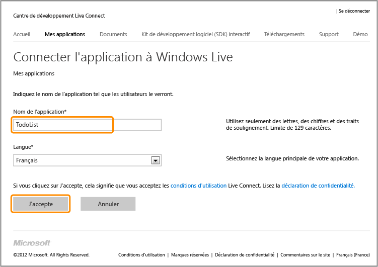
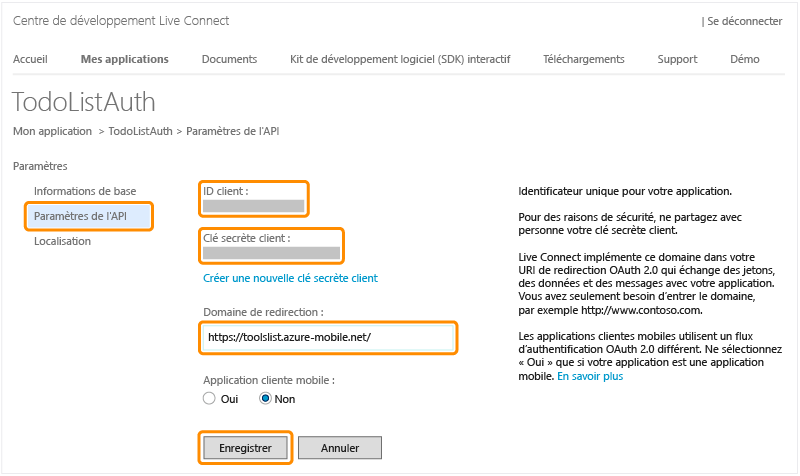

<properties pageTitle="Register for Microsoft authentication - Mobile Services" metaKeywords="Azure registering application, Azure Microsoft authentication, application authenticate, authenticate mobile services" description="Learn how to register for Microsoft authentication in your Azure Mobile Services application." metaCanonical="" disqusComments="0" umbracoNaviHide="1" title="Register your apps to use a Microsoft Account login" authors="" />

Inscription de vos applications pour utiliser les informations d'identification d'un compte Microsoft
=====================================================================================================

Cette rubrique montre comment inscrire vos applications afin d'utiliser Live Connect comme fournisseur d'authentification pour Azure Mobile Services.

> [WACOM.NOTE]Lorsque vous prévoyez de fournir également une authentification pilotée par le client pour l'authentification unique (SSO) ou les notifications Push à partir d'une application Windows Store, pensez aussi à inscrire votre application auprès du Windows Store. Pour plus d'informations, consultez la page [Inscription de vos applications Windows Store pour l'authentification Windows Live Connect](/en-us/develop/mobile/how-to-guides/register-for-single-sign-on).

1.  Accédez à la page [Mes applications](http://go.microsoft.com/fwlink/p/?LinkId=262039) dans le Centre des développeurs Live Connect, puis connectez-vous avec votre compte Microsoft si nécessaire.

2.  Cliquez sur **Créer une application**, puis tapez le **Nom de l'application** et cliquez sur **J'accepte**.

   	 

   	Cela inscrit l'application avec Live Connect.

3.  Cliquez sur la **page Paramètres de l'application**, puis sur **Paramètres de l'API** et notez les valeurs de **ID client** et **Clé secrète client**.

   	

    
<b>Remarque relative à la sécurité</b>
	
La clé secrète client est une information d'identification de sécurité importante. Ne partagez pas la clé secrète client avec quiconque et ne la distribuez pas avec votre application.

    

1.  Dans **Domaine de redirection**, entrez l'URL de votre service mobile, puis cliquez sur **Enregistrer**.

Vous pouvez désormais utiliser un compte Microsoft pour l'authentification dans votre application en fournissant les valeurs de l'ID client et de la clé secrète client à Mobile Services.

