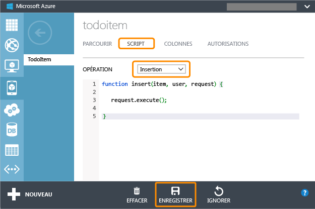
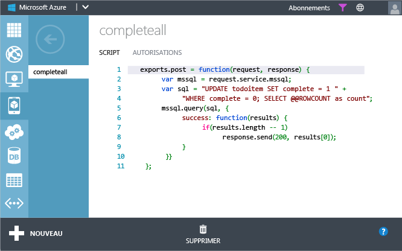

<properties linkid="register-for-facebook-auth" urlDisplayName="Mobile Services" pageTitle="Work with server scripts in Mobile Services" metaKeywords="server scripts, mobile devices, Azure, scheduler" description="Provides examples on how to define, register, and use server scripts in Azure Mobile Services." metaCanonical="" services="" documentationCenter="Mobile" title="Work with server scripts in Mobile Services" authors="ricksal" solutions="" manager="" editor="" />

Utilisation des scripts serveur dans Mobile Services
====================================================

Cet article fournit des informations détaillées et des exemples sur l'utilisation des scripts serveur dans Azure Mobile Services. Cette rubrique se compose des sections suivantes :

-   [Introduction](#intro)
-   [Opérations de table](#table-scripts)
    -   [Enregistrement pour les opérations de table](#register-table-scripts)
    -   [Remplacement de la réponse par défaut](#override-response)
    -   [Remplacement du succès d'execute](#override-success)
    -   [Remplacement de la gestion des erreurs par défaut](#override-error)
    -   [Ajout de paramètres personnalisés](#access-headers)
    -   [Utilisation des utilisateurs de table](#work-with-users)
-   [API personnalisée](#custom-api)
    -   [Définition d'une API personnalisée](#define-custom-api)
    -   [Implémentation des méthodes HTTP](#handle-methods)
    -   [Envoi et réception des données au format XML](#api-return-xml)
    -   [Utilisation des utilisateurs et des en-têtes dans une API personnalisée](#get-api-user)
    -   [Définition de plusieurs itinéraires dans une API personnalisée](#api-routes)
-   [Planificateur de travaux](#scheduler-scripts)
    -   [Définition des scripts de travail planifié](#scheduler-scripts)
-   [Contrôle du code source, code partagé et fonctions d'assistance](#shared-code)
    -   [Chargement des modules Node.js](#modules-helper-functions)
    -   [Utilisation des fonctions d'assistance](#helper-functions)
    -   [Partage de code à l'aide du contrôle du code source](#shared-code-source-control)
    -   [Utilisation des paramètres d'application](#app-settings)
-   [Utilisation de l'outil en ligne de commande](#command-prompt)
-   [Utilisation des tables](#working-with-tables)
    -   [Accès aux tables à partir des scripts](#access-tables)
    -   [Insertions en bloc](#bulk-inserts)
    -   [Mappage des types JSON vers des types de base de données](#JSON-types)
    -   [Accès aux tables à l'aide de Transact-SQL](#TSQL)
-   [Débogage et résolution des problèmes](#debugging)
    -   [Écriture de la sortie dans les journaux de service mobile](#write-to-logs)

Introduction
------------

Dans Mobile Services, vous pouvez définir une logique métier personnalisée en tant que code JavaScript stocké et exécuté sur le serveur. Ce code de script serveur est attribué à l'une des fonctionnalités de serveur suivantes :

-   [Opérations d'insertion, de lecture, de mise à jour ou de suppression sur une table donnée](#table-scripts).
-   [Travaux planifiés](#scheduler-scripts).
-   [Méthodes HTTP définies dans une API personnalisée](#custom-api).

La signature de la fonction principale dans le script serveur dépend du contexte de l'emplacement d'utilisation du script. Vous pouvez également définir un code de script commun comme les modules nodes.js qui sont partagés entre des scripts. Pour plus d'informations, consultez la section [Contrôle du code source et code partagé](#shared-code).

Pour obtenir une description des objets et des fonctions des scripts serveur individuels, consultez la page [Référence de script serveur Mobile Services](http://msdn.microsoft.com/en-us/library/windowsazure/jj554226.aspx).

Opérations de table
-------------------

Un script d'opération de table est un script serveur enregistré pour une opération sur une table : insertion, lecture, mise à jour ou suppression (*del*). Le nom du script doit correspondre au type d'opération pour lequel il est enregistré. Un seul script peut être enregistré pour une opération de table donnée. Le script est exécuté chaque fois qu'une opération donnée est appelée par une requête REST, par exemple, lorsqu'une requête POST est reçue pour insérer un élément dans la table. Mobile Services ne conserve pas l'état entre les exécutions du script. Comme un nouveau contexte global est créé à chaque fois qu'un script est exécuté, l'état des variables définies dans le script est réinitialisé. Si vous souhaitez stocker l'état d'une requête à une autre, créez une table dans votre service mobile, puis lisez et écrivez l'état dans la table. Pour plus d'informations, consultez la section [Accès aux tables à partir des scripts](#access-tables).

Vous écrivez des scripts d'opération de table si vous devez appliquer une logique métier personnalisée lors de l'exécution de l'opération. Par exemple, le script suivant rejette les opérations d'insertion lorsque la longueur de la chaîne du champ `text` est supérieure à dix caractères :

    function insert(item, user, request) {
        if (item.text.length > 10) {
            request.respond(statusCodes.BAD_REQUEST, 
                'La longueur du texte doit être inférieure à 10 caractères');
        } else {
            request.execute();
        }
    }

Une fonction de script de table prend toujours trois arguments.

-   Le premier argument varie selon l'opération de table.

    -   Pour les insertions et les mises à jour, il s'agit d'un objet **item**, qui est une représentation JSON de la ligne concernée par l'opération. Cela vous permet d'accéder aux valeurs des colonnes par nom, par exemple, *item.Owner*, où *Owner* est un des noms dans la représentation JSON.
    -   Pour une suppression, il s'agit de l'ID de l'enregistrement à supprimer.
    -   Et pour une lecture, il s'agit d'un [objet query](http://msdn.microsoft.com/en-us/library/windowsazure/jj613353.aspx) spécifiant l'ensemble de lignes à renvoyer.
-   Le deuxième argument est toujours un [objet user](http://msdn.microsoft.com/en-us/library/windowsazure/jj554220.aspx) représentant l'utilisateur ayant envoyé la requête.

-   Le troisième argument est toujours un [objet request](http://msdn.microsoft.com/en-us/library/windowsazure/jj554218.aspx), qui vous permet de contrôler l'exécution de l'opération demandée et la réponse envoyée au client.

Voici les signatures des principales fonctions canoniques pour les opérations de table :

-   [Insertion](http://msdn.microsoft.com/en-us/library/windowsazure/jj554229.aspx) : `function insert (item, user, request) { ... }`
-   [Mise à jour](http://msdn.microsoft.com/en-us/library/windowsazure/jj554214.aspx) : `function update (item, user, request) { ... }`
-   [Suppression](http://msdn.microsoft.com/en-us/library/windowsazure/jj554215.aspx) : `function del (id, user, request) { ... }`
-   [Lecture](http://msdn.microsoft.com/en-us/library/windowsazure/jj554224.aspx) : `function read (query, user, request) { ... }`

> [WACOM.NOTE]Une fonction enregistrée pour une opération de suppression doit être nommée *del*, car delete est un mot clé réservé en JavaScript.

Chaque script serveur dispose d'une fonction principale et peut avoir des fonctions d'assistance facultatives. Même si un script serveur peut avoir été créé pour une table spécifique, il peut également faire référence à d'autres tables dans la même base de données. Vous pouvez également définir des fonctions communes comme les modules qui sont partagés entre des scripts. Pour plus d'informations, consultez la section [Contrôle du code source et code partagé](#shared-code).

### Enregistrement des scripts de table

Vous pouvez définir des scripts serveur qui sont enregistrés pour une opération de table d'une des façons suivantes :

-   Dans le [portail de gestion Azure](https://manage.windowsazure.com/). Les scripts pour les opérations de table sont accessibles sous l'onglet **Scripts** d'une table donnée. Ce qui suit présente le code par défaut enregistré pour le script insert de la table `TodoItem`. Vous pouvez remplacer ce code par votre propre logique métier personnalisée.

    

    Pour plus d'informations, consultez la page [Validation et modification des données dans Mobile Services à l'aide des scripts serveur](/en-us/develop/mobile/tutorials/validate-modify-and-augment-data-dotnet/).

-   À l'aide du contrôle de code source Lorsque le contrôle de code source est activé, créez simplement un fichier nommé *`<table>`*.*`<operation>`*.js dans le sous-dossier .\\service\\table de votre référentiel git, où *`<table>`* est le nom de la table et *`<operation>`* est l'opération de table qui est enregistrée. Pour plus d'informations, consultez la section [Contrôle du code source et code partagé](#shared-code).

-   À partir de l'invite de commandes de l'outil en ligne de commande Azure. Pour plus d'informations, consultez la section [Utilisation de l'outil en ligne de commande](#command-prompt).

Un script d'opération de table doit appeler au moins une des fonctions suivantes de l'[objet request](http://msdn.microsoft.com/en-us/library/windowsazure/jj554218.aspx) pour que le client reçoive une réponse.

-   **Fonction execute** : l'opération est effectuée comme demandé et la réponse standard est renvoyée.

-   **Fonction respond** : une réponse personnalisée est renvoyée.

**Important**

Lorsqu'un script possède un chemin de code dans lequel ni **execute** ni **respond** ne sont appelées, il se peut que l'opération soit sans réponse.

Le script suivant appelle la fonction **execute** pour effectuer l'opération de table demandée par le client :

    function insert(item, user, request) { 
        request.execute(); 
    }

Dans cet exemple, l'élément est inséré dans la base de données et le code d'état approprié est renvoyé à l'utilisateur.

Lorsque la fonction **execute** est appelée, l'élément `item`, la [requête](http://msdn.microsoft.com/en-us/library/windowsazure/jj613353.aspx) ou la valeur `id` qui a été transmis comme premier argument à la fonction du script est utilisé pour effectuer l'opération. Pour une opération d'insertion, de mise à jour ou de requête, vous pouvez modifier l'élément ou la requête avant d'appeler **execute** :

    function insert(item, user, request) { 
        item.scriptComment =
            'cela a été ajouté par un script et va être enregistré dans la base de données'; 
        request.execute(); 
    } 
     
    function update(item, user, request) { 
        item.scriptComment = 
            'cela a été ajouté par un script et va être enregistré dans la base de données'; 
        request.execute(); 
    } 

    function read(query, user, request) { 
        // Renvoie uniquement les enregistrements pour l'utilisateur actuel         
        query.where({ userid: user.userId}); 
        request.execute(); 
    }

> [WACOM.NOTE]Dans un script de suppression, la modification de valeur de la variable userId fournie n'affecte pas le choix de l'enregistrement à supprimer.

Pour plus d'exemples, consultez les pages [Lire et écrire des données](http://msdn.microsoft.com/en-us/library/windowsazure/jj631640.aspx), [Modifier la requête](http://msdn.microsoft.com/en-us/library/windowsazure/jj631635.aspx) et [Valider des données](http://msdn.microsoft.com/en-us/library/windowsazure/jj631638.aspx).

### Remplacement de la réponse par défaut

Vous pouvez aussi utiliser un script pour implémenter la logique de validation pouvant remplacer le comportement de la réponse par défaut. Si la validation échoue, appelez simplement la fonction **respond** plutôt que la fonction **execute** et écrivez la réponse au client :

    function insert(item, user, request) {
        if (item.userId !== user.userId) {
            request.respond(statusCodes.FORBIDDEN, 
            'Vous pouvez uniquement insérer des enregistrements avec votre userId.');
        } else {
            request.execute();
        }
    }

Dans cet exemple, la requête est rejetée lorsque l'élément inséré n'a pas une propriété `userId` correspondant au `userId` de l'[objet user](http://msdn.microsoft.com/en-us/library/windowsazure/jj554220.aspx) qui est fourni pour le client authentifié. Dans ce cas, une opération de base de données (*insert*) ne se produit pas ; une réponse avec un code d'état HTTP 403 et un message d'erreur personnalisé est renvoyée au client. Pour plus d'exemples, consultez la page [Modifier la réponse](http://msdn.microsoft.com/en-us/library/windowsazure/jj631631.aspx).

### Remplacement du succès d'execute

Par défaut, dans une opération de table, la fonction **execute** écrit les réponses automatiquement. Toutefois, vous pouvez transmettre deux paramètres facultatifs à la fonction execute pour remplacer le comportement en cas de succès et/ou d'erreur.

En passant un gestionnaire **success** lorsque vous appelez execute, vous pouvez modifier les résultats d'une requête avant de les écrire dans la réponse. L'exemple suivant appelle `execute({ success: function(results) { ... })` pour effectuer des tâches supplémentaires une fois que les données sont lues à partir de la base de données, mais avant que la réponse soit écrite :

    function read(query, user, request) {
        request.execute({
            success: function(results) {
                results.forEach(function(r) {
                    r.scriptComment = 
                    'cela a été ajouté par un script après interrogation de la base de données';
                });
                request.respond();
            }
        });
    }

Lorsque vous fournissez un gestionnaire **success** à la fonction **execute**, vous devez aussi appeler la fonction **respond** dans le gestionnaire **success** pour que le runtime sache que le script est terminé et qu'une réponse peut être écrite. Lorsque vous appelez **respond** sans passer d'argument, Mobile Services génère la réponse par défaut.

> [WACOM.NOTE]Vous pouvez appeler **respond** sans argument pour appeler la réponse par défaut uniquement après avoir appelé la fonction **execute**.

### Remplacement de la gestion des erreurs par défaut

La fonction **execute** peut échouer en cas de perte de la connectivité à la base de données, d'un objet non valide ou d'une requête incorrecte. Par défaut, lorsqu'une erreur se produit, les scripts serveur consignent l'erreur et écrivent un résultat d'erreur dans la réponse. Comme Mobile Services fournit une gestion des erreurs par défaut, vous n'avez pas à gérer les erreurs qui peuvent se produire dans le service.

Vous pouvez remplacer la gestion des erreurs par défaut en implémentant une gestion des erreurs explicite si vous souhaitez une action de compensation particulière ou lorsque vous souhaitez utiliser l'objet console global pour écrire des informations détaillées dans le journal. Pour ce faire, fournissez un gestionnaire **error** dans la fonction **execute** :

    function update(item, user, request) { 
      request.execute({ 
        error: function(err) { 
          // Faites la personnalisation de la journalisation, puis appelez la fonction respond. 
          request.respond(); 
        } 
      }); 
    }

Lorsque vous fournissez un gestionnaire des erreurs, Mobile Services renvoie un résultat d'erreur au client lorsque la fonction **respond** est appelée.

Vous pouvez aussi fournir un gestionnaire **success** et un gestionnaire **error** si vous le souhaitez.

### Accès aux paramètres personnalisés

Lorsque vous envoyez une requête à votre service mobile, vous pouvez inclure des paramètres personnalisés dans l'URI de la requête pour indiquer à vos scripts d'opération de table comment traiter une requête donnée. Vous modifiez alors votre script pour examiner le paramètre afin de déterminer le chemin du traitement.

Par exemple, l'URI suivant pour une requête POST indique au service de ne pas autoriser l'insertion d'un nouveau *TodoItem* possédant la même valeur de texte :

     https://todolist.azure-mobile.net/tables/TodoItem
        duplicateText=false

Ces paramètres de requête personnalisés sont accessibles comme des valeurs JSON à partir de la propriété **parameters** de l'[objet request](http://msdn.microsoft.com/en-us/library/windowsazure/jj554218.aspx). L'objet **request** est fourni par Mobile Services aux fonctions enregistrées avec une opération de table. Le script serveur suivant pour l'opération insert vérifie la valeur du paramètre `duplicateText` avant l'exécution de l'opération insert :

     function insert(item, user, request) {
            var todoItemTable = tables.getTable('TodoItem');
            // Vérifiez le paramètre personnalisé fourni pour voir si
            // nous devons autoriser l'insertion des items de texte en doublon.        
            if (request.parameters.duplicateText === 'false') {
                // Recherchez tous les items existants avec le même texte
                // et qui ne sont pas marqués comme étant 'terminés'. 
                todoItemTable.where({
                    text: item.text,
                    complete: false
                }).read({
                    success: insertItemIfNotComplete
                });
            } else {
                request.execute();
            }

            function insertItemIfNotComplete(existingItems) {
                if (existingItems.length > 0) {
                    request.respond(statusCodes.CONFLICT, 
                        "Les doublons ne sont pas autorisés.");
                } else {
                    // Insérez l'item de façon normale. 
                    request.execute();
                }
            }
        }

Notez que dans **insertItemIfNotComplete**, la fonction **execute** de l'[objet request](http://msdn.microsoft.com/en-us/library/windowsazure/jj554218.aspx) est appelée pour insérer l'élément s'il n'y a pas de texte dupliqué ; sinon, la fonction **respond** est appelée pour avertir le client du doublon.

Notez la syntaxe de l'appel à la fonction **success** dans le code ci-dessus :

				}).read({
                	success: insertItemIfNotComplete
                });

En JavaScript, c'est une version courte équivalente à la version longue :

     	success: function(results) 
        { 
            insertItemIfNotComplete(results); 
        }

### Utilisation des utilisateurs

Dans Azure Mobile Services, vous pouvez utiliser un fournisseur d'identité pour authentifier les utilisateurs. Pour plus d'informations, consultez la page [Prise en main de l'authentification](http://go.microsoft.com/fwlink/p/?LinkId=287177). Lorsqu'un utilisateur authentifié appelle une opération de table, Mobile Services utilise l'[objet user](http://msdn.microsoft.com/en-us/library/windowsazure/jj554220.aspx) pour fournir les informations sur l'utilisateur à la fonction de script enregistrée. La propriété **userId** peut être utilisée pour stocker et récupérer des informations spécifiques de l'utilisateur. L'exemple suivant définit la propriété owner pour un élément basé sur l'élément userId d'un utilisateur authentifié :

    function insert(item, user, request) {
        item.owner = user.userId;
        request.execute();
    }

L'exemple suivant ajoute un filtre supplémentaire à la requête basée sur l'élément **userId** d'un utilisateur authentifié. Ce filtre restreint les résultats aux éléments appartenant à l'utilisateur actuel :

    function read(query, user, request) {
        query.where({
            owner: user.userId
        });
        request.execute();
    }

API personnalisée
-----------------

Une API personnalisée est un point de terminaison dans votre service mobile qui est accessible par une ou plusieurs méthodes HTTP standard : GET, POST, PUT, PATCH et DELETE. Une exportation de fonction distincte peut être définie pour chaque méthode HTTP prise en charge par l'API personnalisée, le tout dans un seul fichier script. Le script enregistré est appelé lorsqu'une requête pour l'API personnalisée est reçue à l'aide d'une méthode donnée. Pour plus d'informations, consultez la page [API personnalisée](http://msdn.microsoft.com/en-us/library/windowsazure/dn280974.aspx).

Lorsque les fonctions de l'API personnalisée sont appelées par le runtime Mobile Services, un objet [request](http://msdn.microsoft.com/en-us/library/windowsazure/jj554218.aspx) et un objet [response](http://msdn.microsoft.com/en-us/library/windowsazure/dn303373.aspx) sont fournis. Ces objets exposent la fonctionnalité de la [bibliothèque express.js](http://go.microsoft.com/fwlink/p/?LinkId=309046), qui peut être utilisée par vos scripts. L'API personnalisée suivante nommée **hello** est un exemple très simple qui renvoie *Hello, world!* en réponse à une requête POST :

     exports.post = function(request, response) {
            response.send(200, "{ message: 'Hello, world!' }");
        } 

La fonction **send** de l'[objet response](http://msdn.microsoft.com/en-us/library/windowsazure/dn303373.aspx) renvoie la réponse voulue au client. Ce code est appelé en envoyant une requête POST à l'URL suivante :

     https://todolist.azure-mobile.net/api/hello  

L'état global est conservé entre les exécutions.

### Définition d'une API personnalisée

Vous pouvez définir des scripts serveur qui sont enregistrés pour des méthodes HTTP dans un point de terminaison d'API personnalisée de l'une des façons suivantes :

-   Dans le [portail de gestion Azure](https://manage.windowsazure.com/). Les scripts de l'API personnalisée sont créés et modifiés dans l'onglet **API**. Le code du script serveur se trouve dans l'onglet **Scripts** d'une API personnalisée donnée. Ce qui suit affiche le script appelé par une requête POST au point de terminaison de l'API personnalisée `CompleteAll`.

    

    Les autorisations d'accès aux méthodes de l'API personnalisée sont attribuées dans l'onglet Autorisations. Pour plus d'informations sur la création de cette API personnalisée, consultez la page [Appel d'une API personnalisée à partir du client](/en-us/develop/mobile/tutorials/call-custom-api-dotnet/#define-custom-api).

-   À l'aide du contrôle de code source Lorsque le contrôle de code source est activé, créez simplement un fichier nommé *`<custom data-morhtml="true"_api>`*.js dans le sous-dossier .\\service\\api de votre référentiel git, où *`<custom data-morhtml="true"_api>`* est le nom de l'API personnalisée qui est enregistrée. Ce fichier de script contient une fonction *exportée* pour chaque méthode HTTP exposée par l'API personnalisée. Les autorisations sont définies dans un fichier complément .json. Pour plus d'informations, consultez la section [Contrôle du code source et code partagé](#shared-code).

-   À partir de l'invite de commandes de l'outil en ligne de commande Azure. Pour plus d'informations, consultez la section [Utilisation de l'outil en ligne de commande](#command-prompt).

### Implémentation des méthodes HTTP

Une API personnalisée peut gérer une ou plusieurs des méthodes HTTP (GET, POST, PUT, PATCH et DELETE). Une fonction exportée est définie pour chaque méthode HTTP gérée par l'API personnalisée. Un seul fichier de code d'API personnalisée peut exporter une ou toutes les fonctions suivantes :

     	exports.get = function(request, response) { ... };
        exports.post = function(request, response) { ... };
        exports.patch = function(request, response) { ... };
        exports.put = function(request, response) { ... };
        exports.delete = function(request, response) { ... };

Le point de terminaison de l'API personnalisée ne peut pas être appelé à l'aide d'une méthode HTTP qui n'est pas implémentée dans le script serveur, et une réponse indiquant une erreur 405 (Méthode non autorisée) est renvoyée. Des niveaux d'autorisation distincts peuvent être attribués à chaque méthode HTTP de prise en charge.

### Envoi et réception des données au format XML

Lorsque les clients stockent et récupèrent les données, Mobile Services utilise JavaScript Object Notation (JSON) pour représenter les données dans le corps du message. Toutefois, il existe des scénarios dans lesquels vous souhaitez utiliser une charge utile XML. Par exemple, les applications Windows Store intègrent une fonctionnalité de notifications périodiques qui nécessite que le service émette du code XML. Pour plus d'informations, consultez la page [Définition d'une API personnalisée prenant en charge les notifications périodiques](/en-us/develop/mobile/tutorials/create-pull-notifications-dotnet/).

La fonction de l'API personnalisée **OrderPizza** renvoie un document XML simple comme charge utile de réponse :

    	 exports.get = function(request, response) {
          response.set('content-type', 'application/xml');
          var xml = '<?xml version="1.0"><PizzaOrderForm><PizzaOrderForm data-morhtml="true"/>';
          response.send(200, xml);
        };

Cette fonction de l'API personnalisée est appelée par une requête HTTP GET au point de terminaison suivant :

    	 https://todolist.azure-mobile.net/api/orderpizza

### Utilisation des utilisateurs et des en-têtes dans une API personnalisée

Dans Azure Mobile Services, vous pouvez utiliser un fournisseur d'identité pour authentifier les utilisateurs. Pour plus d'informations, consultez la page [Prise en main de l'authentification](http://go.microsoft.com/fwlink/p/?LinkId=287177). Lorsqu'un utilisateur authentifié appelle une API personnalisée, Mobile Services utilise l'[objet user](http://msdn.microsoft.com/en-us/library/windowsazure/jj554220.aspx) pour fournir les informations sur l'utilisateur permettant de personnaliser le code de l'API. L'[objet user](http://msdn.microsoft.com/en-us/library/windowsazure/jj554220.aspx) est accessible depuis la propriété user de l'[objet request](http://msdn.microsoft.com/en-us/library/windowsazure/jj554218.aspx). La propriété **userId** peut être utilisée pour stocker et récupérer des informations spécifiques de l'utilisateur.

La fonction de l'API personnalisée **OrderPizza** définit la propriété owner pour un élément basé sur l'élément userId d'un utilisateur authentifié :

     	exports.post = function(request, response) {
    	       var userTable = request.service.tables.getTable('user');
     	       userTable.lookup(request.user.userId, {
     	           success: function(userRecord) {
      	              callPizzaAPI(userRecord, request.body, function(orderResult) {
      	                  response.send(201, orderResult);
       	             });
       	         }
   	         });
        
   	     };

Cette fonction de l'API personnalisée est appelée par une requête HTTP POST au point de terminaison suivant :

     	https://<service>.azure-mobile.net/api/orderpizza

Vous pouvez aussi accéder à un en-tête HTTP spécifique à partir de l'[objet request](http://msdn.microsoft.com/en-us/library/windowsazure/jj554218.aspx), comme dans le code suivant :

     	exports.get = function(request, response) {    
            var header = request.header('my-custom-header');
            response.send(200, "You sent: " + header);
        };

Cet exemple simple lit un en-tête personnalisé nommé `my-custom-header`, puis renvoie la valeur dans la réponse.

### Utilisation de plusieurs itinéraires dans une API personnalisée

Mobile Services vous permet de définir plusieurs chemins ou itinéraires dans une API personnalisée. Par exemple, des requêtes HTTP GET vers les URL suivantes dans une API personnalisée **calculator** appellent une fonction **add** ou **subtract**, respectivement :

-   `https://<service>.azure-mobile.net/api/calculator/add`
-   `https://<service>.azure-mobile.net/api/calculator/sub`

Plusieurs itinéraires sont définis en exportant une fonction **register**, à qui est transmis un objet **api** (semblable à l'[objet express dans express.js](http://expressjs.com/api.html#express)) qui est utilisé pour enregistrer les itinéraires sous le point de terminaison de l'API personnalisée. L'exemple suivant implémente les méthodes **add** et **sub** dans l'API personnalisée **calculator** :

     exports.register = function (api) {
            api.get('add', add);
            api.get('sub', subtract);
        }
        
        function add(req, res) {
            var result = parseInt(req.query.a) + parseInt(req.query.b);
            res.send(200, { result: result });
        }
        
        function subtract(req, res) {
            var result = parseInt(req.query.a) - parseInt(req.query.b);
            res.send(200, { result: result });
        }

L'objet **api** transmis à la fonction **register** expose une fonction pour chaque méthode HTTP (**get**, **post**, **put**, **patch** et **delete**). Ces fonctions enregistrent un itinéraire sur une fonction définie pour une méthode HTTP spécifique. Chaque fonction prend deux paramètres, le premier étant le nom de l'itinéraire, et le deuxième la fonction enregistrée pour l'itinéraire.

Les deux itinéraires de l'exemple d'API personnalisée ci-dessus peuvent être appelés par des requêtes HTTP GET comme suit (présentés avec la réponse) :

-   `https://<service>.azure-mobile.net/api/calculator/add a=1&b=2`

		{"result":3}

-   `https://<service>.azure-mobile.net/api/calculator/sub a=3&b=5`

		{"result":-2}

Planificateur de travaux
------------------------

Mobile Services vous permet de définir des scripts serveur qui sont exécutés comme des travaux sur une planification fixe ou à la demande à partir du portail de gestion. Les travaux planifiés sont utiles pour effectuer des tâches périodiques comme le nettoyage des données de table et le traitement par lots. Pour plus d'informations, consultez la page [Planifier les travaux](http://msdn.microsoft.com/en-us/library/windowsazure/jj860528.aspx).

Les scripts qui sont enregistrés pour des travaux planifiés ont une fonction principale avec le même nom que le travail planifié. Étant donné qu'un script planifié n'est pas appelé par une requête HTTP, aucun contexte ne peut être transmis au runtime du serveur et la fonction ne prend pas de paramètre. Comme d'autres types de scripts, vous pouvez avoir des fonctions de sous-routine et des modules partagés. Pour plus d'informations, consultez la section [Contrôle du code source, code partagé et fonctions d'assistance](#shared-code).

### Définition des scripts de travail planifié

Un script serveur peut être attribué à un travail qui est défini dans le planificateur Mobile Services. Ces scripts appartiennent au travail et sont exécutés selon la planification du travail. (Vous pouvez aussi utiliser le [portail de gestion](https://manage.windowsazure.com/) pour exécuter des travaux à la demande.) Un script définissant un travail planifié n'a pas de paramètre, car Mobile Services ne lui transmet aucune donnée ; il est exécuté comme une fonction JavaScript régulière et n'interagit pas directement avec Mobile Services.

Vous définissez des travaux planifiés de l'une des façons suivantes :

-   Dans le [portail de gestion Azure](https://manage.windowsazure.com/), sous l'onglet **Script** dans le planificateur :

    

    Pour plus d'informations, consultez la page [Planification des tâches principales dans Mobile Services](/en-us/develop/mobile/tutorials/schedule-backend-tasks/).

-   À partir de l'invite de commandes de l'outil en ligne de commande Azure. Pour plus d'informations, consultez la section [Utilisation de l'outil en ligne de commande](#command-prompt).

> [WACOM.NOTE]Lorsque le contrôle du code source est activé, vous pouvez modifier les fichiers de script du travail planifié directement dans le sous-dossier .\\service\\scheduler de votre référentiel git. Pour plus d'informations, consultez la section [Partage de code à l'aide du contrôle du code source](#shared-code-source-control).

Contrôle du code source, code partagé et fonctions d'assistance
---------------------------------------------------------------

Comme Mobile Services utilise Node.js sur le serveur, vos scripts ont déjà accès aux modules Node.js intégrés. Vous pouvez aussi utiliser le contrôle du code source pour définir vos propres modules ou ajouter d'autres modules Node.js à votre service.

Voici une partie des modules les plus utiles pouvant être utilisés dans vos scripts à l'aide de la fonction globale **require** :

-   **azure** : expose la fonctionnalité du Kit de développement logiciel (SDK) Azure pour Node.js. Pour plus d'informations, consultez la page [Kit de développement logiciel (SDK) Azure pour Node.js](http://go.microsoft.com/fwlink/p/?LinkId=275539).
-   **crypto** : fournit la fonctionnalité crypto d'OpenSSL. Pour plus d'informations, consultez la [documentation Node.js](http://go.microsoft.com/fwlink/p/?LinkId=288802).
-   **path** : contient des utilitaires pour utiliser les chemins de fichier. Pour plus d'informations, consultez la [documentation Node.js](http://go.microsoft.com/fwlink/p/?LinkId=288803).
-   **querystring** : contient des utilitaires pour utiliser les chaînes de requête. Pour plus d'informations, consultez la [documentation Node.js](http://go.microsoft.com/fwlink/p/?LinkId=288804).
-   **request** : envoie des requêtes HTTP aux services REST externes, comme Twitter et Facebook. Pour plus d'informations, consultez la page [Envoyer une requête HTTP](http://msdn.microsoft.com/en-us/library/windowsazure/jj631641.aspx).
-   **sendgrid** : envoie le courrier électronique à l'aide du service de messagerie Sendgrid dans Azure. Pour plus d'informations, consultez la page [Envoi de courrier électronique à partir de Mobile Services avec SendGrid](/en-us/develop/mobile/tutorials/send-email-with-sendgrid/).
-   **url** : contient des utilitaires pour analyser et résoudre les URL. Pour plus d'informations, consultez la [documentation Node.js](http://go.microsoft.com/fwlink/p/?LinkId=288805).
-   **util** : contient divers utilitaires, comme le formatage de chaînes et la vérification du type d'objet. Pour plus d'informations, consultez la [documentation Node.js](http://go.microsoft.com/fwlink/p/?LinkId=288806).
-   **zlib** : expose la fonctionnalité de compression, comme gzip et deflate. Pour plus d'informations, consultez la [documentation Node.js](http://go.microsoft.com/fwlink/p/?LinkId=288807).

### Utilisation des modules

Mobile Services expose un ensemble de modules que les scripts peuvent charger à l'aide de la fonction globale **require**. Par exemple, un script peut demander **request** pour effectuer des requêtes HTTP :

    function update(item, user, request) { 
        var httpRequest = require('request'); 
        httpRequest('http://www.google.com', function(err, response, body) { 
            ... 
        }); 
    } 

### Partage de code à l'aide du contrôle du code source

Vous pouvez utiliser le contrôle du code source avec le gestionnaire de package Node.js (npm) pour contrôler la disponibilité des modules pour votre service mobile. Il existe deux façons d'effectuer cette opération :

-   Pour les modules qui sont publiés et installés par npm, utilisez le fichier package.json pour déclarer quels packages vous souhaitez installer pour votre service mobile. Ainsi, votre service a toujours accès à la dernière version des packages requis. Le fichier package.json se trouve dans le répertoire `.\service`. Pour plus d'informations, consultez la page [Prise en charge de package.json dans Azure Mobile Services](http://go.microsoft.com/fwlink/p/?LinkId=391036).

-   Pour les modules privés ou personnalisés, vous pouvez utiliser npm pour installer manuellement le module dans le répertoire `.\service\node_modules` de votre contrôle du code source. Pour un exemple de chargement manuel d'un module, consultez la page [Utilisation du code partagé et des modules Node.js dans vos scripts serveur](/en-us/develop/mobile/tutorials/store-scripts-in-source-control/#use-npm).

    > [WACOM.NOTE]Lorsque `node_modules` existe déjà dans la hiérarchie de répertoires, NPM crée le sous-répertoire `\node-uuid` plutôt que de créer un nouveau `node_modules` dans le référentiel. Dans ce cas, supprimez simplement le répertoire `node_modules` existant.

Après avoir validé le fichier package.json ou les modules personnalisés sur le référentiel pour votre service mobile, utilisez **require** pour référencer les modules par nom.

> [WACOM.NOTE] Les modules que vous spécifiez dans package.json ou que vous chargez sur votre service mobile sont uniquement utilisés dans le code de votre script serveur. Ils ne sont pas utilisés par le runtime Mobile Services.

### Utilisation des fonctions d'assistance

En plus de nécessiter des modules, chaque script serveur peut inclure des fonctions d'assistance. Ce sont des fonctions qui sont séparées de la fonction principale et peuvent être utilisées pour factoriser le code du script.

Dans l'exemple suivant, un script de table est enregistré pour une opération insert, qui inclut la fonction d'assistance **handleUnapprovedItem** :

    function insert(item, user, request) {
        if (!item.approved) {
            handleUnapprovedItem(item, user, request);
        } else {
            request.execute();
        }
    }

    function handleUnapprovedItem(item, user, request) {
        // Faire quelque chose avec les objets item, user ou request.
    }

Dans un script, les fonctions d'assistance doivent être déclarées après la fonction principale. Vous devez déclarer toutes les variables dans votre script. Les variables non déclarées provoquent une erreur.

Les fonctions d'assistance peuvent aussi être définies une fois et partagées entre les scripts serveur. Pour partager une fonction entre des scripts, les fonctions doivent être exportées et le fichier de script doit exister dans le répertoire `.\service\shared\`. Ce qui suit est un modèle d'exportation d'une fonction partagée dans un fichier `.\services\shared\helpers.js` :

     exports.handleUnapprovedItem = function (tables, user, callback) {
            
            // Faire quelque chose avec les tables ou les objets utilisateurs fournis et 
            // renvoyer une valeur à la fonction de rappel.
        };

Vous pouvez alors utiliser une fonction semblable dans un script d'opération de table :

     function insert(item, user, request) {
            var helper = require('../shared/helper');
            helper.handleUnapprovedItem(tables, user, function(result) {
                    
                    // Faire quelque chose en fonction du résultat.
                    request.execute();
                }
            }
        }

Dans cet exemple, vous devez passer un [objet tables](http://msdn.microsoft.com/en-us/library/windowsazure/jj614364.aspx) et un [objet user](http://msdn.microsoft.com/en-us/library/windowsazure/jj554220.aspx) à la fonction partagée. Ceci est dû au fait que les scripts partagés ne peuvent pas accéder à l'[objet tables](http://msdn.microsoft.com/en-us/library/windowsazure/jj614364.aspx) global et que l'[objet user](http://msdn.microsoft.com/en-us/library/windowsazure/jj554220.aspx) existe uniquement dans le contexte d'une requête.

Les fichiers de script sont chargés sur le répertoire partagé à l'aide du [contrôle du code source](#shared-code-source-control) ou de l'[outil en ligne de commande](#command-prompt).

### Utilisation des paramètres d'application

Mobile Services vous permet de stocker en toute sécurité les valeurs en tant que paramètres d'application qui seront accessibles par vos scripts serveur au moment de l'exécution. Lorsque vous ajoutez des données aux paramètres d'application de votre service mobile, les paires nom/valeur sont stockées de manière chiffrée et vous pouvez y accéder dans vos scripts serveur sans les coder en dur dans votre fichier de script. Pour plus d’informations, consultez la page [Paramètres de l’application](http://msdn.microsoft.com/en-us/library/dn529070.aspx).

L'exemple d'API personnalisée suivant utilise l'[objet service](http://msdn.microsoft.com/en-us/library/windowsazure/dn303371.aspx) fourni pour récupérer la valeur du paramètre d'application.

     exports.get = function(request, response) {
        
            // Obtenir la valeur MY_CUSTOM_SETTING dans les paramètres d'application.
            var customSetting = 
                request.service.config.appSettings.my_custom_setting;
                
            // Faire quelque chose puis envoyer une réponse.

        }

Le code suivant utilise le module de configuration pour récupérer les valeurs de jeton d'accès Twitter stockées dans les paramètres d'application et qui sont utilisées dans un script de travail planifié :

     // Obtenir le module de configuration du service.
        var config = require('mobileservice-config');

        // Obtenir la clé et la question secrète Twitter. 
        var consumerKey = config.twitterConsumerKey,
            consumerSecret = config.twitterConsumerSecret
        // Obtenir le jeton d'accès Twitter à partir des paramètres d'application.    
        var accessToken= config.appSettings.TWITTER_ACCESS_TOKEN,
            accessTokenSecret = config.appSettings.TWITTER_ACCESS_TOKEN_SECRET;

Notez que ce code récupère également les valeurs de la clé Twitter stockée sous l'onglet **Identité** du portail. Comme un **objet config** n'est pas disponible dans les scripts de l'opération de la table et du travail planifié, le module de configuration est requis pour accéder aux paramètres d'application. Pour obtenir un exemple complet, consultez la page [Planification des travaux principaux dans Mobile Services](/en-us/develop/mobile/tutorials/schedule-backend-tasks/).

Utilisation de l'outil en ligne de commande
-------------------------------------------

Dans Mobile Services, vous pouvez créer, modifier et supprimer des scripts serveur en utilisant l'outil en ligne de commande Azure. Avant de charger vos scripts, assurez-vous que vous utilisez la structure de répertoires suivante :

Notez que cette structure de répertoires est identique au référentiel git lors de l'utilisation du contrôle du code source.

Lors du chargement de fichiers de script à partir de l'outil en ligne de commande, vous devez d'abord accéder au répertoire `.\services\`. La commande suivante charge un script nommé `todoitem.insert.js` à partir du sous-répertoire `table` :

    	~$azure mobile script upload todolist table/todoitem.insert.js
        info:    Executing command mobile script upload
        info:    mobile script upload command OK

La commande suivante renvoie des informations sur chaque fichier de script conservé dans votre service mobile :

     	~$ azure mobile script list todolist
        info:    Executing command mobile script list
        + Retrieving script information
        info:    Table scripts
        data:    Name                       Size
        data:    -------------------------  ----
        data:    table/channels.insert      1980
        data:    table/TodoItem.insert      5504
        data:    table/TodoItem.read        64
        info:    Shared scripts
        data:    Name              Size
        data:    ----------------  ----
        data:    shared/helper.js  62
        data:    shared/uuid.js    7452
        info:    Scheduled job scripts
        data:    Job name    Script name           Status    Interval     Last run  Next run
        data:    ----------  --------------------  --------  -----------  --------  --------
        data:    getUpdates  scheduler/getUpdates  disabled  15 [minute]  N/A       N/A
        info:    Custom API scripts
        data:    Name                    Get          Put          Post         Patch        Delete
        data:    ----------------------  -----------  -----------  -----------  -----------  -----------
        data:    completeall             application  application  application  application  application
        data:    register_notifications  application  application  user         application  application
        info:    mobile script list command OK

Pour plus d'informations, consultez la page [Commandes pour gérer Azure Mobile Services](/en-us/manage/linux/other-resources/command-line-tools/#Commands_to_manage_mobile_services/#Mobile_Scripts).

Utilisation des tables
----------------------

De nombreux scénarios dans Mobile Services nécessitent des scripts serveur pour accéder aux tables dans la base de données. Par exemple, comme Mobile Services ne conserve pas l'état entre les exécutions de script, les données devant être persistantes entre les exécutions de script doivent être stockées dans des tables. Vous pouvez examiner les entrées dans une table d'autorisations ou stocker les données d'audit au lieu d'écrire simplement sur le journal dans lequel les données ont une durée limitée et ne sont pas accessibles par programme.

Il existe deux moyens d'accéder aux tables dans Mobile Services, soit en utilisant un proxy d'[objet table](http://msdn.microsoft.com/en-us/library/windowsazure/jj554210.aspx), soit en composant des requêtes Transact-SQL à l'aide de l'[objet mssql](http://msdn.microsoft.com/en-us/library/windowsazure/jj554212.aspx). L'[objet table](http://msdn.microsoft.com/en-us/library/windowsazure/jj554210.aspx) facilite l'accès aux données des tables à partir de votre code de script serveur, mais l'[objet mssql](http://msdn.microsoft.com/en-us/library/windowsazure/jj554212.aspx) prend en charge les opérations de données plus complexes et offre le plus de flexibilité.

### Accès aux tables à partir des scripts

Le moyen le plus simple d'accéder aux tables à partir de votre script consiste à utiliser l'[objet tables](http://msdn.microsoft.com/en-us/library/windowsazure/jj614364.aspx). La fonction **getTable** renvoie une instance d'[objet table](http://msdn.microsoft.com/en-us/library/windowsazure/jj554210.aspx) qui est un proxy pour accéder à la table demandée. Vous pouvez ensuite appeler des fonctions sur le proxy pour accéder aux données et les modifier.

Les scripts enregistrés sur les opérations de table et les travaux planifiés peuvent accéder à l'[objet tables](http://msdn.microsoft.com/en-us/library/windowsazure/jj614364.aspx) en tant qu'objet global. Cette ligne de code permet d'obtenir un proxy pour la table *TodoItems* à partir de l'[objet tables](http://msdn.microsoft.com/en-us/library/windowsazure/jj614364.aspx) global :

     	var todoItemsTable = tables.getTable('TodoItems');

Les scripts d'API personnalisée peuvent accéder à l'[objet tables](http://msdn.microsoft.com/en-us/library/windowsazure/jj614364.aspx) à partir de la propriété **service** de l'[objet request](http://msdn.microsoft.com/en-us/library/windowsazure/jj554218.aspx) fourni. Cette ligne de code permet d'obtenir un [objet tables](http://msdn.microsoft.com/en-us/library/windowsazure/jj614364.aspx) à partir de la requête :

     	var todoItemsTable = request.service.tables.getTable('TodoItem');

**Remarque**

Les fonctions partagées ne peuvent pas accéder à l'objet **tables** directement. Dans une fonction partagée, vous devez passer l'objet tables à la fonction.

Une fois que vous avez un [objet table](http://msdn.microsoft.com/en-us/library/windowsazure/jj554210.aspx), vous pouvez appeler une ou plusieurs fonctions d'opération de table : insert, update, delete ou read. Dans cet exemple, les autorisations de l'utilisateur sont lues à partir de la table permissions :

    function insert(item, user, request) {
        var permissionsTable = tables.getTable('permissions');

        permissionsTable
            .where({ userId: user.userId, permission: 'submit order'})
            .read({ success: checkPermissions });
            
        function checkPermissions(results) {
            if(results.length > 0) {
                // L'enregistrement d'autorisation a été trouvé. Continue normal execution.
                request.execute();
            } else {
                console.log('Utilisateur %s a tenté de soumettre un ordre sans autorisation.', user.userId);
                request.respond(statusCodes.FORBIDDEN, 'Vous ne pouvez pas soumettre un ordre.');
            }
        }
    }

L'exemple suivant écrit des informations d'audit dans une table **audit** :

    function update(item, user, request) {
        request.execute({ success: insertAuditEntry });
        
        function insertAuditEntry() {
            var auditTable = tables.getTable('audit');
            var audit = {
                record: 'checkins',
                recordId: item.id,
                timestamp: new Date(),
                values: JSON.stringify(item)
            };
            auditTable.insert(audit, {
                success: function() {
                    // Ecrire dans la réponse maintenant que toutes les opérations de données sont terminées
                    request.respond();
                }
            });
        }
    }

L'exemple de code ci-dessous est un autre exemple : [Accès aux paramètres personnalisés](#access-headers).

### Insertions en bloc

Si vous utilisez une boucle **for** ou **while** pour insérer directement un grand nombre d'éléments (1 000, par exemple) dans une table, il se peut que vous rencontriez une limite de connexion SQL déclenchant l'échec de certaines insertions. Votre requête peut ne jamais se terminer ou elle peut renvoyer une erreur interne du serveur HTTP 500. Pour éviter ce problème, vous pouvez insérer les éléments par lot de 10 par exemple. Après l'insertion du premier lot, soumettez le batch suivant, et ainsi de suite.

Le script suivant vous permet de définir la taille d'un lot d'enregistrements à insérer en parallèle. Il est recommandé de conserver un petit nombre d'enregistrements. La fonction **insertItems** s'appelle de manière récursive lorsqu'une insertion de lot asynchrone a été effectuée. À la fin, la boucle for insère un enregistrement à la fois et appelle **insertComplete** en cas de succès et **errorHandler** en cas d'erreur. **insertComplete** contrôle si **insertItems** est appelé de manière récursive pour le lot suivant ou si le travail est effectué, auquel cas le script doit s'arrêter.

     	var todoTable = tables.getTable('TodoItem');
        var recordsToInsert = 1000;
        var batchSize = 10; 
        var totalCount = 0;
        var errorCount = 0; 
        
        function insertItems() {        
            var batchCompletedCount = 0;  
        
            var insertComplete = function() { 
                batchCompletedCount++; 
                totalCount++; 
                if(batchCompletedCount === batchSize || totalCount === recordsToInsert) {                        
                    if(totalCount < recordsToInsert) {
                        // démarrer le lot suivant 
                        insertItems(); 
                    } else { 
                        // si cela est terminé, signaler l'état du travail 
                        // dans le journal et ne plus faire de traitement 
                        console.log("Insert complete. %d Records processed. There were %d errors.", totalCount, errorCount); 
                    } 
                } 
            }; 
        
            var errorHandler = function(err) { 
                errorCount++; 
                console.warn("Ignoring insert failure as part of batch.", err); 
                insertComplete(); 
            };
        
            for(var i = 0; i < batchSize; i++) { 
                var item = { text: "This is item number: " + totalCount + i }; 
                todoTable.insert(item, { 
                    success: insertComplete, 
                    error: errorHandler 
                }); 
            } 
        } 
        
        insertItems(); 

Vous trouverez l'intégralité de cet exemple de code accompagné de sa discussion dans ce [billet de blog](http://blogs.msdn.com/b/jpsanders/archive/2013/03/20/server-script-to-insert-table-items-in-windows-azure-mobile-services.aspx). Si vous utilisez ce code, vous pouvez l'adapter à votre situation particulière et le tester de manière approfondie.

### Mappage des types JSON vers des types de base de données

Les collections de types de données sont différentes sur le client et dans une table de base de données Mobile Services. À certains moments, elles sont mises facilement en correspondance l'une avec l'autre, et à d'autres moments non. Mobile Services effectue de nombreuses transformations de types dans le mappage :

-   Les types propres au langage du client sont sérialisés en JSON.
-   La représentation JSON est traduite en JavaScript avant d'apparaître dans les scripts serveur.
-   Les types de données JavaScript sont convertis en types de base de données SQL lors de l'enregistrement à l'aide de l'[objet tables](http://msdn.microsoft.com/en-us/library/windowsazure/jj614364.aspx).

La transformation à partir du schéma client en JSON varie selon les plateformes. JSON.NET est utilisé dans les clients Windows Phone et Windows Store. Le client Android utilise la bibliothèque gson. Le client iOS utilise la classe NSJSONSerialization. Le comportement de sérialisation par défaut de chacune de ces bibliothèques est utilisé, sauf que les objets date sont convertis en chaînes JSON contenant la date encodée à l'aide de la norme ISO 8601.

Lorsque vous écrivez des scripts serveur utilisant les fonctions [insert](http://msdn.microsoft.com/en-us/library/windowsazure/jj554229.aspx), [update](http://msdn.microsoft.com/en-us/library/windowsazure/jj554214.aspx), [read](http://msdn.microsoft.com/en-us/library/windowsazure/jj554224.aspx) ou [delete](http://msdn.microsoft.com/en-us/library/windowsazure/jj554215.aspx), vous pouvez accéder à la représentation JavaScript de vos données. Mobile Services utilise la fonction de désérialisation de Node.js ([JSON.parse](http://es5.github.io/#x15.12)) pour transformer JSON simultanément en objets JavaScript. Toutefois, Mobile Services effectue une transformation pour extraire les objets **Date** à partir des chaînes ISO 8601.

Lorsque vous utilisez l'[objet tables](http://msdn.microsoft.com/en-us/library/windowsazure/jj614364.aspx) ou l'[objet mssql](http://msdn.microsoft.com/en-us/library/windowsazure/jj554212.aspx) ou pour simplement laisser vos scripts de table s'exécuter, les objets JavaScript désérialisés sont insérés dans une base de données SQL. Dans ce processus, les propriétés des objets sont mappées aux types T-SQL :

<table border="1">
<tr>
<td>Propriété JavaScript</td>
<td>Type T-SQL</td>
</tr><tr>
<td>Number</td>
<td>Float(53)</td>
</tr><tr>
<td>Boolean</td>
<td>Bit</td>
</tr><tr>
<td>Date</td>
<td>DateTimeOffset(3)</td>
</tr>
<tr>
<td>String</td>
<td>Nvarchar(max)</td>
</tr>
<tr>
<td>Buffer</td>
<td>Non pris en charge</td>
</tr><tr>
<td>Object</td>
<td>Non pris en charge</td>
</tr><tr>
<td>Array</td>
<td>Non pris en charge</td>
</tr><tr>
<td>Stream</td>
<td>Non pris en charge</td>
</tr>
</table>

### Accès aux tables à l'aide de Transact-SQL

Le moyen le plus simple d'utiliser les données de table à partir de scripts serveur consiste à utiliser un proxy d'[objet table](http://msdn.microsoft.com/en-us/library/windowsazure/jj554210.aspx). Toutefois, il existe des scénarios plus avancés qui ne sont pas pris en charge par l'[objet table](http://msdn.microsoft.com/en-us/library/windowsazure/jj554210.aspx), comme les requêtes de jonction et d'autres requêtes complexes ainsi que l'appel de procédures stockées. Dans ces cas-là, vous devez exécuter des instructions Transact-SQL directement sur la table relationnelle à l'aide de l'[objet mssql](http://msdn.microsoft.com/en-us/library/windowsazure/jj554212.aspx). Cet objet fournit les fonctions suivantes :

-   **query** : exécute une requête, spécifiée par une chaîne TSQL ; les résultats sont renvoyés au rappel **success** sur l'objet **options**. La requête peut inclure des paramètres si le paramètre *params* est présent.
-   **queryRaw** : identique à *query*, à l'exception que le jeu de résultats renvoyé à partir de la requête est dans un format « brut » (voir l'exemple ci-dessous).
-   **open** : utilisé pour obtenir une connexion à partir de votre base de données Mobile Services. Vous pouvez ensuite utiliser l'objet de connexion pour appeler les opérations de base de données comme les transactions.

Ces méthodes vous donnent progressivement un meilleur contrôle de bas niveau sur le traitement de la requête.

-   [Exécution d'une requête statique](#static-query)
-   [Exécution d'une requête dynamique](#dynamic-query)
-   [Jonction des tables relationnelles](#joins)
-   [Exécution d'une requête renvoyant des résultats *bruts*](#raw)
-   [Obtention de l'accès à une connexion de base de données](#connection)

#### Exécution d'une requête statique

La requête suivante n'a pas de paramètre et renvoie trois enregistrements à partir de la table `statusupdate`. L'ensemble de lignes est au format JSON standard.

     mssql.query('select top 3 * from statusupdates', {
            success: function(results) {
                console.log(results);
            },
            error: function(err) {
                console.log("error is: " + err);
            }
        });

#### Exécution d'une requête dynamique paramétrable

L'exemple suivant implémente l'autorisation personnalisée par des autorisations de lecture pour chaque utilisateur à partir de la table permissions. L'espace réservé (?) est remplacé par le paramètre fourni lors de l'exécution de la requête.

         	var sql = "SELECT _id FROM permissions WHERE userId = ? AND permission = 'submit order'";
            mssql.query(sql, [user.userId], {
                success: function(results) {
                    if (results.length > 0) {
                        // L'enregistrement d'autorisation a été trouvé. Continue normal execution. 
                        request.execute();
                    } else {
                        console.log('Utilisateur %s a tenté de soumettre un ordre sans autorisation.', user.userId);
                        request.respond(statusCodes.FORBIDDEN, 'Vous ne pouvez pas soumettre un ordre.');
                    }
                },
                error: function(err) {
                    console.log("error is: " + err);
                }   
            });

#### Jonction des tables relationnelles

Vous pouvez joindre deux tables en utilisant la méthode **query** de l'[objet mssql](http://msdn.microsoft.com/en-us/library/windowsazure/jj554212.aspx) à passer dans le code TSQL qui implémente la jonction. Supposons qu'il y ait quelques éléments dans la table **ToDoItem** et que chacun d'eux ait une propriété **priority** qui corresponde à une colonne dans la table. Un élément peut ressembler à ceci :

     	{ text: 'Sortir la poubelle', complete: false, priority: 1}

Supposons également qu'il y ait une table supplémentaire appelée **Priority** avec des lignes contenant un **number** (ordre) de priorité et une **description** sous forme de texte. Par exemple, l'ordre de priorité 1 peut avoir « Critique » pour description et l'objet ressemble à ceci :

     	{ number: 1, description: 'Critique'}

Nous pouvons maintenant remplacer l'ordre de **priority** dans notre élément par la description texte de l'ordre de priorité. Nous faisons cela avec une jonction relationnelle des deux tables.

     	mssql.query('SELECT t.text, t.complete, p.description FROM ToDoItem as t INNER JOIN Priority as p ON t.priority = p.number', {
            success: function(results) {
                console.log(results);
            },
            error: function(err) {
                console.log("error is: " + err);
        });

Le script joint les deux tables et écrit les résultats dans le journal. Les objets en résultant peuvent ressembler à ceci :

     	{ text: 'Sortir la poubelle', complete: false, description: 'Critique'}

#### Exécution d'une requête renvoyant des résultats *bruts*

Cet exemple exécute la requête comme avant, mais renvoie le jeu de résultats au format « brut » qui requiert de l'analyser, ligne par ligne et colonne par colonne. Un exemple de scénario possible serait que vous ayez besoin d'accéder à des types de données non pris en charge par Mobile Services. Ce code écrit simplement la sortie dans le journal de la console pour que vous puissiez inspecter le format brut.

     	mssql.queryRaw('SELECT * FROM ToDoItem', {
            success: function(results) {
                console.log(results);
            },
            error: function(err) {
                console.log("error is: " + err);
            }
        });

Voici la sortie apparaissant suite à l'exécution de cette requête. Elle contient des métadonnées sur chaque colonne dans la table, suivies d'une représentation des lignes et des colonnes.

     	{ meta: 
           [ { name: 'id',
               size: 19,
               nullable: false,
               type: 'number',
               sqlType: 'bigint identity' },
             { name: 'text',
               size: 0,
               nullable: true,
               type: 'text',
               sqlType: 'nvarchar' },
             { name: 'complete',
               size: 1,
               nullable: true,
               type: 'boolean',
               sqlType: 'bit' },
             { name: 'priority',
               size: 53,
               nullable: true,
               type: 'number',
               sqlType: 'float' } ],
          rows: 
           [ [ 1, 'good idea for the future', null, 3 ],
             [ 2, 'this is important but not so much', null, 2 ],
             [ 3, 'fix this bug now', null, 0 ],
             [ 4, 'we need to fix this one real soon now', null, 1 ],
           ] }

#### Obtention de l'accès à une connexion de base de données

Vous pouvez utiliser la méthode **open** pour accéder à la connexion de base de données. Une raison de le faire serait que vous deviez utiliser des transactions de base de données.

La bonne exécution de la méthode **open** entraîne la transmission de la connexion de base de données en paramètre de la fonction **success**. Vous pouvez appeler l'une des fonctions suivantes sur l'objet **connection** : *close*, *queryRaw*, *query*, *beginTransaction*, *commit* et *rollback*.

        	mssql.open({
                success: function(connection) {
                    connection.query(//requête à exécuter);
                },
                error: function(err) {
                    console.log("error is: " + err);
                }
            });

Débogage et résolution des problèmes
------------------------------------

Écrire dans le journal de service est le moyen principal de déboguer et de résoudre les problèmes des scripts serveur. Par défaut, Mobile Services écrit des erreurs qui se produisent pendant l'exécution de script de service dans les journaux de service. Vos scripts peuvent également écrire dans les journaux. L'écriture dans les journaux est un excellent moyen de déboguer vos scripts et de valider le comportement souhaité.

### Écriture de la sortie dans les journaux de service mobile

Pour écrire dans les journaux, utilisez l'[objet console](http://msdn.microsoft.com/en-us/library/windowsazure/jj554209.aspx) global. Utilisez la fonction **log** ou **info** pour journaliser les avertissements de niveau des informations. Les fonctions **warning** et **error** journalisent leurs niveaux respectifs qui sont appelés dans les journaux.

**Remarque**

Pour afficher les journaux de votre service mobile, connectez-vous au [portail de gestion](https://manage.windowsazure.com/), sélectionnez votre service mobile, puis choisissez l'onglet **Logs**.

Vous pouvez aussi utiliser les fonctions de journalisation de l'[objet console](http://msdn.microsoft.com/en-us/library/windowsazure/jj554209.aspx) pour formater vos messages à l'aide de paramètres. L'exemple suivant fournit un objet JSON en tant que paramètre à la chaîne du message :

    function insert(item, user, request) {
        console.log("Inserting item '%j' for user '%j'.", item, user);  
        request.execute();
    }

Remarquez que la chaîne `%j` est utilisée en tant qu'espace réservé pour un objet JSON et que les paramètres sont fournis dans l'ordre séquentiel.

Pour éviter de surcharger votre journal, il est conseillé de supprimer ou de désactiver les appels à console.log() qui ne sont pas nécessaires pour l'utilisation en production.

<!-- Anchors. -->
[Introduction]: #intro
[Table operations]: #table-scripts
[How to: Register for table operations]: #register-table-scripts
[How to: Define table scripts]: #execute-operation
[How to: override the default response]: #override-response
[How to: Modify an operation]: #modify-operation
[How to: Override success and error]: #override-success-error
[How to: Override execute success]: #override-success
[How to: Override default error handling]: #override-error
[How to: Access tables from scripts]: #access-tables
[How to: Add custom parameters]: #access-headers
[How to: Work with users]: #work-with-users
[How to: Define scheduled job scripts]: #scheduler-scripts
[How to: Refine access to tables]: #authorize-tables
[Using Transact-SQL to access tables]: #TSQL
[How to: Run a static query]: #static-query
[How to: Run a dynamic query]: #dynamic-query
[How to: Run a query that returns *raw* results]: #raw
[How to: Get access to a database connection]: #connection
[How to: Join relational tables]: #joins
[How to: Perform Bulk Inserts]: #bulk-inserts
[How to: Map JSON types to database types]: #JSON-types
[How to: Load Node.js modules]: #modules-helper-functions
[How to: Write output to the mobile service logs]: #write-to-logs
[Source control, shared code, and helper functions]: #shared-code
[Using the command line tool]: #command-prompt
[Working with tables]: #working-with-tables
[Custom API anchor]: #custom-api
[How to: Define a custom API]: #define-custom-api
[How to: Share code by using source control]: #shared-code-source-control
[How to: Use helper functions]: #helper-functions
[Debugging and troubleshooting]: #debugging
[How to: Implement HTTP methods]: #handle-methods
[How to: Work with users and headers in a custom API]: #get-api-user
[How to: Access custom API request headers]: #get-api-headers
[Job Scheduler]: #scheduler-scripts
[How to: Define multiple routes in a custom API]: #api-routes
[How to: Send and receive data as XML]: #api-return-xml
[How to: Work with app settings]: #app-settings

[1]: ./media/mobile-services-how-to-use-server-scripts/1-mobile-insert-script-users.png
[2]: ./media/mobile-services-how-to-use-server-scripts/2-mobile-custom-api-script.png
[3]: ./media/mobile-services-how-to-use-server-scripts/3-mobile-schedule-job-script.png
[4]: ./media/mobile-services-how-to-use-server-scripts/4-mobile-source-local-cli.png

<!-- URLs. -->
[Mobile Services server script reference]: http://msdn.microsoft.com/en-us/library/windowsazure/jj554226.aspx
[Schedule backend jobs in Mobile Services]: /en-us/develop/mobile/tutorials/schedule-backend-tasks/
[request object]: http://msdn.microsoft.com/en-us/library/windowsazure/jj554218.aspx
[response object]: http://msdn.microsoft.com/en-us/library/windowsazure/dn303373.aspx
[User object]: http://msdn.microsoft.com/en-us/library/windowsazure/jj554220.aspx
[push object]: http://msdn.microsoft.com/en-us/library/windowsazure/jj554217.aspx
[insert function]: http://msdn.microsoft.com/en-us/library/windowsazure/jj554229.aspx
[insert]: http://msdn.microsoft.com/en-us/library/windowsazure/jj554229.aspx
[update function]: http://msdn.microsoft.com/en-us/library/windowsazure/jj554214.aspx
[delete function]: http://msdn.microsoft.com/en-us/library/windowsazure/jj554215.aspx
[read function]: http://msdn.microsoft.com/en-us/library/windowsazure/jj554224.aspx
[update]: http://msdn.microsoft.com/en-us/library/windowsazure/jj554214.aspx
[delete]: http://msdn.microsoft.com/en-us/library/windowsazure/jj554215.aspx
[read]: http://msdn.microsoft.com/en-us/library/windowsazure/jj554224.aspx
[query object]: http://msdn.microsoft.com/en-us/library/windowsazure/jj613353.aspx
[apns object]: http://msdn.microsoft.com/en-us/library/windowsazure/jj839711.aspx
[mpns object]: http://msdn.microsoft.com/en-us/library/windowsazure/jj871025.aspx
[wns object]: http://msdn.microsoft.com/en-us/library/windowsazure/jj860484.aspx
[table object]: http://msdn.microsoft.com/en-us/library/windowsazure/jj554210.aspx
[tables object]: http://msdn.microsoft.com/en-us/library/windowsazure/jj614364.aspx
[mssql object]: http://msdn.microsoft.com/en-us/library/windowsazure/jj554212.aspx
[console object]: http://msdn.microsoft.com/en-us/library/windowsazure/jj554209.aspx
[Read and write data]: http://msdn.microsoft.com/en-us/library/windowsazure/jj631640.aspx
[Validate data]: http://msdn.microsoft.com/en-us/library/windowsazure/jj631638.aspx
[Modify the request]: http://msdn.microsoft.com/en-us/library/windowsazure/jj631635.aspx
[Modify the response]: http://msdn.microsoft.com/en-us/library/windowsazure/jj631631.aspx
[Management Portal]: https://manage.windowsazure.com/
[Schedule jobs]: http://msdn.microsoft.com/en-us/library/windowsazure/jj860528.aspx
[Validate and modify data in Mobile Services by using server scripts]: /en-us/develop/mobile/tutorials/validate-modify-and-augment-data-dotnet/
[Commands to manage Azure Mobile Services]: /en-us/manage/linux/other-resources/command-line-tools/#Commands_to_manage_mobile_services/#Mobile_Scripts
[Windows Store Push]: /en-us/develop/mobile/tutorials/get-started-with-push-dotnet/
[Windows Phone Push]: /en-us/develop/mobile/tutorials/get-started-with-push-wp8/
[iOS Push]: /en-us/develop/mobile/tutorials/get-started-with-push-ios/
[Android Push]: /en-us/develop/mobile/tutorials/get-started-with-push-android/
[Azure SDK for Node.js]: http://go.microsoft.com/fwlink/p/?LinkId=275539
[Send HTTP request]: http://msdn.microsoft.com/en-us/library/windowsazure/jj631641.aspx
[Send email from Mobile Services with SendGrid]: /en-us/develop/mobile/tutorials/send-email-with-sendgrid/
[Get started with authentication]: http://go.microsoft.com/fwlink/p/?LinkId=287177
[crypto API]: http://go.microsoft.com/fwlink/p/?LinkId=288802
[path API]: http://go.microsoft.com/fwlink/p/?LinkId=288803
[querystring API]: http://go.microsoft.com/fwlink/p/?LinkId=288804
[url API]: http://go.microsoft.com/fwlink/p/?LinkId=288805
[util API]: http://go.microsoft.com/fwlink/p/?LinkId=288806
[zlib API]: http://go.microsoft.com/fwlink/p/?LinkId=288807
[Custom API]: http://msdn.microsoft.com/en-us/library/windowsazure/dn280974.aspx
[Call a custom API from the client]: /en-us/develop/mobile/tutorials/call-custom-api-dotnet/#define-custom-api
[express.js library]: http://go.microsoft.com/fwlink/p/?LinkId=309046
[Define a custom API that supports periodic notifications]: /en-us/develop/mobile/tutorials/create-pull-notifications-dotnet/
[express object in express.js]: http://expressjs.com/api.html#express
[Store server scripts in source control]: /en-us/develop/mobile/tutorials/store-scripts-in-source-control/
[Leverage shared code and Node.js modules in your server scripts]: /en-us/develop/mobile/tutorials/store-scripts-in-source-control/#use-npm
[service object]: http://msdn.microsoft.com/en-us/library/windowsazure/dn303371.aspx
[App settings]: http://msdn.microsoft.com/en-us/library/dn529070.aspx
[config module]: http://msdn.microsoft.com/en-us/library/dn508125.aspx
[Support for package.json in Azure Mobile Services]: http://go.microsoft.com/fwlink/p/?LinkId=391036
