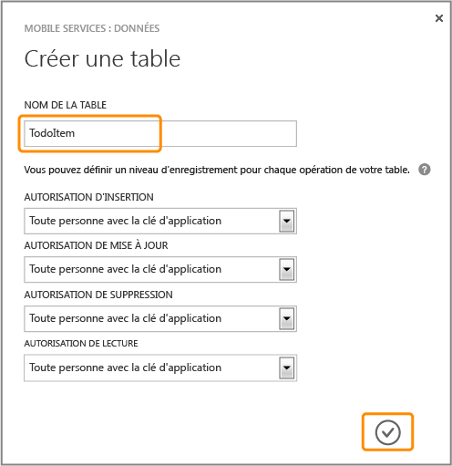
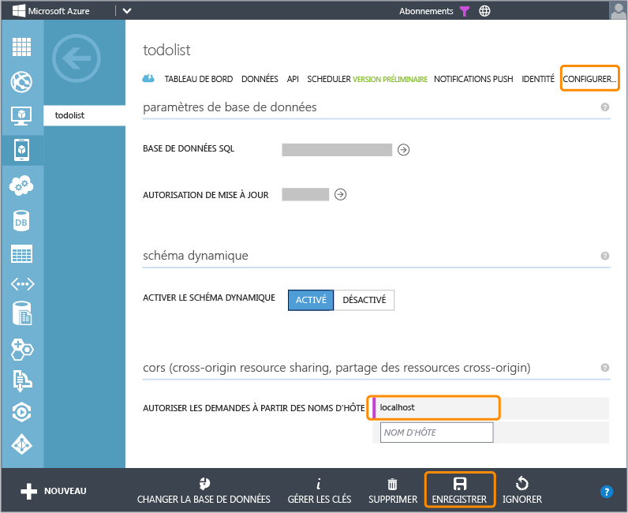

<properties linkid="develop-mobile-tutorials-get-started-with-data-html" urlDisplayName="Get Started with Data (HTML5)" pageTitle="Get started with data (HTML 5) | Mobile Dev Center" metaKeywords="" description="Learn how to get started using Mobile Services to leverage data in your HTML app." metaCanonical="" services="" documentationCenter="Mobile" title="Get started with data in Mobile Services" authors="glenga" solutions="" manager="" editor="" />

Prise en main des données dans Mobile Services
==============================================

[Windows Store C\#](/en-us/develop/mobile/tutorials/get-started-with-data-dotnet "Windows Store C#")[Windows Store JavaScript](/en-us/develop/mobile/tutorials/get-started-with-data-js "Windows Store JavaScript")[Windows Phone](/en-us/develop/mobile/tutorials/get-started-with-data-wp8 "Windows Phone")[iOS](/en-us/develop/mobile/tutorials/get-started-with-data-ios "iOS")[Android](/en-us/develop/mobile/tutorials/get-started-with-data-android "Android")[HTML](/en-us/develop/mobile/tutorials/get-started-with-data-html "HTML")[Xamarin.iOS](/en-us/develop/mobile/tutorials/get-started-with-data-xamarin-ios "Xamarin.iOS")[Xamarin.Android](/en-us/develop/mobile/tutorials/get-started-with-data-xamarin-android "Xamarin.Android")

Cette rubrique montre comment utiliser Azure Mobile Services pour tirer parti des données dans une application HTML. Dans ce didacticiel, vous allez télécharger une application qui stocke les données en mémoire, créer un service mobile, intégrer le service mobile à l'application, puis vous connecter au portail de gestion Azure pour afficher les modifications apportées aux données lors de l'exécution de l'application.

**Remarque**

Ce didacticiel vise à mieux vous faire comprendre en quoi Mobile Services vous permet de stocker et de récupérer des données à partir d'une application HTML à l'aide d'Azure. À cet effet, il vous guide tout au long des nombreuses étapes exécutées automatiquement dans le démarrage rapide Mobile Services. Si vous n'avez aucune expérience de Mobile Services, nous vous invitons à suivre d'abord le didacticiel [Prise en main de Mobile Services](/en-us/develop/mobile/tutorials/get-started-html).

Ce didacticiel vous familiarise avec ces étapes de base :

1.  [Téléchargement du projet d'application HTML](#download-app)
2.  [Création du service mobile](#create-service)
3.  [Ajout d'une table de données pour le stockage](#add-table)
4.  [Mise à jour de l'application pour utiliser Mobile Services](#update-app)
5.  [Test de l'application avec Mobile Services](#test-app)

**Remarque**

Pour effectuer ce didacticiel, vous avez besoin d'un compte Azure. Si vous ne possédez pas de compte, vous pouvez créer un compte d'évaluation gratuit en quelques minutes. Pour plus d'informations, consultez la page [Version d'évaluation gratuite d'Azure](http://www.windowsazure.com/en-us/pricing/free-trial/?WT.mc_id=A756A2826&returnurl=http%3A%2F%2Fwww.windowsazure.com%2Fen-us%2Fdevelop%2Fmobile%2Ftutorials%2Fget-started-with-data-html%2F).

### Conditions supplémentaires

Vous pouvez héberger l'application GetStartedWithData sur n'importe quel serveur Web. Cependant, des scripts sont fournis afin de vous permettre d'exécuter l'application sur `http://localhost:8000`.

-   Pour utiliser localhost, l'un des serveurs Web suivants doit être exécuté sur votre ordinateur local pour pouvoir suivre ce didacticiel :

    -   **Sur Windows** : IIS Express. IIS Express est installé par [Microsoft Web Platform Installer].
    -   **Sur Mac OS X** : Python, qui doit déjà être installé.
    -   **Sur Linux** : Python. Vous devez installer [la dernière version de Python].

    Vous pouvez utiliser n'importe quel serveur Web pour héberger l'application, mais les serveurs précédents sont les seuls pris en charge par les scripts téléchargés.

-   Un navigateur Web qui prend en charge le HTML5

Téléchargement du projetTéléchargement du projet GetStartedWithData
-------------------------------------------------------------------

Ce didacticiel est basé sur l'application [GetStartedWithData](http://go.microsoft.com/fwlink/?LinkID=286345), qui est une application HTML5. L'interface utilisateur de cette application est identique à l'application générée par le démarrage rapide de Mobile Services, sauf que les éléments ajoutés sont stockés en local dans la mémoire.

1.  [Téléchargement des fichiers du projet d'application HTML](http://go.microsoft.com/fwlink/?LinkID=286345).

2.  Dans un éditeur HTML, ouvrez le projet téléchargé et étudiez le fichier app.js.

	Les éléments ajoutés sont stockés dans un objet **Array** en mémoire (**staticItems**). Actualisez la page pour afficher les données. Elles ne persistent pas.

3.  Lancez un des fichiers de commande depuis le sous-dossier **server**.

    -   **launch-windows** (pour les ordinateurs Windows)
    -   **launch-mac.command** (pour les ordinateurs Mac OS X)
    -   **launch-linux.sh** (pour les ordinateurs Linux)

    **Remarque**

    Sur un ordinateur Windows, appuyez sur la touche « R » lorsque PowerShell vous demande de confirmer l'exécution du script. Vous pouvez recevoir un avertissement de votre navigateur Web vous recommandant de ne pas exécuter le script, car il a été téléchargé depuis Internet. Lorsque cela se produit, vous devez demander au navigateur de continuer à charger le script.

    Un serveur Web démarre sur votre ordinateur local pour héberger la nouvelle application.

4.  Ouvrez l'URL <http://localhost:8000/> dans un navigateur Web pour démarrer l'application.

5.  Dans l'application, tapez un texte explicite, comme *Suivre le didacticiel*, dans **Entrer une nouvelle tâche**, puis cliquez sur **Ajouter**.

	![][0]  

 	Le texte enregistré est ajouté au tableau **staticItems** et la page est mise à jour pour afficher le nouvel élément.

Création d'un service mobileCréation d'un nouveau service mobile dans le portail de gestion
-------------------------------------------------------------------------------------------

[WACOM.INCLUDE [mobile-services-create-new-service-data](../includes/mobile-services-create-new-service-data.md)]

Ajout d'une nouvelle tableAjout d'une nouvelle table au service mobile
----------------------------------------------------------------------

Pour pouvoir stocker des données d’application dans le nouveau service mobile, vous devez d’abord créer une table dans l’instance de base de données SQL associée.

1.  Dans le portail de gestion, cliquez sur **Mobile Services**, puis sur le service mobile que vous venez de créer.

2.  Cliquez sur l'onglet **Data**, puis sur **+Create**.

	![][5]

	La boîte de dialogue **Create new table** s'affiche.

3.  Dans **Table name**, saisissez *TodoItem*, puis cliquez sur le bouton de vérification.

	 

	Une nouvelle table de stockage **TodoItem** est créée avec les autorisations par défaut. Cela signifie que quiconque possédant la clé de l'application, qui est distribuée avec l'application, peut accéder aux données de la table et les modifier.

	**Remarque** 

	Le même nom de table est utilisé dans le démarrage rapide de Mobile Services. Toutefois, chaque table est créée dans un schéma spécifique pour un service mobile donné. Ceci vise à éviter les collisions de données lorsque plusieurs services mobiles utilisent la même base de données.

4.  Cliquez sur la nouvelle table **TodoItem** et vérifiez qu'aucune ligne de données n'est présente.

5.  Cliquez sur l'onglet **Colonnes**. Vérifiez si les colonnes par défaut suivantes ont été automatiquement créées pour vous :

    <table data-morhtml="true" border="1" cellpadding="10">
 	<tr data-morhtml="true">
 	<th data-morhtml="true">Nom de la colonne</th>
 	<th data-morhtml="true">Type</th>
 	<th data-morhtml="true">Index</th>
 	</tr>
 	<tr data-morhtml="true">
 	<td data-morhtml="true">id</td>
 	<td data-morhtml="true">string</td>
 	<td data-morhtml="true">Index&eacute;</td>
 	</tr>
 	<tr data-morhtml="true">
 	<td data-morhtml="true">__createdAt</td>
 	<td data-morhtml="true">date</td>
 	<td data-morhtml="true">Index&eacute;</td>
 	</tr>
 	<tr data-morhtml="true">
 	<td data-morhtml="true">__updatedAt</td>
 	<td data-morhtml="true">date</td>
 	<td data-morhtml="true">-</td>
 	</tr>
 	<tr data-morhtml="true">
 	<td data-morhtml="true">__version</td>
 	<td data-morhtml="true">timestamp (MSSQL)</td>
 	<td data-morhtml="true">-</td>
 	</tr> 	
 	</table>

	Cela correspond à la configuration minimale requise pour une table dans Mobile Services.

    **Remarque**

    Lorsque le schéma dynamique est activé sur votre service mobile, de nouvelles colonnes sont créées automatiquement lorsque des objets JSON sont envoyés au service mobile par une opération d'insertion ou de mise à jour.

6.  Sous l'onglet **Configurer** vérifiez que `localhost` figure déjà dans la liste **Autoriser les demandes à partir des noms d'hôte** sous **Partage des ressources cross-origin (CORS)**. Si cela n'est pas le cas, entrez `localhost` dans le champ **Nom d'hôte**, puis cliquez sur **Enregistrer**.

	

    **Remarque**

	Si vous déployez l'application de démarrage rapide sur un autre serveur que localhost, vous devez ajouter le nom d'hôte du serveur Web à la liste <strong>Autoriser les demandes à partir des noms d'hôte</strong>. Pour plus d'informations, consultez l'article <a href="http://msdn.microsoft.com/en-us/library/windowsazure/dn155871.aspx" target="_blank">Partage des ressources cross-origin (CORS)</a>.

Vous pouvez maintenant utiliser le nouveau service mobile en tant que stockage des données pour l'application.

Mise à jour de l'applicationMise à jour de l'application afin d'utiliser le service mobile pour l'accès aux données
-------------------------------------------------------------------------------------------------------------------

Votre service mobile étant prêt, vous pouvez mettre à jour l'application pour stocker les éléments dans Mobile Services et non dans la collection locale.

1.  Dans le portail de gestion, cliquez sur **Mobile Services**, puis sur le service mobile que vous venez de créer.

2.  Cliquez sur l'onglet **Tableau de bord** et notez la valeur **URL du site**, puis cliquez sur **Manage keys** et notez la valeur de **Clé de l'application**.

	![][8]

	Ces valeurs sont nécessaires pour accéder au service mobile à partir de votre code d'application.

3.  Dans un éditeur Web, ouvrez le fichier projet index.html et ajoutez ce qui suit aux références de script de la page :

		

4.  Dans l'éditeur, ouvrez le fichier JavaScript, supprimez les marques de commentaire du code suivant qui définit la variable **MobileServiceClient** et fournissez l'URL et la clé d'application du service mobile dans le constructeur **MobileServiceClient**, dans cet ordre :

         var MobileServiceClient = WindowsAzure.MobileServiceClient,
             client = new MobileServiceClient('AppUrl', 'AppKey'),              

	Cela crée une instance de MobileServiceClient utilisée pour accéder au service mobile.

5.  Supprimez les marques de commentaire sur les lignes de code suivantes :

         var itemCount = 0;
         var staticItems = [];

	Les données seront stockées dans le service mobile et non dans le tableau en mémoire.

6.  Supprimez les marques de commentaire sur la ligne de code suivante :

         todoItemTable = client.getTable('todoitem');

	Ce code crée un objet proxy (**todoItemTable**) pour la base de données SQL **TodoItem**. 

7.  Remplacez le gestionnaire d'événements **\$('\#add-item').submit** par le code suivant :

         $('#add-item').submit(function(evt) {
             var textbox = $('#new-item-text'),
                 itemText = textbox.val();
             if (itemText !== '') {
                 todoItemTable.insert({ text: itemText, complete: false })
                     .then(refreshTodoItems);
             }
             textbox.val('').focus();
             evt.preventDefault();
         });

	Ce code permet d'insérer un nouvel élément dans la table.

8.  Remplacez la méthode **refreshTodoItems** par le code suivant :

         function refreshTodoItems() {

             var query = todoItemTable;

             query.read().then(function(todoItems) {
                 listItems = $.map(todoItems, function(item) {
                     return $('<li>')
                         .attr('data-todoitem-id', item.id)
                         .append($('<button class="item-delete">Delete</button>'))
                         .append($('<input type="checkbox" class="item-complete">').prop('checked', item.complete))
                         .append($('
').append($('<input class="item-text">').val(item.text)));
                 });
                           
                 $('#todo-items').empty().append(listItems).toggle(listItems.length > 0);
                 $('#summary').html('<strong>' + todoItems.length + '</strong> item(s)');
             });
         }

    Ce code envoie une requête au service mobile, qui renvoie tous les éléments. Le résultat est retraité et les données s'affichent sur la page.

9.  Remplacez les gestionnaires d'événement **\$(document.body).on('change', '.item-text')** et **\$(document.body).on('change', '.item-complete')** par le code suivant :

         $(document.body).on('change', '.item-text', function() {
             var newText = $(this).val();
             todoItemTable.update({ id: getTodoItemId(this), text: newText });
         });

         $(document.body).on('change', '.item-complete', function() {
             var isComplete = $(this).prop('checked');
             todoItemTable.update({ id: getTodoItemId(this), complete: isComplete })
                 .then(refreshTodoItems);
         });
         
        Ce code envoie une mise à jour de l'élément au service mobile lorsque du texte est modifié ou lorsque la case à cocher est activée.

10.  Remplacez le gestionnaire d'événements **\$(document.body).on('click', '.item-delete')** par le code suivant :

        $(document.body).on('click', '.item-delete', function () {
            todoItemTable.del({ id: getTodoItemId(this) }).then(refreshTodoItems);
        });

    Ce code envoie une demande de suppression au service mobile lorsque l'utilisateur clique sur le bouton **Delete**.

Maintenant que l'application a été mise à jour pour utiliser Mobile Services pour le stockage principal, le moment est venu de tester l'application avec Mobile Services.

Test de l'applicationTest de l'application avec votre nouveau service mobile
----------------------------------------------------------------------------

1.  Rechargez l'URL <http://localhost:8000/> dans un navigateur Web pour démarrer l'application.

    **Remarque**

    Si vous devez redémarrer le serveur Web, répétez les étapes de la première section.

2.  Comme précédemment, tapez du texte dans **Entrer une nouvelle tâche**, puis cliquez sur **Ajouter**.

	Cela permet d'envoyer un nouvel élément en tant qu'insertion au service mobile.

3.  Dans le [portail de gestion](https://manage.windowsazure.com/), cliquez sur **Mobile Services**, puis sur le service mobile.

4.  Cliquez sur l'onglet **Data**, puis sur **Browse**.

	![][9]
          
	La table **TodoItem** contient à présent des données, dont les valeurs d'ID ont été générées par Mobile Services, et les colonnes ont été automatiquement ajoutées à la table de manière à correspondre à la classe TodoItem au sein de l'application.

5.  Dans l'application, cochez un des éléments dans la liste, puis revenez à l'onglet Parcourir dans le portail et cliquez sur **Actualiser**.

	Notez que la valeur terminée est passée de **false** à **true**.

6.  Dans le fichier projet app.js, recherchez la méthode **RefreshTodoItems** et remplacez la ligne de code qui définit `query` par ce qui suit :

         var query = todoItemTable.where({ complete: false });

7.  Rechargez la page, vérifiez un des autres éléments de la liste.

	Notez que l'élément coché n'est plus affiché dans la liste. Chaque mise à jour provoque un aller-retour vers le serveur mobile, qui renvoie les données filtrées.

Cela conclut le didacticiel **Prise en main des données**.

Étapes suivantes
----------------

Ce didacticiel a présenté les bases de l'activation d'une application HTML pour utiliser les données dans Mobile Services. Ensuite, pensez à suivre l'un des didacticiels suivants basés sur l'application GetStartedWithData que vous avez créée dans ce didacticiel :

-   [Validation et modification des données avec des scripts](/en-us/develop/mobile/tutorials/validate-modify-and-augment-data-html)
    En savoir plus sur l'utilisation des scripts serveur dans Mobile Services pour valider et modifier les données envoyées à partir de votre application.

-   [Affinage des requêtes à la pagination](/en-us/develop/mobile/tutorials/add-paging-to-data-html)
    En savoir plus sur l'utilisation de la pagination dans les requêtes pour contrôler la quantité de données traitées dans une seule requête.

Une fois que vous avez terminé la série de données, découvrez comment authentifier les utilisateurs de votre application en suivant le didacticiel [Prise en main de l'authentification](/en-us/develop/mobile/tutorials/get-started-with-users-html).

<!-- Anchors. -->
[Download the HTML app project]: #download-app
[Create the mobile service]: #create-service
[Add a data table for storage]: #add-table
[Update the app to use Mobile Services]: #update-app
[Test the app against Mobile Services]: #test-app
[Next Steps]:#next-steps

<!-- Images. -->
[0]: ./media/mobile-services-html-get-started-data/mobile-quickstart-startup-html.png

[5]: ./media/mobile-services-html-get-started-data/mobile-data-tab-empty.png
[6]: ./media/mobile-services-html-get-started-data/mobile-create-todoitem-table.png

[8]: ./media/mobile-services-html-get-started-data/mobile-dashboard-tab.png
[9]: ./media/mobile-services-html-get-started-data/mobile-todoitem-data-browse.png

[11]: ./media/mobile-services-html-get-started-data/mobile-services-set-cors-localhost.png

<!-- URLs. -->
[Validate and modify data with scripts]: /en-us/develop/mobile/tutorials/validate-modify-and-augment-data-html
[Refine queries with paging]: /en-us/develop/mobile/tutorials/add-paging-to-data-html
[Get started with Mobile Services]: /en-us/develop/mobile/tutorials/get-started
[Get started with authentication]: /en-us/develop/mobile/tutorials/get-started-with-users-html

[Azure Management Portal]: https://manage.windowsazure.com/
[Management Portal]: https://manage.windowsazure.com/
[GetStartedWithData app]:  http://go.microsoft.com/fwlink/?LinkID=286345

[Mobile Services HTML/JavaScript How-to Conceptual Reference]: /en-us/develop/mobile/how-to-guides/work-with-html-js-client

[Cross-origin resource sharing]: http://msdn.microsoft.com/en-us/library/windowsazure/dn155871.aspx
