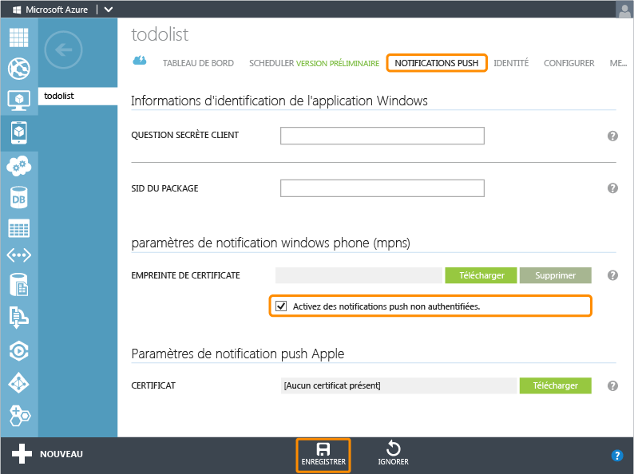

<properties pageTitle="Get started with push notifications (Windows Store) | Mobile Dev Center" metaKeywords="" description="Learn how to use Azure Mobile Services and Notification Hubs to send push notifications to your Windows Store app." metaCanonical="" services="mobile" documentationCenter="Mobile" title="Get started with push notifications in Mobile Services" authors="glenga" solutions="" manager="" editor="" />

Prise en main des notifications Push dans Mobile Services
=========================================================

[Windows Store C\#](/fr-fr/documentation/articles/mobile-services-javascript-backend-windows-store-dotnet-get-started-push "Windows Store C#")[Windows Store JavaScript](/fr-fr/documentation/articles/mobile-services-javascript-backend-windows-store-javascript-get-started-push "Windows Store JavaScript")[Windows Phone](/fr-fr/documentation/articles/mobile-services-javascript-backend-windows-phone-get-started-push "Windows Phone")[iOS](/fr-fr/documentation/articles/mobile-services-ios-get-started-push "iOS")[Android](/fr-fr/documentation/articles/mobile-services-javascript-backend-android-get-started-push "Android")
[.NET backend](/fr-fr/documentation/articles/mobile-services-dotnet-backend-windows-phone-get-started-push/ ".NET backend") | [JavaScript backend](/fr-fr/documentation/articles/mobile-services-javascript-backend-windows-phone-get-started-push/ "JavaScript backend")

Cette rubrique montre comment utiliser Azure Mobile Services pour envoyer des notifications Push à une application Windows Store. Dans ce didacticiel, vous allez activer des notifications Push dans le projet de démarrage rapide à l'aide des concentrateurs de notification Azure. Une fois la procédure terminée, votre service mobile envoie une notification Push à l'aide des concentrateurs de notification chaque fois qu'un enregistrement est inséré. Le concentrateur de notification que vous créez est fourni gratuitement avec votre service mobile, peut être géré indépendamment du service mobile et peut être utilisé par d'autres applications et services.

> [WACOM.NOTE] Ce didacticiel présente l'intégration de Mobile Services à Notification Hubs, qui en est actuellement au stade préliminaire. Par défaut, l'envoi de notifications Push à l'aide de Notification Hubs n'est pas activé depuis un service principal JavaScript. Une fois le nouveau concentrateur de notification créé, le processus d'intégration est irréversible. Pour le moment, les notifications Push pour iOS et Android sont uniquement disponibles via la prise en charge Push par défaut décrite dans [cette version de la rubrique](/fr-fr/documentation/articles/mobile-services-windows-phone-get-started-push/).

Ce didacticiel vous familiarise avec les étapes de base permettant d'activer les notifications Push :

1.  [Mise à jour de l'application pour l'inscription aux notifications](#update-app)
2.  [Mise à jour des scripts serveur pour l'envoi de notifications Push](#update-scripts)
3.  [Insertion de données pour recevoir des notifications Push](#test)

Ce didacticiel est basé sur le démarrage rapide de Mobile Services. Avant de le lancer, suivez d'abord le didacticiel [Prise en main de Mobile Services](/fr-fr/documentation/articles/mobile-services-windows-phone-get-started) ou [Prise en main des données](/fr-fr/documentation/articles/mobile-services-windows-phone-get-started-data) pour connecter votre projet au service mobile. Lorsqu'un service mobile n'est pas connecté, l'Assistant Ajouter une notification Push crée cette connexion pour vous.

Mise à jour de l'application pour l'inscription aux notifications
-----------------------------------------------------------------

Pour permettre à votre application de recevoir les notifications Push, vous devez inscrire un canal de notification.

1.  Dans Visual Studio, ouvrez le fichier App.xaml.cs et ajoutez l'instruction `using` suivante :

        using Microsoft.Phone.Notification;

2.  Ajoutez le code suivant à App.xaml.cs :

         public static HttpNotificationChannel CurrentChannel { get; private set; }

         private void AcquirePushChannel()
         {
             CurrentChannel = HttpNotificationChannel.Find("MyPushChannel");

             if (CurrentChannel == null)
             {
                 CurrentChannel = new HttpNotificationChannel("MyPushChannel");
                 CurrentChannel.Open();
                 CurrentChannel.BindToShellToast();
             }

             CurrentChannel.ChannelUriUpdated +=
                 new EventHandler<NotificationChannelUriEventArgs>(async (o, args) =>
                 {

                     // Enregistrez-vous pour les  notifications à l'aide du nouveau canal.
                     await MobileService.GetPush()
                         .RegisterNativeAsync(CurrentChannel.ChannelUri.ToString());
                 });
         }

    Ce code récupère l'URI de canal ChannelURI pour l'application depuis WNS et l'inscrit aux notifications Push.

    > [WACOM.NOTE] Dans ce didacticiel, le service mobile envoie une notification toast à l'appareil. Lorsque vous envoyez une notification par vignette, vous devez appeler la méthode **BindToShellTile** sur le canal.

3.  En haut du gestionnaire d'événements **Application\_Launching**, dans App.xaml.cs, ajoutez l'appel suivant à la nouvelle méthode **AcquirePushChannel** :

        AcquirePushChannel();

    Cela permet de s'assurer que l'inscription est demandée à chaque chargement de la page. Dans votre application, vous souhaitez effectuer cette inscription régulièrement pour vous assurer de son exactitude.

4.  Appuyez sur la touche **F5** pour exécuter l'application. Une boîte de dialogue s'affiche avec la clé d'inscription.

5.  Dans l'Explorateur de solutions, développez **Propriétés**, ouvrez le fichier WMAppManifest.xml, cliquez sur l'onglet **Fonctionnalités** et veillez à ce que la fonctionnalité **ID__CAP__PUSH_NOTIFICATION** soit activée.

	

	Cela permet de s'assurer que votre application peut déclencher des notifications toast.

Mise à jour des scripts serveur pour l'envoi de notifications Push
------------------------------------------------------------------

Enfin, vous devez mettre à jour le script inscrit dans l'opération d'insertion sur la table TodoItem pour envoyer les notifications.

1.  Cliquez sur **TodoItem**, puis sur **Script** et sélectionnez **Insert**.

	![][10]

2.  Remplacez la fonction insert par le code suivant, puis cliquez sur **Enregistrer** :

         function insert(item, user, request) {
         // Définissez une charge utile pour la notification toast Windows Phone.
         var payload = '<
        xml version="1.0" encoding="utf-8"
        >' +
             '<wp:Notification xmlns:wp="WPNotification"><wp:Toast>' +
             '<wp:Text1>New Item</wp:Text1><wp:Text2>' + item.text + 
             '</wp:Text2></wp:Toast></wp:Notification>';
            
         request.execute({
             success: function() {
                 // Si l'insertion aboutit, envoyez une notification.
                push.mpns.send(null, payload, 'toast', 22, {
                     success: function(pushResponse) {
                         console.log("Sent push:", pushResponse);
                         request.respond();
                         },              
                         error: function (pushResponse) {
                             console.log("Error Sending push:", pushResponse);
                             request.respond(500, { error: pushResponse });
                             }
                         });
                     }
                 });      
         }

    À l'issue de l'insertion, ce script d'insertion envoie une notification Push (avec le texte de l'élément inséré) à toutes les inscriptions d'applications Windows Phone.

3.  Cliquez sur l'onglet **Push**, cochez **Activez des notifications push non authentifiées**, puis cliquez sur **Enregistrer**.

    

    Le service mobile peut ainsi se connecter à MPNS en mode non authentifié pour envoyer les notifications Push.

    > [WACOM.NOTE] Ce didacticiel utilise MPNS en mode non authentifié. Dans ce mode, MPNS limite le nombre de notifications à envoyer à un canal d'appareil. Pour supprimer cette restriction, vous devez générer et télécharger un certificat en cliquant sur **Télécharger** et en sélectionnant le certificat. Pour plus d'informations sur la génération du certificat, consultez la rubrique [Configuration d'un service Web authentifié afin d'envoyer des notifications Push pour Windows Phone](http://msdn.microsoft.com/fr-fr/library/windowsphone/develop/ff941099(v=vs.105).aspx).

Test des notifications Push dans votre application
--------------------------------------------------

1.  Dans Visual Studio, appuyez sur la touche F5 pour exécuter l'application.

2.  Dans l'application, entrez le texte « hello push » dans la zone de texte, puis cliquez sur **Enregistrer**.

	![][4]

	Cela envoie une requête insert au service mobile pour stocker l'élément ajouté. Notez que l'application reçoit une notification toast qui indique **hello push**.

Étapes suivantes
----------------

Ce didacticiel a présenté les bases de l'activation d'une application Windows Store pour utiliser les données dans Mobile Services. Ensuite, pensez à suivre l'un des didacticiels suivants basés sur l'application GetStartedWithData que vous avez créée dans ce didacticiel :

-   [Prise en main de Notification Hubs](/en-us/manage/services/notification-hubs/getting-started-windows-dotnet/)
     En savoir plus sur l'utilisation de Notification Hubs dans votre application Windows Store.

-   [Envoi de notifications aux abonnés](/en-us/manage/services/notification-hubs/breaking-news-dotnet/)
     En savoir plus sur l'inscription des utilisateurs et la réception des notifications Push pour les catégories qui les intéressent.

-   [Envoi de notifications aux utilisateurs](/en-us/manage/services/notification-hubs/notify-users/)
     En savoir plus sur l'envoi de notifications Push depuis un service mobile à certains utilisateurs sur n'importe quel appareil.

-   [Envoi de notifications interplateforme aux utilisateurs](/en-us/manage/services/notification-hubs/notify-users-xplat-mobile-services/)
     En savoir plus sur l'utilisation de modèles pour envoyer des notifications Push depuis un service mobile, sans avoir à gérer des charges utiles propres à la plateforme sur votre serveur principal.

Pour plus d'informations sur les rubriques Mobile Services suivantes :

-   [Prise en main des données](/fr-fr/documentation/articles/mobile-services-windows-phone-get-started-data)
     En savoir plus sur le stockage et l'interrogation des données à l'aide de Mobile Services.

-   [Prise en main de l'authentification](/fr-fr/documentation/articles/mobile-services-windows-phone-get-started-users)
     En savoir plus sur l'authentification des utilisateurs de votre application avec un compte Windows.

-   [Référence de script serveur Mobile Services](http://go.microsoft.com/fwlink/?LinkId=262293)
     En savoir plus sur l'enregistrement et l'utilisation des scripts serveur.

-   [Guide de fonctionnement Mobile Services .NET](/fr-fr/documentation/articles/mobile-services-windows-dotnet-how-to-use-client-library)
     En savoir plus sur l'utilisation de Mobile Services avec .NET.

<!-- Anchors. -->

<!-- Images. -->
[1]: ./media/mobile-services-javascript-backend-windows-phone-get-started-push/mobile-app-enable-push-wp8.png
[2]: ./media/mobile-services-javascript-backend-windows-phone-get-started-push/mobile-quickstart-push1-wp8.png
[3]: ./media/mobile-services-javascript-backend-windows-phone-get-started-push/mobile-quickstart-push2-wp8.png
[4]: ./media/mobile-services-javascript-backend-windows-phone-get-started-push/mobile-quickstart-push3-wp8.png
[5]: ./media/mobile-services-javascript-backend-windows-phone-get-started-push/mobile-quickstart-push4-wp8.png
[10]: ./media/mobile-services-javascript-backend-windows-phone-get-started-push/mobile-insert-script-push2.png
[11]: ./media/mobile-services-javascript-backend-windows-phone-get-started-push/mobile-push-tab.png

<!-- URLs. -->
[Submit an app page]: http://go.microsoft.com/fwlink/p/?LinkID=266582
[My Applications]: http://go.microsoft.com/fwlink/p/?LinkId=262039
[Live SDK for Windows]: http://go.microsoft.com/fwlink/p/?LinkId=262253
[Get started with Mobile Services]: /fr-fr/documentation/articles/mobile-services-windows-phone-get-started
[Get started with data]: /fr-fr/documentation/articles/mobile-services-windows-phone-get-started-data
[Get started with authentication]: /fr-fr/documentation/articles/mobile-services-windows-phone-get-started-users
[Get started with push notifications]: /fr-fr/documentation/articles/mobile-services-windows-phone-get-started-push

[Get started with Notification Hubs]: /en-us/manage/services/notification-hubs/getting-started-windows-dotnet/
[What are Notification Hubs?]: /en-us/develop/net/how-to-guides/service-bus-notification-hubs/
[Send notifications to subscribers]: /en-us/manage/services/notification-hubs/breaking-news-dotnet/
[Send notifications to users]: /en-us/manage/services/notification-hubs/notify-users/
[Send cross-platform notifications to users]: /en-us/manage/services/notification-hubs/notify-users-xplat-mobile-services/
[Mobile Services server script reference]: http://go.microsoft.com/fwlink/?LinkId=262293
[Mobile Services .NET How-to Conceptual Reference]: /fr-fr/documentation/articles/mobile-services-windows-dotnet-how-to-use-client-library
[Setting up an authenticated web service to send push notifications for Windows Phone]: http://msdn.microsoft.com/fr-fr/library/windowsphone/develop/ff941099(v=vs.105).aspx
