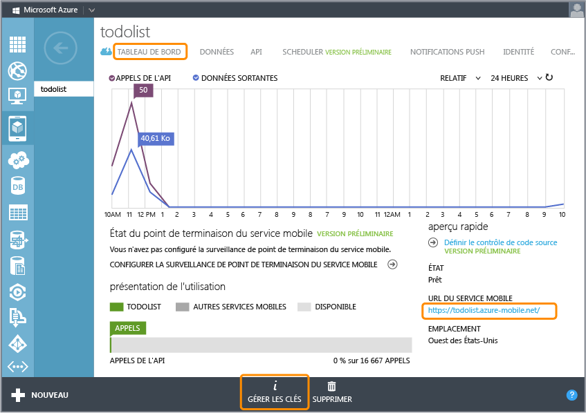

<properties linkid="develop-mobile-tutorials-get-started-with-data-wp8" urlDisplayName="Get Started with Data" pageTitle="Get started with data (WP8) - Azure Mobile Services" metaKeywords="" description="Learn how to get started using data from your Azure Mobile Services Windows Phone 8 app." metaCanonical="" services="" documentationCenter="Mobile" title="Get started with data in Mobile Services" authors="glenga" solutions="" manager="" editor="" />

Prise en main des données dans Mobile Services
==============================================

[Windows Store C\#](/en-us/develop/mobile/tutorials/get-started-with-data-dotnet "Windows Store C#")[Windows Store JavaScript](/en-us/develop/mobile/tutorials/get-started-with-data-js "Windows Store JavaScript")[Windows Phone](/en-us/develop/mobile/tutorials/get-started-with-data-wp8 "Windows Phone")[iOS](/en-us/develop/mobile/tutorials/get-started-with-data-ios "iOS")[Android](/en-us/develop/mobile/tutorials/get-started-with-data-android "Android")[HTML](/en-us/develop/mobile/tutorials/get-started-with-data-html "HTML")[Xamarin.iOS](/en-us/develop/mobile/tutorials/get-started-with-data-xamarin-ios "Xamarin.iOS")[Xamarin.Android](/en-us/develop/mobile/tutorials/get-started-with-data-xamarin-android "Xamarin.Android")[.NET backend](/en-us/documentation/articles/mobile-services-dotnet-backend-windows-phone-get-started-data/ ".NET backend") | [JavaScript backend](/en-us/documentation/articles/mobile-services-windows-phone-get-started-data/ "JavaScript backend")

Cette rubrique montre comment utiliser Azure Mobile Services pour exploiter des données dans une application Windows Phone 8. Dans ce didacticiel, vous allez télécharger une application qui stocke les données en mémoire, créer un service mobile, intégrer le service mobile à l'application, puis vous connecter au portail de gestion Azure pour afficher les modifications apportées aux données lors de l'exécution de l'application.

[regarder le didacticiel](http://go.microsoft.com/fwlink/?LinkID=298628) [Lire la vidéo](http://go.microsoft.com/fwlink/?LinkID=298628) 12:54:00

**Remarque**

Ce didacticiel vise à mieux vous faire comprendre en quoi Mobile Services vous permet de stocker et de récupérer des données dans une application Windows Phone 8 à l'aide d'Azure. À cet effet, elle vous guide tout au long des nombreuses étapes exécutées automatiquement dans le démarrage rapide Mobile Services. Si vous n'avez aucune expérience de Mobile Services, nous vous invitons à suivre d'abord le didacticiel [Prise en main de Mobile Services](/en-us/develop/mobile/tutorials/get-started-wp8).

Ce didacticiel vous familiarise avec ces étapes de base :

1.  [Téléchargement du projet d'application Windows Phone 8](#download-app)
2.  [Création du service mobile](#create-service)
3.  [Ajout d'une table de données pour le stockage](#add-table)
4.  [Mise à jour de l'application pour utiliser Mobile Services](#update-app)
5.  [Test de l'application avec Mobile Services](#test-app)

Ce didacticiel requiert l'utilisation du [Kit de développement logiciel (SDK) Windows Phone 8](http://go.microsoft.com/fwlink/p/?LinkID=268374) sur Windows 8.

**Remarque**

Pour suivre ce didacticiel, vous devez disposer d'un compte Azure sur lequel la fonctionnalité Azure Mobile Services est activée.

-   Si vous ne possédez pas de compte, vous pouvez créer un compte d'évaluation gratuit en quelques minutes. Pour plus d'informations, consultez la page [Version d'évaluation gratuite d'Azure](http://www.windowsazure.com/en-us/pricing/free-trial/?WT.mc_id=A756A2826&returnurl=http%3A%2F%2Fwww.windowsazure.com%2Fen-us%2Fdevelop%2Fmobile%2Ftutorials%2Fget-started-with-data-wp8%2F).

Téléchargement du projetTéléchargement du projet GetStartedWithData
-------------------------------------------------------------------

Ce didacticiel est basé sur [GetStartedWithData](http://go.microsoft.com/fwlink/p/?LinkId=271146), qui est une application Windows Phone 8. L'interface utilisateur de cette application est identique à l'application générée par le démarrage rapide de Mobile Services, sauf que les éléments ajoutés sont stockés en local dans la mémoire.

1.  Téléchargez l'exemple d'application GetStartedWithData sur le [site d'exemples de code développeur](http://go.microsoft.com/fwlink/p/?LinkId=271146).

2.  Dans Visual Studio 2012 Express pour Windows Phone 8, ouvrez le projet téléchargé et examinez le fichier MainPage.xaml.cs.

   Notez que les objets **TodoItem** ajoutés sont stockés dans un **ObservableCollection<TodoItem>** en mémoire.

3.  Appuyez sur la touche **F5** pour régénérer le projet et démarrer l'application.

4.  Dans l'application, tapez du texte dans la zone de texte, puis cliquez sur le bouton **Enregistrer**.

     

    Le texte enregistré est affiché dans la liste ci-dessous.

Création d'un service mobileCréation d'un service mobile dans le portail de gestion
-----------------------------------------------------------------------------------

[WACOM.INCLUDE [mobile-services-create-new-service-data](../includes/mobile-services-create-new-service-data.md)]

Ajout d'une nouvelle tableAjout d'une nouvelle table au service mobile
----------------------------------------------------------------------

[WACOM.INCLUDE [mobile-services-create-new-service-data-2](../includes/mobile-services-create-new-service-data-2.md)]

Mise à jour de l'applicationMise à jour de l'application afin d'utiliser le service mobile pour l'accès aux données
-------------------------------------------------------------------------------------------------------------------

Votre service mobile étant prêt, vous pouvez mettre à jour l'application pour stocker les éléments dans Mobile Services et non dans la collection locale.

1.  Dans l'**Explorateur de solutions** de Visual Studio, cliquez avec le bouton droit sur le nom du projet, puis sélectionnez **Manage NuGet Packages**.

2.  Dans le volet gauche, sélectionnez la catégorie **Online**, recherchez `WindowsAzure.MobileServices`, cliquez sur **Install** au niveau du package **Azure Mobile Services**, puis acceptez le contrat de licence.

     
    
    La bibliothèque cliente Mobile Services est ajoutée au projet.

1.  Dans le portail de gestion, cliquez sur **Mobile Services**, puis sur le service mobile que vous venez de créer.

2.  Cliquez sur l'onglet **Tableau de bord** et notez la valeur **URL du site**, puis cliquez sur **Manage keys** et notez la valeur de **Clé de l'application**.

   

    Ces valeurs sont nécessaires pour accéder au service mobile à partir de votre code d'application.

1.  Dans Visual Studio, ouvrez le fichier App.xaml.cs et ajoutez l'instruction `using` suivante ou annulez ses marques de commentaire :

         using Microsoft.WindowsAzure.MobileServices;

2.  Dans le même fichier, annulez les marques de commentaire dans le code qui définit la variable **MobileService**, puis indiquez l'URL et la clé d'application du service mobile dans le constructeur **MobileServiceClient**, dans cet ordre.

         //public static MobileServiceClient MobileService = new MobileServiceClient( 
         //    "AppUrl", 
         //    "AppKey" 
         //); 

   Cela permet de créer une nouvelle instance de **MobileServiceClient**, qui est utilisée pour accéder à votre service mobile.

1.  Dans le fichier MainPage.xaml.cs, ajoutez les instructions `using` suivantes ou supprimez leurs marques de commentaire :

         using Microsoft.WindowsAzure.MobileServices;
         using Newtonsoft.Json;

2.  Dans ce même fichier, remplacez la définition de classe **TodoItem** par le code suivant :

         public class TodoItem
         {
             public string Id { get; set; }

             [JsonProperty(PropertyName = "text")]
             public string Text { get; set; }

             [JsonProperty(PropertyName = "complete")]
             public bool Complete { get; set; }
         }

3.  Commentez la ligne qui définit la collection **items** existante, puis annulez les marques de commentaire dans les lignes suivantes :

         private MobileServiceCollection<TodoItem, TodoItem> items;
         private IMobileServiceTable<TodoItem> todoTable = 
             App.MobileService.GetTable<TodoItem>();

   Ce code crée une collection de liaisons (**éléments**) prenant en charge les services mobiles et une classe proxy pour la table de la base de données SQL **TodoItem**(**todoTable**). 

4.  Dans la méthode **InsertTodoItem**, supprimez la ligne de code qui définit la propriété **TodoItem**.**Id**, ajoutez le modificateur **async** à la méthode, puis annulez les marques de commentaire dans la ligne de code suivante :

         await todoTable.InsertAsync(todoItem);

   Ce code permet d'insérer un nouvel élément dans la table.

1.  Dans la méthode **RefreshTodoItems**, ajoutez le modificateur **async** à la méthode, puis annulez les marques de commentaire sur la ligne de code suivante :

         items = await todoTable.ToCollectionAsync();

    Cela définit la liaison sur la collection d'éléments dans todoTable, qui contient tous les objets TodoItem renvoyés depuis le service mobile. 

2.  Dans la méthode **UpdateCheckedTodoItem**, ajoutez le modificateur **async** à la méthode, puis annulez les marques de commentaire sur la ligne de code suivante :

          await todoTable.UpdateAsync(item);

    Cela permet d'envoyer une mise à jour de l'élément au service mobile.

Maintenant que l'application a été mise à jour pour utiliser Mobile Services pour le stockage principal, le moment est venu de tester l'application avec Mobile Services.

Test de l'applicationTest de l'application avec votre nouveau service mobile
----------------------------------------------------------------------------

1.  Dans Visual Studio, appuyez sur la touche F5 pour exécuter l'application.

2.  Comme précédemment, tapez du texte dans la zone de texte, puis cliquez sur **Enregistrer**.

    Cela permet d'envoyer un nouvel élément en tant qu'insertion au service mobile.

3.  Dans le [portail de gestion](https://manage.windowsazure.com/), cliquez sur **Mobile Services**, puis sur le service mobile.

4.  Cliquez sur l'onglet **Données**, puis sur **Parcourir**.

    
          
    La table **TodoItem** contient à présent des données, dont les valeurs d'ID ont été générées par Mobile Services, et les colonnes ont été automatiquement ajoutées à la table de manière à correspondre à la classe TodoItem au sein de l'application.

Cela conclut le didacticiel **Prise en main des données** pour Windows Phone 8.

Étapes suivantes
----------------

Ce didacticiel a présenté les bases de l'activation d'une application Windows Phone 8 pour utiliser les données dans Mobile Services. Ensuite, nous vous invitons à suivre le didacticiel suivant, qui est basé sur l'application GetStartedWithData que vous avez créée dans ce didacticiel :

-   [Validation et modification des données avec des scripts](/en-us/develop/mobile/tutorials/validate-modify-and-augment-data-wp8)
    
    En savoir plus sur l'utilisation des scripts serveur dans Mobile Services pour valider et modifier les données envoyées à partir de votre application.

-   [Affinage des requêtes à la pagination](/en-us/develop/mobile/tutorials/add-paging-to-data-wp8)
    
    En savoir plus sur l'utilisation de la pagination dans les requêtes pour contrôler la quantité de données traitées dans une seule requête.

Une fois que vous avez terminé la série de données, vous pouvez essayer l'un des didacticiels Windows Phone 8 suivants :

-   [Prise en main de l'authentification](/en-us/develop/mobile/tutorials/get-started-with-users-wp8)
    
    En savoir plus sur l'authentification des utilisateurs de votre application.

-   [Prise en main des notifications Push](/en-us/develop/mobile/tutorials/get-started-with-push-wp8)
    
    En savoir plus sur l'envoi d'une notification Push très basique sur votre application avec Mobile Services.

