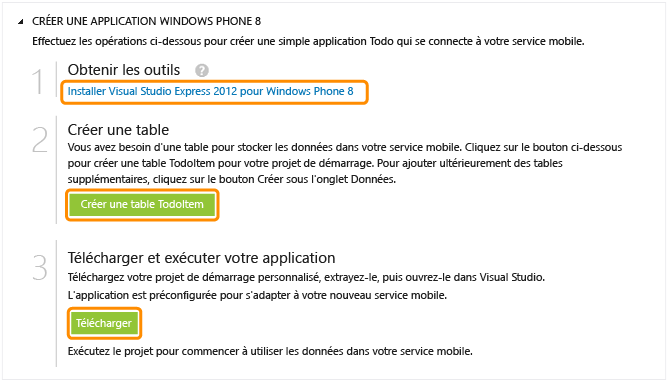

<properties pageTitle="Get Started with Azure Mobile Services for Windows Phone apps" metaKeywords="" description="Follow this tutorial to get started using Azure Mobile Services for Windows Phone development. " metaCanonical="" services="" documentationCenter="Mobile" title="Get started with Mobile Services" authors="glenga" solutions="" manager="" editor="" />

Prise en main de Mobile Services
================================

<a href="/fr-fr/documentation/articles/mobile-services-windows-store-get-started" title="Windows Store">Windows Store</a><a href="/fr-fr/documentation/articles/mobile-services-windows-phone-get-started" title="Windows Phone" class="current">Windows Phone</a><a href="/fr-fr/documentation/articles/mobile-services-ios-get-started" title="iOS">iOS</a><a href="/fr-fr/documentation/articles/mobile-services-android-get-started" title="Android">Android</a><a href="/fr-fr/documentation/articles/mobile-services-html-get-started" title="HTML">HTML</a><a href="/fr-fr/documentation/articles/partner-xamarin-mobile-services-ios-get-started" title="Xamarin.iOS">Xamarin.iOS</a><a href="/fr-fr/documentation/articles/partner-xamarin-mobile-services-android-get-started" title="Xamarin.Android">Xamarin.Android</a><a href="/fr-fr/documentation/articles/partner-sencha-mobile-services-get-started/" title="Sencha">Sencha</a><a href="/fr-fr/documentation/articles/mobile-services-javascript-backend-phonegap-get-started/" title="PhoneGap">PhoneGap</a>

<a href="/fr-fr/documentation/articles/mobile-services-dotnet-backend-windows-phone-get-started/" title=".NET backend">.NET backend</a> | <a href="/fr-fr/documentation/articles/mobile-services-windows-phone-get-started/"  title="JavaScript backend" class="current">JavaScript backend</a>

Ce didacticiel présente l'ajout d'un service principal cloud à une application Windows Phone 8 à l'aide d'Azure Mobile Services. Dans ce didacticiel, vous allez créer un service mobile et une simple application *To do list* qui stocke les données d'application dans le nouveau service mobile.

Si vous préférez regarder une vidéo, le clip sur la droite suit la même procédure que ce didacticiel. Dans la vidéo, après avoir présenté Mobile Services, Nick Harris décrit la création de votre premier service mobile et explique comment s'y connecter à partir d'une application Windows Store.

<a href="http://go.microsoft.com/fwlink/?LinkId=290816" target="_blank" class="label">regarder le didacticiel</a> <a style="background-image: url('/media/devcenter/mobile/videos/mobile-wp8-get-started-180x120.png') !important;" href="http://go.microsoft.com/fwlink/?LinkId=290816" target="_blank" class="dev-onpage-video">Lire la vidéo</a> 13:18

Dans ce didacticiel, vous allez créer un service mobile et une simple application *To do list* qui stocke les données d'application dans le nouveau service mobile. Le service mobile à créer utilise du code JavaScript pour la logique métier côté serveur. Pour créer un service mobile vous permettant d'écrire votre logique métier côté serveur dans les langages .NET pris en charge à l'aide de Visual Studio, consultez la [version principale .NET](/fr-fr/documentation/articles/mobile-services-dotnet-backend-windows-phone-get-started) de cette rubrique.

Voici une capture d'écran de l'application terminée :

**Remarque**

Pour suivre ce didacticiel, vous devez disposer d'un compte Azure sur lequel la fonctionnalité Azure Mobile Services est activée.

-   Si vous ne possédez pas de compte, vous pouvez créer un compte d'évaluation gratuit en quelques minutes. Pour plus d'informations, consultez la page [Version d'évaluation gratuite d'Azure](http://www.windowsazure.com/en-us/pricing/free-trial/?WT.mc_id=A30A4DDE2&returnurl=http%3A%2F%2FFen-us%2Fdocumentation%2Farticles%2Fmobile-services-windows-phone-get-started%2F).

Création d'un service mobile
----------------------------

[WACOM.INCLUDE [mobile-services-create-new-service](../includes/mobile-services-create-new-service.md)]

<h2 data-morhtml="true"\>Création d'une applicationCréation d'une application Windows Phone</h2\>
---------------------------------------------------------------------------------------------------

Après avoir créé votre service mobile, vous pouvez suivre un démarrage rapide facile dans le portail de gestion pour créer une application ou modifier une application existante afin de vous connecter au service mobile.

Dans cette section, vous allez créer une application Windows Phone 8 connectée à votre service mobile.

1.  Dans le portail de gestion, cliquez sur **Mobile Services**, puis sur le service mobile que vous venez de créer.

2.  Dans l'onglet de démarrage rapide, cliquez sur **Windows Phone 8** sous **Choisissez une plateforme** et développez **Créer une application Windows Phone 8**.

	![][6]

	Cela affiche les trois étapes faciles pour créer une application Windows Phone connectée à votre service mobile.

	

3.  Si ce n'est pas déjà fait, téléchargez et installez [Visual Studio 2012 Express pour Windows Phone](https://go.microsoft.com/fwLink/p/?LinkID=268374) sur votre ordinateur local.

4.  Cliquez sur **Create TodoItem table** pour créer une table permettant de stocker les données d'application.

5.  Sous **Download and run app**, cliquez sur **Télécharger**.

	Cette opération télécharge le projet de votre exemple d'application *To do list* qui est connectée à votre service mobile. Enregistrez le fichier projet compressé sur votre ordinateur local et notez l'emplacement où vous l'avez enregistré.

Exécution de votre application Windows Phone
--------------------------------------------

La dernière étape de ce didacticiel consiste à générer et à exécuter votre nouvelle application.

1.  Accédez à l'emplacement où vous avez enregistré les fichiers projet compressés, développez les fichiers sur votre ordinateur et ouvrez le fichier solution dans Visual Studio.

2.  Appuyez sur la touche **F5** pour régénérer le projet et démarrer l'application.

3.  Dans l'application, tapez un texte explicite, comme *Suivre le didacticiel*, puis cliquez sur **Enregistrer**.

	![][10]

	Cette opération envoie une requête POST au nouveau service mobile hébergé sur Azure. Les données de la requête sont insérées dans la table TodoItem. Les éléments stockés dans la table sont renvoyés par le service mobile et les données sont affichées dans la liste.

    > [WACOM.NOTE]Vous pouvez vérifier le code (se trouvant dans le fichier MainPage.xaml.cs) qui accède au service mobile pour exécuter une requête et insérer des données.

4.  De retour dans le portail de gestion, cliquez sur l'onglet **Données**, puis sur la table **TodoItems**.

	![][11]

	Cette opération vous permet de parcourir les données insérées par l'application dans la table.

	![][12]

Étapes suivantes
----------------

Maintenant que vous avez effectué le démarrage rapide, découvrez comment effectuer d'autres tâches importantes dans Mobile Services :

-   [Prise en main des données]
    En savoir plus sur le stockage et l'interrogation des données à l'aide de Mobile Services.

-   [Prise en main de l'authentification]
    En savoir plus sur l'authentification des utilisateurs de votre application avec un fournisseur d'identité.

-   [Prise en main des notifications Push]
    En savoir plus sur l'envoi d'une notification Push très basique sur votre application.

<!-- Anchors. -->
[Getting started with Mobile Services]:#getting-started
[Create a new mobile service]:#create-new-service
[Define the mobile service instance]:#define-mobile-service-instance
[Next Steps]:#next-steps

<!-- Images. -->
[0]: ./media/mobile-services-windows-phone-get-started/mobile-quickstart-completed-wp8.png

[6]: ./media/mobile-services-windows-phone-get-started/mobile-portal-quickstart-wp8.png
[7]: ./media/mobile-services-windows-phone-get-started/mobile-quickstart-steps-wp8.png
[8]: ./media/mobile-services-windows-phone-get-started/mobile-vs-project-wp8.png

[10]: ./media/mobile-services-windows-phone-get-started/mobile-quickstart-startup-wp8.png
[11]: ./media/mobile-services-windows-phone-get-started/mobile-data-tab.png
[12]: ./media/mobile-services-windows-phone-get-started/mobile-data-browse.png

<!-- URLs. -->
[Prise en main des données]: /en-us/develop/mobile/tutorials/get-started-with-data-wp8
[Prise en main de l'authentification]: /en-us/develop/mobile/tutorials/get-started-with-users-wp8
[Prise en main des notifications Push]: /en-us/develop/mobile/tutorials/get-started-with-push-wp8
[Visual Studio 2012 Express for Windows Phone]: https://go.microsoft.com/fwLink/p/?LinkID=268374
[Mobile Services SDK]: https://go.microsoft.com/fwLink/p/?LinkID=268375

[Management Portal]: https://manage.windowsazure.com/
[.NET backend version]: /fr-fr/documentation/articles/mobile-services-dotnet-backend-windows-phone-get-started

