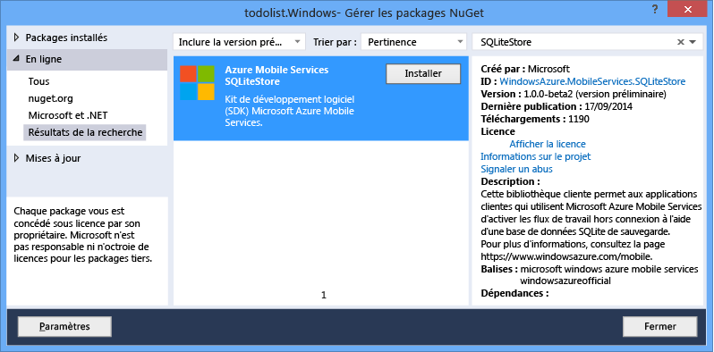
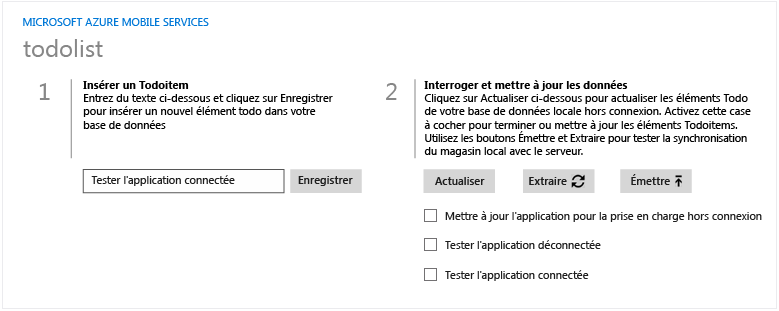
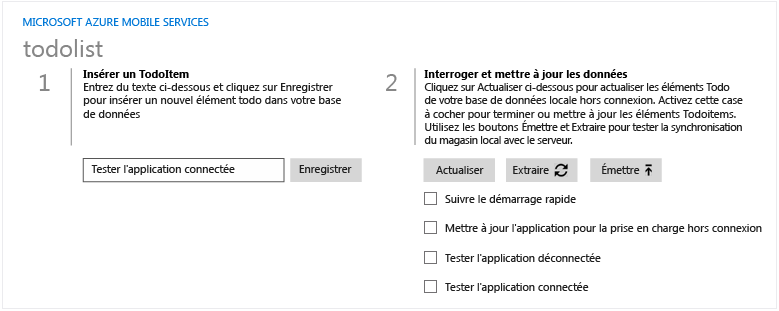
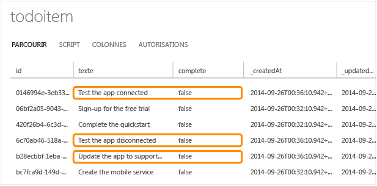
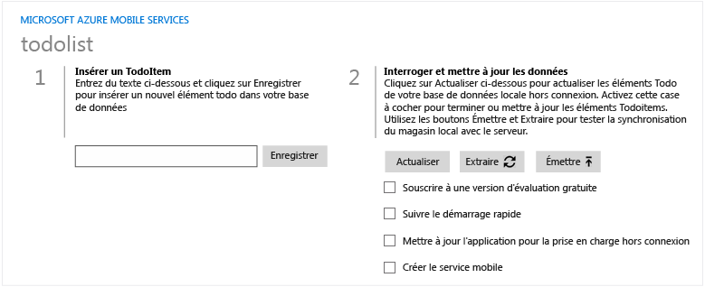
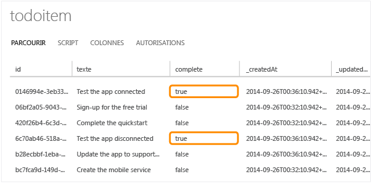

<properties linkid="develop-mobile-tutorials-get-started-offline-data-dotnet" urlDisplayName="Getting Started with Offline Data" pageTitle="Get started with offline data in Mobile Services (Windows Store) | Mobile Dev Center" metaKeywords="" description="Learn how to use offline data in your Windows Store application." metaCanonical="" disqusComments="1" umbracoNaviHide="1" documentationCenter="Mobile" title="Get started with offline data in Mobile Services" authors="wesmc" />

Prise en main des données hors connexion dans Mobile Services
=============================================================

[Windows Store C\#](/en-us/documentation/articles/mobile-services-windows-store-dotnet-get-started-offline-data "Windows Store C#")

Cette rubrique vous explique comment utiliser les fonctionnalités hors connexion d'Azure Mobile Services. Les fonctionnalités hors connexion d'Azure Mobile Services vous permettent d'interagir avec une base de données locale lorsque vous vous trouvez dans un scénario hors connexion avec votre version de Mobile Service. Les fonctionnalités hors connexion vous permettent de synchroniser vos modifications locales avec le service mobile une fois que vous êtes à nouveau en ligne.

Dans ce didacticiel, vous allez mettre à jour l'application à partir du didacticiel [Prise en main de Mobile Services](/en-us/documentation/articles/mobile-services-windows-store-get-started/) ou [Prise en main de données](/en-us/documentation/articles/mobile-services-dotnet-backend-windows-store-dotnet-get-started-data/) pour pouvoir prendre en charge les fonctionnalités hors connexion d'Azure Mobile Services. Ensuite, vous allez ajouter les données dans le cadre d'un scénario hors connexion déconnecté, vous synchroniserez ces éléments dans la base de données en ligne, puis vous vous connecterez au portail de gestion Windows Azure pour afficher les modifications apportées aux données lors de l'exécution de l'application.

> [WACOM.NOTE] Ce didacticiel vise à mieux vous faire comprendre en quoi Mobile Services vous permet de stocker et de récupérer des données dans une application Windows Store à l'aide de Windows Azure. À cet effet, il vous guide tout au long des nombreuses étapes exécutées automatiquement dans le démarrage rapide de Mobile Services. Si vous n'avez aucune expérience de Mobile Services, nous vous invitons à suivre d'abord le didacticiel [Prise en main de Mobile Services](/en-us/documentation/articles/mobile-services-windows-store-get-started/).

Ce didacticiel vous familiarise avec ces étapes de base :

1.  [Mise à jour de l'application pour prendre en charge les fonctionnalités hors connexion](#enable-offline-app)
2.  [Test de l'application dans un scénario hors connexion](#test-offline-app)
3.  [Mise à jour de l'application pour reconnecter votre service mobile](#update-online-app)
4.  [Test de l'application connectée au service mobile](#test-online-app)

Ce didacticiel requiert les éléments suivants :

-   Visual Studio 2013 s'exécutant sous Windows 8.1.
-   L'exécution du didacticiel [Prise en main de Mobile Services](/en-us/documentation/articles/mobile-services-windows-store-get-started/) ou [Prise en main de données](/en-us/documentation/articles/mobile-services-dotnet-backend-windows-store-dotnet-get-started-data/).
-   Package NuGet du Kit de développement logiciel (SDK) Windows Azure Mobile Services version 1.3.0-alpha
-   Package NuGet Windows Azure Mobile Services SQLite Store 0.1.0-alpha
-   SQLite pour Windows 8.1

> [WACOM.NOTE] Pour effectuer ce didacticiel, vous avez besoin d'un compte Windows Azure. Si vous ne possédez pas de compte, vous pouvez créer un compte d'évaluation gratuit en quelques minutes. Pour plus d'informations, consultez la page [Version d'évaluation gratuite de Windows Azure](http://www.windowsazure.com/en-us/pricing/free-trial/?WT.mc_id=AE564AB28).

Mise à jour de l'application pour prendre en charge les fonctionnalités hors connexion
--------------------------------------------------------------------------------------

Les fonctionnalités hors connexion d'Azure Mobile Services vous permettent d'interagir avec une base de données locale lorsque vous vous trouvez dans un scénario hors connexion avec votre version de Mobile Service. Pour pouvoir utiliser ces fonctionnalités dans votre application, vous initialisez `MobileServiceClient.SyncContext` dans un magasin local. Ensuite, vous référencez votre table par le biais de l'interface `IMobileServiceSyncTable`.

Cette section utilise SQLite en tant que magasin local pour les fonctionnalités hors connexion.

> [WACOM.NOTE] Vous pouvez ignorer cette section et télécharger simplement une version du projet de prise en main disposant déjà d'une prise en charge hors connexion. Pour télécharger un projet pour lequel la prise en charge hors connexion est activée, consultez la rubrique [Prise en main de l'exemple hors connexion](http://go.microsoft.com/fwlink/?LinkId=394777).

1.  Installez SQLite. Vous pouvez l'installer à partir de ce lien, [SQLite pour Windows 8.1](http://go.microsoft.com/fwlink/?LinkId=394776).

    > [WACOM.NOTE] Si vous utilisez Internet Explorer et que vous cliquez sur le lien pour installer SQLite, vous serez peut-être invité à télécharger le fichier .vsix en tant que fichier .zip. Enregistrez le fichier à un emplacement sur votre disque dur avec l'extension .vsix plutôt que .zip. Ensuite, double-cliquez sur le fichier .vsix dans l'Explorateur Windows pour exécuter l'installation.

2.  Dans Visual Studio, ouvrez le projet que vous avez effectué dans le didacticiel [Prise en main de Mobile Services](/en-us/documentation/articles/mobile-services-windows-store-get-started/) ou [Prise en main de données](/en-us/documentation/articles/mobile-services-dotnet-backend-windows-store-dotnet-get-started-data/). Ajoutez une référence **Extension Windows** à **SQLite pour Windows Runtime (Windows 8.1)**.

    

    > [WACOM.NOTE] SQLite Runtime vous oblige à modifier l'architecture processeur du projet en cours de conception vers **x86**, **x64** ou **ARM**. **Tout processeur** n'est pas pris en charge.

3.  Dans l'Explorateur de solutions pour Visual Studio, cliquez avec le bouton droit sur votre projet d'application cliente, puis cliquez sur **Gérer les packages Nuget** pour exécuter le gestionnaire de package NuGet. Recherchez **SQLiteStore** pour installer le package **WindowsAzure.MobileServices.SQLiteStore**.

    

4.  Dans l'Explorateur de solutions pour Visual Studio, ouvrez le fichier MainPage.xaml.cs. Ajoutez les instructions using suivantes au début du fichier.

         using Microsoft.WindowsAzure.MobileServices.SQLiteStore;
         using Microsoft.WindowsAzure.MobileServices.Sync;
         using Newtonsoft.Json.Linq;

5.  Dans Mainpage.xaml.cs, remplacez la déclaration de `todoTable` par une déclaration de type `IMobileServicesSyncTable` qui est initialisée en appelant `MobileServicesClient.GetSyncTable()`.

         //private IMobileServiceTable<TodoItem> todoTable = App.MobileService.GetTable<TodoItem>();
         private IMobileServiceSyncTable<TodoItem> todoTable = App.MobileService.GetSyncTable<TodoItem>();

6.  Dans MainPage.xaml.cs, mettez à jour la classe `TodoItem` de façon à ce qu'elle inclue la propriété système **Version** comme suit.

         public class TodoItem
         {
           public string Id { get; set; }
           [JsonProperty(PropertyName = "text")]
           public string Text { get; set; }
           [JsonProperty(PropertyName = "complete")]
           public bool Complete { get; set; }
           [Version]
           public string Version { get; set; }
         }

7.  Dans MainPage.xaml.cs, mettez à jour le gestionnaire d'événements `OnNavigatedTo` de façon à ce qu'il initialise le contexte de synchronisation client avec un magasin SQLite. Le magasin SQLite est créé avec une table qui associe le schéma de la table de service mobile mais il doit contenir la propriété système **Version** ajoutée à l'étape précédente.

         protected async override void OnNavigatedTo(NavigationEventArgs e)
         {
             if (!App.MobileService.SyncContext.IsInitialized)
             {
                 var store = new MobileServiceSQLiteStore("localsync12.db");
                 store.DefineTable<TodoItem>();
                 await App.MobileService.SyncContext.InitializeAsync(store, new MobileServiceSyncHandler());
             }
             RefreshTodoItems();
         }

8.  Dans l'Explorateur de solutions pour Visual Studio, ouvrez le fichier MainPage.xaml. Recherchez l'élément Grid qui contient le StackPanel intitulé **Query and Update Data**. Ajoutez le code d'interface utilisateur suivant qui remplace les éléments depuis les définitions de ligne vers la balise de début de la vue ListView.

    Ce code ajoute les définitions de ligne et de colonne à la grille de façon à organiser la disposition des éléments. Il ajoute également deux contrôles de bouton avec des gestionnaire d'événements Click pour les opérations **Push** et **Pull**. Les boutons sont positionnés juste au dessus des ListItems nommés `ListView`. Enregistrez le fichier.

         <Grid.RowDefinitions>
             <RowDefinition Height="Auto" />
             <RowDefinition Height="Auto" />
             <RowDefinition Height="*" />
         </Grid.RowDefinitions>
         <Grid.ColumnDefinitions>
             <ColumnDefinition Width="Auto" />
             <ColumnDefinition Width="*" />
         </Grid.ColumnDefinitions>
         <StackPanel Grid.Row="0" Grid.ColumnSpan="2">
             <local:QuickStartTask Number="2" Title="Interroger, mettre à jour et synchroniser les données" 
               Description="Utilisez les boutons Pull et Push pour synchroniser le magasin local avec le serveur" />
         </StackPanel>
         <Button Grid.Row="1" Grid.Column="0" Margin="5,5,0,0" Name="ButtonPush"
             Click="ButtonPush_Click" Width="80" Height="34">⬆ Push</Button>
         <Button Grid.Row="1" Grid.Column="1" Margin="5,5,0,0"  Name="ButtonPull" 
             Click="ButtonPull_Click" Width="80" Height="34">⬇ Pull</Button>
         <ListView Name="ListItems" SelectionMode="None" Margin="0,10,0,0" Grid.ColumnSpan="2" Grid.Row="2">

9.  Dans MainPage.xaml.cs, ajoutez les gestionnaires d'événements Click de bouton pour les boutons **Push** et **Pull**, puis enregistrez le fichier.

         private async void ButtonPull_Click(object sender, RoutedEventArgs e)
         {
             Exception pullException = null;
             try
             {
                 await todoTable.PullAsync();
                 RefreshTodoItems();
             }
             catch (Exception ex)
             {
                 pullException = ex;
             }
             if (pullException != null) {
                 MessageDialog d = new MessageDialog("Échec de l'opération Pull : " + pullException.Message +
                   "\n\nSi vous êtes dans un scénario hors connexion, " + 
                   "essayez votre commande Pull à nouveau lorsque vous êtes connecté à votre service mobile.");
                 await d.ShowAsync();
             }
         }
         private async void ButtonPush_Click(object sender, RoutedEventArgs e)
         {
             string errorString = null;
             try
             {
                 await App.MobileService.SyncContext.PushAsync();
                 RefreshTodoItems();
             }
             catch (MobileServicePushFailedException ex)
             {
                 errorString = "Échec de l'opération Push en raison d'erreurs de synchronisation : " + 
                   ex.PushResult.Errors.Count() + ", message: " + ex.Message;
             }
             catch (Exception ex)
             {
                 errorString = "Échec de l'opération Push : " + ex.Message;
             }
             if (errorString != null) {
                 MessageDialog d = new MessageDialog(errorString + 
                   "\n\nSi vous êtes dans un scénario hors connexion, " + 
                   "essayez votre commande Push à nouveau lorsque vous êtes connecté à votre service mobile.");
                 await d.ShowAsync();
             }
         }

10. N'exécutez pas encore l'application. Appuyez sur **F7** pour régénérer le projet. Vérifiez qu'aucune erreur de génération ne s'est produite.

Test de l'application dans un scénario hors connexion
-----------------------------------------------------

Dans cette section, vous rompez la connexion d'application avec le service mobile afin de simuler un scénario hors connexion. Ensuite, vous ajouterez quelques éléments de données qui seront conservés dans le magasin local.

Notez que dans cette section l'application ne doit être connectée à aucun service mobile. Par conséquent, les boutons **Push** et **Pull** généreront des erreurs si vous les testez. Dans la section suivante, vous connecterez cette application cliente au service mobile à nouveau pour tester les opérations **Push** et **Pull** afin de synchroniser le magasin avec la base de données du service mobile.

1.  Dans l'Explorateur de solutions pour Visual Studio, ouvrez App.xaml.cs. Modifiez l'initialisation de **MobileServiceClient** de façon à utiliser une adresse non valide en remplaçant « **azure-mobile.net** » par « **azure-mobile.xxx** » pour votre URL. Puis enregistrez le fichier.

          public static MobileServiceClient MobileService = new MobileServiceClient(
             "https://your-mobile-service.azure-mobile.xxx/",
             "AppKey"
         );

2.  Dans Visual Studio, appuyez sur **F5** pour générer et exécuter l'application. Entrez un nouvel élément todo et cliquez sur **Enregistrer**. Les nouveaux éléments todo se trouvent uniquement dans le magasin local s'ils peuvent être transmis par Push vers le service mobile. L'application cliente se comporte comme si elle était connectée au service mobile et supportait toutes les opérations CRUD (Create, Read, Update et Delete, ou Créer, Lire, Mettre à jour et Supprimer).

    

3.  Fermez l'application et redémarrez-la pour vérifier que les nouveaux élément que vous avez créés sont conservés dans le magasin local.

Mise à jour de l'application pour reconnecter votre service mobile
------------------------------------------------------------------

Dans cette section, vous allez reconnecter l'application au service mobile. Cette opération simule le passage de l'application d'un état hors connexion à un état connecté avec le service mobile.

1.  Dans l'Explorateur de solutions pour Visual Studio, ouvrez App.xaml.cs. Modifiez l'initialisation de **MobileServiceClient** de façon à réutiliser l'adresse correcte en remplaçant « **azure-mobile.xxx** » par « **azure-mobile.net** » pour votre URL. Puis enregistrez le fichier.

          public static MobileServiceClient MobileService = new MobileServiceClient(
             "https://your-mobile-service.azure-mobile.net/",
             "Votre AppKey"
         );

Test de l'application connectée au service mobile
-------------------------------------------------

Dans cette section, vous allez tester les opérations Push et Pull pour synchroniser le magasin local avec la base de données du service mobile.

1.  Dans Visual Studio, appuyez sur **F5** pour régénérer et exécuter l'application. Notez que les données ont le même aspect que dans le scénario hors connexion, bien que l'application soit à présent connectée au service mobile. Cela s'explique par le fait que l'application fonctionne toujours avec la table `IMobileServiceSyncTable` pointant vers le magasin local.

    

2.  Connectez-vous au portail de gestion Microsoft Azure et examinez la base de données de votre service mobile. Si votre service utilise l'application dorsale de JavaScript pour les services mobiles, vous pouvez accéder aux données à partir de l'onglet **Données** du service mobile. Si vous utilisez l'application dorsale .NET pour votre service mobile, vous pouvez cliquer sur le bouton **Gérer** pour votre base de données dans l'extension SQL Azure afin d'exécuter une requête sur base de votre table.

    Notez que les données n'ont pas été synchronisées entre la base de données et le magasin local.

    

3.  Dans l'application, appuyez sur le bouton **Push**. L'application appelle `MobileServiceClient.SyncContext.PushAsync`, puis `RefreshTodoItems` pour actualiser l'application avec les éléments du magasin local. Suite à l'opération Push, la base de données du service mobile reçoit les données à partir du magasin. Toutefois, le magasin local ne reçoit pas les éléments à partir de la base de données du service mobile.

    Une opération Push est exécutée à partir de `MobileServiceClient.SyncContext` plutôt que `IMobileServicesSyncTable` et transmet par Push les modifications à toutes les tables associées à ce contexte de synchronisation. Ceci permet de prendre en compte les scénarios dans lesquels des relations existent entre les tables.

    

4.  Dans l'application, ajoutez quelques nouveaux éléments dans le magasin local.

    

5.  Cette fois, appuyez sur le bouton **Pull** dans l'application. L'application appelle uniquement `IMobileServiceSyncTable.PullAsync()` et `RefreshTodoItems`. Notez que toutes les données de la base de données du service mobile ont été transmises par Pull vers le magasin local et affichées dans l'application. Toutefois, remarquez également que toutes les données dans le magasin local étaient toujours envoyées par Push vers la base de données du service mobile. La raison en est qu'une opération **Pull effectue toujours un Push d'abord**.

    

    

Résumé
------

Pour pouvoir prendre en charge les fonctionnalités hors connexion des services mobiles, nous avons utilisé l'interface `IMobileServiceSyncTable` et initialisé `MobileServiceClient.SyncContext` avec un magasin local. Dans ce cas, le magasin local était une base de données SQLite.

Les opérations CRUD normales pour les services mobiles fonctionnent comme si l'application était toujours connectée, mais toutes les opérations ont lieu sur base du magasin local.

Lorsque nous avons voulu synchroniser le magasin local avec le serveur, nous avons utilisé les méthodes `IMobileServiceSyncTable.PullAsync` et `MobileServiceClient.SyncContext.PushAsync`.

-   Pour transmettre par Push les modifications au serveur, nous avons appelé `IMobileServiceSyncContext.PushAsync()`. Cette méthode est membre de `IMobileServicesSyncContext` à la place de la table de synchronisation parce qu'elle envoie par Push les modifications sur toutes les tables :

    Seuls les enregistrements qui ont été modifiés d'une certaine façon en local (par le biais d'opérations CRUD) seront envoyés au serveur.

-   Pour envoyer par Pull les données d'une table sur le serveur vers l'application, nous avons appelé `IMobileServiceSyncTable.PullAsync`.

    Une opération Pull émet toujours d'abord une opération Push.

    Les surcharges de **PullAsync()** permettent également de spécifier une requête. Notez que dans la version préliminaire de la prise en charge hors connexion de Mobile Services, la méthode **PullAsync** va lire toutes les lignes de la table (ou requête) correspondante. Elle n'essaie pas de lire uniquement les lignes plus récentes que la dernière synchronisation, par exemple. Si les lignes existent déjà dans la table de synchronisation locale, elles resteront inchangées.

Étapes suivantes
----------------

-   [Gestion des conflits liés à la prise en charge hors connexion de Mobile Services](/en-us/documentation/articles/mobile-services-windows-store-dotnet-handling-conflicts-offline-data/)

<!-- Anchors. -->
[Update the app to support offline features]: #enable-offline-app
[Test the app in an offline Scenario]: #test-offline-app
[Update the app to reconnect your mobile service]: #update-online-app
[Test the app connected to the Mobile Service]: #test-online-app
[Next Steps]:#next-steps

<!-- Images -->
[0]: ./media/mobile-services-windows-store-dotnet-get-started-data-vs2013/mobile-todoitem-data-browse.png
[1]: ./media/mobile-services-windows-store-dotnet-get-started-offline-data/mobile-services-add-reference-sqlite-dialog.png
[2]: ./media/mobile-services-windows-store-dotnet-get-started-offline-data/mobile-services-sqlitestore-nuget.png
[3]: ./media/mobile-services-windows-store-dotnet-get-started-offline-data/mobile-services-sqlitepcl-nuget.png
[4]: ./media/mobile-services-windows-store-dotnet-get-started-offline-data/mobile-services-offline-app-run1.png
[5]: ./media/mobile-services-windows-store-dotnet-get-started-offline-data/mobile-services-online-app-run1.png
[6]: ./media/mobile-services-windows-store-dotnet-get-started-offline-data/mobile-data-browse.png
[7]: ./media/mobile-services-windows-store-dotnet-get-started-offline-data/mobile-data-browse2.png
[8]: ./media/mobile-services-windows-store-dotnet-get-started-offline-data/mobile-services-online-app-run2.png
[9]: ./media/mobile-services-windows-store-dotnet-get-started-offline-data/mobile-services-online-app-run3.png
[10]: ./media/mobile-services-windows-store-dotnet-get-started-offline-data/mobile-data-browse3.png

<!-- URLs. -->
[Handling conflicts with offline support for Mobile Services]: /en-us/documentation/articles/mobile-services-windows-store-dotnet-handling-conflicts-offline-data/ 
[Getting Started Offline Sample]: http://go.microsoft.com/fwlink/?LinkId=394777
[Get started with Mobile Services]: /en-us/develop/mobile/tutorials/get-started/#create-new-service
[Getting Started]: /en-us/documentation/articles/mobile-services-dotnet-backend-windows-phone-get-started/
[Get started with data]: /en-us/documentation/articles/mobile-services-dotnet-backend-windows-store-dotnet-get-started-data/
[Get started with Mobile Services]: /en-us/documentation/articles/mobile-services-windows-store-get-started/
[SQLite for Windows 8.1]: http://go.microsoft.com/fwlink/?LinkId=394776