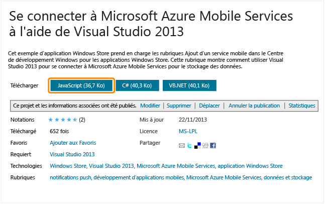

<!-- saved from url=(0022)http://internet.e-mail -->

Prise en main des données dans Mobile Services
==============================================

[Windows Store C\#](/en-us/develop/mobile/tutorials/get-started-with-data-dotnet "Windows Store C#")[Windows Store JavaScript](/en-us/develop/mobile/tutorials/get-started-with-data-js "Windows Store JavaScript")[Windows Phone](/en-us/develop/mobile/tutorials/get-started-with-data-wp8 "Windows Phone")[iOS](/en-us/develop/mobile/tutorials/get-started-with-data-ios "iOS")[Android](/en-us/develop/mobile/tutorials/get-started-with-data-android "Android")[HTML](/en-us/develop/mobile/tutorials/get-started-with-data-html "HTML")[Xamarin.iOS](/en-us/develop/mobile/tutorials/get-started-with-data-xamarin-ios "Xamarin.iOS")[Xamarin.Android](/en-us/develop/mobile/tutorials/get-started-with-data-xamarin-android "Xamarin.Android")
[.NET backend](/en-us/documentation/articles/mobile-services-dotnet-backend-windows-store-javascript-get-started-data/ ".NET backend") | [JavaScript backend](/en-us/documentation/articles/mobile-services-windows-store-javascript-get-started-data/ "JavaScript backend")

Cette rubrique montre comment utiliser Azure Mobile Services pour utiliser les données dans une application Windows Store. Dans ce didacticiel, vous allez télécharger un projet Visual Studio 2013 pour une application qui stocke les données en mémoire, créer un service mobile, intégrer le service mobile avec l'application, puis vous connecter au portail de gestion Azure pour afficher les modifications effectuées sur les données lors de l'exécution de l'application.
**Remarque**

Ce didacticiel requiert Visual Studio 2013, ce qui facilite la connexion de votre application Windows Store à Mobile Services. Pour effectuer la même procédure de base à l'aide de Visual Studio 2012, suivez la procédure de la rubrique [Prise en main des données dans Mobile Services à l'aide de Visual Studio 2012](/en-us/develop/mobile/tutorials/get-started-with-data-js-vs2012/).

Ce didacticiel vous familiarise avec ces étapes de base :

1.  [Téléchargement d'un projet d'application Windows Store](#download-app)
2.  [Création du service mobile](#create-service)
3.  [Ajout d'une table de données pour le stockage](#add-table)
4.  [Mise à jour de l'application pour utiliser Mobile Services](#update-app)
5.  [Test de l'application avec Mobile Services](#test-app)

**Remarque**

Pour effectuer ce didacticiel, vous avez besoin d'un compte Azure. Si vous ne possédez pas de compte, vous pouvez créer un compte d'évaluation gratuit en quelques minutes. Pour plus d'informations, consultez la page [Version d'évaluation gratuite d'Azure](http://www.windowsazure.com/en-us/pricing/free-trial/?WT.mc_id=A756A2826&returnurl=http%3A%2F%2Fwww.windowsazure.com%2Fen-us%2Fdevelop%2Fmobile%2Ftutorials%2Fget-started-with-data-js%2F).

Téléchargement du projetTéléchargement du projet GetStartedWithData
-------------------------------------------------------------------

Ce didacticiel est basé sur l'[application GetStartedWithMobileServices](http://go.microsoft.com/fwlink/p/?LinkId=328660), qui est un projet d'application Windows Store dans Visual Studio 2013. L'interface utilisateur de cette application est identique à l'application générée par le démarrage rapide de Mobile Services, sauf que les éléments ajoutés sont stockés en local dans la mémoire.

1.  Téléchargez la version JavaScript de l'exemple d'application GetStartedWithData sur le [site d'exemples de code développeur](http://go.microsoft.com/fwlink/p/?LinkId=328660).

      

2.  Dans Visual Studio 2012 Express pour Windows 8, ouvrez le projet téléchargé, développez le dossier **js** et examinez le fichier default.js.

      Notez que les objets **TodoItem** ajoutés sont stockés dans un objet **List** en mémoire.

3.  Appuyez sur la touche **F5** pour régénérer le projet et démarrer l'application.

4.  Dans l'application, tapez du texte dans **Insert a TodoItem**, puis cliquez sur **Enregistrer**.

        

      Notez que le texte enregistré est affiché dans la deuxième colonne sous **Query and update data**.

Création du service mobileCréation d'un service mobile à partir de Visual Studio
--------------------------------------------------------------------------------

[WACOM.INCLUDE [mobile-services-create-new-service-vs2013](../includes/mobile-services-create-new-service-vs2013.md)]

1.  Dans l'Explorateur de solutions, développez les dossiers **services**, **mobile services**, **&lt;your\_service\>**, ouvrez le fichier de script service.js, et notez la nouvelle variable globale, similaire à celle présentée dans l'exemple suivant :

    ``` {}
    var todolistClient = new WindowsAzure.MobileServiceClient(
                    "https://todolist.azure-mobile.net/",
                    "XXXXXXXXXXXXXXXXXXXXXXXXXXXXXXXXX");
    ```

    Ce code permet d'accéder à votre nouveau service mobile dans votre application en utilisant une variable globale. Le client est créé en fournissant l'URI et la clé de l'application du nouveau service mobile. Dans la mesure où une référence à ce script a été ajoutée dans le fichier default.html, cette variable est disponible pour tous les fichiers de script qui sont également référencés sur cette page.

Ajout d'une nouvelle tableAjout d'une nouvelle table au service mobile et mise à jour de l'application
------------------------------------------------------------------------------------------------------

[WACOM.INCLUDE [mobile-services-create-new-table-vs2013](../includes/mobile-services-create-new-table-vs2013.md)]

1.  Mettez en commentaire la ligne définissant la collection des éléments existants, puis annulez les marques de commentaire ou ajoutez les lignes de code suivantes et remplacez `<yourClient>;` par la variable ajoutée au fichier service.js lorsque vous avez connecté votre projet au service mobile :

         var todoTable = <yourClient>.getTable('TodoItem');

       Ce code crée un objet proxy (**todoItemTable**) pour la nouvelle table de base de données. 

2.  Remplacez la fonction **InsertTodoItem** par le code suivant :

         var insertTodoItem = function (todoItem) {
             // Insère une nouvelle ligne dans la base de données. Une fois que l'opération est terminée
             // et que Mobile Services a attribué un ID, l'élément est ajouté à la liste des liaisons.
             todoTable.insert(todoItem).done(function (item) {
                 todoItems.push(item);
             });
         };

    Ce code permet d'insérer un nouvel élément dans la table.

    **Remarque**

    Les nouvelles tables sont créées avec une seule colonne d'ID. Lorsqu'un schéma dynamique est activé, Mobile Services génère automatiquement de nouvelles colonnes basées sur l'objet JSON dans la requête d'insertion ou de mise à jour. Pour plus d'informations, consultez la page [Schéma dynamique](http://msdn.microsoft.com/en-us/library/windowsazure/jj193175.aspx).

3.  Remplacez la fonction **RefreshTodoItem** par le code suivant :

         var refreshTodoItems = function () {
             // Ce code actualise les entrées dans la liste en interrogeant la table. 
             todoTable.read().done(function (results) {
                 todoItems = new WinJS.Binding.List(results);
                 listItems.winControl.itemDataSource = todoItems.dataSource;
             });
         };

      Cela définit la liaison sur la collection d'éléments dans todoTable, qui contient tous les objets **TodoItem** renvoyés depuis le service mobile. 

4.  Remplacez la fonction **UpdateCheckedTodoItem** par le code suivant :

         var updateCheckedTodoItem = function (todoItem) {
             // Ce code prend un TodoItem qui vient d'être terminé et met à jour la base de données. 
             todoTable.update(todoItem);
         };

      Cela permet d'envoyer une mise à jour de l'élément au service mobile.

Maintenant que l'application a été mise à jour pour utiliser Mobile Services pour le stockage principal, le moment est venu de tester l'application avec Mobile Services.

Test de l'applicationTest de l'application avec votre nouveau service mobile
----------------------------------------------------------------------------

1.  Dans Visual Studio, appuyez sur la touche F5 pour exécuter l'application.

2.  Comme auparavant, tapez du texte dans **Insert a TodoItem**, puis cliquez sur **Enregistrer**.

     Cela permet d'envoyer un nouvel élément en tant qu'insertion au service mobile.

3.  Dans le [portail de gestion](https://manage.windowsazure.com/), cliquez sur **Mobile Services**, puis sur le service mobile.

4.  Cliquez sur l'onglet **Données**, puis sur **Parcourir**.

     
          
     La table **TodoItem** contient à présent des données, dont les valeurs d'ID ont été générées par Mobile Services, et les colonnes ont été automatiquement ajoutées à la table de manière à correspondre à la classe TodoItem au sein de l'application.

5.  Dans l'application, cochez un des éléments dans la liste, puis revenez à l'onglet Parcourir dans le portail et cliquez sur **Actualiser**.

  Notez que la valeur terminée est passée de **false** à **true**.

1.  Dans le fichier projet default.js, remplacez la fonction **RefreshTodoItems** existante par le code suivant qui filtre les éléments terminés :

         var refreshTodoItems = function () {                     
             // Requête plus avancée qui filtre les éléments terminés. 
             todoTable.where({ complete: false })
                .read()
                .done(function (results) {
                    todoItems = new WinJS.Binding.List(results);
                    listItems.winControl.itemDataSource = todoItems.dataSource;
                });            
         };

2.  Dans l'application, cochez un autre élément dans la liste, puis cliquez sur le bouton **Actualiser**.

      Notez que l'élément coché n'est plus affiché dans la liste. Chaque actualisation provoque un aller-retour vers le serveur mobile, qui renvoie les données filtrées.

Cela conclut le didacticiel **Prise en main des données**.

Étapes suivantes
----------------

Ce didacticiel a présenté les bases de l'activation d'une application Windows Store pour utiliser les données dans Mobile Services. Ensuite, pensez à suivre l'un des didacticiels suivants basés sur l'application GetStartedWithData que vous avez créée dans ce didacticiel :

-   [Validation et modification des données avec des scripts](/en-us/develop/mobile/tutorials/validate-modify-and-augment-data-js)
    <br/>En savoir plus sur l'utilisation des scripts serveur dans Mobile Services pour valider et modifier les données envoyées à partir de votre application.

-   [Affinage des requêtes à la pagination](/en-us/develop/mobile/tutorials/add-paging-to-data-js)
    <br/>En savoir plus sur l'utilisation de la pagination dans les requêtes pour contrôler la quantité de données traitées dans une seule requête.

Une fois que vous avez terminé les séries de données, essayez l'un de ces autres didacticiels :

-   [Prise en main de l'authentification](/en-us/develop/mobile/tutorials/get-started-with-users-js)
    <br/>En savoir plus sur l'authentification des utilisateurs de votre application.

-   [Prise en main des notifications Push](/en-us/develop/mobile/tutorials/get-started-with-push-js)
    <br/>En savoir plus sur l'envoi d'une notification Push très basique sur votre application.

-   [Guide de fonctionnement Mobile Services HTML/JavaScript](/en-us/develop/mobile/how-to-guides/work-with-html-js-client/) 
    <br/>En savoir plus sur l'utilisation de Mobile Services avec HTML et JavaScript


