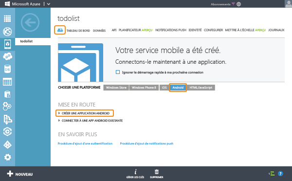

<properties
	pageTitle="Prise en main d'Azure Mobile Services pour les applications Android"
	description="Suivez ce didacticiel pour commencer à utiliser Azure Mobile Services pour le développement Android."
	services="mobile-services"
	documentationCenter="android"
	authors="RickSaling"
	manager="dwrede"
	editor=""/>

<tags
	ms.service="mobile-services"
	ms.workload="mobile"
	ms.tgt_pltfrm="mobile-android"
	ms.devlang="java"
	ms.topic="article" 
	ms.date="06/03/2015"
	ms.author="ricksal"/>

# Prise en main de Mobile Services

[AZURE.INCLUDE [mobile-services-selector-get-started](../../includes/mobile-services-selector-get-started.md)]

Ce didacticiel présente l'ajout d'un service backend cloud à une application Android à l'aide d'Azure Mobile Services. Dans ce didacticiel, vous allez créer un service mobile et une simple application <em>To do list</em> qui stocke les données d'application dans le nouveau service mobile.

Voici une capture d'écran de l'application terminée&#160;:

<a href="http://channel9.msdn.com/Series/Windows-Azure-Mobile-Services/Android-Support-in-Windows-Azure-Mobile-Services" target="_blank" class="label">regarder le didacticiel</a> <a style="background-image: url('/media/devcenter/mobile/videos/mobile-get-started-android-180x120.png') !important;" href="http://channel9.msdn.com/Series/Windows-Azure-Mobile-Services/Android-Support-in-Windows-Azure-Mobile-Services" target="_blank" class="dev-onpage-video">Lire la vidéo</a>7:26

## Composants requis

Pour suivre ce didacticiel, vous avez besoin des [Outils de développement Android][Android Studio], qui incluent l'environnement de développement intégré Android Studio et la dernière plateforme Android. Android 4.2 ou une version ultérieure est nécessaire.

Le projet de démarrage rapide téléchargé contient le Kit de développement logiciel (SDK) Azure Mobile Services pour Android.

> [AZURE.IMPORTANT]Pour effectuer ce didacticiel, vous avez besoin d’un compte Azure. Si vous ne possédez pas de compte, vous pouvez créer un compte d'évaluation gratuit en quelques minutes. Pour plus d'informations, consultez la page [Version d'évaluation gratuite d'Azure](http://azure.microsoft.com/pricing/free-trial/?WT.mc_id=AE564AB28).

## Création d’un service mobile

[AZURE.INCLUDE [mobile-services-create-new-service](../../includes/mobile-services-create-new-service.md)]

## Création d’une application Android

Après avoir créé votre service mobile, vous pouvez suivre un démarrage rapide facile dans le portail de gestion pour créer une application ou modifier une application existante afin de vous connecter au service mobile.

Dans cette section, vous allez créer une application Android connectée à votre service mobile.

1.  Dans le portail de gestion, cliquez sur **Mobile Services**, puis sur le service mobile que vous venez de créer.

2. Dans l'onglet de démarrage rapide, cliquez sur **Android** sous **Choisissez une plateforme** et développez **Créer une application Android**.

   	

   	Cette opération affiche les trois étapes faciles permettant de créer une application Android connectée à votre service mobile.

  	

3. Si ce n'est pas déjà fait, téléchargez et installez les [outils de développement Android][Android SDK] sur votre ordinateur local ou sur votre machine virtuelle.

4. Cliquez sur **Create TodoItem table** pour créer une table permettant de stocker les données d'application.

5. Téléchargez maintenant votre application :
	- La dernière version de l’application utilise la version 2.0 du Kit de développement logiciel (SDK) Mobile Services pour Android. Vous pouvez télécharger cette version <a href="https://github.com/RickSaling/mobile-services-samples/tree/futures">ici</a>. Cliquez sur **Télécharger le Zip** et décompressez-le : le projet se trouve dans Prise en main sous le dossier Android.

	- Une version antérieure utilise la version précédente du Kit de développement logiciel (SDK). Pour l’utiliser, sous **Télécharger et exécuter l’application**, cliquez sur **Télécharger**. Cette opération télécharge le projet de votre exemple d'application _To do list_ qui est connectée à votre service mobile. Les fichiers projet sont compressés. Accédez à leur emplacement et décompressez-les sur votre ordinateur.

## Exécution de votre application Android

[AZURE.INCLUDE [mobile-services-run-your-app](../../includes/mobile-services-android-get-started.md)]

### Consulter le code (facultatif)

Pour consulter le code source de l'application terminée, cliquez [ici](https://github.com/RickSaling/mobile-services-samples/tree/androidStudio/GettingStarted/AndroidStudio).

Si vous souhaitez consulter la version Eclipse de ce didacticiel, allez à : [Prise en main (Eclipse)](mobile-services-android-get-started-EC.md)

## Étapes suivantes
Maintenant que vous avez effectué le démarrage rapide, découvrez comment exécuter d'autres tâches importantes dans Mobile Services :

* [Prise en main des données]  En savoir plus sur le stockage et l'interrogation des données à l'aide de Mobile Services.

* [Prise en main de l'authentification]  En savoir plus sur l'authentification des utilisateurs de votre application avec un fournisseur d'identité.

* [Prise en main des notifications Push]  En savoir plus sur l'envoi d'une notification Push très basique sur votre application.

<!-- Anchors. -->
[Getting started with Mobile Services]: #getting-started
[Create a new mobile service]: #create-new-service
[Define the mobile service instance]: #define-mobile-service-instance
[Next Steps]: #next-steps

<!-- Images. -->
[0]: ./media/mobile-services-android-get-started/mobile-quickstart-completed-android.png
[6]: ./media/mobile-services-android-get-started/mobile-portal-quickstart-android.png
[7]: ./media/mobile-services-android-get-started/mobile-quickstart-steps-android-AS.png
[8]: ./media/mobile-services-android-get-started/mobile-eclipse-quickstart.png
[10]: ./media/mobile-services-android-get-started/mobile-quickstart-startup-android.png
[11]: ./media/mobile-services-android-get-started/mobile-data-tab.png
[12]: ./media/mobile-services-android-get-started/mobile-data-browse.png
[14]: ./media/mobile-services-android-get-started/mobile-services-import-android-workspace.png
[15]: ./media/mobile-services-android-get-started/mobile-services-import-android-project.png

<!-- URLs. -->
[Get started (Eclipse)]: mobile-services-android-get-started-EC.md
[Prise en main des données]: mobile-services-android-get-started-data.md
[Prise en main de l'authentification]: mobile-services-android-get-started-users.md
[Prise en main des notifications Push]: mobile-services-javascript-backend-android-get-started-push.md
[Android SDK]: https://go.microsoft.com/fwLink/p/?LinkID=280125
[Android Studio]: https://developer.android.com/sdk/index.html
[Mobile Services Android SDK]: https://go.microsoft.com/fwLink/p/?LinkID=266533

[Management Portal]: https://manage.windowsazure.com/
 

<!---HONumber=July15_HO4-->