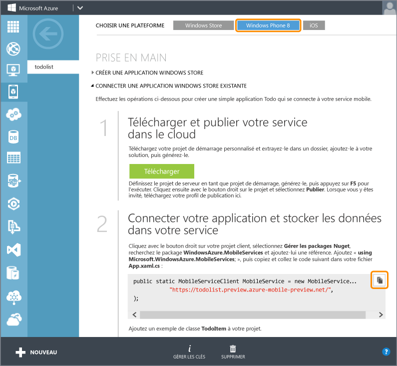
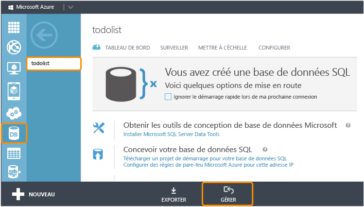

<properties 
	pageTitle="Ajout de Mobile Services à une application existante (Windows Phone) | Centre de développement mobile" 
	description="Apprenez à Mobile Services pour tirer parti des données de votre application Windows Phone." 
	services="mobile-services" 
	documentationCenter="windows" 
	authors="wesmc7777" 
	manager="dwrede" 
	editor=""/>

<tags 
	ms.service="mobile-services" 
	ms.workload="mobile" 
	ms.tgt_pltfrm="mobile-windows-phone" 
	ms.devlang="dotnet" 
	ms.topic="article" 
	ms.date="05/12/2015" 
	ms.author="wesmc"/>

# Ajout de services mobiles à une application existante

##Vue d'ensemble

[AZURE.INCLUDE [mobile-services-selector-get-started-data-legacy](../../includes/mobile-services-selector-get-started-data-legacy.md)]

Cette rubrique montre comment ajouter des services mobiles Azure comme source de données principale pour une application Windows Phone 8.1 Silverlight. Dans ce didacticiel, vous allez télécharger un projet Visual Studio pour une application qui stocke les données en mémoire, créer un nouveau service mobile, intégrer le service mobile à l'application, puis afficher les modifications apportées aux données lors de l'exécution de l'application. Pour ajouter Mobile Services à une application Windows Phone Store 8.1, consultez [cette version du didacticiel](mobile-services-dotnet-backend-windows-universal-dotnet-get-started-data.md).

Le service mobile que vous allez créer dans ce didacticiel prendra en charge le runtime .NET dans le service mobile. Vous pourrez ainsi utiliser les langages .NET et Visual Studio pour la logique métier côté serveur dans le service mobile. Pour créer un service mobile vous permettant d'écrire votre logique métier côté serveur en JavaScript, consultez la [version du backend JavaScript](mobile-services-windows-phone-get-started-data.md) de cette rubrique.

##Configuration requise

Ce didacticiel requiert les éléments suivants :

+ Visual Studio 2013 (Update 2 ou une version ultérieure).
+ Un compte Microsoft Azure Si vous ne possédez pas de compte, vous pouvez créer un compte d'évaluation gratuit en quelques minutes. Pour plus d'informations, consultez la page <a href="http://azure.microsoft.com/pricing/free-trial/?WT.mc_id=AE564AB28&amp;returnurl=http%3A%2F%2Fazure.microsoft.com%2Ffr-fr%2Fdocumentation%2Farticles%2Fmobile-services-dotnet-backend-windows-store-dotnet-get-started-data%2F" target="_blank">Version d'évaluation gratuite d'Azure</a>. 

##Téléchargement du projet GetStartedWithData

Ce didacticiel est basé sur l'[application GetStartedWithMobileServices](https://code.msdn.microsoft.com/Add-Azure-Mobile-to-a-8b906f72), un projet d'application Windows Phone Silverlight 8.1 pour Visual Studio 2013.

1. Téléchargez la version C# de l'exemple d'application GetStartedWithMobileServices sur le [site d'exemples de code développeur](https://code.msdn.microsoft.com/Add-Azure-Mobile-to-a-8b906f72). 

	>[AZURE.NOTE]Pour créer une application Silverlight pour Windows Phone 8.1, il vous suffit de remplacer par Windows Phone 8.1 le système d'exploitation cible dans le projet d'application Silverlight pour Windows Phone 8 téléchargé. Pour créer une application Windows Phone Store, téléchargez la [version Windows Phone Store de l'application](http://go.microsoft.com/fwlink/p/?LinkId=397372) du projet de l'exemple d'application GetStartedWithData.

2. Exécutez Visual Studio avec des privilèges d'administration : cliquez avec le bouton droit sur Visual Studio, puis cliquez sur **Exécuter en tant qu'administrateur**.

3. Dans Visual Studio, ouvrez le projet téléchargé et examinez le fichier MainPage.xaml.cs.

   	Notez que les objets **TodoItem** ajoutés sont stockés dans un **ObservableCollection&lt;TodoItem&gt;** en mémoire.

4. Dans Visual Studio, choisissez une cible de déploiement pour l'application. Vous pouvez procéder au déploiement sur un appareil Windows Phone ou sur un des émulateurs fournis avec le Kit de développement logiciel (SDK) Windows Phone. Ce didacticiel montre comment procéder à un déploiement sur un émulateur.

5. Appuyez sur la touche **F5**. L'application est ainsi générée, déployée et démarrée pour le débogage.

6. Dans l'application, tapez un texte dans la zone de texte, puis cliquez sur **Enregistrer** pour enregistrer quelques éléments en mémoire dans l'application.

   	

   	Notez que le texte de chaque `TodoItem` apparaît sous le bouton d'actualisation, de même qu'une case à cocher qui vous permet de marquer l'élément terminé.

##Création d'un service mobile

[AZURE.INCLUDE [mobile-services-dotnet-backend-create-new-service](../../includes/mobile-services-dotnet-backend-create-new-service.md)]

##Téléchargement du projet de service mobile et ajout de celui-ci à la solution

1. Si vous ne l'avez pas encore fait, téléchargez et installez [Visual Studio Professional 2013](https://go.microsoft.com/fwLink/p/?LinkID=391934) ou une version ultérieure.
 
2. Dans le [portail de gestion Azure](https://manage.windowsazure.com/), cliquez sur votre nouveau service mobile et dans la page de démarrage rapide, cliquez sur la plateforme **Windows**, puis sous **Prise en main**, développez **Connecter une application Windows ou Windows Phone existante**.

    

4. Sous **Télécharger et publier votre service dans le cloud**, cliquez sur **Télécharger**.

	Cela permet de télécharger le projet Visual Studio qui implémente votre service mobile.

4. Décompressez la solution Starter du service personnalisé que vous avez téléchargée et copiez les dossiers que contenait le fichier .zip dans le même répertoire **C#** que le fichier solution Prise en main des données .sln. Cela permet au gestionnaire de package NuGet d'assurer plus facilement la synchronisation de tous les packages.

5. Dans l'Explorateur de solutions de Visual Studio, cliquez avec le bouton droit sur la solution de votre application Windows Store Prise en main des données. Cliquez sur **Ajouter**, puis sur **Projet existant**.

6. Dans la boîte de dialogue **Ajouter un projet existant**, accédez au dossier du projet de service mobile que vous avez déplacé dans le répertoire **C#**, sélectionnez le fichier de projet C# (.csproj) dans le sous-répertoire du service, puis cliquez sur **Ouvrir** pour ajouter le projet à votre solution.

7. Dans l'Explorateur de solutions de Visual Studio, cliquez avec le bouton droit sur le projet de service que vous venez d'ajouter, puis cliquez sur **Générer** pour vérifier qu'il est généré sans erreur. Pendant la génération, il se peut que le gestionnaire de package NuGet ait besoin de restaurer des packages NuGet référencés dans le projet.

8. Cliquez de nouveau sur le projet de service avec le bouton droit. Cette fois, cliquez sur **Démarrer une nouvelle instance** sous le menu contextuel **Déboguer**.

    Visual Studio ouvre la page Web par défaut de votre service. Vous pouvez cliquer sur **try it now** pour tester les méthodes dans votre service mobile à partir de la page Web par défaut.

    

    Par défaut, Visual Studio a hébergé votre service mobile localement dans IIS Express. Pour vous en assurer, cliquez avec le bouton droit sur l'icône de barre d'état système d'IIS Express sur votre barre des tâches.

##Mise à jour de l'application Windows Phone pour utiliser le service mobile

Dans cette section, vous allez mettre à jour l'application Windows Phone pour utiliser le service mobile en tant que service backend de l'application.

1. Dans l'Explorateur de solutions de Visual Studio, cliquez avec le bouton droit sur le projet d'application Windows Phone, puis cliquez sur **Gérer les packages NuGet**.

2. À partir de la boîte de dialogue Gérer les packages NuGet, recherchez **WindowsAzure.MobileServices** dans la collection de packages en ligne et cliquez pour installer le package NuGet Azure Mobile Services. Fermez ensuite la boîte de dialogue.

    

3. De retour dans le portail de gestion Azure, repérez l'étape intitulée **Connecter votre application et stocker les données dans votre service**. Copiez l'extrait de code qui permet de créer la connexion `MobileServiceClient`.

    

4. Dans Visual Studio, ouvrez App.xaml.cs. Collez l'extrait de code au début de la définition de la classe `App`. Ajoutez l'instruction `using` suivante au début du fichier et enregistrez-le :

		using Microsoft.WindowsAzure.MobileServices;

5. Dans Visual Studio, ouvrez le fichier MainPage.xaml.cs et ajoutez l'instruction « using » en haut de celui-ci :

		using Microsoft.WindowsAzure.MobileServices;

6. Dans Visual Studio, ouvrez le fichier MainPage.xaml.cs, remplacez la définition de la classe `MainPage` par la définition suivante et enregistrez le fichier.

    Ce code utilise le Kit de développement logiciel (SDK) Mobile Services pour permettre à l'application de stocker ses données dans une table fournie par le service au lieu de les stocker localement en mémoire. Les trois principales méthodes sont les suivantes : `InsertTodoItem`, `RefreshTodoItems` et `UpdateCheckedTodoItem`. Elles vous permettent d'insérer, d'interroger et de mettre à jour de manière asynchrone votre collection de données dans une table d'Azure.

        public sealed partial class MainPage : PhoneApplicationPage
        {
            private MobileServiceCollection<TodoItem, TodoItem> items;
            private IMobileServiceTable<TodoItem> todoTable = 
                App.MobileService.GetTable<TodoItem>();            
            public MainPage()
            {
                this.InitializeComponent();
            }
            private async void InsertTodoItem(TodoItem todoItem)
            {
                await todoTable.InsertAsync(todoItem); 
                items.Add(todoItem);
            }
            private async void RefreshTodoItems()
            {
                items = await todoTable 
                    .ToCollectionAsync(); 
                ListItems.ItemsSource = items;
            }
            private async void UpdateCheckedTodoItem(TodoItem item)
            {
                await todoTable.UpdateAsync(item);      
            }
            private void ButtonRefresh_Click(object sender, RoutedEventArgs e)
            {
                RefreshTodoItems();
            }
            private void ButtonSave_Click(object sender, RoutedEventArgs e)
            {
                var todoItem = new TodoItem { Text = InputText.Text };
                InsertTodoItem(todoItem);
            }
            private void CheckBoxComplete_Checked(object sender, RoutedEventArgs e)
            {
                CheckBox cb = (CheckBox)sender;
                TodoItem item = cb.DataContext as TodoItem;
                item.Complete = (bool)cb.IsChecked;
                UpdateCheckedTodoItem(item);
            }
            protected override void OnNavigatedTo(NavigationEventArgs e)
            {
                RefreshTodoItems();
            }
        }

##Test de l'application Windows Phone sur le service hébergé localement</h2>

Dans cette section, vous allez utiliser Visual Studio pour tester l'application et le service mobile localement sur votre station de travail de développement. Pour tester le service mobile hébergé localement dans IIS Express à partir d'un appareil Windows Phone ou d'un des émulateurs Windows Phone, vous devez configurer IIS Express et la station de travail pour autoriser les connexions à l'adresse IP et au port de la station de travail. Les appareils et émulateurs Windows Phone se connectent en tant que clients réseau non locaux.

#### Configuration d'IIS Express pour autoriser les connexions à distance

[AZURE.INCLUDE [mobile-services-how-to-configure-iis-express](../../includes/mobile-services-how-to-configure-iis-express.md)]

#### Test de l'application avec le service mobile d'IIS Express

6. Dans Visual Studio, ouvrez le fichier App.xaml.cs et placez en commentaire la définition `MobileService` que vous venez de coller dans le fichier. Ajoutez une nouvelle définition pour établir la connexion en fonction de l'adresse IP et du port que vous avez configurés sur la station de travail. Enregistrez ensuite le fichier. Votre code doit être semblable au code suivant :

        public static MobileServiceClient MobileService = new MobileServiceClient(
            "http://192.168.111.11:54321");

        //public static MobileServiceClient MobileService = new MobileServiceClient(
        //    "https://todolist.azure-mobile.net/",
        //    "XXXXXXXXXXXXXXXXXXXXXXXXXXXXXXXX"
        //);        

7. Dans Visual Studio, appuyez sur la touche F7 ou cliquez sur **Générer la solution** dans le menu Générer pour générer l'application Windows Phone et le service mobile. Vérifiez que les deux projets ont été générés sans erreurs dans la fenêtre Sortie de Visual Studio

8. Dans Visual Studio, appuyez sur la touche F5 ou cliquez sur **Démarrer le débogage** dans le menu Déboguer pour exécuter l'application et héberger le service mobile localement dans IIS Express.

    >[AZURE.NOTE]Vérifiez que vous avez bien exécuté Visual Studio avec l'option **Exécuter en tant qu'administrateur**. Sinon, IIS Express risque de ne pas charger les modifications que vous avez apportées au fichier applicationhost.config.

9. Entrez un texte pour le nouvel élément todoitem. Cliquez ensuite sur **Enregistrer**. Un nouvel élément TodoItem est inséré dans la base de données créée par le service mobile hébergé localement dans IIS Express. Activez la case à cocher d'un des éléments pour le marquer comme terminé.

10. Dans Visual Studio, arrêtez le débogage de l'application. Vous pouvez consulter les modifications dans la base de données créée pour le service backend en ouvrant l'Explorateur de serveurs et en développant les Connexions de données. Cliquez avec le bouton droit sur la table TodoItems située sous **MS_TableConnectionString** et cliquez sur **Afficher les données de la table.**

    

11. À l'issue du test de votre service mobile hébergé localement, supprimez la règle du Pare-feu Windows que vous avez créée pour ouvrir le port sur votre station de travail.

##Publication du service mobile sur Azure

[AZURE.INCLUDE [mobile-services-dotnet-backend-publish-service](../../includes/mobile-services-dotnet-backend-publish-service.md)]

##Test du service mobile publié sur Azure

1. Dans Visual Studio, ouvrez App.xaml.cs. Placez en commentaire le code permettant de créer le client `MobileServiceClient` qui se connecte au service mobile hébergé localement. Annulez le commentaire du code permettant de créer le client `MobileServiceClient` qui se connecte à votre service sous Azure. Enregistrez vos modifications dans le fichier.

        sealed partial class App : Application
        {
            //public static MobileServiceClient MobileService = new MobileServiceClient(
            //          "http://192.168.111.11:54321");

            // Use this constructor instead after publishing to the cloud
            public static MobileServiceClient MobileService = new MobileServiceClient(
                 "https://todolist.azure-mobile.net/",
                 "XXXXXXXXXXXXXXXXXXXXXXXXXXXXXXXX"
            );        
            ....

2. Dans Visual Studio, appuyez sur la touche F5 ou cliquez sur **Démarrer le débogage** dans le menu Déboguer. L'application est alors régénérée conformément à la précédente modification avant d'être exécutée pour se connecter au service mobile hébergé à distance sous Azure.

3. Entrez quelques nouveaux éléments todoitem et cliquez sur **Enregistrer** pour chacun d'eux. Activez la case à cocher pour valider certains de ces nouveaux éléments. Chaque nouvel élément todoItem est stocké et mis à jour dans la base de données SQL que vous avez configurée précédemment pour votre service mobile dans le portail de gestion Azure.

    Vous pouvez redémarrer l'application pour vous assurer que les modifications ont été conservées dans la base de données sous Azure. Vous pouvez également examiner la base de données à l'aide du portail de gestion Azure ou de l'Explorateur d'objets SQL Server de Visual Studio. Au cours des deux prochaines étapes, vous allez utiliser le portail de gestion Azure pour consulter les modifications dans votre base de données.

4. Dans le portail de gestion Azure, cliquez sur Gérer pour la base de données associée à votre service mobile.

    

5. Dans le portail de gestion, exécutez une requête pour afficher les modifications apportées par l'application. Votre requête sera semblable à la requête suivante mais le nom de votre base de données sera utilisé à la place de `todolist`.

        SELECT * FROM [todolist].[todoitems]

    

Vous voici parvenu à la fin du didacticiel **Prise en main des données**.

##Étapes suivantes

Ce didacticiel a présenté les bases de l'activation d'une application Windows Phone 8 pour utiliser les données générées à l'aide du runtime .Net dans Mobile Services. Ensuite, essayez l'un de ces autres didacticiels :

* [Prise en main de l'authentification]  En savoir plus sur l'authentification des utilisateurs de votre application.

* [Ajouter les notifications push à votre application]()  En savoir plus sur l’envoi d’une notification Push très basique à votre application.

* [Guide de fonctionnement Mobile Services .NET]  En savoir plus sur l'utilisation de Mobile Services avec .NET.
  

<!-- Images. -->

<!-- URLs. -->
[Get started with Mobile Services]: ../mobile-services-dotnet-backend-windows-phone-get-started.md
[Get started with data]: mobile-services-dotnet-backend-windows-phone-get-started-data.md
[Prise en main de l'authentification]: mobile-services-dotnet-backend-windows-phone-get-started-users.md
[Get started with push notifications]: mobile-services-dotnet-backend-windows-phone-get-started-push.md

[Windows Phone 8 SDK]: http://go.microsoft.com/fwlink/p/?linkid=268374
[Azure Management Portal]: https://manage.windowsazure.com/
[Management Portal]: https://manage.windowsazure.com/
[Mobile Services SDK]: http://go.microsoft.com/fwlink/p/?LinkId=257545
[Developer Code Samples site]: https://code.msdn.microsoft.com/Add-Azure-Mobile-to-a-8b906f72
[Guide de fonctionnement Mobile Services .NET]: mobile-services-windows-dotnet-how-to-use-client-library.md
[MobileServiceClient class]: http://go.microsoft.com/fwlink/p/?LinkId=302030
[How to add a new Windows Firewall port rule]: http://go.microsoft.com/fwlink/?LinkId=392240
   

<!---HONumber=July15_HO4-->