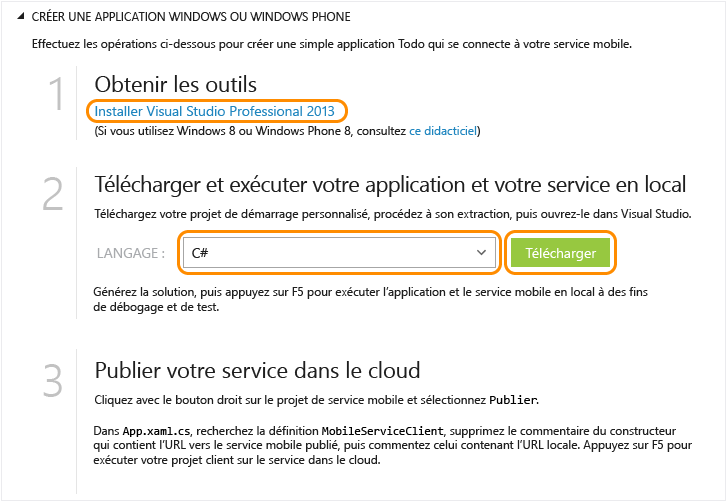

<properties
	pageTitle="Prise en main de Mobile Services pour les applications Windows universelles | Microsoft Azure"
	description="Suivez ce didacticiel pour commencer à utiliser Azure Mobile Services pour développer des applications Windows universelles en C#."
	services="mobile-services"
	documentationCenter="windows"
	authors="ggailey777"
	manager="erikre"
	editor=""/>

<tags
	ms.service="mobile-services"
	ms.workload="mobile"
	ms.tgt_pltfrm="mobile-windows"
	ms.devlang="dotnet"
	ms.topic="hero-article"
	ms.date="07/21/2016"
	ms.author="glenga"/>

# Prise en main de Mobile Services

[AZURE.INCLUDE [mobile-services-selector-get-started](../../includes/mobile-services-selector-get-started.md)]

&nbsp;

[AZURE.INCLUDE [mobile-service-note-mobile-apps](../../includes/mobile-services-note-mobile-apps.md)]
> Pour la version Mobile Apps équivalente de cette rubrique, consultez l’article [Créer une application Windows avec Mobile Apps](../app-service-mobile/app-service-mobile-windows-store-dotnet-get-started.md).

Ce didacticiel présente l’ajout d’un service principal cloud à une application Windows universelle à l’aide d’Azure Mobile Services. Les solutions d'application Windows universelles incluent des projets pour Windows Store 8.1 et Windows Phone Store 8.1, et un projet partagé commun. Pour plus d'informations, consultez la page [Créer des applications Windows universelles qui ciblent Windows et Windows Phone](http://msdn.microsoft.com/library/windows/apps/xaml/dn609832.aspx).

Dans ce didacticiel, vous allez créer un service mobile et une simple application *To do list* qui stocke les données d'application dans le nouveau service mobile. Le service mobile que vous allez créer utilise les langages .NET pris en charge à l'aide de Visual Studio pour la logique métier côté serveur et pour la gestion du service mobile. Pour créer un service mobile vous permettant d'écrire votre logique métier côté serveur en JavaScript, consultez la version du backend JavaScript de cette rubrique.

>[AZURE.NOTE]Cette rubrique vous présente la création d’un projet de service mobile et d’une application Windows universelle à l’aide du portail Azure Classic. Visual Studio 2013 Update 3 vous permet également d’ajouter un nouveau projet de service mobile dans une solution Visual Studio existante. Pour plus d’informations, consultez la rubrique [Ajout de Mobile Services à une application existante](mobile-services-dotnet-backend-windows-universal-dotnet-get-started-data.md).

>Pour ajouter un service mobile à un projet d’application Windows Phone 8.0 ou Windows Phone Silverlight 8.1, consultez la rubrique [Ajout de Mobile Services à une application Windows Phone existante](mobile-services-windows-phone-get-started-data.md).

[AZURE.INCLUDE [mobile-services-windows-universal-get-started](../../includes/mobile-services-windows-universal-get-started.md)]

Pour réaliser ce didacticiel, vous avez besoin des éléments suivants :

* Un compte Azure actif. Si vous ne disposez pas déjà d'un compte Azure, vous pouvez obtenir une évaluation gratuite et 10 services mobiles gratuits que vous pouvez utiliser même après l'expiration de l'évaluation. Pour plus d'informations, consultez la page [Version d'évaluation gratuite d'Azure](https://azure.microsoft.com/pricing/free-trial/?WT.mc_id=A0E0E5C02&amp;returnurl=http%3A%2F%2Fazure.microsoft.com%2Ffr-FR%2Fdocumentation%2Farticles%2Fmobile-services-dotnet-backend-windows-store-dotnet-get-started%2F).
* [Visual Studio 2013].

## Création d’un service mobile

[AZURE.INCLUDE [mobile-services-dotnet-backend-create-new-service](../../includes/mobile-services-dotnet-backend-create-new-service.md)]

## Création d’une application Windows universelle

Après avoir créé votre service mobile, vous pouvez suivre un démarrage rapide facile dans le portail Azure Classic pour créer une application ou modifier une application existante afin de vous connecter au service mobile.

Dans cette section, vous allez créer une application Windows universelle connectée à votre service mobile.

1. Dans le [portail Azure Classic], cliquez sur **Mobile Services**, puis sur le service mobile que vous venez de créer.

2. Dans l'onglet de démarrage rapide, cliquez sur **Windows** sous **Choisissez une plateforme** et développez **Créer une application Windows Store**.

   	Cette opération affiche les trois étapes faciles permettant de créer une application Windows Store connectée à votre service mobile.

  	

3. Si ce n'est déjà fait, téléchargez et installez [Visual Studio 2013] sur votre ordinateur local ou sur votre machine virtuelle.

4. Sous **Télécharger et exécuter votre application et votre service en local**, sélectionnez la langue de votre application Windows Store, puis cliquez sur **Télécharger**.

  	Ceci entraîne le téléchargement d'une solution contenant les projets du service mobile et de l'exemple d'application _To do list_ connectée à votre service mobile. Enregistrez le fichier projet compressé sur votre ordinateur local et notez l'emplacement où vous l'avez enregistré.

## Test de l’application avec le service mobile local

[AZURE.INCLUDE [mobile-services-dotnet-backend-test-local-service-dotnet](../../includes/mobile-services-dotnet-backend-test-local-service-dotnet.md)]

>[AZURE.NOTE]Vous pouvez vérifier le code qui se trouve dans le fichier MainPage.xaml.cs et permet d’accéder au service mobile pour exécuter une requête et insérer des données.

## Publication de votre service mobile

[AZURE.INCLUDE [mobile-services-dotnet-backend-publish-service](../../includes/mobile-services-dotnet-backend-publish-service.md)]

<ol start="4">
<li>
Dans le projet de code partagé, ouvrez le fichier App.xaml.cs, recherchez le code de création d'une instance <a href="http://msdn.microsoft.com/library/Windowsazure/microsoft.windowsazure.mobileservices.mobileserviceclient.aspx" target="_blank">MobileServiceClient</a> placez en commentaire le code de création de ce client à l'aide de <em>localhost</em> et annulez le commentaire du code de création du client à l'aide de l'URL du service mobile distant, lequel est semblable à ce qui suit&#160;:

        <pre><code>public static MobileServiceClient MobileService = new MobileServiceClient(
            "https://todolist.azure-mobile.net/",
            "XXXX-APPLICATION-KEY-XXXXX");</code></pre>

	
Le client a désormais accès au service mobile publié sur Azure.
</li>
</ol>

## Test de l'application avec le service mobile hébergé dans Azure

Maintenant que le service mobile est publié et que le client est connecté au service mobile distant hébergé dans Azure, nous pouvons exécuter l'application à l'aide du stockage d'objets d'Azure.

[AZURE.INCLUDE [mobile-services-windows-universal-test-app](../../includes/mobile-services-windows-universal-test-app.md)]

## Étapes suivantes
Vous avez terminé les étapes de démarrage rapide. Découvrez ensuite comment effectuer d’autres tâches importantes dans Mobile Services :

* [Ajout de Mobile Services à une application existante][Get started with data]  En savoir plus sur le stockage et l’interrogation des données à l’aide de Mobile Services.

* [Prise en main de la synchronisation des données hors connexion]  Découvrez comment utiliser la synchronisation des données hors connexion pour rendre votre application réactive et robuste.

* [Ajout de l’authentification à votre application Mobile Services][Get started with authentication]  Découvrez comment authentifier les utilisateurs de votre application avec un fournisseur d’identité.

* [Ajouter les notifications push à votre application][Get started with push notifications]  En savoir plus sur l’envoi d’une notification Push très basique à votre application.

* [Résolution des problèmes d'un backend .NET Mobile Services ]  Découvrez comment diagnostiquer et résoudre les problèmes qui peuvent se produire avec un backend .NET Mobile Services.

Pour plus d'informations sur les applications Windows universelles, consultez la page [Prise en charge de plusieurs plateformes d'appareil à partir d'un service mobile unique](mobile-services-how-to-use-multiple-clients-single-service.md#shared-vs).

[AZURE.INCLUDE [app-service-disqus-feedback-slug](../../includes/app-service-disqus-feedback-slug.md)]

<!-- Anchors. -->

<!-- Images. -->

<!-- URLs. -->
[Visual Studio 2013]: https://go.microsoft.com/fwLink/p/?LinkID=257546
[Visual Studio 2013]: https://go.microsoft.com/fwLink/p/?LinkID=257546
[Get started with data]: mobile-services-dotnet-backend-windows-universal-dotnet-get-started-data.md
[Prise en main de la synchronisation des données hors connexion]: mobile-services-windows-store-dotnet-get-started-offline-data.md
[Get started with authentication]: mobile-services-dotnet-backend-windows-universal-dotnet-get-started-users.md
[Get started with push notifications]: mobile-services-dotnet-backend-windows-universal-dotnet-get-started-push.md
[Visual Studio Professional 2013]: https://go.microsoft.com/fwLink/p/?LinkID=257546
[Mobile Services SDK]: http://go.microsoft.com/fwlink/?LinkId=257545
[JavaScript and HTML]: mobile-services-win8-javascript/
[portail Azure Classic]: https://manage.windowsazure.com/
[Résolution des problèmes d'un backend .NET Mobile Services ]: mobile-services-dotnet-backend-how-to-troubleshoot.md

<!---HONumber=AcomDC_0727_2016-->