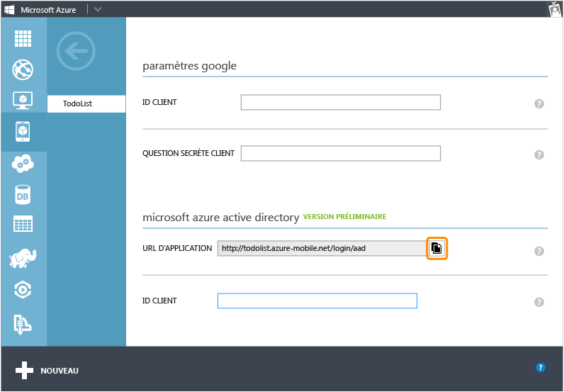
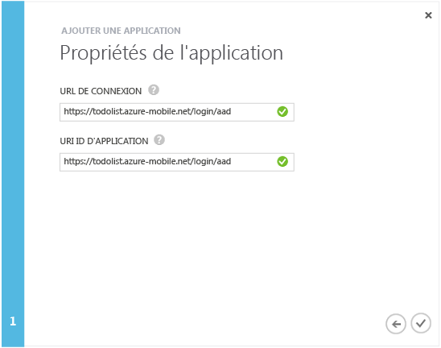
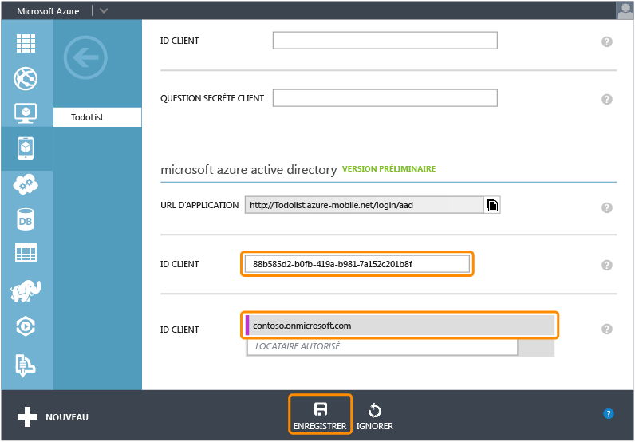

<properties 
	pageTitle="Inscription pour l'authentification Azure Active Directory | Microsoft Azure" 
	description="Découvrez comment vous inscrire pour l'authentification Azure Active Directory dans votre application Mobile Services." 
	authors="wesmc7777" 
	services="mobile-services" 
	documentationCenter="" 
	manager="dwrede" 
	editor=""/>

<tags 
	ms.service="mobile-services" 
	ms.workload="mobile" 
	ms.tgt_pltfrm="multiple" 
	ms.devlang="multiple" 
	ms.topic="article" 
	ms.date="09/24/2015" 
	ms.author="ricksal"/>

# Inscription de vos applications à des fins d'utilisation d'une connexion via un compte Azure Active Directory

[AZURE.INCLUDE [mobile-services-selector-register-identity-provider](../../includes/mobile-services-selector-register-identity-provider.md)]

##Vue d'ensemble

Cette rubrique montre comment inscrire vos applications afin d'utiliser Azure Active Directory comme fournisseur d'authentification pour votre service mobile.

##Inscription de votre application

>[AZURE.NOTE]Les étapes décrites dans cette rubrique sont destinées à être utilisées avec le didacticiel [Ajout de l'authentification à votre application Mobile Services](../mobile-services-dotnet-backend-windows-store-dotnet-get-started-users.md) quand vous voulez utiliser les [opérations de connexion orientées service](http://msdn.microsoft.com/library/azure/dn283952.aspx) avec votre application. Ou bien, si votre application doit recourir aux [opérations de connexion orientées client](http://msdn.microsoft.com/library/azure/jj710106.aspx) pour Azure Active Directory et à un service mobile de backend .NET, vous devez commencer par le didacticiel [Authentification de votre application avec le service d'authentification unique de la bibliothèque d'authentification Active Directory](mobile-services-windows-store-dotnet-adal-sso-authentication.md).

1. Ouvrez une session sur le [portail de gestion Azure], accédez à votre service mobile, cliquez sur l’onglet **Identité**, puis faites défiler jusqu'à la section du fournisseur d’identité **Azure Active Directory** et copiez l’**URL de l'application** présentée ici.

    

2. Accédez à **Active Directory** dans le portail de gestion, cliquez sur votre répertoire puis cliquez sur **Domaines** et prenez note du domaine par défaut de votre répertoire.

3. Cliquez sur **Applications** > **Ajouter** > **Ajouter une application développée par mon organisation**.

4. Dans l'Assistant Ajout d'application, entrez un **Nom** pour votre application et cliquez sur le type **Application Web et/ou API Web**.

    

5. Dans la zone **URL d'authentification**, collez la valeur de l'URL de l’application que vous avez copié à partir de votre service mobile. Entrez la même valeur unique dans la zone **URI ID d'application**, puis cliquez sur Continuer.
 
    

6. Une fois que l'application a été ajoutée, cliquez sur l’onglet **Configurer** et copiez l’**ID client** pour l'application.

    >[AZURE.NOTE]Pour un service mobile principal .Net, vous devez également modifier la valeur **URL de réponse** sous **Authentification unique** par l’URL de votre service mobile, en y ajoutant le chemin d’accès _signin-aad_. Par exemple, `https://todolist.azure-mobile.net/signin-aad`

7. Retournez à l’onglet **Identité** de votre service mobile et collez la valeur copiée **ID client** pour le fournisseur d'identité Azure Active Directory.
 
    

8.  Dans la liste **Locataires autorisés**, tapez le domaine du répertoire dans lequel vous avez inscrit l'application (ex. : `contoso.onmicrosoft.com`), puis cliquez sur **Enregistrer**.

Vous êtes maintenant prêt à utiliser Azure Active Directory pour l'authentification dans votre application.

<!-- Anchors. -->

<!-- Images. -->

<!-- URLs. -->
[portail de gestion Azure]: https://manage.windowsazure.com/

 

<!---HONumber=Oct15_HO3-->