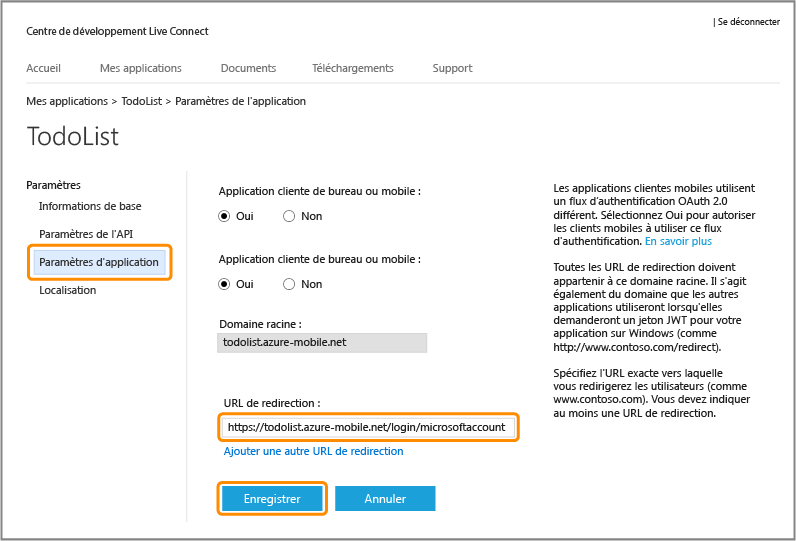
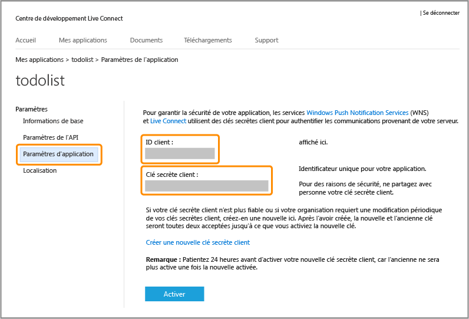

<properties
	pageTitle="Inscription pour l'authentification Microsoft | Microsoft Azure"
	description="Découvrez comment vous inscrire pour l'authentification Microsoft dans votre application Azure Mobile Services."
	authors="ggailey777"
	services="mobile-services"
	documentationCenter="Mobile"
	manager="dwrede"
	editor=""/>

<tags 
	ms.service="mobile-services" 
	ms.workload="mobile" 
	ms.tgt_pltfrm="NA" 
	ms.devlang="multiple" 
	ms.topic="article" 
	ms.date="02/25/2016" 
	ms.author="glenga"/>

# Inscrire votre application pour utiliser un compte Microsoft pour l'authentification

[AZURE.INCLUDE [mobile-service-note-mobile-apps](../../includes/mobile-services-note-mobile-apps.md)]

&nbsp;

[AZURE.INCLUDE [mobile-services-selector-register-identity-provider](../../includes/mobile-services-selector-register-identity-provider.md)]

## Vue d'ensemble

Cette rubrique montre comment inscrire votre application mobile afin d'utiliser un compte Microsoft comme fournisseur d'identité avec Azure Mobile Services. Les mêmes étapes s'appliquent pour l'authentification dirigée par le service et l'authentification dirigée par le client à l'aide du Kit de développement logiciel (SDK) Live.

##Inscription de votre application du Windows Store auprès du Centre de développement Windows

Les applications du Windows Store doivent d'abord être enregistrées auprès du Centre de développement Windows. Grâce à l’inscription, votre application Windows sera en mesure d’utiliser les comportements d’authentification unique.

>[AZURE.NOTE]Les applications Windows Phone 8, Silverlight Windows Phone 8.1 et non-Windows ne sont pas concernées par cette section.

1. Si vous n’avez pas déjà inscrit votre application, accédez à la page [Centre de développement Windows](https://dev.windows.com/dashboard/Application/New), connectez-vous à votre compte Microsoft, saisissez un nom d’application, puis cliquez sur **Réserver un nom d’application**.

3. Ouvrez votre projet d’application Windows dans Visual Studio, puis, dans l’Explorateur de solutions, cliquez avec le bouton droit sur le projet d’application Windows Store, cliquez sur **Store**, puis sur **Associer l’application au Windows Store...**.

  	

5. Dans l’Assistant, cliquez sur **Se connecter**, connectez-vous avec votre compte Microsoft, sélectionnez le nom d’application que vous avez réservé, puis cliquez sur **Suivant** > **Associer**.

6. (Facultatif) Pour une application Windows 8.1 universelle, répétez les étapes 4 et 5 pour le projet Windows Phone Store.

6. De retour sur la page du centre de développement Windows pour la nouvelle application, cliquez sur **Services** > **Notifications Push**.

7. Sur la page **Notifications Push**, cliquez sur **Site des services Microsoft Live** sous **Windows Push Notification Services (WNS) et Microsoft Azure Mobile Services**.
 
	La page des paramètres de l’application du compte Microsoft de votre application s’affiche.

8. Prenez note de la valeur **SID du package**. Vous pouvez enregistrer cette valeur SID dans le portail Azure pour activer l’authentification unique et les notifications Push pour votre application Windows.

Ensuite, vous configurerez l’authentification par compte Microsoft pour votre application Windows, à partir de l’étape 4 dans la section suivante.

## Configuration de l'enregistrement de votre compte Microsoft et connexion à Mobile Services

Si vous avez déjà inscrit votre application Windows dans la section précédente, vous pouvez passer à l’étape 2.

1. Pour une application non-Windows Store, accédez à la page [Mes applications](http://go.microsoft.com/fwlink/p/?LinkId=262039) dans le Centre des développeurs de compte Microsoft, connectez-vous avec votre compte Microsoft (si nécessaire), cliquez sur **Créer une application**, puis saisissez le **Nom de l’application** et cliquez sur **J’accepte**.

   	Une fois cette opération effectuée, le nom de votre application est réservé avec un compte Microsoft et la page du compte Microsoft de votre application s'affiche.

2. Sur la page du compte Microsoft de votre application, cliquez sur **Paramètres de l’API**, puis sur **Application cliente mobile ou de bureau**, définissez l’URL du service mobile en tant que **Domaine cible**, fournissez l’un des formats d’URL suivants dans **URL de redirection**, puis cliquez sur **Enregistrer** :

	+ **Service principal .NET** : `https://<mobile_service>.azure-mobile.net/signin-microsoft`
	+ **Service principal JavaScript** : `https://<mobile_service>.azure-mobile.net/login/microsoftaccount`

	 >[AZURE.NOTE]Assurez-vous d’utiliser le format de chemin d’accès d’URL de redirection correct pour votre type de serveur principal Mobile Services. Si cela n’est pas le cas, l'authentification échouera. Le **domaine racine** doit être renseigné automatiquement. &nbsp;

    

4. Cliquez sur **Paramètres d'application** et notez les valeurs de l'**ID du client**, de la **Clé secrète client** et du **SID du package**.

   	

    > [AZURE.NOTE] La clé secrète client est une information d'identification de sécurité importante. Ne la partagez avec personne et ne la distribuez pas avec votre application. Seules les inscriptions d'application du Windows Store affichent un champ SID du package.

4. Dans le [portail Azure Classic], cliquez sur l’onglet **Identité** du service mobile, entrez l’ID du client, la clé secrète client et le SID du package obtenus auprès de votre fournisseur d’identité, puis cliquez sur **Enregistrer**.

	>[AZURE.NOTE]Il est inutile de fournir une valeur de SID du package pour une application Windows Phone 8, Silverlight Windows Phone Store 8.1 ou une application non-Windows.

Votre service mobile et votre application sont désormais configurés pour utiliser le compte Microsoft.

<!-- Anchors. -->

<!-- Images. -->

<!-- URLs. -->

[Submit an app page]: http://go.microsoft.com/fwlink/p/?LinkID=266582
[My Applications]: http://go.microsoft.com/fwlink/p/?LinkId=262039

[portail Azure Classic]: https://manage.windowsazure.com/

<!---HONumber=AcomDC_0302_2016-->