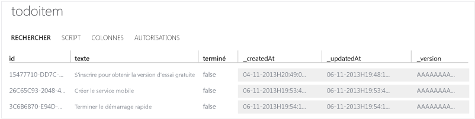

# Prise en main de Mobile Services
[!INCLUDE [mobile-services-selector-get-started](../../includes/mobile-services-selector-get-started.md)]

&nbsp;

[!INCLUDE [mobile-services-hero-slug](../../includes/mobile-services-hero-slug.md)]

Ce didacticiel vous montre comment ajouter un service principal cloud à une application en utilisant Azure Mobile Services. Dans ce didacticiel, vous allez créer un service mobile et une simple application *To do list* qui stocke les données d'application dans le nouveau service mobile.

Voici une capture d’écran de l’application terminée :

![][3]

### Conditions supplémentaires
L'exécution de ce didacticiel nécessite les éléments suivants :

* Outils PhoneGap (v3.2+ nécessaire pour les projets Windows Phone 8).
* Un compte Microsoft Azure actif.
* PhoneGap prend en charge le développement de plusieurs plateformes. Outre les outils PhoneGap, vous devez installer les outils de chacune des plateformes requises :
  
  * Windows Phone : installation de [Visual Studio 2012 Express pour Windows Phone](https://go.microsoft.com/fwLink/p/?LinkID=268374)
  * iOS: installation de [Xcode] \(v4.4 au minimum requis)
  * Android : installation d'[Android Developer Tools][Android SDK]  (le Kit de développement logiciel (SDK) Mobile Services pour Android prend en charge les applications destinées à Android 2.2 et versions ultérieures. Android 4.2 (ou version ultérieure) est requis pour exécuter l'application de démarrage rapide).

## Création d’un service mobile
[!INCLUDE [mobile-services-create-new-service](../../includes/mobile-services-create-new-service.md)]

## Création d'une application PhoneGap
Dans cette section, vous allez créer une application PhoneGap connectée à votre service mobile.

1. Dans le [portail Azure Classic], cliquez sur **Mobile Services**, puis sur le service mobile que vous venez de créer.
2. Dans l'onglet de démarrage rapide, cliquez sur **PhoneGap** sous **Choisissez une plateforme** et développez **Créer une application PhoneGap**.
   
       ![][0]
   
       Cette opération affiche les trois étapes faciles permettant de créer une application PhoneGap connectée à votre service mobile.
   
      ![][1]
3. Si ce n'est déjà fait, téléchargez et installez PhoneGap et au moins un des outils de développement de plateforme (Windows Phone, iOS ou Android).
4. Cliquez sur **Create TodoItem table** pour créer une table permettant de stocker les données d'application.
5. Sous **Télécharger et exécuter l'application**, cliquez sur **Télécharger**.
   
    Cette opération télécharge le projet de votre exemple d'application *To do list* qui est connectée à votre service mobile, ainsi que le Kit de développement logiciel (SDK) Mobile Services JavaScript. Enregistrez le fichier projet compressé sur votre ordinateur local et notez l'emplacement où vous l'avez enregistré.

## Exécution de votre nouvelle application PhoneGap
La dernière étape de ce didacticiel consiste à générer et à exécuter votre nouvelle application.

1. Accédez à l'emplacement où vous avez enregistré les fichiers projet compressés, puis développez les fichiers sur votre ordinateur.
2. Ouvrez et exécutez le projet conformément aux instructions disponibles sous chaque plateforme.
   
   * **Windows Phone 8**
     
     1. Windows Phone 8 : ouvrez le fichier .sln situé dans le dossier **platforms\\wp8** de Visual Studio 2012 Express pour Windows Phone.
     2. Appuyez sur la touche **F5** pour régénérer le projet et démarrer l'application.
        
        ![][2]
   * **iOS**
     
     1. Ouvrez le projet du dossier **platforms/ios** dans Xcode.
     2. Appuyez sur le bouton **Exécuter** pour générer le projet, et démarrez l'application dans l'émulateur iPhone (configuration par défaut pour ce projet).
        
        ![][3]
   * **Android**
     
     1. Dans Eclipse, cliquez sur **Fichier**, sur **Importer**, développez **Android**, puis cliquez sur **Existing Android Code into Workspace** et sur **Suivant.**
     2. Cliquez sur **Parcourir**, accédez à l'emplacement des fichiers projet développés, cliquez sur **OK**, veillez à ce que le projet TodoActivity soit sélectionné, puis cliquez sur **Terminer**. 
Cette opération importe les fichiers de projet dans l'espace de travail actuel.

     3. À partir du menu **Exécuter**, cliquez sur **Exécuter** pour démarrer le projet dans l'émulateur Android.
        
         ![][4]
     
     > [!NOTE]
     > Afin d’exécuter le projet dans l’émulateur Android, vous devez définir au moins un AVD (appareil virtuel Android). Utilisez le gestionnaire AVD pour créer et gérer ces appareils.
     > 
     > 
3. Après avoir lancé l'application dans un des émulateurs mobiles ci-dessus, tapez du texte dans la zone de texte, puis cliquez sur **Ajouter**.
   
    Ceci envoie une demande POST vers le nouveau service mobile hébergé dans Azure. Les données de la requête sont insérées dans la table **TodoItem**. Les éléments stockés dans la table sont renvoyés par le service mobile et les données sont affichées dans la liste.
   
   > [!IMPORTANT]
   > Les modifications apportées à ce projet de plateforme seront écrasées si le projet principal est régénéré à l'aide des outils PhoneGap. Par conséquent, il est impératif d'apporter ces modifications dans le répertoire www racine du projet, comme décrit à la section suivante.
   > 
   > 
4. De retour dans le [portail Azure Classic], cliquez sur l’onglet **Données**, puis cliquez sur la table **TodoItem**.
   
    
   
    Cela vous permet de parcourir les données insérées par l'application dans la table.
   
    

## Mise à jour de l'application et régénération des projets pour chaque plateforme
1. Modifiez les fichiers de code du répertoire « www ». Il s'agit ici de « todolist/www ».
2. Vérifiez que les outils de toutes les plateformes cibles sont accessibles dans le chemin d'accès système.
3. Ouvrez une invite de commandes dans le répertoire projet racine, puis exécutez une des commandes spécifiques de la plateforme :
   
   * **Windows Phone**
     
       Exécutez la commande suivante depuis une invite de commandes de développement Visual Studio :
     
           phonegap local build wp8
   * **iOS**
     
       Ouvrez le terminal et exécutez la commande suivante :
     
           phonegap local build ios
   * **Android**
     
       Ouvrez une invite de commandes ou une fenêtre terminal et exécutez la commande suivante :
     
           phonegap local build android
4. Ouvrez chaque projet dans l'environnement de développement approprié, comme décrit à la section précédente.

> [!NOTE]
> Dans le fichier js/index.js, vous pouvez vérifier le code qui permet d'accéder à votre service mobile pour exécuter une requête et insérer des données.
> 
> 

## Étapes suivantes
Vous avez terminé les étapes de démarrage rapide. Découvrez ensuite comment effectuer d’autres tâches importantes dans Mobile Services :

* **[Ajout de l’authentification à votre application]** Découvrez comment authentifier les utilisateurs de votre application avec un fournisseur d’identité.
* **[Ajout de notifications Push à votre application](https://msdn.microsoft.com/magazine/dn879353.aspx)** Découvrez comment vous inscrire à des notifications Push et les envoyer à votre application.
* **[Informations de références conceptuelles et procédurales sur HTML/JavaScript pour Mobile Services](mobile-services-html-how-to-use-client-library.md)** Découvrez comment utiliser la bibliothèque cliente JavaScript pour accéder aux données, appeler des API personnalisées et effectuer l’authentification.

[!INCLUDE [app-service-disqus-feedback-slug](../../includes/app-service-disqus-feedback-slug.md)]

<!-- Images. -->
[0]: ./media/mobile-services-javascript-backend-phonegap-get-started/portal-screenshot1.png
[1]: ./media/mobile-services-javascript-backend-phonegap-get-started/portal-screenshot2.png
[2]: ./media/mobile-services-javascript-backend-phonegap-get-started/mobile-portal-quickstart-wp8.png
[3]: ./media/mobile-services-javascript-backend-phonegap-get-started/mobile-portal-quickstart-ios.png
[4]: ./media/mobile-services-javascript-backend-phonegap-get-started/mobile-portal-quickstart-android.png

<!-- URLs. -->
[Ajout de l’authentification à votre application]: mobile-services-html-get-started-users.md
[Android SDK]: https://go.microsoft.com/fwLink/p/?LinkID=280125
[portail Azure Classic]: https://manage.windowsazure.com/
[Xcode]: https://go.microsoft.com/fwLink/p/?LinkID=266532
[Visual Studio 2012 Express for Windows Phone]: https://go.microsoft.com/fwLink/p/?LinkID=268374

<!---HONumber=AcomDC_0727_2016-->