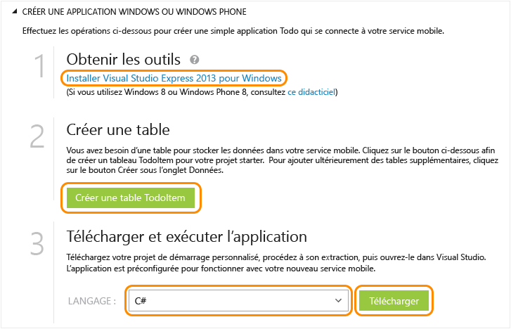

<properties
	pageTitle="Prise en main de Mobile Services pour les applications Windows Store (C#) | Microsoft Azure"
	description="Suivez ce didacticiel pour commencer à utiliser Azure Mobile Services pour le développement d’applications Windows Store en C#."
	services="mobile-services"
	documentationCenter="windows"
	authors="ggailey777"
	manager="dwrede"
	editor=""/>

<tags
	ms.service="mobile-services"
	ms.workload="mobile"
	ms.tgt_pltfrm="mobile-windows"
	ms.devlang="dotnet"
	ms.topic="get-started-article" 
	ms.date="11/06/2015"
	ms.author="glenga"/>

# Prise en main de Mobile Services

[AZURE.INCLUDE [mobile-services-selector-get-started](../../includes/mobile-services-selector-get-started.md)]&nbsp;

[AZURE.INCLUDE [mobile-services-hero-slug](../../includes/mobile-services-hero-slug.md)]

Ce didacticiel présente l’ajout d’un service principal cloud à une application Windows universelle à l’aide d’Azure Mobile Services. Les solutions d'application Windows universelles incluent des projets pour Windows Store 8.1 et Windows Phone Store 8.1, et un projet partagé commun. Pour plus d'informations, consultez la page [Créer des applications Windows universelles qui ciblent Windows et Windows Phone](http://msdn.microsoft.com/library/windows/apps/xaml/dn609832.aspx).

Dans ce didacticiel, vous allez créer un service mobile et une simple application *To do list* qui stocke les données d'application dans le nouveau service mobile. Le service mobile à créer utilise du code JavaScript pour la logique métier côté serveur. Pour créer un service mobile vous permettant d’écrire votre logique métier côté serveur dans les langages .NET pris en charge à l’aide de Visual Studio, consultez la version principale .NET de cette rubrique.

[AZURE.INCLUDE [mobile-services-windows-universal-get-started](../../includes/mobile-services-windows-universal-get-started.md)]

Pour réaliser ce didacticiel, vous avez besoin des éléments suivants :

* Un compte Azure actif. Si vous ne disposez pas déjà d'un compte Azure, vous pouvez obtenir une évaluation gratuite et 10 services mobiles gratuits que vous pouvez utiliser même après l'expiration de l'évaluation. Pour plus d'informations, consultez la page [Version d'évaluation gratuite d'Azure](http://azure.microsoft.com/pricing/free-trial/?WT.mc_id=A0E0E5C02&amp;returnurl=http%3A%2F%2Fazure.microsoft.com%2Ffr-FR%2Fdocumentation%2Farticles%2Fmobile-services-javascript-backend-windows-store-javascript-get-started%2F).
* [Visual Studio 2013 Express pour Windows]

## Création d’un service mobile

[AZURE.INCLUDE [mobile-services-create-new-service](../../includes/mobile-services-create-new-service.md)]

## Création d'une application Windows universelle

Après avoir créé votre service mobile, vous pouvez suivre un démarrage rapide facile dans le portail de gestion pour créer une application Windows universelle ou modifier un projet d'application Windows Store ou Windows Phone existant afin de vous connecter au service mobile.

Dans cette section, vous allez créer une application Windows universelle connectée à votre service mobile.

1.  Dans le portail de gestion, cliquez sur **Mobile Services**, puis sur le service mobile que vous venez de créer.

2. Dans l'onglet de démarrage rapide, cliquez sur **Windows** sous **Choisissez une plateforme** et développez **Créer une application Windows Store**.

   	Cette opération affiche les trois étapes faciles permettant de créer une application Windows Store connectée à votre service mobile.

  	

3. Si ce n'est pas déjà fait, téléchargez et installez [Visual Studio 2013 Express pour Windows] sur votre ordinateur local ou sur votre machine virtuelle.

4. Cliquez sur **Create TodoItem table** pour créer une table permettant de stocker les données d'application.

5. Sous **Download and run your app**, sélectionnez une langue pour votre application, puis cliquez sur **Télécharger**.

  	Cette opération télécharge le projet de votre exemple d'application *To do list* qui est connectée à votre service mobile. Enregistrez le fichier projet compressé sur votre ordinateur local et notez l'emplacement où vous l'avez enregistré.

## Exécution de votre application Windows

[AZURE.INCLUDE [mobile-services-javascript-backend-run-app](../../includes/mobile-services-javascript-backend-run-app.md)]

>[AZURE.NOTE]Vous pouvez vérifier le code qui se trouve dans le fichier MainPage.xaml.cs et permet d’accéder au service mobile pour exécuter une requête et insérer des données.

## Étapes suivantes
Vous avez terminé les étapes de démarrage rapide. Découvrez ensuite comment effectuer d’autres tâches importantes dans Mobile Services :

* [Prise en main de la synchronisation des données hors connexion] Découvrez comment utiliser la synchronisation des données hors connexion pour rendre votre application réactive et robuste.

* [Ajout de l’authentification à votre application Mobile Services][Get started with authentication] Découvrez comment authentifier les utilisateurs de votre application avec un fournisseur d’identité.

* [Ajouter les notifications push à votre application][Get started with push notifications] Découvrez comment envoyer une notification Push très basique à votre application.

* [Comment utiliser la bibliothèque cliente .NET](mobile-services-windows-dotnet-how-to-use-client-library.md) Découvrez comment interroger le service mobile, utiliser les données et accéder aux API personnalisées.

[AZURE.INCLUDE [app-service-disqus-feedback-slug](../../includes/app-service-disqus-feedback-slug.md)]

<!-- Anchors. -->
[Getting started with Mobile Services]: #getting-started
[Create a new mobile service]: #create-new-service
[Define the mobile service instance]: #define-mobile-service-instance
[Next Steps]: #next-steps

<!-- Images. -->

<!-- URLs. -->
[Prise en main de la synchronisation des données hors connexion]: mobile-services-windows-store-dotnet-get-started-offline-data.md
[Get started with authentication]: ../mobile-services-windows-store-dotnet-get-started-users.md
[Get started with push notifications]: ../mobile-services-javascript-backend-windows-store-dotnet-get-started-push.md
[Visual Studio 2013 Express pour Windows]: http://go.microsoft.com/fwlink/?LinkId=257546
[Mobile Services SDK]: http://go.microsoft.com/fwlink/?LinkId=257545
[Management Portal]: https://manage.windowsazure.com/
 

<!---HONumber=Nov15_HO3-->