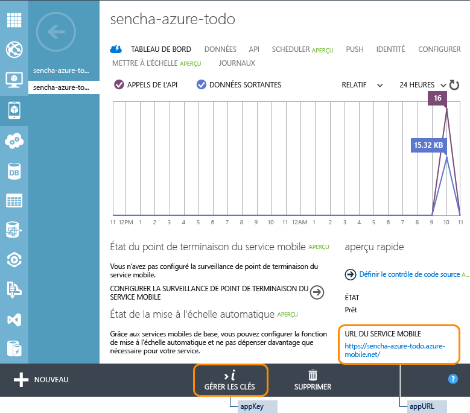

# Prise en main de Mobile Services et de Sencha Touch
[!INCLUDE [mobile-service-note-mobile-apps](../../includes/mobile-services-note-mobile-apps.md)]

&nbsp;

[!INCLUDE [mobile-services-selector-get-started](../../includes/mobile-services-selector-get-started.md)]

&nbsp;

[!INCLUDE [mobile-services-hero-slug](../../includes/mobile-services-hero-slug.md)]

## Vue d'ensemble
Ce didacticiel vous montre comment exploiter Azure Mobile Services dans votre application Sencha Touch. À l’aide de Sencha Touch, vous allez créer une application *To Do List* simple qui utilise un service mobile que vous allez définir dans le Portail Azure Classic. Ce didacticiel s'adresse aux développeurs d'applications Web de niveau intermédiaire ou avancé qui ont une bonne compréhension de JavaScript et sont familiarisés avec l'infrastructure Sencha Touch.

Si vous préférez regarder une vidéo, ce clip suit la même procédure que ce didacticiel. Dans cette vidéo, Arthur Kay explique comment créer une application Sencha Touch à l'aide d'un serveur principal Azure Mobile Services.

> [!VIDEO https://channel9.msdn.com/Series/Windows-Azure-Mobile-Services/Getting-Started-with-Windows-Azure-for-Sencha-Touch/player]
> 
> 

Voici une capture d'écran de l'application terminée :

![][0]

## Configuration requise
* Téléchargez et installez [Sencha Touch](http://wwww.sencha.com/products/touch/download" target="_blank").
* Téléchargez et installez [Sencha Cmd Tool](http://www.sencha.com/products/sencha-cmd/download" target="_blank").
* Java Runtime Environment (JRE) ou Java Development Kit (si vous créez des applications pour Android).
* Gem Ruby et SASS.

## Création d'un service mobile
[!INCLUDE [mobile-services-create-new-service](../../includes/mobile-services-create-new-service.md)]

## Création d'une table TodoItems
Après avoir créé votre service mobile, vous pouvez suivre un démarrage rapide facile dans le Portail Azure Classic pour créer une table de base de données à utiliser dans votre service mobile.

1. Dans le [Portail Azure Classic], cliquez sur **Mobile Services**, puis sur le service mobile que vous venez de créer.
2. Dans l'onglet de démarrage rapide, cliquez sur **HTML** sous **Choisissez une plateforme** et développez **Créer une application HTML**.
   
    
   
    Ceci affiche les trois étapes pour créer et héberger une application HTML connectée à votre service mobile.
   
    
3. Cliquez sur **Create TodoItems table** pour créer une table permettant de stocker les données d'application.
   
   > [!NOTE]
   > Ne téléchargez PAS l’application HTML à partir du Portail Azure Classic. Nous allons créer manuellement une application Sencha Touch dans la section suivante.
   > 
   > 
4. Notez les éléments **appKey** et **appUrl** dans le Portail Azure Classic. Nous les utiliserons dans d'autres sections de ce didacticiel.
   
    
5. Sous l'onglet **Configurer** vérifiez que `localhost` figure déjà dans la liste **Autoriser les demandes à partir des noms d'hôte** sous **Partage des ressources cross-origin (CORS)**. Si cela n'est pas le cas, entrez `localhost` dans le champ **Nom d'hôte**, puis cliquez sur **Enregistrer**.
   
    

## Génération de l'application Touch
La génération d'un modèle d'application Sencha Touch est une tâche simple qui fait appel à l'outil Sencha Cmd ; c'est aussi un moyen efficace pour mettre très rapidement à disposition une application.

À partir du répertoire dans lequel vous avez installé l'infrastructure Touch, exécutez la commande suivante :

    $ sencha generate app Basic /path/to/application

Cette commande génère un modèle d'application Sencha Touch nommé « Basic ». Pour démarrer votre application, pointez simplement votre navigateur vers le répertoire /path/to/application pour faire apparaître l'exemple d'application Sencha Touch standard.

## Installation des extensions Sencha Touch pour Azure
L'extension pour Azure s'installe manuellement ou par le biais d'un package Sencha. Le choix de la méthode vous revient entièrement.

### Installation manuelle
Pour la plupart des applications Touch, si vous souhaitez ajouter une bibliothèque de classes externe, il suffit de télécharger le package, de le décompresser dans le répertoire de l'application et de configurer le programme de téléchargement de Touch avec l'emplacement de la bibliothèque.

Vous pouvez ajouter manuellement les extensions Azure à votre application en procédant comme suit :

1. Téléchargez le package d'extensions pour Azure en cliquant [ici](https://market.sencha.com/extensions/sencha-extensions-for-microsoft-azure). Pour accéder à cet espace, vous pouvez utiliser votre ID de forums Sencha.
2. Copiez le package d'extensions pour Azure du répertoire de téléchargement vers le répertoire où vous souhaitez qu'il réside et décompressez-le :
   
        $ cd /path/to/application
        $ mv /download-location/azure.zip .
        $ unzip azure.zip
   
    Un dossier **azure** contenant les exemples, la documentation et la source du package est créé. La source résidera dans le répertoire **azure/src**.

### Installation d'un package Sencha
> [!NOTE]
> Cette méthode peut être utilisée uniquement si vous avez généré votre application à l’aide de la commande <code>sencha generate app</code>.
> 
> 

Toutes les applications générées à l'aide de l'outil Sencha Cmd affichent un dossier « packages » à la racine. L'emplacement de ce dossier peut être configuré. Néanmoins, quel que soit son emplacement, le dossier « packages » a pour fonction de servir d'emplacement de stockage pour tous les packages utilisés par votre application (ou vos applications si vous avez créé un espace de travail Sencha).

Ext.Azure étant un « package » de l'outil Sencha Cmd, le code source peut être facilement installé et inclus dans votre application à l'aide de Sencha Cmd. Pour plus d'informations, consultez la page [Packages de l'outil Sencha Cmd](http://docs.sencha.com/cmd/6.x/cmd_packages/cmd_packages.html).

Pour télécharger et installer le package d'extensions pour Azure à partir du référentiel Sencha Packages, vous devez ajouter le nom du package dans votre fichier **app.json** et créer votre application :

1. Ajoutez le package Azure à la section des prérequis de votre fichier app.json :
   
        {
            "name": "Basic",
            "requires": [
                "touch-azure"
            ]
        }
2. Recréez votre application à l'aide de **sencha cmd** pour récupérer et installer le package :
   
        $ sencha app build

Les commandes **sencha app build** et **sencha app refresh** effectuent alors les étapes requises pour intégrer le package à votre application. En général, après avoir modifié les prérequis de packages, vous devez exécuter la commande **sencha app refresh** afin de mettre à jour les métadonnées requises pour prendre en charge « dev mode ».

Quelle que soit la commande que vous exécutez, l'outil Sencha Cmd télécharge et développe le package dans votre dossier « packages ». Après quoi, un dossier « packages/touch-azure » apparaît dans votre espace de travail.

## Ajout et configuration d'Azure
**Nom de fichier** : app.js

Maintenant que l'extension Azure est téléchargée et installée dans le répertoire de votre application, l'étape suivante consiste à indiquer à votre application où trouver les fichiers sources et à demander ces fichiers :

1. Configurez le programme de chargement de Sencha en spécifiant l'emplacement du code source :
   
        Ext.Loader.setConfig({
               enabled : true,
               paths   : {
                   'Ext'       : 'touch/src',
                   'Ext.azure' : '/path-to/azure-for-touch/azure/src'
            }
        });
2. Demandez les fichiers de classe Azure :
   
        Ext.application({
   
            requires: [ 'Ext.azure.Azure' ],
   
            // ...
   
        });
3. Configurez Azure.
   
    Le package Azure est initialisé en appelant la méthode **Ext.Azure.init** dans la section de lancement de votre application. Cette méthode reçoit un objet de configuration contenant les informations d'identification du service mobile, ainsi que d'autres informations d'identification et fonctionnalités que vous souhaitez utiliser.
   
    Bien que vous puissiez transmettre l'objet de configuration directement à la méthode init, nous suggérons de créer une propriété de configuration pour l'application Sencha nommée **azure** et d'y placer toutes les informations pertinentes. Vous pourrez alors transmettre la valeur de cette propriété à la méthode Ext.Azure.init.
   
    Lorsque vous créez un service mobile dans Azure (consultez la page [Prise en main d'Azure](http://senchaazuredocs.azurewebsites.net/#!/guide/getting_started)), une clé d'application et une URL sont associées au service. Ces informations doivent être ajoutées au package Azure afin que celui-ci puisse se connecter au service.
   
    L'exemple suivant montre une configuration et une initialisation très basiques d'Azure utilisant uniquement la clé d'application et l'URL :
   
        Ext.application({
            name: 'Basic',
   
            requires: [ 'Ext.azure.Azure' ],
   
            azure: {
                appKey: 'myazureservice-access-key',
                appUrl: 'myazure-service.azure-mobile.net'
            },
   
            launch: function() {
   
                // Call Azure initialization
   
                Ext.Azure.init(this.config.azure);
   
            }
        });
   
    Pour plus d'informations sur les options de configuration pour Azure, consultez la documentation sur l'API Ext.Azure.

Félicitations ! Votre application est maintenant en mesure d'accéder à votre service mobile.

## Création d'une application ToDo
La configuration de votre application pour inclure l'extension Azure étant terminée et les informations d'identification du service mobile transmises, nous pouvons maintenant créer une application Touch qui utilise votre service mobile pour afficher et modifier les données de votre liste ToDo stockées dans le service.

### Configuration du serveur proxy des données Azure
**Nom de fichier** : app/model/TodoItem.js

Votre application Touch va communiquer avec votre service mobile par le biais d'un serveur proxy de données. Celui-ci se charge à la fois d'envoyer les requêtes au service mobile et d'en recevoir les données. Utilisé avec un modèle de données et un magasin Touch, toutes les tâches fastidieuses qui consistent à traiter les données distantes et à les inclure à votre application sont effectuées directement par Touch.

Les modèles Sencha Touch fournissent la définition des enregistrements de données que vous utiliserez dans votre application. Ils vous permettent non seulement de définir les champs de données, mais aussi de fournir une configuration du serveur proxy qui se chargera de la communication entre l'application et le service mobile Azure.

Dans le code ci-dessous, nous définissons les champs (et leurs types) pour le modèle et nous fournissons une configuration au serveur proxy. Lors de la configuration de votre serveur proxy, vous devrez lui attribuer un type (dans ce cas « azure »), lui fournir le nom de table du service mobile (ToDoItem), ainsi que d'autres paramètres facultatifs. Dans cet exemple, nous activons la pagination du proxy afin que nous puissions accéder aux pages précédentes et suivantes par le biais des éléments de la liste.

Le proxy Azure va automatiquement définir tous les en-têtes HTTP avec les opérations CRUD appropriées attendues par l'API Azure (y compris les informations d'identification d'authentification, si elles existent).

    Ext.define('Basic.model.TodoItem', {
        extend : 'Ext.data.Model',

        requires : [
            'Ext.azure.Proxy'
        ],

        config : {
            idProperty : 'id',
            useCache   : false,

            fields     : [
                {
                    name : 'id',
                    type : 'int'
                },
                {
                    name : 'text',
                    type : 'string'
                },
                {
                    name : 'complete',
                    type : 'boolean'
                }
            ],

            proxy : {
                type               : 'azure',
                tableName          : 'TodoItem',
                enablePagingParams : true
            }
        }
    });

### Stockage de vos éléments ToDo
**Nom de fichier** : app/store/TodoItems.js

Les magasins Sencha Touch permettent de stocker des collections d'enregistrements de données (modèles) pouvant servir de sources aux composants Touch pour l'affichage des enregistrements d'une multitude de façons (sous forme de grille, de tableau, de liste, etc.).

Dans cette étape, nous allons définir un magasin dans lequel seront stockés tous les éléments de votre liste ToDo récupérés à partir de votre service mobile Azure. Notez que la configuration du magasin contient le nom du type de modèle (Basic.model.TodoItem, défini ci-dessus). Cela détermine la structure des enregistrements qui seront contenus dans le magasin.

Vous pouvez également définir des options de configuration supplémentaires pour le magasin, comme la taille de police (8 enregistrements) et le tri à distance des enregistrements du magasin par le service mobile Azure (aucun tri n'est possible localement à partir du magasin lui-même).

    Ext.define('Basic.store.TodoItems', {
        extend : 'Ext.data.Store',

        requires : [
            'Basic.model.TodoItem'
        ],

        config : {
            model        : 'Basic.model.TodoItem',
            pageSize     : 8,
            remoteSort   : true,
            remoteFilter : true
        }
    });

### Affichage et modification de vos éléments ToDo
**Nom de fichier** : app/view/DataItem.js

Maintenant que la structure de chaque élément ToDo est définie et qu'un magasin a été créé pour y stocker tous les enregistrements, nous devons réfléchir à la manière dont nous voulons que ces informations apparaissent à l'utilisateur de l'application. Généralement, les informations visibles à l'utilisateur sont affichées dans des **vues**. Une vue peut représenter n'importe lequel des composants Touch, seul ou associé à d'autres.

La liste ci-dessous comprend un élément de liste qui définit la manière dont chaque enregistrement sera affiché, ainsi que des boutons qui permettent d'effectuer des actions pour supprimer chaque élément.

    Ext.define('Basic.view.DataItem', {
        extend : 'Ext.dataview.component.ListItem',
        xtype  : 'basic-dataitem',

        requires : [
            'Ext.Button',
            'Ext.layout.HBox',
            'Ext.field.Checkbox'
        ],

        config : {
            checkbox : {
                docked     : 'left',
                xtype      : 'checkboxfield',
                width      : 50,
                labelWidth : 0
            },

            text : {
                flex : 1
            },

            button : {
                docked   : 'right',
                xtype    : 'button',
                ui       : 'plain',
                iconMask : true,
                iconCls  : 'delete',
                style    : 'color: red;'
            },

            dataMap : {
                getText : {
                    setHtml : 'text'
                },

                getCheckbox : {
                    setChecked : 'complete'
                }
            },

            layout : {
                type : 'hbox',
                align: 'stretch'
            }
        },

        applyCheckbox : function(config) {
            return Ext.factory(config, Ext.field.Checkbox, this.getCheckbox());
        },

        updateCheckbox : function (cmp) {
            if (cmp) {
                this.add(cmp);
            }
        },

        applyButton : function(config) {
            return Ext.factory(config, Ext.Button, this.getButton());
        },

        updateButton : function (cmp) {
            if (cmp) {
                this.add(cmp);
            }
        }

    });

### Création d'une vue principale
**Nom de fichier** : app/view/Main.js

Maintenant que nous avons défini la mise en page d'un élément de liste ToDo individuel (ci-dessus), nous allons créer une interface utilisateur complète autour de cette liste qui définit la liste des éléments, un titre pour l'application et un bouton pour ajouter une nouvelle tâche.

    Ext.define('Basic.view.Main', {
        extend : 'Ext.dataview.List',
        xtype  : 'main',

        requires : [
            'Ext.TitleBar',
            'Ext.dataview.List',
            'Ext.data.Store',
            'Ext.plugin.PullRefresh',
            'Ext.plugin.ListPaging',
            'Basic.view.DataItem'
        ],

        config : {
            store : 'TodoItems',

            useSimpleItems : false,
            defaultType    : 'basic-dataitem',

            plugins : [
                {
                    xclass          : 'Ext.plugin.PullRefresh',
                    pullRefreshText : 'Pull down to refresh!'
                },
                {
                    xclass     : 'Ext.plugin.ListPaging',
                    autoPaging : true
                }
            ],

            scrollable : {
                direction     : 'vertical',
                directionLock : true
            },

            items : [
                {
                    docked : 'top',
                    xtype  : 'titlebar',
                    title  : 'Azure Mobile - Basic Data Example'
                },
                {
                    xtype  : 'toolbar',
                    docked : 'bottom',
                    items  : [
                        {
                            xtype       : 'textfield',
                            placeHolder : 'Enter new task',
                            flex        : 1
                        },
                        {
                            xtype  : 'button',
                            action : 'add',
                            text   : 'Add'
                        }
                    ]
                }
            ]
        }
    });

### Coordination des éléments
**Nom de fichier** : app/controller/Main.js

La dernière étape consiste à associer une réponse aux activations des boutons (supprimer, enregistrer, etc.) et à définir la logique sous-jacente à ces requêtes. Sencha Touch utilise des contrôleurs qui écoutent ces événements et y répond en conséquence.

    Ext.define('Basic.controller.Main', {
        extend : 'Ext.app.Controller',

        config : {
            refs : {
                todoField : 'main toolbar textfield',
                main      : 'main'
            },

            control : {
                'button[action=add]'    : {
                    tap : 'onAddItem'
                },
                'button[action=reload]' : {
                    tap : 'onReload'
                },

                main : {
                    activate      : 'loadInitialData',
                    itemdoubletap : 'onItemEdit'
                },

                'basic-dataitem checkboxfield' : {
                    change : 'onItemCompleteTap'
                },

                'basic-dataitem button' : {
                    tap : 'onItemDeleteTap'
                }
            }
        },

        loadInitialData : function () {
            Ext.getStore('TodoItems').load();
        },

        onItemDeleteTap : function (button, e, eOpts) {
            var store    = Ext.getStore('TodoItems'),
                dataItem = button.up('dataitem'),
                rec      = dataItem.getRecord();

            rec.erase({
                success: function (rec, operation) {
                    store.remove(rec);
                },
                failure: function (rec, operation) {
                    Ext.Msg.alert(
                        'Error',
                        Ext.util.Format.format('There was an error deleting this task.      Status Code: {0} Status Text: {1}',
                        operation.error.status,
                        operation.error.statusText)
                    );
                }
            });
        },

        onItemCompleteTap : function (checkbox, newVal, oldVal, eOpts) {
            var dataItem = checkbox.up('dataitem'),
                rec      = dataItem.getRecord(),
                recVal   = rec.get('complete');

            // this check is needed to prevent an issue where multiple creates get triggered from one create
            if (newVal !== recVal) {
                rec.set('complete', newVal);
                rec.save({
                    success: function (rec, operation) {
                        rec.commit();
                    },
                    failure: function (rec, operation) {
                        // since there was a failure doing the update on the server then silently reject the change
                        rec.reject(true);
                        Ext.Msg.alert(
                            'Error',
                            Ext.util.Format.format('There was an error updating this task.  Status Code: {0} Status Text: {1}',
                            operation.error.status,
                            operation.error.statusText)
                        );
                    }
                });
            }
        },

        onItemEdit : function (list, index, target, record, e, eOpts) {
            var rec = list.getSelection()[0];

            Ext.Msg.prompt('Edit', 'Rename task',
                function (buttonId, value) {
                    if (buttonId === 'ok') {
                        rec.set('text', value);
                        rec.save({
                            success: function (rec, operation) {
                                rec.commit();
                            },
                            failure: function (rec, operation) {
                                // since there was a failure doing the update on the server then reject the change
                                rec.reject();
                                Ext.Msg.alert(
                                    'Error',
                                    Ext.util.Format.format('There was an error updating this task.  Status Code: {0} Status Text: {1}',
                                    operation.error.status,
                                    operation.error.statusText)
                                );
                            }
                        });
                    }
                },
                null,
                false,
                record.get('text')
            );
        },

        onReload : function () {
            Ext.getStore('TodoItems').load();
        },

        onAddItem : function () {
            var me = this,
                rec,
                store = Ext.getStore('TodoItems'),
                field = me.getTodoField(),
                value = field.getValue();

            if (value === '') {
                Ext.Msg.alert('Error', 'Please enter Task name', Ext.emptyFn);
            }
            else {
                rec = Ext.create('Basic.model.TodoItem', {
                    complete : false,
                    text     : value
                });
                //store.insert(0, rec); //insert at the top
                //store.sync();
                rec.save({
                    success: function (rec, operation) {
                        store.insert(0, rec); //insert at the top
                        field.setValue('');
                    },
                    failure: function (rec, operation) {
                        Ext.Msg.alert(
                            'Error',
                            Ext.util.Format.format('There was an error creating this task.  Status Code: {0} Status Text: {1}',
                            operation.error.status,
                            operation.error.statusText)
                        );
                    }
                });
            }
        }
    });

### Assemblage
**Nom de fichier** : app.js

L'ultime étape consiste à terminer de modifier le fichier d'application principal et à fournir des informations sur les modèles, les magasins, les vues et les contrôleurs que nous avons définis. Les fichiers sources de ces ressources sont automatiquement chargés dans l'application. Pour finir, la méthode de lancement est appelée ; la vue principale de l'application « Basic.main.View » est créée et apparaît.

    Ext.Loader.setConfig({
        enabled : true,
        paths   : {
            'Ext'       : 'touch/src',
            'Ext.azure' : 'packages/azure/src'
        }
    });

    Ext.application({
        name : 'Basic',

        requires : [
            'Ext.MessageBox',
            'Ext.azure.Azure'
        ],

        views : [
            'Main'
        ],

        controllers : [
            'Main'
        ],

        stores : [
            'TodoItems'
        ],

        azure : {
            appUrl : 'YOUR_APP_URL.azure-mobile.net',
            appKey : 'YOUR_APP_KEY'
        },

        icon : {
            '57'  : 'resources/icons/Icon.png',
            '72'  : 'resources/icons/Icon~ipad.png',
            '114' : 'resources/icons/Icon@2x.png',
            '144' : 'resources/icons/Icon~ipad@2x.png'
        },

        isIconPrecomposed : true,

        startupImage : {
            '320x460'   : 'resources/startup/320x460.jpg',
            '640x920'   : 'resources/startup/640x920.png',
            '768x1004'  : 'resources/startup/768x1004.png',
            '748x1024'  : 'resources/startup/748x1024.png',
            '1536x2008' : 'resources/startup/1536x2008.png',
            '1496x2048' : 'resources/startup/1496x2048.png'
        },

        launch : function () {
            // Destroy the #appLoadingIndicator element
            Ext.fly('appLoadingIndicator').destroy();

            // Initialize Azure
            Ext.Azure.init(this.config.azure);

            // Initialize the main view
            Ext.Viewport.add(Ext.create('Basic.view.Main'));
        },

        onUpdated : function () {
            Ext.Msg.confirm(
                "Application Update",
                "This application has just successfully been updated to the latest version. Reload now?",
                function (buttonId) {
                    if (buttonId === 'yes') {
                        window.location.reload();
                    }
                }
            );
           }
    });

### Hébergement et exécution de votre application Sencha Touch
La dernière étape de ce didacticiel consiste à héberger et exécuter votre nouvelle application sur votre ordinateur local.

1. Sur votre terminal, accédez à l'emplacement où se trouve votre application décompressée.
2. À l'aide de l'outil Sencha Cmd, exécutez les commandes suivantes :
   
   * *sencha app refresh* : cette commande indique à l'outil Sencha Cmd de localiser toutes les dépendances de l'application et de télécharger tous les packages nécessaires (par exemple, [Extensions Sencha Touch pour Azure](https://market.sencha.com/extensions/sencha-extensions-for-microsoft-azure)).
   * *sencha web start* : cette commande démarre un serveur web local pour tester notre application.
   
   
3. Ouvrez l’URL indiquée sur votre terminal dans un navigateur web pour démarrer l’application (par exemple, http://localhost:1841).
4. Dans l'application, tapez un texte explicite, comme « Suivre le didacticiel », puis cliquez sur **Ajouter**.
   
   
   
   Ceci envoie une demande POST vers le nouveau service mobile hébergé dans Azure. Les données de la requête sont insérées dans la table TodoItem.
5. De retour dans le [Portail Azure Classic], cliquez sur l’onglet **Données**, puis sur la table TodoItems.
   
   
   
   Cela vous permet de parcourir les données insérées par l'application dans la table.
   
   

## Étapes suivantes
Maintenant que vous avez terminé le guide de prise en main, découvrez comment effectuer d'autres tâches importantes dans Mobile Services avec Sencha.

[Téléchargez](https://github.com/arthurakay/sencha-touch-azure-example) un exemple d'application complet contenant des styles et des fonctionnalités supplémentaires pour découvrir de quoi Sencha Touch est capable !

Pour plus d'informations sur les extensions Sencha Touch pour Azure :

* [Procédure pas à pas](http://docs.sencha.com/touch-azure/1.0.0/#!/guide/data_filters) sur un modèle d'application
* Aide des [Forums Sencha](http://www.sencha.com/forum)
* [Documentation Sencha](http://docs.sencha.com/)
* Utilisation de Sencha avec Azure Mobile Services : [(Vidéo)](http://channel9.msdn.com/Shows/Cloud+Cover/Episode-126-Using-Sencha-With-Windows-Azure-Mobile-Services)

## Ressources supplémentaires
* [Téléchargez Sencha Touch](http://pages.sencha.com/touch-for-azure.html)
* [Extensions Sencha Touch pour Azure](https://market.sencha.com/extensions/sencha-extensions-for-microsoft-azure)

## Résumé
L'exemple présenté ici est inclus dans le package d'extensions Sencha Touch pour Azure et se trouve dans le répertoire d'exemples, tout comme l'exemple de données de base. D'autres exemples sont disponibles dans lesquels sont expliquées et commentées en détail d'autres fonctionnalités de cette extension.

Pour plus d'informations sur la prise en main de Sencha Touch, consultez l'ensemble des [guides](http://docs.sencha.com/touch/#!/guide)

[!INCLUDE [app-service-disqus-feedback-slug](../../includes/app-service-disqus-feedback-slug.md)]

<!-- images -->
[0]: ./media/partner-sencha-mobile-services-get-started/finished-app.png

[Portail Azure Classic]: https://manage.windowsazure.com/

<!---HONumber=AcomDC_0727_2016-->