# Prise en main d’Azure Monitor
Azure Monitor est un nouveau service de plateforme qui fournit une source unique d’analyse des ressources Azure. Avec Azure Monitor, vous pouvez visualiser, interroger, acheminer, archiver et agir sur les mesures et journaux provenant de vos ressources Azure. Vous pouvez travailler avec ces données à l’aide du panneau du portail Monitor, les applets de commande PowerShell Insights, l’interface de ligne de commande multiplateforme ou les API REST d’Azure Insights. Dans cet article, nous étudions quelques composants clés d’Azure Monitor.

1. Dans le portail, accédez à **Plus de services** et recherchez l’option **Monitor**. Cliquez sur l’étoile pour ajouter cette option à votre liste de favoris afin qu’elle soit toujours facilement accessible à partir de la barre de navigation de gauche.
   
    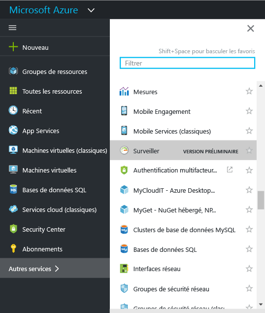
2. Cliquez sur l’option **Monitor** pour ouvrir le panneau **Monitor**. Ce panneau rassemble tous vos paramètres de surveillance et données dans une vue consolidée. Il ouvre d’abord la section **Journal d’activité** .
   
    
   
   > [!WARNING]
   > Les options **Notifications de service** et **Groupes de notifications** affichées sont disponibles dans la version préliminaire privée uniquement.
   > 
   > 
   
    Azure Monitor a trois catégories de base de données d’analyse de données : le journal d’activité, les mesures et les journaux de diagnostic.
3. Cliquez sur le **Journal d’activité** pour vous assurer que la section du journal d’activité est affichée.
   
    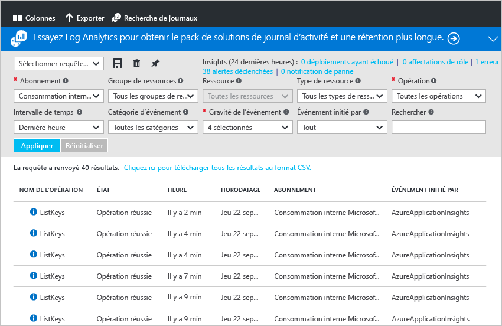
   
    Le **journal d’activité** décrit toutes les opérations effectuées sur les ressources dans votre abonnement. Avec le journal d’activité, vous pouvez déterminer « qui, quand et quoi » pour toutes les opérations d’écriture sur des ressources dans votre abonnement. Par exemple, le journal d’activité vous indique lorsqu’une application web s’est arrêtée et qui l’a arrêtée. Les événements du journal d’activité sont stockés dans la plateforme pendant 90 jours.
   
    Vous pouvez créer et enregistrer des requêtes pour les filtres courants, puis épingler les requêtes les plus importantes à un tableau de bord du portail pour que vous sachiez toujours si les événements qui répondent à vos critères se sont produits.
4. Filtrez l’affichage sur un groupe de ressources particulier sur la semaine dernière, puis cliquez sur le bouton **Enregistrer** .
   
    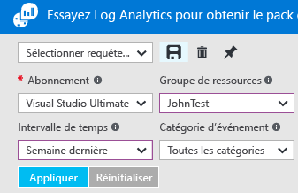
5. Maintenant, cliquez sur le **Épingler** .
   
    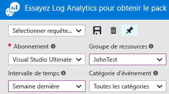
   
    La plupart des vues de cette procédure pas à pas peuvent être épinglées à un tableau de bord. Cela vous permet de créer une seule source d’informations pour les données opérationnelles sur vos services. 
6. Revenez à votre tableau de bord. Vous pouvez maintenant voir que la requête et le nombre de résultats sont affichés dans votre tableau de bord.
   
    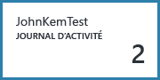
7. Revenez à la vignette **Monitor** et cliquez sur la section **Mesures**. Vous devez d’abord sélectionner une ressource en filtrant et en sélectionnant l’aide des options en haut de la section.
   
    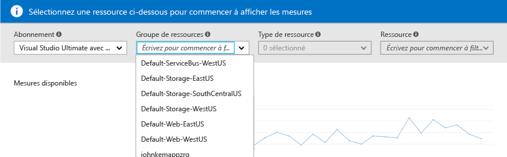
   
    Toutes les ressources Azure émettent des mesures. Cette vue réunit l’ensemble en un point unique.
8. Une fois que vous avez sélectionné une ressource, toutes les mesures disponibles s’affichent sur la gauche du panneau. Vous pouvez afficher plusieurs métriques à la fois en sélectionnant des mesures et en modifiant le type et la plage horaire du graphique. Vous pouvez également afficher toutes les alertes de mesures définies pour cette ressource.
   
    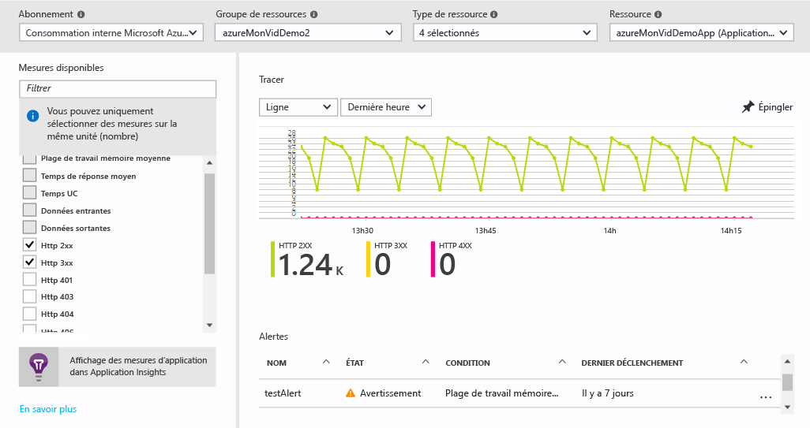
   
   > [!NOTE]
   > Certaines mesures sont uniquement disponibles en activant [Application Insights](../application-insights/app-insights-overview.md) sur votre ressource.
   > 
   > 
9. Lorsque votre tableau vous satisfait, vous pouvez utiliser le bouton **Épingler** pour l’épingler à votre tableau de bord.
10. Revenez au panneau **Monitor** et cliquez sur **Journaux de diagnostic**.
    
    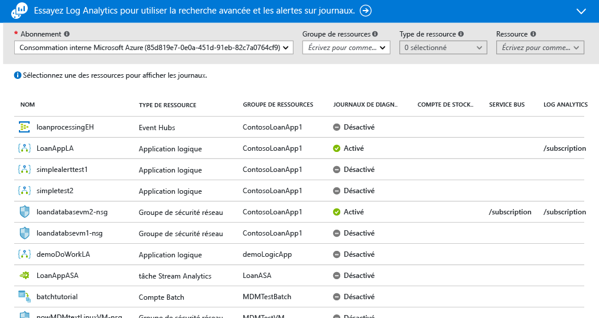
    
    Les journaux de diagnostic sont des journaux émis par une ressource qui fournissent des informations relatives à l’opération de cette ressource particulière. Par exemple, les compteurs de règle de groupe de sécurité réseau et les journaux de flux de travail d’application logique sont des types de journaux de diagnostic. Ces journaux peuvent être stockés sur un compte de stockage, diffusés sur un hub d’événements et/ou envoyés à [Log Analytics](../log-analytics/log-analytics-overview.md), le produit de surveillance opérationnelle de Microsoft, pour la recherche avancée et les alertes.
    
    Dans le portail, vous pouvez afficher et filtrer une liste de toutes les ressources dans votre abonnement pour déterminer si leurs journaux de diagnostic sont activés.
11. Cliquez sur une ressource dans le panneau des journaux de diagnostic. Si les journaux de diagnostic sont stockés dans un compte de stockage, vous verrez une liste des journaux horaires que vous pouvez télécharger directement. Vous pouvez également cliquer sur « Activer/désactiver les diagnostics, » ce qui vous permet de définir l’archivage sur un compte de stockage,la diffusion vers des hubs d’événements, ou l’envoi à un espace de travail Log Analytics.
    
    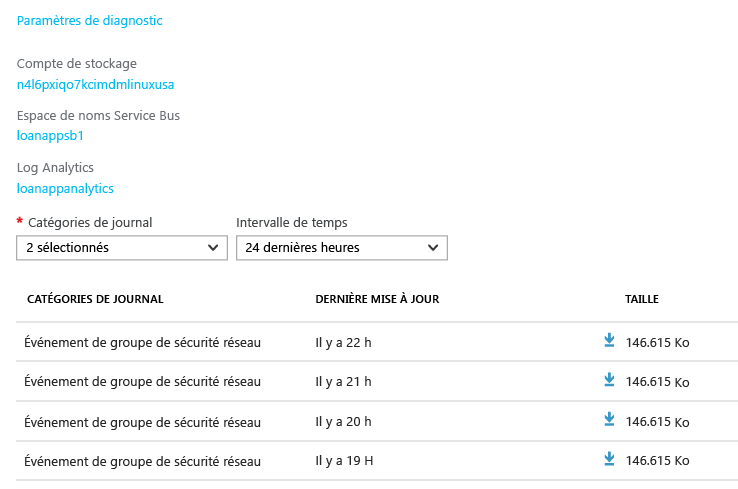
    
    Si vous avez configuré les journaux de diagnostic dans Log Analytics, vous pouvez les rechercher dans la section **Recherche dans les journaux** du portail.
12. Accédez à la section **Alertes** du panneau Monitor.
    
    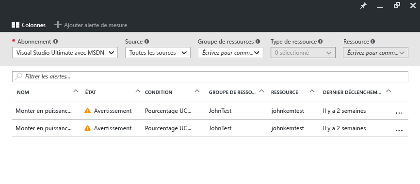
    
    Ici, vous pouvez gérer toutes les alertes sur vos ressources Azure. Cela inclut les alertes sur les mesures, événements de journal d’activité (version préliminaire), tests web Application Insights (emplacements) et diagnostics proactifs Application Insights. Les alertes peuvent déclencher l’envoi d’un e-mail ou POST à un webhook.
13. Cliquez sur **Ajouter une alerte de mesure** pour créer une alerte.
    
    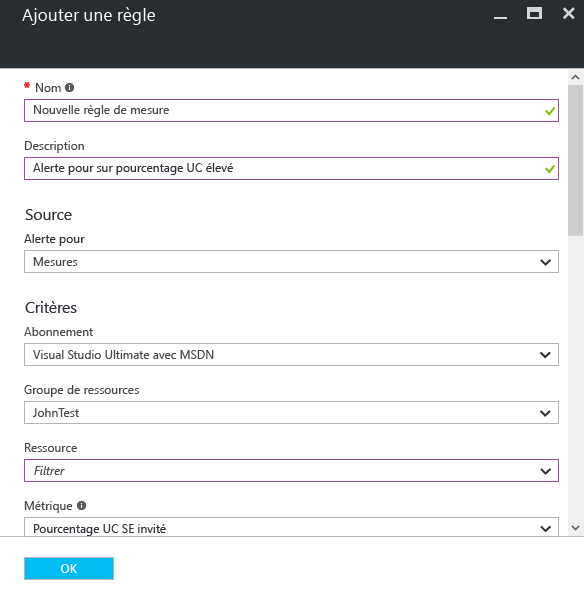
    
    Vous pouvez ensuite épingler une alerte à votre tableau de bord pour afficher facilement son état à tout moment.
14. La section Monitor inclut également des liens vers les applications [Application Insights](../application-insights/app-insights-overview.md) et les solutions de gestion [Log Analytics](../log-analytics/log-analytics-overview.md). Ces autres produits Microsoft ont une intégration approfondie avec moniteur Azure Monitor.
15. Si vous n’utilisez pas Application Insights ou Log Analytics, il est possible qu’Azure Monitor ait un partenariat avec vos produits actuels d’analyse, de journalisation et d’alerte. Consultez notre [page partenaires](monitoring-partners.md) pour obtenir la liste complète et des instructions pour l’intégration.

En suivant ces étapes et en épinglant toutes les mosaïques pertinentes à un tableau de bord, vous pouvez créer des vues complètes de votre application et de votre infrastructure, comme ici :

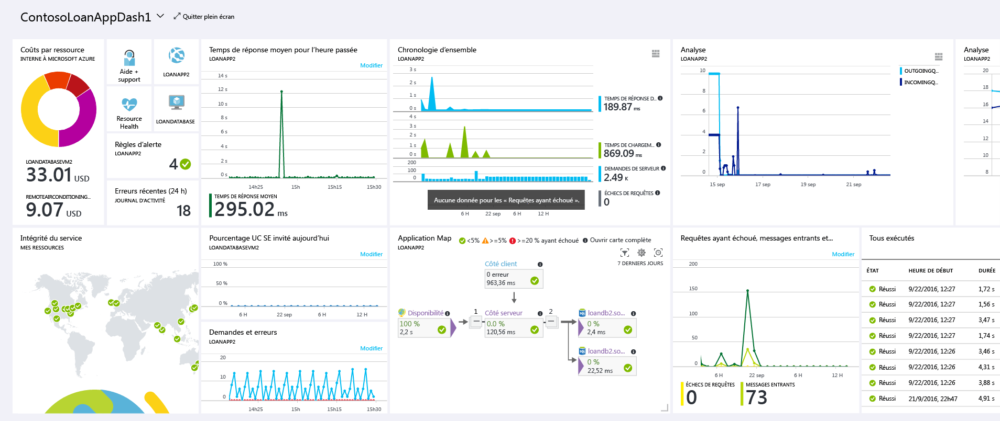

## Étapes suivantes
* Lisez la [Présentation d’Azure Monitor](monitoring-overview.md)

<!--HONumber=Oct16_HO2-->

