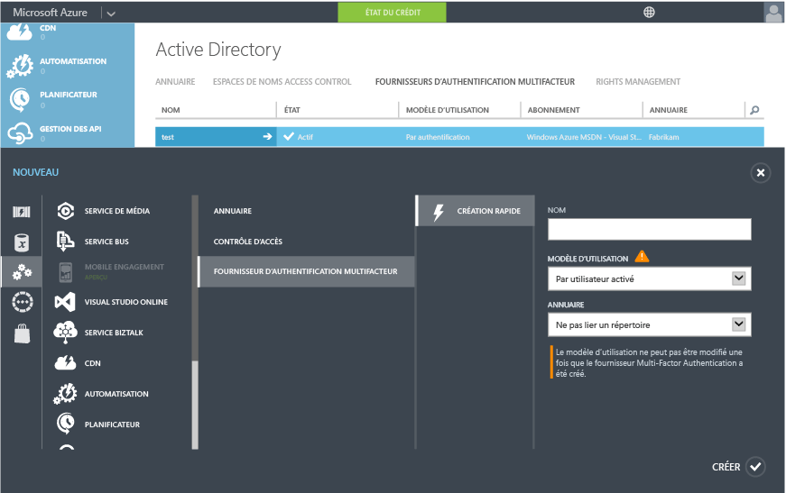

<properties 
	pageTitle="Prise en main avec Azure Multi-Factor Authentication dans le cloud" 
	description="Voici la page sur Azure Multi-Factor Authentication qui décrit la prise en main de l'authentification multifacteur Azure dans le cloud." 
	services="multi-factor-authentication" 
	documentationCenter="" 
	authors="billmath" 
	manager="stevenpo" 
	editor="curtand"/>

<tags 
	ms.service="multi-factor-authentication" 
	ms.workload="identity" 
	ms.tgt_pltfrm="na" 
	ms.devlang="na" 
	ms.topic="get-started-article" 
	ms.date="11/17/2015" 
	ms.author="billmath"/>

# Prise en main avec Azure Multi-Factor Authentication dans le cloud

Maintenant que nous avons déterminé que nous utilisons l’authentification multifacteur dans le cloud, nous pouvons commencer ! Veuillez noter que si vous utilisez Multi-Factor Authentication pour Office 365 ou Multi-Factor Authentication pour les administrateurs Azure, vous pouvez passer à l'étape 3. En outre, ce document traite des points suivants

1. **Souscrivez un abonnement Azure**
	- Si vous n'avez pas encore d'abonnement Azure, vous pouvez vous inscrire gratuitement. Si vous êtes nouveau et si vous faites vos premiers pas avec Azure MFA, vous pouvez utiliser un abonnement d'évaluation
2. **Créez un fournisseur Multi-Factor Auth ou attribuez une licence Azure AD Premium ou Enterprise Mobility Suite aux utilisateurs**
	- Vous devez créer un fournisseur Azure Multi-Factor Auth et l’attribuer à votre répertoire ou bien, attribuez des licences à vos utilisateurs Azure AD Premium ou EMS. Azure Multi-Factor Authentication est inclus dans Azure Active Directory Premium et par conséquent il est également inclus dans Enterprise Mobility Suite. Si vous disposez d’Azure AD Premium ou d’EMS, vous n'avez pas besoin de créer un fournisseur Multi-Factor Auth. En revanche, pour activer MFA pour un utilisateur Azure AD Premium ou EMS, une licence Azure AD Premium ou EMS doit être attribuée à cet utilisateur. Ensuite, un administrateur peut attribuer MFA à l'utilisateur via le portail de gestion. Pour savoir comment attribuer des licences aux utilisateurs, consultez la section ci-dessous.
3. **Activez Multi-Factor Authentication pour vos utilisateurs** 
	- Activez Azure MFA sur vos utilisateurs via Office 365 ou le portail Azure. Consultez la section ci-dessous pour plus d'informations sur la procédure à suivre.
4. **Envoyez un e-mail aux utilisateurs pour les informer de MFA**
	- Une fois que l’authentification multifacteur est activée dans le compte d’un utilisateur, il est recommandé de lui envoyer un e-mail pour l’informer de ce changement. L'utilisateur ne sera donc pas surpris lorsqu’il sera invité à terminer le processus la prochaine fois qu’il se connectera. Consultez la section ci-dessous pour un exemple de modèle d’e-mail.

## Création d'un fournisseur Azure Multi-Factor Auth
Multi-Factor Authentication est disponible par défaut pour les administrateurs généraux ayant un locataire Azure Active Directory. Toutefois, si vous souhaitez étendre Multi-Factor Authentication à tous vos utilisateurs et/ou souhaitez que vos administrateurs généraux puissent tirer pleinement parti de certaines fonctionnalités telles que le portail de gestion, les messages de bienvenue personnalisés et les rapports, vous devez acheter et configurer un fournisseur Multi-Factor Authentication.

### Pour créer un fournisseur Multi-Factor Auth
--------------------------------------------------------------------------------

1. Connectez-vous au portail Azure en tant qu’administrateur.
2. Sélectionnez Active Directory à gauche.
3. Sur la page Active Directory, en haut, sélectionnez les fournisseurs Multi-Factor Authentication. Cliquez sur **Nouveau** au bas de la page.
4. Sous App Services, sélectionnez les fournisseurs Active Auth et sélectionnez Création rapide.
5. Renseignez les champs suivants et sélectionnez Créer.
	1. Nom – nom du fournisseur Active Auth.
	2. Modèle d'utilisation – modèle d'utilisation du fournisseur Multi-Factor Authentication.
		- Par authentification – modèle d'achat facturé par authentification. Généralement utilisé pour les scénarios qui utilisent Azure Multi-Factor Authentication dans une application.
		- Par utilisateur activé – modèle d'achat facturé par utilisateur activé. Généralement utilisé pour les scénarios comme Office 365.
	2. Répertoire – locataire Azure Active Directory auquel le fournisseur Multi-Factor Authentication est associé. Soyez conscient des éléments suivants :
		- Vous n'avez pas besoin d’un répertoire Azure AD pour créer un fournisseur Multi-Factor Auth. Cela peut être vide si vous prévoyez d'utiliser le serveur Azure Multi-Factor Authentication ou le kit de développement logiciel (SDK) uniquement.
		- Vous aurez besoin d’associer le fournisseur Multi-Factor Auth à un répertoire Azure AD si vous souhaitez étendre Multi-Factor Authentication à tous vos utilisateurs et/ou souhaitez que vos administrateurs généraux puissent tirer pleinement parti de certaines fonctionnalités telles que le portail de gestion, les messages de bienvenue personnalisés et les rapports.
		- DirSync ou AAD Sync sont nécessaires uniquement si vous synchronisez votre environnement Active Directory local avec un répertoire Azure AD. Si vous utilisez uniquement un répertoire Azure AD qui n'est pas synchronisé avec une instance locale d'Active Directory, DirSync ou AAD Sync est inutile.
		

5. Une fois que vous cliquez sur Créer, le fournisseur Multi-Factor Authentication est créé et vous devriez voir un message indiquant : le fournisseur Multi-Factor Authentication a été créé correctement. Cliquez sur OK.

## Attribution d’une licence Azure AD Premium ou Enterprise Mobility Suite aux utilisateurs

Si vous avez Azure AD Premium ou Enterprise Mobility Suite, il est inutile de créer un fournisseur Multi-Factor Auth. Vous devez simplement attribuer un utilisateur à une licence puis vous pourrez activer MFA pour les utilisateurs.

### Attribuer une licence Azure AD Premium ou Enterprise Mobility Suite
--------------------------------------------------------------------------------
<ol>

<li>Connectez-vous au portail Azure en tant qu’administrateur.</li>
<li>Sélectionnez **Active Directory** à gauche.</li>
<li>Sur la page Active Directory, double-cliquez sur le répertoire qui contient les utilisateurs que vous souhaitez activer.</li>
<li>En haut de la page du répertoire, sélectionnez **Licences**.</li>
<li>Sur la page des licences, sélectionnez Active Directory Premium ou Enterprise Mobility Suite, puis cliquez sur **Attribuer**.</li>

<li>Dans la boîte de dialogue, sélectionnez les utilisateurs auxquels vous souhaitez attribuer des licences, puis cliquez sur l’icône de coche pour enregistrer les modifications.</li>

## Activez l’authentification multifacteur pour vos utilisateurs

Les comptes d'utilisateur dans Azure Multi-Factor Authentication peuvent présenter les trois états suivants :

État | Description |Applications autres que des navigateurs affectées| Remarques 
:-------------: | :-------------: |:-------------: |:-------------: |
Désactivé | État par défaut d’un nouvel utilisateur non inscrit dans l’authentification multifacteur.|Non|L'utilisateur n'utilise pas l'authentification multifacteur actuellement.
Activé |L'utilisateur a été inscrit dans l'authentification multifacteur.|Non. Ils continueront de fonctionner jusqu'à ce que le processus d'inscription soit terminé.|L'utilisateur est activé mais n'a pas terminé le processus d'inscription. Il seront invités à terminer le processus lors de la prochaine connexion.
Appliquée|L'utilisateur a été inscrit et a terminé le processus d'inscription pour utiliser l'authentification multifacteur.|Oui. Ils ne fonctionneront pas tant que les mots de passe d'application ne sont ni créés ni utilisés. | L'utilisateur peut ou non avoir terminé l'inscription. S'ils ont terminé le processus d'inscription, ils utilisent donc l'authentification multifacteur. Sinon, l’utilisateur sera invité à terminer le processus lors de la prochaine connexion
Maintenant que nous disposons d’un fournisseur d'authentification ou que nous avons attribué une licence à nos utilisateurs, l'étape suivante consiste à activer l'authentification multifacteur pour les utilisateurs du répertoire. Utilisez la procédure suivante pour activer l'authentification multifacteur pour vos utilisateurs.

### Pour activer l’authentification multifacteur
--------------------------------------------------------------------------------
1.  Connectez-vous au portail de gestion Azure en tant qu’administrateur.
2.  Cliquez à gauche sur Active Directory.
3.  Sous Directory, cliquez sur le répertoire de l'utilisateur que vous souhaitez activer.
4.  En haut de la page, cliquez sur Utilisateurs.
5.  En bas de la page, cliquez sur Gérer Multi-Factor Auth.
6.  Recherchez l'utilisateur que vous souhaitez activer pour l'authentification multifacteur. Vous devrez peut-être modifier l'affichage en haut de la page. Assurez-vous que l'état de l'utilisateur est désactivé et cochez la case en regard de son nom.
7.  Cela affichera les deux options à droite, Activer et Gérer les paramètres utilisateur. Cliquez sur Activer. Une fenêtre contextuelle qui spécifie les étapes à suivre avec vos utilisateurs s'affiche. Cliquez sur Activer l’authentification multifacteur.
8.  Une fois que vous avez activé les utilisateurs, il est recommandé d’envoyer à vos utilisateurs un message électronique leur expliquant comment utiliser leurs applications autres que des navigateurs et ne pas être verrouillés.

Pour modifier l'état de l'utilisateur à l'aide de Windows PowerShell, vous pouvez utiliser les éléments suivants. Vous pouvez modifier `$st.State` et activer l’un des états mentionnés plus haut.

		$st = New-Object -TypeName Microsoft.Online.Administration.StrongAuthenticationRequirement
		$st.RelyingParty = "*"
		$st.State = “Enabled”
		$sta = @($st)
		Set-MsolUser -UserPrincipalName bsimon@contoso.com -StrongAuthenticationRequirements $sta

## Envoyer un e-mail aux utilisateurs finaux

Une fois que vous avez activé les utilisateurs, il est recommandé d’envoyer à vos utilisateurs un message électronique leur expliquant qu’ils vont devoir fournir leurs informations de contact. Voici un modèle d'e-mail qui peut être utilisé et qui inclut un lien vers une vidéo que les utilisateurs peuvent regarder.

		Subject: ACTION REQUIRED: Your password for Outlook and other apps needs updated

		Body:

		For added security, we have enabled multi-factor authentication for your account. 

		Action Required: You will need to complete the enrollment steps below to make your account secure with multi-factor authentication.  

		What to expect once MFA is enabled:

		Multi-factor authentication requires a password that you know and a phone that you have in order to sign into browser applications and to access Office 365, Azure portals.

		For Office 365 non-browser applications such as outlook, lync, a mail client on your mobile device etc, a special password called an app password is required instead of your account password to sign in. App passwords are different than your account password, and are generated during the multi-factor authentication set up process. 

		Please follow these enrollment steps to avoid interruption of your Office 365 service:

			1.  Sign in to the Office 365 Portal at http://portal.microsoftonline.com.
			2.  Follow the instructions to set up your preferred multi-factor authentication method when signing into Office 365 using a web browser. 
			3.  Create one app password for each device.
			4.  Enter the same app password in all applicable apps on that device e.g. Outlook, Mail client, Lync, Word, Powerpoint, Excel, CRM etc. 
			5.  Update your Office client applications or other mobile applications to use an app password.

		You can visit http://aka.ms/mfasetup to create app passwords or change your MFA Setting.  Please bookmark this.

		NOTE: Before entering an app password, you will need to clear the sign-in information (delete sign-in info), restart the application,   and sign-in with the username and app password. Follow the steps documented : http://technet.microsoft.com/library/dn270518.aspx#apppassword.

		Watch a video showing these steps at http://g.microsoftonline.com/1AX00en/175.

		Best Regards,
		Your Administrator

## Étapes suivantes
Maintenant que vous avez configuré l’authentification multifacteur dans le cloud, vous pouvez passer à l’étape suivante qui consiste à [configurer Azure Multi-Factor Authentication.](multi-factor-authentication-whats-next.md) Ici, vous accéderez à des informations sur la création de rapports, l'alerte de fraudes, la personnalisation des messages vocaux et toutes les fonctionnalités qu’offre Azure Multi-Factor Authentication.

<!---HONumber=Nov15_HO4-->