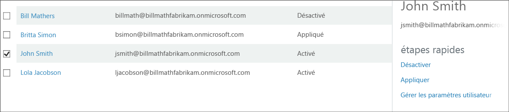

<properties 
	pageTitle="Prise en main de Microsoft Azure Multi-Factor Authentication dans le cloud" 
	description="Cette page dédiée à Microsoft Azure Multi-Factor Authentication décrit la prise en main d’Azure MFA dans le cloud." 
	services="multi-factor-authentication" 
	documentationCenter="" 
	authors="billmath" 
	manager="stevenpo" 
	editor="curtand"/>

<tags 
	ms.service="multi-factor-authentication" 
	ms.workload="identity" 
	ms.tgt_pltfrm="na" 
	ms.devlang="na" 
	ms.topic="get-started-article" 
	ms.date="05/12/2016" 
	ms.author="billmath"/>

# Prise en main avec Azure Multi-Factor Authentication dans le cloud
Dans l’article suivant, vous allez apprendre à utiliser Azure Multi-Factor dans le cloud.

> [AZURE.NOTE]  La documentation suivante fournit des informations relatives à l’activation des utilisateurs à l’aide du **portail Azure Classic**. Si vous recherchez des informations sur la configuration d’Azure Multi-Factor Authentication pour les utilisateurs O365, consultez l’article [Configurer l’authentification multifacteur pour les utilisateurs d’Office 365](https://support.office.com/article/Set-up-multi-factor-authentication-for-Office-365-users-8f0454b2-f51a-4d9c-bcde-2c48e41621c6?ui=en-US&rs=en-US&ad=US).

## Configuration requise
Les conditions préalables suivantes sont requises pour pouvoir activer Azure Multi-Factor Authentication pour vos utilisateurs.

- [Souscrivez un abonnement Azure](https://azure.microsoft.com/pricing/free-trial/) : si vous n’avez pas encore d’abonnement Azure, vous devez vous inscrire. Si vous êtes nouveau et utilisez Azure MFA, vous pouvez utiliser un abonnement d’évaluation
2. [Créez un fournisseur Multi-Factor Auth](multi-factor-authentication-get-started-auth-provider.md) et attribuez-le à votre répertoire ou [attribuez des licences à vos utilisateurs](multi-factor-authentication-get-started-assign-licenses.md).

> [AZURE.NOTE]  Les licences sont disponibles pour les utilisateurs qui disposent d’Azure MFA, d’Azure AD Premium ou d’Enterprise Mobility Suite (EMS). MFA est inclus dans Azure AD Premium et dans l’EMS. Si vous avez suffisamment de licences, il est inutile de créer un fournisseur d’authentification.
		

## Activer l’authentification multifacteur pour vos utilisateurs
Pour activer l’authentification multifacteur pour un utilisateur, vous devez simplement passer de l’état Désactivé à l’état Activé. Pour plus d’informations sur les états des utilisateurs, consultez [User States un Azure Multi-Factor Authentication](multi-factor-authentication-get-started-user-states.md) (États des utilisateurs dans Azure Multi-Factor Authentication)

Utilisez la procédure suivante pour activer l’authentification multifacteur pour vos utilisateurs.

### Pour activer l’authentification multifacteur
--------------------------------------------------------------------------------
1.  Connectez-vous en tant qu’administrateur sur le **portail Azure Classic**.
2.  Cliquez à gauche sur **Active Directory**.
3.  Sous **Répertoire**, cliquez sur le répertoire de l’utilisateur que vous souhaitez activer. 
4.  En haut de la page, cliquez sur **Utilisateurs**.
5.  En bas de la page, cliquez sur **Gérer Multi-Factor Auth**. 
6.  Un nouvel onglet s’ouvre dans votre navigateur. Recherchez l'utilisateur que vous souhaitez activer pour l'authentification multifacteur. Vous devrez peut-être modifier l'affichage en haut de la page. Assurez-vous que l’état est **désactivé.** 
7.  **Cochez** la case en regard du nom des utilisateurs.
7.  Sur la droite, cliquez sur **Activer**. 
8.  Cliquez sur **Activer l’authentification multifacteur**. 
9.  Vous remarquerez que l’état est passé de **désactivé** à **activé**. 
10.  Après que vous avez activé les utilisateurs, il est recommandé de les avertir par e-mail. Il doit également les informer de la façon dont ils peuvent utiliser leurs applications autres qu’un explorateur pour éviter le verrouillage.

## Automatiser l’activation de l’authentification multifacteur à l’aide de PowerShell

Pour modifier l’[état](multi-factor-authentication-whats-next.md) à l’aide d’[Azure AD PowerShell](../powershell-install-configure.md), vous pouvez utiliser les éléments suivants. Vous pouvez modifier `$st.State` pour définir l’un des états suivants :

- Activé
- Appliquée
- Désactivé

> [AZURE.IMPORTANT]  N’oubliez pas que si vous passez directement de l’état Désactivé à l’état Appliqué, les clients d’authentification d’ancienne génération cesseront de fonctionner, car l’utilisateur n’a pas fait l’objet d’un enregistrement MFA et n’a pas obtenu de [mot de passe d’application](multi-factor-authentication-whats-next.md#app-passwords). Si vous utilisez des clients d’authentification d’ancienne génération et que vous avez besoin de mots de passe d’application, il est recommandé de passer de l’état Désactivé à l’état Activé. Cela permettra aux utilisateurs de s’inscrire et d’obtenir leurs mots de passe d’application.
		
		$st = New-Object -TypeName Microsoft.Online.Administration.StrongAuthenticationRequirement
		$st.RelyingParty = "*"
		$st.State = “Enabled”
		$sta = @($st)
		Set-MsolUser -UserPrincipalName bsimon@contoso.com -StrongAuthenticationRequirements $sta

L’utilisation de PowerShell permet une activation en bloc des utilisateurs. Il n’existe actuellement aucune fonctionnalité d’activation en bloc dans le portail Azure ; vous devez donc sélectionner chaque utilisateur un à un. Cela peut se révéler fastidieux si vous avez un grand nombre d’utilisateurs. En créant un script PowerShell à l’aide de la commande ci-dessus, vous pouvez parcourir une liste d’utilisateurs et les activer. Voici un exemple :
    
    $users = "bsimon@contoso.com","jsmith@contoso.com","ljacobson@contoso.com"
    foreach ($user in $users)
    {
    	$st = New-Object -TypeName Microsoft.Online.Administration.StrongAuthenticationRequirement
    	$st.RelyingParty = "*"
    	$st.State = “Enabled”
    	$sta = @($st)
    	Set-MsolUser -UserPrincipalName $user -StrongAuthenticationRequirements $sta
    }

Pour plus d’informations sur les états des utilisateurs, consultez [User States un Azure Multi-Factor Authentication](multi-factor-authentication-get-started-user-states.md) (États des utilisateurs dans Azure Multi-Factor Authentication)

## Étapes suivantes
Maintenant que vous avez configuré l’authentification multifacteur dans le cloud, vous pouvez configurer et installer votre déploiement. Consultez [Configuration d’Azure Multi-Factor Authentication.]

<!---HONumber=AcomDC_0629_2016-->