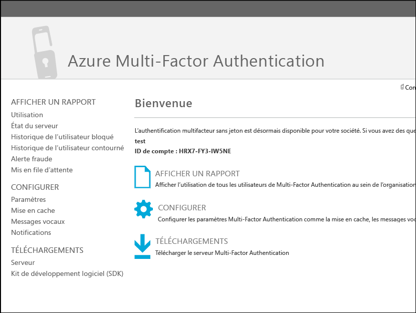
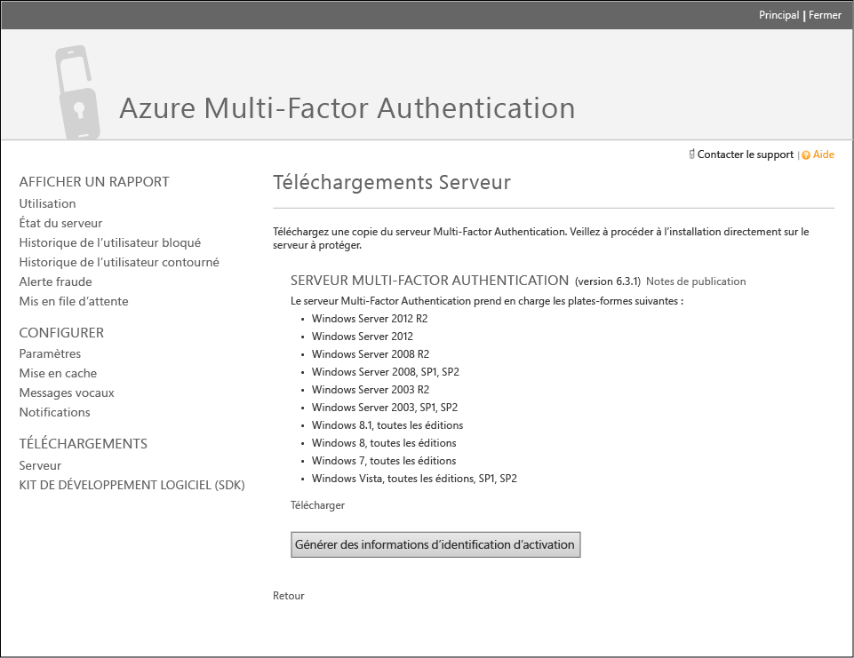
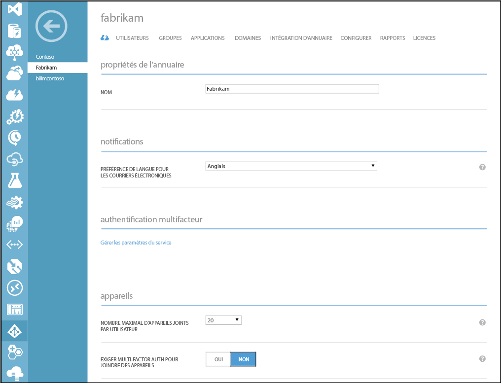
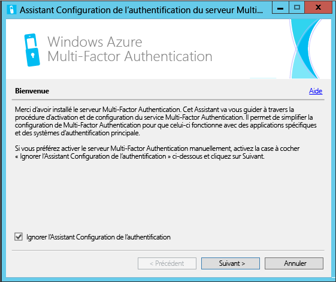
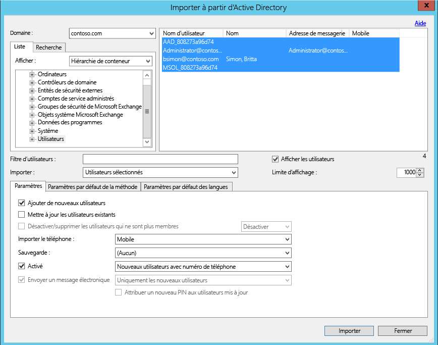
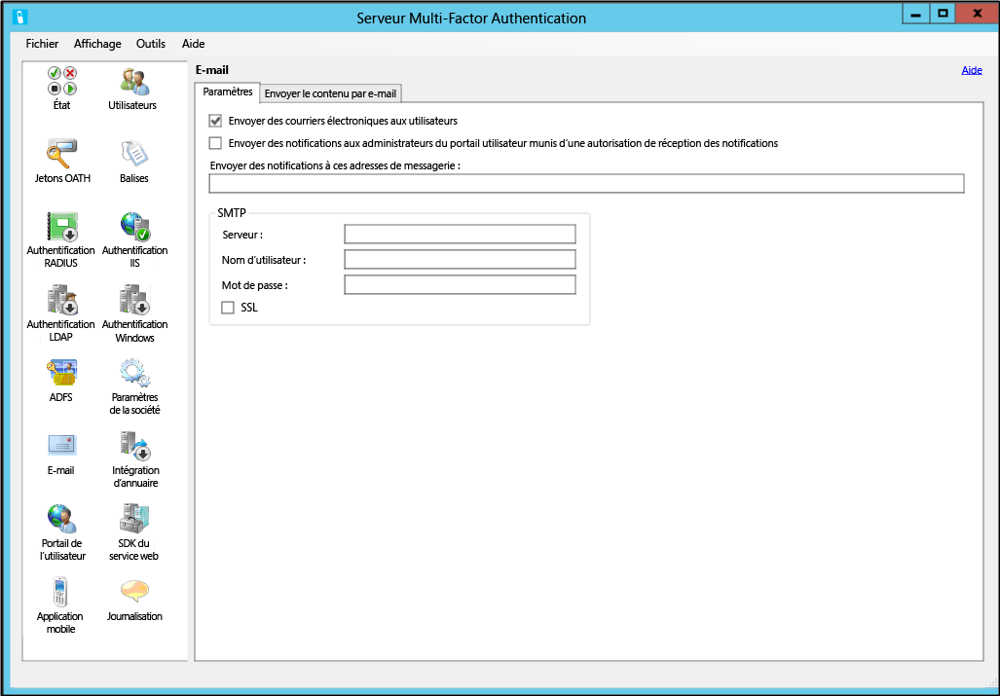
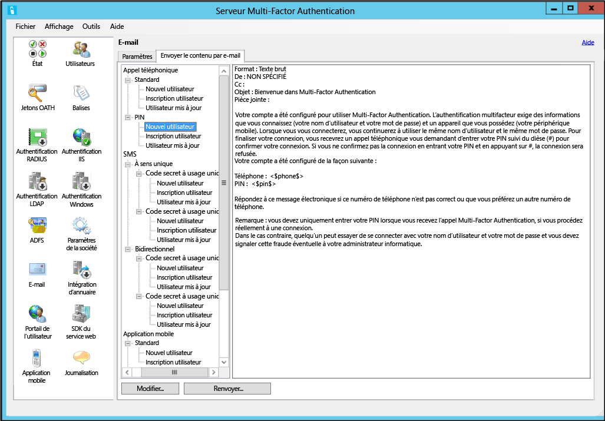

<properties 
	pageTitle="Prise en main du serveur Azure Multi-Factor Authentication" 
	description="Ceci est la page d'authentification multifacteur Azure qui explique la prise en main du serveur Azure MFA." 
	services="multi-factor-authentication"
	keywords="authentification serveur, page d’activation d’application d’authentification Azure Multi Factor Authentication, téléchargement du serveur d’authentification" 
	documentationCenter="" 
	authors="billmath" 
	manager="stevenpo" 
	editor="curtand"/>

<tags 
	ms.service="multi-factor-authentication" 
	ms.workload="identity" 
	ms.tgt_pltfrm="na" 
	ms.devlang="na" 
	ms.topic="get-started-article" 
	ms.date="01/25/2016" 
	ms.author="billmath"/>

# Prise en main du serveur Azure Multi-Factor Authentication

Maintenant que nous avons déterminé s’il fallait utiliser l’authentification multifacteur sur site, allons-y. Cette page vous indique comment installer le serveur et le configurer avec votre Active Directory local. Si vous avez déjà installé Phonefactor et que vous souhaitez découvrir cette procédure de mise à niveau, consultez la rubrique [Mise à niveau vers le serveur](multi-factor-authentication-get-started-server-upgrade.md) Azure Multi-Factor. Si vous souhaitez, par contre, obtenir simplement des informations sur l’installation du service Web, consultez la rubrique [Déploiement du service Web d’application mobile du serveur Azure Multi-Factor Authentication](multi-factor-authentication-get-started-server-webservice.md).

## Téléchargement du serveur Azure Multi-Factor Authentication

Vous pouvez télécharger le serveur Azure Multi-Factor Authentication de deux manières différentes : Les deux sont exécutées via le portail Azure. La première consiste à gérer le fournisseur d'authentification multifacteur directement. La seconde utilise les paramètres du service. La seconde option requiert un fournisseur d’authentification multifacteur ou une licence Azure MFA, Azure AD Premium ou Enterprise Mobility Suite .

### Pour télécharger le serveur Azure Multi-Factor Authentication à partir du portail Azure
--------------------------------------------------------------------------------

1. Connectez-vous au portail Azure en tant qu’administrateur.
2. Sélectionnez à gauche Active Directory.
3. En haut de la page Active Directory, cliquez sur **Fournisseurs d'authentification multifacteur**
4. Cliquez sur **Gérer** au bas de la page
5. Une nouvelle page apparaît. Cliquez sur **Téléchargements**. 

6. Au-dessus de **Générer des informations d’identification d’activation**, cliquez sur **Télécharger**. 

7. Enregistrez le fichier téléchargé.

### Pour télécharger le serveur Azure Multi-Factor Authentication à l’aide des paramètres du service

1. Connectez-vous au portail Azure en tant qu’administrateur.
2. Sélectionnez à gauche Active Directory.
3. Double-cliquez sur votre instance d'Azure AD.
4. En haut de la page, cliquez sur **Configurer**.

5. Sous Authentification multifacteur, sélectionnez **Gérer les paramètres du service**.
6. Au bas de la page Paramètres du service, cliquez sur **Accéder au portail**. 

7. Une nouvelle page apparaît. Cliquez sur **Téléchargements**.
8. Au-dessus de **Générer des informations d’identification d’activation**, cliquez sur **Télécharger**.
9. Enregistrez le fichier téléchargé.

## Installation et configuration du serveur Azure Multi-Factor Authentication
Maintenant que vous avez téléchargé le serveur, vous pouvez l'installer et le configurer. Assurez-vous que le serveur que vous installez répond aux exigences suivantes :

Configuration requise du serveur Azure Multi-Factor Authentication|Description|
:------------- | :------------- | 
Matériel|<li>200 Mo d’espace disque dur</li><li>Processeur compatible x32 ou x64</li><li>1 Go de RAM ou davantage</li>
Logiciel|<li>Windows Server 2003 ou version ultérieure si l’hôte est un système d’exploitation serveur</li><li>Windows Vista ou version ultérieure si l’hôte est un système d’exploitation client</li><li>Microsoft .NET 2.0 Framework</li><li>IIS 6.0 ou version ultérieure si vous procédez à l’installation du portail utilisateur ou du Kit de développement logiciel (SDK) du service web</li>

### Configuration requise du serveur Azure Multi-Factor Authentication
--------------------------------------------------------------------------------
Chaque serveur MFA doit pouvoir communiquer sur les éléments sortants du port 443, à savoir :

- https://pfd.phonefactor.net
- https://pfd2.phonefactor.net
- https://css.phonefactor.net

Si les pare-feu sortants sont limités sur le port 443, les plages d'adresses IP suivantes devront être ouvertes :

Sous-réseau IP|Masque réseau|Plage d’adresses IP
:------------- | :------------- | :------------- |
134\.170.116.0/25|255\.255.255.128|134\.170.116.1 – 134.170.116.126
134\.170.165.0/25|255\.255.255.128|134\.170.165.1 – 134.170.165.126
70\.37.154.128/25|255\.255.255.128|70\.37.154.129 – 70.37.154.254

Si vous n'utilisez pas les fonctionnalités de confirmation d'événements Azure Multi-Factor Authentication et que les utilisateurs ne s’authentifient pas avec des applications mobiles Multi-Factor Auth depuis des appareils connectés au réseau d'entreprise, les plages d’adresses IP peuvent se limiter aux éléments suivants :

Sous-réseau IP|Masque réseau|Plage d’adresses IP
:------------- | :------------- | :------------- |
134\.170.116.72/29|255\.255.255.248|134\.170.116.72 – 134.170.116.79
134\.170.165.72/29|255\.255.255.248|134\.170.165.72 – 134.170.165.79
70\.37.154.200/29|255\.255.255.248|70\.37.154.201 – 70.37.154.206

### Pour installer et configurer le serveur Azure Multi-Factor Authentication
--------------------------------------------------------------------------------

1. Double-cliquez sur le fichier exécutable. Ceci lancera l'installation.
2. Sur l'écran Sélectionner le dossier d’installation, assurez-vous que le dossier est correct, puis cliquez sur Suivant.
3. Une fois l'installation terminée, cliquez sur Terminer. Ceci lancera l'Assistant de configuration.
4. Sur l’écran d’accueil de l’Assistant Configuration, cochez l’option **Ignorer l’Assistant Configuration de l’authentification**, puis cliquez sur **Suivant**. Cette opération fermera l’Assistant et démarrera le serveur. 

5. Revenez à la page à partir de laquelle vous avez téléchargé le serveur, puis cliquez sur le bouton **Générer des informations d’identification d’activation**. Copiez ces informations dans les zones appropriées du serveur Azure MFA, puis cliquez sur **Activer**.

Pour une installation rapide via l'Assistant de configuration, veuillez suivre les étapes mentionnées ci-dessus. Vous pouvez réexécuter l'Assistant d'authentification en le sélectionnant sur le serveur, dans le menu Outils.

##Importation des utilisateurs à partir d'Active Directory

Maintenant que le serveur est installé et configuré, vous pouvez importer très rapidement des utilisateurs sur le serveur Azure MFA.

### Pour importer des utilisateurs à partir d'Active Directory
--------------------------------------------------------------------------------

1. Sur la gauche du serveur Azure MFA, sélectionnez **Utilisateurs**.
2. En bas de la page, sélectionnez **Importer à partir d’Active Directory**.
3. Vous pouvez désormais rechercher des utilisateurs individuels ou bien le répertoire Active des unités d'organisation, composé lui-même d’utilisateurs. Dans ce cas, nous spécifierons l'unité d'organisation des utilisateurs.
4. Mettez en surbrillance tous les utilisateurs mentionnés sur la droite, puis cliquez sur **Importer**. Vous devriez recevoir un message vous indiquant que l’opération a été réalisée avec succès. Fermez la fenêtre d'importation.

## Envoi d’un e-mail aux utilisateurs
Maintenant que vous avez importé vos utilisateurs sur le serveur Azure Multi-Factor Authentication, il est conseillé de leur envoyer un e-mail les informant qu'ils ont été inscrits dans l'authentification multifacteur.

Avec le serveur Azure Multi-Factor Authentication, il existe différentes façons de configurer vos utilisateurs pour l'authentification multifacteur. Par exemple, si vous connaissez les numéros de téléphone des utilisateurs ou avez pu importer les numéros de téléphone dans le serveur Azure Multi-Factor Authentication à partir du répertoire de leur entreprise, l’e-mail informera les utilisateurs qu'ils ont été configurés pour utiliser Azure Multi-Factor Authentication. Fournissez des instructions sur l'utilisation d’Azure Multi-Factor Authentication et indiquez-leur le numéro de téléphone sur lequel ils recevront leurs authentifications.

Le contenu de l’e-mail varie en fonction de la méthode d'authentification définie pour l'utilisateur (par exemple, appel téléphonique, SMS, application mobile). Par exemple, si l'utilisateur doit saisir un code confidentiel pour s'authentifier, l’e-mail lui indiquera le code confidentiel initial qui a été défini. Généralement, les utilisateurs doivent modifier leur code PIN lors de leur première authentification.

Si les numéros de téléphone des utilisateurs n’ont pas été configurés ou importés dans le serveur Azure Multi-Factor Authentication, ou si les utilisateurs sont préconfigurés pour utiliser l'application mobile pour l'authentification, vous pouvez leur envoyer un e-mail les informant qu'ils ont été configurés pour utiliser Azure Multi-Factor Authentication, puis leur demander de compléter l’inscription de leur compte via le portail utilisateur Azure Multi-Factor Authentication. Un lien hypertexte permettra à l'utilisateur d’accéder au portail de l'utilisateur. Lorsque l'utilisateur clique sur ce lien hypertexte, son navigateur web s’ouvre et affiche le portail Azure Multi-Factor Authentication de son entreprise.

### Configuration du courrier électronique et des modèles de courrier électronique

En cliquant sur l'icône de courrier électronique sur la gauche, vous pouvez configurer les paramètres d'envoi de ces e-mails. Vous pouvez y entrer les informations SMTP de votre serveur de messagerie et envoyer des e-mails en cochant la case Envoyer des e-mails aux utilisateurs.

L'onglet Contenu des e-mails affiche tous les modèles d’e-mail disponibles. Selon la façon dont les utilisateurs ont été configurés pour utiliser l'authentification multifacteur, vous pouvez choisir le modèle qui correspond le mieux à vos besoins.

## Comment le serveur Azure Multi-Factor Authentication gère les données utilisateur

Lorsque vous utilisez le serveur Multi-Factor Authentication (MFA) sur site, les données utilisateur sont stockées sur les serveurs locaux. Aucune donnée utilisateur persistante n'est stockée dans le cloud. Lorsque l'utilisateur effectue une authentification à deux facteurs, le serveur MFA envoie des données au service cloud Azure MFA pour effectuer l'authentification. Lorsque ces demandes d'authentification sont envoyées au service cloud, les champs suivants sont envoyés dans la demande et les journaux afin qu'ils soient disponibles dans les rapports d'utilisation/d'authentification du client. Certains champs étant facultatifs, ils peuvent être activés ou désactivés sur le serveur Multi-Factor Authentication. La communication du serveur MFA au service cloud MFA utilise SSL/TLS sur le port 443 sortant. Ces champs sont les suivants :

- ID unique : nom d'utilisateur ou ID du serveur MFA interne
- Prénom et nom : facultatif
- Adresse de messagerie : facultatif
- Numéro de téléphone : en cas d'authentification par appel vocal ou SMS
- Jeton du périphérique : en cas d'authentification par application mobile
- Mode d'authentification 
- Résultat de l'authentification 
- Nom du serveur MFA 
- Adresse IP du serveur MFA 
- Adresse IP du client (si disponible)

En plus des champs ci-dessus, le résultat de l'authentification (réussite/échec) et le motif de refus sont également stockés avec les données d'authentification et disponibles dans les rapports d'utilisation/d'authentification.

## Configurations avancées du serveur Azure Multi-Factor Authentication
Pour plus d'informations sur l'installation et la configuration avancées, utilisez le tableau ci-dessous.

Méthode|Description
:------------- | :------------- | 
[Portail de l'utilisateur](multi-factor-authentication-get-started-portal.md)| Informations sur l'installation et la configuration du portail utilisateur, notamment le déploiement et libre-service utilisateur.
[Active Directory Federation Service](multi-factor-authentication-get-started-adfs.md)|Informations sur la configuration d'Azure Multi-Factor Authentication avec AD FS.
[Authentification RADIUS](multi-factor-authentication-get-started-server-radius.md)| Informations sur l'installation et la configuration du serveur Azure MFA avec RADIUS.
[Authentification IIS](multi-factor-authentication-get-started-server-iis.md)|Informations sur l'installation et la configuration du serveur Azure MFA avec IIS.
[Authentification Windows](multi-factor-authentication-get-started-server-windows.md)| Informations sur l'installation et la configuration du serveur Azure MFA avec l’authentification Windows.
[Authentification LDAP](multi-factor-authentication-get-started-server-ldap.md)|Informations sur l'installation et la configuration du serveur Azure MFA avec l’authentification LDAP.
[Passerelle des services Bureau à distance et serveur Azure Multi-Factor Authentication avec RADIUS](multi-factor-authentication-get-started-server-rdg.md)| Informations sur l'installation et la configuration du serveur Azure MFA avec Passerelle des services Bureau à distance et RADIUS.
[Synchronisation avec Windows Server Active Directory](multi-factor-authentication-get-started-server-dirint.md)|Informations sur l’installation et la configuration de la synchronisation entre Active Directory et le serveur Azure MFA.
[Déploiement du service Web de l’application mobile du serveur Azure Multi-Factor Authentication](multi-factor-authentication-get-started-server-webservice.md)|Informations sur l'installation et la configuration du service Web du serveur Azure MFA.

<!---HONumber=AcomDC_0128_2016-->