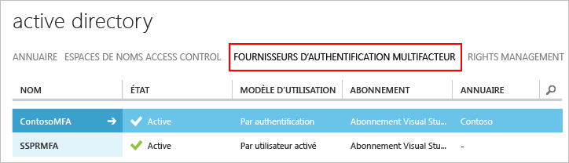

# Prise en main du serveur Azure Multi-Factor Authentication

Maintenant que nous avons déterminé s’il fallait utiliser le serveur Multi-Factor Authentication local, nous pouvons commencer. Cette page vous indique comment installer le serveur et le configurer avec votre Active Directory local. Si vous avez déjà installé Phonefactor et que vous souhaitez découvrir cette procédure de mise à niveau, consultez la rubrique [Mise à niveau vers le serveur Azure Multi-Factor](multi-factor-authentication-get-started-server-upgrade.md). Si vous souhaitez, par contre, obtenir simplement des informations sur l’installation du service Web, consultez la rubrique [Déploiement du service Web d’application mobile du serveur Azure Multi-Factor Authentication](multi-factor-authentication-get-started-server-webservice.md).

## Téléchargement du serveur Azure Multi-Factor Authentication
Vous pouvez télécharger le serveur Azure Multi-Factor Authentication de deux manières différentes : Les deux sont exécutées via le portail Azure. La première consiste à gérer le fournisseur d'authentification multifacteur directement. La seconde utilise les paramètres du service. La seconde option requiert un fournisseur d’authentification multifacteur ou une licence Azure MFA, Azure AD Premium ou Enterprise Mobility Suite.

> [!Important]
> Ces deux options semblent similaires, mais il est important de savoir laquelle utiliser. Si vos utilisateurs disposent de licences avec MFA, ne créez pas de fournisseur d’authentification multifacteur pour le téléchargement du serveur. Au lieu de cela, utilisez l’option 2 pour télécharger le serveur depuis la page des paramètres du service. 

### Option 1 : télécharger le serveur Azure Multi-Factor Authentication depuis le portail Azure Classic

Utilisez cette option de téléchargement si vous disposez déjà d’un fournisseur d’authentification multifacteur, car vous payez pour MFA en fonction du nombre d’utilisateurs actifs ou d’authentifications. 

1. Connectez-vous en tant qu’administrateur au [portail Azure Classic](https://manage.windowsazure.com).
2. Sélectionnez **Active Directory**à gauche.
3. En haut de la page Active Directory, cliquez sur **Fournisseurs d'authentification multifacteur**
    
4. Cliquez sur **Gérer**. Une nouvelle page s’ouvre.
5. Cliquez sur **Téléchargements**.
6. Au-dessus de **Générer des informations d’identification d’activation**, cliquez sur **Télécharger**.
   
7. Enregistrez le fichier téléchargé.

### Option 2 : télécharger le serveur Azure Multi-Factor Authentication à l’aide des paramètres du service

Utilisez cette option de téléchargement si vous disposez d’une licence Enterprise Mobility Suite, Azure AD Premium ou Enterprise Cloud Suite. 

1. Connectez-vous en tant qu’administrateur au [portail Azure Classic](https://manage.windowsazure.com).
2. Sélectionnez **Active Directory**à gauche.
3. Double-cliquez sur votre instance d’Azure AD.
4. En haut de la page, cliquez sur **Configurer**
5. Défilez vers la section **Authentification multifacteur**, puis sélectionnez **Gérer les paramètres du service**
6. Au bas de la page Paramètres du service, cliquez sur **Accéder au portail**. Une nouvelle page s’ouvre.
   
7. Cliquez sur **Téléchargements**
8. Au-dessus de **Générer des informations d’identification d’activation**, cliquez sur **Télécharger**.
    
9. Enregistrez le fichier téléchargé.

## Installation et configuration du serveur Azure Multi-Factor Authentication
Maintenant que vous avez téléchargé le serveur, vous pouvez l’installer et le configurer.  Assurez-vous que le serveur que vous installez répond aux exigences suivantes :

| Configuration requise du serveur Azure Multi-Factor Authentication | Description |
|:--- |:--- |
| Matériel |<li>200 Mo d’espace disque</li><li>Processeur compatible x32 ou x64</li><li>1 Go de RAM ou plus</li> |
| Logiciel |<li>Windows Server 2008 ou version ultérieure si l’hôte est un système d’exploitation de serveur</li><li>Windows 7 ou version ultérieure si l’hôte est un système d’exploitation client</li><li>Microsoft .NET 4.0 Framework</li><li>IIS 7.0 ou version ultérieure si vous installez le kit de développement logiciel du portail de l’utilisateur ou du service web</li> |

### Configuration requise du serveur Azure Multi-Factor Authentication
- - -
Chaque serveur MFA doit pouvoir communiquer sur les éléments sortants du port 443, vers les adresses suivantes :

* https://pfd.phonefactor.net
* https://pfd2.phonefactor.net
* https://css.phonefactor.net

Si les pare-feu sortants sont limités sur le port 443, ouvrez les plages d'adresses IP suivantes :

| Sous-réseau IP | Masque réseau | Plage d’adresses IP |
|:--- |:--- |:--- |
| 134.170.116.0/25 |255.255.255.128 |134.170.116.1 – 134.170.116.126 |
| 134.170.165.0/25 |255.255.255.128 |134.170.165.1 – 134.170.165.126 |
| 70.37.154.128/25 |255.255.255.128 |70.37.154.129 – 70.37.154.254 |

Si vous n’utilisez pas la fonctionnalité de Confirmation d’événement et que les utilisateurs ne se servent pas d’applications mobiles pour vérifier à partir d’appareils sur le réseau d’entreprise, les adresses IP peuvent être réduites aux plages suivantes :

| Sous-réseau IP | Masque réseau | Plage d’adresses IP |
|:--- |:--- |:--- |
| 134.170.116.72/29 |255.255.255.248 |134.170.116.72 – 134.170.116.79 |
| 134.170.165.72/29 |255.255.255.248 |134.170.165.72 – 134.170.165.79 |
| 70.37.154.200/29 |255.255.255.248 |70.37.154.201 – 70.37.154.206 |

### Pour installer et configurer le serveur Azure Multi-Factor Authentication

1. Double-cliquez sur le fichier exécutable. Cela lance l’installation.
2. Sur l'écran Sélectionner le dossier d’installation, assurez-vous que le dossier est correct, puis cliquez sur **Suivant**.
3. Une fois l'installation terminée, cliquez sur **Terminer**.  L'Assistant de configuration démarre.
4. Sur l’écran d’accueil de l’Assistant Configuration, cochez l’option **Ignorer l’Assistant Configuration de l’authentification**, puis cliquez sur **Suivant**.  Cela ferme l’Assistant et démarre le serveur.
    
5. Revenez à la page à partir de laquelle vous avez téléchargé le serveur, puis cliquez sur le bouton **Générer des informations d’identification d’activation** . Copiez ces informations dans les zones appropriées du serveur Azure MFA, puis cliquez sur **Activer**.

Pour une installation rapide via l'Assistant de configuration, veuillez suivre les étapes mentionnées ci-dessus.  Vous pouvez réexécuter l'Assistant d'authentification en le sélectionnant sur le serveur, dans le menu Outils.

## Importation des utilisateurs à partir d'Active Directory
Maintenant que le serveur est installé et configuré, vous pouvez importer très rapidement des utilisateurs sur le serveur Azure MFA.

1. Sur la gauche du serveur Azure MFA, sélectionnez **Utilisateurs**.
2. En bas de la page, sélectionnez **Importer à partir d’Active Directory**.
3. Vous pouvez désormais rechercher des utilisateurs individuels ou bien le répertoire Active des unités d'organisation, composé lui-même d’utilisateurs.  Dans ce cas, nous spécifions l'unité d'organisation des utilisateurs.
4. Mettez en surbrillance tous les utilisateurs mentionnés sur la droite, puis cliquez sur **Importer**.  Vous devriez recevoir un message vous indiquant que l’opération a été réalisée avec succès.  Fermez la fenêtre d'importation.

## Envoi d’un e-mail aux utilisateurs
Maintenant que vous avez importé vos utilisateurs sur le serveur MFA, nous vous recommandons de leur envoyer un e-mail les informant qu’ils ont été inscrits pour la vérification en deux étapes.

L’e-mail que vous envoyez doit être déterminé par la façon dont vous avez configuré vos utilisateurs pour la vérification en deux étapes. Par exemple, si vous avez pu importer les numéros de téléphone des utilisateurs à partir du répertoire de l’entreprise, l’e-mail doit inclure les numéros de téléphone par défaut afin que les utilisateurs sachent à quoi s’attendre. De même, si les numéros de téléphone des utilisateurs n’ont pas été importés ou que les utilisateurs sont configurés pour utiliser l’application mobile, envoyez-leur un e-mail qui leur demande de terminer l’inscription de leur compte via un lien hypertexte vers le portail utilisateur Multi-Factor Authentication.

Le contenu de l’e-mail varie en fonction de la méthode de vérification définie pour l'utilisateur (appel téléphonique, SMS ou application mobile).  Par exemple, si l'utilisateur doit saisir un code confidentiel pour s'authentifier, l’e-mail lui indique le code confidentiel initial qui a été défini.  Les utilisateurs doivent modifier leur code PIN lors de leur première vérification.

### Configuration du courrier électronique et des modèles de courrier électronique
Cliquez sur l'icône de courrier électronique sur la gauche pour configurer les paramètres d'envoi de ces e-mails. Ici, vous pouvez entrer les informations SMTP de votre serveur de messagerie et envoyer des e-mails en cochant la case **Envoyer des e-mails aux utilisateurs**.

L'onglet Contenu des e-mails présente tous les modèles d’e-mail disponibles. Selon la façon dont les utilisateurs ont été configurés pour utiliser la vérification en deux étapes, vous pouvez choisir le modèle qui correspond le mieux à vos besoins.

## Comment le serveur Azure Multi-Factor Authentication gère les données utilisateur
Lorsque vous utilisez le serveur Multi-Factor Authentication (MFA) sur site, les données utilisateur sont stockées sur les serveurs locaux. Aucune donnée utilisateur persistante n'est stockée dans le cloud. Lorsque l'utilisateur effectue une vérification en deux étapes, le serveur MFA envoie des données au service cloud Azure MFA pour effectuer la vérification. Lorsque ces demandes d'authentification sont envoyées au service cloud, les champs suivants sont envoyés dans la demande et les journaux afin qu'ils soient disponibles dans les rapports d'utilisation/d'authentification du client. Certains champs étant facultatifs, ils peuvent être activés ou désactivés sur le serveur Multi-Factor Authentication. La communication du serveur MFA au service cloud MFA utilise SSL/TLS sur le port 443 sortant. Ces champs sont les suivants :

* ID unique : nom d'utilisateur ou ID du serveur MFA interne
* Prénom et nom (facultatif)
* Adresse de messagerie (facultatif)
* Numéro de téléphone : en cas d'authentification par appel vocal ou SMS
* Jeton du périphérique : en cas d'authentification par application mobile
* mode d'authentification
* Résultat de l'authentification
* Nom du serveur MFA
* Adresse IP du serveur MFA
* Adresse IP du client (si disponible)

En plus des champs ci-dessus, le résultat de la vérification (réussite/échec) et le motif de refus sont également stockés avec les données d'authentification et disponibles dans les rapports d'utilisation/d'authentification.

## Étapes suivantes
Pour plus d’informations sur l’installation et la configuration avancées, cliquez sur les liens du tableau suivant :

| Méthode | Description |
|:--- |:--- |
| [Portail de l'utilisateur](multi-factor-authentication-get-started-portal.md) |Informations sur l'installation et la configuration du portail utilisateur, notamment le déploiement et libre-service utilisateur. |
| [Active Directory Federation Service](multi-factor-authentication-get-started-adfs.md) |Informations sur la configuration d'Azure Multi-Factor Authentication avec AD FS. |
| [Authentification RADIUS](multi-factor-authentication-get-started-server-radius.md) |Informations sur l'installation et la configuration du serveur Azure MFA avec RADIUS. RADIUS vous permet d’intégrer différents systèmes tiers avec un serveur Azure MFA. |
| [Authentification IIS](multi-factor-authentication-get-started-server-iis.md) |Informations sur l'installation et la configuration du serveur Azure MFA avec IIS. IIS vous permet d’intégrer différents systèmes tiers avec un serveur Azure MFA. |
| [Authentification Windows](multi-factor-authentication-get-started-server-windows.md) |Informations sur l'installation et la configuration du serveur Azure MFA avec l’authentification Windows. |
| [Authentification LDAP](multi-factor-authentication-get-started-server-ldap.md) |Informations sur l'installation et la configuration du serveur Azure MFA avec l’authentification LDAP. LDAP vous permet d’intégrer différents systèmes tiers avec un serveur Azure MFA. |
| [Passerelle des services Bureau à distance et serveur Multi-Factor Authentication avec RADIUS](multi-factor-authentication-get-started-server-rdg.md) |Informations sur l'installation et la configuration du serveur Azure MFA avec Passerelle des services Bureau à distance et RADIUS. |
| [Synchronisation avec Windows Server Active Directory](multi-factor-authentication-get-started-server-dirint.md) |Informations sur l’installation et la configuration de la synchronisation entre Active Directory et le serveur Azure MFA. |
| [Déploiement du service Web de l’application mobile du serveur Azure Multi-Factor Authentication](multi-factor-authentication-get-started-server-webservice.md) |Informations sur l'installation et la configuration du service Web du serveur Azure MFA. |
| [Scénarios avancés avec l'authentification multifacteur Azure et des VPN tiers](multi-factor-authentication-advanced-vpn-configurations.md) | Guides de configuration détaillés pour les appliances Cisco, Citrix et Juniper. |

<!--HONumber=Jan17_HO1-->

