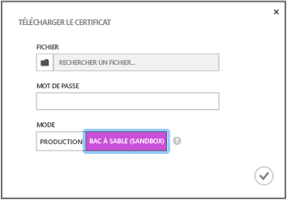

<properties
	pageTitle="Prendre en main Azure Notification Hubs pour les applications iOS | Microsoft Azure"
	description="Dans ce didacticiel, vous découvrirez comment utiliser Azure Notification Hubs pour envoyer des notifications push à une application iOS."
	services="notification-hubs"
	documentationCenter="ios"
	authors="wesmc7777"
	manager="dwrede"
	editor=""/>

<tags
	ms.service="notification-hubs"
	ms.workload="mobile"
	ms.tgt_pltfrm="mobile-ios"
	ms.devlang="objective-c"
	ms.topic="hero-article"
	ms.date="12/15/2015"
	ms.author="wesmc"/>

# Prendre en main Notification Hubs pour les applications iOS

[AZURE.INCLUDE [notification-hubs-selector-get-started](../../includes/notification-hubs-selector-get-started.md)]

##Vue d’ensemble

Ce didacticiel vous montre comment utiliser Azure Notification Hubs pour envoyer des notifications Push vers une application iOS. Vous allez créer une application iOS vide qui reçoit des notifications push à l’aide du service de notification push Apple (APNs, Apple Push Notification service). Une fois l’opération terminée, vous pouvez utiliser votre hub de notification pour diffuser des notifications Push sur tous les appareils exécutant votre application.

Ce didacticiel présente un scénario de diffusion simple utilisant les Notification Hubs.

## Avant de commencer

[AZURE.INCLUDE [notification-hubs-hero-slug](../../includes/notification-hubs-hero-slug.md)]

Le code complet de ce didacticiel est disponible sur GitHub [ici](https://github.com/Azure/azure-notificationhubs-samples/tree/master/iOS/GetStartedNH/GetStarted).

##Composants requis

Ce didacticiel requiert les éléments suivants :

+ [Kit de développement logiciel (SDK) Mobile Services iOS version 1.2.4]
+ [Xcode 7][Install Xcode]
+ Un appareil compatible iOS 8 (ou version ultérieure)
+ Un abonnement au programme pour développeurs iOS

   >[AZURE.NOTE]En raison des exigences de configuration requise pour les notifications push, vous devez déployer et tester les notifications push sur un appareil compatible iOS (iPhone ou iPad) au lieu du simulateur iOS.

Vous devez terminer ce didacticiel avant de pouvoir suivre tous les autres didacticiels Notification Hubs pour les applications iOS.

> [AZURE.NOTE]Pour suivre ce didacticiel, vous avez besoin d'un compte Azure actif. Si vous ne possédez pas de compte, vous pouvez créer un compte d'évaluation gratuit en quelques minutes. Pour plus d'informations, consultez la page [Version d'évaluation gratuite d'Azure](http://azure.microsoft.com/pricing/free-trial/?WT.mc_id=A0E0E5C02&amp;returnurl=http%3A%2F%2Fazure.microsoft.com%2Ffr-FR%2Fdocumentation%2Farticles%2Fnotification-hubs-ios-get-started).

[AZURE.INCLUDE [Notification Hubs - Activer les notifications Push Apple](../../includes/notification-hubs-enable-apple-push-notifications.md)]

##Configuration de votre hub de notification

Cette section vous guide dans la création d’un hub de notification et la configuration APNS à l’aide du certificat Push **.p12** que vous avez créé. Si vous souhaitez utiliser un hub de notification que vous avez déjà créé, vous pouvez passer directement à l’étape 5.

[AZURE.INCLUDE [notification-hubs-portal-create-new-hub](../../includes/notification-hubs-portal-create-new-hub.md)]

<ol start="7">
<li>

Cliquez sur l’onglet <b>Configurer</b> en haut de l’écran, puis cliquez sur le bouton <b>Télécharger</b> dans les paramètres de notification Apple pour télécharger l’empreinte numérique du certificat. Sélectionnez ensuite le certificat <b>.p12</b> exporté précédemment, ainsi que le mot de passe du certificat.

Comme il s’agit de développement, veillez à sélectionner le mode <b>Sandbox</b>. Utilisez uniquement <b>Production</b> si vous souhaitez envoyer des notifications Push aux utilisateurs ayant acheté votre application dans Windows store.

</li>
</ol>
&emsp;&emsp;

&emsp;&emsp;

Votre Notification Hub est configuré pour APNS, et vous disposez des chaînes de connexion pour inscrire votre application et envoyer des notifications.

##Connexion de votre application au hub de notification

1. Dans Xcode, créez un projet iOS et sélectionnez le modèle **Single View Application**.

   	![][8]

2. Lorsque vous définissez les options de votre nouveau projet, assurez-vous d’utiliser les mêmes **Product Name** et **Organization Identifier** que ceux utilisés lors de la définition de l’ID d’offre groupée sur le portail des développeurs Apple.

	![][11]

3. Sous **Targets**, cliquez sur le nom de votre projet, cliquez sur l’onglet **Build Settings** et développez **Code Signing Identity**, puis sous **Debug**, sélectionnez votre identité de signature du code. Basculez **Levels** de **Basic** à **All** et définissez **Provisioning Profile** sur le profil d’approvisionnement que vous avez créé précédemment.

	Si vous ne voyez pas le nouveau profil d’approvisionnement que vous avez créé dans Xcode, essayez d’actualiser les profils pour votre identité de signature. Cliquez sur **Xcode** dans la barre de menus, sur **Preferences**, sur l’onglet **Account**, sur le bouton **View Details**, sur votre identité de signature, puis cliquez sur le bouton d’actualisation dans le coin inférieur droit.

   	![][9]

4. Téléchargez la [version 1.2.4 du kit de développement logiciel (SDK) Mobile Services iOS] et décompressez le fichier. Dans Xcode, cliquez avec le bouton droit de la souris sur votre projet et sélectionnez l’option **Add Files to** pour ajouter le dossier **WindowsAzureMessaging.framework** à votre projet Xcode. Sélectionnez **Copy items if needed**, puis cliquez sur **Add**.

	>[AZURE.NOTE]Le kit de développement logiciel Notification Hubs ne prend pas en charge le bitcode sur Xcode7. Vous devez définir **Activer le bitcode** sur **Non** dans les **Options de build** de votre projet.

   	![][10]

5. Ajoutez un nouveau fichier d’en-tête à votre projet nommé **HubInfo.h**. Ce fichier contiendra les constantes de votre hub de notification. Ajoutez les définitions suivantes et remplacez les espaces réservés des littéraux de chaîne par le *nom de votre hub* et la chaîne *DefaultListenSharedAccessSignature* notée précédemment.

		#ifndef HubInfo_h
		#define HubInfo_h
		
			#define HUBNAME @"<Enter the name of your hub>"
			#define HUBLISTENACCESS @"<Enter your DefaultListenSharedAccess connection string"
		
		#endif /* HubInfo_h */

6. Ouvrez le fichier AppDelegate.h et ajoutez l’instruction d’importation suivante :

         #import <WindowsAzureMessaging/WindowsAzureMessaging.h> 
		 #import "HubInfo.h"
		
7. Dans le fichier AppDelegate.m, ajoutez le code suivant dans la méthode `didFinishLaunchingWithOptions` basée sur votre version d’iOS. Ce code enregistre le handle de votre appareil avec APNs :

	Pour iOS 8 :

	 	UIUserNotificationSettings *settings = [UIUserNotificationSettings settingsForTypes:UIUserNotificationTypeSound |
												UIUserNotificationTypeAlert | UIUserNotificationTypeBadge categories:nil];

    	[[UIApplication sharedApplication] registerUserNotificationSettings:settings];
    	[[UIApplication sharedApplication] registerForRemoteNotifications];

	Pour les versions d’iOS antérieures à 8 :

         [[UIApplication sharedApplication] registerForRemoteNotificationTypes: UIRemoteNotificationTypeAlert | UIRemoteNotificationTypeBadge | UIRemoteNotificationTypeSound];

8. Dans le même fichier, ajoutez les méthodes suivantes : Ce code se connecte au hub de notification utilisant les informations de connexion que vous avez spécifiées dans HubInfo.h. Il transmet ensuite le jeton de l’appareil au hub de notification, de sorte que le hub de notification puisse envoyer des notifications :

	    - (void)application:(UIApplication *)application didRegisterForRemoteNotificationsWithDeviceToken:(NSData *) deviceToken {
		    SBNotificationHub* hub = [[SBNotificationHub alloc] initWithConnectionString:HUBLISTENACCESS
										notificationHubPath:HUBNAME];

		    [hub registerNativeWithDeviceToken:deviceToken tags:nil completion:^(NSError* error) {
		        if (error != nil) {
		            NSLog(@"Error registering for notifications: %@", error);
		        }
				else {
				    [self MessageBox:@"Registration Status" message:@"Registered"];
				}
	    	}];
		}

		-(void)MessageBox:(NSString *)title message:(NSString *)messageText
		{
			UIAlertView *alert = [[UIAlertView alloc] initWithTitle:title message:messageText delegate:self
				cancelButtonTitle:@"OK" otherButtonTitles: nil];
			[alert show];
		}

9. Dans le même fichier, ajoutez la méthode suivante pour afficher une **UIAlert** si la notification est reçue alors que l’application est active :

        - (void)application:(UIApplication *)application didReceiveRemoteNotification: (NSDictionary *)userInfo {
		    NSLog(@"%@", userInfo);
		    [self MessageBox:@"Notification" message:[[userInfo objectForKey:@"aps"] valueForKey:@"alert"]];
		}

10. Générez et exécutez l’application sur votre appareil pour vérifier l’absence d’échecs.

## Envoi de notifications

Vous pouvez tester la réception de notifications dans votre application en envoyant des notifications dans le [portail Azure Classic] via l’onglet Déboguer du hub de notification, comme indiqué dans l’écran ci-dessous.

![][30]

[AZURE.INCLUDE [notification-hubs-sending-notifications-from-the-portal](../../includes/notification-hubs-sending-notifications-from-the-portal.md)]

## (Facultatif) Envoyer des notifications depuis l’application

Si vous souhaitez envoyer des notifications à l’intérieur d’une application. Cette section contient un exemple montrant comment procéder à l’aide de l’interface REST.

1. Dans Xcode, ouvrez le Main.storyboard et ajoutez les composants d’interface utilisateur suivants à partir de la bibliothèque d’objets pour permettre à l’utilisateur d’envoyer des notifications push dans l’application :

	- Une étiquette sans texte d’étiquette. Elle sera utilisée pour signaler les erreurs d’envoi des notifications. La propriété **Lines** doit être définie sur **0**, pour dimensionner automatiquement le contenu en fonction des marges droite et gauche ainsi que du haut de la vue.
	- Un champ de texte avec du texte de l’**espace réservé** défini sur **Enter Notification Message**. Limitez le champ juste en dessous de l'étiquette, comme illustré ci-dessous. Définissez le Contrôleur d'affichage comme délégué de sortie.
	- Un bouton **Envoyer une notification** limité juste en dessous du champ de texte, de manière horizontale et centrée.

	La vue doit se présenter comme suit :

	![][32]

2. [Ajoutez des sorties](https://developer.apple.com/library/ios/recipes/xcode_help-IB_connections/chapters/CreatingOutlet.html) pour les champs de texte et d’étiquette connectés à votre affichage et mettez à jour votre définition `interface` pour prendre en charge `UITextFieldDelegate` et `NSXMLParserDelegate`. Ajoutez les trois déclarations de propriété ci-dessous pour aider le support à appeler l'API REST et à analyser la réponse.

	Votre fichier ViewController.h doit se présenter comme suit :

		#import <UIKit/UIKit.h>

		@interface ViewController : UIViewController <UITextFieldDelegate, NSXMLParserDelegate>
		{
			NSXMLParser *xmlParser;
		}

		// Make sure these outlets are connected to your UI by ctrl+dragging
		@property (weak, nonatomic) IBOutlet UITextField *notificationMessage;
		@property (weak, nonatomic) IBOutlet UILabel *sendResults;

		@property (copy, nonatomic) NSString *statusResult;
		@property (copy, nonatomic) NSString *currentElement;

		@end

3. Ouvrez HubInfo.h et ajoutez les constantes suivantes, qui seront utilisées pour envoyer des notifications à votre hub. Remplacez le littéral de chaîne d’espace réservé par votre chaîne de connexion *DefaultFullSharedAccessSignature* actuelle.

		#define API_VERSION @"?api-version=2015-01"
		#define HUBFULLACCESS @"<Enter Your DefaultFullSharedAccess Connection string>"

4. Ajoutez les instructions `#import` suivantes dans votre fichier ViewController.h.

		#import <CommonCrypto/CommonHMAC.h>
		#import "HubInfo.h"

5. Dans ViewController.m, ajoutez le code qui suit à l’implémentation de l’interface. Ce code analysera la chaîne de connexion *DefaultFullSharedAccessSignature*. Comme indiqué dans la [référence de l’API REST](http://msdn.microsoft.com/library/azure/dn495627.aspx), ces informations analysées permettront de générer un jeton SaS pour l’en-tête de demande **Authorization**.

		NSString *HubEndpoint;
		NSString *HubSasKeyName;
		NSString *HubSasKeyValue;

		-(void)ParseConnectionString
		{
			NSArray *parts = [HUBFULLACCESS componentsSeparatedByString:@";"];
			NSString *part;

			if ([parts count] != 3)
			{
				NSException* parseException = [NSException exceptionWithName:@"ConnectionStringParseException"
					reason:@"Invalid full shared access connection string" userInfo:nil];

				@throw parseException;
			}

			for (part in parts)
			{
				if ([part hasPrefix:@"Endpoint"])
				{
					HubEndpoint = [NSString stringWithFormat:@"https%@",[part substringFromIndex:11]];
				}
				else if ([part hasPrefix:@"SharedAccessKeyName"])
				{
					HubSasKeyName = [part substringFromIndex:20];
				}
				else if ([part hasPrefix:@"SharedAccessKey"])
				{
					HubSasKeyValue = [part substringFromIndex:16];
				}
			}
		}

6. Dans ViewController.m, mettez à jour la méthode `viewDidLoad` pour qu’elle analyse la chaîne de connexion lors du chargement de la vue. Ajoutez également les méthodes d’utilitaire, figurant ci-dessous, à l’implémentation d’interface.

		- (void)viewDidLoad
		{
			[super viewDidLoad];
			[self ParseConnectionString];
			[_notificationMessage setDelegate:self];
		}

		-(NSString *)CF_URLEncodedString:(NSString *)inputString
		{
		   return (__bridge NSString *)CFURLCreateStringByAddingPercentEscapes(NULL, (CFStringRef)inputString,
				NULL, (CFStringRef)@"!*'();:@&=+$,/?%#[]", kCFStringEncodingUTF8);
		}

		-(void)MessageBox:(NSString *)title message:(NSString *)messageText
		{
			UIAlertView *alert = [[UIAlertView alloc] initWithTitle:title message:messageText delegate:self
				cancelButtonTitle:@"OK" otherButtonTitles: nil];
			[alert show];
		}

7. Dans ViewController.m, ajoutez le code suivant à l’implémentation de l’interface pour générer le jeton d’autorisation SaS qui sera fourni dans l’en-tête **Authorization**, comme indiqué dans la [référence de l’API REST](http://msdn.microsoft.com/library/azure/dn495627.aspx).

		-(NSString*) generateSasToken:(NSString*)uri
		{
			NSString *targetUri;
			NSString* utf8LowercasedUri = NULL;
			NSString *signature = NULL;
			NSString *token = NULL;

			@try
			{
				// Add expiration
				uri = [uri lowercaseString];
				utf8LowercasedUri = [self CF_URLEncodedString:uri];
				targetUri = [utf8LowercasedUri lowercaseString];
				NSTimeInterval expiresOnDate = [[NSDate date] timeIntervalSince1970];
				int expiresInMins = 60; // 1 hour
				expiresOnDate += expiresInMins * 60;
				UInt64 expires = trunc(expiresOnDate);
				NSString* toSign = [NSString stringWithFormat:@"%@\n%qu", targetUri, expires];

				// Get an hmac_sha1 Mac instance and initialize with the signing key
				const char *cKey  = [HubSasKeyValue cStringUsingEncoding:NSUTF8StringEncoding];
				const char *cData = [toSign cStringUsingEncoding:NSUTF8StringEncoding];
				unsigned char cHMAC[CC_SHA256_DIGEST_LENGTH];
				CCHmac(kCCHmacAlgSHA256, cKey, strlen(cKey), cData, strlen(cData), cHMAC);
				NSData *rawHmac = [[NSData alloc] initWithBytes:cHMAC length:sizeof(cHMAC)];
				signature = [self CF_URLEncodedString:[rawHmac base64EncodedStringWithOptions:0]];

				// Construct authorization token string
				token = [NSString stringWithFormat:@"SharedAccessSignature sig=%@&se=%qu&skn=%@&sr=%@",
					signature, expires, HubSasKeyName, targetUri];
			}
			@catch (NSException *exception)
			{
				[self MessageBox:@"Exception Generating SaS Token" message:[exception reason]];
			}
			@finally
			{
				if (utf8LowercasedUri != NULL)
					CFRelease((CFStringRef)utf8LowercasedUri);
				if (signature != NULL)
				CFRelease((CFStringRef)signature);
			}

			return token;
		}

8. Tout en appuyant sur CTRL, faites glisser le bouton **Send Notification** vers ViewController.m pour ajouter une action nommée **SendNotificationMessage** pour l’événement de **Touch Down**. Mettez à jour la méthode à l’aide du code suivant pour envoyer la notification à l’aide de l’API REST.

		- (IBAction)SendNotificationMessage:(id)sender
		{
			self.sendResults.text = @"";
			[self SendNotificationRESTAPI];
		}

		- (void)SendNotificationRESTAPI
		{
		    NSURLSession* session = [NSURLSession
                             sessionWithConfiguration:[NSURLSessionConfiguration defaultSessionConfiguration]
                             delegate:nil delegateQueue:nil];

			// Apple Notification format of the notification message
		    NSString *json = [NSString stringWithFormat:@"{"aps":{"alert":"%@"}}",
								self.notificationMessage.text];

			// Construct the message's REST endpoint
			NSURL* url = [NSURL URLWithString:[NSString stringWithFormat:@"%@%@/messages/%@", HubEndpoint,
												HUBNAME, API_VERSION]];

			// Generate the token to be used in the authorization header
			NSString* authorizationToken = [self generateSasToken:[url absoluteString]];

			//Create the request to add the APNs notification message to the hub
			NSMutableURLRequest *request = [NSMutableURLRequest requestWithURL:url];
			[request setHTTPMethod:@"POST"];
			[request setValue:@"application/json;charset=utf-8" forHTTPHeaderField:@"Content-Type"];

			// Signify Apple notification format
			[request setValue:@"apple" forHTTPHeaderField:@"ServiceBusNotification-Format"];

			//Authenticate the notification message POST request with the SaS token
			[request setValue:authorizationToken forHTTPHeaderField:@"Authorization"];

			//Add the notification message body
			[request setHTTPBody:[json dataUsingEncoding:NSUTF8StringEncoding]];

			// Send the REST request
		    NSURLSessionDataTask* dataTask = [session dataTaskWithRequest:request
				completionHandler:^(NSData *data, NSURLResponse *response, NSError *error)
			{
		        NSHTTPURLResponse* httpResponse = (NSHTTPURLResponse*) response;
		        if (error || (httpResponse.statusCode != 200 && httpResponse.statusCode != 201))
		        {
		            NSLog(@"\nError status: %d\nError: %@", httpResponse.statusCode, error);
		        }
				if (data != NULL)
				{
		        	xmlParser = [[NSXMLParser alloc] initWithData:data];
		        	[xmlParser setDelegate:self];
		       		[xmlParser parse];
		    	}
		    }];
		    [dataTask resume];
		}

9. Dans ViewController.m, ajoutez la méthode déléguée suivante pour prendre en charge la fermeture du clavier pour la zone de texte. Utilisez la commande Ctrl+glisser depuis le champ de texte vers l’icône du contrôleur d’affichage dans le concepteur d’interface pour définir le contrôleur d’affichage comme sortie déléguée.

		//===[ Implement UITextFieldDelegate methods ]===

		-(BOOL)textFieldShouldReturn:(UITextField *)textField
		{
			[textField resignFirstResponder];
			return YES;
		}

10. Dans ViewController.m, ajoutez les méthodes déléguées suivantes pour prendre en charge l’analyse de la réponse à l’aide de `NSXMLParser`.

		//===[ Implement NSXMLParserDelegate methods ]===

		-(void)parserDidStartDocument:(NSXMLParser *)parser
		{
		    self.statusResult = @"";
		}

		-(void)parser:(NSXMLParser *)parser didStartElement:(NSString *)elementName
			namespaceURI:(NSString *)namespaceURI qualifiedName:(NSString *)qName
			attributes:(NSDictionary *)attributeDict
		{
		    NSString * element = [elementName lowercaseString];
		    NSLog(@"*** New element parsed : %@ ***",element);

		    if ([element isEqualToString:@"code"] | [element isEqualToString:@"detail"])
		    {
		        self.currentElement = element;
		    }
		}

		-(void) parser:(NSXMLParser *)parser foundCharacters:(NSString *)parsedString
		{
		    self.statusResult = [self.statusResult stringByAppendingString:
		        [NSString stringWithFormat:@"%@ : %@\n", self.currentElement, parsedString]];
		}

		-(void)parserDidEndDocument:(NSXMLParser *)parser
		{
			// Set the status label text on the UI thread
			dispatch_async(dispatch_get_main_queue(),
			^{
				[self.sendResults setText:self.statusResult];
			});
		}

11. Générez le projet et vérifiez qu’il ne présente pas d’erreurs.

> [AZURE.NOTE]Si vous rencontrez une erreur de génération dans Xcode7 sur le support bitcode, vous devez modifier les « paramètres de Build » -> « Activer Bitcode » (ENABLE\_BITCODE) en indiquant « NON » dans Xcode. Le kit de développement logiciel Notification Hubs ne prend pas en charge bitcode.

Vous trouverez toutes les charges de notification possibles dans le [Guide de programmation des notifications locales et push] d’Apple.

##Test de l'application

Pour tester les notifications push sur iOS, vous devez déployer l’application sur un appareil. Vous ne pouvez pas envoyer de notifications push Apple en utilisant le simulateur iOS.

1. Exécutez l’application, vérifiez que l’inscription est effectuée, puis appuyez sur **OK**.

	![][33]

2. Vous pouvez envoyer une notification de test depuis le [portail Azure Classic]. Si vous avez ajouté du code pour l’envoi de la notification dans l’application, touchez le champ de texte pour entrer un message de notification. Appuyez sur le bouton d’**envoi** du clavier ou sur le bouton **Envoyer une notification** de l’affichage pour envoyer le message de notification.

	![][34]

3. La notification est envoyée à tous les appareils qui sont inscrits pour recevoir la notification.

	![][35]

Si vous rencontrez des problèmes ou si vous avez des recommandations d’amélioration de ce didacticiel pour les lecteurs, laissez-nous un commentaire dans la section Disqus ci-dessous.

##Étapes suivantes

Dans cet exemple simple, vous avez envoyé des notifications à tous vos appareils iOS. Pour poursuivre votre formation, nous vous suggérons d’utiliser le didacticiel [Utilisation de Notification Hubs pour transmettre des notifications aux utilisateurs]. Ce didacticiel vous guidera dans la création d’un serveur principal servant à envoyer vos notifications à l’aide de balises.

Si vous souhaitez segmenter vos utilisateurs par groupes d’intérêt, vous pouvez accéder à [Utilisation de Notification Hubs pour diffuser les dernières nouvelles].

Pour obtenir des informations plus générales sur Notification Hubs, consultez [Recommandations relatives à Notification Hubs].

<!-- Images. -->

[6]: ./media/notification-hubs-ios-get-started/notification-hubs-configure-ios.png
[8]: ./media/notification-hubs-ios-get-started/notification-hubs-create-ios-app.png
[9]: ./media/notification-hubs-ios-get-started/notification-hubs-create-ios-app2.png
[10]: ./media/notification-hubs-ios-get-started/notification-hubs-create-ios-app3.png
[11]: ./media/notification-hubs-ios-get-started/notification-hubs-xcode-product-name.png

[30]: ./media/notification-hubs-ios-get-started/notification-hubs-debug-hub-ios.png

[31]: ./media/notification-hubs-ios-get-started/notification-hubs-ios-ui.png
[32]: ./media/notification-hubs-ios-get-started/notification-hubs-storyboard-view.png
[33]: ./media/notification-hubs-ios-get-started/notification-hubs-test1.png
[34]: ./media/notification-hubs-ios-get-started/notification-hubs-test2.png
[35]: ./media/notification-hubs-ios-get-started/notification-hubs-test3.png

<!-- URLs. -->
[Kit de développement logiciel (SDK) Mobile Services iOS version 1.2.4]: http://aka.ms/kymw2g
[version 1.2.4 du kit de développement logiciel (SDK) Mobile Services iOS]: http://aka.ms/kymw2g
[Mobile Services iOS SDK]: http://go.microsoft.com/fwLink/?LinkID=266533
[Submit an app page]: http://go.microsoft.com/fwlink/p/?LinkID=266582
[My Applications]: http://go.microsoft.com/fwlink/p/?LinkId=262039
[Live SDK for Windows]: http://go.microsoft.com/fwlink/p/?LinkId=262253

[Get started with Mobile Services]: /develop/mobile/tutorials/get-started-ios
[portail Azure Classic]: https://manage.windowsazure.com/
[Recommandations relatives à Notification Hubs]: http://msdn.microsoft.com/library/jj927170.aspx
[Install Xcode]: https://go.microsoft.com/fwLink/p/?LinkID=266532
[iOS Provisioning Portal]: http://go.microsoft.com/fwlink/p/?LinkId=272456

[Get started with push notifications in Mobile Services]: ../mobile-services-javascript-backend-ios-get-started-push.md
[Utilisation de Notification Hubs pour transmettre des notifications aux utilisateurs]: notification-hubs-aspnet-backend-ios-notify-users.md
[Utilisation de Notification Hubs pour diffuser les dernières nouvelles]: notification-hubs-ios-send-breaking-news.md

[Guide de programmation des notifications locales et push]: http://developer.apple.com/library/mac/#documentation/NetworkingInternet/Conceptual/RemoteNotificationsPG/Chapters/ApplePushService.html#//apple_ref/doc/uid/TP40008194-CH100-SW1

<!---HONumber=AcomDC_0114_2016-->