# Notifications push avec clôture virtuelle avec Azure Notification Hubs et données spatiales Bing
> [!NOTE]
> Pour suivre ce didacticiel, vous avez besoin d'un compte Azure actif. Si vous ne possédez pas de compte, vous pouvez créer un compte d'évaluation gratuit en quelques minutes. Pour plus d'informations, consultez la page [Version d'évaluation gratuite d'Azure](https://azure.microsoft.com/pricing/free-trial/?WT.mc_id=A0E0E5C02).
> 
> 

Ce didacticiel vous présente comment envoyer des notifications push en fonction du lieu avec Azure Notification Hubs et le service de données spatiales Bing, exploitées à partir d’une application de plateforme Windows universelle.

## Composants requis
Tout d’abord, assurez-vous de disposer de tous les logiciels et services requis :

* [Visual Studio 2015 Update 1](https://www.visualstudio.com/downloads/download-visual-studio-vs.aspx) ou ultérieur ([Community Edition](https://go.microsoft.com/fwlink/?LinkId=691978&clcid=0x409) convient également). 
* [Kit de développement logiciel (SDK) Azure](https://azure.microsoft.com/downloads/)dans sa version la plus récente. 
* [Compte Centre de développement Bing Cartes](https://www.bingmapsportal.com/) (vous pouvez en créer un gratuitement et l’associer à votre compte Microsoft). 

## Mise en route
Commençons par créer le projet. Dans Visual Studio, démarrez un nouveau projet de type **Application vide (application Windows universelle)**.

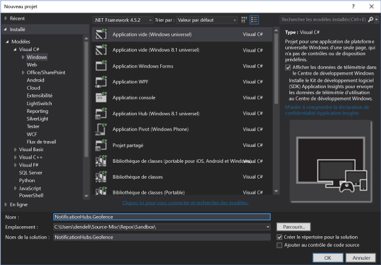

Une fois le projet créé, vous pouvez commencer à exploiter l’application. Nous allons à présent définir l’infrastructure de clôture virtuelle. Pour ce faire, nous allons utiliser les services Bing ; nous pouvons ainsi interroger des infrastructures de localisation spécifiques grâce à un point de terminaison d’API REST public :

    http://spatial.virtualearth.net/REST/v1/data/

Pour que cela fonctionne, vous devez spécifier les paramètres suivants :

* **ID de source de données** et **nom de source de données** : dans l’API Bing Cartes, les sources de données contiennent diverses métadonnées compartimentées, telles que les emplacements et les heures d’ouverture de l’opération. Poursuivez la lecture pour en savoir plus. 
* **Nom d’entité** : l’entité que vous souhaitez utiliser comme point de référence pour la notification. 
* **Clé d’API Bing Cartes** : il s’agit de la clé que vous avez obtenue précédemment lorsque vous avez créé le compte Centre de développement Bing.

Passons en revue la configuration de chacun des éléments ci-dessus.

## Configuration de la source de données
Vous pouvez configurer la source de données dans le Centre de développement Bing Cartes. Dans la barre de navigation du haut, sélectionnez **Sources de données** > **Gérer les sources de données**.

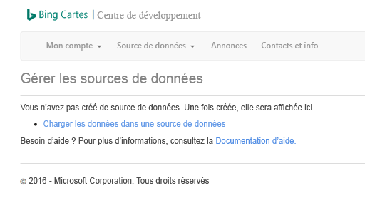

Si vous n’avez jamais travaillé avec l’API Bing Cartes, celle-ci ne présentera probablement pas de sources de données. Pour en créer une, sélectionnez **Sources de données** > **Charger des données**. Assurez-vous de remplir tous les champs obligatoires :

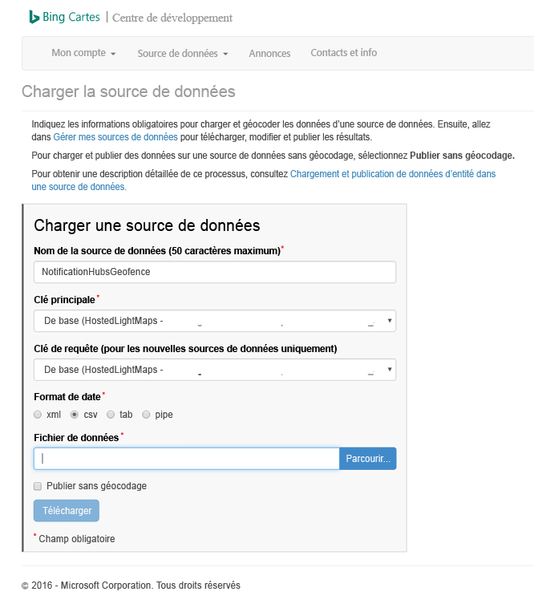

Vous vous demandez peut-être ce qu’est le fichier de données et ce que vous devez télécharger. Dans le cadre de ce test, nous pouvons simplement utiliser l’exemple au format pipe qui encadre une partie des quais de San Francisco :

    Bing Spatial Data Services, 1.0, TestBoundaries
    EntityID(Edm.String,primaryKey)|Name(Edm.String)|Longitude(Edm.Double)|Latitude(Edm.Double)|Boundary(Edm.Geography)
    1|SanFranciscoPier|||POLYGON ((-122.389825 37.776598,-122.389438 37.773087,-122.381885 37.771849,-122.382186 37.777022,-122.389825 37.776598))

Cette chaîne représente l’entité suivante :

Copiez et collez la chaîne ci-dessus dans un nouveau fichier, enregistrez-le sous le nom **NotificationHubsGeofence.pipe**, puis chargez-le dans le Centre de développement Bing.

> [!NOTE]
> Vous serez peut-être invité à spécifier une nouvelle clé pour la **clé principale** qui diffère de la **clé de requête**. Créez simplement une clé dans le tableau de bord et actualisez la page de téléchargement de la source de données.
> 
> 

Une fois que vous avez téléchargé le fichier de données, vous devez publier la source de données. 

Accédez à **Gérer les sources de données** (comme vu précédemment), recherchez la source de données dans la liste, puis sélectionnez **Publier** dans la colonne **Actions**. Vous verrez votre source de données dans l’onglet **Sources de données publiées** d’ici quelques instants :

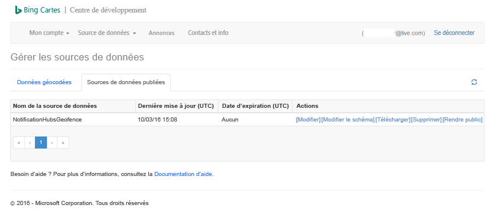

Si vous sélectionnez **Modifier**, vous verrez (rapidement) quels emplacements nous avons introduits dans celle-ci :

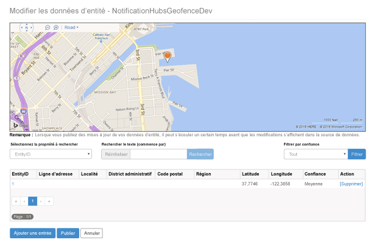

À ce stade, le portail n’indique pas les limites de la clôture virtuelle que vous avez créée. Vous devez seulement avoir la confirmation que l’emplacement spécifié se trouve dans la bonne zone.

Toutes les conditions nécessaires sont désormais remplies pour la source de données. Pour obtenir plus d’informations sur l’URL de la demande pour l’appel d’API, sélectionnez **Sources de données** dans le Centre de développement Bing Cartes, puis **Informations sur la source de données**.

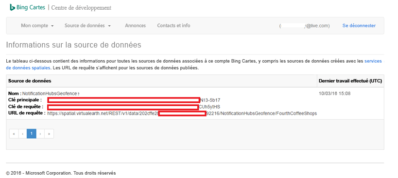

C’est l’ **URL de requête** qui nous intéresse à présent. C’est le point de terminaison sur lequel nous pouvons exécuter des requêtes pour vérifier si l’appareil se trouve dans les limites d’un emplacement ou non. Pour effectuer cette vérification, il suffit d’exécuter un appel GET sur l’URL de requête, en ajoutant les paramètres suivants :

    ?spatialFilter=intersects(%27POINT%20LONGITUDE%20LATITUDE)%27)&$format=json&key=QUERY_KEY

De cette façon, vous spécifiez un point cible que nous obtenons grâce à l’appareil, et Bing Cartes calcule automatiquement si celui-ci se trouve dans les limites de la clôture virtuelle. Lorsque vous exécutez la requête via un navigateur (ou cURL), vous obtenez une réponse JSON standard :

Cette réponse se produit uniquement lorsque le point se trouve bien dans les limites désignées. Si ce n’est pas le cas, vous obtiendrez un compartiment **results** vide :

## Configuration de l’application UWP
Maintenant que la source de données est prête, nous pouvons commencer à travailler sur l’application UWP commencée précédemment.

Tout d’abord, nous devons activer les services de localisation pour l’application. Pour ce faire, ouvrez le fichier `Package.appxmanifest` dans l’**Explorateur de solutions**.

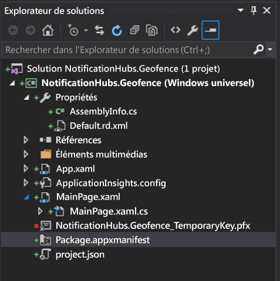

Dans l’onglet de propriétés du package que vous venez d’ouvrir, sélectionnez **Capacités**, et veillez à sélectionner **Localisation** :

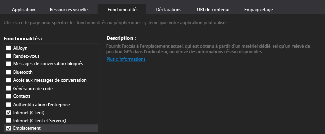

Après avoir déclaré la fonctionnalité de localisation, créez un dossier dans votre solution appelé `Core`, puis créez un fichier appelé `LocationHelper.cs` dans ce dernier :

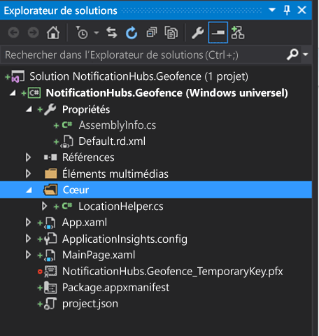

La classe `LocationHelper` est assez basique à ce stade ; elle permet uniquement d’obtenir l’emplacement de l’utilisateur via l’API système :

    using System;
    using System.Threading.Tasks;
    using Windows.Devices.Geolocation;

    namespace NotificationHubs.Geofence.Core
    {
        public class LocationHelper
        {
            private static readonly uint AppDesiredAccuracyInMeters = 10;

            public async static Task<Geoposition> GetCurrentLocation()
            {
                var accessStatus = await Geolocator.RequestAccessAsync();
                switch (accessStatus)
                {
                    case GeolocationAccessStatus.Allowed:
                        {
                            Geolocator geolocator = new Geolocator { DesiredAccuracyInMeters = AppDesiredAccuracyInMeters };

                            return await geolocator.GetGeopositionAsync();
                        }
                    default:
                        {
                            return null;
                        }
                }
            }

        }
    }

Pour en savoir plus sur l’obtention de l’emplacement de l’utilisateur dans les applications UWP, consultez le [document MSDN](https://msdn.microsoft.com/library/windows/apps/mt219698.aspx)officiel.

Pour vérifier que l’obtention de l’emplacement fonctionne correctement, accédez au code de votre page d’accueil (`MainPage.xaml.cs`). Créez un gestionnaire d’événements pour l’événement `Loaded` dans le constructeur `MainPage` :

    public MainPage()
    {
        this.InitializeComponent();
        this.Loaded += MainPage_Loaded;
    }

L’implémentation du gestionnaire d’événements se fait de la manière suivante :

    private async void MainPage_Loaded(object sender, RoutedEventArgs e)
    {
        var location = await LocationHelper.GetCurrentLocation();

        if (location != null)
        {
            Debug.WriteLine(string.Concat(location.Coordinate.Longitude,
                " ", location.Coordinate.Latitude));
        }
    }

Notez que nous avons déclaré le gestionnaire asynchrone, car `GetCurrentLocation` peut être attendu et doit donc être exécuté dans un contexte asynchrone. En outre, un emplacement Null peut se présenter dans certains cas (par exemple lorsque les services de localisation sont désactivés ou lorsque l’application n’est pas autorisée à accéder à l’emplacement). Cela impose un traitement par validation de valeur Null.

Exécutez l'application. Assurez-vous d’avoir autorisé l’accès à l’emplacement :

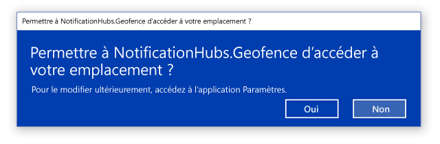

Lorsque l’application démarre, vous devez être en mesure de voir les coordonnées dans la fenêtre **Sortie** :

Vous savez désormais que l’obtention de l’emplacement fonctionne ; n’hésitez pas à supprimer le gestionnaire d’événements de test pour Loaded, car vous ne l’utiliserez plus.

L’étape suivante consiste à capturer le changement d’emplacement. Pour ce faire, revenez à la classe `LocationHelper` et ajoutez le gestionnaire d’événements pour `PositionChanged` :

    geolocator.PositionChanged += Geolocator_PositionChanged;

L’implémentation affichera les coordonnées de l’emplacement dans la fenêtre **Sortie** :

    private static async void Geolocator_PositionChanged(Geolocator sender, PositionChangedEventArgs args)
    {
        await CoreApplication.MainView.CoreWindow.Dispatcher.RunAsync(CoreDispatcherPriority.Normal, () =>
        {
            Debug.WriteLine(string.Concat(args.Position.Coordinate.Longitude, " ", args.Position.Coordinate.Latitude));
        });
    }

## Configuration du backend
Téléchargez [l’exemple de backend .NET sur GitHub](https://github.com/Azure/azure-notificationhubs-samples/tree/master/dotnet/NotifyUsers). Une fois téléchargé, ouvrez le dossier `NotifyUsers`, puis le fichier `NotifyUsers.sln`.

Définissez le projet `AppBackend` comme **Projet de démarrage** , puis exécutez-le.

Le projet est déjà configuré pour envoyer des notifications push aux appareils cibles. Vous aurez seulement deux actions à effectuer : permuter la bonne chaîne de connexion pour le hub de notification et ajouter l’identification des limites afin d’envoyer une notification uniquement lorsque l’utilisateur se trouve dans les limites de la clôture virtuelle.

Pour configurer la chaîne de connexion dans le dossier `Models`, ouvrez `Notifications.cs`. La fonction `NotificationHubClient.CreateClientFromConnectionString` doit contenir les informations sur votre hub de notification que vous pouvez obtenir dans le [portail Azure](https://portal.azure.com) (consultez le panneau **Stratégies d’accès** dans **Paramètres**). Enregistrez le fichier de configuration mis à jour.

Vous devez à présent créer un modèle pour le résultat de l’API Bing Cartes. Pour ce faire, la méthode la plus simple consiste à ouvrir le dossier `Models`, puis à sélectionner **Ajouter** > **Classe**. Nommez-le `GeofenceBoundary.cs`. Une fois cette opération effectuée, copiez le code JSON de la réponse d’API vu dans la première section. Dans Visual Studio, cliquez sur **Modifier** > **Collage spécial** > **Coller le code JSON en tant que classes**. 

De cette façon, l’objet sera désérialisé (ce qui était l’objectif). La classe obtenue doit ressembler à ceci :

    namespace AppBackend.Models
    {
        public class Rootobject
        {
            public D d { get; set; }
        }

        public class D
        {
            public string __copyright { get; set; }
            public Result[] results { get; set; }
        }

        public class Result
        {
            public __Metadata __metadata { get; set; }
            public string EntityID { get; set; }
            public string Name { get; set; }
            public float Longitude { get; set; }
            public float Latitude { get; set; }
            public string Boundary { get; set; }
            public string Confidence { get; set; }
            public string Locality { get; set; }
            public string AddressLine { get; set; }
            public string AdminDistrict { get; set; }
            public string CountryRegion { get; set; }
            public string PostalCode { get; set; }
        }

        public class __Metadata
        {
            public string uri { get; set; }
        }
    }

Ensuite, ouvrez `Controllers` > `NotificationsController.cs`. L’appel POST doit être modifié afin de prendre en compte la longitude et la latitude cibles. Pour cela, ajoutez simplement deux chaînes à la signature de la fonction : `latitude` et `longitude`.

    public async Task<HttpResponseMessage> Post(string pns, [FromBody]string message, string to_tag, string latitude, string longitude)

Créez une classe dans le projet appelée `ApiHelper.cs`. Celle-ci permet de se connecter à Bing afin de vérifier les intersections des limites des points. Implémentez une fonction `IsPointWithinBounds` de la manière suivante :

    public class ApiHelper
    {
        public static readonly string ApiEndpoint = "{YOUR_QUERY_ENDPOINT}?spatialFilter=intersects(%27POINT%20({0}%20{1})%27)&$format=json&key={2}";
        public static readonly string ApiKey = "{YOUR_API_KEY}";

        public static bool IsPointWithinBounds(string longitude,string latitude)
        {
            var json = new WebClient().DownloadString(string.Format(ApiEndpoint, longitude, latitude, ApiKey));
            var result = JsonConvert.DeserializeObject<Rootobject>(json);
            if (result.d.results != null && result.d.results.Count() > 0)
            {
                return true;
            }
            else
            {
                return false;
            }
        }
    }

> [!NOTE]
> Veillez à remplacer le point de terminaison d’API avec l’URL de requête obtenue précédemment dans le Centre de développement Bing (cela s’applique également à la clé d’API). 
> 
> 

Si la requête renvoie des résultats, cela signifie que le point spécifié se trouve dans les limites de la clôture virtuelle. Vous devez donc retourner `true`. Si Bing ne renvoie pas de résultats, cela signifie que le point se trouve en dehors des limites de la recherche. Vous devez donc retourner `false`.

Dans `NotificationsController.cs`, créez une vérification juste avant l’instruction switch :

    if (ApiHelper.IsPointWithinBounds(longitude, latitude))
    {
        switch (pns.ToLower())
        {
            case "wns":
                //// Windows 8.1 / Windows Phone 8.1
                var toast = @"<toast><visual><binding template=""ToastText01""><text id=""1"">" +
                            "From " + user + ": " + message + "</text></binding></visual></toast>";
                outcome = await Notifications.Instance.Hub.SendWindowsNativeNotificationAsync(toast, userTag);

                // Windows 10 specific Action Center support
                toast = @"<toast><visual><binding template=""ToastGeneric""><text id=""1"">" +
                            "From " + user + ": " + message + "</text></binding></visual></toast>";
                outcome = await Notifications.Instance.Hub.SendWindowsNativeNotificationAsync(toast, userTag);

                break;
        }
    }

De cette façon, la notification est envoyée uniquement lorsque le point se trouve dans les limites.

## Test des notifications push dans l’application UWP
Concernant l’application UWP, vous devriez à présent être en mesure de tester les notifications. Dans la classe `LocationHelper`, créez une fonction `SendLocationToBackend` :

    public static async Task SendLocationToBackend(string pns, string userTag, string message, string latitude, string longitude)
    {
        var POST_URL = "http://localhost:8741/api/notifications?pns=" +
            pns + "&to_tag=" + userTag + "&latitude=" + latitude + "&longitude=" + longitude;

        using (var httpClient = new HttpClient())
        {
            try
            {
                await httpClient.PostAsync(POST_URL, new StringContent("\"" + message + "\"",
                    System.Text.Encoding.UTF8, "application/json"));
            }
            catch (Exception ex)
            {
                Debug.WriteLine(ex.Message);
            }
        }
    }

> [!NOTE]
> Permutez `POST_URL` à l’emplacement de votre application web déployée que vous avez créée à la section précédente. Il est possible de l’exécuter localement pour le moment, mais lorsque vous travaillez sur le déploiement d’une version publique, vous devrez l’héberger avec un fournisseur externe.
> 
> 

Assurez-vous d’inscrire l’application UWP pour les notifications push. Dans Visual Studio, sélectionnez **Projet** > **Store** > **Associer l’application au Store**.

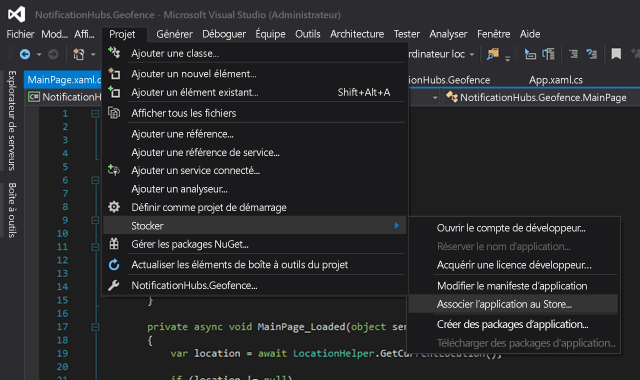

Une fois que vous êtes connecté à votre compte de développeur, sélectionnez une application existante ou créez une application et associez le package à celle-ci. 

Accédez au Centre de développement et ouvrez l’application que vous venez de créer. Sélectionnez **Services** > **Notifications push** > **Services Microsoft Live**.

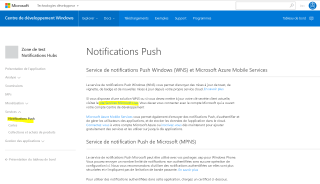

Sur le site, prenez note du **Secret d’application** et du **Package SID**. Vous aurez besoin de ces deux éléments dans le portail Azure. Ouvrez votre hub de notification, sélectionnez **Paramètres** > **Services de notification** > **Windows (WNS)** et entrez les informations dans les champs requis.

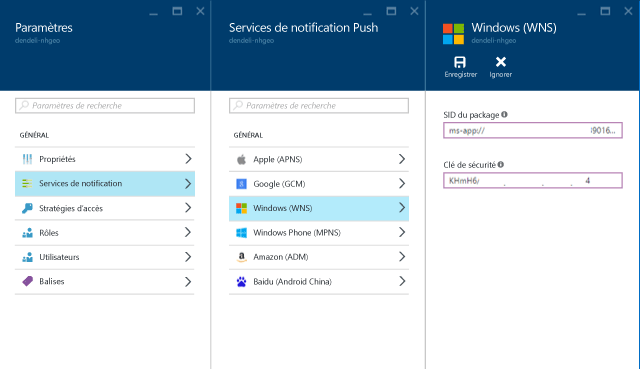

Choisissez **Enregistrer**.

Dans l’**Explorateur de solutions**, ouvrez **Références**, puis sélectionnez **Gérer les packages NuGet**. Vous devrez ajouter une référence à la **bibliothèque managée Microsoft Azure Service Bus** ; recherchez simplement `WindowsAzure.Messaging.Managed` et ajoutez-le à votre projet.

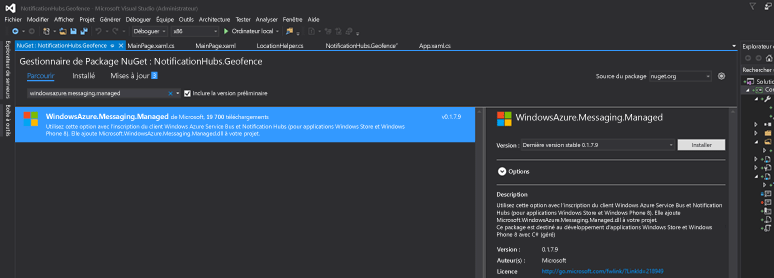

À des fins de test, vous pouvez recréer le gestionnaire d’événements `MainPage_Loaded` , puis lui ajouter cet extrait de code :

    var channel = await PushNotificationChannelManager.CreatePushNotificationChannelForApplicationAsync();

    var hub = new NotificationHub("HUB_NAME", "HUB_LISTEN_CONNECTION_STRING");
    var result = await hub.RegisterNativeAsync(channel.Uri);

    // Displays the registration ID so you know it was successful
    if (result.RegistrationId != null)
    {
        Debug.WriteLine("Reg successful.");
    }

Le code ci-dessus inscrit l’application auprès du hub de notification. Vous avez terminé ! 

Dans `LocationHelper`, à l’intérieur du gestionnaire `Geolocator_PositionChanged`, vous pouvez ajouter un extrait de code de test qui force l’emplacement à l’intérieur des limites de la clôture virtuelle :

    await LocationHelper.SendLocationToBackend("wns", "TEST_USER", "TEST", "37.7746", "-122.3858");

Étant donné que vous ne transmettez pas les coordonnées réelles (qui ne se trouvent peut-être pas dans les limites actuellement) et que vous utilisez des valeurs de test prédéfinies, vous verrez une notification s’afficher lors de la mise à jour :

## Et ensuite ?
Vous devrez peut-être suivre quelques étapes supplémentaires outre celles présentées ci-dessus pour vous assurer que la solution est prête pour la production.

Tout d’abord, assurez-vous que la clôture virtuelle est dynamique. Cette opération nécessite des actions supplémentaires avec l’API Bing pour pouvoir télécharger les nouvelles limites au sein de la source de données existante. Pour plus d’informations sur ce sujet, consultez la [documentation de l’API de Services de données spatiales Bing](https://msdn.microsoft.com/library/ff701734.aspx) .

Ensuite, vous pouvez cibler les participants appropriés par [balisage](notification-hubs-tags-segment-push-message.md)pour garantir une remise correcte.

La solution ci-dessus décrit un scénario dans lequel vous disposez d’un large choix de plateformes cibles. La clôture virtuelle n’a donc pas été limitée à des fonctionnalités spécifiques du système. Ceci dit, la plateforme Windows universelle offre des fonctionnalités [prêtes à l’emploi pouvant détecter les clôtures virtuelles](https://msdn.microsoft.com/windows/uwp/maps-and-location/set-up-a-geofence).

Pour plus de détails concernant les fonctionnalités de Notification Hubs, consultez le [portail documentaire](https://azure.microsoft.com/documentation/services/notification-hubs/).

