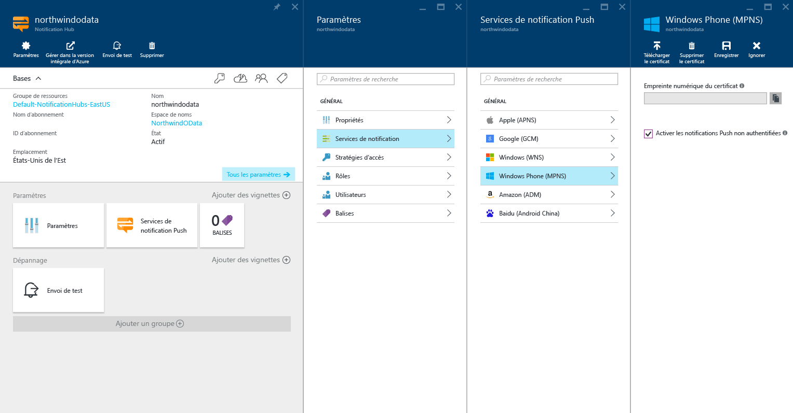

<properties
	pageTitle="Envoi de notifications Push avec Azure Notification Hubs sur Windows Phone | Microsoft Azure"
	description="Ce didacticiel vous apprend à utiliser Azure Notification Hubs pour envoyer des notifications Push vers une application Windows Phone 8 ou Windows Phone 8.1 Silverlight."
	services="notification-hubs"
	documentationCenter="windows"
    keywords="notification push,notification push,push windows phone"
	authors="wesmc7777"
	manager="dwrede"
	editor="dwrede"/>

<tags
	ms.service="notification-hubs"
	ms.workload="mobile"
	ms.tgt_pltfrm="mobile-windows-phone"
	ms.devlang="dotnet"
	ms.topic="hero-article"
	ms.date="03/10/2016"
	ms.author="wesmc"/>

# Envoi de notifications Push avec Azure Notification Hubs sur Windows Phone

[AZURE.INCLUDE [notification-hubs-selector-get-started](../../includes/notification-hubs-selector-get-started.md)]

##Vue d'ensemble

> [AZURE.NOTE] Pour suivre ce didacticiel, vous avez besoin d'un compte Azure actif. Si vous ne possédez pas de compte, vous pouvez créer un compte d'évaluation gratuit en quelques minutes. Pour plus d'informations, consultez la page [Version d'évaluation gratuite d'Azure](https://azure.microsoft.com/pricing/free-trial/?WT.mc_id=A0E0E5C02&amp;returnurl=http%3A%2F%2Fazure.microsoft.com%2Ffr-FR%2Fdocumentation%2Farticles%2Fnotification-hubs-windows-phone-get-started%2F).

Ce didacticiel montre comment utiliser Azure Notification Hubs pour envoyer des notifications Push vers une application Windows Phone 8 ou Windows Phone 8.1 Silverlight. Si vous ciblez Windows Phone 8.1 (non-Silverlight), reportez-vous à la version [Windows Universel](notification-hubs-windows-store-dotnet-get-started.md). Ce didacticiel vous apprend à créer une application Windows Phone 8 vide qui reçoit des notifications Push au moyen du Service de notifications Push Microsoft (MPNS). Une fois l’opération terminée, vous pouvez utiliser votre hub de notification pour diffuser des notifications Push sur tous les appareils exécutant votre application.

> [AZURE.NOTE] Le kit de développement logiciel (SDK) Windows Phone Notification Hubs ne prend pas en charge l’utilisation des services WNS avec les applications Silverlight Windows Phone 8.1. Pour utiliser WNS (et non MPNS) avec les applications Windows Phone 8.1 Silverlight, suivez le [didacticiel Notification Hubs - Windows Phone Silverlight], qui s’appuie sur des API REST.

Ce didacticiel présente un scénario de diffusion simple avec Notification Hubs.

##Composants requis

Ce didacticiel requiert les éléments suivants :

+ [Visual Studio 2012 Express pour Windows Phone] ou version ultérieure.

Vous devez suivre ce didacticiel avant de pouvoir suivre tous les autres didacticiels concernant les Notification Hubs pour les applications Windows Phone 8.

##Création de votre hub de notification

[AZURE.INCLUDE [notification-hubs-portal-create-new-hub](../../includes/notification-hubs-portal-create-new-hub.md)]

<ol start="6">
<li>
Sous <i>Paramètres</i>, cliquez sur la section <b>Services de notification</b>, cliquez sur <b>Windows Phone (MPNS)</b> puis cochez la case <b>Activez des notifications Push non authentifiées</b>.

</li>
</ol>

&emsp;&emsp;

Le concentrateur est maintenant créé et configuré pour envoyer une notification non authentifiée pour Windows Phone.

> [AZURE.NOTE] Ce didacticiel utilise MPNS en mode non authentifié. Le mode MPNS non authentifié est assorti de restrictions sur les notifications que vous pouvez envoyer à chaque canal. Notification Hubs prend en charge le [mode authentifié MPNS](http://msdn.microsoft.com/library/windowsphone/develop/ff941099.aspx) en vous permettant de télécharger votre certificat.

##Connexion de votre application au hub de notification

1. Dans Visual Studio, créez une application Windows Phone 8.

   	![Visual Studio - Nouveau projet - Application Windows Phone][13]

	Dans Visual Studio 2013 Update 2 ou version ultérieure, vous créez plutôt une application Silverlight Windows Phone.

	![Visual Studio - Nouveau projet - Application vide - Windows Phone Silverlight][11]

2. Dans Visual Studio, cliquez avec le bouton droit sur la solution, puis cliquez sur **Gérer les packages NuGet**.

	La boîte de dialogue **Gérer les packages NuGet** s’affiche.

3. Recherchez `WindowsAzure.Messaging.Managed`, puis cliquez sur **Installer** et acceptez les conditions d’utilisation.

	![Visual Studio - Gestionnaire de packages NuGet][20]

	Une référence à la bibliothèque Azure Messaging pour Windows est alors téléchargée, installée et ajoutée à l’aide du <a href="http://nuget.org/packages/WindowsAzure.Messaging.Managed/">package NuGet WindowsAzure.Messaging.Managed</a>.

4. Ouvrez le fichier App.xaml.cs et ajoutez les instructions `using` suivantes :

        using Microsoft.Phone.Notification;
        using Microsoft.WindowsAzure.Messaging;

5. Au niveau du code suivant en haut de la méthode **Application\_Launching** dans App.xaml.cs :

	    var channel = HttpNotificationChannel.Find("MyPushChannel");
        if (channel == null)
        {
            channel = new HttpNotificationChannel("MyPushChannel");
            channel.Open();
            channel.BindToShellToast();
        }

        channel.ChannelUriUpdated += new EventHandler<NotificationChannelUriEventArgs>(async (o, args) =>
        {
            var hub = new NotificationHub("<hub name>", "<connection string>");
            var result = await hub.RegisterNativeAsync(args.ChannelUri.ToString());

            System.Windows.Deployment.Current.Dispatcher.BeginInvoke(() =>
            {
                MessageBox.Show("Registration :" + result.RegistrationId, "Registered", MessageBoxButton.OK);
            });
        });

    >[AZURE.NOTE] La valeur **MyPushChannel** est un index utilisé pour rechercher un canal existant dans la collection [HttpNotificationChannel](https://msdn.microsoft.com/library/windows/apps/microsoft.phone.notification.httpnotificationchannel.aspx). S’il n’y en a aucun, créez une entrée portant ce nom.
    
    Insérez le nom de votre hub et la chaîne de connexion appelée **DefaultListenSharedAccessSignature** obtenue dans la section précédente. Ce code récupère l’URI de canal correspondant à l’application dans MPNS, puis inscrit ce dernier avec votre notification Hub. Il garantit également l’inscription de l’URI de canal dans votre hub de notification à chaque fois que l’application est lancée.

	>[AZURE.NOTE]Ce didacticiel permet d'envoyer une notification toast à l'appareil. Lorsque vous envoyez une notification par vignette, vous devez appeler la méthode **BindToShellTile** sur le canal. Pour la prise en charge des notifications toast ainsi que des notifications par vignette, appelez **BindToShellTile** et **BindToShellToast**.

6. Dans l’Explorateur de solutions, développez **Propriétés**, ouvrez le fichier `WMAppManifest.xml`, cliquez sur l’onglet **Fonctionnalités** et assurez-vous que la fonctionnalité **ID\_CAP\_PUSH\_NOTIFICATION** soit activée.

   	![Visual Studio - Fonctionnalités des applications Windows Phone][14]

   	Cela garantit que votre application peut recevoir des notifications Push. À défaut, toute tentative d’envoi d’une notification Push à l’application échouera.

7. Appuyez sur la touche `F5` pour exécuter l’application.

	Un message d’inscription s’affiche dans l’application.

8. Fermez l’application.

   >[AZURE.NOTE] Pour recevoir une notification Push toast, l’application ne doit pas s’exécuter au premier plan.

##Envoi de notifications Push à partir de votre serveur principal

Vous pouvez envoyer des notifications Push en utilisant Notification Hubs à partir d’un serveur principal utilisant l’<a href="http://msdn.microsoft.com/library/windowsazure/dn223264.aspx">interface REST</a> publique. Ce didacticiel montre comment envoyer des notifications Push à l’aide d’une application de console .NET.

Pour découvrir un exemple de la procédure d’envoi de notifications Push à partir d’un serveur principal WebAPI ASP.NET intégré à Notification Hubs, consultez l’article [Notification des utilisateurs via Azure Notification Hubs avec service principal .NET](./notification-hubs-aspnet-backend-windows-dotnet-notify-users.md).

Pour voir un exemple d’envoi de notifications Push au moyen des [API REST](https://msdn.microsoft.com/library/azure/dn223264.aspx), consultez les articles [Utilisation de Notification Hubs à partir de Java](./notification-hubs-java-backend-how-to.md) et [Utilisation de Notification Hubs avec PHP](./notification-hubs-php-backend-how-to.md).

1. Cliquez avec le bouton droit sur la solution, sélectionnez **Ajouter** et **Nouveau projet**, puis sous **Visual C#**, cliquez sur **Windows** et **Application Console**. Enfin, cliquez sur **OK**.

   	![Visual Studio - Nouveau projet - Application console][6]

	Une nouvelle application console Visual C# est ajoutée à la solution. Vous pouvez également réaliser cette opération dans une solution distincte.

4. Cliquez sur **Outils**, sur **Library Package Manager**, puis sur **Console du gestionnaire de package**.

	La Console du Gestionnaire de package apparaît.

5.  Dans la fenêtre **Console du gestionnaire de package**, affectez votre nouveau projet d’application console comme **Projet par défaut**, puis exécutez la commande suivante dans la fenêtre de console :

        Install-Package Microsoft.Azure.NotificationHubs

	Cette opération ajoute une référence au Kit de développement logiciel (SDK) Azure Notification Hubs à l’aide du <a href="http://www.nuget.org/packages/Microsoft.Azure.NotificationHubs/">package NuGet Microsoft.Azure.Notification Hubs</a>.

6. Ouvrez le fichier `Program.cs` et ajoutez l’instruction `using` suivante :

        using Microsoft.Azure.NotificationHubs;

6. Dans la classe `Program`, ajoutez la méthode suivante :

        private static async void SendNotificationAsync()
        {
            NotificationHubClient hub = NotificationHubClient
				.CreateClientFromConnectionString("<connection string with full access>", "<hub name>");
            string toast = "<?xml version="1.0" encoding="utf-8"?>" +
                "<wp:Notification xmlns:wp="WPNotification">" +
                   "<wp:Toast>" +
                        "<wp:Text1>Hello from a .NET App!</wp:Text1>" +
                   "</wp:Toast> " +
                "</wp:Notification>";
            await hub.SendMpnsNativeNotificationAsync(toast);
        }

	Remplacez l’espace réservé `<hub name>` par le nom du hub de notification affiché sur le portail. Remplacez également l’espace réservé de la chaîne de connexion par la chaîne de connexion appelée **DefaultFullSharedAccessSignature** que vous avez obtenue dans la section « Configuration de votre notification hub ».

	>[AZURE.NOTE]Assurez-vous d’utiliser la chaîne de connexion avec un accès **Total**, et non un accès **Écouter**. La chaîne d’accès en écoute seule ne dispose pas des autorisations pour envoyer des notifications Push.

4. Ajoutez la ligne suivante dans votre méthode `Main` :

         SendNotificationAsync();
		 Console.ReadLine();

5. Votre émulateur Windows Phone étant en cours d’exécution et votre application fermée, configurez le projet d’application console comme projet de démarrage par défaut, puis appuyez sur la touche `F5` pour exécuter l’application.

	Vous recevrez une notification Push toast. Une pression sur la bannière du toast pour charger l’application.

Vous trouverez toutes les charges utiles possibles dans le [catalogue toast] et le [catalogue de modèles de vignette] sur MSDN.

##Étapes suivantes

Dans cet exemple simple, vous avez diffusé des notifications Push à tous vos appareils Windows Phone 8.

Pour cibler certains utilisateurs, reportez-vous au didacticiel [Utilisation des Notification Hubs pour envoyer des notifications Push aux utilisateurs].

Pour segmenter vos utilisateurs par groupes d'intérêt, consultez la page [Utilisation des Notification Hubs pour diffuser les dernières nouvelles].

Découvrez plus en détail comment utiliser Notification Hubs dans [Recommandations relatives à Notification Hubs].

<!-- Images. -->
[6]: ./media/notification-hubs-windows-phone-get-started/notification-hub-create-console-app.png
[7]: ./media/notification-hubs-windows-phone-get-started/notification-hub-create-from-portal.png
[8]: ./media/notification-hubs-windows-phone-get-started/notification-hub-create-from-portal2.png
[9]: ./media/notification-hubs-windows-phone-get-started/notification-hub-select-from-portal.png
[10]: ./media/notification-hubs-windows-phone-get-started/notification-hub-select-from-portal2.png
[11]: ./media/notification-hubs-windows-phone-get-started/notification-hub-create-wp-silverlight-app.png
[12]: ./media/notification-hubs-windows-phone-get-started/notification-hub-connection-strings.png

[13]: ./media/notification-hubs-windows-phone-get-started/notification-hub-create-wp-app.png
[14]: ./media/notification-hubs-windows-phone-get-started/mobile-app-enable-push-wp8.png
[15]: ./media/notification-hubs-windows-phone-get-started/notification-hub-pushauth.png
[20]: ./media/notification-hubs-windows-phone-get-started/notification-hub-windows-universal-app-install-package.png
[213]: ./media/notification-hubs-windows-phone-get-started/notification-hub-create-console-app.png

<!-- URLs. -->
[Visual Studio 2012 Express pour Windows Phone]: https://go.microsoft.com/fwLink/p/?LinkID=268374
[Recommandations relatives à Notification Hubs]: http://msdn.microsoft.com/library/jj927170.aspx
[MPNS authenticated mode]: http://msdn.microsoft.com/library/windowsphone/develop/ff941099(v=vs.105).aspx
[Utilisation des Notification Hubs pour envoyer des notifications Push aux utilisateurs]: notification-hubs-aspnet-backend-windows-dotnet-notify-users.md
[Utilisation des Notification Hubs pour diffuser les dernières nouvelles]: notification-hubs-windows-phone-send-breaking-news.md
[catalogue toast]: http://msdn.microsoft.com/library/windowsphone/develop/jj662938(v=vs.105).aspx
[catalogue de modèles de vignette]: http://msdn.microsoft.com/library/windowsphone/develop/hh202948(v=vs.105).aspx
[didacticiel Notification Hubs - Windows Phone Silverlight]: https://github.com/Azure/azure-notificationhubs-samples/tree/master/PushToSLPhoneApp

<!---HONumber=AcomDC_0316_2016-->