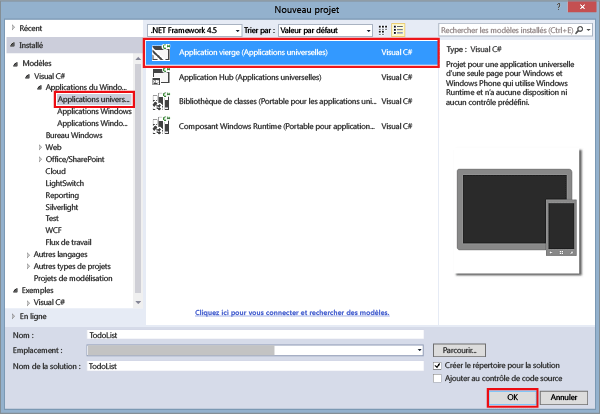
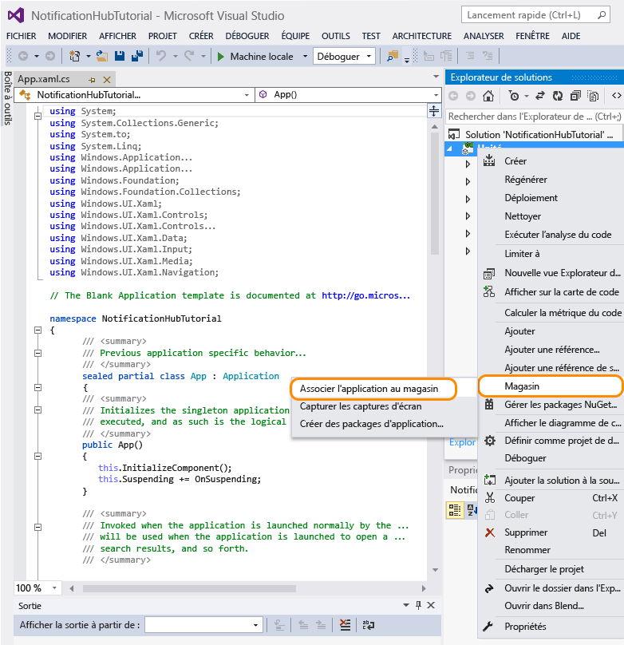
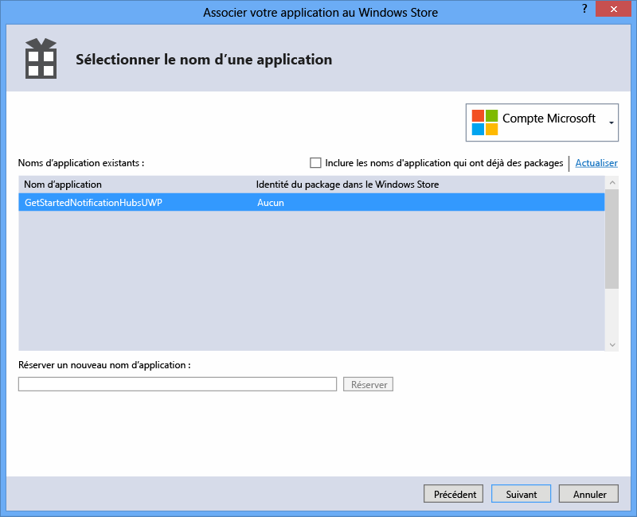
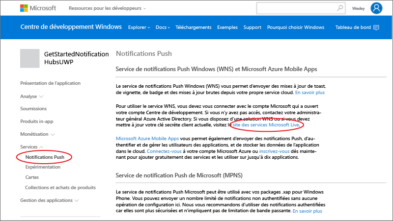
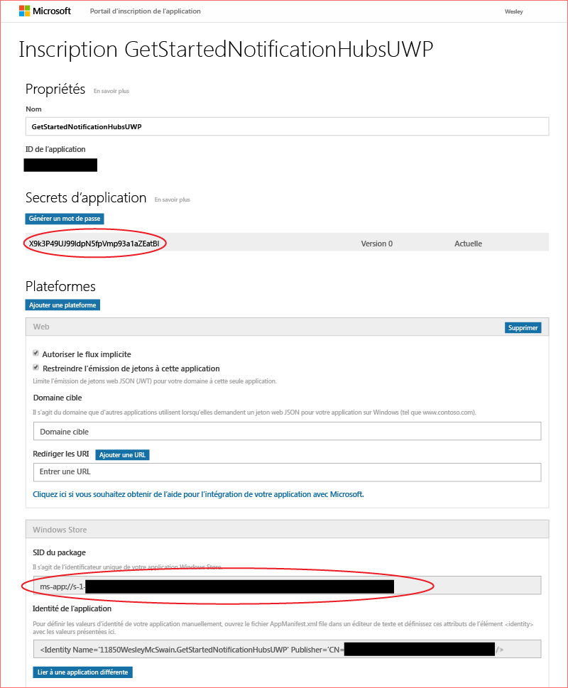

# Prise en main de Notification Hubs pour les applications de plateforme Windows universelle

[!INCLUDE [notification-hubs-selector-get-started](../../includes/notification-hubs-selector-get-started.md)]

## Vue d'ensemble

Ce didacticiel vous indique comment utiliser Azure Notification Hubs pour envoyer des notifications Push à une application de plateforme Windows universelle (UWP).

Le didacticiel vous apprend à créer une application Windows Store vide qui reçoit des notifications Push au moyen du Service de notifications Windows Push (WNS). Une fois l’opération terminée, vous pouvez utiliser votre hub de notification pour diffuser des notifications Push sur tous les appareils exécutant votre application.

## Avant de commencer

[!INCLUDE [notification-hubs-hero-slug](../../includes/notification-hubs-hero-slug.md)]

Le code complet de ce didacticiel est disponible sur GitHub [ici](https://github.com/Azure/azure-notificationhubs-samples/tree/master/dotnet/GetStartedWindowsUniversal).

## Composants requis

Ce didacticiel requiert les éléments suivants :

* [Microsoft Visual Studio Community 2015](https://www.visualstudio.com/products/visual-studio-community-vs) ou version ultérieure
* [Outils de développement d’applications Windows universelles installés](https://msdn.microsoft.com/windows/uwp/get-started/get-set-up)
* Un compte Azure actif   Si vous ne possédez pas de compte, vous pouvez créer un compte d’évaluation gratuit en quelques minutes. Pour plus d'informations, consultez la page [Version d'évaluation gratuite d'Azure](https://azure.microsoft.com/pricing/free-trial/?WT.mc_id=A0E0E5C02&amp;returnurl=http%3A%2F%2Fazure.microsoft.com%2Fen-us%2Fdocumentation%2Farticles%2Fnotification-hubs-windows-store-dotnet-get-started%2F).
* Un compte Windows Store actif

Vous devez suivre ce didacticiel avant de pouvoir suivre tous les autres didacticiels Notification Hubs pour les applications de plateforme Windows universelle.

## Inscription de votre application pour le Windows Store

Pour envoyer des notifications Push à des applications UWP, vous devez associer votre application au Windows Store. Vous devez ensuite configurer votre Notification Hub pour l'intégrer à WNS.

1. Si vous n’avez pas déjà inscrit votre application, accédez à la page [Centre de développement Windows](https://dev.windows.com/overview), connectez-vous avec votre compte Microsoft, puis cliquez sur **Créer une application**.
2. Saisissez un nom pour votre application et cliquez sur **Réserver le nom d’application**.
   
    
   
   La nouvelle inscription au Windows Store pour votre application est créée.
3. Dans Visual Studio, créez un projet d’application du Windows Store Visual C# en utilisant le modèle **Application vide**, puis cliquez sur **OK**.
   
    
4. Acceptez les valeurs par défaut pour les versions de plateforme cible et minimale.
5. Dans l'Explorateur de solutions, cliquez avec le bouton droit sur le projet d'application Windows Store, cliquez sur **Store**, puis sur **Associer l'application au Windows Store...**.
   
    

   L'Assistant **Associer votre application au Windows Store** s'affiche.

1. Dans l’Assistant, cliquez sur **Se connecter** , puis connectez-vous avec votre compte Microsoft.
2. Cliquez sur l'application inscrite à l'étape 2, puis sur **Suivant** et sur **Associer**.
   
    
   
   Cela ajoute les informations d'inscription Windows Store requises au manifeste de l'application.
3. De retour dans la page [Centre de développement Windows](http://go.microsoft.com/fwlink/p/?LinkID=266582) de votre nouvelle application, cliquez sur **Services**, sur **Notifications Push**, puis sur **Site des services Microsoft Live** sous **Windows Push Notification Services (WNS) and Microsoft Azure Mobile Apps** (Services de notifications Push Windows (WNS) et Microsoft Azure Mobile Apps).
   
    
4. Sur la page d’inscription de votre application, prenez note du mot de passe **Clé secrète d’application** et de la valeur **Identificateur de sécurité (SID) du package** figurant dans les paramètres de la plateforme **Windows Store**.
   
    

     > [AZURE.WARNING]
    Le secret d’application et le SID du package sont des informations d'identification de sécurité importantes. Ne partagez pas ces valeurs avec quiconque et ne les distribuez pas avec votre application.

## Configuration de votre hub de notification

[!INCLUDE [notification-hubs-portal-create-new-hub](../../includes/notification-hubs-portal-create-new-hub.md)]

<ol start="6">
<li>
Sélectionnez les options <b>Services de notification</b> et <b>Windows (WNS)</b>. Puis entrez le mot de passe <b>Clé secrète d’application</b> dans le champ <b>Clé de sécurité</b>. Entrez la valeur <b>SID du package</b> que vous avez obtenue auprès de WNS à la section précédente, puis cliquez sur <b>Enregistrer</b>.

</li>
</ol>

&emsp;&emsp;

Votre Notification Hub est désormais configuré pour WNS, et vous disposez des chaînes de connexion pour inscrire votre application et envoyer des notifications.

## Connexion de votre application au hub de notification

1. Dans Visual Studio, cliquez avec le bouton droit sur la solution, puis cliquez sur **Gérer les packages NuGet**.
   
    La boîte de dialogue **Gérer les packages NuGet** s’affiche.
2. Recherchez `WindowsAzure.Messaging.Managed` , puis cliquez sur **Installer**et acceptez les conditions d’utilisation.
   
    ![][20]
   
    Une référence à la bibliothèque Azure Messaging pour Windows est alors téléchargée, installée et ajoutée à l’aide du <a href="http://nuget.org/packages/WindowsAzure.Messaging.Managed/">package NuGet WindowsAzure.Messaging.Managed</a>.
3. Ouvrez le fichier projet App.xaml.cs et ajoutez les instructions `using` qui suivent. 
   
        using Windows.Networking.PushNotifications;
        using Microsoft.WindowsAzure.Messaging;
        using Windows.UI.Popups;
4. Toujours dans le fichier App.xaml.cs, ajoutez la définition de méthode **InitNotificationsAsync** suivante à la classe **App** :
   
        private async void InitNotificationsAsync()
        {
            var channel = await PushNotificationChannelManager.CreatePushNotificationChannelForApplicationAsync();
   
            var hub = new NotificationHub("< your hub name>", "<Your DefaultListenSharedAccessSignature connection string>");
            var result = await hub.RegisterNativeAsync(channel.Uri);
   
            // Displays the registration ID so you know it was successful
            if (result.RegistrationId != null)
            {
                var dialog = new MessageDialog("Registration successful: " + result.RegistrationId);
                dialog.Commands.Add(new UICommand("OK"));
                await dialog.ShowAsync();
            }
   
        }
   
    Ce code récupère l’URI de canal pour l’application dans WNS et l’inscrit avec votre Notification Hub.
   
   > [!NOTE]
   > Remplacez l’espace réservé pour votre nom de hub par le nom du hub de notification affiché sur le Portail Azure. Remplacez également l’espace réservé de la chaîne de connexion par la chaîne de connexion **DefaultListenSharedAccessSignature** que vous avez obtenue sur la page **Stratégies d’accès** de votre hub de notification dans une section précédente.
   > 
   > 
5. En haut du gestionnaire d'événements **OnLaunched** dans App.xaml.cs, ajoutez l'appel suivant à la nouvelle méthode **InitNotificationsAsync** :
   
        InitNotificationsAsync();
   
    Cela garantit que l’inscription de l’URI de canal dans votre Notification Hub chaque fois que l’application est lancée.
6. Appuyez sur **F5** pour lancer l'application. Une boîte de dialogue s’affiche avec la clé d’inscription.
   
     ![][19]

Votre application est maintenant prête à recevoir des notifications toast.

## Envoi de notifications

Vous pouvez tester rapidement la réception de notifications dans votre application en envoyant des notifications dans le [Portail Azure](https://portal.azure.com/) à l’aide du bouton **Test d’envoi** sur le hub de notification, comme illustré ci-dessous.

Les notifications Push sont normalement envoyées dans un service principal tel que Mobile Services ou ASP.NET à l’aide d’une bibliothèque compatible. Vous pouvez également utiliser l’API REST directement pour envoyer des messages de notification si aucune bibliothèque n’est disponible pour votre serveur principal. 

Dans ce didacticiel, nous nous contenterons pour plus de simplicité de tester votre application cliente en envoyant des notifications à l'aide du Kit de développement logiciel (SDK) .NET pour Notification Hubs dans une application de console au lieu d'un service principal. Nous vous recommandons de consulter le didacticiel [Utiliser Notification Hubs pour envoyer des notifications Push aux utilisateurs] comme prochaine étape pour envoyer des notifications à partir d’un serveur principal ASP.NET. Toutefois, les approches suivantes peuvent servir à envoyer des notifications :

* **Interface REST** : vous pouvez prendre en charge les notifications sur n’importe quel serveur principal à l’aide de [l’interface REST](http://msdn.microsoft.com/library/windowsazure/dn223264.aspx).
* **SDK .NET Microsoft Azure Notification Hubs**: dans le Gestionnaire de package Nuget pour Visual Studio, exécutez [Install-Package Microsoft.Azure.NotificationHubs](https://www.nuget.org/packages/Microsoft.Azure.NotificationHubs/).
* **Node.js** : [Utilisation de Notification Hubs à partir de Node.js](notification-hubs-nodejs-push-notification-tutorial.md).
* **Applications mobiles Azure**: pour découvrir un exemple de la procédure d’envoi de notifications à partir d’une application mobile Azure intégrée à Notification Hubs, consultez l’article [Add push notifications for Mobile Apps](../app-service-mobile/app-service-mobile-windows-store-dotnet-get-started-push.md)(Ajouter des notifications Push pour Mobile Apps).
* **Java/PHP** : pour voir un exemple d’envoi de notifications au moyen des API REST, consultez « Utilisation de Notification Hubs depuis Java/PHP » ([Java](notification-hubs-java-push-notification-tutorial.md) | [PHP](notification-hubs-php-push-notification-tutorial.md)).

## (Facultatif) Envoi de notifications à partir d’une application de console

Procédez comme suit pour envoyer des notifications à l’aide d’une application de console .NET. 

1. Cliquez avec le bouton droit sur la solution, sélectionnez **Ajouter** et **Nouveau projet**, puis sous **Visual C#**, cliquez sur **Windows** et **Application Console**. Enfin, cliquez sur **OK**.
   
     ![][13]
   
    Une nouvelle application console Visual C# est ajoutée à la solution. Vous pouvez également réaliser cette opération dans une solution distincte.
2. Dans Visual Studio, cliquez successivement sur **Outils**, **Gestionnaire de package NuGet** et **Console du gestionnaire de package**.
   
    La console du gestionnaire de package s’affiche dans Visual Studio.
3. Dans la fenêtre Console du gestionnaire de package, choisissez **Projet par défaut** comme nouveau projet d’application console, puis exécutez la commande suivante dans la fenêtre de console :
   
        Install-Package Microsoft.Azure.NotificationHubs
   
    Cette opération ajoute une référence au Kit de développement logiciel (SDK) Azure Notification Hubs à l’aide du <a href="http://www.nuget.org/packages/Microsoft.Azure.NotificationHubs/">package NuGet Microsoft.Azure.Notification Hubs</a>.
   
    
4. Ouvrez le fichier Program.cs et ajoutez l’instruction `using` suivante :
   
        using Microsoft.Azure.NotificationHubs;
5. Dans la classe **Program** , ajoutez la méthode suivante :
   
        private static async void SendNotificationAsync()
        {
            NotificationHubClient hub = NotificationHubClient
                .CreateClientFromConnectionString("<connection string with full access>", "<hub name>");
            var toast = @"<toast><visual><binding template=""ToastText01""><text id=""1"">Hello from a .NET App!</text></binding></visual></toast>";
            await hub.SendWindowsNativeNotificationAsync(toast);
        }
   
       Make sure to replace the "hub name" placeholder with the name of the notification hub that as it appears in the Azure Portal. Also, replace the connection string placeholder with the **DefaultFullSharedAccessSignature** connection string that you obtained from the **Access Policies** page of your Notification Hub in the section called "Configure your notification hub."
   
   > [!NOTE]
   > Veillez à utiliser la chaîne de connexion avec un accès **Total**, et non un accès **Écouter**. La chaîne d’accès en écoute seule ne dispose pas des autorisations pour envoyer des notifications.
   > 
   > 
6. Ajoutez les lignes suivantes à la méthode **Main** :
   
         SendNotificationAsync();
         Console.ReadLine();
7. Cliquez avec le bouton droit sur le projet d’application de console dans Visual Studio, puis cliquez sur **Définir comme projet de démarrage** . Appuyez ensuite sur la touche **F5** pour exécuter l’application.
   
     ![][14]
   
    Vous recevrez une notification toast sur tous les appareils enregistrés. Cliquez sur la bannière toast ou appuyez dessus pour charger l’application.

Vous trouverez toutes les charges utiles prises en charge dans les rubriques [Catalogue de modèles de toast], [Catalogue de modèles de vignette] et [Vue d’ensemble des badges] sur MSDN.

## Étapes suivantes

Dans cet exemple simple, vous avez envoyé des notifications à tous vos appareils Windows en utilisant le portail ou une application de console. Nous vous recommandons de consulter le didacticiel [Utiliser Notification Hubs pour envoyer des notifications Push aux utilisateurs] comme prochaine étape. Il vous expliquera comment envoyer des notifications à partir d’un serveur principal ASP.NET en utilisant des balises pour cibler des utilisateurs spécifiques.

Pour segmenter vos utilisateurs par groupes d'intérêt, consultez la page [Utilisation des Notification Hubs pour diffuser les dernières nouvelles]. 

Pour obtenir des informations générales sur Notification Hubs, consultez la section [Recommandations relatives à Notification Hubs](notification-hubs-push-notification-overview.md).

<!-- Images. -->
[13]: ./media/notification-hubs-windows-store-dotnet-get-started/notification-hub-create-console-app.png
[14]: ./media/notification-hubs-windows-store-dotnet-get-started/notification-hub-windows-toast.png
[19]: ./media/notification-hubs-windows-store-dotnet-get-started/notification-hub-windows-reg.png
[20]: ./media/notification-hubs-windows-store-dotnet-get-started/notification-hub-windows-universal-app-install-package.png

<!-- URLs. -->

[Utiliser Notification Hubs pour envoyer des notifications Push aux utilisateurs]: notification-hubs-aspnet-backend-windows-dotnet-wns-notification.md
[Utilisation des Notification Hubs pour diffuser les dernières nouvelles]: notification-hubs-windows-notification-dotnet-push-xplat-segmented-wns.md

[Catalogue de modèles de toast]: http://msdn.microsoft.com/library/windows/apps/hh761494.aspx
[Catalogue de modèles de vignette]: http://msdn.microsoft.com/library/windows/apps/hh761491.aspx
[Vue d’ensemble des badges]: http://msdn.microsoft.com/library/windows/apps/hh779719.aspx

