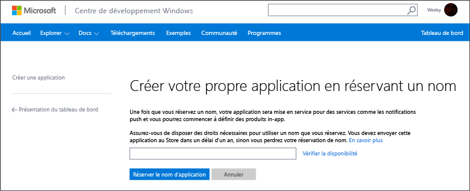
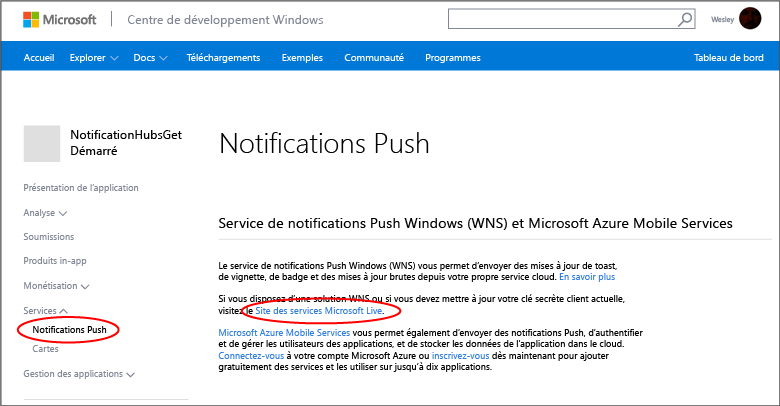
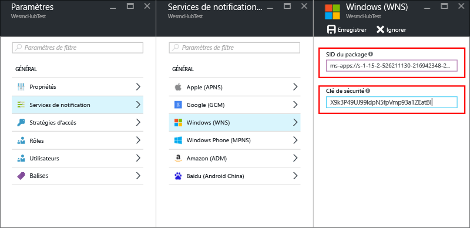
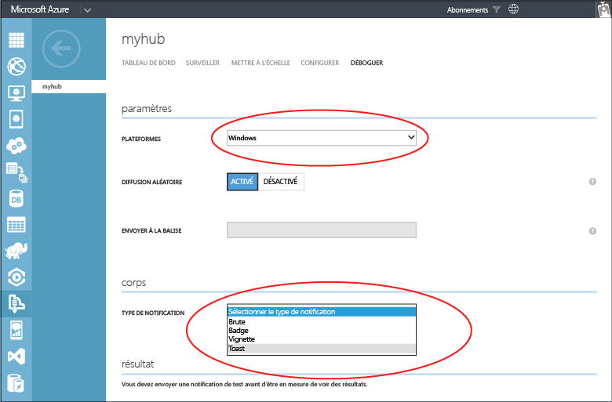

<properties
	pageTitle="Prendre en main Azure Notification Hubs pour les applications Windows Store | Microsoft Azure"
	description="Ce didacticiel vous apprend à utiliser Azure Notification Hubs pour envoyer des notifications Push vers une application Windows Store ou Windows Phone 8.1 (non-Silverlight)."
	services="notification-hubs"
	documentationCenter="windows"
	authors="wesmc7777"
	manager="dwrede"
	editor="dwrede"/>

<tags
	ms.service="notification-hubs"
	ms.workload="mobile"
	ms.tgt_pltfrm="mobile-windows"
	ms.devlang="dotnet"
	ms.topic="hero-article"
	ms.date="12/14/2015"
	ms.author="wesmc"/>

# Prise en main de Notification Hubs pour les applications Windows Store

[AZURE.INCLUDE [notification-hubs-selector-get-started](../../includes/notification-hubs-selector-get-started.md)]

##Vue d’ensemble

Ce didacticiel montre comment utiliser Azure Notification Hubs pour envoyer des notifications Push vers une application Windows Store ou Windows Phone 8.1 (non Silverlight). Si vous ciblez Windows Phone 8.1 Silverlight, consultez la version [Windows Phone](notification-hubs-windows-phone-get-started.md). Le didacticiel vous apprend à créer une application Windows Store vide qui reçoit des notifications Push au moyen du Service de notifications Windows Push (WNS). Une fois l’opération terminée, vous pouvez utiliser votre hub de notification pour diffuser des notifications Push sur tous les appareils exécutant votre application.

## Avant de commencer

[AZURE.INCLUDE [notification-hubs-hero-slug](../../includes/notification-hubs-hero-slug.md)]

Le code complet de ce didacticiel est disponible sur GitHub [ici](https://github.com/Azure/azure-notificationhubs-samples/tree/master/dotnet/GetStartedWindowsUniversal).

##Composants requis

Ce didacticiel requiert les éléments suivants :

+ Microsoft Visual Studio Express 2013 pour Windows avec Update 2 ou ultérieure Cette version de Visual Studio est requise pour créer un projet d’application universelle. Si vous souhaitez simplement créer une application Windows Store, vous avez besoin de Visual Studio 2012 Express pour Windows 8.

+ Un compte Windows Store actif

+ Un compte Azure actif  Si vous ne possédez pas de compte, vous pouvez créer un compte d’évaluation gratuit en quelques minutes. Pour plus d'informations, consultez la page [Version d'évaluation gratuite d'Azure](http://azure.microsoft.com/pricing/free-trial/?WT.mc_id=A0E0E5C02&amp;returnurl=http%3A%2F%2Fazure.microsoft.com%2Ffr-FR%2Fdocumentation%2Farticles%2Fnotification-hubs-windows-store-dotnet-get-started%2F).

Vous devez suivre ce didacticiel avant de pouvoir suivre tous les autres didacticiels Notification Hubs pour les applications Windows Store.

##Inscription de votre application pour le Windows Store

Pour envoyer des notifications Push vers des applications Windows Store, vous devez associer votre application à Windows Store. Vous devez ensuite configurer votre Notification Hub pour l'intégrer à WNS.

1. Si vous n’avez pas déjà inscrit votre application, accédez à la page [Centre de développement Windows](http://go.microsoft.com/fwlink/p/?LinkID=266582), connectez-vous avec votre compte Microsoft, puis cliquez sur **Créer une application**.

2. Saisissez un nom pour votre application et cliquez sur **Réserver le nom d’application**.

   	

   	La nouvelle inscription au Windows Store pour votre application est créée.

3. Dans Visual Studio, créez un nouveau projet d’application Visual C# Store Apps en utilisant le modèle **Application vide**.

   	![][2]

4. Dans l'Explorateur de solutions, cliquez avec le bouton droit sur le projet d'application Windows Store, cliquez sur **Store**, puis sur **Associer l'application au Windows Store...**.

   	![][3]

   	L'Assistant **Associer votre application au Windows Store** s'affiche.

5. Dans l’Assistant, cliquez sur **Se connecter**, puis connectez-vous avec votre compte Microsoft.

6. Cliquez sur l'application inscrite à l'étape 2, puis sur **Suivant** et sur **Associer**.

   	![][4]

   	Cela ajoute les informations d'inscription Windows Store requises au manifeste de l'application.

7. (Facultatif) Répétez les étapes 4 à 6 pour le projet d’application Windows Phone Store.

8. De retour dans la page [Centre de développement Windows](http://go.microsoft.com/fwlink/p/?LinkID=266582) de votre nouvelle application, cliquez sur **Services**, sur **Notifications Push**, puis sur **Site des services Microsoft Live** sous **Windows Push Notification Services (WNS) et Microsoft Azure Mobile Services**.

   	

9. Dans l’onglet **Paramètres de l’application**, notez les valeurs des options **Clé secrète client** et **Identificateur de sécurité (SID) du package**.

   	![][6]

 	> [AZURE.WARNING]La clé secrète client et le SID du package sont des informations d'identification de sécurité importantes. Ne partagez pas ces valeurs avec quiconque et ne les distribuez pas avec votre application.

##Configuration de votre hub de notification

[AZURE.INCLUDE [notification-hubs-portal-create-new-hub](../../includes/notification-hubs-portal-create-new-hub.md)]

<ol start="7">
<li>
Sélectionnez l’onglet <b>Configure</b> en haut de la page, entrez les valeurs de la <b>Clé secrète client</b> et du <b>SID du package</b> que vous avez obtenues de WNS dans la section précédente, puis cliquez sur <b>Enregistrer</b>.

</li>
</ol>

&emsp;&emsp;

Votre Notification Hub est désormais configuré pour WNS, et vous disposez des chaînes de connexion pour inscrire votre application et envoyer des notifications.

##Connexion de votre application au hub de notification

1. Dans Visual Studio, cliquez avec le bouton droit sur la solution, puis cliquez sur **Gérer les packages NuGet**.

	La boîte de dialogue **Gérer les packages NuGet** s’affiche.

2. Recherchez `WindowsAzure.Messaging.Managed`, cliquez sur **Installer**, sélectionnez tous les projets de la solution, puis acceptez les conditions d’utilisation.

	![][20]

	Une référence à la bibliothèque Messagerie Azure pour Windows est téléchargée, installée et ajoutée dans tous les projets à l’aide du <a href="http://nuget.org/packages/WindowsAzure.Messaging.Managed/">package NuGet WindowsAzure.Messaging.Managed</a>.

3. Ouvrez le fichier projet App.xaml.cs et ajoutez les instructions `using` qui suivent. Dans un projet universel, ce fichier se trouve dans le dossier `<project_name>.Shared`.

        using Windows.Networking.PushNotifications;
        using Microsoft.WindowsAzure.Messaging;
		using Windows.UI.Popups;

4. Toujours dans le fichier App.xaml.cs, ajoutez la définition de méthode **InitNotificationsAsync** suivante à la classe **App** :

	    private async void InitNotificationsAsync()
        {
            var channel = await PushNotificationChannelManager.CreatePushNotificationChannelForApplicationAsync();

            var hub = new NotificationHub("<hub name>", "<connection string with listen access>");
			var result = await hub.RegisterNativeAsync(channel.Uri);

            // Displays the registration ID so you know it was successful
            if (result.RegistrationId != null)
            {
                var dialog = new MessageDialog("Registration successful: " + result.RegistrationId);
                dialog.Commands.Add(new UICommand("OK"));
                await dialog.ShowAsync();
            }

        }

    Ce code récupère l’URI de canal pour l’application dans WNS et l’inscrit avec votre Notification Hub.

    >[AZURE.NOTE]Remplacez l’espace réservé « hub name » par le nom du hub de notification affiché sur le [portail Azure Classic] dans l’onglet **Notification Hubs** (par exemple, **mynotificationhub2** dans l’exemple précédent) : Remplacez également l'espace réservé de la chaîne de connexion par la chaîne de connexion **DefaultListenSharedAccessSignature** que vous avez obtenue dans la section précédente.

5. En haut du gestionnaire d'événements **OnLaunched** dans App.xaml.cs, ajoutez l'appel suivant à la nouvelle méthode **InitNotificationsAsync** :

        InitNotificationsAsync();

    Cela garantit que l’inscription de l’URI de canal dans votre Notification Hub chaque fois que l’application est lancée.

6. Dans l’Explorateur de solutions, double-cliquez sur **Package.appxmanifest** de l’application Windows Store. Dans **Notifications**, définissez **Compatible toast** avec la valeur **Oui** :

   	![][18]

   	Dans le menu **Fichier**, cliquez sur **Enregistrer tout**.

7. (Facultatif) Répétez l'étape précédente dans le projet d'application Windows Phone Store.

8. Appuyez sur **F5** pour lancer l'application. Une boîte de dialogue s’affiche avec la clé d’inscription.

   	![][19]

9. (Facultatif) Répétez l'étape précédente pour exécuter le projet Windows Phone et inscrire l'application sur un appareil Windows Phone.

Votre application est maintenant prête à recevoir des notifications toast.

##Envoi de notifications 

Vous pouvez tester la réception de notifications dans votre application en envoyant des notifications dans le [portail Azure Classic] via l’onglet Déboguer du hub de notification, comme indiqué dans l’écran ci-dessous.

Les notifications Push sont normalement envoyées dans un service principal tel que Mobile Services ou ASP.NET à l’aide d’une bibliothèque compatible. Vous pouvez également utiliser l’API REST directement pour envoyer des messages de notification si aucune bibliothèque n’est disponible pour votre serveur principal.

Dans ce didacticiel, nous nous contenterons pour plus de simplicité de tester votre application cliente en envoyant des notifications à l'aide du Kit de développement logiciel (SDK) .NET pour Notification Hubs dans une application de console au lieu d'un service principal. Nous vous recommandons de consulter le didacticiel [Utiliser Notification Hubs pour envoyer des notifications Push aux utilisateurs] comme prochaine étape pour envoyer des notifications à partir d’un serveur principal ASP.NET. Toutefois, les approches suivantes peuvent servir à envoyer des notifications :

* **Interface REST** : vous pouvez prendre en charge les notifications sur n’importe quelle plateforme principale à l’aide de l’[interface REST](http://msdn.microsoft.com/library/windowsazure/dn223264.aspx).

* **SDK .NET Microsoft Azure Notification Hubs** : dans le Gestionnaire de package Nuget pour Visual Studio, exécutez [Install-Package Microsoft.Azure.NotificationHubs](https://www.nuget.org/packages/Microsoft.Azure.NotificationHubs/).

* **Node.js** : [Utilisation de Notification Hubs à partir de Node.js](notification-hubs-nodejs-how-to-use-notification-hubs.md).

* **Azure Mobile Services** : pour découvrir un exemple d’envoi de notifications depuis un serveur principal Azure Mobile Services intégré à Notification Hubs, consultez « Prise en main des notifications Push dans Mobile Services » ([Serveur principal .NET](../mobile-services/mobile-services-javascript-backend-windows-store-dotnet-get-started-push.md) | [Serveur principal JavaScript](../mobile-services/mobile-services-javascript-backend-windows-store-dotnet-get-started-push.md)).

* **Java/PHP** : Pour voir un exemple d’envoi de notifications au moyen des API REST, consultez « Utilisation de Notification Hubs depuis Java/PHP » ([Java](notification-hubs-java-backend-how-to.md) | [PHP](notification-hubs-php-backend-how-to.md)).

## (Facultatif) Envoi de notifications à partir d’une application de console

Procédez comme suit pour envoyer des notifications à l’aide d’une application de console .NET.

1. Cliquez avec le bouton droit sur la solution, sélectionnez **Ajouter** et **Nouveau projet**, puis sous **Visual C#**, cliquez sur **Windows** et **Application Console**. Enfin, cliquez sur **OK**.

   	![][13]

	Une nouvelle application console Visual C# est ajoutée à la solution. Vous pouvez également réaliser cette opération dans une solution distincte.

2. Dans Visual Studio, cliquez successivement sur **Outils**, **Gestionnaire de package NuGet** et **Console du gestionnaire de package**.

	La console du gestionnaire de package s’affiche dans Visual Studio.

3. Dans la fenêtre Console du gestionnaire de package, affectez votre nouveau projet d’application console comme **Projet par défaut**, puis exécutez la commande suivante dans la fenêtre de console :

        Install-Package Microsoft.Azure.NotificationHubs

	Cette opération ajoute une référence au Kit de développement logiciel (SDK) Azure Notification Hubs à l’aide du <a href="http://www.nuget.org/packages/Microsoft.Azure.NotificationHubs/">package NuGet Microsoft.Azure.Notification Hubs</a>.

	

4. Ouvrez le fichier Program.cs et ajoutez l’instruction `using` suivante :

        using Microsoft.Azure.NotificationHubs;

5. Dans la classe **Program**, ajoutez la méthode suivante :

        private static async void SendNotificationAsync()
        {
            NotificationHubClient hub = NotificationHubClient
				.CreateClientFromConnectionString("<connection string with full access>", "<hub name>");
            var toast = @"<toast><visual><binding template=""ToastText01""><text id=""1"">Hello from a .NET App!</text></binding></visual></toast>";
            await hub.SendWindowsNativeNotificationAsync(toast);
        }

   	Remplacez l’espace réservé « hub name » par le nom du Notification Hub affiché sur le portail sous l’onglet **Notification Hubs** dans le [portail Azure Classic]. Remplacez également l’espace réservé de la chaîne de connexion par la chaîne de connexion appelée **DefaultFullSharedAccessSignature** que vous avez obtenue dans la section Configuration de votre hub de notification.

	>[AZURE.NOTE]Assurez-vous d’utiliser la chaîne de connexion avec un accès **Total**, et non un accès en **Écoute**. La chaîne d’accès en écoute seule ne dispose pas des autorisations pour envoyer des notifications.

6. Ajoutez les lignes suivantes à la méthode **Main** :

         SendNotificationAsync();
		 Console.ReadLine();

7. Cliquez avec le bouton droit sur le projet d’application de console dans Visual Studio, puis cliquez sur **Définir comme projet de démarrage**. Appuyez ensuite sur la touche **F5** pour exécuter l’application.

   	![][14]

	Vous recevrez une notification toast sur tous les appareils enregistrés. Cliquez sur la bannière toast ou appuyez dessus pour charger l’application.

Vous trouverez toutes les charges utiles prises en charge dans les rubriques du [catalogue toast], du [catalogue de vignettes] et de la [vue d'ensemble des badges] sur MSDN.

##Étapes suivantes

Dans cet exemple simple, vous avez envoyé des notifications à tous vos appareils Windows en utilisant le portail ou une application de console. Nous vous recommandons de consulter le didacticiel [Utiliser Notification Hubs pour envoyer des notifications Push aux utilisateurs] comme prochaine étape. Il vous expliquera comment envoyer des notifications à partir d’un serveur principal ASP.NET en utilisant des balises pour cibler des utilisateurs spécifiques.

Pour segmenter vos utilisateurs par groupes d'intérêt, consultez la page [Utilisation des Notification Hubs pour diffuser les dernières nouvelles].

Pour obtenir des informations générales sur Notification Hubs, consultez la section [Recommandations relatives à Notification Hubs].

<!-- Images. -->
[2]: ./media/notification-hubs-windows-store-dotnet-get-started/notification-hub-create-windows-universal-app.png
[3]: ./media/notification-hubs-windows-store-dotnet-get-started/notification-hub-associate-win8-app.png
[4]: ./media/notification-hubs-windows-store-dotnet-get-started/mobile-services-select-app-name.png
[6]: ./media/notification-hubs-windows-store-dotnet-get-started/mobile-services-win8-app-push-auth.png
[11]: ./media/notification-hubs-windows-store-dotnet-get-started/notification-hub-configure-wns.png
[13]: ./media/notification-hubs-windows-store-dotnet-get-started/notification-hub-create-console-app.png
[14]: ./media/notification-hubs-windows-store-dotnet-get-started/notification-hub-windows-toast.png
[15]: ./media/notification-hubs-windows-store-dotnet-get-started/notification-hub-scheduler1.png
[16]: ./media/notification-hubs-windows-store-dotnet-get-started/notification-hub-scheduler2.png
[18]: ./media/notification-hubs-windows-store-dotnet-get-started/notification-hub-win8-app-toast.png
[19]: ./media/notification-hubs-windows-store-dotnet-get-started/notification-hub-windows-reg.png
[20]: ./media/notification-hubs-windows-store-dotnet-get-started/notification-hub-windows-universal-app-install-package.png

<!-- URLs. -->
[portail Azure Classic]: https://manage.windowsazure.com/
[Recommandations relatives à Notification Hubs]: http://msdn.microsoft.com/library/jj927170.aspx

[Utiliser Notification Hubs pour envoyer des notifications Push aux utilisateurs]: notification-hubs-aspnet-backend-windows-dotnet-notify-users.md
[Utilisation des Notification Hubs pour diffuser les dernières nouvelles]: notification-hubs-windows-store-dotnet-send-breaking-news.md

[catalogue toast]: http://msdn.microsoft.com/library/windows/apps/hh761494.aspx
[catalogue de vignettes]: http://msdn.microsoft.com/library/windows/apps/hh761491.aspx
[vue d'ensemble des badges]: http://msdn.microsoft.com/library/windows/apps/hh779719.aspx

<!---HONumber=AcomDC_1217_2015-->