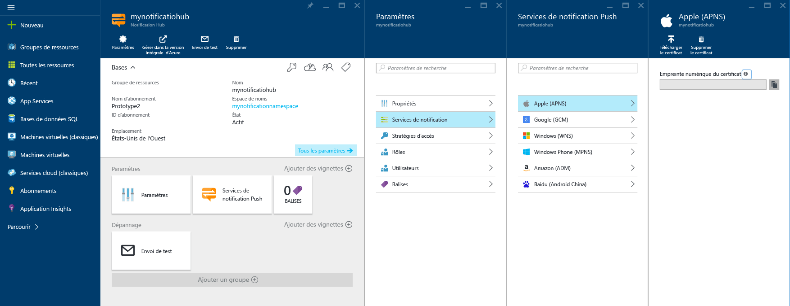
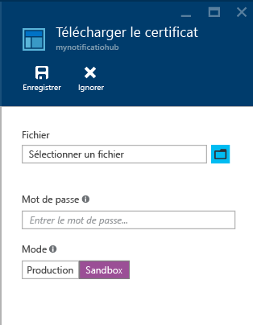

# Notifications Push iOS à l’aide des hubs de notification pour applications Xamarin
[!INCLUDE [notification-hubs-selector-get-started](../../includes/notification-hubs-selector-get-started.md)]

## Vue d'ensemble
> [!IMPORTANT]
> Pour suivre ce didacticiel, vous avez besoin d'un compte Azure actif. Si vous ne possédez pas de compte, vous pouvez créer un compte d'évaluation gratuit en quelques minutes. Pour plus d'informations, consultez la page [Version d'évaluation gratuite d'Azure](https://azure.microsoft.com/pricing/free-trial/?WT.mc_id=A643EE910&amp;returnurl=http%3A%2F%2Fazure.microsoft.com%2Fen-us%2Fdocumentation%2Farticles%2Fpartner-xamarin-notification-hubs-ios-get-started).
> 
> 

Ce didacticiel vous montre comment utiliser Azure Notification Hubs pour envoyer des notifications Push vers une application iOS.
Vous allez créer une application Xamarin.iOS vide qui reçoit des notifications Push à l’aide du [service de notification Push Apple (APN, Apple Push Notification)](https://developer.apple.com/library/content/documentation/NetworkingInternet/Conceptual/RemoteNotificationsPG/APNSOverview.html). Une fois l’opération terminée, vous pouvez utiliser votre hub de notification pour diffuser des notifications Push sur tous les appareils exécutant votre application. Le code finalisé est disponible dans l’exemple [Application NotificationHubs][GitHub].

Ce didacticiel présente un scénario de simple diffusion de messages Push utilisant les hubs de notification.

## Composants requis
Ce didacticiel requiert les éléments suivants :

* [Xcode 6.0][Install Xcode]
* Un appareil compatible iOS 7.0 (ou version ultérieure)
* Un abonnement au programme pour développeurs iOS
* [Xamarin Studio]
  
  > [!NOTE]
  > En raison des exigences de configuration requise pour les notifications Push iOS, vous devez déployer et tester l’exemple d’application sur un appareil iOS physique (iPhone ou iPad) au lieu d’un simulateur.
  > 
  > 

Vous devez suivre ce didacticiel avant de pouvoir suivre tous les autres didacticiels dédiés aux hubs de notification pour applications Xamarin iOS.

[!INCLUDE [Notification Hubs Enable Apple Push Notifications](../../includes/notification-hubs-enable-apple-push-notifications.md)]

## Configuration de votre hub de notification
Cette section vous guide dans la création d’un hub de notification et la configuration APNS à l’aide du certificat Push **.p12** que vous avez créé. Si vous souhaitez utiliser un hub de notification que vous avez déjà créé, vous pouvez passer directement à l’étape 5.

[!INCLUDE [notification-hubs-portal-create-new-hub](../../includes/notification-hubs-portal-create-new-hub.md)]

<ol start="7">

<li>

Pour configurer la connexion APNS, accédez au portail Azure, ouvrez les paramètres du hub de notification et cliquez sur <b>Services de notification</b>, puis sur l’élément <b>Apple (APNS)</b> de la liste. Cliquez ensuite sur <b>Télécharger le certificat</b> et sélectionnez le certificat <b>.p12</b> exporté précédemment, ainsi que le mot de passe du certificat.

Veillez à sélectionner le mode <b>Bac à sable (sandbox)</b> étant donné que vous allez envoyer des messages Push dans un environnement de développement. Utilisez uniquement le paramètre <b>Production</b> si vous souhaitez envoyer des notifications Push aux utilisateurs ayant déjà acheté votre application dans Windows store.

</li>
</ol>
&emsp;&emsp;

&emsp;&emsp;

Votre hub de notification est maintenant configuré pour APNS, et vous disposez des chaînes de connexion pour inscrire votre application et envoyer des notifications Push.

## Connexion de votre application au hub de notification
#### Création d'un projet
1. Dans Xamarin Studio, créez un projet iOS et sélectionnez le modèle **Unified API** > **Single View Application**.
   
     ![Xamarin Studio - Sélectionner le type d’application][31]
2. Ajoutez une référence au composant Azure Messaging. Dans la vue Solution, cliquez avec le bouton droit sur le dossier **Components** de votre projet, puis choisissez **Get More Components**. Recherchez le composant **Azure Messaging** et ajoutez-le à votre projet.
3. Dans **AppDelegate.cs**, ajoutez l'instruction using suivante :
   
        using WindowsAzure.Messaging;
4. Déclarez une instance de **SBNotificationHub**:
   
        private SBNotificationHub Hub { get; set; }
5. Créez une classe **Constants.cs** avec les variables suivantes :
   
        // Azure app-specific connection string and hub path
        public const string ConnectionString = "<Azure connection string>";
        public const string NotificationHubPath = "<Azure hub path>";
6. Dans **AppDelegate.cs**, mettez à jour **FinishedLaunching()** afin qu’il corresponde à ce qui suit :
   
        public override bool FinishedLaunching(UIApplication application, NSDictionary launchOptions)
        {
            if (UIDevice.CurrentDevice.CheckSystemVersion (8, 0)) {
                var pushSettings = UIUserNotificationSettings.GetSettingsForTypes (
                       UIUserNotificationType.Alert | UIUserNotificationType.Badge | UIUserNotificationType.Sound,
                       new NSSet ());
   
                UIApplication.SharedApplication.RegisterUserNotificationSettings (pushSettings);
                UIApplication.SharedApplication.RegisterForRemoteNotifications ();
            } else {
                UIRemoteNotificationType notificationTypes = UIRemoteNotificationType.Alert | UIRemoteNotificationType.Badge | UIRemoteNotificationType.Sound;
                UIApplication.SharedApplication.RegisterForRemoteNotificationTypes (notificationTypes);
            }
   
            return true;
        }
7. Remplacez la méthode **RegisteredForRemoteNotifications()** dans **AppDelegate.cs** :
   
        public override void RegisteredForRemoteNotifications(UIApplication application, NSData deviceToken)
        {
            Hub = new SBNotificationHub(Constants.ConnectionString, Constants.NotificationHubPath);
   
            Hub.UnregisterAllAsync (deviceToken, (error) => {
                if (error != null)
                {
                    Console.WriteLine("Error calling Unregister: {0}", error.ToString());
                    return;
                }
   
                NSSet tags = null; // create tags if you want
                Hub.RegisterNativeAsync(deviceToken, tags, (errorCallback) => {
                    if (errorCallback != null)
                        Console.WriteLine("RegisterNativeAsync error: " + errorCallback.ToString());
                });
            });
        }
8. Remplacez la méthode **ReceivedRemoteNotification()** dans **AppDelegate.cs** :
   
        public override void ReceivedRemoteNotification(UIApplication application, NSDictionary userInfo)
        {
            ProcessNotification(userInfo, false);
        }
9. Créez la méthode **ProcessNotification()** dans **AppDelegate.cs** :
   
        void ProcessNotification(NSDictionary options, bool fromFinishedLaunching)
        {
            // Check to see if the dictionary has the aps key.  This is the notification payload you would have sent
            if (null != options && options.ContainsKey(new NSString("aps")))
            {
                //Get the aps dictionary
                NSDictionary aps = options.ObjectForKey(new NSString("aps")) as NSDictionary;
   
                string alert = string.Empty;
   
                //Extract the alert text
                // NOTE: If you're using the simple alert by just specifying
                // "  aps:{alert:"alert msg here"}  ", this will work fine.
                // But if you're using a complex alert with Localization keys, etc.,
                // your "alert" object from the aps dictionary will be another NSDictionary.
                // Basically the JSON gets dumped right into a NSDictionary,
                // so keep that in mind.
                if (aps.ContainsKey(new NSString("alert")))
                    alert = (aps [new NSString("alert")] as NSString).ToString();
   
                //If this came from the ReceivedRemoteNotification while the app was running,
                // we of course need to manually process things like the sound, badge, and alert.
                if (!fromFinishedLaunching)
                {
                    //Manually show an alert
                    if (!string.IsNullOrEmpty(alert))
                    {
                        UIAlertView avAlert = new UIAlertView("Notification", alert, null, "OK", null);
                        avAlert.Show();
                    }
                }
            }
        }
   
   > [!NOTE]
   > Vous pouvez choisir de remplacer **FailedToRegisterForRemoteNotifications()** pour gérer les situations, par exemple, l’absence de connexion réseau, etc. Ceci est particulièrement important lorsque l’utilisateur cherche à démarrer votre application en mode hors connexion (par exemple, en mode avion) et que vous souhaitez gérer les scénarios de messagerie Push propres à votre application.
   > 
   > 
10. Exécutez l'application sur votre appareil.

## Envoi de notifications Push
Vous pouvez tester la réception de notifications Push dans votre application en envoyant des notifications dans le portail [Azure Portal] à l’aide de la fonctionnalité **Test d’envoi** de la suite d’outils **Dépannage** située à droite de la page du hub de notification, comme indiqué dans l’écran ci-dessous.

Les notifications Push sont normalement envoyées via un service principal tel que Mobile Services ou ASP.NET à l’aide d’une bibliothèque compatible. Vous pouvez également utiliser directement l’API REST pour envoyer des messages Push si aucune bibliothèque n’est disponible pour votre scénario. 

Dans ce didacticiel, nous nous contenterons pour plus de simplicité de tester votre application cliente en envoyant des notifications à l'aide du Kit de développement logiciel (SDK) .NET pour Notification Hubs dans une application de console au lieu d'un service principal. Nous vous recommandons de consulter le didacticiel [Utiliser Notification Hubs pour envoyer des notifications Push aux utilisateurs](notification-hubs-aspnet-backend-ios-apple-apns-notification.md) comme prochaine étape pour envoyer des notifications à partir d’un serveur principal ASP.NET. Toutefois, les approches suivantes peuvent servir à envoyer des notifications :

* **Interface REST**: vous pouvez prendre en charge les notifications Push sur n’importe quel serveur principal à l’aide de l’[interface REST](http://msdn.microsoft.com/library/windowsazure/dn223264.aspx).
* **SDK .NET Microsoft Azure Notification Hubs**: dans le Gestionnaire de package Nuget pour Visual Studio, exécutez [Install-Package Microsoft.Azure.NotificationHubs](https://www.nuget.org/packages/Microsoft.Azure.NotificationHubs/).
* **Node.js** : [Utilisation de Notification Hubs à partir de Node.js](notification-hubs-nodejs-push-notification-tutorial.md).

**Applications mobiles Azure**: pour découvrir un exemple de la procédure d’envoi de notifications à partir d’une application mobile Azure intégrée à Notification Hubs, consultez l’article [Add push notifications for Mobile Apps](../app-service-mobile/app-service-mobile-ios-get-started-push.md) (Ajouter des notifications Push pour Mobile Apps).

* **Java / PHP** : pour voir un exemple d’envoi de notifications Push au moyen des API REST, consultez « Utilisation de Notification Hubs à partir de Java/PHP » ([Java](notification-hubs-java-push-notification-tutorial.md) | [PHP](notification-hubs-php-push-notification-tutorial.md)).

#### (Facultatif) Envoi de notifications Push à partir d’une application de console .NET
Dans cette section, nous allons envoyer des notifications Push à l’aide d’une simple application de console .NET. Dans cet exemple, nous allons basculer vers un environnement de développement Windows dans lequel est déjà installé Visual Studio.

1. Dans Visual Studio, créez une application de console Visual C# :
   
       ![Visual Studio - Create a new console application][213]
2. Dans Visual Studio, cliquez successivement sur **Outils**, **Gestionnaire de package NuGet** et **Console du gestionnaire de package**.
   
    La console du gestionnaire de package doit apparaître ancrée au bas de votre espace de travail Visual Studio.
3. Dans la fenêtre Console du gestionnaire de package, choisissez **Projet par défaut** comme nouveau projet d’application console, puis exécutez la commande suivante dans la fenêtre de console :
   
        Install-Package Microsoft.Azure.NotificationHubs
   
    Cette opération ajoute une référence au Kit de développement logiciel (SDK) Azure Notification Hubs à l’aide du <a href="http://www.nuget.org/packages/Microsoft.Azure.NotificationHubs/">package NuGet Microsoft.Azure.Notification Hubs</a>.
   
    
4. Ouvrez le fichier `Program.cs` et ajoutez l’instruction `using` suivante pour garantir que nous pouvons utiliser les classes et les fonctions Azure dans notre classe principale :
   
        using Microsoft.Azure.NotificationHubs;
5. Dans votre classe `Program`, ajoutez la méthode suivante (n’oubliez pas de remplacer la **chaîne de connexion** et le **nom du hub**) :
   
        private static async void SendNotificationAsync()
        {
            NotificationHubClient hub = NotificationHubClient.CreateClientFromConnectionString("<connection string with full access>", "<hub name>");
            var alert = "{\"aps\":{\"alert\":\"Hello from .NET!\"}}";
            await hub.SendAppleNativeNotificationAsync(alert);
        }
6. Ajoutez ensuite les lignes suivantes dans votre méthode `Main` :
   
         SendNotificationAsync();
         Console.ReadLine();
7. Appuyez sur la touche F5 pour exécuter l'application. En quelques secondes, une notification Push devrait s’afficher sur votre appareil. Que vous utilisiez le Wi-Fi ou un réseau cellulaire, assurez-vous que votre appareil dispose bien d’une connexion Internet.

Vous trouverez toutes les charges utiles possibles dans le [Guide de programmation des notifications locales et Push]d'Apple.

#### (Facultatif) Envoi de notifications depuis un service mobile
Dans cette section, nous allons envoyer des notifications Push à l’aide d’un service mobile via un script de nœud.

Pour envoyer une notification à l’aide d’un service mobile, suivez les instructions de la rubrique [Prise en main de Mobile Services], puis :

1. Connectez-vous au [portail Azure Classic], puis sélectionnez votre service mobile.
2. Sélectionnez l’onglet **Scheduler** dans la partie supérieure.
   
       ![Azure Classic Portal - Scheduler][215]
3. Créez un travail planifié, insérez un nom, puis sélectionnez **On demand**.
   
       ![Azure Classic Portal - Create new job][216]
4. Lorsque le travail est créé, cliquez sur son nom. Cliquez ensuite sur l’onglet **Script** dans la barre supérieure.
5. Insérez le script suivant dans votre fonction Scheduler. Remplacez les espaces réservés par le nom de votre concentrateur de notification et la chaîne de connexion pour *DefaultFullSharedAccessSignature* obtenue précédemment. Cliquez sur **Enregistrer**.
   
        var azure = require('azure');
        var notificationHubService = azure.createNotificationHubService('<Hubname>', '<SAS Full access >');
        notificationHubService.apns.send(
            null,
            {"aps":
                {
                  "alert": "Hello from Mobile Services!"
                }
            },
            function (error)
            {
                if (!error) {
                    console.warn("Notification successful");
                }
            }
        );
6. Cliquez sur **Exécuter une fois** sur la barre inférieure. Vous devez recevoir une alerte sur votre appareil.

## Étapes suivantes
Dans cet exemple simple, vous avez envoyé des notifications Push à tous vos appareils iOS. Pour cibler certains utilisateurs, reportez-vous au didacticiel [Utilisation des Notification Hubs pour envoyer des notifications Push aux utilisateurs]. Pour segmenter vos utilisateurs par groupes d'intérêt, consultez la page [Utilisation des Notification Hubs pour diffuser les dernières nouvelles]. Pour plus d’informations sur l’utilisation de Notification Hubs, consultez les pages [Vue d’ensemble de Notifications Hubs] et [Procédures Notification Hubs pour iOS].

<!-- Images. -->

[213]: ./media/partner-xamarin-notification-hubs-ios-get-started/notification-hub-create-console-app.png

[215]: ./media/partner-xamarin-notification-hubs-ios-get-started/notification-hub-scheduler1.png
[216]: ./media/partner-xamarin-notification-hubs-ios-get-started/notification-hub-scheduler2.png

[31]: ./media/partner-xamarin-notification-hubs-ios-get-started/notification-hub-create-ios-app.png

<!-- URLs. -->
[Mobile Services iOS SDK]: http://go.microsoft.com/fwLink/?LinkID=266533
[Submit an app page]: http://go.microsoft.com/fwlink/p/?LinkID=266582
[My Applications]: http://go.microsoft.com/fwlink/p/?LinkId=262039
[Live SDK for Windows]: http://go.microsoft.com/fwlink/p/?LinkId=262253

[Prise en main de Mobile Services]: /develop/mobile/tutorials/get-started-xamarin-ios
[portail Azure Classic]: https://manage.windowsazure.com/
[Vue d’ensemble de Notifications Hubs]: http://msdn.microsoft.com/library/jj927170.aspx
[Procédures Notification Hubs pour iOS]: http://msdn.microsoft.com/library/jj927168.aspx
[Install Xcode]: https://go.microsoft.com/fwLink/p/?LinkID=266532
[iOS Provisioning Portal]: http://go.microsoft.com/fwlink/p/?LinkId=272456

[Utilisation des Notification Hubs pour envoyer des notifications Push aux utilisateurs]: /manage/services/notification-hubs/notify-users-aspnet
[Utilisation des Notification Hubs pour diffuser les dernières nouvelles]: /manage/services/notification-hubs/breaking-news-dotnet

[Guide de programmation des notifications locales et Push]:https://developer.apple.com/library/content/documentation/NetworkingInternet/Conceptual/RemoteNotificationsPG/HandlingRemoteNotifications.html#//apple_ref/doc/uid/TP40008194-CH6-SW1
[Apple Push Notification Service]: http://go.microsoft.com/fwlink/p/?LinkId=272584

[Azure Mobile Services Component]: http://components.xamarin.com/view/azure-mobile-services/
[GitHub]: http://go.microsoft.com/fwlink/p/?LinkId=331329
[Xamarin Studio]: http://xamarin.com/download
[WindowsAzure.Messaging]: https://github.com/infosupport/WindowsAzure.Messaging.iOS
[Azure Portal]: https://portal.azure.com

