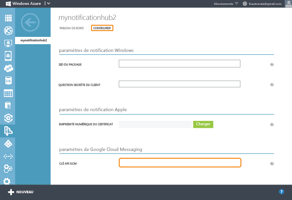
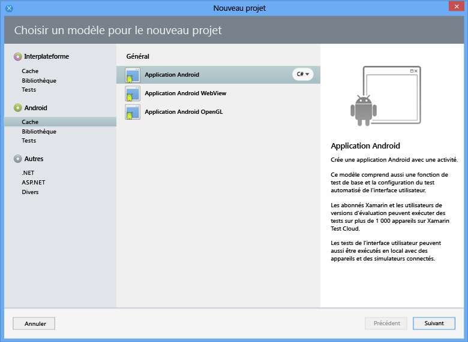
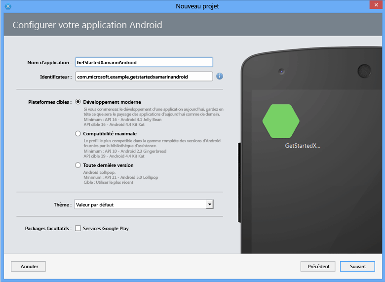
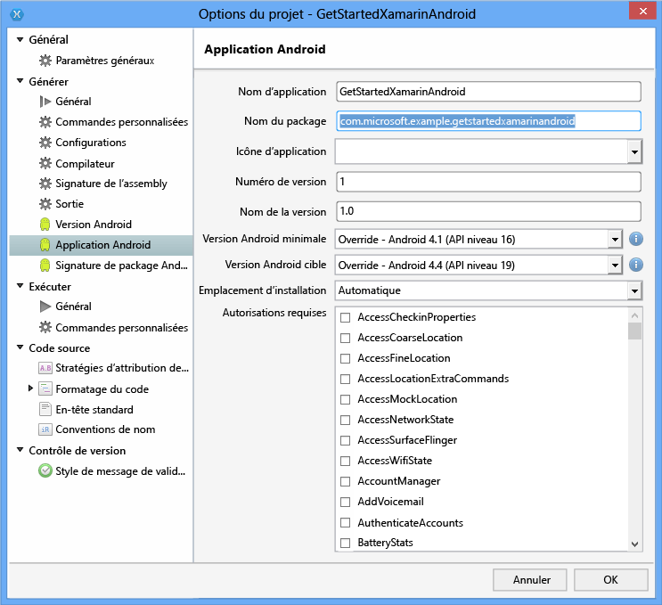
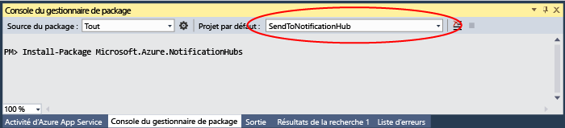

# Prendre en main Notification Hubs avec Xamarin pour Android
[!INCLUDE [notification-hubs-selector-get-started](../../includes/notification-hubs-selector-get-started.md)]

## Vue d’ensemble
Ce didacticiel vous montre comment utiliser Azure Notification Hubs pour envoyer des notifications Push vers une application Xamarin.Android.
Vous allez créer une application Xamarin.Android vide recevant des notifications Push via Google Cloud Messaging (GCM). Une fois l’opération terminée, vous pouvez utiliser votre hub de notification pour diffuser des notifications Push sur tous les appareils exécutant votre application. Le code finalisé est disponible dans l’exemple [Application NotificationHubs][GitHub].

Ce didacticiel présente un scénario de diffusion simple utilisant les Notification Hubs.

## Avant de commencer
[!INCLUDE [notification-hubs-hero-slug](../../includes/notification-hubs-hero-slug.md)]

Le code complet de ce didacticiel est disponible sur GitHub [ici](https://github.com/Azure/azure-notificationhubs-samples/tree/master/dotnet/Xamarin/GetStartedXamarinAndroid).

## Composants requis
Ce didacticiel requiert les éléments suivants :

* Visual Studio avec Xamarin sur Windows ou Xamarin Studio sur Mac OS X. Des instructions d’installation complètes sont disponibles dans [Configurer et installer Visual Studio et Xamarin](https://msdn.microsoft.com/library/mt613162.aspx).
* Un compte Google actif
* [Composant Azure Messaging]
* [Composant Client Google Cloud Messaging]

Vous devez suivre ce didacticiel avant de pouvoir suivre tous les autres didacticiels de Notification Hubs pour les applications Xamarin.Android.

> [!IMPORTANT]
> Pour suivre ce didacticiel, vous avez besoin d'un compte Azure actif. Si vous ne possédez pas de compte, vous pouvez créer un compte d'évaluation gratuit en quelques minutes. Pour plus d'informations, consultez la page [Version d'évaluation gratuite d'Azure](https://azure.microsoft.com/pricing/free-trial/?WT.mc_id=A9C9624B5&amp;returnurl=http%3A%2F%2Fazure.microsoft.com%2Fen-us%2Fdocumentation%2Farticles%2Fpartner-xamarin-notification-hubs-android-get-started%2F).
> 
> 

## Activation de Google Cloud Messaging
[!INCLUDE [mobile-services-enable-Google-cloud-messaging](../../includes/mobile-services-enable-google-cloud-messaging.md)]

## Configuration de votre hub de notification
[!INCLUDE [notification-hubs-portal-create-new-hub](../../includes/notification-hubs-portal-create-new-hub.md)]

<ol start="7">

<li>
Cliquez sur l’onglet <b>Configurer</b> dans la partie supérieure, saisissez la valeur de <b>clé API</b> obtenue à la section précédente, puis cliquez sur <b>Enregistrer</b>.

</li>
</ol>
&emsp;&emsp;

Votre concentrateur de notification est à présent configuré pour GCM, et vous disposez des chaînes de connexion vous permettant d’inscrire votre application pour la réception de notifications et l’envoi de notifications Push.

## Connexion de votre application au hub de notification
### Création d'un projet
1. Dans Xamarin Studio, cliquez sur **Nouvelle solution**, cliquez sur **Application Android**, puis sur **Suivant**.
   
      

2. Saisissez le **Nom** et l’**Identificateur** de l’application. Cliquez sur les **plateformes cibles** que vous souhaitez prendre en charge, puis cliquez sur **Suivant** et sur **Créer**.
   
      

    Un projet Android est créé.

1. Ouvrez les propriétés du projet en cliquant avec le bouton droit sur votre nouveau projet dans la vue Solution et en choisissant **Options**. Sélectionnez l'élément **Android Application** dans la section **Build**.
   
    Assurez-vous que la première lettre de votre nom de package ( **Package name** ) est en minuscule.
   
   > [!IMPORTANT]
   > La première lettre du nom du package doit être une minuscule. Sinon, vous recevrez des erreurs du manifeste d’application lors de l’inscription de vos **BroadcastReceiver** et **IntentFilter** pour les notifications Push ci-dessous.
   > 
   > 
   
      
2. Définissez optionnellement la **version minimale d’Android** sur un autre niveau d’API.
3. Le cas échéant, définissez la **version Android cible** sur une autre version d’API que vous souhaitez cibler (API de niveau 8 ou supérieur).

Cliquez sur **OK** et fermez la boîte de dialogue Options du projet.

### Ajout des composants requis à votre projet
Le client Google Cloud Messaging, disponible dans le magasin de composants Xamarin, simplifie la prise en charge des notifications Push dans les applications Xamarin.Android.

1. Cliquez avec le bouton droit sur le dossier Components de l’application Xamarin.Android et choisissez **Get More Components...**.
2. Recherchez le composant **Azure Messaging** et ajoutez-le au projet.
3. Recherchez le composant **Client Google Cloud Messaging** et ajoutez-le au projet.

### Configuration de hubs de notification dans votre projet
1. Collectez les informations suivantes pour votre application Android et votre concentrateur de notifications :
   
   * **GoogleProjectNumber** : obtenez cette valeur de numéro de projet dans la vue d’ensemble de votre application sur le portail de développement Google. Vous l’avez notée précédemment lorsque vous avez créé l’application sur le portail.
   * **Chaîne de connexion d’écoute** : dans le tableau de bord du [portail Azure Classic], cliquez sur **Afficher les chaînes de connexion**. Copiez la chaîne de connexion *DefaultListenSharedAccessSignature* pour cette valeur.
   * **Nom du concentrateur**: c’est le nom de votre concentrateur sur le [portail Azure Classic]. Par exemple, *mynotificationhub2*.
     
     Créez une classe **Constants.cs** pour votre projet Xamarin et définissez les valeurs constantes suivantes dans la classe. Remplacez les espaces réservés par vos valeurs.
     
       public static class Constants   {
     
           public const string SenderID = "<GoogleProjectNumber>"; // Google API Project Number
           public const string ListenConnectionString = "<Listen connection string>";
           public const string NotificationHubName = "<hub name>";
       }
2. Ajoutez les instructions using suivantes à **MainActivity.cs**:
   
        using Android.Util;
        using Gcm.Client;
3. Ajoutez une variable d’instance à la classe `MainActivity` , qui sera utilisée pour afficher une boîte de dialogue d’alerte lors de l’exécution de l’application :
   
        public static MainActivity instance;
4. Ajoutez la méthode suivante dans la classe **MainActivity** :
   
        private void RegisterWithGCM()
        {
            // Check to ensure everything's set up right
            GcmClient.CheckDevice(this);
            GcmClient.CheckManifest(this);
   
            // Register for push notifications
            Log.Info("MainActivity", "Registering...");
            GcmClient.Register(this, Constants.SenderID);
        }
5. Dans la méthode `OnCreate` de **MainActivity.cs**, initialisez la variable `instance` et ajoutez un appel à `RegisterWithGCM` :
   
        protected override void OnCreate (Bundle bundle)
        {
            instance = this;
   
            base.OnCreate (bundle);
   
            // Set your view from the "main" layout resource
            SetContentView (Resource.Layout.Main);
   
            // Get your button from the layout resource,
            // and attach an event to it
            Button button = FindViewById<Button> (Resource.Id.myButton);
   
            RegisterWithGCM();
        }
6. Créez la classe **MyBroadcastReceiver**.
   
   > [!NOTE]
   > Nous allons décrire la procédure à suivre pour créer une classe **BroadcastReceiver** de toutes pièces. Il existe toutefois une alternative rapide à la création manuelle de **MyBroadcastReceiver.cs**, qui consiste à se reporter au fichier **GcmService.cs** de l’exemple de projet Xamarin.Android fourni avec les [exemples NotificationHubs][GitHub]. La duplication de **GcmService.cs** et le changement des noms de classe peuvent également constituer un excellent point de départ.
   > 
   > 
7. Ajoutez les instructions using suivantes à **MyBroadcastReceiver.cs** (faisant référence au composant et à l’assembly ajoutés plus tôt) :
   
        using System.Collections.Generic;
        using System.Text;
        using Android.App;
        using Android.Content;
        using Android.Util;
        using Gcm.Client;
        using WindowsAzure.Messaging;
8. Dans **MyBroadcastReceiver.cs**, ajoutez les demandes d’autorisation suivantes entre les instructions **using** et la déclaration **namespace** :
   
        [assembly: Permission(Name = "@PACKAGE_NAME@.permission.C2D_MESSAGE")]
        [assembly: UsesPermission(Name = "@PACKAGE_NAME@.permission.C2D_MESSAGE")]
        [assembly: UsesPermission(Name = "com.google.android.c2dm.permission.RECEIVE")]
   
        //GET_ACCOUNTS is needed only for Android versions 4.0.3 and below
        [assembly: UsesPermission(Name = "android.permission.GET_ACCOUNTS")]
        [assembly: UsesPermission(Name = "android.permission.INTERNET")]
        [assembly: UsesPermission(Name = "android.permission.WAKE_LOCK")]
9. Dans **MyBroadcastReceiver.cs**, changez la classe **MyBroadcastReceiver** comme suit :
   
        [BroadcastReceiver(Permission=Gcm.Client.Constants.PERMISSION_GCM_INTENTS)]
        [IntentFilter(new string[] { Gcm.Client.Constants.INTENT_FROM_GCM_MESSAGE },
            Categories = new string[] { "@PACKAGE_NAME@" })]
        [IntentFilter(new string[] { Gcm.Client.Constants.INTENT_FROM_GCM_REGISTRATION_CALLBACK },
            Categories = new string[] { "@PACKAGE_NAME@" })]
        [IntentFilter(new string[] { Gcm.Client.Constants.INTENT_FROM_GCM_LIBRARY_RETRY },
            Categories = new string[] { "@PACKAGE_NAME@" })]
        public class MyBroadcastReceiver : GcmBroadcastReceiverBase<PushHandlerService>
        {
            public static string[] SENDER_IDS = new string[] { Constants.SenderID };
   
            public const string TAG = "MyBroadcastReceiver-GCM";
        }
10. Dans **MyBroadcastReceiver.cs**, ajoutez une classe nommée **PushHandlerService** dérivée de **GcmServiceBase**. Veillez à appliquer l’attribut **Service** à la classe :
    
         [Service] // Must use the service tag
         public class PushHandlerService : GcmServiceBase
         {
             public static string RegistrationID { get; private set; }
             private NotificationHub Hub { get; set; }
    
             public PushHandlerService() : base(Constants.SenderID)
                {
                 Log.Info(MyBroadcastReceiver.TAG, "PushHandlerService() constructor");
             }
         }
11. **GcmServiceBase** implémente les méthodes **OnRegistered()**, **OnUnRegistered()**, **OnMessage()**, **OnRecoverableError()** et **OnError()**. Notre classe d’implémentation **PushHandlerService** doit remplacer ces méthodes, qui à leur tour seront déclenchées en réponse à l’interaction avec le concentrateur de notification.
12. Remplacez la méthode **OnRegistered()** dans **PushHandlerService** par le code suivant :
    
         protected override void OnRegistered(Context context, string registrationId)
         {
             Log.Verbose(MyBroadcastReceiver.TAG, "GCM Registered: " + registrationId);
             RegistrationID = registrationId;
    
             createNotification("PushHandlerService-GCM Registered...",
                                 "The device has been Registered!");
    
             Hub = new NotificationHub(Constants.NotificationHubName, Constants.ListenConnectionString,
                                         context);
             try
             {
                 Hub.UnregisterAll(registrationId);
             }
             catch (Exception ex)
             {
                 Log.Error(MyBroadcastReceiver.TAG, ex.Message);
             }
    
             //var tags = new List<string>() { "falcons" }; // create tags if you want
             var tags = new List<string>() {};
    
             try
             {
                 var hubRegistration = Hub.Register(registrationId, tags.ToArray());
             }
             catch (Exception ex)
             {
                 Log.Error(MyBroadcastReceiver.TAG, ex.Message);
             }
         }
    
    > [!NOTE]
    > Dans le code **OnRegistered()** ci-dessus, notez qu’il est possible de spécifier des balises pour enregistrer des canaux de messagerie spécifiques.
    > 
    > 
13. Remplacez la méthode **OnMessage** dans **PushHandlerService** par le code suivant :
    
        protected override void OnMessage(Context context, Intent intent)
        {
            Log.Info(MyBroadcastReceiver.TAG, "GCM Message Received!");
    
            var msg = new StringBuilder();
    
            if (intent != null && intent.Extras != null)
            {
                foreach (var key in intent.Extras.KeySet())
                    msg.AppendLine(key + "=" + intent.Extras.Get(key).ToString());
            }
    
            string messageText = intent.Extras.GetString("message");
            if (!string.IsNullOrEmpty (messageText))
            {
                createNotification ("New hub message!", messageText);
            }
            else
            {
                createNotification ("Unknown message details", msg.ToString ());
            }
        }
14. Ajoutez les méthodes **createNotification** et **dialogNotify** à **PushHandlerService** pour avertir les utilisateurs lorsqu’une notification est reçue.
    
    > [!NOTE]
    > La conception des notifications dans Android version 5.0 et ultérieure est radicalement différente de celle des versions précédentes. Si vous testez cette fonction sur Android 5.0 ou version ultérieure, l’application doit être en cours d’exécution pour recevoir la notification. Pour plus d’informations, consultez [Notifications Android](http://go.microsoft.com/fwlink/?LinkId=615880).
    > 
    > 
    
        void createNotification(string title, string desc)
        {
            //Create notification
            var notificationManager = GetSystemService(Context.NotificationService) as NotificationManager;
    
            //Create an intent to show UI
            var uiIntent = new Intent(this, typeof(MainActivity));
    
            //Create the notification
            var notification = new Notification(Android.Resource.Drawable.SymActionEmail, title);
    
            //Auto-cancel will remove the notification once the user touches it
            notification.Flags = NotificationFlags.AutoCancel;
    
            //Set the notification info
            //we use the pending intent, passing our ui intent over, which will get called
            //when the notification is tapped.
            notification.SetLatestEventInfo(this, title, desc, PendingIntent.GetActivity(this, 0, uiIntent, 0));
    
            //Show the notification
            notificationManager.Notify(1, notification);
            dialogNotify (title, desc);
        }
    
        protected void dialogNotify(String title, String message)
        {
    
            MainActivity.instance.RunOnUiThread(() => {
                AlertDialog.Builder dlg = new AlertDialog.Builder(MainActivity.instance);
                AlertDialog alert = dlg.Create();
                alert.SetTitle(title);
                alert.SetButton("Ok", delegate {
                    alert.Dismiss();
                });
                alert.SetMessage(message);
                alert.Show();
            });
        }
15. Remplacez les membres abstraits **OnUnRegistered()**, **OnRecoverableError()** et **OnError()** pour pouvoir compiler votre code :
    
        protected override void OnUnRegistered(Context context, string registrationId)
        {
            Log.Verbose(MyBroadcastReceiver.TAG, "GCM Unregistered: " + registrationId);
    
            createNotification("GCM Unregistered...", "The device has been unregistered!");
        }
    
        protected override bool OnRecoverableError(Context context, string errorId)
        {
            Log.Warn(MyBroadcastReceiver.TAG, "Recoverable Error: " + errorId);
    
            return base.OnRecoverableError (context, errorId);
        }
    
        protected override void OnError(Context context, string errorId)
        {
            Log.Error(MyBroadcastReceiver.TAG, "GCM Error: " + errorId);
        }

## Exécution de votre application dans l'émulateur
Si vous exécutez cette application dans l’émulateur, veillez à utiliser un appareil virtuel Android (AVD) qui prend en charge les API Google.

> [!IMPORTANT]
> Pour recevoir des notifications Push, vous devez configurer un compte Google sur votre appareil virtuel Android. (Dans l’émulateur, accédez à **Paramètres**, puis cliquez sur **Ajouter un compte**.) Assurez-vous également que l’émulateur est connecté à Internet.
> 
> [!NOTE]
> La conception des notifications dans Android version 5.0 et ultérieure est radicalement différente de celle des versions précédentes. Pour plus d’informations, consultez [Notifications Android](http://go.microsoft.com/fwlink/?LinkId=615880).
> 
> 

1. Dans **Outils**, cliquez sur **Open Android Emulator Manager**, sélectionnez votre appareil, puis cliquez sur **Modifier**.
   
      ![][18]
2. Sélectionnez **API Google** dans **Cible**, puis cliquez sur **OK**.
   
      ![][19]
3. Dans la barre d'outils supérieure, cliquez sur **Exécuter**, puis sélectionnez votre application. L’émulateur démarre et l’application est exécutée.
   
   L'application extrait le *registrationId* de GCM et s'inscrit auprès du notification hub.

## Envoi de notifications à partir de votre serveur principal
Vous pouvez tester la réception de notifications dans votre application en envoyant des notifications dans le [portail Azure Classic] via l’onglet Déboguer du hub de notification, comme indiqué dans l’écran ci-dessous.

![][30]

Les notifications Push sont normalement envoyées dans un service principal tel que Mobile Services ou ASP.NET par le biais d’une bibliothèque compatible. Vous pouvez également utiliser l’API REST directement pour envoyer des messages de notification si aucune bibliothèque n’est disponible pour votre serveur principal.

La liste ci-dessous répertorie certains autres didacticiels que vous pouvez consulter pour envoyer des notifications :

* ASP.NET : consultez [Utilisation des Notification Hubs pour envoyer des notifications Push aux utilisateurs].
* Kit de développement logiciel (SDK) Java pour Azure Notification Hubs : consultez [Utilisation de Notification Hubs à partir de Java](notification-hubs-java-push-notification-tutorial.md) pour envoyer des notifications depuis Java. Il a été testé dans Eclipse pour le développement Android.
* PHP : [Utilisation de Notification Hubs à partir de PHP](notification-hubs-php-push-notification-tutorial.md).

Dans les prochaines sous-sections de ce didacticiel, vous envoyez des notifications avec une application console .NET et en utilisant un service mobile avec un script de noeud.

#### (Facultatif) Pour envoyer des notifications en utilisant une application .NET :
Dans cette section, nous allons envoyer des notifications à l’aide d’une application de console .NET.

1. Créez une application console Visual C# :
   
      ![][20]
2. Dans Visual Studio, cliquez successivement sur **Outils**, **Gestionnaire de package NuGet** et **Console du gestionnaire de package**.
   
    La console du gestionnaire de package s’affiche dans Visual Studio.
3. Dans la fenêtre Console du gestionnaire de package, choisissez **Projet par défaut** comme nouveau projet d’application console, puis exécutez la commande suivante dans la fenêtre de console :
   
        Install-Package Microsoft.Azure.NotificationHubs
   
    Cette opération ajoute une référence au Kit de développement logiciel (SDK) Azure Notification Hubs à l’aide du <a href="http://www.nuget.org/packages/Microsoft.Azure.NotificationHubs/">package NuGet Microsoft.Azure.Notification Hubs</a>.
   
    
4. Ouvrez le fichier Program.cs et ajoutez l’instruction `using` suivante :
   
        using Microsoft.Azure.NotificationHubs;
5. Dans votre classe `Program` , ajoutez la méthode suivante. Mettez à jour le texte d’espace réservé avec la chaîne de connexion *DefaultFullSharedAccessSignature* et le nom de votre concentrateur du [portail Azure Classic].
   
        private static async void SendNotificationAsync()
        {
            NotificationHubClient hub = NotificationHubClient.CreateClientFromConnectionString("<connection string with full access>", "<hub name>");
            await hub.SendGcmNativeNotificationAsync("{ \"data\" : {\"message\":\"Hello from Azure!\"}}");
        }
6. Ajoutez les lignes suivantes dans votre méthode **Main** :
   
         SendNotificationAsync();
         Console.ReadLine();
7. Appuyez sur la touche F5 pour exécuter l'application. Vous devez recevoir une notification dans l’application.
   
      ![][21]

#### (Facultatif) Envoyer une notification à l’aide d’un service mobile
1. Suivez les procédures [Prise en main de Mobile Services].
2. Connectez-vous au [portail Azure Classic], puis sélectionnez votre service mobile.
3. Sélectionnez l’onglet **Scheduler** dans la partie supérieure.
   
      ![][22]
4. Créez un travail planifié, insérez un nom, puis sélectionnez **On demand**.
   
      ![][23]
5. Lorsque le travail est créé, cliquez sur son nom. Cliquez ensuite sur l’onglet **Script** dans la barre supérieure.
6. Insérez le script suivant dans votre fonction Scheduler. Remplacez les espaces réservés par le nom de votre concentrateur de notification et la chaîne de connexion pour *DefaultFullSharedAccessSignature* obtenue précédemment. Cliquez sur **Enregistrer**.
   
        var azure = require('azure');
        var notificationHubService = azure.createNotificationHubService('<hub name>', '<connection string>');
        notificationHubService.gcm.send(null,'{"data":{"message" : "Hello from Mobile Services!"}}',
          function (error)
          {
            if (!error) {
               console.warn("Notification successful");
            }
            else
            {
              console.warn("Notification failed" + error);
            }
          }
        );
7. Cliquez sur **Exécuter une fois** sur la barre inférieure. Vous devez recevoir une notification toast.

## Étapes suivantes
Dans cet exemple simple, vous avez diffusé des notifications à tous vos appareils Android. Pour cibler certains utilisateurs, reportez-vous au didacticiel [Utilisation des Notification Hubs pour envoyer des notifications Push aux utilisateurs]. Pour segmenter vos utilisateurs par groupes d'intérêt, consultez la page [Utilisation des Notification Hubs pour diffuser les dernières nouvelles]. Pour plus d’informations sur l’utilisation de Notification Hubs, consultez [Recommandations relatives à Notification Hubs] et [Procédures Notification Hubs pour Android].

<!-- Anchors. -->
[Enable Google Cloud Messaging]: #register
[Configure your Notification Hub]: #configure-hub
[Connecting your app to the Notification Hub]: #connecting-app
[Run your app with the emulator]: #run-app
[Send notifications from your back-end]: #send
[Next steps]:#next-steps

<!-- Images. -->

[11]: ./media/partner-xamarin-notification-hubs-android-get-started/notification-hub-configure-android.png

[13]: ./media/partner-xamarin-notification-hubs-android-get-started/notification-hub-create-xamarin-android-app1.png
[15]: ./media/partner-xamarin-notification-hubs-android-get-started/notification-hub-create-xamarin-android-app3.png

[18]: ./media/partner-xamarin-notification-hubs-android-get-started/notification-hub-create-android-app7.png
[19]: ./media/partner-xamarin-notification-hubs-android-get-started/notification-hub-create-android-app8.png

[20]: ./media/partner-xamarin-notification-hubs-android-get-started/notification-hub-create-console-app.png
[21]: ./media/partner-xamarin-notification-hubs-android-get-started/notification-hub-android-toast.png
[22]: ./media/partner-xamarin-notification-hubs-android-get-started/notification-hub-scheduler1.png
[23]: ./media/partner-xamarin-notification-hubs-android-get-started/notification-hub-scheduler2.png

[30]: ./media/partner-xamarin-notification-hubs-android-get-started/notification-hubs-debug-hub-gcm.png

<!-- URLs. -->
[Submit an app page]: http://go.microsoft.com/fwlink/p/?LinkID=266582
[My Applications]: http://go.microsoft.com/fwlink/p/?LinkId=262039
[Live SDK for Windows]: http://go.microsoft.com/fwlink/p/?LinkId=262253
[Prise en main de Mobile Services]: /develop/mobile/tutorials/get-started-xamarin-android/#create-new-service
[JavaScript and HTML]: /develop/mobile/tutorials/get-started-with-push-js

[portail Azure Classic]: https://manage.windowsazure.com/
[wns object]: http://go.microsoft.com/fwlink/p/?LinkId=260591
[Recommandations relatives à Notification Hubs]: http://msdn.microsoft.com/library/jj927170.aspx
[Procédures Notification Hubs pour Android]: http://msdn.microsoft.com/library/dn282661.aspx

[Utilisation des Notification Hubs pour envoyer des notifications Push aux utilisateurs]: /manage/services/notification-hubs/notify-users-aspnet
[Utilisation des Notification Hubs pour diffuser les dernières nouvelles]: /manage/services/notification-hubs/breaking-news-dotnet
[GCMClient Component page]: http://components.xamarin.com/view/GCMClient
[Xamarin.NotificationHub GitHub page]: https://github.com/SaschaDittmann/Xamarin.NotificationHub
[GitHub]: http://go.microsoft.com/fwlink/p/?LinkId=331329
[Composant Client Google Cloud Messaging]: http://components.xamarin.com/view/GCMClient/
[Composant Azure Messaging]: http://components.xamarin.com/view/azure-messaging

<!--HONumber=Jan17_HO1-->

