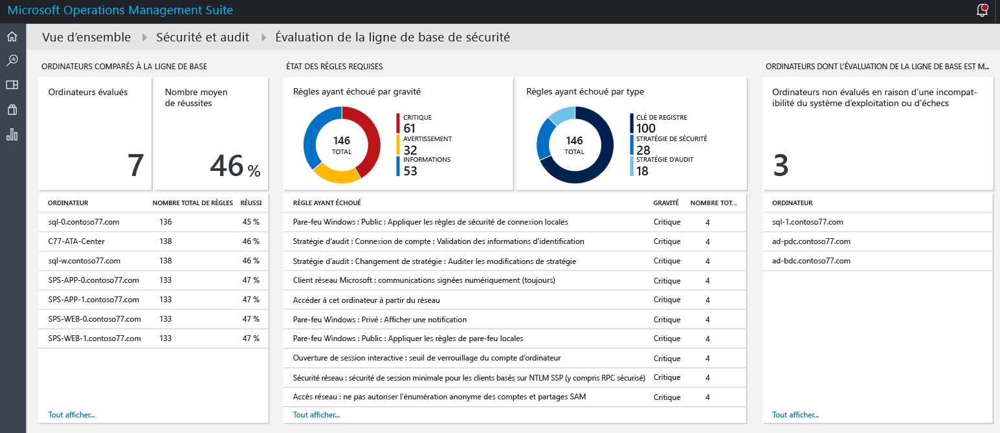
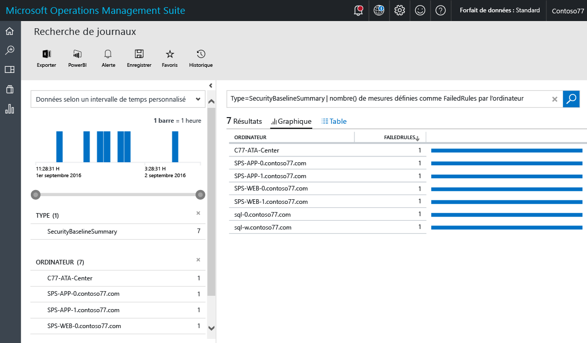
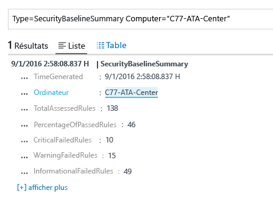
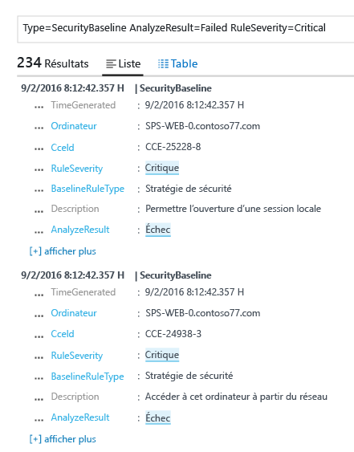

# Évaluation de la base de référence dans la solution de sécurité et d’audit d’Operations Management Suite
Ce document vous aide à utiliser les capacités d’évaluation de la base de référence de [la solution de sécurité et d’audit d’Operations Management Suite](operations-management-suite-overview.md) pour accéder à l’état de sécurité des ressources analysées.

## Qu’est-ce qu’une évaluation de la base de référence ?
Avec de nombreuses organisations gouvernementales et entreprises du secteur, Microsoft définit une configuration Windows qui représente des déploiements de serveur hautement sécurisés. Cette configuration regroupe un ensemble de clés de Registre, de paramètres de stratégie d’audit et de paramètres de stratégie de sécurité, ainsi que les valeurs recommandées par Microsoft pour ces paramètres. Cet ensemble de règles est appelé « base de référence de la sécurité ». La fonctionnalité d’évaluation de la base de référence de la solution de sécurité et d’audit d’OMS peut analyser l’ensemble de vos ordinateurs de manière transparente, afin de déterminer leur degré de conformité. 

Il existe trois types de règle :

* **Règles de Registre** : vérifiez que les clés de Registre sont correctement définies.
* **Règles de stratégie d’audit** : règles relatives à votre stratégie d’audit.
* **Règles de stratégie de sécurité** : règles relatives aux autorisations de l’utilisateur sur l’ordinateur.

> [!NOTE]
> Pour une brève vue d’ensemble de cette fonctionnalité, voir [Use OMS Security to assess the Security Configuration Baseline](https://blogs.technet.microsoft.com/msoms/2016/08/12/use-oms-security-to-assess-the-security-configuration-baseline/) (Utiliser la fonction de sécurité d’OMS pour évaluer la base de référence de configuration de la sécurité).
> 
> 

## Évaluation de la base de référence de la sécurité
Vous pouvez consulter votre évaluation de la base de référence de la sécurité en cours pour tous les ordinateurs surveillés par la solution de sécurité et d’audit d’OMS, grâce au tableau de bord.  Procédez comme suit pour accéder au tableau de bord de la fonction d’évaluation de la base de référence de la sécurité :

1. Dans le tableau de bord principal de **Microsoft Operations Management Suite**, cliquez sur la mosaïque **Sécurité et audit**.
2. Dans le tableau de bord **Sécurité et audit**, cliquez sur **Évaluation de la base de référence** sous **Domaines de sécurité**. Le tableau de bord **Évaluation de la base de référence de la sécurité** apparaît comme indiqué dans l’image suivante :
   
    

Ce tableau de bord est divisé en trois zones principales :

* **Ordinateurs comparés à la base de référence** : cette section récapitule le nombre d’ordinateurs auxquels le système a accédé et le pourcentage d’ordinateurs ayant passé l’évaluation. Il fournit également la liste des 10 premiers ordinateurs et le résultat de l’évaluation, en pourcentage.
* **État des règles obligatoires** : cette section a pour objectif de présenter à l’utilisateur les règles ayant échoué, classées par gravité et par type. En consultant le premier graphique, vous pouvez rapidement déterminer si la plupart des règles ayant échoué sont critiques ou non. Ce graphique fournit également une liste des 10 principales règles ayant échoué, accompagnées de leur niveau de gravité. Le deuxième graphique affiche le type de règle ayant échoué au cours de l’évaluation. 
* **Ordinateurs sans évaluation de la ligne de base** : cette section répertorie les ordinateurs auxquels le système n’a pas eu accès en raison d’une incompatibilité du système d’exploitation ou de défaillances. 

### Accès aux ordinateurs par rapport à la base de référence
Dans l’idéal, tous vos ordinateurs sont conformes à l’évaluation de la base de référence de la sécurité. Cependant, il se peut que certains ne le soient pas. Ce comportement est prévu. Dans le cadre du processus de gestion de la sécurité, il est important d’inclure l’inspection des ordinateurs qui n’a pas pu passer tous les tests d’évaluation de la sécurité. Pour visualiser rapidement ces informations, vous pouvez sélectionner l’option **Computers accessed** (Ordinateurs ouverts) de la section **Ordinateurs comparés à la base de référence**. Le résultat de la recherche de journal doit faire apparaître la liste des ordinateurs, comme indiqué dans l’écran suivant :

Le résultat de la recherche s’affiche sous la forme d’un tableau, dans lequel la première colonne inclut le nom de l’ordinateur et la deuxième, le nombre de règles ayant échoué. Pour récupérer les informations concernant le type de règle ayant échoué, cliquez sur le nombre de règles ayant échoué en regard du nom de l’ordinateur. Vous devez obtenir un résultat similaire à celui qu’illustre l’image suivante :

Dans ce résultat de recherche, vous voyez s’afficher le nombre total de règles évaluées, ainsi que le nombre de règles critiques, de règle d’avertissement et de règles d’information qui ont échoué.

### Accès au statut des règles obligatoires
Après avoir obtenu des informations concernant le nombre d’ordinateurs ayant passé l’évaluation (sous la forme d’un pourcentage), vous souhaiterez peut-être en savoir plus sur les règles ayant échoué, en fonction de leur degré de gravité. Cette visualisation vous aide à hiérarchiser les ordinateurs qui doivent être traités en premier lieu, afin de vérifier qu’ils seront conformes lors de la prochaine évaluation. Passez le curseur de la souris sur la valeur Critique dans le graphique, dans la mosaïque **Règles ayant échoué par gravité**, sous **État des règles obligatoires**, puis cliquez dessus. Vous devez voir un résultat similaire à celui de l’écran suivant :

 

Dans ce résultat de journal, vous voyez apparaître le type de règle de base ayant échoué, la description de cette règle et l’ID CCE (Common Configuration Enumeration) de cette règle de sécurité. Ces attributs doivent être suffisants pour permettre l’exécution d’une action corrective afin de résoudre ce problème sur l’ordinateur cible.

> [!NOTE]
> Pour en savoir plus sur CCE, accédez à la [base de données nationale des vulnérabilités (NVD)](https://nvd.nist.gov/cce/index.cfm) américaine.
> 
> 

### Accès aux ordinateurs sans évaluation de la ligne de base
OMS prend en charge le profil de base de référence des membres de domaine sur des systèmes Windows Server 2008 R2 à Windows Server 2012 R2. La ligne de base de Windows Server 2016 n’est pas encore finalisée. Elle sera ajoutée dès sa publication. Tous les autres systèmes d’exploitation analysés par la solution de sécurité et d’audit d’OMS apparaissent sous la section **Ordinateurs sans évaluation de la ligne de base**.

## Voir aussi
Dans ce document, vous avez découvert la fonction d’évaluation de la base de référence de la solution de sécurité et d’audit d’OMS. Pour plus d’informations sur la sécurité OMS, consultez les articles suivants :

* [Présentation - Operations Management Suite (OMS)](operations-management-suite-overview.md)
* [Surveiller et répondre aux alertes de sécurité dans la solution de sécurité et d’audit d’Operations Management Suite](oms-security-responding-alerts.md)
* [Surveillance des ressources dans la solution de sécurité et d’audit d’Operations Management Suite](oms-security-monitoring-resources.md)

<!--HONumber=Nov16_HO2-->

