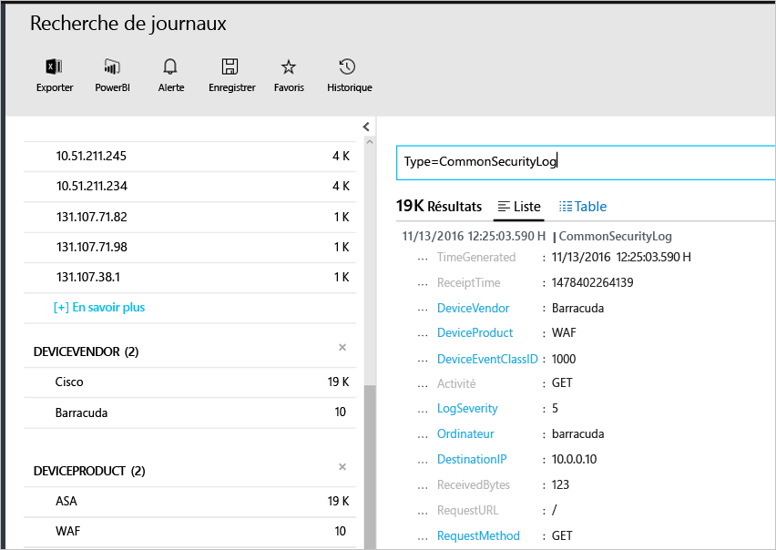

# <a name="connecting-your-security-products-to-the-operations-management-suite-oms-security-and-audit-solution"></a>Connexion de vos produits de sécurité à la solution de sécurité et d’audit Operations Management Suite (OMS) 
Ce document vous permet de connecter vos produits de sécurité à la solution de sécurité et d’audit OMS. Les sources suivantes sont prises en charge :

- Événements au format d’événement courant (CEF)
- Événements Cisco ASA


## <a name="what-is-cef"></a>Qu’est-ce que CEF ?
Le format d’événement courant (CEF) est un format standard du secteur en plus des messages Syslog. Il est utilisé par de nombreux fournisseurs de sécurité pour permettre l’interopérabilité des événements entre différentes plateformes. La solution de sécurité et d’audit OMS prend en charge la réception de données à l’aide du format CEF, ce qui vous permet de connecter vos produits de sécurité avec OMS Security. 

En connectant votre source de données à OMS, vous êtes en mesure de tirer parti des fonctionnalités suivantes qui font partie de cette plateforme :

- Recherche et corrélation
- Audit
- Alerte
- Informations sur les menaces
- Problèmes notables

## <a name="collection-of-security-solution-logs"></a>Collection des journaux des solutions de sécurité

OMS Security prend en charge la collecte de journaux à l’aide du format CEF sur Syslogs et des journaux [Cisco ASA](https://blogs.technet.microsoft.com/msoms/2016/08/25/add-your-cisco-asa-logs-to-oms-security/). Dans cet exemple, la source (la machine qui génère les journaux) est un ordinateur Linux tournant sous le démon syslog-ng et la cible est OMS Security. Pour préparer l’ordinateur Linux, vous devrez effectuer les tâches suivantes :

- Téléchargez l’Agent OMS pour Linux, version 1.2.0-25 ou ultérieure.
- Suivez la section **Guide d’installation rapide** de [cet article](https://github.com/Microsoft/OMS-Agent-for-Linux/blob/master/docs/OMS-Agent-for-Linux.md#steps-to-install-the-oms-agent-for-linux) pour installer et intégrer l’agent à votre espace de travail.

En règle générale, l’agent est installé sur un ordinateur différent de celui sur lequel les journaux sont générés. Le transfert des journaux vers la machine de l’agent nécessite généralement de suivre ces étapes :

- Configurez le produit/la machine de journalisation pour transférer les événements requis vers le démon syslog (rsyslog ou syslog-ng) sur la machine de l’agent.
- Activez le démon syslog sur la machine de l’agent pour recevoir des messages à partir d’un système distant.

Sur la machine de l’agent, les événements doivent être envoyés du démon syslog vers le port UDP local 25226. L’agent écoute les événements entrants sur ce port. Voici un exemple de configuration pour l’envoi de tous les événements du système local vers l’agent (vous pouvez modifier la configuration en fonction de vos paramètres locaux) :

1. Ouvrez la fenêtre de terminal et accédez au répertoire */etc/syslog-ng/* 
2. Créez un nouveau fichier *security-config-omsagent.conf* et ajoutez le contenu suivant : OMS_facility = local4
    
    filter f_local4_oms { facility(local4); };

    destination security_oms { tcp("127.0.0.1" port(25226)); };

    log { source(src); filter(f_local4_oms); destination(security_oms); };
    
3. Téléchargez le fichier *security_events.conf* et placez-le dans */etc/opt/microsoft/omsagent/conf/omsagent.d/* sur la machine de l’Agent OMS.
4. Tapez la commande suivante pour redémarrer le démon syslog :  *Pour syslog-ng, exécutez :*
    
    ```
    sudo service rsyslog restart
    ```

    *Pour rsyslog exécutez :*
    
    ```
    /etc/init.d/syslog-ng restart
    ```
5. Tapez la commande suivante pour redémarrer l’Agent OMS :

    *Pour syslog-ng, exécutez :*
    
    ```
    sudo service omsagent restart
    ```

    *Pour rsyslog exécutez :*
    
    ```
    systemctl restart omsagent
    ```
6. Tapez la commande suivante et examinez le résultat pour confirmer qu’il n’y a pas d’erreurs dans le journal de l’Agent d’OMS :

    ``` 
    tail /var/opt/microsoft/omsagent/log/omsagent.log
    ```

## <a name="reviewing-collected-security-events"></a>Examen des événements de sécurité collectés

[!include[log-analytics-log-search-nextgeneration](../../includes/log-analytics-log-search-nextgeneration.md)]

Une fois la configuration terminée, l’événement de sécurité commence à être ingéré par OMS Security. Pour visualiser ces événements, ouvrez la recherche de journal, tapez la commande *Type=CommonSecurityLog* dans le champ de recherche et appuyez sur ENTRÉE. L’exemple suivant montre le résultat de cette commande. Notez que dans ce cas OMS Security a déjà ingéré les journaux de sécurité de plusieurs fournisseurs :
   


Vous pouvez affiner la recherche pour un seul fournisseur. Par exemple, pour visualiser les journaux de Cisco en ligne, tapez : *Type=CommonSecurityLog DeviceVendor=Cisco*. « CommonSecurityLog » a des champs prédéfinis, pour n’importe quel en-tête au format CEF, y compris les extensions de base, alors que toute autre extension « Extension personnalisée » ou non, sera insérée dans le champ de « AdditionalExtensions ». Vous pouvez utiliser la fonctionnalité de champs personnalisés pour obtenir des champs dédiés. 

### <a name="accessing-computers-missing-baseline-assessment"></a>Accès aux ordinateurs sans évaluation de la ligne de base
OMS prend en charge le profil de base de référence des membres de domaine sur des systèmes Windows Server 2008 R2 à Windows Server 2012 R2. La ligne de base de Windows Server 2016 n’est pas encore finalisée. Elle sera ajoutée dès sa publication. Tous les autres systèmes d’exploitation analysés par la solution de sécurité et d’audit d’OMS apparaissent sous la section **Ordinateurs sans évaluation de la ligne de base**.

## <a name="see-also"></a>Voir aussi
Dans ce document, vous avez appris à connecter votre solution CEF à OMS. Pour plus d’informations sur la sécurité OMS, consultez les articles suivants :

* [Présentation - Operations Management Suite (OMS)](operations-management-suite-overview.md)
* [Surveiller et répondre aux alertes de sécurité dans la solution de sécurité et d’audit d’Operations Management Suite](oms-security-responding-alerts.md)
* [Surveillance des ressources dans la solution de sécurité et d’audit d’Operations Management Suite](oms-security-monitoring-resources.md)


