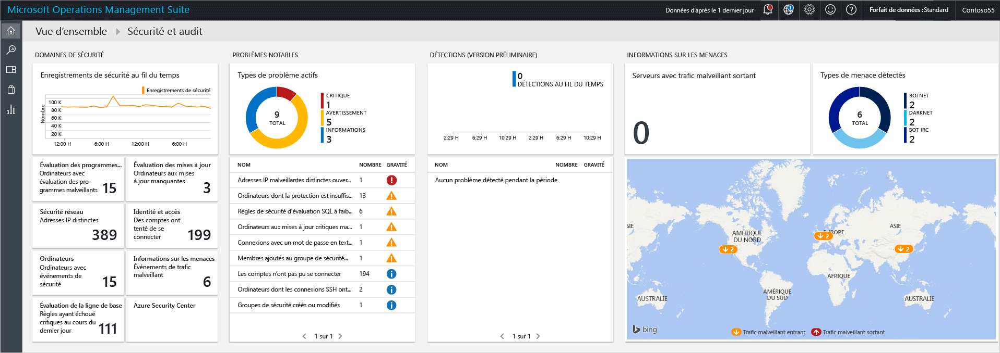
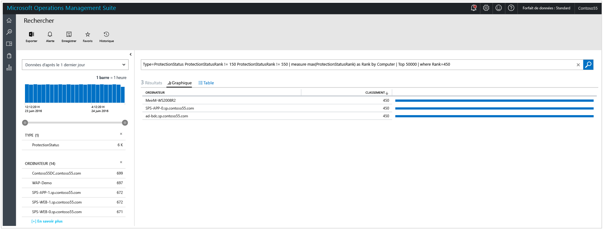
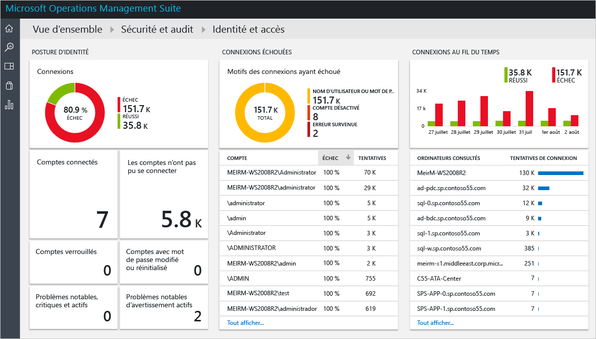
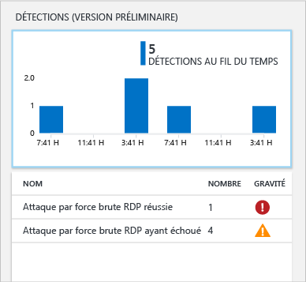
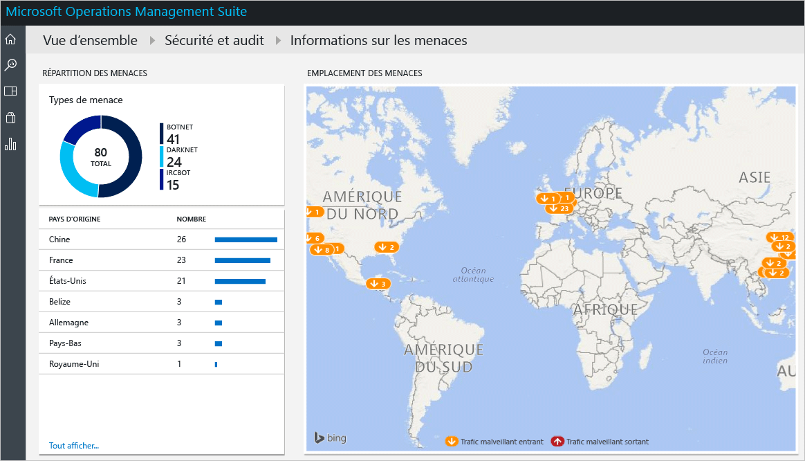

# Prise en main de la solution de sécurité et d’audit d’Operations Management Suite
Ce document vous aide à prendre rapidement en main les fonctionnalités de la solution de sécurité et d’audit d’Operations Management Suite (OMS), en vous présentant chaque option.

## Qu’est-ce qu’OMS ?
Microsoft Operations Management Suite (OMS) est une solution de gestion informatique de Microsoft qui vous permet de gérer et de protéger votre infrastructure locale et de cloud. Pour plus d’informations sur OMS, lisez l’article [Operations Management Suite](https://technet.microsoft.com/library/mt484091.aspx).

## Tableau de bord de la solution de sécurité et d’audit d’OMS
La solution de sécurité et d’audit d’OMS offre une vue détaillée de la sécurité informatique de votre organisation. Elle fournit des requêtes de recherche intégrées pour détecter les problèmes importants qui requièrent votre attention. Le tableau de bord **Sécurité et audit** est l’écran d’accueil pour tout ce qui se rapporte à la sécurité dans OMS. Il fournit un aperçu global de l’état de sécurité de vos ordinateurs. Il vous permet également de voir tous les événements des dernières 24 heures, des 7 derniers jours ou de n’importe quel intervalle de temps personnalisé. Pour accéder au tableau de bord **Sécurité et audit**, procédez comme suit :

1. Dans le tableau de bord principal de **Microsoft Operations Management Suite**, cliquez sur la mosaïque **Paramètres** située sur la gauche.
2. Dans le panneau **Paramètres**, sous **Solutions**, cliquez sur l’option **Sécurité et audit**.
3. Le tableau de bord **Sécurité et audit** s’affiche :
   
    

Si vous accédez à ce tableau de bord pour la première fois et qu’aucun de vos périphériques n’est surveillé par OMS, les mosaïques ne seront pas remplies avec les données obtenues de l’agent. Lorsque vous installez l’agent, il peut mettre un certain temps à se remplir. Par conséquent, il est possible qu’il manque certaines données dans celles que vous verrez initialement, car elles seront en cours de téléchargement sur le cloud.  Dans ce cas, il est normal que certaines mosaïques n’affichent aucune information tangible. Consultez la rubrique [Connexion directe des ordinateurs Windows à OMS](https://technet.microsoft.com/library/mt484108.aspx) pour savoir comment installer l’agent OMS sur un système Windows, et la rubrique relative à la [connexion des ordinateurs Linux à OMS](https://technet.microsoft.com/library/mt622052.aspx) pour savoir comment l’installer sur un système Linux.

> [!NOTE]
> L’agent collecte les informations d’après les événements en cours activés, par exemple le nom de l’ordinateur, le nom d’utilisateur et l’adresse IP. Toutefois, aucun document/fichier, aucun nom de base de données ni aucune donnée privée ne sont collectés.   
> 
> 

Les solutions sont un ensemble de règles de logique, de visualisation et d’acquisition des données qui répondent aux principaux problèmes que rencontrent les clients. Sécurité et audit est une solution ; d’autres peuvent être ajoutées séparément. Lisez l’article [Ajouter des solutions](https://technet.microsoft.com/library/mt674635.aspx) pour plus d’informations sur l’ajout d’une nouvelle solution.

Le tableau de bord de la solution de sécurité et d’audit d’OMS est organisé en quatre catégories principales :

* **Security Domains**(Domaines de sécurité) : dans cette section, vous pourrez explorer plus en détail les enregistrements de sécurité au fil du temps, accéder à l’évaluation des programmes malveillants, l’évaluation des mises à jour, la sécurité du réseau, les informations d’identité et d’accès, les ordinateurs présentant des événements de sécurité, et accéder rapidement au tableau de bord du Centre de sécurité Azure.
* **Problèmes notables** : cette option vous permet d’identifier rapidement le nombre de problèmes actifs et leur gravité.
* **Détections (préversion)** : cette option vous permet d’identifier les modèles d’attaque en visualisant les alertes de sécurité au fur et à mesure qu’elles affectent vos ressources.
* **Informations sur les menaces**: cette option vous permet d’identifier les modèles d’attaque en visualisant le nombre total de serveurs présentant un trafic IP sortant malveillant, le type de menace malveillante et une carte indiquant l’origine de ces adresses IP. 
* **Common security queries** (Requêtes de sécurité courantes) : cette option vous fournit une liste des requêtes de sécurité les plus courantes que vous pouvez utiliser pour surveiller votre environnement. Cliquez sur l’une de ces requêtes pour ouvrir le panneau **Recherche** affichant les résultats de cette requête.

> [!NOTE]
> pour en savoir plus sur la manière dont OMS conserve vos données sécurisées, lisez How OMS secures your data (Comment OMS sécurise vos données).
> 
> 

## Security domains (Domaines de sécurité)
Lorsque vous surveillez des ressources, il est important que vous puissiez accéder rapidement à l’état actuel de votre environnement. Cependant, il est tout aussi important de pouvoir retracer les événements qui se sont produits dans le passé et qui peuvent aider à comprendre ce qui se passe dans votre environnement à un moment donné. 

> [!NOTE]
> la rétention des données dépend du plan de tarification d’OMS. Pour plus d’informations, consultez la page de tarification de [Microsoft Operations Management Suite](https://www.microsoft.com/server-cloud/operations-management-suite/pricing.aspx) .
> 
> 

Les scénarios d’investigation et de réponse aux incidents bénéficient directement des résultats affichés dans la mosaïque **Security Records over Time** (Enregistrements de sécurité au fil du temps).

Lorsque vous cliquez sur cette mosaïque, le panneau **Recherche** s’ouvre, affichant les résultats d’une requête pour les **Événements de sécurité** (Type=SecurityEvents) et présentant les données des sept derniers jours, comme indiqué ci-dessous :

Les résultats de la recherche sont répartis en deux volets : le volet de gauche vous fournit une analyse du nombre d’événements de sécurité qui ont été trouvés, les ordinateurs sur lesquels ils ont été détectés, le nombre de comptes présents sur ces ordinateurs et les types d’activités. Le volet de droite vous fournit les résultats totaux ainsi qu’une vue chronologique des événements de sécurité avec le nom de l’ordinateur et l’activité de l’événement. Vous pouvez également cliquer sur **Show More** (Afficher plus) pour afficher plus de détails sur un événement, tels que les données qui s’y rapportent, son identifiant et sa source.

> [!NOTE]
> Pour plus d’informations sur la requête de recherche OMS, consultez [OMS search reference](https://technet.microsoft.com/library/mt450427.aspx)(Référence de recherche OMS).
> 
> 

### Analyse anti-programme malveillant
Cette option vous permet d’identifier rapidement les ordinateurs disposant d’une protection insuffisante et ceux qui ont été compromis par un programme malveillant. L’état de l’évaluation des programmes malveillants et les menaces détectées sur les serveurs surveillés sont analysés, puis les données sont envoyées pour traitement au service OMS dans le cloud. Les serveurs où des menaces sont détectées et ceux dont la protection est insuffisante sont affichés dans le tableau de bord de l’évaluation des programmes malveillants, accessible une fois que vous avez cliqué sur la mosaïque **Analyse anti-programme malveillant**. 

Tout comme n’importe quelle autre mosaïque dynamique du tableau de bord OMS, lorsque vous cliquez dessus, le panneau **Recherche** s’ouvre et affiche le résultat de la requête. Pour cette option, si vous cliquez sur l’option **Not Reporting** (Pas de rapports) sous **Protection Status** (État de la protection), vous obtenez le résultat de la requête qui affiche cette entrée unique contenant le nom de l’ordinateur et son rang, comme indiqué ci-dessous :

> [!NOTE]
> *rank* (rang) est un niveau attribué pour refléter l’état de la protection (activée, désactivée, mise à jour, etc.) et les menaces détectées. Le fait que ce niveau soit sous la forme numérique permet de faire des agrégations.
> 
> 

Cliquez sur le nom de l’ordinateur pour afficher la vue chronologique de l’état de la protection pour cet ordinateur. Cette fonctionnalité est très utile dans les cas où vous devez savoir si le logiciel anti-programmes malveillants a été installé puis supprimé.   

### Update assessment (Évaluation des mises à jour)
Cette option vous permet de déterminer rapidement l’exposition globale aux problèmes de sécurité potentiels, de savoir si ces mises à jour sont importantes pour votre environnement et, le cas échéant, à quel point. La solution de sécurité et d’audit d’OMS permet uniquement de visualiser ces mises à jour. Les données réelles proviennent de [Update Management Solutions](oms-solution-update-management.md) qui est un autre module au sein d’OMS. Voici un exemple de mise à jour :

> [!NOTE]
> Pour plus d’informations sur la solution Update Management, voir [solution Update Management dans OMS](oms-solution-update-management.md).
> 
> 

### Identité et accès
L’identité doit être le plan de contrôle de votre entreprise. Protéger votre identité doit être votre priorité absolue. Autrefois, les organisations étaient entourées d’un périmètre de sécurité qui constituait l’une de leurs principales défenses. Aujourd’hui, ces organisations disposent d’un plus gros volume de données et d’applications qui évoluent dans le cloud, et l’identité devient leur nouveau périmètre. 

> [!NOTE]
> actuellement, ne sont prises en compte que les données de connexion des événements de sécurité (identifiant de l’événement 4624). À l’avenir, les connexions à Office 365 et les données Azure AD seront également incluses.
> 
> 

Surveiller vos activités d’identité vous permet de prendre des mesures proactives avant qu’un événement ne survienne, ou des mesures réactives pour contrer une tentative d’attaque. Le tableau de bord **Identité et accès** vous offre une vue d’ensemble de l’état de votre identité, notamment le nombre de tentatives de connexion ayant échoué, les comptes d’utilisateurs utilisés au cours de ces tentatives, les comptes verrouillés, les comptes pour lesquels le mot de passe a été changé ou réinitialisé et le nombre de comptes actuellement connectés. 

Cliquez sur la mosaïque **Identité et accès** pour afficher le tableau de bord suivant :

Les informations disponibles dans ce tableau de bord peuvent immédiatement vous aider à identifier une activité suspecte potentielle. Par exemple, il y a eu 338 tentatives de connexion en tant qu’**Administrateur**, et 100 % de ces tentatives ont échoué. Ce compte a peut-être été l’objet d’une attaque en force brute. Cliquez sur ce compte pour obtenir plus d’informations, ce qui peut vous aider à déterminer la ressource cible de cette attaque potentielle :

Le rapport détaillé fournit des informations sur cet événement, notamment : l’ordinateur cible, le type d’ouverture de session (dans ce cas, Connexion réseau), l’activité (dans ce cas, l’événement 4625) et une chronologie complète de chaque nouvelle tentative. 

### Ordinateurs
Cette mosaïque peut être utilisée pour accéder à tous les ordinateurs où des événements de sécurité actifs ont été détectés. Cliquez dans cette mosaïque pour afficher la liste des ordinateurs présentant des événements de sécurité et leur nombre :

Vous pouvez approfondir votre investigation en cliquant sur chaque ordinateur et en examinant les événements de sécurité signalés.

### Informations sur les menaces

Grâce à l’option d’informations sur les menaces disponible dans la solution de sécurité et d’audit d’OMS, les administrateurs informatiques peuvent détecter les menaces de sécurité dans l’environnement (par exemple, identifier si un ordinateur en particulier fait partie d’un botnet). Un ordinateur peut devenir un nœud d’un botnet si un pirate installe de manière illicite un programme malveillant qui connecte secrètement cet ordinateur à la commande et au contrôle. Cette option peut également identifier les menaces potentielles provenant de canaux de communication obscurs, tel que le Darknet. Pour plus d’informations sur l’option d’informations sur les menaces, voir l’article [Surveiller et répondre aux alertes de sécurité dans la solution de sécurité et d’audit d’Operations Management Suite](oms-security-responding-alerts.md).

Dans certains scénarios, vous pouvez remarquer qu’un ordinateur surveillé a accédé à une adresse IP potentiellement malveillante :

Cette alerte, et d’autres de la même catégorie, sont générées par le biais de la solution de sécurité d’OMS en tirant profit des [informations sur les menaces fournies par Microsoft](https://youtu.be/O4WtxgUrDc8). Les informations sur les menaces sont collectées par Microsoft ou achetées auprès des principaux fournisseurs d’informations de ce type. Ces données sont fréquemment mises à jour et adaptées à l’évolution rapide des menaces. Du fait de leur nature, elles doivent être associées à d’autres sources d’informations de sécurité lors de [l’examen](https://blogs.technet.microsoft.com/msoms/2016/12/08/investigating-suspicious-activity-in-a-hybrid-cloud-with-oms-security/) d’une alerte de sécurité. 

### Évaluation de la ligne de base

Avec de nombreuses organisations gouvernementales et entreprises du secteur, Microsoft définit une configuration Windows qui représente des déploiements de serveur hautement sécurisés. Cette configuration regroupe un ensemble de clés de Registre, de paramètres de stratégie d’audit et de paramètres de stratégie de sécurité, ainsi que les valeurs recommandées par Microsoft pour ces paramètres. Cet ensemble de règles est appelé « base de référence de la sécurité ». Pour plus d’informations sur cette option, lire [Évaluation de la base de référence dans la solution de sécurité et d’audit d’Operations Management Suite](oms-security-baseline.md).

### Azure Security Center
Cette mosaïque est tout simplement un raccourci vers le tableau de bord du Centre de sécurité Azure. Pour en savoir plus sur cette solution, consultez [Prise en main du Centre de sécurité Azure](../security-center/security-center-get-started.md) .

## Notable issues (Problèmes importants)
L’objectif principal de ce groupe d’options est de fournir un aperçu rapide des problèmes rencontrés dans votre environnement, en les classant en fonction de leur gravité : Critical (Critique), Warning (Avertissement) et Informational (Information). La mosaïque Active issue type (Type de problème actif) vous permet de visualiser ces problèmes, mais pas de les explorer plus en détail. Pour ce faire, vous devez utiliser la partie inférieure de cette mosaïque qui contient le nom du problème (NAME), le nombre d’objets qu’il a touchés (COUNT) et sa gravité (SEVERITY).

Comme vous pouvez le voir, ces problèmes ont déjà été traités dans différentes sections du groupe **Security Domains** (Domaines de sécurité), ce qui vient servir l’objectif de cette vue : visualiser les problèmes les plus importants rencontrés par votre environnement dans un emplacement unique.

## Détections (préversion)
L’objectif principal de cette option consiste à permettre au département informatique d’identifier rapidement les menaces potentielles visant l’environnement, ainsi que leur niveau de gravité.

Cette option peut également être utilisée pendant un [examen dans le cadre d’une réponse à un incident](https://blogs.msdn.microsoft.com/azuresecurity/2016/11/30/investigating-suspicious-activity-in-a-hybrid-cloud-with-oms-security/), afin d’évaluer une attaque et d’obtenir des informations supplémentaires à son propos.

> [!NOTE]
> Pour savoir comment utiliser OMS et répondre aux incidents, voir la vidéo indiquant [comment tirer parti de Microsoft Azure Security Center et de Microsoft Operations Management Suite pour la réponse aux incidents](https://channel9.msdn.com/Blogs/Taste-of-Premier/ToP1703).
> 
> 

## Informations sur les menaces
La nouvelle section d’informations sur les menaces de la solution de sécurité et d’audit vous permet d’identifier les modèles d’attaque potentiels de plusieurs façons : via le nombre total de serveurs présentant un trafic IP sortant malveillant, via le type de menace malveillante et via une carte indiquant l’origine de ces adresses IP. Vous pouvez interagir avec la carte et cliquer sur les adresses IP pour plus d’informations.

Les repères jaunes sur la carte indiquent le trafic entrant provenant d’adresses IP malveillantes. Il n’est pas rare d’observer du trafic malveillant entrant sur les serveurs exposés à Internet, mais nous vous recommandons d’examiner ces tentatives pour vous assurer qu’aucune d’elles n’a réussi. Ces indicateurs sont basés sur les journaux IIS, WireData et les journaux du pare-feu Windows.  

## Common security queries
La liste des requêtes de sécurité courantes peut être utile pour vous permettre d’accéder rapidement aux informations d’une ressource et de la personnaliser en fonction des besoins de votre environnement. Ces requêtes courantes sont les suivantes :

* Toutes les activités de sécurité
* Activités de sécurité sur l’ordinateur « computer01.contoso.com » (remplacez par le nom de votre ordinateur)
* Activités de sécurité sur l’ordinateur « computer01.contoso.com » pour le compte « Administrateur » (remplacez par le nom de votre ordinateur)
* Activité de connexion par ordinateur
* Comptes ayant arrêté le logiciel anti-programmes malveillants de Microsoft sur n’importe quel ordinateur
* Ordinateurs où le processus du logiciel anti-programmes malveillants de Microsoft a été arrêté
* Les ordinateurs où la commande « hash.exe » a été exécutée (remplacez par d’autres noms de processus)
* Tous les noms de processus qui ont été exécutés
* Activité de connexion par compte
* Comptes qui se sont connectés à distance sur l’ordinateur « computer01.contoso.com » (remplacez par le nom de votre ordinateur)

## Voir aussi
Ce document vous a présenté la solution de sécurité et d’audit d’OMS. Pour plus d’informations sur la sécurité OMS, consultez les articles suivants :

* [Présentation - Operations Management Suite (OMS)](operations-management-suite-overview.md)
* [Surveiller et répondre aux alertes de sécurité dans la solution de sécurité et d’audit d’Operations Management Suite](oms-security-responding-alerts.md)
* [Surveillance des ressources dans la solution de sécurité et d’audit d’Operations Management Suite](oms-security-monitoring-resources.md)

