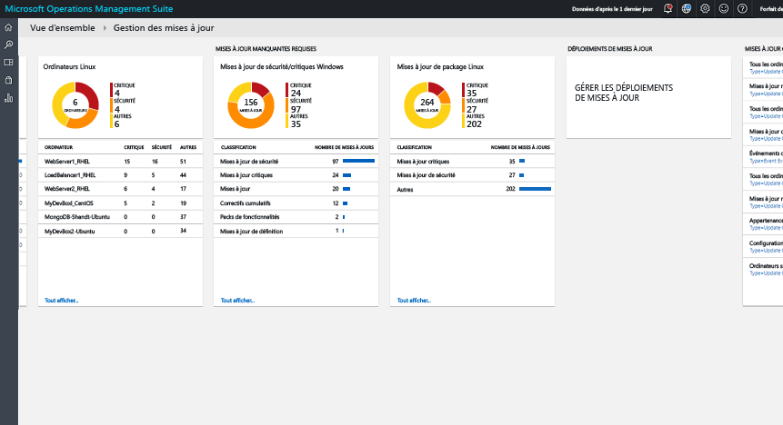
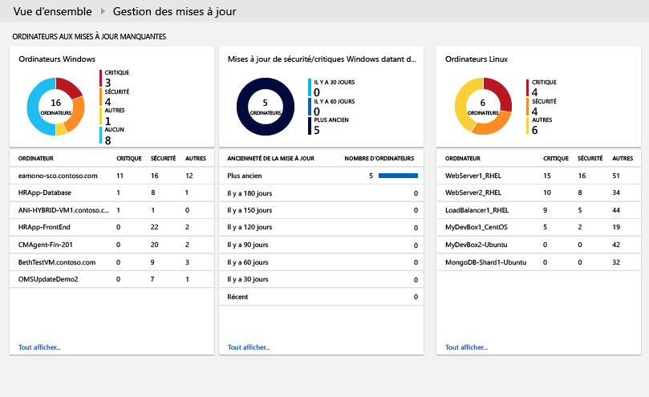
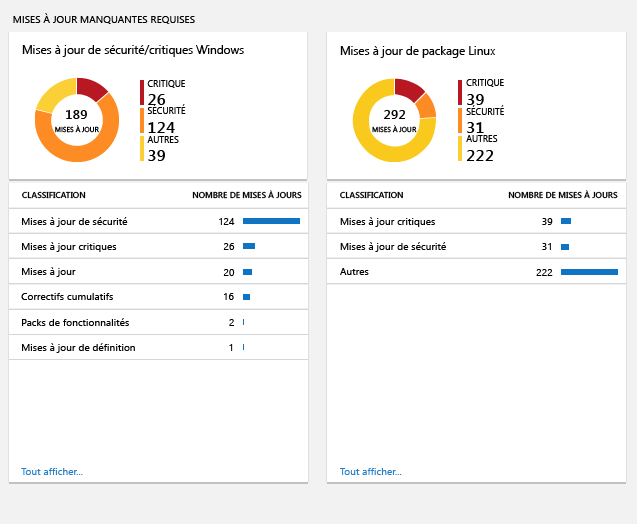
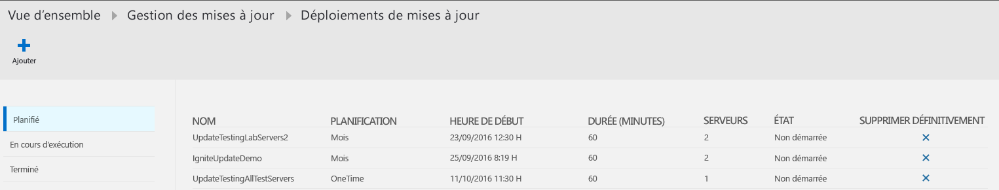
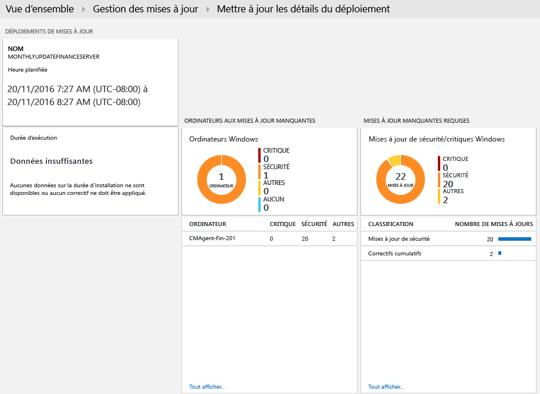
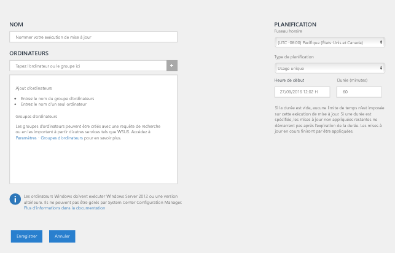
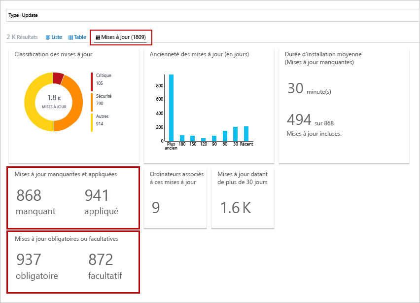
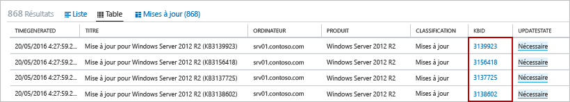
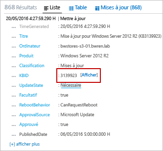

# Solution de gestion des mises à jour dans OMS
La solution de gestion des mises à jour dans OMS vous permet de gérer les mises à jour de vos ordinateurs Windows et Linux.  Vous pouvez rapidement évaluer l’état des mises à jour disponibles sur tous les ordinateurs d’agent et lancer le processus d’installation des mises à jour requises pour les serveurs. 

## Composants requis
* La solution prend uniquement en charge les évaluations de mise à jour sur Windows Server 2008 et version ultérieure ainsi que la mise à jour de déploiements sur Windows Server 2012 et version ultérieure.  Les options d’installation Server Core et Nano Server ne sont pas prises en charge.
* Les systèmes d’exploitation clients Windows ne sont pas pris en charge.  
* Les agents Windows doivent être configurés pour communiquer avec un serveur WSUS (Windows Server Update Services) ou avoir accès à Microsoft Update.  
  
  > [!NOTE]
  > L’agent Windows ne peut pas être géré simultanément par System Center Configuration Manager.  
  > 
  > 
* Les agents Linux doivent avoir accès à un référentiel de mise à jour.  L’agent OMS pour Linux peut être téléchargé à partir de [GitHub](https://github.com/microsoft/oms-agent-for-linux). 

## Configuration
Procédez comme suit pour ajouter la solution de gestion des mises à jour à votre espace de travail OMS et pour ajouter des agents Linux. Les agents Windows sont automatiquement ajoutés, sans aucune configuration supplémentaire.

> [!NOTE]
> Si vous activez cette solution, n’importe quel ordinateur Windows connecté à votre espace de travail OMS sera automatiquement configuré comme un Runbook Worker hybride pour prendre en charge les runbooks inclus dans cette solution.  Toutefois, il n’est inscrit avec aucun groupe de Workers hybrides que vous avez déjà défini dans votre compte Automation.  Vous pouvez l’ajouter à un groupe de Runbooks Workers hybrides dans votre compte Automation pour prendre en charge des Runbooks Automation à condition d’utiliser le même compte à la fois pour la solution et pour l’appartenance au groupe de Runbooks Workers hybrides.  Cette fonctionnalité a été ajoutée à la version 7.2.12024.0 du groupe de Runbooks Workers hybrides.   

1. Ajoutez la solution de gestion des mises à jour à votre espace de travail OMS en suivant la procédure décrite dans la rubrique [Pour ajouter une solution à l’aide de la galerie de solutions](../log-analytics/log-analytics-add-solutions.md).  
2. Dans le portail OMS, sélectionnez **Paramètres**, puis **Sources connectées**.  Notez la valeur **ID de l’espace de travail** et la valeur **Clé primaire** ou **Clé secondaire**.
3. Procédez comme suit pour chaque ordinateur Linux.
   
   a.    Installez la dernière version de l’agent OMS pour Linux en exécutant les commandes suivantes.  Remplacez l’élément <Workspace ID> par l’ID de l’espace de travail et l’élément <Key>, par la valeur de la clé primaire ou de la clé secondaire.
   
        cd ~
        wget https://github.com/Microsoft/OMS-Agent-for-Linux/releases/download/v1.2.0-75/omsagent-1.2.0-75.universal.x64.sh  
        sudo bash omsagent-1.2.0-75.universal.x64.sh --upgrade -w <Workspace ID> -s <Key>

   b. Pour supprimer l’agent, exécutez la commande suivante.
   
        sudo bash omsagent-1.2.0-75.universal.x64.sh --purge

## Packs d’administration
Si votre groupe d’administration System Center Operations Manager est connecté à votre espace de travail OMS, les packs d’administration suivants sont installés dans Operations Manager lorsque vous ajoutez cette solution. Ces packs d’administration ne nécessitent aucune opération de configuration ou de maintenance. 

* Microsoft System Center Advisor Update Assessment Intelligence Pack (Microsoft.IntelligencePacks.UpdateAssessment)
* Microsoft.IntelligencePack.UpdateAssessment.Configuration (Microsoft.IntelligencePack.UpdateAssessment.Configuration)
* Pack d’administration du déploiement des mises à jour

Pour en savoir plus sur la façon dont ces packs d’administration de solutions sont mis à jour, voir [Connexion d’Operations Manager à Log Analytics](../log-analytics/log-analytics-om-agents.md).

## Collecte des données
### Agents pris en charge
Le tableau suivant décrit les sources connectées qui sont prises en charge par cette solution.

| Source connectée | Pris en charge | Description |
| --- | --- | --- |
| Agents Windows |Oui |La solution de collecte des informations sur les mises à jour système des agents et lance l’installation des mises à jour obligatoires. |
| Agents Linux |Oui |La solution collecte des informations sur les mises à jour système des agents Linux. |
| Groupe d’administration d’Operations Manager |Oui |La solution collecte des informations sur les mises à jour système des agents dans un groupe d’administration connecté. Une connexion directe entre l’agent Operations Manager et Log Analytics n’est pas obligatoire. Les données sont transférées du groupe d’administration au référentiel OMS. |
| Compte Azure Storage |Non |Le stockage Azure n’inclut aucune information sur les mises à jour du système. |

### Fréquence de collecte
Pour chaque ordinateur Windows géré, une analyse est effectuée deux fois par jour.  Lorsqu’une mise à jour est installée, ses informations sont mises à jour dans les 15 minutes qui suivent.  

Pour chaque ordinateur Linux géré, une analyse est effectuée toutes les 3 heures.  

## Utilisation de la solution
Lorsque vous ajoutez la solution de gestion des mises à jour à votre espace de travail OMS, la mosaïque **Gestion des mises à jour** est ajoutée à votre tableau de bord OMS. Cette mosaïque affiche une valeur et une représentation graphique du nombre d’ordinateurs de votre environnement pour lesquels une mise à jour système est actuellement requise.  
  

## Affichage des évaluations de mises à jour
Cliquez sur la mosaïque **Gestion des mises à jour** pour ouvrir le tableau de bord **Gestion des mises à jour**. Le tableau de bord comprend les colonnes figurant dans le tableau suivant. Chaque colonne répertorie jusqu’à dix éléments répondant aux critères de cette colonne pour l’étendue et l’intervalle de temps spécifiés. Vous pouvez exécuter une recherche de journal qui envoie l’ensemble des enregistrements. Pour cela, cliquez sur **Afficher tout** en bas de la colonne ou cliquez sur l’en-tête de colonne.

| Colonne | Description |
| --- | --- |
| **Ordinateurs avec mises à jour manquantes** | |
| Mises à jour critiques ou de sécurité |Répertorie les dix principaux ordinateurs pour lesquelles des mises à jour sont manquantes, triés en fonction du nombre de mises à jour concernées. Cliquez sur un nom d’ordinateur pour exécuter une recherche de journal renvoyant tous les enregistrements de mise à jour pour cet ordinateur. |
| Critical or Security Updates older than 30 days (Mises à jour critiques ou de sécurité de plus de 30 jours) |Identifie le nombre d’ordinateurs pour lesquels des mises à jour de sécurité ou critiques sont regroupées en fonction du temps écoulé depuis la publication de ces mises à jour. Cliquez sur l’une des entrées pour exécuter une recherche de journal visant à renvoyer toutes les mises à jour manquantes et critiques. |
| **Mises à jour manquantes obligatoires** | |
| Mises à jour critiques ou de sécurité |Répertorie les classifications des mises à jour manquantes pour certains ordinateurs, triées en fonction du nombre d’ordinateurs pour lesquels des mises à jour sont manquantes dans la catégorie. Cliquez sur une classification pour exécuter une recherche de journal renvoyant tous les enregistrements de mise à jour pour cette classification. |
| **Update Deployments** (Déploiements de mises à jour) | |
| Déploiements de mises à jour |Nombre de déploiements de mises à jour actuellement planifiées et durée jusqu’à la prochaine exécution planifiée.  Cliquez sur la mosaïque pour afficher les planifications et les mises à jour en cours ou terminées, ou pour planifier un nouveau déploiement. |

   
   
 
   
 
   

## Installation des mises à jour
Une fois les mises à jour évaluées pour tous les ordinateurs Windows dans votre environnement, vous pouvez lancer l’installation des mises à jour obligatoires en créant une opération de *déploiement de mises à jour*.  Un déploiement de mises à jour est une installation planifiée de mises à jour obligatoires pour un ou plusieurs ordinateurs Windows.  Vous pouvez spécifier la date et l’heure du déploiement en plus d’un ordinateur ou d’un groupe d’ordinateurs à inclure.  

Les mises à jour sont installées par des Runbooks dans Azure Automation.  Vous ne pouvez pas visualiser ces Runbooks, qui ne nécessitent aucune configuration.  Lorsqu’un déploiement de mises à jour est créé, il génère une planification qui démarre un Runbook de mises à jour principal au moment indiqué pour les ordinateurs inclus.  Ce Runbook principal lance un Runbook enfant sur chaque agent Windows qui effectue l’installation des mises à jour obligatoires.  

Les machines virtuelles créées à partir des images Red Hat Enterprise Linux (RHEL) à la demande disponibles dans le service Place de marché Azure sont inscrites pour accéder à l’infrastructure [RHUI (Red Hat Update Infrastructure)](../virtual-machines/virtual-machines-linux-update-infrastructure-redhat.md) déployée dans Azure.  Toute autre distribution Linux doit être mise à jour à partir du référentiel de fichiers de distributions en ligne en tenant compte de leurs méthodes prises en charge.  

### Affichage des déploiements de mises à jour
Cliquez sur la mosaïque **Déploiement de mises à jour** pour afficher la liste des déploiements de mises à jour existants.  Ces déploiements sont regroupés par état : **Planifié**, **Exécution en cours** et **Terminé**.      

Les propriétés affichées pour chaque déploiement de mises à jour sont décrites dans le tableau suivant.

| Propriété | Description |
| --- | --- |
| Nom |Nom du déploiement de mises à jour. |
| Planification |Type de planification.  La seule valeur possible est actuellement *OneTime*. |
| Heure de début |Date et heure de début planifiées pour le déploiement de mises à jour. |
| Durée |Nombre de minutes pendant lequel le déploiement de mises à jour est autorisé à s’exécuter.  Si toutes les mises à jour ne sont pas installées pendant cette durée, les mises à jour restantes doivent attendre le prochain déploiement de mises à jour. |
| Serveurs |Nombre d’ordinateurs affectés par le déploiement de mises à jour. |
| État |État actuel du déploiement de mises à jour.  Les valeurs possibles sont les suivantes : -    Non commencé - Exécution en cours - Terminé |

Cliquez sur un déploiement de mises à jour pour afficher la page de détails le concernant, qui inclut les colonnes indiquées dans le tableau suivant.  Ces colonnes ne sont remplies qu’une fois que le déploiement de mises à jour a commencé. 

| Colonne | Description |
| --- | --- |
| **Résultats de l’ordinateur** | |
| Opération réussie |Répertorie le nombre d’ordinateurs concerné par le déploiement de mises à jour, par état.  Cliquez sur un état pour exécuter une recherche de journal qui renvoie l’ensemble des enregistrements de mises à jour présentant cet état pour le déploiement de mises à jour. |
| État de l’installation de l’ordinateur |Répertorie les ordinateurs impliqués dans le déploiement de mises à jour et le pourcentage de mises à jour dont l’installation a abouti. Cliquez sur l’une des entrées pour exécuter une recherche de journal visant à renvoyer toutes les mises à jour manquantes et critiques. |
| **Résultats de la mise à jour des instances** | |
| État de l’installation des instances |Répertorie les classifications des mises à jour manquantes pour certains ordinateurs, triées en fonction du nombre d’ordinateurs pour lesquels des mises à jour sont manquantes dans la catégorie. Cliquez sur un ordinateur pour exécuter une recherche de journal renvoyant tous les enregistrements de mise à jour pour cet ordinateur. |

   

### Création d’un déploiement de mises à jour
Pour créer un déploiement de mises à jour, cliquez sur le bouton **Ajouter** situé sur la partie supérieure de l’écran, afin d’ouvrir la page **New Update Deployment** (Nouveau déploiement de mises à jour).  Vous devez fournir des valeurs pour les propriétés dans le tableau suivant.

| Propriété | Description |
| --- | --- |
| Nom |Nom unique identifiant le déploiement de mises à jour. |
| Time Zone (Fuseau horaire) |Fuseau horaire à utiliser pour l’heure de début. |
| Heure de début |Date et heure de début du déploiement de mises à jour. |
| Durée |Nombre de minutes pendant lequel le déploiement de mises à jour est autorisé à s’exécuter.  Si toutes les mises à jour ne sont pas installées pendant cette durée, les mises à jour restantes doivent attendre le prochain déploiement de mises à jour. |
| Ordinateurs |Noms d’ordinateurs ou de groupes d’ordinateurs à inclure dans le déploiement de mises à jour.  Sélectionnez une ou plusieurs entrées dans la liste déroulante. |

   

### Période
Par défaut, l’étendue des données analysées dans la solution de gestion des mises à jour couvre tous les groupes d’administration connectés qui ont été générés au cours de la dernière journée. 

Pour modifier l’intervalle de temps des données, sélectionnez l’option **Données basées sur** située en haut du tableau de bord. Vous pouvez sélectionner les enregistrements générés ou mis à jour durant les 7 derniers jours, la journée précédente ou les 6 dernières heures. Vous pouvez également sélectionner **Personnalisé** et spécifier une plage de dates personnalisée.     

## Enregistrements Log Analytics
La solution de gestion des mises à jour crée deux types d’enregistrements dans le référentiel OMS.

### Enregistrements de mises à jour
Un enregistrement présentant le type **Update** est créé pour chaque mise à jour installée ou requise sur chaque ordinateur. Les propriétés de ces enregistrements sont décrites dans le tableau suivant.

| Propriété | Description |
| --- | --- |
| Type |*Mettre à jour* |
| SourceSystem |Système source ayant approuvé l’installation de la mise à jour. Les valeurs possibles sont les suivantes : - Microsoft Update -    Windows Update -    SCCM - Serveurs Linux (extraits des gestionnaires de packages) |
| Approved |Indique si l’installation de la mise à jour a été approuvée.  Pour les serveurs Linux, cette opération est actuellement considérée comme facultative, car l’application de mises à jour corrective n’est pas gérée par OMS. |
| Classification for Windows |Classification de la mise à jour. Les valeurs possibles sont les suivantes : -    Applications - Mises à jour critiques - Mises à jour de définitions - Packs de fonctionnalités - Mises à jour de sécurité - Service Packs - Correctifs cumulatifs - Mises à jour |
| Classification for Linux |Classification de la mise à jour. Les valeurs possibles sont les suivantes : - Mises à jour critiques - Mises à jour de sécurité - Autres mises à jour |
| Ordinateur |Nom de l’ordinateur. |
| InstallTimeAvailable |Spécifie si l’heure d’installation est disponible à partir d’autres agents ayant installé la même mise à jour. |
| InstallTimePredictionSeconds |Estimation du temps d’installation, reposant sur celui des autres agents ayant installé la même mise à jour (en secondes). |
| KBID |ID de l’article de la Base de connaissances qui décrit la mise à jour. |
| ManagementGroupName |Nom du groupe d'administration pour les agents SCOM.  Pour les autres agents, il s’agit d’AOI-<workspace ID>. |
| MSRCBulletinID |ID du Bulletin de sécurité Microsoft décrivant la mise à jour. |
| MSRCSeverity |Gravité du Bulletin de sécurité Microsoft. Les valeurs possibles sont les suivantes : - Critique - Important - Modéré |
| Facultatif |Spécifie si la mise à jour est facultative. |
| Produit |Nom du produit concerné par la mise à jour.  Cliquez sur **Affichage** pour ouvrir l’article dans un navigateur. |
| PackageSeverity |Niveau de gravité de la vulnérabilité résolue dans cette mise à jour, comme indiqué par les fournisseurs de distributions Linux. |
| PublishDate |Date et heure de l’installation de la mise à jour. |
| RebootBehavior |Indique sir la mise à jour force un redémarrage. Les valeurs possibles sont les suivantes : - canrequestreboot - neverreboots |
| RevisionNumber |Numéro de révision de la mise à jour. |
| SourceComputerId |GUID permettant d’identifier l’ordinateur de manière unique. |
| TimeGenerated |Date et heure de la dernière mise à jour apportée à l’enregistrement. |
| Intitulé |Titre de la mise à jour. |
| UpdateID |GUID permettant d’identifier la mise à jour de manière unique. |
| UpdateState |Indique si la mise à jour est installée sur cet ordinateur. Les valeurs possibles sont les suivantes : - Installé : la mise à jour est installée sur cet ordinateur. - Nécessaire : la mise à jour n’est pas installée et est nécessaire pour cet ordinateur. |

 
Lorsque vous effectuez une recherche de journal qui renvoie des enregistrements présentant le type **Update**, vous pouvez sélectionner la vue **Mises à jour**, qui affiche un ensemble de mosaïques récapitulant les mises à jour renvoyées par la recherche. Vous pouvez cliquer sur les entrées des mosaïques **Mises à jour manquantes et appliquées** et **Mises à jour obligatoires et facultatives** pour étendre l’affichage à cet ensemble de mises à jour. Sélectionnez la vue **Liste** ou **Table** pour renvoyer des enregistrements individuels.  

  

Dans la vue **Table**, vous pouvez cliquer sur la valeur **KBID** relative à n’importe quel enregistrement pour ouvrir un navigateur affichant l’article de la Base de connaissances. Cela vous permet de consulter rapidement des détails sur une mise à jour particulière.  

Dans la vue **Liste**, cliquez sur le lien **Vue** en regard de la valeur KBID pour ouvrir l’article de la Base de connaissances. 

### Enregistrements UpdateSummary
Un enregistrement avec un type **UpdateSummary** est créé pour chaque ordinateur agent. Cet enregistrement est mis à jour chaque fois que l’ordinateur est analysé à des fins de mise à jour. Les propriétés des enregistrements **UpdateSummary** sont décrites dans le tableau suivant.

| Propriété | Description |
| --- | --- |
| Type |UpdateSummary |
| SourceSystem |OpsManager |
| Ordinateur |Nom de l’ordinateur. |
| CriticalUpdatesMissing |Nombre de mises à jour critiques manquantes sur l’ordinateur. |
| ManagementGroupName |Nom du groupe d'administration pour les agents SCOM. Pour les autres agents, il s’agit d’AOI-<workspace ID>. |
| NETRuntimeVersion |Version du runtime .NET installé sur l’ordinateur. |
| OldestMissingSecurityUpdateBucket |Compartiment permettant de déterminer le temps écoulé depuis la publication de la plus ancienne mise à jour de sécurité manquante sur cet ordinateur. Les valeurs possibles sont les suivantes : - Antérieur -    Il y a 180 jours - Il y a 150 jours -    Il y a 120 jours - Il y a 90 jours - Il y a 60 jours -    Il y a 30 jours -    Récent |
| OldestMissingSecurityUpdateInDays |Nombre de jours écoulé depuis la publication de la plus ancienne mise à jour de sécurité manquante sur cet ordinateur. |
| OsVersion |Version du système d’exploitation installé sur cet ordinateur. |
| OtherUpdatesMissing |Nombre de mises à jour présentant un autre type manquantes sur l’ordinateur. |
| SecurityUpdatesMissing |Nombre de mises à jour de sécurité manquantes sur l’ordinateur. |
| SourceComputerId |GUID permettant d’identifier l’ordinateur de manière unique. |
| TimeGenerated |Date et heure de la dernière mise à jour apportée à l’enregistrement. |
| TotalUpdatesMissing |Nombre total de mises à jour manquantes sur l’ordinateur. |
| WindowsUpdateAgentVersion |Numéro de version de l’agent Windows Update sur l’ordinateur. |
| WindowsUpdateSetting |Paramètre définissant le mode d’installation des mises à jour importantes adopté par l’ordinateur. Les valeurs possibles sont les suivantes : - Désactivé - Notify before installation (Notifier avant l’installation) - Scheduled installation (Installation planifiée) |
| WSUSServer |URL du serveur WSUS, si l’ordinateur est configuré pour en utiliser un. |

## Exemples de recherches de journaux
Le tableau suivant fournit des exemples de recherches de journaux pour les enregistrements de mises à jour collectés par cette solution. 

| Requête | Description |
| --- | --- |
| Ensemble des ordinateurs avec des mises à jour manquantes |Type=Update UpdateState=Needed Optional=false &#124; select Computer,Title,KBID,Classification,UpdateSeverity,PublishedDate |
| Mises à jour manquantes pour l’ordinateur « ORDINATEUR01.contoso.com » (à remplacer par le nom de votre ordinateur) |Type=Update UpdateState=Needed Optional=false Computer="ORDINATEUR01.contoso.com" &#124; select Computer,Title,KBID,Product,UpdateSeverity,PublishedDate |
| Ensemble des ordinateurs avec des mises à jour critiques ou de sécurité manquantes |Type=Update UpdateState=Needed Optional=false (Classification="Mises à jour de sécurité" OR Classification="Mises à jour critiques") |
| Mises à jour critiques ou de sécurité nécessaires sur les machines où des mises à jour ont été appliquées manuellement |Type=Update UpdateState=Needed Optional=false (Classification="Mises à jour de sécurité" OR Classification="Mises à jour critiques") Computer IN {Type=UpdateSummary WindowsUpdateSetting=Manual &#124; Distinct Computer} &#124; Distinct KBID |
| Événements d’erreur pour les machines où des mises à jour critiques ou de sécurité obligatoires sont manquantes |Type=Event EventLevelName=error Computer IN {Type=Update (Classification="Mises à jour critiques" OR Classification="Mises à jour critiques") UpdateState=Needed Optional=false &#124; Distinct Computer} |
| Ensemble des ordinateurs avec des correctifs cumulatifs |Type=Update Optional=false Classification="Correctifs cumulatifs" UpdateState=Needed &#124; select Computer,Title,KBID,Classification,UpdateSeverity,PublishedDate |
| Mises à jour manquantes distinctes sur tous les ordinateurs |Type=Update UpdateState=Needed Optional=false &#124; Distinct Title |
| Appartenance des ordinateurs WSUS |Type=UpdateSummary &#124; measure count() by WSUSServer |
| Configuration de la mise à jour automatique |Type=UpdateSummary &#124; measure count() by WindowsUpdateSetting |
| Ordinateurs où la mise à jour automatique est désactivée |Type=UpdateSummary WindowsUpdateSetting=Manual |
| Liste de tous les ordinateurs Linux pour lesquels une mise à jour de package est disponible |Type=Update and OSType=Linux and UpdateState!="Non requis" &#124; measure count() by Computer |
| Liste de tous les ordinateurs Linux pour lesquels une mise à jour de package corrigeant une vulnérabilité critique ou de sécurité est disponible |Type=Update and OSType=Linux and UpdateState!="Non requis" and (Classification="Mises à jour critiques" OR Classification="Mises à jour de sécurité") &#124; measure count() by Computer |
| Liste de tous les packages pour lesquels une mise à jour est disponible |Type=Update and OSType=Linux and UpdateState!="Non requis" |
| Liste de tous les packages pour lesquels une mise à jour de package corrigeant une vulnérabilité critique ou de sécurité est disponible |Type=Update  and OSType=Linux and UpdateState!="Non requis" and (Classification="Mises à jour critiques" OR Classification="Mises à jour de sécurité") |
| Liste de tous les ordinateurs « Ubuntu » avec une mise à jour disponible |Type=Update and OSType=Linux and OSName = Ubuntu &#124; measure count() by Computer |

## Étapes suivantes
* Utilisez les recherches de journaux de [Log Analytics](../log-analytics/log-analytics-log-searches.md) pour afficher des données détaillées sur les mises à jour.
* [Créez vos propres tableaux de bord](../log-analytics/log-analytics-dashboards.md) affichant la conformité des mises à jour de vos ordinateurs gérés.
* [Créez des alertes](../log-analytics/log-analytics-alerts.md) lorsque des mises à jour critiques sont détectées comme manquantes sur des ordinateurs ou lorsque les mises à jour automatiques sont désactivées sur un ordinateur.  

