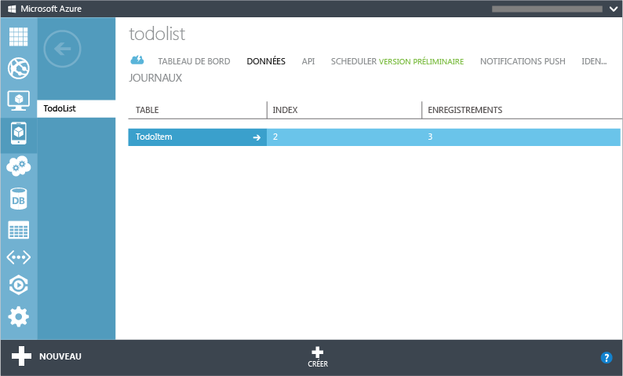
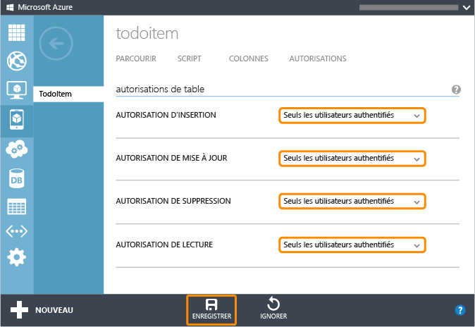

<properties linkid="develop-mobile-tutorials-get-started-with-users-xamarin-android" urlDisplayName="Get Started with Authentication (Xamarin.Android)" pageTitle="Get started with authentication (Xamarin.Android) - Mobile Services" metaKeywords="Azure registering application, Azure authentication, application authenticate, authenticate mobile services, Mobile Services Xamarin.Android" description="Learn how to use authentication in your Azure Mobile Services app for Xamarin.Android." metaCanonical="" disqusComments="1" umbracoNaviHide="1" title="Get started with authentication in Mobile Services" documentationCenter="Mobile" authors="" />

Prise en main de l'authentification dans Mobile Services
========================================================

[Windows Store C\#](/en-us/develop/mobile/tutorials/get-started-with-users-dotnet "Windows Store C#")[Windows Store JavaScript](/en-us/develop/mobile/tutorials/get-started-with-users-js "Windows Store JavaScript")[Windows Phone](/en-us/develop/mobile/tutorials/get-started-with-users-wp8 "Windows Phone")[iOS](/en-us/develop/mobile/tutorials/get-started-with-users-ios "iOS")[Android](/en-us/develop/mobile/tutorials/get-started-with-users-android "Android")[HTML](/en-us/develop/mobile/tutorials/get-started-with-users-html "HTML")[Xamarin.iOS](/en-us/develop/mobile/tutorials/get-started-with-users-xamarin-ios "Xamarin.iOS")[Xamarin.Android](/en-us/develop/mobile/tutorials/get-started-with-users-xamarin-android "Xamarin.Android")

Cette rubrique montre comment authentifier les utilisateurs dans Azure Mobile Services à partir de votre application Xamarin.Android. Dans ce didacticiel, vous allez ajouter l'authentification au projet de démarrage rapide à l'aide d'un fournisseur d'identité pris en charge par Mobile Services. Après avoir été authentifiée et autorisée par Mobile Services, la valeur de l'ID utilisateur s'affiche.

Ce didacticiel vous familiarise avec les étapes de base permettant d'activer l'authentification dans votre application :

1.  [Inscription de votre application pour l'authentification et configuration de Mobile Services](#register)
2.  [Restriction des autorisations de table pour les utilisateurs authentifiés](#permissions)
3.  [Ajout de l'authentification à l'application](#add-authentication)

Ce didacticiel est basé sur le démarrage rapide de Mobile Services. Vous devez aussi d'abord suivre le didacticiel [Prise en main de Mobile Services](/en-us/develop/mobile/tutorials/get-started-xamarin-android).

[Xamarin.Android] et le Kit de développement logiciel (SDK) Android 4.2 ou une version ultérieure sont requis pour suivre ce didacticiel.

Inscription de votre applicationInscription de votre application pour l'authentification et configuration de Mobile Services
----------------------------------------------------------------------------------------------------------------------------

Pour pouvoir authentifier les utilisateurs, vous devez inscrire votre application avec un fournisseur d'identité. Vous devez ensuite inscrire la clé secrète cliente générée par le fournisseur avec Mobile Services.

1.  Connectez-vous au [portail de gestion Azure](https://manage.windowsazure.com/), cliquez sur **Mobile Services**, puis sur le service mobile.

      

2.  Cliquez sur l'onglet **Tableau de bord**, puis notez la valeur **URL du site**.

      

    Il se peut que le fournisseur d'identité vous demande cette valeur lorsque vous inscrivez votre application.

3.  Choisissez un fournisseur d'identité pris en charge dans la liste ci-dessous et suivez la procédure pour inscrire votre application auprès de ce fournisseur :

 - [Compte Microsoft](/en-us/develop/mobile/how-to-guides/register-for-microsoft-authentication/)
 - [Connexion Facebook](/en-us/develop/mobile/how-to-guides/register-for-facebook-authentication/)
 - [Connexion Twitter](/en-us/develop/mobile/how-to-guides/register-for-twitter-authentication/)
 - [Connexion Google](/en-us/develop/mobile/how-to-guides/register-for-google-authentication/)
 - [Azure Active Directory](/fr-fr/documentation/articles/mobile-services-how-to-register-active-directory-authentication/)

    N'oubliez pas de noter les valeurs de l'identité du client et de la clé secrète cliente générées par le fournisseur.

    **Remarque relative à la sécurité**

    La clé secrète générée par le fournisseur est une information d'identification de sécurité importante. Ne partagez pas cette clé secrète avec quiconque et ne la distribuez pas avec votre application.

1.  De retour dans le portail de gestion, cliquez sur l'onglet **Identité**, entrez les valeurs de l'identificateur d'application et de la clé secrète partagée fournies par votre fournisseur d'identité, puis cliquez sur **Enregistrer**.

      

Votre service mobile et votre application sont désormais configurés pour utiliser le fournisseur d'authentification choisi.

Restriction des autorisationsRestriction des autorisations pour les utilisateurs authentifiés
---------------------------------------------------------------------------------------------

1.  Dans le portail de gestion, cliquez sur l'onglet **Données**, puis sur la table **TodoItem**.

      

2.  Cliquez sur l'onglet **Autorisations**, définissez toutes les autorisations sur **Seuls les utilisateurs authentifiés**, puis cliquez sur **Enregistrer**. Cela permet de s'assurer que toutes les opérations effectuées sur la table **TodoItem** requièrent un utilisateur authentifié. Cela simplifie aussi les scripts dans le didacticiel suivant, car il ne sera pas nécessaire d'autoriser la possibilité d'utilisateurs anonymes.

      

3.  Dans Eclipse, ouvrez le projet que vous avez créé avec le didacticiel [Prise en main de Mobile Services](/en-us/develop/mobile/tutorials/get-started-xamarin-android).

4.  Dans le menu **Exécuter**, cliquez sur **Exécuter** pour démarrer l'application ; vérifiez qu'une exception non prise en charge avec le code d'état 401 (Non autorisé) est générée après le démarrage de l'application.

    Cela se produit, car l'application essaye d'accéder à Mobile Services en tant qu'utilisateur non authentifié, mais la table *TodoItem* requiert désormais l'authentification.

Ensuite, vous allez mettre à jour l'application pour authentifier les utilisateurs avant de demander des ressources à partir du service mobile.

Ajout de l'authentificationAjout de l'authentification à l'application
----------------------------------------------------------------------

1.  Ajoutez la méthode suivante à la classe **TodoActivity** :

             private async Task Authenticate()
             {
                 try
                 {
                     user = await client.LoginAsync(this, MobileServiceAuthenticationProvider.MicrosoftAccount);
                     CreateAndShowDialog(string.Format("you are now logged in - {0}", user.UserId), "Logged in!");
                 }
                 catch (Exception ex)
                 {
                     CreateAndShowDialog(ex, "Authentication failed");
                 }
             }

    Cela crée une méthode pour gérer le processus d'authentification. L'utilisateur est authentifié à l'aide d'une connexion Microsoft Account. Une boîte de dialogue affiche l'identifiant de l'utilisateur authentifié. Vous ne pouvez pas poursuivre sans authentification positive.

    **Remarque**

    Si vous utilisez un fournisseur d'identité autre que Microsoft, remplacez la valeur transmise à la méthode **login** ci-dessus par l'une des valeurs suivantes : *Facebook*, *Google* ou *Twitter*.

2.  Dans la méthode **OnCreate**, ajoutez la ligne de code qui suit après le code qui instancie l'objet `MobileServiceClient` :

        await Authenticate();

    Ceci démarre le processus d'authentification et l'attend de façon asynchrone.

3.  Déplacez le code restant après `await authenticate();` dans la méthode **onCreate** vers une nouvelle méthode **createTable** qui ressemble à ceci :

             private async Task CreateTable()
             {
                 // Obtenir l'instance de table du service mobile à utiliser
                 todoTable = client.GetTable<TodoItem>();

                 textNewTodo = FindViewById<EditText>(Resource.Id.textNewTodo);

                 // Créer un adaptateur pour lier les éléments à la vue
                 adapter = new TodoItemAdapter(this, Resource.Layout.Row_List_To_Do);
                 var listViewTodo = FindViewById<ListView>(Resource.Id.listViewTodo);
                 listViewTodo.Adapter = adapter;

                 // Charger les éléments à partir du service mobile
                 await RefreshItemsFromTableAsync();
             }

4.  Appelez ensuite la nouvelle méthode **CreateTable** dans **OnCreate** après l'appel **Authenticate** ajouté à l'étape 2 :

         await CreateTable();

5.  À partir du menu **Exécuter**, cliquez sur **Exécuter** pour démarrer l'application et vous connecter avec le fournisseur d'identité choisi.

      Lorsque vous êtes connecté, l'application doit s'exécuter sans erreur et vous devez pouvoir exécuter des requêtes Mobile Services et mettre à jour les données.

Téléchargement de l'exemple terminé
-----------------------------------

Téléchargez le [projet d'exemple terminé](http://go.microsoft.com/fwlink/p/?LinkId=331328). Veillez à mettre à jour les variables **applicationURL** et **applicationKey** avec vos propres paramètres Azure.

Étapes suivantes
----------------

Dans le didacticiel suivant, [Autorisation des utilisateurs avec des scripts](/en-us/develop/mobile/tutorials/authorize-users-in-scripts-xamarin-android), vous allez utiliser la valeur de l'ID utilisateur fournie par Mobile Services en fonction de l'utilisateur authentifié et l'utiliser pour filtrer les données renvoyées par Mobile Services.

